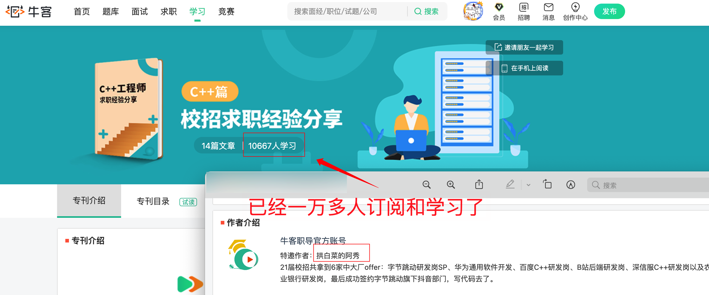
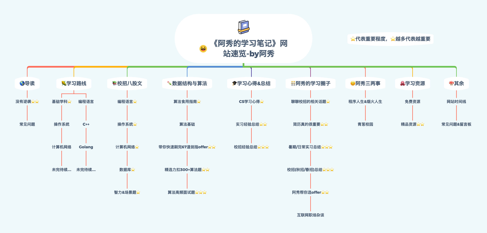

<h1 align="center">👉👉👉 Hướng dẫn đọc《Ghi chép học tập của A Tú》👈👈👈</h1>

>1. Xin chào, mình là A Tú, tốt nghiệp một trường đại học bình thường, giai đoạn 2021-2023 từng làm việc tại **Bộ phận Douyin của ByteDance** với vai trò **Kỹ sư phát triển Full-stack (Full-stack Developer)**, thiên về Backend nhiều hơn Frontend; năm 2023 chuyển sang làm việc tại **một công ty đa quốc gia (MNC)** tiếp tục làm **phát triển Full-stack**. Frontend hay Backend đều biết một chút, mỗi thứ vừa vặn biết một tẹo... Tech stack chính gồm C/C++, Golang, JavaScript, Vue,...
>
>Là một sinh viên xuất thân từ **trường song phi bình thường (trường đại học không thuộc Đề án 985/211) đã thành công trúng tuyển vào bộ phận cốt lõi của ByteDance**, mình thấu hiểu sâu sắc chặng đường này gian nan đến nhường nào, **đối với những bạn sinh viên trường bình thường giống như mình, để bứt phá vươn lên thực sự quá khó khăn**.
>
>Sau đó, mình quyết định ghi lại câu chuyện và các đúc kết của bản thân, chia sẻ kinh nghiệm tự học Khoa học Máy tính (CNTT) và những ghi chép học tập của mình, hy vọng kinh nghiệm & ghi chép của mình có thể tiếp thêm cho bạn trước màn hình một chút động lực & sự giúp ích. Hãy dành ra **10** phút để đọc thật kỹ, mình tin rằng website này tuyệt đối sẽ không làm bạn thất vọng ❤️.
>
>
>
>2. Nếu bạn là người mới bắt đầu (newbie), đang mông lung chưa tìm thấy phương hướng, xuất thân trường không có nhiều lợi thế (cao đẳng, đại học thường,...), không cam chịu bình thường muốn nỗ lực bứt phá một lần, hay đang thiếu động lực học tập... thì có thể đọc [Câu chuyện của A Tú](#hai-kinh-nghiệm-tự-học) hoặc tham gia [Cộng đồng học tập của A Tú](#bảy-cộng-đồng-học-tập-của-a-tú), mình sẽ ghi lại toàn bộ hành trình từ một sinh viên vô danh trường bình thường từng bước trưởng thành thành lập trình viên tại các Big Tech Internet hàng đầu cũng như những kinh nghiệm học tập, làm việc trong môi trường công nghệ. Mình tin những nội dung này có thể giúp bạn trở thành một kỹ sư công nghệ thông tin vững vàng.
>
>
>
>3. Lời nhắc nhỏ: 《Ghi chép học tập của A Tú》phù hợp cho **sinh viên mới tốt nghiệp tìm việc qua kỳ tuyển dụng trường học (Campus Recruitment)** cũng như **các bạn ứng tuyển theo diện tuyển dụng xã hội (Social Recruitment) đã tốt nghiệp trong vòng 3 năm**~ [Nhấn vào đây để xem thêm giải đáp thắc mắc / câu hỏi thường gặp](/notes/08-other/02-question.md)
>
>- **Các bạn ứng tuyển Campus Recruitment**: Khuyến khích đọc toàn bộ nội dung website, đặc biệt là [Chương 1: Lời mở đầu](/notes/01-guide/web-guide-reading.md), [Chương 2: Kinh nghiệm tự học](#hai-kinh-nghiệm-tự-học), [Chương 3: Lộ trình học tập (đã có nền tảng có thể bỏ qua)](#ba-lộ-trình-học-tập), [Chương 4: Bát cổ văn phỏng vấn tuyển dụng trường học](#bốn-bát-cổ-văn-phỏng-vấn-campus-recruitment), [Chương 5: Cấu trúc dữ liệu & Thuật toán](#năm-cấu-trúc-dữ-liệu-và-thuật-toán), [Chương 6: Đúc kết & Kinh nghiệm học tập](#sáu-đúc-kết--kinh-nghiệm-học-tập), và toàn bộ nội dung trong [Chương 7: Cộng đồng học tập của A Tú](#bảy-cộng-đồng-học-tập-của-a-tú) .
>- **Các bạn ứng tuyển Social Recruitment**: Có thể tập trung chủ lực vào toàn bộ nội dung của [Chương 4: Bát cổ văn phỏng vấn tuyển dụng trường học](#bốn-bát-cổ-văn-phỏng-vấn-campus-recruitment) và [Chương 5: Cấu trúc dữ liệu & Thuật toán](#năm-cấu-trúc-dữ-liệu-và-thuật-toán). Nội dung ở hai phần này vẫn hoàn toàn phù hợp và rất hữu ích cho các bạn ứng tuyển diện xã hội đã tốt nghiệp trong vòng 3 năm.

Bắt đầu từ năm **2013** khi học đại học, sau khi tốt nghiệp năm **2017** không tìm được việc làm, phải ra công trường xây tường, vác gạch, làm điện nước, đổ bê tông hơn nửa năm trời, mình cảm nhận sâu sắc đây không phải là cuộc sống mà mình mong muốn, và cũng không muốn tiếp tục như vậy mãi. Sau đó mình đã xin nghỉ việc và bắt đầu ôn thi cao học trước kỳ thi sơ tuyển đúng 3 tháng. Cuối cùng, thật may mắn khi qua đợt xét tuyển bổ sung (điều chuyển nguyện vọng) mình đã đỗ vào một trường đại học bình thường, tự giành lấy cho bản thân cơ hội làm lại cuộc đời.

Trong thời gian học đại học & thạc sĩ, mình từng làm cộng tác viên viết bài, viết web crawler (thu thập dữ liệu), lập trình vi điều khiển, vận hành cụm máy chủ GPU, dựng server, đăng ký bằng sáng chế & bản quyền phần mềm, công bố bài báo trên tạp chí SCI Q2, phát triển các dự án giao dịch... Mình luôn đam mê thử thách & không ngừng học tập. Một năm trước khi tốt nghiệp, mình nhận thức rất rõ xuất phát điểm trường học của bản thân thua xa các bạn thuộc nhóm trường **985/211**, cả về nền tảng lẫn môi trường học tập xung quanh đều không thể so sánh được. Để tránh rơi vào cảnh tốt nghiệp đồng nghĩa với thất nghiệp, và cũng vì không muốn phải quay lại công trường vác gạch nữa, mình quyết định bắt đầu **học tập một cách có hệ thống các kiến thức nền tảng Khoa học Máy tính** để chuẩn bị tìm việc. Thật may mắn, kết quả cuối cùng đã được đền đáp xứng đáng.

Trong đợt tuyển dụng mùa thu (Autumn Recruitment) ngành Internet, mình đã tham gia hơn **60** buổi thi viết trực tuyến (Online Assessment), phỏng vấn hơn **40** doanh nghiệp, trải qua hơn **110** vòng phỏng vấn (từ vòng 1, vòng 2, vòng 3 đến HR), trong đó có hơn **100** vòng phỏng vấn kỹ thuật (Technical Interview) và khoảng **10** vòng HR. Những công ty lớn mà bạn từng nghe tên như Baidu, Alibaba, Tencent, Meituan, Didi, ByteDance, Yuanfudao, Huawei,... mình đều từng phỏng vấn qua. Cuối cùng, mình đã thuận lợi giành được **offer** từ 6 doanh nghiệp vừa và lớn, bao gồm **Huawei, Baidu, ByteDance SP**, và quyết định ký hợp đồng ba bên (Tripartite Agreement) với **Bộ phận Douyin của ByteDance**.

Sau khi ký hợp đồng, mình còn nhận lời mời từ Nowcoder (Ngưu Khách) viết một <a href="https://www.nowcoder.com/tutorial/10043/index" target="_blank">**Chuyên đề hướng dẫn tìm việc mùa tuyển dụng trường học**</a>, chia sẻ những bài học xương máu và con đường mình đã đi qua, chuyên đề này đã có hơn **10.000** người đăng ký học tập.

  

Khi viết chuyên đề trên, mình đang là sinh viên năm cuối thạc sĩ, câu chữ hành văn vẫn chưa thực sự chín muồi. Sau này, khi viết nhiều bài hơn, chia sẻ nhiều nội dung hơn, ngòi bút của mình đã dần hoàn thiện hơn. Sau khi đi làm, mình đã chắt lọc, tổng hợp lại toàn bộ nội dung từ chuyên đề ngày trước và đưa vào website này. **Tại website này, bạn có thể học hỏi toàn bộ kinh nghiệm và tổng kết quý báu ngày trước của mình**.

Mình hiểu rất rõ rằng, để có thể đi được đến ngày hôm nay hoàn toàn dựa vào việc **bản thân chủ động chuẩn bị từ sớm**, chứ chắc chắn không phải nhờ vào cái mác **trường đại học song phi bình thường**. Khi những người xung quanh còn chưa có ý thức về việc chuẩn bị tìm việc, mình đã **bắt đầu tự học & chuẩn bị một cách bài bản**. Đến mức khi mình nhận được offer của Huawei thì bạn bè xung quanh thậm chí còn chưa bắt đầu nộp CV. Nếu mình cũng như họ, cứ **như ếch ngồi trong nồi nước ấm, nước đến chân mới nhảy**, thì chắc chắn sẽ không thể có được mình của ngày hôm nay.

Sau khi tốt nghiệp, mình vẫn duy trì thói quen học tập: tận dụng đêm muộn sau giờ làm việc, cuối tuần và các kỳ nghỉ lễ để không ngừng trau dồi bản thân. Mình hiểu rõ trong ngành Internet, không có nhiều cách để **duy trì năng lực cạnh tranh cốt lõi**, và **duy trì việc học tập liên tục** là một trong những cách mang lại hiệu quả cao nhất (tỷ suất sinh lời cao nhất), bởi vì mình thực sự không muốn phải quay về công trường xách xô vác gạch nữa.

Ngoài ra, mỗi ngày sau khi tan làm, mình cũng dành ra **30 phút** để giải đáp miễn phí cho các bạn sinh viên đại học và cao học từng mông lung, mất phương hướng giống như mình trước đây. **Chỉ những ai từng đi qua con đường này mới hiểu nó gian nan đến nhường nào**. Về sau, mình đã tổng hợp lại các ghi chép học tập cá nhân và mã nguồn mở chia sẻ rộng rãi, từ đó hình thành nên bộ ghi chép học tập này, với hy vọng có thể cùng bạn đồng hành, cùng tiến bộ và cùng nhau bứt phá vươn lên.

---

⏰ **Lời nhắc thân mật**

1. Nội dung trên website này, trừ khi có ghi chú đặc biệt, đều là **nguyên tác cá nhân của A Tú**. Nếu cần trích dẫn/đăng lại, vui lòng liên hệ trực tiếp với A Tú và ghi rõ nguồn gốc xuất xứ. Nếu phát hiện hành vi sao chép ác ý hoặc re-up trái phép, mình sẽ sử dụng các biện pháp pháp lý để bảo vệ quyền lợi hợp pháp của mình. Một môi trường sáng tạo nội dung kỹ thuật lành mạnh cần sự chung tay gìn giữ của tất cả chúng ta!

2. Trong quá trình đọc blog này, nếu bạn phát hiện lỗi sai về `nội dung`, `hình ảnh`, `mã nguồn`... có thể gửi phản hồi qua Issue hoặc Pull Request (PR). A Tú luôn kiểm tra repository mỗi ngày và liên tục hoàn thiện tài liệu. Cảm ơn sự ủng hộ của bạn, xem hướng dẫn đóng góp sửa lỗi [tại đây](/notes/08-other/02-question.md#_2、发现错误-如何勘误校对).

3. Nếu trong quá trình học tập nội dung trên website gặp vấn đề khiến bạn băn khoăn hoặc không thể tự hiểu/giải quyết được, có thể [nhấn vào đây để liên hệ với A Tú](/notes/08-other/02-question.md#_4、阿秀-如何才能联系到你), cùng nhau trao đổi, cùng nhau tiến bộ và cùng nhau phát triển nhé 👬🏻!

## I. Tổng quan kiến thức trên website

Mục đích ban đầu khi xây dựng website này là giúp **những người mới bắt đầu trong ngành Khoa học Máy tính (CNTT) / người mới nhập môn / người đang tìm kiếm việc làm**. Vì vậy, phần lớn nội dung mình tổng hợp và biên soạn đều xoay quanh việc chuẩn bị phỏng vấn và tìm việc, hy vọng những "cạm bẫy" mình từng bước qua người đi sau sẽ không giẫm phải nữa, và những kiến thức mình từng học có thể giúp đỡ các bạn từng bước vững chắc trưởng thành 🌹🌹🌹!

Mình đã chứng kiến rất nhiều tấm gương người mới bắt đầu, sinh viên trái ngành chuyển hướng thành công sang CNTT. Điểm chung lớn nhất ở họ là sự kiên trì, chịu được thử thách và luôn tiến bước từng bước một. Bạn có thể xem các bài **Tổng kết Campus Recruitment** và **Chia sẻ thực tập** trong [Cộng đồng học tập của A Tú](/notes/05-xiustar/01-xiustar_reading_guide/01-introduce.md#阿秀组建了一个校招学习圈子). Họ hầu như không bao giờ đọc những cuốn sách sáo rỗng như "Học Java trong 7 ngày" hay "21 ngày thành thạo C++". Không có thành công nào đến sau một đêm, tất cả đều là nỗ lực tích lũy từng bước, vững chắc và bài bản.

Dưới đây là phần giới thiệu tổng quan về dàn ý kiến thức trên website, chủ yếu được chia thành các phần:

- 🌎 **Lời mở đầu**: Phần này giải thích tổng quan về nguồn gốc của website, bao gồm lý do ra đời trang web, chi tiết hành trình tự học của bản thân (từ lúc nhen nhóm ý định tự học đến khi bắt tay vào thực tế, bắt đầu tự học có hệ thống cũng như thứ tự học tập các môn học cụ thể...), cùng giải đáp một số thắc mắc, câu hỏi thường gặp của các bạn trong quá trình sử dụng website.
- 🌽 [**Lộ trình học tập**](#ba-lộ-trình-học-tập): Phần này được thiết kế dành riêng cho người mới bắt đầu, do A Tú biên soạn & duy trì dựa trên kinh nghiệm học tập của bản thân cùng trải nghiệm của các thành viên trong [Cộng đồng học tập của A Tú](#bảy-cộng-đồng-học-tập-của-a-tú). Nếu bạn đã có kinh nghiệm hoặc đã nắm vững kiến thức cơ bản thì có thể bỏ qua; nếu là người mới bắt đầu thì nên tham khảo kỹ. Lộ trình được thiết kế bám sát nhu cầu tìm việc, chia làm hai mảng lớn: Môn cơ sở & Ngôn ngữ lập trình;
  - Môn cơ sở: Đối với các bạn ứng tuyển vị trí kỹ thuật qua Campus Recruitment, dù định hướng làm Frontend (JavaScript, Vue, React,...) hay Backend (Java, C++, Golang, PHP,...), các kiến thức thuộc môn cơ sở đều cần phải học một cách có hệ thống, bởi đây là các môn học nền tảng chung, thuộc về "nội công" của lập trình viên, **tuyệt đối không được bỏ qua**!
  - Ngôn ngữ lập trình: Các vị trí kỹ thuật trong ngành CNTT chủ yếu chia thành Frontend & Backend. Trong đó Frontend chủ yếu sử dụng JavaScript, TypeScript, với framework phổ biến là Vue hoặc React; Backend chủ yếu dùng Java, C++, Golang,... Đối với sinh viên ứng tuyển tuyển dụng trường học, **chỉ cần chọn một ngôn ngữ làm chủ lực để học sâu, không cần phải học hết tất cả, hãy nhớ kỹ điều này**!
- 📚︎ [**Bát cổ văn phỏng vấn Campus Recruitment**](#bốn-bát-cổ-văn-phỏng-vấn-campus-recruitment): Chương này cùng với phần 《[Cấu trúc dữ liệu & Thuật toán](#năm-cấu-trúc-dữ-liệu-và-thuật-toán)》 là **nội dung cốt lõi** của website, phù hợp cho **sinh viên ứng tuyển Campus Recruitment** cũng như **ứng viên Social Recruitment đã tốt nghiệp trong vòng 3 năm**. Nội dung được chắt lọc từ **ghi chép học tập cá nhân & các bài viết trước đây trên WeChat Official Account của A Tú**, tập trung vào các chủ đề trọng tâm chắc chắn gặp khi phỏng vấn: [Ngôn ngữ lập trình](#_1-ngôn-ngữ-lập-trình-) và kiến thức nền tảng máy tính: [Hệ điều hành](#_2-hệ-điều-hành-), [Mạng máy tính](#_3-mạng-máy-tính-), [Cơ sở dữ liệu](#_4-cơ-sở-dữ-liệu-), [Câu hỏi tư duy logic & Tình huống thực tế](#_5-câu-hỏi-tư-duy-logic--tình-huống-thực-tế-),...
- 🍡 [**Cấu trúc dữ liệu & Thuật toán**](#năm-cấu-trúc-dữ-liệu-và-thuật-toán): Hiện nay hầu hết các buổi phỏng vấn Campus Recruitment và Social Recruitment (dưới 3 năm kinh nghiệm) đều yêu cầu làm bài tập thuật toán (Coding Interview), viết code trực tiếp (Live Coding / Whiteboard) đã trở thành quy trình bắt buộc. Khi chuẩn bị phỏng vấn, A Tú đã luyện khoảng 3 lượt bộ "Kiếm Chỉ Offer" (Sword Offer), giải hơn 600+ bài LeetCode, sau đó đúc kết và chia sẻ công khai, cụ thể gồm: [Hướng dẫn luyện nhanh 67 câu Kiếm Chỉ Offer](#_3-hướng-dẫn-luyện-nhanh-67-câu-kiếm-chỉ-offer-sword-offer-), [Tuyển chọn 300+ bài tập thuật toán LeetCode](#_4-tuyển-chọn-300-bài-tập-thuật-toán-leetcode-), [Các câu hỏi thuật toán tần suất cao trong phỏng vấn](#_5-các-câu-hỏi-thuật-toán-tần-suất-cao-trong-phỏng-vấn-).
- 🎓 [**Đúc kết & Kinh nghiệm học tập**](#sáu-đúc-kết--kinh-nghiệm-học-tập): Phần này chủ yếu chia sẻ kinh nghiệm tự học CNTT của bản thân A Tú cùng kinh nghiệm thực tập, kinh nghiệm phỏng vấn Campus Recruitment từ các thành viên trong [Cộng đồng học tập của A Tú](#bảy-cộng-đồng-học-tập-của-a-tú). Nếu bạn cũng đang chuẩn bị phỏng vấn, hãy tham khảo nhiều trải nghiệm của người đi trước.
- 🧑‍🤝‍🧑 [**Cộng đồng học tập của A Tú**](#bảy-cộng-đồng-học-tập-của-a-tú): Đây là **cộng đồng học tập nơi A Tú cùng các bạn sinh viên đại học & cao học gắn kết, hỗ trợ lẫn nhau**, bao gồm nhưng không giới hạn ở: chuẩn bị sớm, xây dựng CV, thực tập thường kỳ, tìm việc tuyển dụng trường học, cân nhắc chọn offer, tản mạn kinh nghiệm làm việc tại Big Tech... Độc hành một mình chi bằng cùng nhau sưởi ấm!
- 😊 [**Đôi điều về A Tú**](#tám-đôi-điều-về-a-tú): Phần này chia sẻ các bài viết đời sống cá nhân của A Tú, chủ yếu gồm: Đời lập trình, Ký ức thanh xuân vườn trường,...
- 🐙 [**Tài nguyên học tập**](#chín-tài-nguyên-học-tập): Trong gần 10 năm học tập Khoa học Máy tính, mình đã tích lũy được rất nhiều tài liệu chất lượng cao, phần lớn đều là tài liệu A Tú từng trực tiếp sử dụng, chia sẻ lại hoàn toàn cho cộng đồng.
- 🍄 [**Khác**](#mười-khác): Bao gồm nhật ký phát triển website, các câu hỏi thường gặp khi sử dụng, bảng tin nhắn để lại phản hồi...

## II. Kinh nghiệm tự học

Nội dung chính của website này được tổng hợp từ quá trình A Tú bắt đầu tự học máy tính bài bản trong một năm trước kỳ tuyển dụng trường học, các ghi chép trong quá trình ôn luyện tìm việc & các bài viết về Campus Recruitment trên WeChat Official Account của A Tú: [Thác Bạt A Tú (拓跋阿秀)](https://mp.weixin.qq.com/s/_EJAvdWl-6M0J7EQP0ct7A), về sau được bổ sung liên tục các ghi chép học tập, chia sẻ kinh nghiệm, bài tổng kết tuyển dụng mùa thu & thực tập từ các thành viên trong [Cộng đồng học tập của A Tú](#bảy-cộng-đồng-học-tập-của-a-tú).

### 1. Không có chuyện lội ngược dòng thần kỳ ⭐⭐

- Địa chỉ: [Không có chuyện lội ngược dòng thần kỳ, chỉ có một chút kiên trì mà thôi](/notes/05-xiustar/05-campus_recruitment/2021-05-17-没有什么逆袭，有的只是一点点坚持而已.md)
- Giới thiệu: Hồi tưởng và mô tả lại một cách hệ thống quá trình tự học lập trình của A Tú, bao gồm các chi tiết khi tìm việc, diễn biến tâm lý... Ngoài ra còn đính kèm bài viết tổng kết tuyển dụng mùa thu: [Tổng kết con đường tuyển dụng mùa thu của thạc sĩ trường bình thường (Đã nhận SP vị trí R&D Douyin)](/notes/05-xiustar/05-campus_recruitment/2020-12-16-双非渣硕的秋招之路总结（已拿抖音研发岗SP）.md)

### 2. Câu hỏi thường gặp

- Địa chỉ: [Câu hỏi thường gặp](/notes/08-other/02-question.md)
- Giới thiệu: Trong quá trình bạn đọc & sử dụng nội dung website có thể sẽ xuất hiện những thắc mắc & băn khoăn, tại đây A Tú đưa ra lời giải đáp và phản hồi thống nhất.

## III. Lộ trình học tập

🔥 Có thể có nhiều bạn sinh viên đang theo học, người mới bắt đầu, các bạn trái ngành chuyển hướng sang CNTT thời gian đầu chưa biết nên học những gì, cũng như chưa rõ nên sắp xếp tiến độ học tập ra sao.

Vì vậy, A Tú đã dày công xây dựng và duy trì một **Lộ trình học tập Khoa học Máy tính (CS Roadmap)**. Khác với repository `developer-roadmap`, lộ trình này tập trung sâu hơn cho **người mới bắt đầu học máy tính**, cụ thể là **sinh viên cử nhân & thạc sĩ các trường đại học thông thường** cũng như **các bạn chuyển ngành sang máy tính từ các khối ngành khác (như Hóa học, Sinh học, Vật liệu, Môi trường...)**, hay nói thẳng ra đây là **lộ trình định hướng trực tiếp phục vụ nhu cầu tìm kiếm việc làm**.

### 1. Môn cơ sở ⭐

- Địa chỉ: [⭐ Môn cơ sở](/notes/02-learning_route/01-basic-project/01-introduce.md) 
- Giới thiệu: Môn cơ sở là nội dung mà bất kỳ ai làm việc ở các vị trí kỹ thuật ngành Internet đều bắt buộc phải học, dù là Frontend hay Backend, dù viết JavaScript hay Java, C++, Golang, PHP,... tiêu biểu như Hệ điều hành, Mạng máy tính...

### 2. Ngôn ngữ lập trình

- Địa chỉ: [Ngôn ngữ lập trình](/notes/02-learning_route/02-language/01-introduce.md)
- Giới thiệu: Phỏng vấn tuyển dụng trường học chủ yếu đánh giá tiềm năng của sinh viên. Bên cạnh kiến thức cơ bản bắt buộc phải hỏi, bạn cần có một ngôn ngữ lập trình chủ lực. Ngôn ngữ lập trình thường được chia thành **ngôn ngữ Frontend** và **ngôn ngữ Backend** như C++, Java, Golang,...

## IV. Bát cổ văn phỏng vấn Campus Recruitment

### **1. Ngôn ngữ lập trình ⭐**

- Địa chỉ: [Ngôn ngữ lập trình](/notes/03-hunting_job/02-interview/01-01-01-basic.md)
- Giới thiệu: Tổng hợp các câu hỏi phỏng vấn thường gặp & đáp án tham khảo về mảng ngôn ngữ lập trình (như C++...) do A Tú tự đúc kết trong quá trình học tập và tham gia phỏng vấn tìm việc mùa thu.

### **2. Hệ điều hành ⭐**

- Địa chỉ: [Hệ điều hành](/notes/03-hunting_job/02-interview/02-01-os.md)
- Giới thiệu: Tổng hợp các câu hỏi phỏng vấn thường gặp & đáp án tham khảo về Hệ điều hành (như Process & Thread, Deadlock, Quản lý bộ nhớ...) do A Tú đúc kết.

### **3. Mạng máy tính ⭐**

- Địa chỉ: [Mạng máy tính](/notes/03-hunting_job/02-interview/03-01-net.md)
- Giới thiệu: Tổng hợp các câu hỏi phỏng vấn thường gặp & đáp án tham khảo về Mạng máy tính (như 3-way Handshake / 4-way Wave, TCP/UDP, HTTP/HTTPS...) do A Tú đúc kết.

### **4. Cơ sở dữ liệu ⭐**

- Địa chỉ: [Cơ sở dữ liệu](/notes/03-hunting_job/02-interview/04-01-01-MySQL.md)
- Giới thiệu: Tổng hợp các câu hỏi phỏng vấn thường gặp & đáp án tham khảo về Cơ sở dữ liệu (như MySQL, Redis, Index, Transaction, Lock...) do A Tú đúc kết.

### **5. Câu hỏi tư duy logic & Tình huống thực tế ⭐**

- Địa chỉ: [Câu hỏi tư duy & Tình huống thực tế](/notes/03-hunting_job/02-interview/06-intelligence.md)
- Giới thiệu: Tổng hợp các câu hỏi phỏng vấn thường gặp & đáp án tham khảo về câu hỏi tư duy logic & thiết kế tình huống (như bài toán đốt dây của Google, bài toán đua ngựa của Tencent...) do A Tú đúc kết.

### **6. Các dạng câu hỏi phỏng vấn khác ⭐**

- Địa chỉ: [Các dạng câu hỏi phỏng vấn khác](/notes/03-hunting_job/02-interview/07-01-massive_data.md)
- Giới thiệu: Tổng hợp các câu hỏi phỏng vấn kỹ thuật khác nằm ngoài các ghi chép trên, như xử lý dữ liệu lớn (Massive Data Processing) và thiết kế hệ thống (System Design).

## V. Cấu trúc dữ liệu và Thuật toán

### **1. Hướng dẫn luyện thuật toán ⭐**

- Địa chỉ: [Hướng dẫn luyện thuật toán](/notes/03-hunting_job/03-algorithm/01-basic-algorithm/01-introduce.md)
- Giới thiệu: Khi chuẩn bị tìm việc trước đây, A Tú đã luyện khoảng 3 lượt bộ "Kiếm Chỉ Offer" (Sword Offer), giải hơn 600+ bài LeetCode. Tại đây đưa ra lời khuyên & định hướng luyện đề thuật toán phù hợp cho các nhóm đối tượng và nền tảng khác nhau.

### **2. Thuật toán cơ bản**

- Địa chỉ: [Thuật toán cơ bản](/notes/03-hunting_job/03-algorithm/01-basic-algorithm/02-algorithm-basic.md)
- Giới thiệu: Một số kiến thức thuật toán cơ bản, chẳng hạn như thuật toán sắp xếp ổn định (Stable Sort), sắp xếp không ổn định (Unstable Sort) và 10 thuật toán sắp xếp phổ biến nhất.

### **3. Hướng dẫn luyện nhanh 67 câu Kiếm Chỉ Offer (Sword Offer) ⭐⭐**

- Địa chỉ: [Hướng dẫn luyện nhanh 67 câu Kiếm Chỉ Offer](/notes/03-hunting_job/03-algorithm/02-sword-offer/01-introduce.md)
- Giới thiệu: Nhật ký giải đề "Kiếm Chỉ Offer" của cá nhân A Tú trước đợt tuyển dụng mùa thu, rất nhiều bài trong số đó từng được luyện lại đến lần thứ 4 hoặc thứ 5.

### **4. Tuyển chọn 300+ bài tập thuật toán LeetCode ⭐⭐**

- Địa chỉ: [Tuyển chọn 300+ bài tập thuật toán LeetCode](/notes/03-hunting_job/03-algorithm/03-leetcode/01-introduce.md)
- Giới thiệu: Tổng hợp và hệ thống hóa ghi chép giải bài trên LeetCode của A Tú trước kỳ tuyển dụng mùa thu, được phân loại luyện tập theo 13 nhãn chủ đề như `Mảng (Array)`, `Chuỗi (String)`, `Quy hoạch động (Dynamic Programming)`, `Danh sách liên kết (Linked List)`...

### **5. Các câu hỏi thuật toán tần suất cao trong phỏng vấn ⭐⭐⭐**

- Địa chỉ: [Các câu hỏi thuật toán tần suất cao trong phỏng vấn](/notes/03-hunting_job/03-algorithm/04-high_frquency_algorithm/01-high_frquency_algorithm.md)
- Giới thiệu: Trải qua gần 60 buổi phỏng vấn mùa thu, A Tú nhận thấy có một số bài toán thuật toán xuất hiện với tần suất cực kỳ cao. Phần này điểm lại các bài toán thuật toán viết code trực tiếp (Live Coding) có tần suất xuất hiện cao nhất trong phỏng vấn tại các Big Tech Internet.

## VI. Đúc kết & Kinh nghiệm học tập

### **1. Đúc kết kinh nghiệm học Khoa học Máy tính (CS) ⭐**

- Địa chỉ: [Đúc kết kinh nghiệm học CS](/notes/04-experience/01-learn_experience/01-introduce.md)
- Giới thiệu: Dù học đúng chuyên ngành, nhưng việc học lập trình máy tính của A Tú phần lớn đều dựa vào tự học. Tại đây mình chia sẻ ngắn gọn một số kinh nghiệm và phương pháp tự học của bản thân.

### **2. Tổng kết kinh nghiệm thực tập ⭐⭐**

- Địa chỉ: [Tổng kết kinh nghiệm thực tập](/notes/05-xiustar/04-school_practice/20220320-从公司角度来看，为什么要招实习生.md)
- Giới thiệu: Trên đời có thể không có hai chiếc lá hoàn toàn giống nhau, nhưng chắc chắn có rất nhiều chiếc lá tương tự nhau. Những ứng viên giành được offer thực tập thành công đều có rất nhiều điểm tương đồng. Đây là tổng hợp kinh nghiệm nhận offer thực tập của các bạn sinh viên năm 2, năm 3, năm 4 cũng như học viên cao học năm 1, năm 2 trong [Cộng đồng học tập của A Tú](/notes/05-xiustar/01-xiustar_reading_guide/01-introduce.md), ví dụ: [Sư đệ đi thực tập tại NetEase rồi](/notes/05-xiustar/04-school_practice/20210826-师弟去网易实习了.md), [Kinh nghiệm học tập và phỏng vấn của học đệ năm 3, cậu ấy rất chín chắn](/notes/05-xiustar/04-school_practice/20210702-大三学弟的学习面试经验，他很成熟.md), [Đứng từ góc độ công ty, vì sao lại cần tuyển thực tập sinh?](/notes/05-xiustar/04-school_practice/20220320-从公司角度来看，为什么要招实习生.md)...

### **3. Tổng kết kinh nghiệm Campus Recruitment ⭐⭐⭐**

- Địa chỉ: [Tổng kết kinh nghiệm Campus Recruitment](/notes/05-xiustar/05-campus_recruitment/2020-12-16-双非渣硕的秋招之路总结（已拿抖音研发岗SP）.md)
- Giới thiệu: Tương tự như thực tập, trên đời có thể không có hai chiếc lá hoàn toàn giống nhau, nhưng có rất nhiều chiếc lá tương tự nhau. Đọc nhiều kinh nghiệm của những người đi trước đã đỗ vào Big Tech sẽ giúp bạn bước đi vững vàng hơn! Dưới đây là tổng kết kinh nghiệm nhận offer chính thức của các bạn sinh viên trong [Cộng đồng học tập của A Tú](/notes/05-xiustar/01-xiustar_reading_guide/01-introduce.md), ví dụ: [Tổng kết con đường tuyển dụng mùa thu của thạc sĩ trường bình thường (Đã nhận SP vị trí R&D Douyin)](/notes/05-xiustar/05-campus_recruitment/2020-12-16-双非渣硕的秋招之路总结（已拿抖音研发岗SP）.md), [Hành trình tự học trọn vẹn của A Tú - Không có chuyện lội ngược dòng thần kỳ, chỉ có một chút kiên trì mà thôi](/notes/05-xiustar/05-campus_recruitment/2021-05-17-没有什么逆袭，有的只是一点点坚持而已.md), [Offer của mình hầu hết đều là SP, tổng kết 3 năm cao học](/notes/05-xiustar/05-campus_recruitment/20211026-我的offer基本全是SP，研究生三年总结.md), [Một cô bạn dễ thương: Năm 4 trượt cao học, sau đó đỗ kỳ tuyển dụng trường học vào ByteDance làm lập trình viên Client](/notes/05-xiustar/05-campus_recruitment/20210726-一个萌妹子：大四考研又上岸字节IOS.md)...

## VII. Cộng đồng học tập của A Tú ⭐⭐

Đây là cộng đồng học tập do chính A Tú thành lập, -> [Xem thêm thông tin chi tiết](/notes/05-xiustar/01-xiustar_reading_guide/01-introduce.md#阿秀组建了一个校招学习圈子)

Sau khi tốt nghiệp, A Tú vẫn duy trì thói quen tự học nâng cao trình độ, ví dụ như bài tổng kết học tập ngắn gọn vào năm thứ 2 sau khi đi làm: [Hôm qua, hôm nay và ngày mai, A Tú đã kiên trì tự học 135 ngày sau khi tốt nghiệp](/notes/05-xiustar/01-xiustar_reading_guide/20220427-%E6%98%A8%E5%A4%A9%E3%80%81%E4%BB%8A%E5%A4%A9%E5%92%8C%E6%98%8E%E5%A4%A9%EF%BC%8C%E7%A6%BB%E5%BC%80%E6%A0%A1%E5%9B%AD%E5%90%8E%E5%9D%9A%E6%8C%81%E5%AD%A6%E4%B9%A0135%E5%A4%A9%E4%BA%86.md). Thời gian trôi qua, ngày càng có nhiều bạn muốn cùng nhau học tập, vì vậy mình đã thành lập một cộng đồng học tập nhằm giúp các bạn giải đáp những vướng mắc trong quá trình học. Hiện tại, thành viên chủ yếu là sinh viên chuẩn bị cho kỳ tuyển dụng trường học, cùng một số nhân viên đang làm việc tại các Big Tech Internet (như ByteDance, Baidu, Huawei, Alibaba...), thạc sĩ du học sinh... Rất chào đón bạn tham gia 👉👉👉 -> [Cộng đồng học tập của A Tú](/notes/05-xiustar/01-xiustar_reading_guide/01-introduce.md#阿秀组建了一个校招学习圈子)!

Đúng như A Tú đã chia sẻ ở trên: "Trên đời không có hai chiếc lá hoàn toàn giống nhau, nhưng có rất nhiều chiếc lá tương tự nhau". Nếu bạn có thể tham khảo nhiều hơn những tấm gương đã thành công, tin rằng sẽ giúp ích rất nhiều cho bạn. Một mình độc hành đơn độc, chi bằng hãy cùng nhau kết bạn đồng hành!

### **1. Chia sẻ các chủ đề liên quan đến Campus Recruitment ⭐**

- Địa chỉ: [Chia sẻ các chủ đề liên quan đến Campus Recruitment](/notes/05-xiustar/02-campus_prepare/02-01-校招重要时间点科普.md)
- Giới thiệu: Kiến thức liên quan đến tuyển dụng trường học do A Tú và các bạn trong cộng đồng đúc kết, ví dụ: [Phổ biến các mốc thời gian quan trọng trong kỳ Tuyển dụng trường học](/notes/05-xiustar/02-campus_prepare/02-01-校招重要时间点科普.md), [Thuật ngữ & tiếng lóng thường gặp khi phỏng vấn](/notes/05-xiustar/02-campus_prepare/02-03-求职必知名词&黑话.md), [⭐ Đúc kết hơn 3 tháng và hơn 50 buổi phỏng vấn của A Tú cô đọng trong 6000 chữ](/notes/05-xiustar/02-campus_prepare/04-01-互联网面试总结.md), [Đợt nộp hồ sơ sớm (Early Bird) và lựa chọn thành phố làm việc](/notes/05-xiustar/02-campus_prepare/20210722-提前批和投递城市？值得聊聊.md)...

### **2. CV thực sự vô cùng quan trọng ⭐⭐**

- Địa chỉ: [CV thực sự vô cùng quan trọng](/notes/05-xiustar/03-resume/01-00-简历开篇词.md)
- Giới thiệu: Hướng dẫn chi tiết từng bước cách viết một bản CV ấn tượng, thuận lợi vượt qua vòng lọc hồ sơ (**Nhấn mạnh trọng tâm: CV quan trọng hơn rất nhiều so với những gì đa số mọi người nghĩ**), ví dụ: [CV quan trọng hơn nhiều so với bạn nghĩ](/notes/05-xiustar/03-resume/01-00-简历开篇词.md), [Toàn bộ quá trình chỉnh sửa và lặp lại 26 phiên bản CV mùa thu của A Tú - Làm thế nào để một bản CV tuyển dụng trường học bách phát bách trúng trải qua đúng 26 lần lặp?](/notes/05-xiustar/03-resume/01-01-一份百投百中的计算机校招简历是如何迭代足足26版的.md)...

### 3. Tổng kết thực tập hè / thực tập thường kỳ ⭐⭐

- Địa chỉ: [Tổng kết thực tập hè / thực tập thường kỳ](/notes/05-xiustar/04-school_practice/20220320-从公司角度来看，为什么要招实习生.md)
- Giới thiệu: Tổng kết kinh nghiệm nhận offer thực tập của các bạn sinh viên năm 2, năm 3, năm 4 cũng như học viên cao học năm 1, năm 2 trong [Cộng đồng học tập của A Tú](/notes/05-xiustar/01-xiustar_reading_guide/01-introduce.md), ví dụ: [Sư đệ đi thực tập tại NetEase rồi](/notes/05-xiustar/04-school_practice/20210826-师弟去网易实习了.md), [Kinh nghiệm học tập và phỏng vấn của học đệ năm 3, cậu ấy rất chín chắn](/notes/05-xiustar/04-school_practice/20210702-大三学弟的学习面试经验，他很成熟.md), [Đứng từ góc độ công ty, vì sao lại cần tuyển thực tập sinh?](/notes/05-xiustar/04-school_practice/20220320-从公司角度来看，为什么要招实习生.md)...

### **4. Tổng kết tuyển dụng trường học (Tuyển dụng Mùa thu / Mùa xuân) ⭐⭐⭐**

- Địa chỉ: [Tổng kết tuyển dụng trường học (Thu/Xuân)](/notes/05-xiustar/05-campus_recruitment/2020-12-16-双非渣硕的秋招之路总结（已拿抖音研发岗SP）.md)
- Giới thiệu: Tổng kết kinh nghiệm nhận offer chính thức của các bạn sinh viên trong [Cộng đồng học tập của A Tú](/notes/05-xiustar/01-xiustar_reading_guide/01-introduce.md), ví dụ: [Tổng kết con đường tuyển dụng mùa thu của thạc sĩ trường bình thường (Đã nhận SP vị trí R&D Douyin)](/notes/05-xiustar/05-campus_recruitment/2020-12-16-双非渣硕的秋招之路总结（已拿抖音研发岗SP）.md), [Hành trình tự học trọn vẹn của A Tú - Không có chuyện lội ngược dòng thần kỳ, chỉ có một chút kiên trì mà thôi](/notes/05-xiustar/05-campus_recruitment/2021-05-17-没有什么逆袭，有的只是一点点坚持而已.md), [Offer của mình hầu hết đều là SP, tổng kết 3 năm cao học](/notes/05-xiustar/05-campus_recruitment/20211026-我的offer基本全是SP，研究生三年总结.md), [Một cô bạn dễ thương: Năm 4 trượt cao học, sau đó đỗ kỳ tuyển dụng trường học vào ByteDance làm lập trình viên Client](/notes/05-xiustar/05-campus_recruitment/20210726-一个萌妹子：大四考研又上岸字节IOS.md)...

### **5. A Tú giúp bạn lựa chọn offer ⭐⭐**

- Địa chỉ: [A Tú giúp bạn lựa chọn offer](/notes/05-xiustar/06-offer/01-offer_choose.md)
- Giới thiệu: Nhận được offer thực tập / offer tuyển dụng chính thức nhưng phân vân không biết nên chọn bên nào? Đừng lo, A Tú sẽ giúp bạn đánh giá! Ví dụ: [Làm thế nào để đánh giá offer từ nhiều khía cạnh và chọn ra phương án phù hợp nhất với bản thân](/notes/05-xiustar/06-offer/01-offer_choose.md), [Nền tảng nội bộ Alibaba VS Backend Engine của Volcano Engine, so sánh thế nào?](/notes/05-xiustar/06-offer/20211123-阿里内部平台VS火山视频引擎后端，拿头比？.md)...

### **6. Tản mạn chốn công sở ngành Internet**

- Địa chỉ: [Tản mạn chốn công sở ngành Internet](/notes/05-xiustar/08-it_career/20210714-入职字节一周了.md) 
- Giới thiệu: Từ một sinh viên trở thành người đi làm, chuyển đổi vai trò là bước khởi đầu cho một hành trình mới! Kể từ khi gia nhập ByteDance, mình đã ghi lại những trải nghiệm & suy ngẫm trong quá trình làm việc tại các Big Tech Internet! Ví dụ: [Đã gia nhập ByteDance được một tuần](/notes/05-xiustar/08-it_career/20210714-入职字节一周了.md), [Đến ByteDance được một tháng, tóm gọn trong 4 chữ: Nghiêng trời lệch đất](/notes/05-xiustar/08-it_career/20210816-来字节一月了，四个字：翻天覆地.md), [Thấm thoát đã đến ByteDance được 6 tháng, thực sự rất khác biệt!](/notes/05-xiustar/08-it_career/20211223-转眼间就来字节六个月了，真的不一样！.md), [Hướng dẫn một bạn thực tập sinh, cảm nhận được cảm giác làm mẹ](/notes/05-xiustar/08-it_career/20220409-带了一个实习生，体会到当妈的感觉了.md)...

## VIII. Đôi điều về A Tú

### 1. Đời lập trình & Cuộc sống thường nhật

- Địa chỉ: [Cuộc sống thường nhật](/notes/06-about/01-myself/20210401-写文刚满100天，阿秀都有工作室了？还有钱请运营？.md) 
- Giới thiệu: Là một người lao động nỗ lực bươn chải tại các thành phố lớn tuyến đầu, mình ghi lại những nét mộc mạc, gần gũi của cuộc sống đời thường đan xen trong công việc bằng những dòng chữ chân thực. Ví dụ: [Đi học hơn 20 năm, cuối cùng cũng tốt nghiệp rồi](/notes/06-about/01-myself/20210624-读了二十多年书，终于毕业了.md), [Trường học -> Công sở, Sinh viên -> Người đi làm, Chúng mình đã bên nhau 1000 ngày rồi](/notes/06-about/01-myself/20210814-校园->职场，学生->打工人，我们在一起1000天啦.md), [Suýt chút nữa mình đã đi làm giáo viên cấp 3](/notes/06-about/01-myself/20210910-我差点去当高中老师了.md)...

### 2. Thời thanh xuân vườn trường

- Địa chỉ: [Thanh xuân vườn trường](/notes/06-about/02-school/2021012-在校2年，仅靠纯技术我赚到了12W.md)
- Giới thiệu: Ghi lại một cách mộc mạc những kỷ niệm đáng nhớ trong thời gian còn ngồi trên ghế nhà trường, có cả niềm vui lẫn nỗi buồn. Ví dụ: [2 năm ở trường, chỉ dựa vào thuần kỹ thuật mình đã kiếm được 120.000 NDT](/notes/06-about/02-school/2021012-在校2年，仅靠纯技术我赚到了12W.md), [Cảm nghĩ về việc tuyển sinh viên xét tuyển bổ sung cao học ngành máy tính gần đây | Cẩm nang xét tuyển nguyện vọng bổ sung cao học](/notes/06-about/02-school/20210315-近期招收计算机考研调剂学生有感|考研调剂指南.md)...

## IX. Tài nguyên học tập

### 1. Tài nguyên miễn phí

- Địa chỉ: [Tài nguyên miễn phí](/notes/07-resources/01-free/01-introduce.md)
- Giới thiệu: Ngay từ thời đại học, A Tú đã hình thành thói quen sưu tầm tài nguyên học tập: 4 năm đại học + 3 năm thạc sĩ, cho đến sau khi đi làm, trong gần 10 năm đó mình đã **tích lũy được rất nhiều tài nguyên học tập Khoa học Máy tính chất lượng cao**. Giờ đây mình chia sẻ tất cả để giúp ích cho những người đi sau!

### 2. Tài nguyên chất lượng cao ⭐

- Địa chỉ: [Tài nguyên chất lượng cao](/notes/07-resources/02-precious.md)
- Giới thiệu: Được nhận tài nguyên miễn phí tất nhiên rất tốt, nhưng không thể phủ nhận rằng có rất nhiều cuốn sách kinh điển và chuyên mục trả phí thực sự rất xuất sắc. Tại đây chỉ đề xuất & đúc kết những **chuyên mục trả phí** mà cá nhân A Tú cảm thấy thực sự chất lượng trong quá trình học tập và làm việc; những chuyên mục chưa từng mua hoặc chưa từng trải nghiệm mình tuyệt đối không nói bừa hay giới thiệu tùy tiện.

## X. Khác

### 1. [Nhật ký website](/notes/08-other/01-web-time-line.md)

### 2. Câu hỏi của độc giả

- Địa chỉ: [Câu hỏi của độc giả](/notes/08-other/02-question.md)
- Giới thiệu: Trong quá trình sử dụng website có thể sẽ xuất hiện những thắc mắc, tại đây A Tú tổng hợp giải đáp & phản hồi thống nhất! Nếu muốn liên hệ với A Tú, bạn cũng có thể [nhấn vào đây](/notes/08-other/02-question.md#_4、阿秀-如何才能联系到你)!
