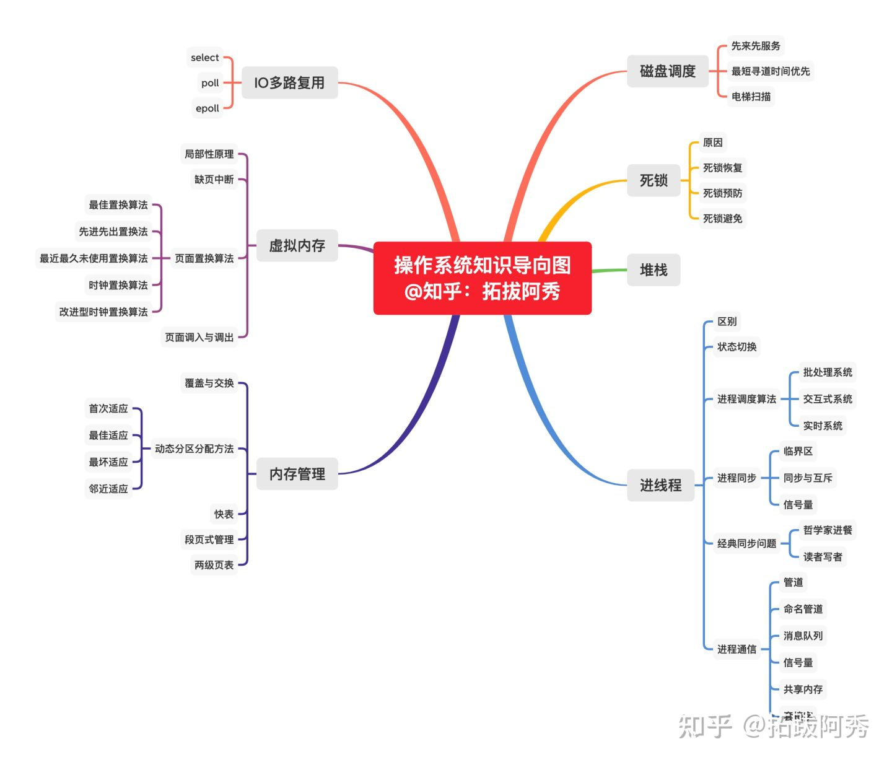
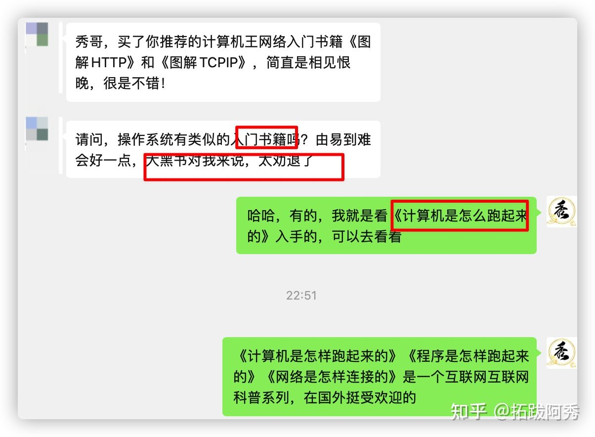
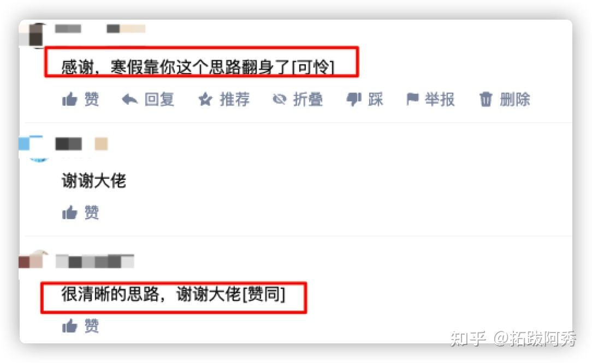
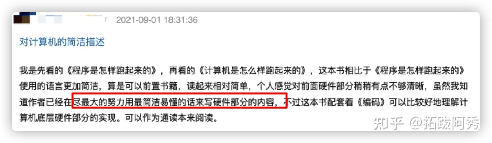
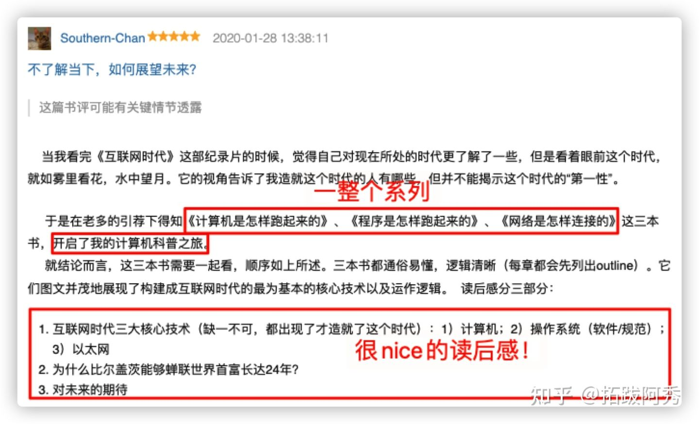
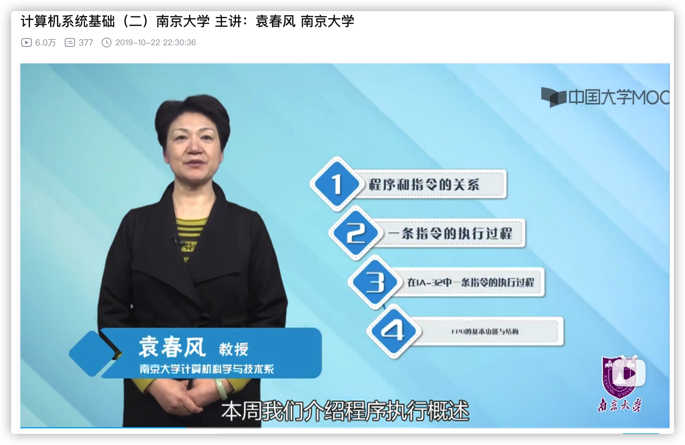
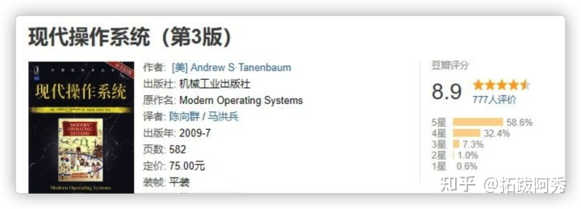
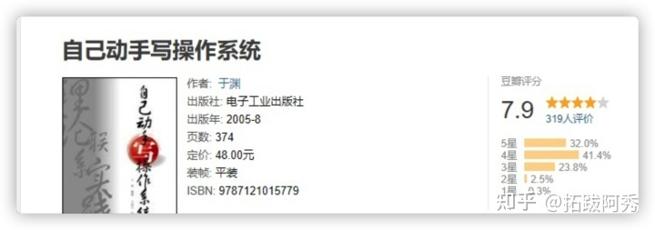
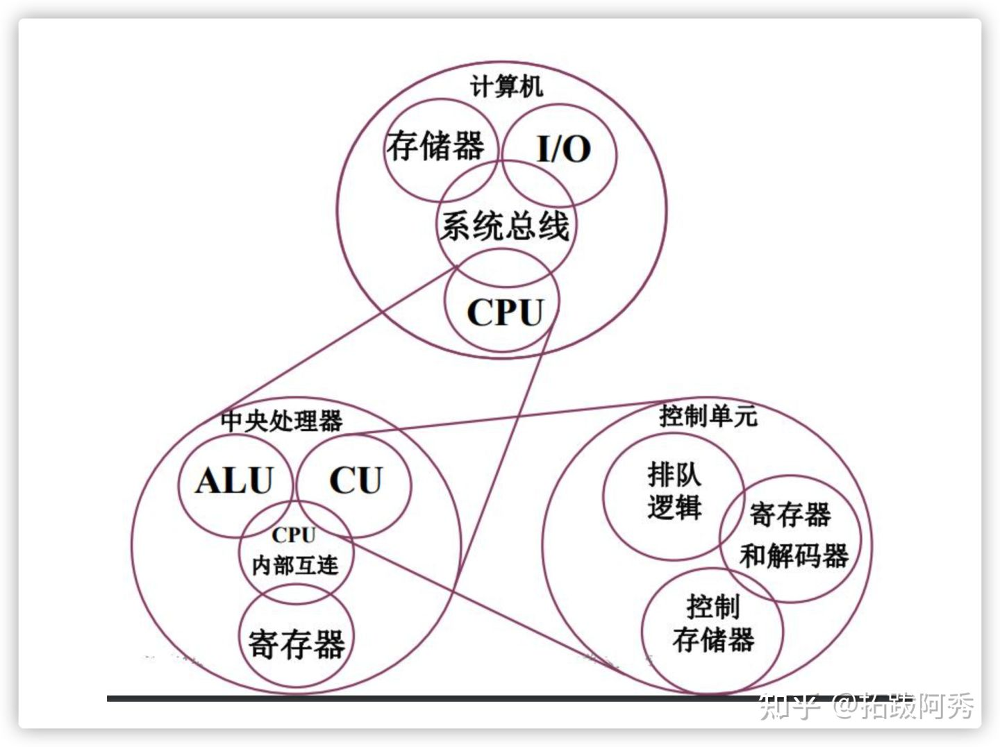
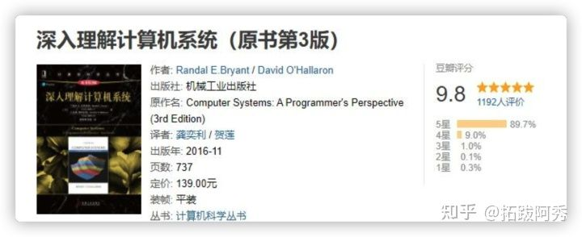

<h1 align="center">Lộ trình học Hệ điều hành</h1>

  
Đây là 6 thông tin có thể sẽ hữu ích cho bạn:

⭐️1. A Tú cùng bạn bè hợp tác phát triển một website tài nguyên lập trình, hiện đã tổng hợp rất nhiều tài liệu học tập chất lượng và công cụ hữu ích (kèm link tải). Nếu bạn đang tìm kiếm tài nguyên lập trình phù hợp, <a href="https://tools.interviewguide.cn/home" style="text-decoration: underline" target="_blank">hoan nghênh trải nghiệm</a> cũng như giới thiệu những tài nguyên bạn thấy hay. Góp gió thành bão, mình vì mọi người, mọi người vì mình🔥!
  
2. 👉 Tháng 5/2023, trong thời gian <a style="text-decoration: underline" href="https://mp.weixin.qq.com/s?__biz=Mzk0ODU4MzEzMw==&mid=2247512170&idx=1&sn=c4a04a383d2dfdece676b75f17224e78" target="_blank">rời ByteDance để chuyển sang một công ty đa quốc gia</a>, nhằm thuận tiện cho bản thân khi tìm việc và nâng cao tỷ lệ trúng tuyển, A Tú cùng bạn bè đã phát triển từ con số 0 một website giải đề phỏng vấn thực chiến của các Big Tech, bao gồm hai frontend và một backend. Trang web cho phép tra cứu có định hướng đề thi viết của các công ty Internet, ví dụ như muốn tra cứu đề thi viết của ByteDance trong 1 năm gần đây gồm những gì đều có thể làm được. Hoan nghênh trải nghiệm~

Địa chỉ website: <a style="text-decoration: underline" href="https://niumacode.com/home?ref=F6O2625K" target="_blank">Website đề thi thuật toán phỏng vấn Big Tech</a>.
    
3. 😊
    Chia sẻ một website công cụ tiện ích mà A Tú tâm đắc sưu tầm, <a style="text-decoration: underline" href="https://hkjtz.cn/" target="_blank">nhấn vào đây để truy cập</a>, chủ yếu là các ứng dụng, website ngách hữu ích, ngoài ra còn có tài nguyên phim ảnh HD, âm nhạc, phim truyền hình, AI, phim tài liệu, tài liệu thi tiếng Anh, thi công chức, cao học, nghề tay trái...
  

  
4. 😍 Chia sẻ miễn phí tài nguyên học tập mà A Tú đã tích lũy từ khi theo học máy tính, <a style="text-decoration: underline" href="/notes/07-resources/01-free/01-introduce.html" target="_blank">nhấn vào đây để nhận miễn phí</a>; đồng thời cũng lưu lại nhật ký đánh giá <a style="text-decoration: underline" href="/notes/07-resources/02-precious.html" target="_blank">những cuốn sách máy tính, chuyên mục online chất lượng cũng như những khóa học trả phí kém chất lượng</a> từng mua trước đây.
  

  
5. 🚀 Nếu bạn muốn thuận lợi giành được offer tốt hơn trong kỳ tuyển dụng trường học (Campus Recruitment), A Tú khuyên bạn nên xem thêm những <a style="text-decoration: underline" href="https://www.yuque.com/tuobaaxiu/httmmc/npg1k81zeq4wfpyz" target="_blank">cạm bẫy từng vấp phải</a> và <a style="text-decoration: underline"  target="_blank" href="https://www.yuque.com/tuobaaxiu/httmmc/gge9ppd0mbu2d3dp">kinh nghiệm đúc kết</a> của người đi trước. Thực tế, hầu hết các vấn đề bạn đang gặp phải thì các anh chị khóa trước đều đã từng trải qua.
  

  
6. 🔥 Hoan nghênh các bạn đang chuẩn bị cho kỳ tuyển dụng trường học ngành CNTT tham gia <a  style="text-decoration: underline" href="https://www.yuque.com/tuobaaxiu/httmmc/xg0otqvc17wfx4u9" target="_blank">Cộng đồng học tập</a> của tôi. Độc hành một mình chi bằng cùng nhau sưởi ấm, trong nhóm đã đọng lại rất nhiều <a  style="text-decoration: underline" href="https://www.yuque.com/tuobaaxiu/httmmc/gge9ppd0mbu2d3dp" target="_blank">kinh nghiệm và tổng kết</a> của các anh chị khóa 21/22/23/24/25. Kiên trì đi theo lộ trình, cuối cùng đa phần đều có thể nhận được offer ưng ý! Nếu bạn cần phiên bản PDF tổng hợp các điểm kiến thức 📚︎ Bát cổ văn phỏng vấn tuyển dụng trường học trên website 《Ghi chép học tập của A Tú》, có thể <a style="text-decoration: underline" href="https://www.yuque.com/tuobaaxiu/httmmc/qs0yn66apvkzw0ps" target="_blank">nhấn vào đây để tải về</a>.
   

## Lời nói đầu

Đây là chuỗi bài viết gốc về lộ trình học tập và gợi ý dự án của A Tú, như hình dưới đây:

Mọi hành vi sao chép vi phạm bản quyền sẽ bị xử lý bằng biện pháp pháp lý để bảo vệ quyền lợi chính đáng. Toàn bộ nội dung của 《Lộ trình học tập & Gợi ý dự án》 được lưu trữ trong Cộng đồng học tập của A Tú, hoan nghênh tìm hiểu [Cộng đồng học tập của A Tú](/notes/05-xiustar/01-xiustar_reading_guide/01-introduce.html#阿秀组建了一个校招学习圈子).

Dưới đây là nội dung chính:

## Hướng dẫn nhập môn

Đối với các đầu sách được giới thiệu trong bài viết, đều có bán bản sách giấy trên Dangdang, JD. Bản PDF điện tử miễn phí tương ứng có thể tìm thấy tại 2 repository dưới đây:

Địa chỉ Github: [https://github.com/forthespada/CS-Books](https://github.com/forthespada/CS-Books) (Nếu không truy cập được Github trong nước, có thể thử địa chỉ Gitee bên dưới)

Địa chỉ Gitee: [https://gitee.com/ForthEspada/CS-Books](https://gitee.com/ForthEspada/CS-Books)

Ngoài ra, bài viết cũng sẽ giới thiệu một số video hoặc tài liệu mà A Tú đã lưu trữ trên kênh Official Account. Cách thức nhận hoặc đường dẫn đều nằm ngay dưới mỗi video được giới thiệu, bạn chỉ cần gửi từ khóa tương ứng là có thể nhận miễn phí.

Khi mới bắt đầu tự học Hệ điều hành, hồi đó tôi cũng lên Zhihu xem gợi ý của mọi người, kết quả là **rất nhiều câu trả lời được vote cao khuyên nên đọc cuốn 《Computer Systems: A Programmer's Perspective》(CS:APP - Thấu hiểu sâu sắc hệ thống máy tính)**. Tôi vội vàng lên JD đặt mua ngay một cuốn về, nhưng thực sự đọc mà muốn "bội thực" luôn.

Là một sinh viên tốt nghiệp ngành máy tính với xuất phát điểm bình thường, tính đến nay tôi đã học máy tính được khoảng 8 - 9 năm, nhưng phần lớn đều là tự học, ngay cả công việc Kỹ sư Phát triển Backend tại ByteDance hiện tại cũng nhờ tự học mà đỗ.

Ví dụ như cuốn CS:APP, sách thì rất hay, nhưng quả thật rất dày, đem đi úp mì gói thì vừa đẹp, chứ đối với người mới bắt đầu nhập môn thì thực sự không phải là một lựa chọn lý tưởng.

Sau đó, tôi thay đổi tư duy: không còn đi theo những lộ trình trên Zhihu cứ hễ mở miệng là khuyên đọc ngay các cuốn "sách bìa đen kinh điển" dày cộm nữa, mà **dời toàn bộ những cuốn sách dày đó về giai đoạn sau mới đọc**, **từng bước từng bước vững chắc tự học theo cách của mình**, và cuối cùng mới thực sự nắm vững Hệ điều hành.

Cuối cùng tôi đã hoàn thành khóa học MIT 6.828 cũng như các bài lab của CS:APP, bao gồm bài Lab 4 khá nổi tiếng:

Preemptive Multitasking: Hiện thực hóa hỗ trợ Multi-CPU, lập lịch tiến trình Round-Robin (Round-Robin Process Scheduling), cơ chế Copy-on-Write, đa nhiệm ưu tiên/chiếm dụng (preemptive multitasking), giao tiếp liên tiến trình (IPC - Inter-Process Communication).

Lab 4 đã hay, nhưng cá nhân tôi thấy Lab 5 còn thú vị nhất, vì Lab 5 dẫn dắt bạn tự xây dựng một hệ thống file (File System), điều này thú vị hơn nhiều so với việc chỉ ngồi viết báo cáo thí nghiệm trên Word.

Do đó, tôi khuyên các bạn nên lựa chọn lộ trình giống tôi: **bắt đầu từ những cuốn sách Hệ điều hành dễ hiểu, sau đó học qua các video bài giảng chất lượng, và cuối cùng mới đi sâu vào các cuốn sách kinh điển dày cộm**.

Sau khi học xong, tôi cũng đã tự vẽ sơ đồ định hướng kiến thức cho bản thân. Đây là sơ đồ định hướng kiến thức mà tôi đã lập từ trước:

Tôi đã đọc sách và học tập theo đúng phương pháp này, và khi các đàn em khóa dưới đến nhờ tư vấn, tôi cũng chia sẻ với các bạn như vậy.

Vì vậy, **việc học Hệ điều hành cũng có thể áp dụng lộ trình như thế: đi từ đơn giản, rồi từ từ chuyển tiếp sang các cuốn sách kinh điển chuyên sâu**, như vậy sẽ giảm bớt cảm giác nản lòng bỏ cuộc.

Lộ trình học mà tôi chia sẻ dưới đây sẽ không khiến bạn bị "ngợp", vì toàn bộ tiến trình học tập rất êm ái và nhẹ nhàng!

## 1. Tìm hiểu sơ bộ về Hệ điều hành

### 《Máy tính hoạt động như thế nào?》(How Computers Work / 计算机是怎样跑起来的)

Tôi khuyên bạn nên bắt đầu từ những cuốn sách đơn giản giống tôi, chứ nếu vừa vào đã lao ngay vào những cuốn sách kinh điển dày cộp như CS:APP thì cầm chắc việc nản chí bỏ cuộc!

Cuốn 《Máy tính hoạt động như thế nào?》 rất phù hợp cho người mới bắt đầu. Toàn bộ cuốn sách dùng hình vẽ minh họa cho chữ viết, mở đầu bằng 3 nguyên tắc lớn của máy tính, xuyên suốt cuốn sách lần lượt giới thiệu về cấu trúc máy tính, hợp ngữ thủ công (manual assembly), luồng chương trình, thuật toán, cấu trúc dữ liệu, lập trình hướng đối tượng (OOP), cơ sở dữ liệu, kiến thức liên quan đến mạng TCP/IP.

Nói cuốn sách này "hình ảnh sinh động, dễ hiểu, trực quan" là hoàn toàn xứng đáng, cực kỳ thích hợp cho những bạn muốn chuyển ngành sang CNTT hoặc các bạn mới bắt đầu học Hệ điều hành.

Tôi hoàn toàn đồng quan điểm với bạn đọc trên Douban: đây thực sự là một cuốn sách nhập môn rất hay (nice). Cùng bộ này còn có 2 cuốn nữa:

**《Chương trình hoạt động như thế nào?》(How Programs Work), 《Mạng hoạt động như thế nào?》(How Networks Work)**

Đúng như bạn đọc Douban đã chia sẻ: Ba công nghệ cốt lõi của kỷ nguyên Internet (không thể thiếu bất kỳ cái nào, cả 3 cùng xuất hiện mới tạo nên kỷ nguyên này): **1) Máy tính; 2) Hệ điều hành (phần mềm / quy chuẩn); 3) Mạng Ethernet**

------

## 2. Khóa học Cơ sở Hệ thống Máy tính (1) (2) - Đại học Nam Kinh

Khuyên bạn trước tiên nên xem khóa học Cơ sở Hệ thống Máy tính (Phần 1 & 2) do cô Viên Xuân Phong (Yuan Chunfeng) giảng dạy tại Đại học Nam Kinh. Bạn chỉ cần xem phần 1 và 2 là đủ, phần 3 và 4 có thể xem sau!

[南京大学 计算机系统基础(一)主讲：袁春风老师_哔哩哔哩_bilibiliwww.bilibili.com/video/BV1kE411X7S5?from=search&seid=11368404143517814105](https://link.zhihu.com/?target=https%3A//www.bilibili.com/video/BV1kE411X7S5%3Ffrom%3Dsearch%26seid%3D11368404143517814105)

[计算机系统基础（二）南京大学 主讲：袁春风 南京大学_哔哩哔哩_bilibiliwww.bilibili.com/video/BV1rE41127Re?from=search&seid=11368404143517814105](https://link.zhihu.com/?target=https%3A//www.bilibili.com/video/BV1rE41127Re%3Ffrom%3Dsearch%26seid%3D11368404143517814105)

## 3. Bắt đầu với các cuốn sách kinh điển

Không thể phủ nhận rằng những cuốn sách đơn giản tuy dễ tiếp cận nhưng khó có thể giúp bạn đào sâu kiến thức thực sự!

Để thực sự học tốt Hệ điều hành, cuối cùng vẫn phải đi sâu vào bản chất của OS. Bạn có thể bắt đầu với những cuốn sách kinh điển có mức độ vừa phải giống như tôi!

### 《Hệ điều hành hiện đại》(Modern Operating Systems / 现代操作系统)

**《Modern Operating Systems》** (Andrew S. Tanenbaum) là một cuốn sách tuyệt vời về hệ điều hành, phân tích chi tiết hơn nhiều so với 《CS:APP》. Nếu như CS:APP đứng trên góc nhìn toàn bộ kiến trúc hệ thống máy tính để giải thích một cách có hệ thống, thì cuốn 《Modern Operating Systems》 lại đi sâu và tỉ mỉ hơn nhiều từ góc độ trực tiếp của Hệ điều hành (OS).

### MIT 6.S081

Đồng thời, MIT cũng có một khóa học rất chất lượng, ở giai đoạn này bạn đã có thể theo dõi được rồi; nếu xem ngay từ đầu thì chắc chắn bạn sẽ cảm thấy vô cùng bỡ ngỡ và choáng ngợp!

【Viện Công nghệ Massachusetts】Khóa học MIT 6.S081: Kỹ thuật Hệ điều hành (Operating System Engineering - Phụ đề tiếng Trung):

[【麻省理工学院】MIT 6.S081 操作系统工程 operating system engineering（中文字幕）_哔哩哔哩_bilibiliwww.bilibili.com/video/BV1Dy4y1m7ZE](https://link.zhihu.com/?target=https%3A//www.bilibili.com/video/BV1Dy4y1m7ZE)

### 《Tự tay viết Hệ điều hành》(Write Your Own OS / 自己动手写操作系统)

《Tự tay viết Hệ điều hành》 là một cuốn sách mang tính thực hành cực kỳ cao. Cuốn sách này sẽ trực tiếp dẫn dắt bạn đi qua từng bước hiện thực hóa cụ thể của một hệ điều hành, giúp bạn tự tay xây dựng một phiên bản OS đơn giản. Sau khi đọc xong cuốn 《Modern Operating Systems》, tôi đã dành hơn 20 ngày thực hành theo cuốn này để tự tạo ra một hệ điều hành nhỏ, cảm giác như nhiều nút thắt kiến thức được khai thông hoàn toàn!

## 4. Video bài giảng Hệ điều hành của Đại học Nam Kinh & Đại học Thanh Hoa

### Đại học Nam Kinh: Cơ sở Hệ thống Máy tính (3)

Lúc này, xem tiếp bài giảng phần 3 của cô Viên Xuân Phong sẽ tiếp thu tốt hơn rất nhiều, đây cũng là bước chuyển tiếp và tổng kết lại toàn bộ các nội dung trước đó:

[南京大学 计算机系统基础(三)完整 主讲：袁春风老师_哔哩哔哩_bilibiliwww.bilibili.com/video/BV1jE411874k?from=search&seid=11368404143517814105](https://link.zhihu.com/?target=https%3A//www.bilibili.com/video/BV1jE411874k%3Ffrom%3Dsearch%26seid%3D11368404143517814105)

### Đại học Thanh Hoa: Khóa học Thực hành Hệ điều hành (OS Lab)

Nếu bạn cảm thấy việc tự tay viết hệ điều hành ở các thí nghiệm trước vẫn chưa thỏa mãn, bạn có thể học theo khóa học thực hành thí nghiệm Hệ điều hành của thầy Hướng Dũng (Xiang Yong) và thầy Trần Du (Chen Yu) tại Đại học Thanh Hoa:

[清华大学-操作系统实验环节-向勇老师，陈渝老师_哔哩哔哩_bilibiliwww.bilibili.com/video/BV1wW41167Av?from=search&seid=2265296002609085661](https://link.zhihu.com/?target=https%3A//www.bilibili.com/video/BV1wW41167Av%3Ffrom%3Dsearch%26seid%3D2265296002609085661)

## 5. Kinh điển CS:APP

### 《Thấu hiểu sâu sắc Hệ thống Máy tính》(CS:APP - Computer Systems: A Programmer's Perspective)

CS:APP được ca tụng là "cuốn sách nền tảng máy tính quý giá như vàng", độ đánh giá khuyên đọc của cuốn sách này là 5 sao, đơn giản vì mức điểm cao nhất chỉ có 5 sao mà thôi.

Giống như học sinh xuất sắc thi được 100 điểm là do thang điểm bài thi chỉ tối đa 100 điểm, chứ không phải năng lực của bạn ấy chỉ dừng ở mức 100 điểm.

Cuốn sách này bắt đầu từ góc nhìn của máy tính khi thực thi chương trình, giới thiệu về kiến trúc bộ xử lý (processor architecture), tối ưu hóa chương trình ở mức máy (machine-level optimization), bộ nhớ ảo (virtual memory), I/O cấp hệ thống (system-level I/O), truyền thông mạng (network communication) cùng nhiều khía cạnh khác.

Cuốn sách này cực kỳ kinh điển, mỗi lần đọc lại đều sẽ có những thu hoạch và cảm ngộ mới. Thêm một lưu ý quan trọng là đừng bỏ qua các bài Lab sau mỗi chương; tác giả khuyên bạn nên kết hợp học cùng khóa học **MIT 6.828** và **CMU 15-213 CSAPP**.

## 6. Khóa học MIT 6.828 & CMU 15-213

### MIT 6.828

Không cần phải nói nhiều, đây là khóa học kinh điển tuyệt vời của MIT, là **tác phẩm kinh điển kết hợp giữa lý thuyết và thực hành**. Địa chỉ trang chủ chính thức tại nước ngoài: [https://pdos.csail.mit.edu/6.828/2018/schedule.html](https://link.zhihu.com/?target=https%3A//pdos.csail.mit.edu/6.828/2018/schedule.html)

Trên Bilibili cũng có video:

[【合集】MIT 6.828: Operating System Engineering [Fall 2014\] (无字幕)_哔哩哔哩_bilibiliwww.bilibili.com/video/BV1px411E7ST?from=search&seid=4256157976311210142&spm_id_from=333.337.0.0](https://link.zhihu.com/?target=https%3A//www.bilibili.com/video/BV1px411E7ST%3Ffrom%3Dsearch%26seid%3D4256157976311210142%26spm_id_from%3D333.337.0.0)

Ngoài ra, một số lập trình viên trên Github cũng chia sẻ kết quả bài tập của họ:
[https://github.com/SmallPond/MIT6.828_OS/tree/master/xv6-public](https://link.zhihu.com/?target=https%3A//github.com/SmallPond/MIT6.828_OS/tree/master/xv6-public)

Tuy nhiên, khóa học này đòi hỏi trình độ nhất định. Tốt nhất là bạn nên hoàn thành việc học có hệ thống các môn hệ điều hành cơ bản trước khi bắt tay vào làm các bài lab. Tất nhiên, nếu bạn quen thuộc với Nguyên lý tổ chức máy tính, ví dụ như đường ống đa cấp (multi-stage pipeline) thì khi làm bài lab này sẽ càng thuận lợi hơn!

Các bài lab của MIT 6.828 tương đối "hardcore", tổng cộng có 6 bài thí nghiệm, sau khi hoàn thành tất cả bạn có thể tự xây dựng được một nhân hệ điều hành (OS kernel) đơn giản!

Phải nói rằng phần tinh túy nhất của khóa học này chính là các bài lab; nếu không làm lab thì chẳng bằng không học MIT 6.828:

- **Lab 1: C, Assembly, Tools, and Bootstrapping**: Quá trình này giúp bạn làm quen với công cụ QEMU, ngôn ngữ C và hợp ngữ (Assembly) - những nền tảng của máy tính. Đồng thời giải thích cặn kẽ về quá trình khởi động (Bootstrapping): từ lúc máy tính được cấp điện cho đến khi bắt đầu chạy hệ điều hành, chuyện gì đã diễn ra trong suốt quá trình đó, chứ không đơn thuần chỉ cho bạn biết kết quả.
- **Lab 2: Memory management**: Bài lab này hướng dẫn bạn hiện thực hóa bộ nhớ ảo (Virtual Memory) cùng cơ chế phân trang (Paging) vô cùng nổi tiếng trong hệ điều hành.
- **Lab 3: User-level Environments**: Trong bài lab này, bạn sẽ hiện thực hóa quản lý tiến trình (Process Management), cơ chế ngắt (Interrupts), lời gọi hệ thống (System Calls), xử lý lỗi trang (Page Fault Handling), v.v.
- **Lab 4: Preemptive Multitasking**: Hiện thực hóa hỗ trợ Multi-CPU, lập lịch tiến trình Round-Robin, cơ chế Copy-on-Write, đa nhiệm ưu tiên/chiếm dụng (Preemptive Multitasking), giao tiếp liên tiến trình (IPC).
- **Lab 5: File system, spawn, and sh**: Hiện thực hóa hệ thống tệp tin (File System), hoàn thiện shell `sh`.
- **Lab 6: Networking**: Hiện thực hóa các tính năng mạng (Networking).

### CMU 15-213

[【精校中英字幕】2015 CMU 15-213 CSAPP 深入理解计算机系统 课程视频_哔哩哔哩_bilibiliwww.bilibili.com/video/BV1iW411d7hd?from=search&seid=6371202244482565196&spm_id_from=333.337.0.0](https://link.zhihu.com/?target=https%3A//www.bilibili.com/video/BV1iW411d7hd%3Ffrom%3Dsearch%26seid%3D6371202244482565196%26spm_id_from%3D333.337.0.0)
