<h1 align="center">Lộ trình học Mạng máy tính</h1>

> Tác giả: A Tú (阿秀)
>
> Liên kết bài viết gốc: [https://mp.weixin.qq.com/s/bryBzOdxTHUudTa4E1dEcA](https://mp.weixin.qq.com/s/bryBzOdxTHUudTa4E1dEcA)

  
Đây là 6 thông tin có thể sẽ hữu ích cho bạn:

⭐️1. A Tú cùng bạn bè hợp tác phát triển một website tài nguyên lập trình, hiện đã tổng hợp rất nhiều tài liệu học tập chất lượng và công cụ hữu ích (kèm link tải). Nếu bạn đang tìm kiếm tài nguyên lập trình phù hợp, <a href="https://tools.interviewguide.cn/home" style="text-decoration: underline" target="_blank">hoan nghênh trải nghiệm</a> cũng như giới thiệu những tài nguyên bạn thấy hay. Góp gió thành bão, mình vì mọi người, mọi người vì mình🔥!
  
2. 👉 Tháng 5/2023, trong thời gian <a style="text-decoration: underline" href="https://mp.weixin.qq.com/s?__biz=Mzk0ODU4MzEzMw==&mid=2247512170&idx=1&sn=c4a04a383d2dfdece676b75f17224e78" target="_blank">rời ByteDance để chuyển sang một công ty đa quốc gia</a>, nhằm thuận tiện cho bản thân khi tìm việc và nâng cao tỷ lệ trúng tuyển, A Tú cùng bạn bè đã phát triển từ con số 0 một website giải đề phỏng vấn thực chiến của các Big Tech, bao gồm hai frontend và một backend. Trang web cho phép tra cứu có định hướng đề thi viết của các công ty Internet, ví dụ như muốn tra cứu đề thi viết của ByteDance trong 1 năm gần đây gồm những gì đều có thể làm được. Hoan nghênh trải nghiệm~

Địa chỉ website: <a style="text-decoration: underline" href="https://niumacode.com/home?ref=F6O2625K" target="_blank">Website đề thi thuật toán phỏng vấn Big Tech</a>.
    
3. 😊
    Chia sẻ một website công cụ tiện ích mà A Tú tâm đắc sưu tầm, <a style="text-decoration: underline" href="https://hkjtz.cn/" target="_blank">nhấn vào đây để truy cập</a>, chủ yếu là các ứng dụng, website ngách hữu ích, ngoài ra còn có tài nguyên phim ảnh HD, âm nhạc, phim truyền hình, AI, phim tài liệu, tài liệu thi tiếng Anh, thi công chức, cao học, nghề tay trái...
  

  
4. 😍 Chia sẻ miễn phí tài nguyên học tập mà A Tú đã tích lũy từ khi theo học máy tính, <a style="text-decoration: underline" href="/notes/07-resources/01-free/01-introduce.html" target="_blank">nhấn vào đây để nhận miễn phí</a>; đồng thời cũng lưu lại nhật ký đánh giá <a style="text-decoration: underline" href="/notes/07-resources/02-precious.html" target="_blank">những cuốn sách máy tính, chuyên mục online chất lượng cũng như những khóa học trả phí kém chất lượng</a> từng mua trước đây.
  

  
5. 🚀 Nếu bạn muốn thuận lợi giành được offer tốt hơn trong kỳ tuyển dụng trường học (Campus Recruitment), A Tú khuyên bạn nên xem thêm những <a style="text-decoration: underline" href="https://www.yuque.com/tuobaaxiu/httmmc/npg1k81zeq4wfpyz" target="_blank">cạm bẫy từng vấp phải</a> và <a style="text-decoration: underline"  target="_blank" href="https://www.yuque.com/tuobaaxiu/httmmc/gge9ppd0mbu2d3dp">kinh nghiệm đúc kết</a> của người đi trước. Thực tế, hầu hết các vấn đề bạn đang gặp phải thì các anh chị khóa trước đều đã từng trải qua.
  

  
6. 🔥 Hoan nghênh các bạn đang chuẩn bị cho kỳ tuyển dụng trường học ngành CNTT tham gia <a  style="text-decoration: underline" href="https://www.yuque.com/tuobaaxiu/httmmc/xg0otqvc17wfx4u9" target="_blank">Cộng đồng học tập</a> của tôi. Độc hành một mình chi bằng cùng nhau sưởi ấm, trong nhóm đã đọng lại rất nhiều <a  style="text-decoration: underline" href="https://www.yuque.com/tuobaaxiu/httmmc/gge9ppd0mbu2d3dp" target="_blank">kinh nghiệm và tổng kết</a> của các anh chị khóa 21/22/23/24/25. Kiên trì đi theo lộ trình, cuối cùng đa phần đều có thể nhận được offer ưng ý! Nếu bạn cần phiên bản PDF tổng hợp các điểm kiến thức 📚︎ Bát cổ văn phỏng vấn tuyển dụng trường học trên website 《Ghi chép học tập của A Tú》, có thể <a style="text-decoration: underline" href="https://www.yuque.com/tuobaaxiu/httmmc/qs0yn66apvkzw0ps" target="_blank">nhấn vào đây để tải về</a>.
   

## Lời nói đầu

Đây là chuỗi bài viết gốc về lộ trình học tập và gợi ý dự án của A Tú, như hình dưới đây:

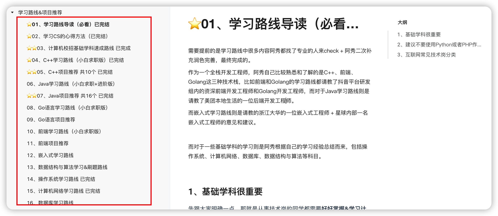

Mọi hành vi sao chép vi phạm bản quyền sẽ bị xử lý bằng biện pháp pháp lý để bảo vệ quyền lợi chính đáng. Toàn bộ nội dung của 《Lộ trình học tập & Gợi ý dự án》 được lưu trữ trong Cộng đồng học tập của A Tú, hoan nghênh tìm hiểu [Cộng đồng học tập của A Tú](/notes/05-xiustar/01-xiustar_reading_guide/01-introduce.html#阿秀组建了一个校招学习圈子).

Dưới đây là nội dung chính:

## Hướng dẫn nhập môn

Tại đây, A Tú chia sẻ phương pháp học Mạng máy tính của chính mình, hy vọng sẽ giúp ích cho các bạn!

Đối với các đầu sách được giới thiệu trong bài viết, đều có bán bản sách giấy trên Dangdang, JD. Bản PDF điện tử miễn phí tương ứng có thể tìm thấy tại 2 repository dưới đây:

Địa chỉ Github: [https://github.com/forthespada/CS-Books](https://github.com/forthespada/CS-Books) (Nếu không truy cập được Github trong nước, có thể thử địa chỉ Gitee bên dưới)

Địa chỉ Gitee: [https://gitee.com/ForthEspada/CS-Books](https://gitee.com/ForthEspada/CS-Books)

Ngoài ra, bài viết cũng sẽ giới thiệu một số video hoặc tài liệu mà A Tú đã lưu trữ trên kênh Official Account. Cách thức nhận hoặc đường dẫn đều nằm ngay dưới mỗi video được giới thiệu, bạn chỉ cần gửi từ khóa tương ứng là có thể nhận miễn phí.

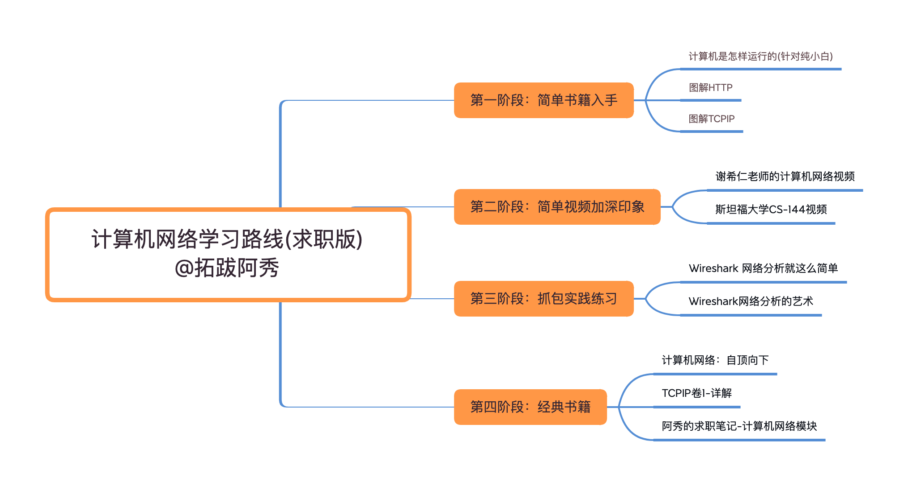

Nếu bạn đã có nền tảng nhất định, một số tài liệu hoặc video mức độ nhập môn có thể trực tiếp bỏ qua, đi thẳng vào phần nâng cao.

Nếu bạn là **người mới bắt đầu (newbie), sinh viên năm nhất hoặc người trái ngành chuyển hướng sang IT**, hãy nhớ theo dõi ngay từ bước đầu tiên để xây dựng nền tảng vững chắc.

## 1. Học cách để không tự khiến mình nản lòng bỏ cuộc

Lý do chính khiến đa số mọi người cảm thấy môn Mạng máy tính khó học là vì vừa mới bắt đầu đã lao vào "gặm" ngay cuốn giáo trình Mạng máy tính dày cộp của thầy Tạ Hy Nhân (Xie Xiren).

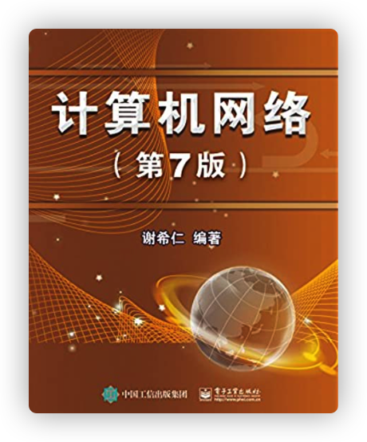

### Từ chối những cuốn "sách bìa đen" dày cộm ngay từ đầu

Hoặc là đâm đầu vào đọc những cuốn sách bìa đen kinh điển đồ sộ như **《TCP/IP Illustrated, Volume 1》 (TCP/IP Tường giải Tập 1)**, như vậy chắc chắn sẽ thấy rất khó và nản.

Là một người từng trải qua, tôi tuyệt đối không khuyên các bạn vừa vào đã đi gặm những cuốn sách dày như "cục gạch" đó, vì tôi biết rõ rằng điều đó cầm chắc việc khiến bạn bỏ cuộc giữa chừng!

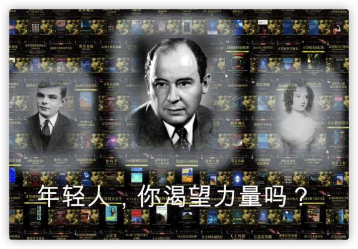

Điểm chung của các môn học nền tảng trụ cột trong máy tính như Hệ điều hành, Mạng máy tính, Nguyên lý tổ chức máy tính và Kiến trúc máy tính là chúng đều sở hữu hệ thống kiến trúc vô cùng phức tạp, lớp nọ lồng lớp kia, móc nối chặt chẽ với nhau!

Dòng sách kinh điển "bìa đen" của Nhà xuất bản Cơ khí Công nghiệp không hay sao?

Chắc chắn là rất hay và đều là kinh điển, nhưng những cuốn sách đó có một điểm chung là **dày cộp**, và **rất hợp để úp mì tôm**.

Quan trọng nhất là những cuốn sách này **không nên** đọc ngay từ giai đoạn đầu tiên khi bạn bắt đầu tiếp cận môn Mạng máy tính. **Đánh bài làm gì có ai vừa vào ván đã đánh luôn đôi Át chủ bài / Tứ quý đâu chứ**.

Vì vậy, tôi không khuyên bạn lao vào gặm các cuốn sách nặng đô đó ngay. Thay vào đó, tôi **phát hiện ra 2 cuốn sách tranh phổ biến kiến thức mạng máy tính rất hay: 《Minh họa trực quan HTTP》(Illustrated HTTP / 图解HTTP) và 《Minh họa trực quan TCP/IP》(Illustrated TCP/IP / 图解TCPIP)**.

### Bộ sách nhập môn trực quan sinh động về Mạng máy tính

Đây là 2 cuốn sách tranh phổ biến kiến thức do tác giả Nhật Bản biên soạn, cực kỳ thích hợp cho người mới bắt đầu nhập môn Mạng máy tính. Ban đầu tôi cũng nhờ đọc 2 cuốn sách nhỏ này mà bước chân vào tìm hiểu mạng máy tính.

Trong sách có rất nhiều tranh minh họa, cực kỳ thân thiện với người mới bắt đầu. Rất khuyên bạn nên sử dụng 2 cuốn này để nhập môn Mạng máy tính.

Cuốn sách kinh điển dày cộp như **《TCP/IP Illustrated, Volume 1》** quả thực rất giá trị, **nhưng nếu vừa vào đã đọc trực tiếp** thì quá dễ nản, đọc chưa nổi hai trang đã thấy buồn ngủ, hoàn toàn không thể nuốt trôi.

**Bắt đầu từ những gì đơn giản, dễ tiếp cận, chẳng phải tốt hơn nhiều sao?**

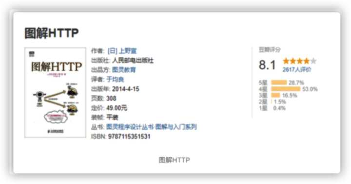

Nếu bạn là **người mới bắt đầu không thuộc chuyên ngành CNTT (non-tech)**, hoàn toàn chưa biết gì về mạng máy tính, thậm chí đến giao thức HTTP cơ bản nhất cũng chưa từng nghe qua, thì tôi khuyên bạn trước tiên hãy đọc cuốn 《**Mạng hoạt động như thế nào?**(How Networks Work / 网络是怎样连接的)》.

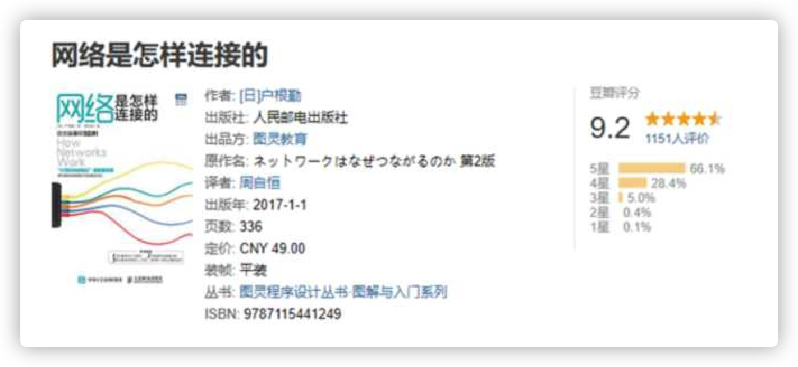

Cuốn sách này sẽ giải thích một cách tổng quan và rõ ràng toàn bộ quá trình máy tính gửi đi một yêu cầu (request)!

"**Khi bạn nhập một URL vào thanh địa chỉ của trình duyệt, nhấn phím Enter, cho đến khi nội dung được yêu cầu hiển thị trên trang web, điều gì đã diễn ra ở giữa quá trình đó?**"

Khi hiểu rõ vấn đề này, bạn cũng sẽ có được hình dung và hiểu biết khái quát về HTTP và TCP/IP - những thành phần được sử dụng phổ biến nhất trong mạng máy tính.

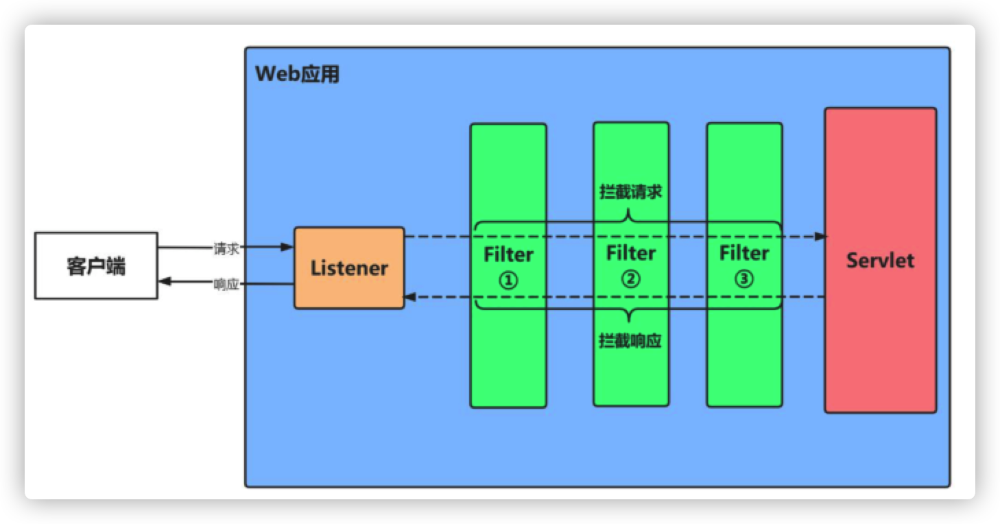

## 2. Ba khóa học video về Mạng máy tính

Sau khi đọc xong những cuốn sách truyện tranh minh họa ở trên, bạn có thể bắt đầu xem các video hoặc sách liên quan đến Mạng máy tính. Nếu bạn **đã có nền tảng**, khuyên bạn nên chuyển thẳng sang các đầu sách ở bước thứ 3.

Nếu **bạn là người mới bắt đầu**, sau khi đọc xong 3 cuốn sách trên mà vẫn chưa hiểu rõ lắm về Mạng máy tính, thì tốt nhất nên giống tôi, bắt đầu học từ video bài giảng.

### 1. **Khóa học Mạng máy tính của thầy Hàn Lập Cương (Khuyến nghị)**

Nếu để tôi giới thiệu một khóa học video về Mạng máy tính, tôi nghĩ không ai phù hợp hơn thầy Hàn Lập Cương (Han Ligang). Thầy Hàn giảng bài rất gần gũi, không khí lớp học lại hóm hỉnh và lôi cuốn, không có điểm gì để chê.

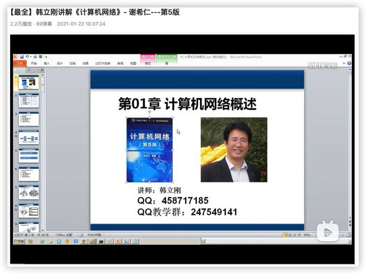

Cực kỳ khuyến nghị khóa học Mạng máy tính của thầy Hàn!

**Địa chỉ**: [https://www.bilibili.com/video/BV1Q](https://link.zhihu.com/?target=https%3A//www.bilibili.com/video/BV1Qr4y1N7cH)

### **2. Khóa học "Lớp học nhỏ Mạng máy tính" của Thầy giáo Đại học Hồ Nam (Hồ Đại Giáo Thư Tượng)**

Khóa học này mới trở nên nổi tiếng trong khoảng hai năm trở lại đây, có thể thời gian chưa lâu bằng khóa của thầy Hàn, nhưng chất lượng vẫn cực kỳ xuất sắc. Thầy giáo giảng bài rất trực quan và sinh động, có rất nhiều hiệu ứng hoạt hình PPT đẹp mắt giúp bạn hiểu rõ ràng và sâu sắc hơn!

Chỉ cần nhìn phần bình luận bên dưới video là đủ thấy khóa học này được yêu thích đến mức nào.

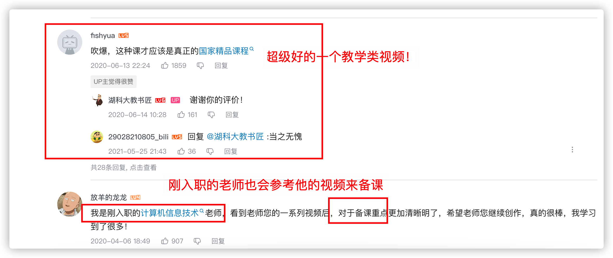

Địa chỉ: https://www.bilibili.com/video/BV1c4411d7jb?spm_id_from=333.337.search-card.all.click&vd_source=3fc05c3b7f095e12a12ea9850e2e0a35

### **3. 【Đại học Stanford】CS144: Mạng máy tính (Tự chọn)**

Khóa học Mạng máy tính của Đại học Stanford cũng rất nổi tiếng, chắc hẳn nhiều bạn đã từng nghe đến CS144. Chất lượng của khóa học này được cộng đồng quốc tế đánh giá cực kỳ cao!

Tuy nhiên, nếu thời gian của bạn có hạn, hãy ưu tiên xem khóa của thầy Hàn hoặc khóa của thầy giáo Đại học Hồ Nam là hoàn toàn ổn!

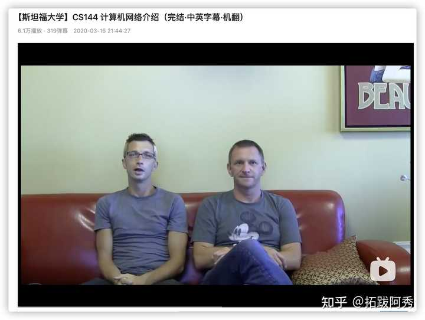

**Địa chỉ**: [https://www.bilibili.com/video/BV19x411z7Pu](https://link.zhihu.com/?target=https%3A//www.bilibili.com/video/BV137411Z7LR)

## 3. Bắt tay vào thực hành

Thông thường, cơ hội thực hành trực tiếp trong môn Mạng máy tính không nhiều, và bắt gói tin (packet sniffing / packet capture) chắc chắn là một trong những cơ hội thực hành tuyệt vời nhất.

Mạng máy tính suy cho cùng chính là mô hình 7 tầng. Hiểu rõ sự luân chuyển của dữ liệu, cách dữ liệu được truyền từ trên xuống dưới (top-down) và truyền ngược lại từ dưới lên trên (bottom-up) ra sao sẽ giúp bạn hiểu được rất nhiều kiến thức cốt lõi.

Trước đây tôi cũng từng chia sẻ bài viết thực hành bắt gói tin quá trình bắt tay 3 bước (three-way handshake) và ngắt kết nối 4 bước (four-way handshake). Bạn nào quan tâm có thể tìm đọc, tôi nhớ là các tệp bắt gói tin mẫu đều đã được chia sẻ công khai.

Các phần mềm bắt gói tin trên mạng có rất nhiều, phổ biến nhất là Fiddler và Wireshark. Ở đây tôi khuyên dùng **Wireshark**, công cụ này thực sự rất mạnh mẽ và tiện dụng, có thể bắt và phân tích gói tin mạng trên nhiều nền tảng (như Windows, Linux và macOS).

Hai cuốn sách của chuyên gia Lâm Bái Mãn (Lin Peiman): 《Phân tích mạng với Wireshark thật đơn giản》(Wireshark Network Analysis Is That Simple) và 《Nghệ thuật phân tích mạng với Wireshark》(The Art of Wireshark Network Analysis) sinh ra chính là dành cho việc bắt gói tin và phân tích mạng máy tính.

Bạn không nhất thiết phải đọc cả 2 cuốn, chỉ cần chọn 1 cuốn là đủ. Dù sao số người theo đuổi chuyên sâu ngành An toàn thông tin hay An ninh mạng vẫn là thiểu số; đa số lập trình viên chỉ cần nắm vững kỹ năng bắt gói tin cơ bản, biết cách chẩn đoán và khắc phục sự cố dịch vụ bắt nguồn từ mạng là đã đạt yêu cầu.

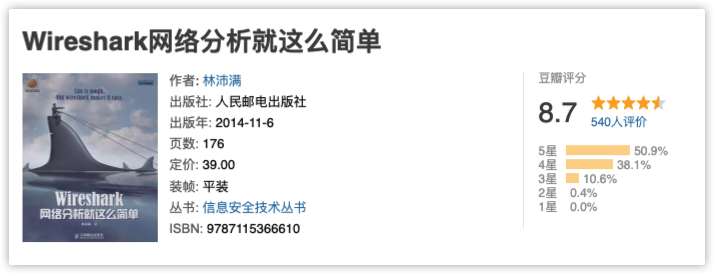

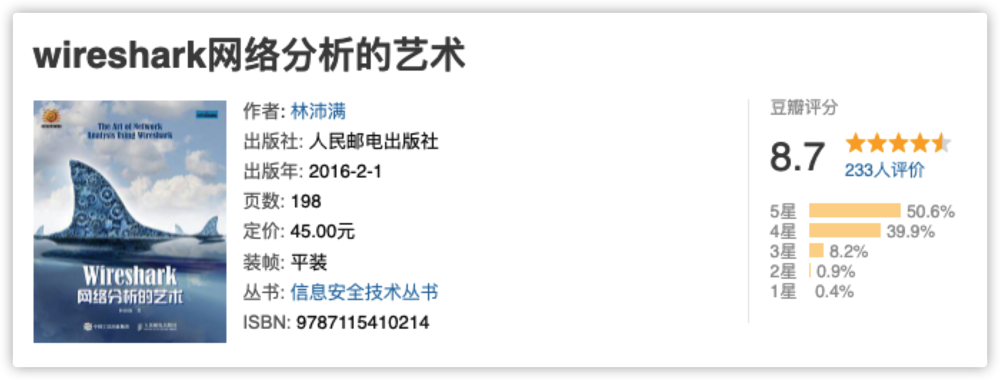

Đối với các kỹ sư phát triển phần mềm thông thường, chỉ cần đọc cuốn 《Phân tích mạng với Wireshark thật đơn giản》 là đã quá đủ. Cuốn sách không lan man, không sáo rỗng, từng trang đều là kiến thức thực chiến đắt giá.

Còn nếu bạn có định hướng trở thành Kỹ sư An ninh mạng (Security Engineer), thì một cuốn ở trên có thể chưa đủ, bạn sẽ cần thêm sự hỗ trợ đắc lực từ cuốn 《Nghệ thuật phân tích mạng với Wireshark》!

## 4. Tác phẩm kinh điển trong các tác phẩm kinh điển

Kinh điển sở dĩ trở thành kinh điển chính là nhờ đã vượt qua sự sàng lọc của thời gian và được vô số thế hệ kiểm chứng!

Những cuốn sách kinh điển nhất liên quan đến Mạng máy tính không thể không kể đến 《**Mạng máy tính: Cách tiếp cận từ trên xuống**(Computer Networking: A Top-Down Approach)》 và 《**TCP/IP Tường giải Tập 1: Giao thức**(TCP/IP Illustrated, Volume 1: The Protocols)》.

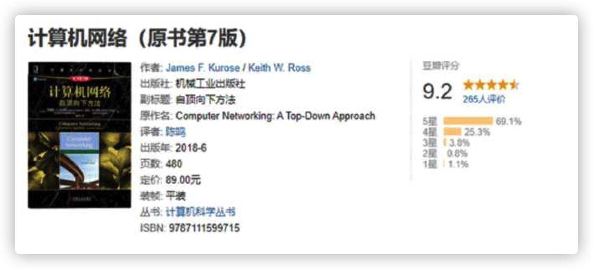

Điều đáng nói là cuốn 《**Mạng máy tính: Cách tiếp cận từ trên xuống**》 rất khác biệt so với các cuốn giáo trình mạng máy tính khác.

Cuốn sách này mở ra một lối đi riêng: không bắt đầu giới thiệu toàn bộ hệ thống máy tính từ Tầng vật lý (Physical Layer) hay Tầng liên kết dữ liệu (Data Link Layer) - những tầng xa xôi nhất với người dùng, mà bắt đầu ngay từ Tầng ứng dụng (Application Layer) gần gũi nhất với chúng ta, thực sự đúng như tên gọi của cuốn sách: **Phương pháp tiếp cận từ trên xuống (Top-Down Approach)**!

Khuyên bạn nên tập trung đọc kỹ nhiều lần Chương 3 về Tầng giao vận (Transport Layer), tức là các nội dung liên quan đến TCP/UDP, và hiểu rõ khái niệm cụ thể về Điều khiển tắc nghẽn (Congestion Control).

Trong quá trình đọc cuốn sách này, bạn có thể tham khảo thêm đề cương tổng kết của tôi, chú trọng nắm vững một số giao thức quan trọng như HTTP, TCP, UDP, v.v.

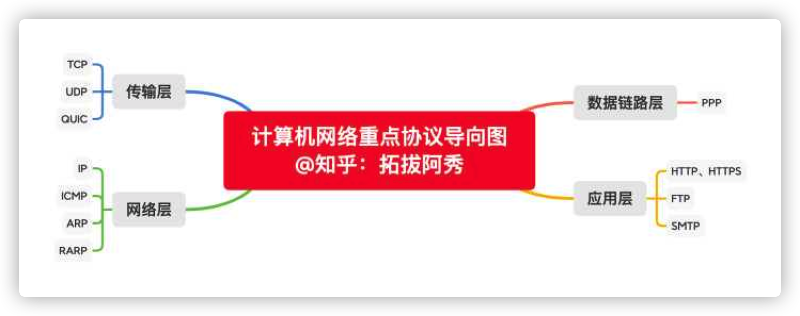

Thông thường, nếu bạn học xong những nội dung này giống như tôi, về cơ bản Mạng máy tính sẽ không còn là rào cản trên con đường tìm việc của bạn nữa. Bạn hoàn toàn có thể tự tin trao đổi trôi chảy với người phỏng vấn về các câu hỏi kinh điển trong mạng máy tính như **SSL/TLS, mã hóa đối xứng (Symmetric Encryption), bắt tay 3 bước & bắt tay 4 bước (Three-way Handshake & Four-way Handshake)**, v.v.

Đối với cuốn sách lưu truyền qua nhiều năm tháng như TCP/IP Tường giải, nếu bạn không theo đuổi các vị trí chuyên môn về An toàn thông tin, An ninh mạng, hoặc giống như tôi làm Kỹ sư Phát triển Backend, bạn hoàn toàn có thể sử dụng cuốn sách này như một cuốn từ điển / sách tra cứu công cụ: khi gặp phải vấn đề cụ thể chưa hiểu thì mở ra tra cứu tài liệu là được.

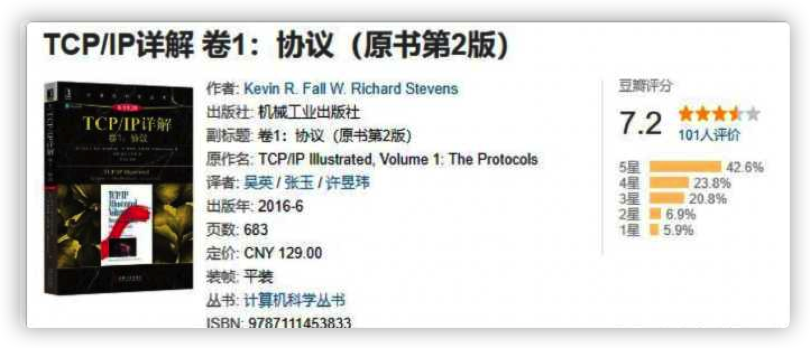

## Tổng kết

Thực ra, Mạng máy tính không hề khó học như bạn vẫn nghĩ.

Chỉ cần từng bước vững chắc đi trên con đường của chính mình, bạn chỉ việc nỗ lực hết mình, phần còn lại hãy để thời gian trả lời.
