<h1 align="center">Lộ trình cấp tốc học các môn nền tảng CS cho kỳ tuyển dụng trường học (Áp dụng cho đa số mọi người)</h1>

  
Đây là 6 thông tin có thể sẽ hữu ích cho bạn:

⭐️1. A Tú cùng bạn bè hợp tác phát triển một website tài nguyên lập trình, hiện đã tổng hợp rất nhiều tài liệu học tập chất lượng và công cụ hữu ích (kèm link tải). Nếu bạn đang tìm kiếm tài nguyên lập trình phù hợp, <a href="https://tools.interviewguide.cn/home" style="text-decoration: underline" target="_blank">hoan nghênh trải nghiệm</a> cũng như giới thiệu những tài nguyên bạn thấy hay. Góp gió thành bão, mình vì mọi người, mọi người vì mình🔥!
  
2. 👉 Tháng 5/2023, trong thời gian <a style="text-decoration: underline" href="https://mp.weixin.qq.com/s?__biz=Mzk0ODU4MzEzMw==&mid=2247512170&idx=1&sn=c4a04a383d2dfdece676b75f17224e78" target="_blank">rời ByteDance để chuyển sang một công ty đa quốc gia</a>, nhằm thuận tiện cho bản thân khi tìm việc và nâng cao tỷ lệ trúng tuyển, A Tú cùng bạn bè đã phát triển từ con số 0 một website giải đề phỏng vấn thực chiến của các Big Tech, bao gồm hai frontend và một backend. Trang web cho phép tra cứu có định hướng đề thi viết của các công ty Internet, ví dụ như muốn tra cứu đề thi viết của ByteDance trong 1 năm gần đây gồm những gì đều có thể làm được. Hoan nghênh trải nghiệm~

Địa chỉ website: <a style="text-decoration: underline" href="https://niumacode.com/home?ref=F6O2625K" target="_blank">Website đề thi thuật toán phỏng vấn Big Tech</a>.
    
3. 😊
    Chia sẻ một website công cụ tiện ích mà A Tú tâm đắc sưu tầm, <a style="text-decoration: underline" href="https://hkjtz.cn/" target="_blank">nhấn vào đây để truy cập</a>, chủ yếu là các ứng dụng, website ngách hữu ích, ngoài ra còn có tài nguyên phim ảnh HD, âm nhạc, phim truyền hình, AI, phim tài liệu, tài liệu thi tiếng Anh, thi công chức, cao học, nghề tay trái...
  

  
4. 😍 Chia sẻ miễn phí tài nguyên học tập mà A Tú đã tích lũy từ khi theo học máy tính, <a style="text-decoration: underline" href="/notes/07-resources/01-free/01-introduce.html" target="_blank">nhấn vào đây để nhận miễn phí</a>; đồng thời cũng lưu lại nhật ký đánh giá <a style="text-decoration: underline" href="/notes/07-resources/02-precious.html" target="_blank">những cuốn sách máy tính, chuyên mục online chất lượng cũng như những khóa học trả phí kém chất lượng</a> từng mua trước đây.
  

  
5. 🚀 Nếu bạn muốn thuận lợi giành được offer tốt hơn trong kỳ tuyển dụng trường học (Campus Recruitment), A Tú khuyên bạn nên xem thêm những <a style="text-decoration: underline" href="https://www.yuque.com/tuobaaxiu/httmmc/npg1k81zeq4wfpyz" target="_blank">cạm bẫy từng vấp phải</a> và <a style="text-decoration: underline"  target="_blank" href="https://www.yuque.com/tuobaaxiu/httmmc/gge9ppd0mbu2d3dp">kinh nghiệm đúc kết</a> của người đi trước. Thực tế, hầu hết các vấn đề bạn đang gặp phải thì các anh chị khóa trước đều đã từng trải qua.
  

  
6. 🔥 Hoan nghênh các bạn đang chuẩn bị cho kỳ tuyển dụng trường học ngành CNTT tham gia <a  style="text-decoration: underline" href="https://www.yuque.com/tuobaaxiu/httmmc/xg0otqvc17wfx4u9" target="_blank">Cộng đồng học tập</a> của tôi. Độc hành một mình chi bằng cùng nhau sưởi ấm, trong nhóm đã đọng lại rất nhiều <a  style="text-decoration: underline" href="https://www.yuque.com/tuobaaxiu/httmmc/gge9ppd0mbu2d3dp" target="_blank">kinh nghiệm và tổng kết</a> của các anh chị khóa 21/22/23/24/25. Kiên trì đi theo lộ trình, cuối cùng đa phần đều có thể nhận được offer ưng ý! Nếu bạn cần phiên bản PDF tổng hợp các điểm kiến thức 📚︎ Bát cổ văn phỏng vấn tuyển dụng trường học trên website 《Ghi chép học tập của A Tú》, có thể <a style="text-decoration: underline" href="https://www.yuque.com/tuobaaxiu/httmmc/qs0yn66apvkzw0ps" target="_blank">nhấn vào đây để tải về</a>.
   

## Lời nói đầu

Đây là chuỗi bài viết gốc về lộ trình học tập và gợi ý dự án của A Tú, như hình dưới đây:

Mọi hành vi sao chép vi phạm bản quyền sẽ bị xử lý bằng biện pháp pháp lý để bảo vệ quyền lợi chính đáng. Toàn bộ nội dung của 《Lộ trình học tập & Gợi ý dự án》 được lưu trữ trong Cộng đồng học tập của A Tú, hoan nghênh tìm hiểu [Cộng đồng học tập của A Tú](/notes/05-xiustar/01-xiustar_reading_guide/01-introduce.html#阿秀组建了一个校招学习圈子).

Dưới đây là nội dung chính:

**Lời quan trọng nói trước: Nếu bạn chỉ dự định tìm một công việc tốt trong đợt tuyển dụng mùa thu (Autumn Recruitment), thì học xong các nội dung dưới đây + nội dung hướng dẫn trên website của tôi về cơ bản là đã đủ.**

Trong bài có nhắc đến một số cuốn sách, tôi cơ bản đều đã thu thập đầy đủ. Bản PDF điện tử miễn phí tương ứng có thể tìm thấy tại 2 repository dưới đây, nếu không tiện truy cập Github thì có thể vào địa chỉ Gitee thứ 2:

Địa chỉ Github: [https://github.com/forthespada/CS-Books](https://github.com/forthespada/CS-Books) (Nếu không truy cập được Github trong nước, có thể thử địa chỉ Gitee bên dưới)

Địa chỉ Gitee: [https://gitee.com/ForthEspada/CS-Books](https://gitee.com/ForthEspada/CS-Books)

Ngoài ra, bài viết cũng sẽ giới thiệu một số video bài giảng, tôi đã để sẵn liên kết, các bạn chỉ việc nhấn vào xem trực tiếp.

## Hướng dẫn nhập môn

Thực ra tôi không thực sự muốn viết bài này, bởi vì các môn học nền tảng của Khoa học Máy tính vốn dĩ không phải là thứ có thể "học cấp tốc" được. Chẳng hạn như Hệ điều hành, Mạng máy tính, Cơ sở dữ liệu... đều là những môn đòi hỏi phải học kỹ lưỡng một lượt + tự tay thực hành thì mới có thể nắm vững triệt để.

Có thể bạn đã từng thấy một số bạn được gọi là "chiến thần Bát cổ văn" (những người chuyên cày lý thuyết phỏng vấn), họ chọn cách học thuộc lòng trực tiếp các câu hỏi trên website ghi chép học tập của tôi.

Họ gọi những nội dung đó là "Bát cổ văn" (八股文). Thật ra vào thời điểm A Tú tham gia tuyển dụng trường học, khái niệm "Bát cổ văn" này vẫn chưa phổ biến rộng rãi, ít nhất là chưa giống như bây giờ khi mà hầu như ứng viên mới tốt nghiệp nào cũng biết đến thuật ngữ này.

Do đó, trước đây khi học, A Tú luôn giữ tâm thế là học để thực sự hiểu và làm chủ kiến thức, và việc ghi chép lại các bài viết này cũng xuất phát từ tâm thế đó.

Mỗi năm đến mùa tuyển dụng trường học, có rất nhiều bạn đến tận tháng 7, tháng 8 mới bắt đầu chuẩn bị. Lúc này hoàn toàn không còn đủ thời gian để tự đọc và ngấm sâu kiến thức các môn nền tảng máy tính nữa. Nguyên nhân chính là do môi trường giáo dục có phần êm ả như "nấu ếch trong nước ấm", **giáo dục và yêu cầu công việc thực tế bị tách rời khá nghiêm trọng**, khiến nhiều bạn trong thời gian học đại học không có cơ hội tiếp xúc với những kiến thức thực tế này.

Vì vậy, A Tú nhận được rất nhiều lời hỏi thăm của các bạn xem liệu có lộ trình cấp tốc nào không. Nhận được nhiều câu hỏi quá nên tôi quyết định viết một bài chia sẻ về khía cạnh này.

**Tôi đã chứng kiến quá nhiều trường hợp các đàn em khóa dưới ngày thường không để ý, đến sát nút tuyển dụng mùa thu mới giật mình nhận ra mình chưa biết gì, phần nội dung này chính là được chuẩn bị riêng cho các bạn.**

**Cần lưu ý rằng 《Lộ trình cấp tốc học các môn nền tảng CS》 chỉ có thể giúp bạn hiểu một cách khái quát nội dung của các môn nền tảng máy tính, đạt đến mức tương đối đủ để đi phỏng vấn.**

**Cũng cần giải thích thêm là nội dung dưới đây không đề cập đến thuật toán, điều này không có nghĩa là bạn không cần nắm vững thuật toán**, mà bởi vì thuật toán không phải là thứ có thể nắm bắt nhanh qua vài ba lộ trình học tập; tôi sẽ nói chi tiết hơn ở bài viết riêng về Lộ trình học Thuật toán.

Tuy nhiên, chỉ dựa vào những nội dung dưới đây thì chưa thể giúp bạn làm chủ hoàn toàn các môn học này như Hệ điều hành, Mạng máy tính, Cơ sở dữ liệu. Ngành máy tính có quá nhiều mảng ứng dụng, không ai có thể tự vỗ ngực xưng tên là tinh thông toàn bộ những môn trên; sau khi đi làm mọi người đều sẽ dần phân nhánh và chuyên môn hóa sâu hơn.

Nếu bạn thực sự muốn học sâu và vững chắc những môn này, tôi khuyên bạn nên xem thêm các bài viết cụ thể bên dưới như Lộ trình học Hệ điều hành, Lộ trình học Mạng máy tính, v.v.

## Frontend và Backend

Trước hết nói về Backend: các nội dung dưới đây đối với lập trình viên Backend thì không ngoại lệ, tất cả đều bắt buộc phải học, và thậm chí bấy nhiêu vẫn còn chưa đủ. Phần còn lại đòi hỏi bạn phải nỗ lực tự bắt tay vào làm việc + thực hành trong công việc thực tế, bởi những thứ Backend cần học và cần nắm là rất nhiều.

Nếu bạn là lập trình viên Frontend, bạn có thể không cần chú trọng quá nhiều vào Cơ sở dữ liệu, mà hãy tập trung vào Hệ điều hành và Mạng máy tính, đặc biệt là Mạng máy tính.

Bên cạnh việc kiểm tra kiến thức về JavaScript, CSS và các Framework, phần được hỏi nhiều nhất ở Frontend chính là Mạng máy tính (Computer Network), ví dụ như các mã trạng thái HTTP (Status Codes) là nội dung thường xuyên xuất hiện trong phỏng vấn.

## Khuyên các bạn trái ngành (non-tech) nên xem video này trước

Nếu bạn là người học trái ngành, chưa hiểu nhiều về máy tính, chưa biết Quản lý bộ nhớ (Memory Management) là gì, Giao thức Internet (Internet Protocols) là gì, hay Lưu trữ (Storage) có ý nghĩa ra sao, thì tôi khuyên bạn trước hết hãy xem qua khóa học 《Crash Course Computer Science》(Khóa học cấp tốc Khoa học Máy tính).

Tên khóa học nghe có vẻ giống một khóa học mì ăn liền, nhưng đây thực sự là một khóa học cực kỳ xuất sắc, đạt hơn 200 triệu lượt xem trên YouTube.

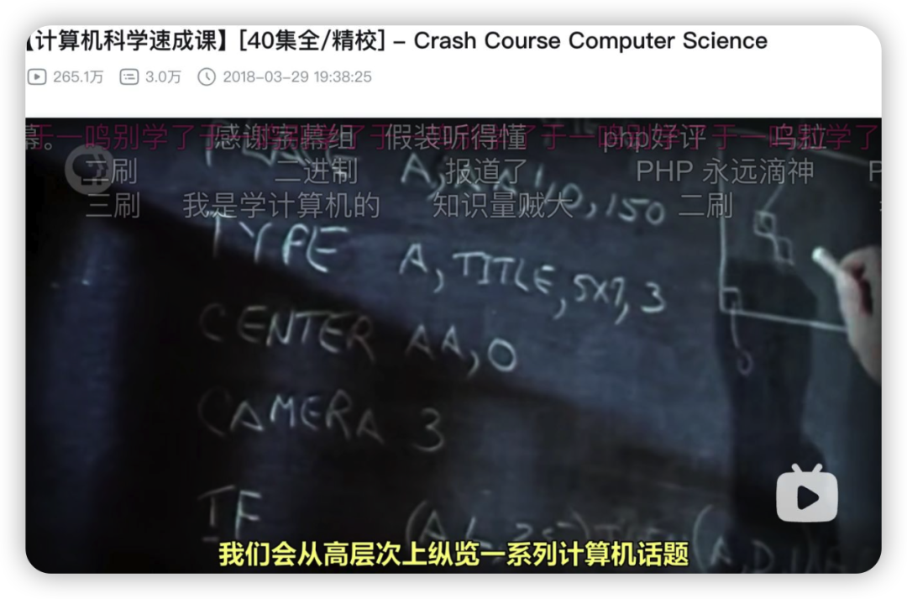

Địa chỉ: [https://www.bilibili.com/video/BV1EW411u7th](https://www.bilibili.com/video/BV1EW411u7th)

Khóa học này sẽ dẫn dắt bạn hiểu được một cách tổng quan máy tính thực chất là gì, cực kỳ khuyến nghị các bạn nên xem!

## Hệ điều hành (Operating System)

### Nhập môn cho người mới & sinh viên trái ngành

Nếu bạn là người mới bắt đầu hoặc học trái ngành, khuyên bạn trước hết nên đọc cuốn **《Máy tính hoạt động như thế nào?》(How Computers Work / 计算机是怎样跑起来的), đừng vừa vào đã lao ngay vào những cuốn như 《Giới thiệu Hệ điều hành》(Operating Systems: Three Easy Pieces / OSTEP), điều đó chắc chắn sẽ khiến bạn nản lòng bỏ cuộc.**

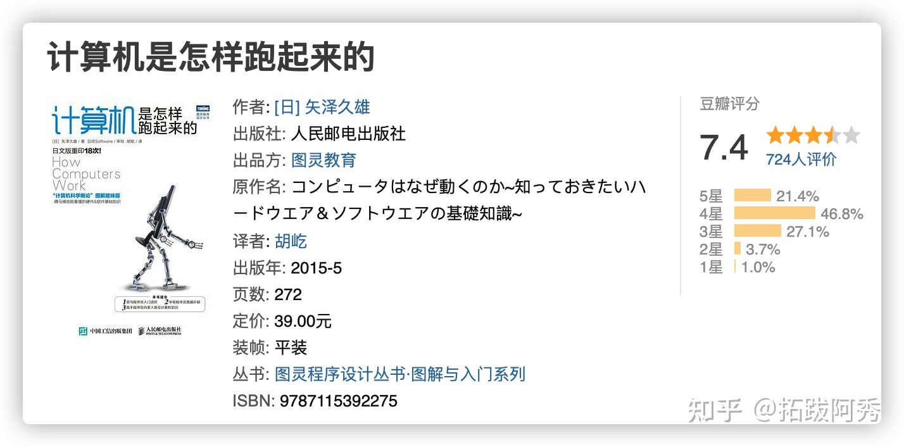

Tôi khuyên bạn nên bắt đầu từ những cuốn sách đơn giản giống tôi. Cuốn 《Máy tính hoạt động như thế nào?》 rất phù hợp cho người mới bắt đầu. Toàn bộ cuốn sách dùng hình vẽ minh họa cho chữ viết, mở đầu bằng 3 nguyên tắc lớn của máy tính, xuyên suốt cuốn sách lần lượt giới thiệu về cấu trúc máy tính, hợp ngữ thủ công, luồng chương trình, thuật toán, cấu trúc dữ liệu, lập trình hướng đối tượng (OOP), cơ sở dữ liệu, kiến thức liên quan đến mạng TCP/IP.

Nói cuốn sách này "hình ảnh sinh động, dễ hiểu, trực quan" là hoàn toàn xứng đáng, cực kỳ thích hợp cho những bạn muốn chuyển ngành sang CNTT hoặc các bạn mới bắt đầu học Hệ điều hành.

Tôi hoàn toàn đồng quan điểm với bạn đọc trên Douban: đây thực sự là một cuốn sách nhập môn rất hay (nice). Cùng bộ này còn có 2 cuốn nữa:

**《Chương trình hoạt động như thế nào?》(How Programs Work), 《Mạng hoạt động như thế nào?》(How Networks Work)**, bạn nào có hứng thú có thể tìm đọc, đặc biệt là cuốn thứ 2: **Mạng hoạt động như thế nào?** liên quan rất nhiều đến Mạng máy tính.

### Khóa học video tương đối quan trọng

**Đại học Nam Kinh: Cơ sở Hệ thống Máy tính (1) (2)**

Khuyên bạn trước tiên nên xem khóa học Cơ sở Hệ thống Máy tính (Phần 1 & 2) do cô Viên Xuân Phong (Yuan Chunfeng) giảng dạy tại Đại học Nam Kinh. Bạn chỉ cần xem phần 1 và 2 là đủ, phần 3 và 4 có thể xem sau!

[南京大学 计算机系统基础(一)主讲：袁春风老师_哔哩哔哩_bilibiliwww.bilibili.com/video/BV1kE411X7S5?from=search&seid=11368404143517814105](https://link.zhihu.com/?target=https%3A//www.bilibili.com/video/BV1kE411X7S5%3Ffrom%3Dsearch%26seid%3D11368404143517814105)

[计算机系统基础（二）南京大学 主讲：袁春风 南京大学_哔哩哔哩_bilibiliwww.bilibili.com/video/BV1rE41127Re?from=search&seid=11368404143517814105](https://link.zhihu.com/?target=https%3A//www.bilibili.com/video/BV1rE41127Re%3Ffrom%3Dsearch%26seid%3D11368404143517814105)

### Lộ trình tiếp theo + Củng cố kiến thức

Đúng như tôi đã nói ở phần đầu bài viết, những nội dung ở trên chưa đủ để bạn nắm trọn vẹn Hệ điều hành, nhưng có thể giúp bạn có được cái nhìn khái quát. Để thực sự làm chủ kiến thức, cuối cùng vẫn phải đi sâu vào đọc sách.

**Nếu muốn tham gia phỏng vấn tuyển dụng mùa thu, bạn chỉ cần bám sát các nội dung trên website ghi chép học tập trước đây của tôi để ôn luyện thật kỹ là được!**

**Câu hỏi phỏng vấn Hệ điều hành tần suất cao**: [https://interviewguide.cn/notes/03-hunting_job/02-interview/02-01-%E6%93%8D%E4%BD%9C%E7%B3%BB%E7%BB%9F.html](https://interviewguide.cn/notes/03-hunting_job/02-interview/02-01-os.html)

## Mạng máy tính (Computer Network)

### Nhập môn cho người mới & sinh viên trái ngành

Nếu bạn là **người mới bắt đầu không thuộc chuyên ngành CNTT (non-tech)**, hoàn toàn chưa biết gì về mạng máy tính, thậm chí đến giao thức HTTP cơ bản nhất cũng chưa từng nghe qua, thì tôi khuyên bạn trước tiên hãy đọc cuốn 《**Mạng hoạt động như thế nào?**(How Networks Work / 网络是怎样连接的)》.

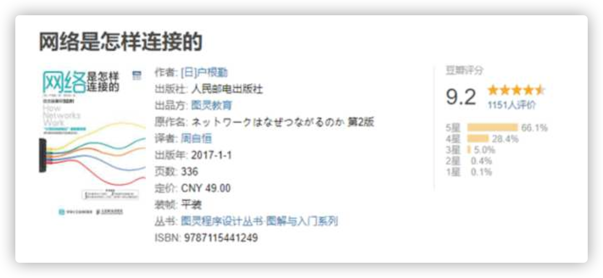

Cuốn sách này sẽ giải thích một cách tổng quan và rõ ràng toàn bộ quá trình máy tính gửi đi một yêu cầu (request)!

"**Khi bạn nhập một URL vào thanh địa chỉ của trình duyệt, nhấn phím Enter, cho đến khi nội dung được yêu cầu hiển thị trên trang web, điều gì đã diễn ra ở giữa quá trình đó?**"

Khi hiểu rõ vấn đề này, bạn cũng sẽ có được hình dung và hiểu biết khái quát về HTTP và TCP/IP - những thành phần được sử dụng phổ biến nhất trong mạng máy tính.

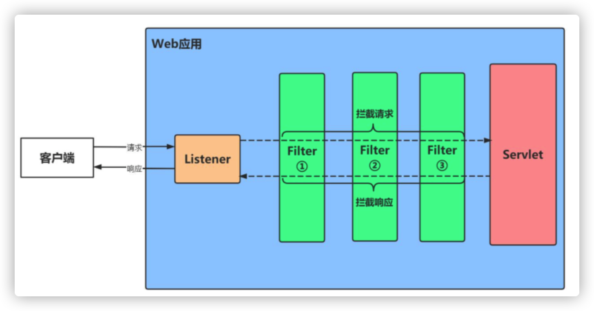

Tôi phát hiện ra 2 cuốn sách tranh phổ biến kiến thức mạng máy tính rất hay: **《Minh họa trực quan HTTP》(Illustrated HTTP / 图解HTTP) và 《Minh họa trực quan TCP/IP》(Illustrated TCP/IP / 图解TCPIP)**.

Đây là 2 cuốn sách tranh phổ biến kiến thức do tác giả Nhật Bản biên soạn, cực kỳ thích hợp cho người mới bắt đầu nhập môn Mạng máy tính. Ban đầu tôi cũng nhờ đọc 2 cuốn sách nhỏ này mà bước chân vào tìm hiểu mạng máy tính.

Trong sách có rất nhiều tranh minh họa, cực kỳ thân thiện với người mới bắt đầu. Rất khuyên bạn nên sử dụng 2 cuốn này để nhập môn Mạng máy tính.

Cuốn sách kinh điển dày cộp như **《TCP/IP Illustrated, Volume 1》** quả thực rất giá trị, **nhưng nếu vừa vào đã đọc trực tiếp** thì quá dễ nản, đọc chưa nổi hai trang đã thấy buồn ngủ, hoàn toàn không thể nuốt trôi.

**Bắt đầu từ những gì đơn giản, dễ tiếp cận, chẳng phải tốt hơn nhiều sao?**

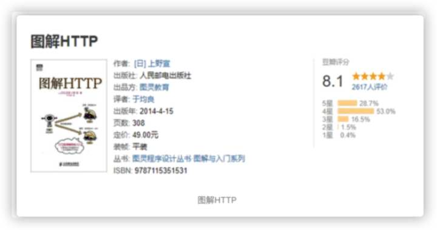

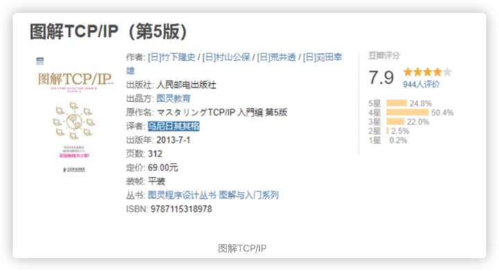

### 2 khóa học video rất chất lượng

Sau khi đọc xong những cuốn sách tranh minh họa ở trên, bạn có thể bắt đầu xem ngay các video về Mạng máy tính. Bạn có thể chọn 1 trong 2 video dưới đây; nếu có nhiều thời gian thì hãy xem cả hai!

**1. Khóa học Mạng máy tính của thầy Hàn Lập Cương (Bắt buộc xem)**

Nếu để tôi giới thiệu một khóa học video về Mạng máy tính, tôi nghĩ không ai phù hợp hơn thầy Hàn Lập Cương (Han Ligang). Thầy Hàn giảng bài rất gần gũi, không khí lớp học lại hóm hỉnh và lôi cuốn, không có điểm gì để chê.

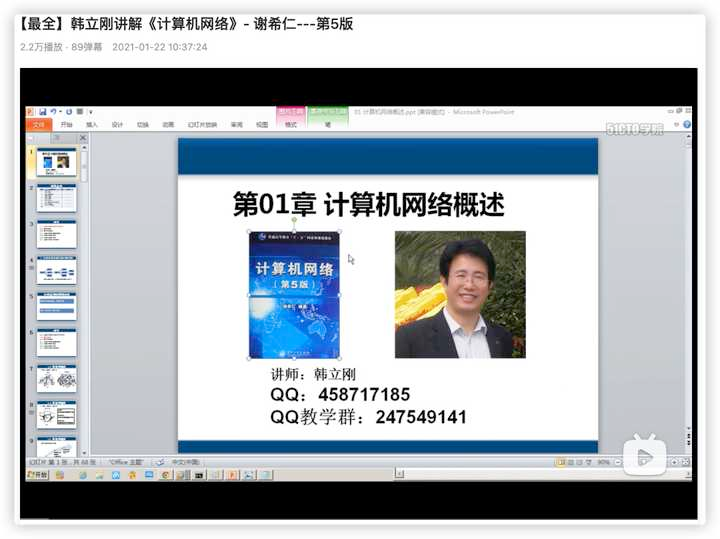

Cực kỳ khuyến nghị khóa học Mạng máy tính của thầy Hàn!

**Địa chỉ**: [https://www.bilibili.com/video/BV1Q](https://link.zhihu.com/?target=https%3A//www.bilibili.com/video/BV1Qr4y1N7cH)

**2. Khóa học "Lớp học nhỏ Mạng máy tính"**

Khóa học này mới trở nên nổi tiếng trong khoảng hai năm trở lại đây, có thể thời gian chưa lâu bằng khóa của thầy Hàn, nhưng chất lượng vẫn cực kỳ xuất sắc. Thầy giáo giảng bài rất trực quan và sinh động, có rất nhiều hiệu ứng hoạt hình PPT đẹp mắt giúp bạn hiểu rõ ràng và sâu sắc hơn!

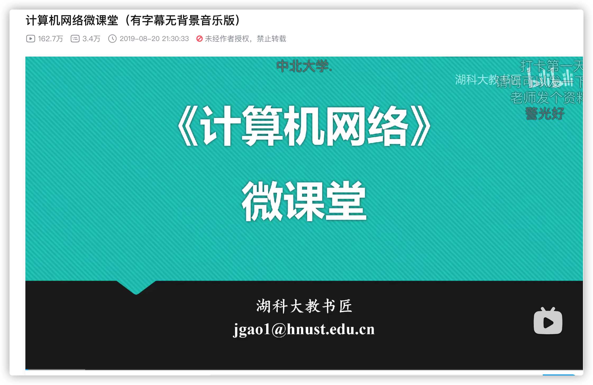

Chỉ cần nhìn phần bình luận bên dưới video là đủ thấy khóa học này được yêu thích đến mức nào.

Địa chỉ: [https://www.bilibili.com/video/BV1c4411d7jb](https://www.bilibili.com/video/BV1c4411d7jb)

### Lộ trình tiếp theo + Củng cố kiến thức

Đúng như tôi đã nói ở phần đầu bài viết, những nội dung ở trên chưa đủ để bạn làm chủ toàn diện Mạng máy tính, nhưng có thể giúp bạn có được hiểu biết khái quát.

**Nếu muốn tham gia phỏng vấn tuyển dụng mùa thu, bạn chỉ cần bám sát các nội dung trên website ghi chép học tập trước đây của tôi để ôn luyện thật kỹ là được! Đặc biệt là các nội dung liên quan đến TCP và UDP.**

**Câu hỏi phỏng vấn Mạng máy tính tần suất cao**: [https://interviewguide.cn/notes/03-hunting_job/02-interview/02-01-%E6%93%8D%E4%BD%9C%E7%B3%BB%E7%BB%9F.html](https://interviewguide.cn/notes/03-hunting_job/02-interview/03-01-net.html)

## Cơ sở dữ liệu (Database)

Nhiều bạn khi nhắc đến cơ sở dữ liệu chỉ nghĩ ngay tới MySQL hoặc SQL Server. Thực ra, việc học cơ sở dữ liệu thường được chia thành học Cơ sở dữ liệu quan hệ (RDBMS) và Cơ sở dữ liệu phi quan hệ (NoSQL).

Đại diện tiêu biểu cho loại thứ nhất là MySQL, đại diện tiêu biểu cho loại thứ hai là cơ sở dữ liệu lưu trữ trên bộ nhớ Redis (In-Memory Database) và cơ sở dữ liệu hướng tài liệu MongoDB (Document Database). Đối với đa số lập trình viên, chỉ cần học vững MySQL + Redis là về cơ bản đã đủ dùng.

Trừ phi bạn có định hướng làm việc ở các vị trí phát triển nhân cơ sở dữ liệu (Database Kernel Engineer) thì mới cần tìm hiểu sâu thêm các loại cơ sở dữ liệu khác.

### SQL

Tuy nhiên, rất nhiều bạn không biết rằng ngôn ngữ thao tác cơ sở dữ liệu, tức là SQL, thực sự cũng cần phải học bài bản, bởi vì trong phỏng vấn người ta cũng sẽ kiểm tra bạn về ngôn ngữ SQL. Về điểm này bạn có thể xem lại kinh nghiệm học tập trước đây của tôi.

Trước đây tôi từng chia sẻ một số phương pháp tự học SQL của bản thân. Cho đến tận bây giờ khi đã đi làm hơn 2 năm, lượng kiến thức SQL tôi học hồi đó **cơ bản vẫn hoàn toàn đủ dùng**.

Nói một cách thực tế: trong quá trình nghiên cứu phát triển hàng ngày, khi viết câu lệnh SQL tôi hầu như không cần phải tra cứu tài liệu, chỉ cần suy nghĩ một chút là có thể viết ra được ngay, không bao giờ rơi vào tình trạng "đầu thì hiểu nhưng tay không viết ra được".

Bạn có thể đọc trực tiếp bài viết tôi đã chia sẻ: [Vị trí kỹ thuật yêu cầu mức độ thành thạo SQL như thế nào?](https://mp.weixin.qq.com/s?__biz=Mzk0ODU4MzEzMw==&mid=2247512032&idx=1&sn=4b559390726b097f7653caf551bf9e21&source=41#wechat_redirect)

Dưới đây là một số câu hỏi từ các bạn trong cộng đồng học tập cùng với liên kết chia sẻ ghi chép đọc sách SQL của tôi: 《SQL Khởi sắc / MySQL Bắt buộc phải biết》(Sams Teach Yourself SQL / MySQL in 10 Minutes).

1. Xin hỏi anh Tú về phương pháp học SQL, làm sao để học tốt SQL? [https://t.zsxq.com/02bUzbU3f](https://t.zsxq.com/02bUzbU3f)

2. Phỏng vấn SQL thường kiểm tra những dạng bài nào? Có khó không? [https://t.zsxq.com/02emAe6E2](https://t.zsxq.com/02emAe6E2)

3. Chưa có nền tảng thực hành thực tế với MySQL và Redis thì phải làm sao? [https://t.zsxq.com/02rbuvbEe](https://t.zsxq.com/02rbuvbEe)

### MySQL

#### Nhập môn cho người mới & sinh viên trái ngành

Đối với mảng cơ sở dữ liệu thực ra không có khái niệm nhập môn hay không nhập môn quá phức tạp. Nếu nói về nhập môn thì đại khái bạn cần hiểu cơ sở dữ liệu dùng để làm gì, nắm được các câu lệnh DML (Data Manipulation Language), DDL (Data Definition Language) cơ bản nhất — đây chính là vai trò của cuốn sách nhỏ 《MySQL Bắt buộc phải biết》.

Khuyên bạn ít nhất nên tự mình làm theo các ví dụ trong sách, tự tay gõ lại toàn bộ các đoạn code mẫu một lần; trong link chia sẻ ở trên có ghi lại phương pháp và ghi chép đọc sách của tôi.

#### 1 khóa học video tương đối quan trọng + 2 chuyên mục online đắt giá

**Trước tiên nói về video**

Cá nhân tôi khuyên bạn nên xem video nhập môn MySQL của Thượng Quy Cốc (Atguigu). Tuy gọi là "nhập môn" nhưng nội dung được giảng dạy không hề nông cạn chút nào.

Hồi mới bắt đầu nhập môn tôi cũng học từ chính video cơ sở dữ liệu này, tôi thấy giảng rất hay, nay xin giới thiệu lại cho các bạn!

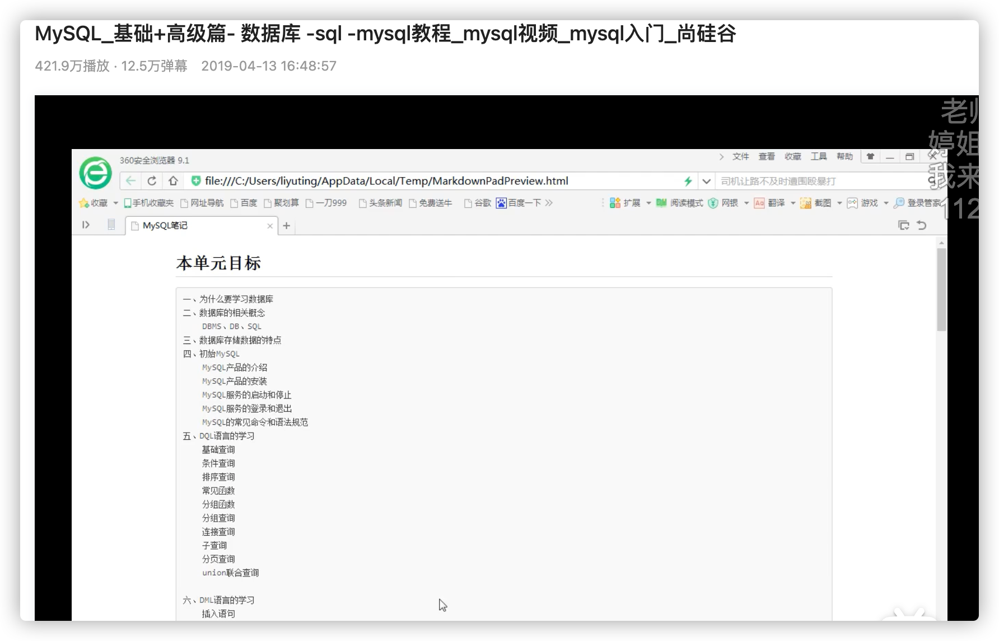

**Địa chỉ**: [https://www.bilibili.com/video/BV12b411K7Zu](https://www.bilibili.com/video/BV12b411K7Zu)

Video này được chia thành phần Sơ cấp và Cao cấp, thông thường chỉ cần học phần Sơ cấp là đã đủ dùng; bạn nào còn thời gian và sức lực thì có thể xem thêm phần Cao cấp.

**Tiếp theo nói về chuyên mục online**

Các chuyên mục kỹ thuật chuyên sâu về MySQL có rất nhiều. Trong trang Tài nguyên chọn lọc chất lượng cao tôi cũng đã từng giới thiệu một số tài liệu hay mình từng học: [https://interviewguide.cn/notes/07-resources/02-precious.html#_2%E3%80%81mysql45%E8%AE%B2](https://interviewguide.cn/notes/07-resources/02-precious.html#_2、mysql45讲)

Trong đó có một chuyên mục về MySQL cực hay là 《**45 bài giảng MySQL**》(MySQL 45 Lectures) trên Geek Time do chuyên gia cơ sở dữ liệu - cựu chuyên gia kỹ thuật cấp cao của Alibaba là Đinh Kỳ (Ding Qi) biên soạn. Riêng 10 chương đầu, bản thân A Tú đã đọc đi đọc lại rất nhiều lần.

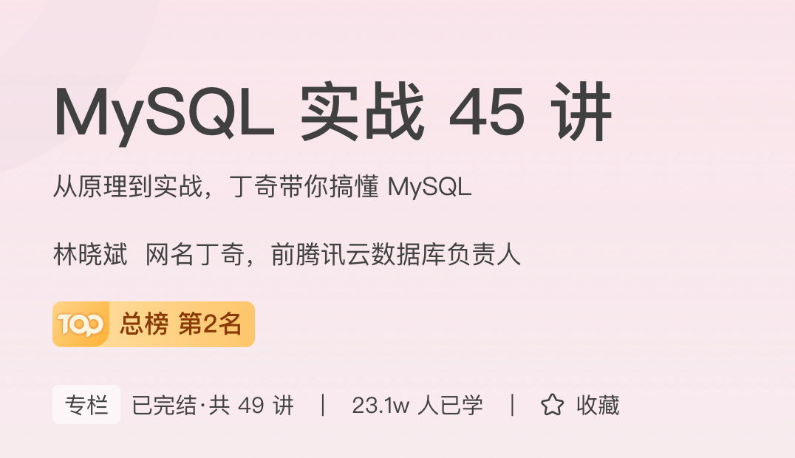

Khóa học này thực sự đã phân tích chi tiết rất nhiều công nghệ cốt lõi của MySQL, quan trọng hơn là có rất nhiều lời giải thích cặn kẽ về nguyên lý như: cấu trúc dữ liệu, chỉ mục (index), giao dịch (transaction), khóa (lock) và mối quan hệ tương hỗ giữa chúng. Tôi cảm thấy **đây là một trong những chuyên mục online xứng đáng từng đồng tiền bát gạo nhất mà tôi từng mua trên Geek Time**, không có cái thứ hai!!

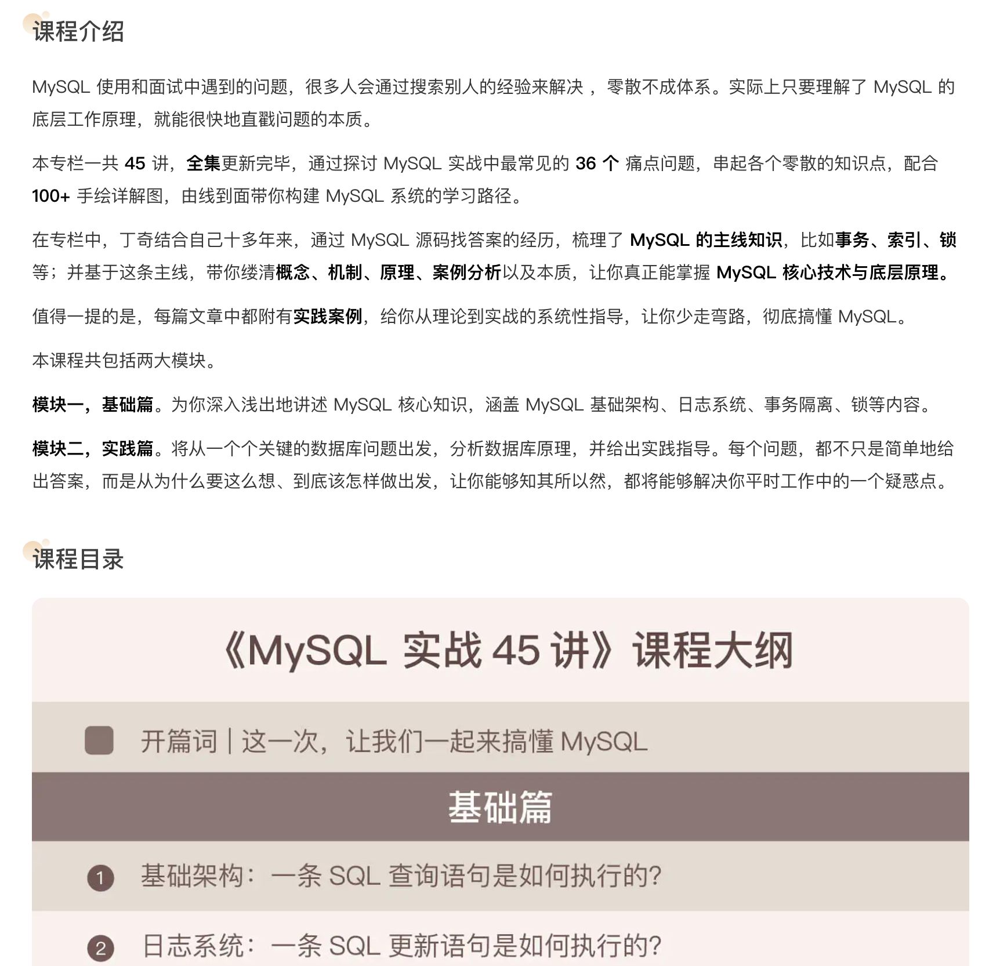

Những điều khác tôi không nhắc lại nữa, tôi chỉ muốn khẳng định rằng nếu bạn định theo hướng Backend, cơ sở dữ liệu là kỹ năng bạn bắt buộc phải làm chủ, mà cơ sở dữ liệu quan hệ MySQL chính là đại diện tiêu biểu nhất.
Liên kết chuyên mục 《45 bài giảng MySQL》: [http://gk.link/a/11nhx(opens new window)](http://gk.link/a/11nhx)

Ngoài ra, còn một cuốn cẩm nang online tương tự trên Juejin là 《**MySQL hoạt động như thế nào?**(How MySQL Works / MySQL是怎样运行的)》 với chất lượng cũng rất ấn tượng. Sự khác biệt giữa 2 tài liệu này là: 《MySQL hoạt động như thế nào?》 dùng ngôn từ hóm hỉnh, gần gũi hơn nên khi đọc không cảm thấy khô khan; trong khi cuốn 《**45 bài giảng MySQL**》 trên Geek Time mang tính trang trọng, quy củ hơn, nhưng xét về tính toàn diện thì 《**45 bài giảng MySQL**》 lại sâu sắc và đầy đủ hơn nhiều.

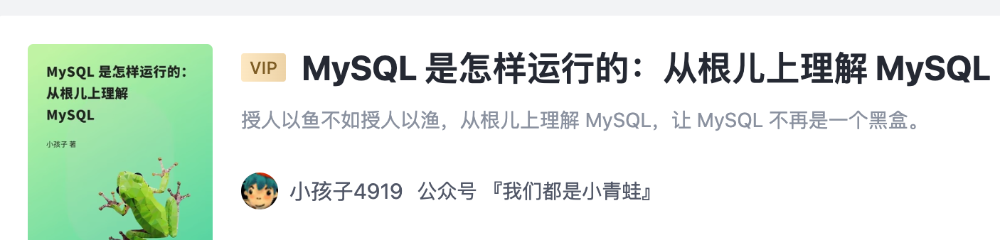

Ban đầu tôi đọc 《45 bài giảng MySQL》 trước, nhưng lượt đầu không đọc hết nổi, chỉ đọc đến bài hai mươi mấy là thấy không theo kịp vì quá hệ thống và chuyên sâu. Sau đó được sư huynh giới thiệu cuốn 《**MySQL hoạt động như thế nào?**》, thấy giá chỉ có 30 tệ nên tôi mua luôn...

Tôi chỉ có thể thốt lên là **quá hời**. Đọc xong cuốn này tôi mới có đủ nền tảng để quay lại đọc tiếp 《45 bài giảng MySQL》. Nếu bạn cũng muốn xây dựng nền tảng cơ sở dữ liệu từ con số 0 giống như tôi, bạn có thể tham khảo lộ trình học cơ sở dữ liệu này.

Liên kết cẩm nang Juejin 《**MySQL hoạt động như thế nào?**》: [https://juejin.cn/book/6844733769996304392](https://juejin.cn/book/6844733769996304392?suid=1442199805108055&source=ios)

#### Lộ trình tiếp theo + Củng cố kiến thức

Việc học MySQL không thể hoàn thành trong một sớm một chiều hay qua một hai video ngắn ngủi, nhưng những nội dung ở trên cơ bản đã đủ để bạn nắm vững cơ sở dữ liệu.

**Nếu muốn tham gia phỏng vấn tuyển dụng mùa thu, bạn chỉ cần bám sát các nội dung trên website ghi chép học tập trước đây của tôi để ôn luyện thật kỹ là được!**

**Câu hỏi phỏng vấn MySQL tần suất cao**: [https://interviewguide.cn/notes/03-hunting_job/02-interview/04-01-01-MySQL.html](https://interviewguide.cn/notes/03-hunting_job/02-interview/04-01-01-MySQL.html)

### Redis

Xét theo nghĩa khắt khe, Redis không có nhiều tài liệu mức độ nhập môn kinh điển để gợi ý. Nếu bắt buộc phải chọn một, thì video Redis của thầy Chu Dương (Zhou Yang) tại Thượng Quy Cốc là một cái tên sáng giá.

Đây cũng là khóa học video duy nhất về Redis mà tôi từng xem. Đứng từ góc độ cá nhân, tôi thấy bài giảng rất hay, có thể coi là **tác phẩm đỉnh cao về Redis của Thượng Quy Cốc**.

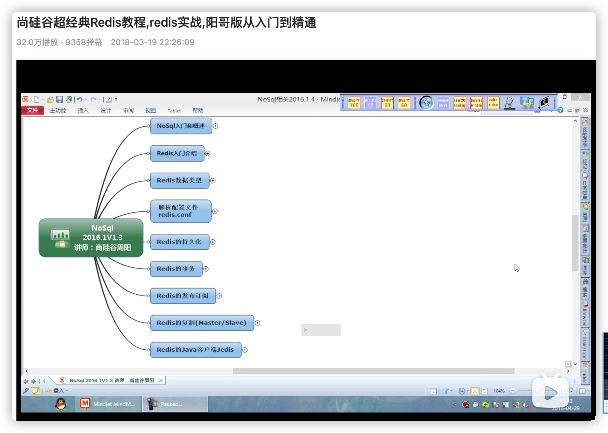

**Địa chỉ**: [https://www.bilibili.com/video/BV1oW411u75R](https://www.bilibili.com/video/BV1oW411u75R)

#### 1 video tương đối quan trọng + 1 cuốn sách + 1 chuyên mục online

Video bài giảng chính là khóa học được nhắc đến ở trên. Còn về sách, cuốn 《Thiết kế và Hiện thực hóa Redis》(Redis Design and Implementation / Redis设计与实现) là quá đủ để dẫn dắt bạn bước vào thế giới nội tại của Redis.

Ngoài ra cuốn 《Redis thực chiến》(Redis in Action / Redis实战) cũng rất hay, nhưng có thể để lại đọc sau, chưa cần vội vàng.

Còn về chuyên mục online, đó chính là chuyên mục 《Công nghệ cốt lõi & Thực chiến Redis》 do Giáo sư Tưởng Đức Quân (Jiang Dejun) thuộc Viện Hàn lâm Khoa học Trung Quốc biên soạn. Chuyên mục này cực kỳ xuất sắc, hướng dẫn bạn thấu suốt Redis từ tận gốc rễ nguyên lý.

Đối với mảng cơ sở dữ liệu, tôi cũng đã từng đọc rất nhiều sách và tài liệu, trong đó 2 nguồn tài liệu tôi thấy chi tiền xứng đáng nhất chính là 《45 bài giảng MySQL》 và 《Công nghệ cốt lõi & Thực chiến Redis》 này. Nếu bạn là lập trình viên Backend, rất khuyên bạn nên học cả 2 chuyên mục này, bởi hiện nay hầu như không có dự án Backend nào mà không dùng đến Redis...

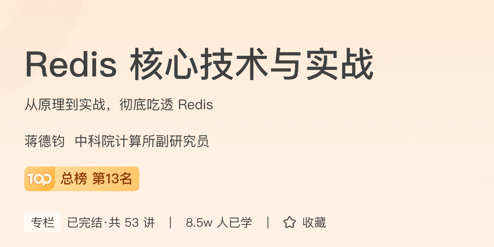

Liên kết 《Công nghệ cốt lõi & Thực chiến Redis》: [http://gk.link/a/11osC(opens new window)](http://gk.link/a/11osC)

#### Lộ trình tiếp theo + Củng cố kiến thức

Redis là một kỹ năng đòi hỏi bạn phải tự tay thực hành và sử dụng nhiều. Rất nhiều người trong lần đầu sử dụng thậm chí còn không biết cách đặt thời gian hết hạn (TTL / expire time) cho key... Do đó về sau bạn nhất định phải tự tay ứng dụng thật nhiều.

**Nếu muốn tham gia phỏng vấn tuyển dụng mùa thu, bạn chỉ cần bám sát các nội dung trên website ghi chép học tập trước đây của tôi để ôn luyện thật kỹ nhé!**

**Câu hỏi phỏng vấn Redis tần suất cao**: [https://interviewguide.cn/notes/03-hunting_job/02-interview/04-02-01-Redis.html](https://interviewguide.cn/notes/03-hunting_job/02-interview/04-02-01-Redis.html)
