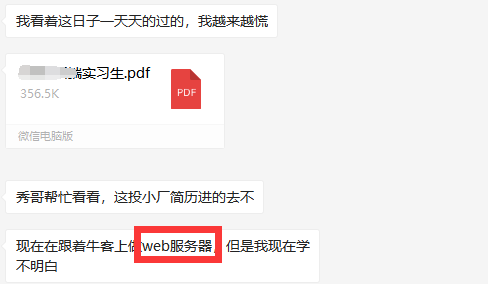
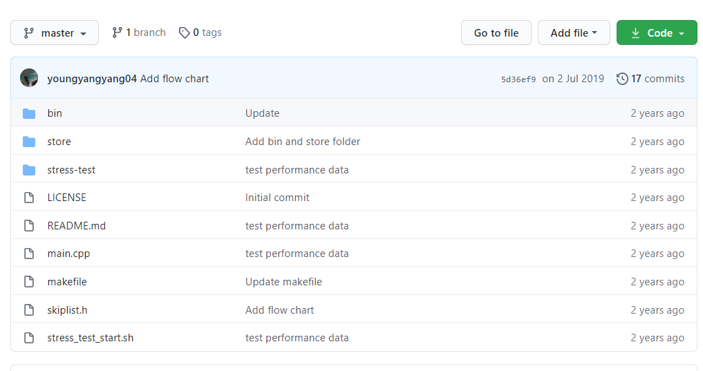

<h1 align="center">Web Server quá đại trà? Thử ngay dự án này nhé | Có thể tôi là người đầu tiên gợi ý dự án này</h1>

> Tác giả: A Tú (阿秀)
>
> Liên kết bài viết gốc: [https://mp.weixin.qq.com/s/qnSCGetdhnOyY4kTRPp0UA](https://mp.weixin.qq.com/s/qnSCGetdhnOyY4kTRPp0UA)

  
Đây là 6 thông tin có thể sẽ hữu ích cho bạn:

⭐️1. A Tú cùng bạn bè hợp tác phát triển một website tài nguyên lập trình, hiện đã tổng hợp rất nhiều tài liệu học tập chất lượng và công cụ hữu ích (kèm link tải). Nếu bạn đang tìm kiếm tài nguyên lập trình phù hợp, <a href="https://tools.interviewguide.cn/home" style="text-decoration: underline" target="_blank">hoan nghênh trải nghiệm</a> cũng như giới thiệu những tài nguyên bạn thấy hay. Góp gió thành bão, mình vì mọi người, mọi người vì mình🔥!
  
2. 👉 Tháng 5/2023, trong thời gian <a style="text-decoration: underline" href="https://mp.weixin.qq.com/s?__biz=Mzk0ODU4MzEzMw==&mid=2247512170&idx=1&sn=c4a04a383d2dfdece676b75f17224e78" target="_blank">rời ByteDance để chuyển sang một công ty đa quốc gia</a>, nhằm thuận tiện cho bản thân khi tìm việc và nâng cao tỷ lệ trúng tuyển, A Tú cùng bạn bè đã phát triển từ con số 0 một website giải đề phỏng vấn thực chiến của các Big Tech, bao gồm hai frontend và một backend. Trang web cho phép tra cứu có định hướng đề thi viết của các công ty Internet, ví dụ như muốn tra cứu đề thi viết của ByteDance trong 1 năm gần đây gồm những gì đều có thể làm được. Hoan nghênh trải nghiệm~

Địa chỉ website: <a style="text-decoration: underline" href="https://niumacode.com/home?ref=F6O2625K" target="_blank">Website đề thi thuật toán phỏng vấn Big Tech</a>.
    
3. 😊
    Chia sẻ một website công cụ tiện ích mà A Tú tâm đắc sưu tầm, <a style="text-decoration: underline" href="https://hkjtz.cn/" target="_blank">nhấn vào đây để truy cập</a>, chủ yếu là các ứng dụng, website ngách hữu ích, ngoài ra còn có tài nguyên phim ảnh HD, âm nhạc, phim truyền hình, AI, phim tài liệu, tài liệu thi tiếng Anh, thi công chức, cao học, nghề tay trái...
  

  
4. 😍 Chia sẻ miễn phí tài nguyên học tập mà A Tú đã tích lũy từ khi theo học máy tính, <a style="text-decoration: underline" href="/notes/07-resources/01-free/01-introduce.html" target="_blank">nhấn vào đây để nhận miễn phí</a>; đồng thời cũng lưu lại nhật ký đánh giá <a style="text-decoration: underline" href="/notes/07-resources/02-precious.html" target="_blank">những cuốn sách máy tính, chuyên mục online chất lượng cũng như những khóa học trả phí kém chất lượng</a> từng mua trước đây.
  

  
5. 🚀 Nếu bạn muốn thuận lợi giành được offer tốt hơn trong kỳ tuyển dụng trường học (Campus Recruitment), A Tú khuyên bạn nên xem thêm những <a style="text-decoration: underline" href="https://www.yuque.com/tuobaaxiu/httmmc/npg1k81zeq4wfpyz" target="_blank">cạm bẫy từng vấp phải</a> và <a style="text-decoration: underline"  target="_blank" href="https://www.yuque.com/tuobaaxiu/httmmc/gge9ppd0mbu2d3dp">kinh nghiệm đúc kết</a> của người đi trước. Thực tế, hầu hết các vấn đề bạn đang gặp phải thì các anh chị khóa trước đều đã từng trải qua.
  

  
6. 🔥 Hoan nghênh các bạn đang chuẩn bị cho kỳ tuyển dụng trường học ngành CNTT tham gia <a  style="text-decoration: underline" href="https://www.yuque.com/tuobaaxiu/httmmc/xg0otqvc17wfx4u9" target="_blank">Cộng đồng học tập</a> của tôi. Độc hành một mình chi bằng cùng nhau sưởi ấm, trong nhóm đã đọng lại rất nhiều <a  style="text-decoration: underline" href="https://www.yuque.com/tuobaaxiu/httmmc/gge9ppd0mbu2d3dp" target="_blank">kinh nghiệm và tổng kết</a> của các anh chị khóa 21/22/23/24/25. Kiên trì đi theo lộ trình, cuối cùng đa phần đều có thể nhận được offer ưng ý! Nếu bạn cần phiên bản PDF tổng hợp các điểm kiến thức 📚︎ Bát cổ văn phỏng vấn tuyển dụng trường học trên website 《Ghi chép học tập của A Tú》, có thể <a style="text-decoration: underline" href="https://www.yuque.com/tuobaaxiu/httmmc/qs0yn66apvkzw0ps" target="_blank">nhấn vào đây để tải về</a>.
   

    
Chào mọi người, tôi là A Tú.

Tôi lại đến để chia sẻ những điều bổ ích cho mọi người đây. Có lẽ dạo gần đây đang là thời điểm vàng của đợt tuyển dụng mùa xuân (Spring Recruitment), rất nhiều bạn sinh viên tìm đến tôi xin lời khuyên tìm việc và góp ý sửa CV. Tuy nhiên, câu hỏi được hỏi nhiều nhất vẫn là mong tôi gợi ý một số dự án để đưa vào CV, bởi vì dự án Web Server giờ đã quá đại trà rồi.

Thực ra trong các bài viết trước đây tôi đã từng giới thiệu một số dự án C++ rất hay, các bạn có thể tìm xem lại.

Hôm nay tôi xin giới thiệu một dự án **C++** mới toanh mà tôi phát hiện vài tháng trước. Trong buổi livestream chia sẻ tuyển dụng trường học trên WeChat Channels vào tối 25/02/2021 tôi cũng đã gợi ý cho nhiều bạn, giờ xin chính thức chia sẻ tới mọi người.

Hãy hứa với tôi, tạm gác chiếc Web Server trong tay bạn lại được không nào haha.

> Có vẻ như trong kỳ tuyển dụng trường học, các bạn C++ ai ai cũng có Web Server, còn các bạn Java ai ai cũng có dự án E-commerce hoặc RPC vậy.

**Title** : Skiplist-CPP

**Description** : A tiny KV storage based on skiplist written in C++ language

Một cơ sở dữ liệu dạng Key-Value (KV storage) dung lượng nhẹ dựa trên cấu trúc bảng nhảy (Skip List) được lập trình bằng C++.

Các API chức năng chính bao gồm:

* insertElement
* deleteElement 
* searchElement
* displayList
* dumpFile 
* loadFile
* size

Đồng thời tác giả cũng cung cấp một số số liệu hiệu năng (Performance Data) như sau:

## Insert

skiplist tree high:18  
insert random key

| insert element num (w) | timecost (s) |
| ---------------------- | ------------ |
| 10                     | 0.316763     |
| 50                     | 1.86778      |
| 100                    | 4.10648      |

QPS: 24.39w

## Get

| search element (w) | timecost (s) | skiplist size (w) |
| ------------------ | ------------ | ----------------- |
| 10                 | 0.47148      | 10                |
| 50                 | 2.56373      | 50                |
| 100                | 5.43204      | 100               |

QPS: 18.41w

## Lý do gợi ý dự án này

1. Chủ yếu là vì Web Server đã quá đại trà (bão hòa), tôi cảm giác trong CV của bất kỳ bạn nào theo C++ cũng đều có Web Server, quá rập khuôn và thiếu điểm nhấn.

2. Dự án này liên kết trực tiếp với cấu trúc Skip List trong Redis. Khi phỏng vấn, nếu người phỏng vấn hỏi về dự án của bạn, bạn rất dễ dàng dẫn dắt câu chuyện sang Skip List, từ đó kết nối tự nhiên sang Redis — mà Redis lại là điểm kiến thức gần như bắt buộc phải hỏi đối với vị trí Backend Development.

Vì vậy, làm dự án này tương đương với việc bạn chủ động "mở sẵn một cánh cửa" để người phỏng vấn bước vào. Nếu họ nhân cơ hội hỏi về Redis, bạn hoàn toàn có thể tự tin làm chủ cuộc trò chuyện~

Tuy nhiên cũng cần lưu ý: đừng tự đào hố chôn mình! Tiền đề khi đưa dự án này vào CV là bạn phải nắm vững các kiến thức phổ biến về Redis, ví dụ như: `5 cấu trúc dữ liệu cơ bản`, `mô hình tầng đáy (underlying models)`, `Cache Penetration (Xuyên thủng bộ nhớ đệm)`, `Cache Avalanche (Tuyết lở bộ nhớ đệm)`, v.v.

Tuyệt đối đừng để bản thân hoàn toàn mù tịt về Redis mà vẫn ghi dự án này vào CV, như vậy chẳng khác nào tự rước họa vào thân.

Các bạn C++ chuẩn bị thi tuyển sinh viên thực ra không có quá nhiều lựa chọn dự án, dự án này là do tôi tự mình khám phá. Với tinh thần có cái gì hay thì chia sẻ cho mọi người, A Tú gợi ý dự án này để các bạn tùy theo tình hình cụ thể của bản thân mà lựa chọn, phù hợp nhất với bản thân mới là tốt nhất.

## Cách nhận dự án

Tôi đã tải sẵn mã nguồn của dự án này về, các bạn có thể vào kênh Official Account gửi tin nhắn từ khóa 「**跳表项目**」 (Dự án Skip List) để nhận liên kết.

## Lời kết

Hiện tại tôi vẫn chưa thấy ai gợi ý dự án này trên mạng, có lẽ tôi là **người đầu tiên** giới thiệu dự án này rồi haha.

Dạo gần đây A Tú cũng có khá nhiều việc bận, khi viết xong bài này thì đã là 0:15 sáng ngày 11/03/2021. Nếu các bạn thấy dự án này hữu ích, hãy để lại một nút like ủng hộ nhé! Vô cùng cảm ơn mọi người~
