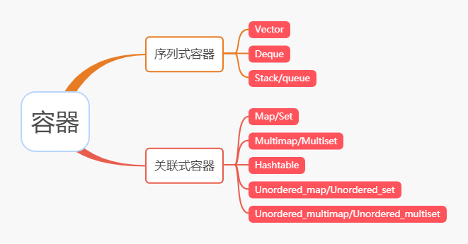
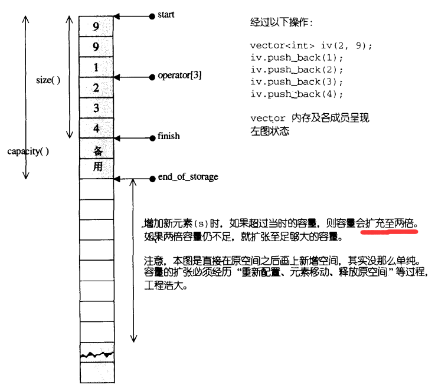
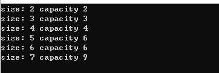
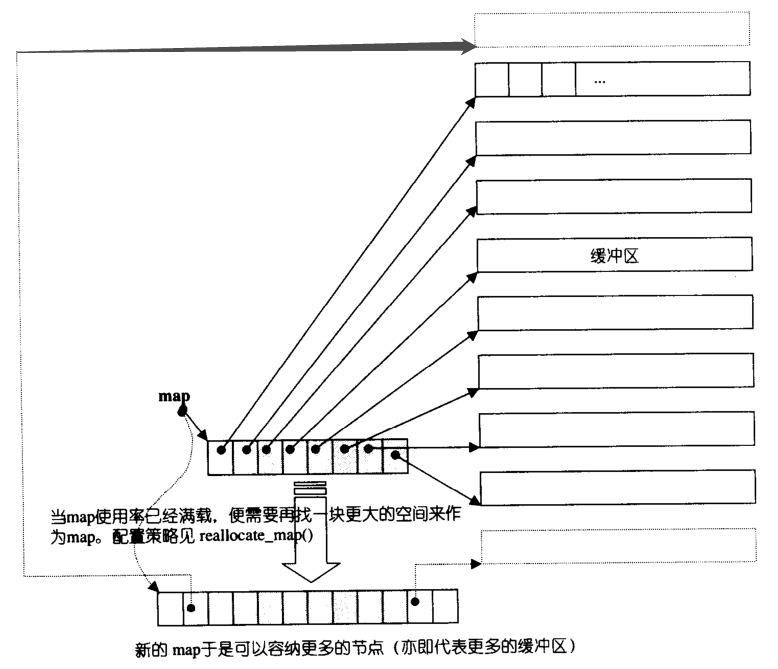
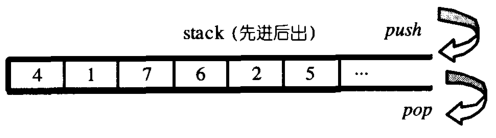
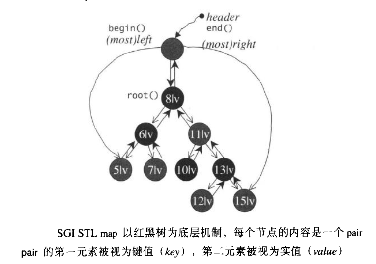
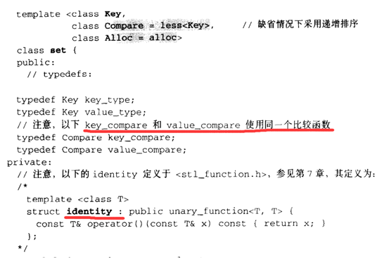
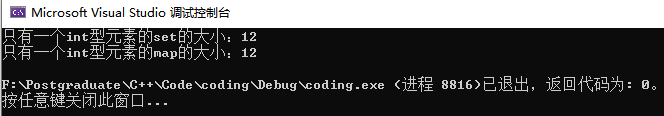
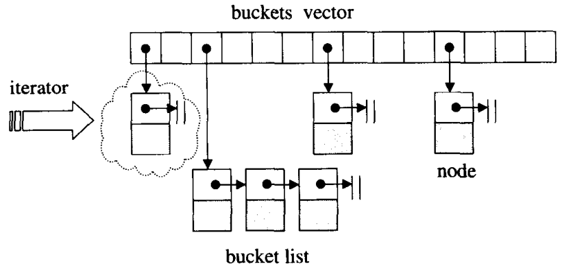

<h1 align="center">Sau khi đọc 2 lần cuốn 《Phân tích mã nguồn STL》, tôi đã khám phá ra một số bí mật</h1>

> Tác giả: A Tú (阿秀)
>
> Liên kết bài viết gốc: [https://mp.weixin.qq.com/s/vk3dpHrwQQJTfSLGf_xt9g](https://mp.weixin.qq.com/s/vk3dpHrwQQJTfSLGf_xt9g)

<div style="border-color: #24C6DC;
            background-color: #e9f9f3;         
            margin: 1rem 0;
        padding: .25rem 1rem;
        border-left-width: .3rem;
        border-left-style: solid;
        border-radius: .5rem;
        color: inherit;">
  <p>Đây là 6 thông tin có thể sẽ hữu ích cho bạn:</p>
<p>⭐️1. A Tú cùng bạn bè hợp tác phát triển một <span style="font-weight:bold;color:red">website tài nguyên lập trình</span>, hiện đã tổng hợp rất nhiều tài liệu học tập chất lượng và công cụ hữu ích (kèm link tải). Nếu bạn đang tìm kiếm tài nguyên lập trình phù hợp, <a href="https://tools.interviewguide.cn/home" style="text-decoration: underline" target="_blank">hoan nghênh trải nghiệm</a> cũng như giới thiệu những tài nguyên bạn thấy hay. Góp gió thành bão, mình vì mọi người, mọi người vì mình🔥!</p>  <p>2. 👉 Tháng 5/2023, trong thời gian <a style="text-decoration: underline" href="https://mp.weixin.qq.com/s?__biz=Mzk0ODU4MzEzMw==&mid=2247512170&idx=1&sn=c4a04a383d2dfdece676b75f17224e78" target="_blank">rời ByteDance để chuyển sang một công ty đa quốc gia</a>, nhằm <span style="font-weight:bold">thuận tiện cho bản thân khi tìm việc và nâng cao tỷ lệ trúng tuyển</span>, A Tú cùng bạn bè đã phát triển từ con số 0 một <span style="font-weight:bold;color:red">website giải đề phỏng vấn thực chiến của các Big Tech</span>, bao gồm hai frontend và một backend. Trang web cho phép tra cứu có định hướng đề thi viết của các công ty Internet, ví dụ như muốn tra cứu đề thi viết của ByteDance trong 1 năm gần đây gồm những gì đều có thể làm được. Hoan nghênh trải nghiệm~
<div align="center">
</div>Địa chỉ website: <a style="text-decoration: underline" href="https://niumacode.com/home?ref=F6O2625K" target="_blank">Website đề thi thuật toán phỏng vấn Big Tech</a>.
    </p>3. 😊
    Chia sẻ một <span style="font-weight:bold;color:red">website công cụ tiện ích</span> mà A Tú tâm đắc sưu tầm, <a style="text-decoration: underline" href="https://hkjtz.cn/" target="_blank">nhấn vào đây để truy cập</a>, chủ yếu là các ứng dụng, website ngách hữu ích, ngoài ra còn có tài nguyên phim ảnh HD, âm nhạc, phim truyền hình, AI, phim tài liệu, tài liệu thi tiếng Anh, thi công chức, cao học, nghề tay trái...
  </p>
  <p>4. 😍 Chia sẻ miễn phí tài nguyên học tập mà A Tú đã tích lũy từ khi theo học máy tính, <a style="text-decoration: underline" href="/notes/07-resources/01-free/01-introduce.html" target="_blank">nhấn vào đây để nhận miễn phí</a>; đồng thời cũng lưu lại nhật ký đánh giá <a style="text-decoration: underline" href="/notes/07-resources/02-precious.html" target="_blank">những cuốn sách máy tính, chuyên mục online chất lượng cũng như những khóa học trả phí kém chất lượng</a> từng mua trước đây.
  </p>
  <p>5. 🚀 Nếu bạn muốn thuận lợi giành được offer tốt hơn trong kỳ tuyển dụng trường học (Campus Recruitment), A Tú khuyên bạn nên xem thêm những <a style="text-decoration: underline" href="https://www.yuque.com/tuobaaxiu/httmmc/npg1k81zeq4wfpyz" target="_blank">cạm bẫy từng vấp phải</a> và <a style="text-decoration: underline"  target="_blank" href="https://www.yuque.com/tuobaaxiu/httmmc/gge9ppd0mbu2d3dp">kinh nghiệm đúc kết</a> của người đi trước. Thực tế, hầu hết các vấn đề bạn đang gặp phải thì các anh chị khóa trước đều đã từng trải qua.
  </p>
  <p>6. 🔥 Hoan nghênh các bạn đang chuẩn bị cho kỳ tuyển dụng trường học ngành CNTT tham gia <a  style="text-decoration: underline" href="https://www.yuque.com/tuobaaxiu/httmmc/xg0otqvc17wfx4u9" target="_blank">Cộng đồng học tập</a> của tôi. Độc hành một mình chi bằng cùng nhau sưởi ấm, trong nhóm đã đọng lại rất nhiều <a  style="text-decoration: underline" href="https://www.yuque.com/tuobaaxiu/httmmc/gge9ppd0mbu2d3dp" target="_blank">kinh nghiệm và tổng kết</a> của các anh chị khóa 21/22/23/24/25. Kiên trì đi theo lộ trình, cuối cùng đa phần đều có thể nhận được offer ưng ý! Nếu bạn cần phiên bản PDF tổng hợp các điểm kiến thức 📚︎ Bát cổ văn phỏng vấn tuyển dụng trường học trên website 《Ghi chép học tập của A Tú》, có thể <a style="text-decoration: underline" href="https://www.yuque.com/tuobaaxiu/httmmc/qs0yn66apvkzw0ps" target="_blank">nhấn vào đây để tải về</a>.</p>   </div>

Lưu ý trước khi đọc:

- Bài viết này được A Tú chuyển thể và cải biên từ một bài viết đóng góp trước đây. Khi đó câu chữ còn hơi non nớt, nay xin được viết lại và trau chuốt để cùng tiến bộ với mọi người!
- Đọc bài viết này đòi hỏi bạn cần có một lượng kiến thức C++ nền tảng nhất định, không dành cho người hoàn toàn mới, có thể coi là một bài viết tràn đầy kiến thức thực chiến (kiến thức cô đọng).
- Do trình độ bản thân có hạn, nếu tổng kết còn chỗ nào chưa chuẩn xác, rất mong các bạn góp ý và phê bình bên dưới phần bình luận.

## Lời mở đầu

Chào mọi người, tôi là A Tú.

Đối với bất kỳ ai theo học C++, STL có tầm quan trọng không thể bàn cãi, đặc biệt là những "bánh xe" tầng đáy được xây dựng sẵn cho chúng ta như Container (vùng chứa), Algorithm (thuật toán)... Ví dụ trên các nền tảng OJ, dùng các thuật toán trong STL để giải bài tập thì cảm giác vô cùng tiện lợi, ai dùng qua đều sẽ hiểu.

Không chỉ vậy, trong các buổi phỏng vấn tại các công ty Big Tech, C++ có hai điểm kiến thức phân loại ứng viên cực kỳ rõ nét: **Hàm ảo (Virtual Functions)** và **STL**.

Bất kể trình độ của bạn ra sao, chỉ cần hỏi sâu vào hai chủ đề này là nhà tuyển dụng sẽ biết ngay **năng lực thực sự của bạn ở mức nào**.

Hôm nay A Tú sẽ cùng mọi người hệ thống hóa lại các kiến thức quan trọng về **các container phổ biến** trong STL mà tôi đã đúc kết trong suốt hai năm học C++.

Trong quá trình này, A Tú cũng sẽ cùng các bạn trực tiếp viết code kiểm chứng xem những cái gọi là "định lý" lưu truyền trên mạng có thực sự đúng hay không.

Tôi rất tâm đắc một câu nói nổi tiếng của thầy Hầu Tiệp (Hou Jie): **Trước mặt mã nguồn, không có gì là bí mật**.


Bức ảnh thầy Hầu Tiệp phong độ ngời ngời trấn giữ bài viết.

**Được rồi, chúng ta bắt đầu lăn bánh thôi!**



Các container trong STL chủ yếu được chia thành hai nhóm lớn: **Sequence Containers (Container tuần tự)** và **Associative Containers (Container liên kết)**.

Sequence Containers đúng như tên gọi là các phần tử có mối quan hệ liền kề về mặt vật lý/tuần tự, ví dụ như mảng (array), ngăn xếp (stack), hàng đợi (queue), các phần tử nối tiếp nhau;

Associative Containers trọng tâm nằm ở hai chữ "liên kết", tức là giữa các phần tử phải tồn tại mối quan hệ tương hỗ nhất định thì mới được gọi là liên kết, ví dụ như cặp key và value trong hashtable (quan hệ 1-1 hoặc 1-nhiều).

## Sequence Containers (Container tuần tự)

### vector

Không biết các bạn khi giải thuật toán thích container nào nhất, còn với cá nhân tôi, container yêu thích nhất và dùng thuận tay nhất chắc chắn là `vector`.

Đây là một cấu trúc dữ liệu tương tự như mảng, rất giống với `array`, điểm khác biệt duy nhất giữa cả hai nằm ở tính linh hoạt khi sử dụng bộ nhớ: `vector` linh hoạt và tự động biến đổi, trong khi `array` có kích thước cố định:

- `array` chiếm **vùng không gian tĩnh (Static Memory)**. Tức là một khi đã cấp phát thì không thể thay đổi kích thước, nếu dung lượng không đủ bạn phải tự tạo một vùng nhớ mới lớn hơn, sao chép thủ công dữ liệu cũ sang vùng mới rồi giải phóng vùng nhớ cũ.
- `vector` sử dụng **vùng không gian động (Dynamic Memory)** linh hoạt hơn. Nó luôn duy trì một vùng không gian tuyến tính liên tục. Khi không gian không đủ, `vector` có thể tự động mở rộng để chứa các phần tử mới theo nhu cầu. Quá trình mở rộng này bên dưới vẫn phải trải qua: cấp phát vùng nhớ mới, di chuyển dữ liệu, giải phóng vùng nhớ cũ.

Trong cuốn 《Phân tích mã nguồn STL》, thầy Hầu Tiệp có viết hệ số mở rộng dung lượng của `vector` là gấp 2 lần, như hình bên dưới:



Nhưng trên mạng cũng có nơi nói là 1.5 lần. Sau khi tự mình bắt tay vào viết code thực nghiệm, tôi rút ra kết luận: **Quy tắc mở rộng dung lượng động phụ thuộc vào hệ điều hành / trình biên dịch, không có một con số cố định duy nhất cho mọi môi trường**, tức là trong các môi trường khác nhau hệ số mở rộng của `vector` sẽ khác nhau, không thể mặc định cứng là **2** lần.

Đoạn code thực nghiệm như sau:

```cpp
int main()
{
    vector<int> data(2, 1);
    cout << "size: " << data.size() << " capacity " << data.capacity() << endl;
    data.push_back(1);
    cout << "size: " << data.size() << " capacity " << data.capacity() << endl;
    data.push_back(1);
    cout << "size: " << data.size() << " capacity " << data.capacity() << endl;
    data.push_back(1);
    cout << "size: " << data.size() << " capacity " << data.capacity() << endl;
    data.push_back(1);
    cout << "size: " << data.size() << " capacity " << data.capacity() << endl;
    data.push_back(1);
    cout << "size: " << data.size() << " capacity " << data.capacity() << endl;
    return 0;
}
```




Kết luận:

- Trên Windows 10 + Visual Studio 2019 (MSVC), hệ số mở rộng dung lượng là **1.5 lần**.
- Trên môi trường Linux + g++ (GCC), hệ số mở rộng dung lượng là **2 lần** (Môi trường thử nghiệm: Ubuntu 18.04, g++ 5.4.0).

### deque

Khác với `vector` duy trì không gian tuyến tính liên tục mở một đầu (phía đuôi), `deque` duy trì một không gian tuyến tính liên tục mở hai đầu (Double-ended queue).

> Thành thật mà nói: `vector` thực ra cũng có thể thao tác chèn/xóa ở đầu, nhưng vì phải dịch chuyển toàn bộ các phần tử hiện có trong mảng nên hiệu năng thao tác ở đầu cực kỳ thấp. Nói chung không khuyến khích thao tác chèn xóa ở đầu `vector`.


Điểm khác biệt lớn nhất giữa `deque` và `vector` là `deque` không có khái niệm `capacity`, nó được ghép nối động từ các đoạn không gian liên tục (segmented continuous memory), như hình bên dưới.



Vì vậy, một khi cần mở rộng không gian, chỉ cần cấp phát thêm một đoạn không gian liên tục mới rồi ghép nối vào đầu hoặc đuôi là được. Do đó, điều quan trọng nhất đối với `deque` là làm thế nào để duy trì tính liên tục toàn cục giả lập này, và mấu chốt nằm ở cấu trúc iterator của `deque`. Hãy xem `deque` hiện thực hóa điều đó như thế nào:

Cấu trúc dữ liệu Iterator của `deque`:

```cpp
struct __deque_iterator
{
    ...
    T* cur; // Con trỏ chỉ tới phần tử hiện tại trong buffer
    T* first; // Con trỏ chỉ tới phần tử đầu tiên của buffer
    T* last; // Con trỏ chỉ tới phần tử cuối cùng của buffer
    map_pointer node; // Con trỏ chỉ tới node trong bản đồ quản lý (map)
    ...
};
```

Từ cấu trúc iterator của `deque` có thể thấy, để duy trì liên kết với container, iterator gồm 4 phần chính: `T* cur` (chỉ tới phần tử hiện tại), `T* first` (phần tử đầu của buffer), `T* last` (phần tử cuối của buffer), `map_pointer node` (chỉ tới node trong map). Cấu trúc như hình bên dưới:


Iterator của `deque` đặc biệt chú trọng đến việc kiểm tra xem có vượt quá biên giới hạn của buffer hay không. Khi iterator thực hiện thao tác tăng (`++`) hoặc giảm (`--`), trước tiên nó kiểm tra xem `cur` sau khi tăng/giảm có bị tràn buffer hay không. Nếu tràn biên, nó sẽ chuyển `node` sang buffer liền trước hoặc liền sau; nếu chưa tràn thì tiếp tục di chuyển bình thường trong buffer hiện tại.

### stack / queue

> `stack` và `queue` chính xác hơn nên được gọi là **Container Adapters (Bộ điều hợp vùng chứa)**, bởi vì cả `stack` và `queue` đều được hình thành bằng cách điều chỉnh và giới hạn các interface của những container khác để tạo thành một "kiểu container mới".

`stack` là cấu trúc dữ liệu vào sau ra trước (LIFO - Last In First Out), chỉ có thể lấy hoặc xóa phần tử thông qua đỉnh ngăn xếp (top), không có cách nào khác để truy cập trực tiếp các phần tử bên trong, và dĩ nhiên cũng không cung cấp iterator. Cấu trúc như sau:



Bản chất container tầng đáy của `stack` mặc định là `deque` (hoặc `list`), sau đó ẩn đi các interface không phù hợp. Mã nguồn một phần của `stack`:

```cpp
template <class T, class Sequence = deque<T> >
class stack
{
    ...
protected:
    Sequence c;
public:
    bool empty() const { return c.empty(); }
    size_type size() const { return c.size(); }
    reference top() { return c.back(); }
    const_reference top() const { return c.back(); }
    void push(const value_type& x) { c.push_back(x); }
    void pop() { c.pop_back(); }
};
```

Đáng chú ý: `Sequence` mặc định của `stack` là `deque`, nhưng nếu bạn muốn chỉ định `list` làm Sequence thì hoàn toàn có thể cấu hình được.

`queue` (hàng đợi) là cấu trúc dữ liệu vào trước ra trước (FIFO - First In First Out), thao tác thêm ở cuối và lấy ra ở đầu hàng đợi. Tương tự như `stack`, nó cũng không cung cấp iterator. Cấu trúc như sau:


Giống như `stack`, `Sequence` mặc định của `queue` cũng là `deque`, và bạn cũng có thể tự chỉ định `list` làm Sequence.

Mã nguồn một phần của `queue`:

```cpp
template <class T, class Sequence = deque<T> >
class queue
{
    ...
protected:
    Sequence c;
public:
    bool empty() const { return c.empty(); }
    size_type size() const { return c.size(); }
    reference front() { return c.front(); }
    const_reference front() const { return c.front(); }
    void push(const value_type& x) { c.push_back(x); }
    void pop() { c.pop_front(); }
    ...
};
```

## Associative Containers (Container liên kết)

### map / set

Trong `map`, tất cả các phần tử đều có kiểu `std::pair`, là một cấu trúc dữ liệu mà mọi phần tử sẽ được tự động sắp xếp theo khóa (key). Nó bao gồm 2 phần: khóa (`key`) và giá trị thực (`value`), tạo thành mối quan hệ một-một. Một khi `key` trong `map` đã được xác định thì `key` đó không thể sửa đổi được; chúng ta có thể dựa vào `key` để tìm `value` và thay đổi giá trị của `value` đó.

Kiến trúc của `map` như hình dưới:



Đáng chú ý là khi khởi tạo `map`, mặc định sẽ áp dụng quy tắc tăng dần (ascending) để sắp xếp các `key`. Khi chèn phần tử, `map` gọi hàm **insert_unique()** trong cây đỏ đen (Red-Black Tree - rb_tree), chứ không phải hàm **insert_equal()**.

Sự khác biệt giữa hai hàm:

- `insert_unique()`: Chèn độc nhất, đúng như tên gọi. Nếu trong map hiện tại đã tồn tại phần tử có cùng key, việc chèn sẽ thất bại; chỉ khi map chưa có key đó mới chèn thành công. Điều này đảm bảo từ tầng mã nguồn rằng: một key **chỉ tương ứng duy nhất** với một value.
- `insert_equal()`: Chèn cho phép trùng lặp. Nếu trong map hiện tại đã có key giống vậy, thao tác chèn vẫn thành công. Hàm này chủ yếu dùng cho `multimap` (một key có thể ánh xạ tới nhiều value).

Dưới đây chúng ta kiểm chứng quy tắc sắp xếp mặc định của `map` qua code:

```cpp
#include <iostream>
#include <map>
using namespace std;

int main()
{
    map<int,int> data;
    data.insert({ 2, 2 });
    data.insert({ 1, 1 });
    data.insert({ 3, 3 });
    data.insert({ 0, 0 });
    for (auto it = data.begin(); it != data.end(); ++it) {
        cout << it->first << " " << it->second << endl;       
    }
    return 0;
}
```

Kết quả:
```
0 0
1 1
2 2
3 3
```

Từ đoạn mã trên có thể thấy, thứ tự chèn của chúng ta là `{2,2}`, `{1,1}`, `{3,3}`, `{0,0}`.
Nhưng khi dùng iterator để duyệt xuất ra màn hình, các phần tử lại xuất hiện theo thứ tự key tăng dần: `{0,0}`, `{1,1}`, `{2,2}`, `{3,3}`, chứng minh rằng `map` quả thực mặc định sắp xếp tăng dần theo `key`.

Trong **`set`**, tất cả các phần tử cũng tự động được sắp xếp theo giá trị của phần tử (mặc định tăng dần), điểm này tương tự như `map`. Giá trị `key` của phần tử trong `set` cũng chính là `value`, và `value` cũng chính là `key`. `set` không cho phép có 2 khóa giống nhau, điều này là do ở tầng mã nguồn bên dưới, `set` chỉ cung cấp interface cho **một loại kiểu dữ liệu phần tử duy nhất**.

Như hình bên dưới:



Có thể thấy hàm `identity` thực chất là một hàm nhận dữ liệu đầu vào và trả về nguyên trạng dữ liệu đó (đầu vào là gì thì đầu ra là nấy).

Điều này giải thích từ tầng mã nguồn lý do vì sao key và value trong `set` lại giống nhau: trong cách hiện thực hóa, hàm được sử dụng có tính chất input là gì thì output là đó.

`set` cũng không cho phép iterator sửa đổi giá trị phần tử, iterator của nó là loại `const_iterator`.

Cả `set` và `map` đều có cấu trúc dữ liệu tầng đáy là cây đỏ đen `rb_tree`, chúng chỉ đóng gói lại `rb_tree` và tùy biến một số interface để tạo thành container có tính năng mới, tương tự như cách `stack`/`queue` đóng gói `deque`.

**Tóm tắt nhỏ**

`set` chỉ cung cấp interface một kiểu dữ liệu, nhưng gán phần tử đó cho cả key và value, hàm so sánh `compare_function()` dùng hàm `identity()` (input = output), từ đó key và value của `set` thực chất là một.

Bên dưới nó lưu trữ cả 2 phần (key và value) chứ không phải chỉ lưu 1 phần.

`map` cung cấp interface 2 kiểu dữ liệu riêng biệt cho key và value, hàm so sánh dùng hàm compare của cây đỏ đen, lưu trữ 2 phần tử rõ ràng.

Hãy cùng kiểm chứng kích thước bộ nhớ qua đoạn code:

```cpp
#include <iostream>
#include <map>
#include <set>
using namespace std;

int main()
{
    set<int> st;
    st.insert(1);
    cout << "Kích thước của set chứa 1 phần tử kiểu int: " << sizeof(st) << endl;

    map<int, int> mp;
    mp.insert({1, 1});
    cout << "Kích thước của map chứa 1 phần tử kiểu int: " << sizeof(mp) << endl;
    return 0;
}
```



Có thể thấy trong cùng điều kiện, dung lượng bộ nhớ mà `set` và `map` chiếm dụng là hoàn toàn tương đương nhau.

Vì vậy không phải `set` nhìn có vẻ lưu ít dữ liệu hơn thì nó sẽ tốn ít bộ nhớ hơn, thực chất cả hai đều lưu cấu trúc node cây đỏ đen đầy đủ.

Khi làm xong bài kiểm tra này tôi cũng rất ngạc nhiên, hóa ra nhiều bài blog trên mạng bấy lâu nay viết không đúng...

### multimap / multiset

Điểm khác biệt **duy nhất** giữa `multimap` và `map` là: `multimap` gọi phương thức `insert_equal()` của cây đỏ đen, cho phép chèn các phần tử có key trùng lặp; trong khi `map` gọi `insert_unique()`, chỉ chèn được các key không trùng.

`multiset` và `set` cũng tương tự, tầng đáy hoàn toàn giống nhau, chỉ khác ở phương thức chèn: `multiset` gọi `insert_equal()`, còn `set` gọi `insert_unique()`.

### hashtable

Các phương pháp giải quyết xung đột băm (Hash Collision) phổ biến gồm 5 phương pháp: Dò tuyến tính (Linear Probing), Phương pháp địa chỉ mở / danh sách liên kết ngoài (Separate Chaining / Mở chuỗi), Tái băm (Re-hashing), Dò bậc hai (Quadratic Probing), Vùng tràn chung (Public Overflow Area).

STL áp dụng phương pháp mở chuỗi (Separate Chaining): mỗi ô trong bảng băm duy trì một linked-list, nếu hàm băm tính toán ra cùng một ô thì các phần tử sẽ được lưu tuần tự vào linked-list của ô đó.

Như hình dưới đây:



Cấu trúc `bucket` trong `hashtable` là một linked-list tự định nghĩa gồm các struct `hashtable_node`, và các `bucket` này được lưu trữ trong một mảng động `vector`.

Về số lượng bucket, thầy Hầu Tiệp từng đề cập trong video phân tích STL: `hashtable` khi thiết kế đã định nghĩa sẵn 28 số nguyên tố `[53, 97, 193, ..., 429496729]`.

Khi khởi tạo `hashtable`, hệ thống sẽ chọn số nguyên tố nhỏ nhất không nhỏ hơn số lượng phần tử cần lưu trữ để làm dung lượng ban đầu của hashtable (chiều dài của vector bucket).

Nếu số lượng phần tử chèn vào vượt quá dung lượng bucket, hashtable sẽ thực hiện tái cấu trúc (Rehashing): tìm số nguyên tố tiếp theo trong danh sách, cấp phát vector bucket mới lớn hơn và tính toán lại vị trí cho toàn bộ các phần tử trong bảng băm mới.

### Chuyện bên lề

Viết đến đây tôi chợt nhớ lại một câu chuyện: Năm ngoái tôi từng bị một người phỏng vấn tại một Big Tech hàng đầu hỏi câu này: "Tại sao trong hashtable lại định nghĩa sẵn 28 số nguyên tố, và tại sao số nguyên tố đầu tiên lại bắt đầu từ 53?"

Quả thực là một câu hỏi rất "độc lạ".

Đối với câu hỏi này, tôi nhớ câu trả lời lúc đó của mình đại ý là: "Trong thực tế cuộc sống có những vấn đề mà người bình thường chúng ta không đủ cơ sở dữ liệu hay trải nghiệm để chứng minh tuyệt đối. Tôi nghĩ có lẽ qua quá trình thực nghiệm sản xuất lâu dài, các chuyên gia C++ nhận thấy kích thước bảng băm là số nguyên tố thì tỷ lệ phân tán đều nhất và giảm thiểu xung đột tốt nhất, với giá trị khởi đầu từ 53 và cực đại là 429496729. Ủy ban chuẩn hóa C++ cũng đồng thuận với quy chuẩn này và định nghĩa bảng băm như ngày nay. Nó cũng tương tự như việc hỏi tôi vì sao 1 + 1 = 2, tôi cũng không thể tự nghĩ ra nguyên lý sâu xa ngoài việc tuân theo các tiên đề đã được chứng minh."

### unordered_map / unordered_set

Tầng đáy của `unordered_map`/`unordered_set` sử dụng `hashtable`, chứ không phải cây đỏ đen như `map`/`set`, do đó chúng không có tính năng tự động sắp xếp. Cả hai đều là container đóng gói lại từ `hashtable`.

Bạn có thể đối chiếu mối quan hệ giữa `map`/`set` với cây đỏ đen để hiểu mối quan hệ tương tự giữa `unordered_map`/`unordered_set` với `hashtable`.

Hàm `insert()` của `unordered_map`/`unordered_set` đóng gói lại hàm `insert_unique()` của `hashtable` (chèn không trùng lặp).

### unordered_multimap / unordered_multiset

Tầng đáy của `unordered_multimap`/`unordered_multiset` cũng sử dụng `hashtable`, nhưng hàm `insert()` của chúng đóng gói lại hàm `insert_equal()` của `hashtable`, cho phép chèn các phần tử có key trùng nhau.

### Tóm tắt tổng kết

- `map`/`set` và `multimap`/`multiset` đều sử dụng **cây đỏ đen (`rb_tree`)** làm cấu trúc dữ liệu tầng đáy. Sự khác biệt nằm ở chỗ: `map`/`set` gọi `insert_unique()` (**chèn độc nhất**), còn `multimap`/`multiset` gọi `insert_equal()` (**chèn cho phép trùng lặp**).
- `unordered_map`/`unordered_set` và `unordered_multimap`/`unordered_multiset` đều sử dụng **bảng băm (`hashtable`)** làm cấu trúc dữ liệu tầng đáy. Sự khác biệt: `unordered_map`/`unordered_set` gọi `insert_unique()`, còn `unordered_multimap`/`unordered_multiset` gọi `insert_equal()`.

## Lời kết

Các tác phẩm của thầy Hầu Tiệp không thể chỉ gói gọn trong một bài viết ngắn, những chi tiết kỹ thuật chuyên sâu vẫn cần bạn đọc trực tiếp trong sách. Bài viết này chỉ là một bản tổng hợp cô đọng những điểm cốt lõi.

Lại là một bài viết dài hơn 8.000 chữ, việc gõ chữ tổng hợp không hề dễ dàng! Hãy để lại một lượt like và chia sẻ ủng hộ nhé!

Cuối cùng: **C++ là ngôn ngữ tuyệt vời nhất thế giới, không nhận phản biện**!


**Tài liệu tham khảo:**
1. 《Phân tích mã nguồn STL》(STL Source Code Analysis - Hầu Tiệp)
2. 《C++ Primer (5th Edition)》
