<h1 align="center">Tôi học lập trình hoàn toàn dựa vào Bilibili, quá hời luôn (Kỳ 1)</h1>

> Tác giả: A Tú (阿秀)
>
> Liên kết bài viết gốc: [https://mp.weixin.qq.com/s/ct6yind_rqjl3sOZk_33sQ](https://mp.weixin.qq.com/s/ct6yind_rqjl3sOZk_33sQ)

  
Đây là 6 thông tin có thể sẽ hữu ích cho bạn:

⭐️1. A Tú cùng bạn bè hợp tác phát triển một website tài nguyên lập trình, hiện đã tổng hợp rất nhiều tài liệu học tập chất lượng và công cụ hữu ích (kèm link tải). Nếu bạn đang tìm kiếm tài nguyên lập trình phù hợp, <a href="https://tools.interviewguide.cn/home" style="text-decoration: underline" target="_blank">hoan nghênh trải nghiệm</a> cũng như giới thiệu những tài nguyên bạn thấy hay. Góp gió thành bão, mình vì mọi người, mọi người vì mình🔥!
  
2. 👉 Tháng 5/2023, trong thời gian <a style="text-decoration: underline" href="https://mp.weixin.qq.com/s?__biz=Mzk0ODU4MzEzMw==&mid=2247512170&idx=1&sn=c4a04a383d2dfdece676b75f17224e78" target="_blank">rời ByteDance để chuyển sang một công ty đa quốc gia</a>, nhằm thuận tiện cho bản thân khi tìm việc và nâng cao tỷ lệ trúng tuyển, A Tú cùng bạn bè đã phát triển từ con số 0 một website giải đề phỏng vấn thực chiến của các Big Tech, bao gồm hai frontend và một backend. Trang web cho phép tra cứu có định hướng đề thi viết của các công ty Internet, ví dụ như muốn tra cứu đề thi viết của ByteDance trong 1 năm gần đây gồm những gì đều có thể làm được. Hoan nghênh trải nghiệm~

Địa chỉ website: <a style="text-decoration: underline" href="https://niumacode.com/home?ref=F6O2625K" target="_blank">Website đề thi thuật toán phỏng vấn Big Tech</a>.
    
3. 😊
    Chia sẻ một website công cụ tiện ích mà A Tú tâm đắc sưu tầm, <a style="text-decoration: underline" href="https://hkjtz.cn/" target="_blank">nhấn vào đây để truy cập</a>, chủ yếu là các ứng dụng, website ngách hữu ích, ngoài ra còn có tài nguyên phim ảnh HD, âm nhạc, phim truyền hình, AI, phim tài liệu, tài liệu thi tiếng Anh, thi công chức, cao học, nghề tay trái...
  

  
4. 😍 Chia sẻ miễn phí tài nguyên học tập mà A Tú đã tích lũy từ khi theo học máy tính, <a style="text-decoration: underline" href="/notes/07-resources/01-free/01-introduce.html" target="_blank">nhấn vào đây để nhận miễn phí</a>; đồng thời cũng lưu lại nhật ký đánh giá <a style="text-decoration: underline" href="/notes/07-resources/02-precious.html" target="_blank">những cuốn sách máy tính, chuyên mục online chất lượng cũng như những khóa học trả phí kém chất lượng</a> từng mua trước đây.
  

  
5. 🚀 Nếu bạn muốn thuận lợi giành được offer tốt hơn trong kỳ tuyển dụng trường học (Campus Recruitment), A Tú khuyên bạn nên xem thêm những <a style="text-decoration: underline" href="https://www.yuque.com/tuobaaxiu/httmmc/npg1k81zeq4wfpyz" target="_blank">cạm bẫy từng vấp phải</a> và <a style="text-decoration: underline"  target="_blank" href="https://www.yuque.com/tuobaaxiu/httmmc/gge9ppd0mbu2d3dp">kinh nghiệm đúc kết</a> của người đi trước. Thực tế, hầu hết các vấn đề bạn đang gặp phải thì các anh chị khóa trước đều đã từng trải qua.
  

  
6. 🔥 Hoan nghênh các bạn đang chuẩn bị cho kỳ tuyển dụng trường học ngành CNTT tham gia <a  style="text-decoration: underline" href="https://www.yuque.com/tuobaaxiu/httmmc/xg0otqvc17wfx4u9" target="_blank">Cộng đồng học tập</a> của tôi. Độc hành một mình chi bằng cùng nhau sưởi ấm, trong nhóm đã đọng lại rất nhiều <a  style="text-decoration: underline" href="https://www.yuque.com/tuobaaxiu/httmmc/gge9ppd0mbu2d3dp" target="_blank">kinh nghiệm và tổng kết</a> của các anh chị khóa 21/22/23/24/25. Kiên trì đi theo lộ trình, cuối cùng đa phần đều có thể nhận được offer ưng ý! Nếu bạn cần phiên bản PDF tổng hợp các điểm kiến thức 📚︎ Bát cổ văn phỏng vấn tuyển dụng trường học trên website 《Ghi chép học tập của A Tú》, có thể <a style="text-decoration: underline" href="https://www.yuque.com/tuobaaxiu/httmmc/qs0yn66apvkzw0ps" target="_blank">nhấn vào đây để tải về</a>.
   

Chắc không có ai ở đây mà chưa từng "tốt nghiệp Đại học Bilibili" đâu nhỉ???

Chắc là không đâu đúng không??

Tôi xin tự giới thiệu trước: Tôi là A Tú, cựu sinh viên "Đại học Bilibili" khóa 2020. Có bạn nào cũng là cựu sinh viên Bilibili không, hãy để lại bình luận khóa của bạn ở phía dưới nhé.

Thôi được rồi, tôi xin thú thật: Tôi là một con nghiện cày video bài giảng. Thư mục yêu thích trên Bilibili của tôi lưu trữ rất nhiều video lập trình như **C/C++, Golang, Hệ điều hành, Cấu trúc dữ liệu và Thuật toán, Mạng máy tính, Cơ sở dữ liệu, Python Crawler, Machine Learning** và cả mảng Frontend mà dạo gần đây tôi đang học.

Dưới đây tôi xin chia sẻ "thời khóa biểu" khi tôi theo học tại Đại học Bilibili. Thú thật tôi đã xem qua rất nhiều video, các video bài giảng lập trình chất lượng trên Bilibili cũng cực kỳ phong phú, tôi chỉ chọn lọc những video mà cá nhân tôi thấy thực sự hay và đáng học nhất.

Các khóa tôi từng xem không chỉ có trong nước mà còn có cả các khóa học quốc tế đỉnh cao như MIT 6.828, MIT 6.824 và CMU 15-213.

Do dung lượng bài viết có hạn, kỳ này tôi **sẽ giới thiệu các khóa học bằng tiếng Trung trong nước trước, còn phần các khóa học quốc tế sẽ chia sẻ ở kỳ tiếp theo**. Bật mí trước là các video bài giảng lập trình của nước ngoài cũng xuất sắc vô cùng.

Tôi chỉ gợi ý những gì tôi thực sự hiểu rõ, tức là những khóa tôi đã xem qua hoặc được bạn bè thân thiết có chuyên môn cao giới thiệu.

Còn những khóa chưa xem, tôi tuyệt đối không nói bừa. Nếu bạn biết khóa học nào hay, hoan nghênh chia sẻ ở phần bình luận để mọi người cùng học hỏi.

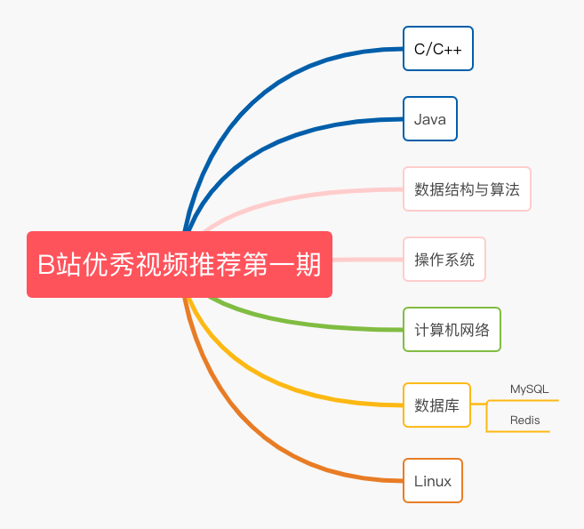

## 1. C/C++

### **1. Giáo trình C có lẽ là tốt nhất**

Khóa học ngôn ngữ C của thầy Hác Bân (Hao Bin) có lẽ là một trong những khóa học C xuất sắc nhất trên Bilibili, tính đến nay đã đạt tới hơn 4.68 triệu lượt xem.

Tôi cũng từng xem qua khóa của Tiểu Giáp Ngư (FishC), thấy giảng hơi sơ sài một chút... nên xem được vài tập thì tắt.

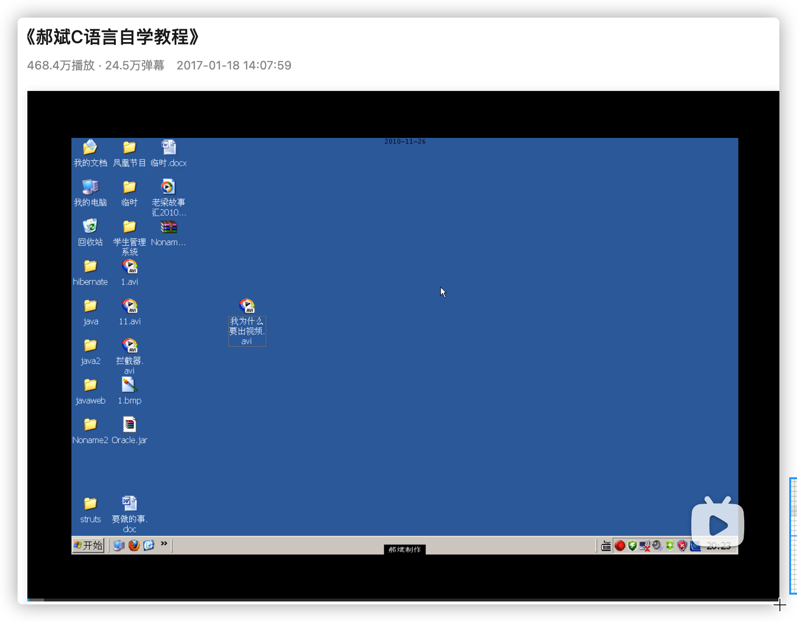

**Địa chỉ**: https://www.bilibili.com/video/BV1os411h77o

**Đánh giá**: ⭐⭐⭐⭐⭐

Ngôn ngữ C là môn học vô cùng quan trọng, đặc biệt là phần con trỏ (Pointers). Rất khuyên các bạn mới bắt đầu bước chân vào ngành CNTT hoặc sinh viên năm nhất nên theo dõi khóa học này.

### **2. Video C++ của Hắc Mã (Heima)**

Bộ video C++ này là video đầu tiên tôi xem khi bắt đầu hành trình tự học C++, chất lượng rất tốt, cực kỳ thích hợp để nhập môn.

Nhưng hãy nhớ vừa xem vừa thực hành gõ code, đừng chỉ xem thụ động mà không gõ theo, như vậy xem xong sẽ không đọng lại được gì nhiều.

Phía dưới video vẫn còn bình luận của tôi từ năm 2019, đến giờ thỉnh thoảng vẫn có bạn vào reply...

**Địa chỉ**: https://www.bilibili.com/video/BV1Tb411j7uM

**Đánh giá**: ⭐⭐⭐⭐⭐

### **3. Thầy Hầu Tiệp: Phân tích mã nguồn STL (STL Source Code Analysis)**

Chuyên gia C++ Đài Loan - Thầy Hầu Tiệp (Hou Jie) có 5-6 khóa học nổi tiếng:

- Lập trình hướng đối tượng C++ (Object-Oriented Programming)
- Thư viện chuẩn STL & Lập trình tổng quát (Generic Programming)
- Chuẩn mới C++11 & C++14
- Cơ chế quản lý bộ nhớ C++ (Memory Management)
- Khám phá C++ Startup

Cá nhân tôi cho rằng khóa học về STL và Generic Programming này là hay nhất, không có đối thủ.

Trong mảng C++ có một số cuốn sách thuộc hàng "kinh thánh", và 《Phân tích mã nguồn STL》 chính là một trong số đó. Dù cuốn sách có phần hơi cũ nhưng tư tưởng thiết kế của nó thì thực sự đỉnh cao!

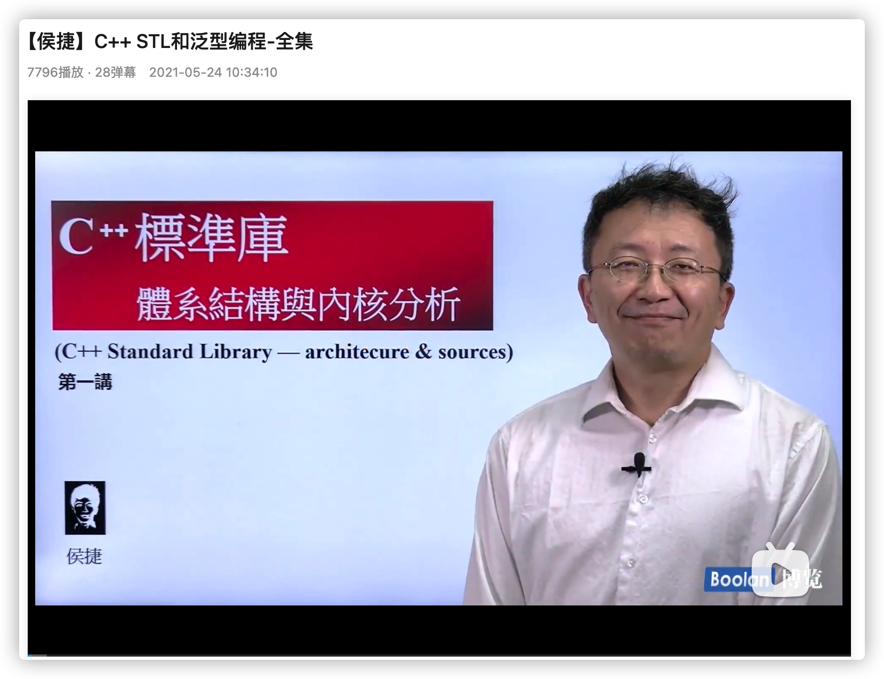

**Cách tải**: Trước đây trên Bilibili có video bài giảng của thầy Hầu Tiệp nhưng sau đó đã bị gỡ xuống. Về sau tôi đã chủ động sưu tầm trọn bộ khóa học và tài liệu của thầy, bạn có thể gửi từ khóa "侯捷" (Hầu Tiệp) vào tin nhắn Official Account để nhận.

**Đánh giá**: ⭐⭐⭐⭐⭐

Nhớ phải học thật kỹ nhé.

### **4. Thầy Hầu Tiệp: Quản lý bộ nhớ C++ (Memory Management)**

Theo đánh giá cá nhân tôi, đây là khóa học hay thứ hai của thầy Hầu Tiệp sau khóa STL.

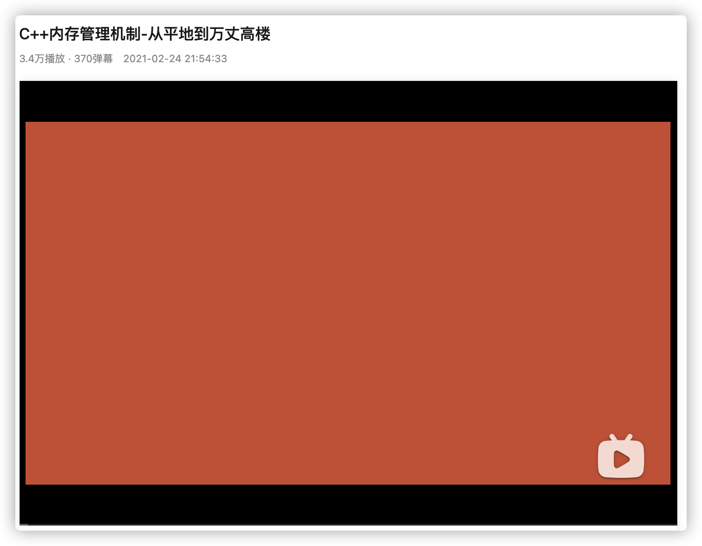

**Đánh giá**: ⭐⭐⭐⭐

Nếu còn thời gian và sức lực, rất khuyên bạn nên cày khóa này. Cách nhận: gửi tin nhắn "侯捷" vào Official Account.

Ngoài ra các khóa khác của thầy Hầu Tiệp như tính năng mới C++11 cũng rất đáng xem.

## 2. Java

Tôi biết có bạn đọc đến đây sẽ thắc mắc:

"**Anh Tú ơi, anh làm theo tech stack C/C++/Golang mà, lấy tư cách gì đi gợi ý khóa học Java vậy?**"

Chưa ăn thịt heo thì chẳng lẽ chưa từng thấy heo chạy sao?

Java là ngôn ngữ số 1 giới Internet, xung quanh A Tú có vài người bạn thân là cao thủ Java thì có gì lạ đâu?

Một người gợi ý có thể mang tính chủ quan, nhưng khi 5-6 chuyên gia Java đều đồng thanh gợi ý cùng một khóa học thì chắc chắn chất lượng của khóa học đó là không cần bàn cãi.

Danh sách dưới đây là do tôi đích thân tham khảo từ 6 người bạn cao thủ Java để tổng hợp lại:

### **1. Thượng Quy Cốc - Thầy Tống Hồng Khang: Java cơ bản từ con số 0**

Xin dành ngàn lời khen cho thầy Tống, nhập môn Java đỉnh nhất mọi thời đại (YYDS)!

Tôi biết khóa học Java cơ bản của thầy Tất Hướng Đông cũng rất tốt, nhưng phiên bản Java thầy giảng hơi cũ một chút, nên sau khi cân nhắc kỹ tôi vẫn khuyên các bạn ưu tiên học khóa của thầy Tống Hồng Khang.

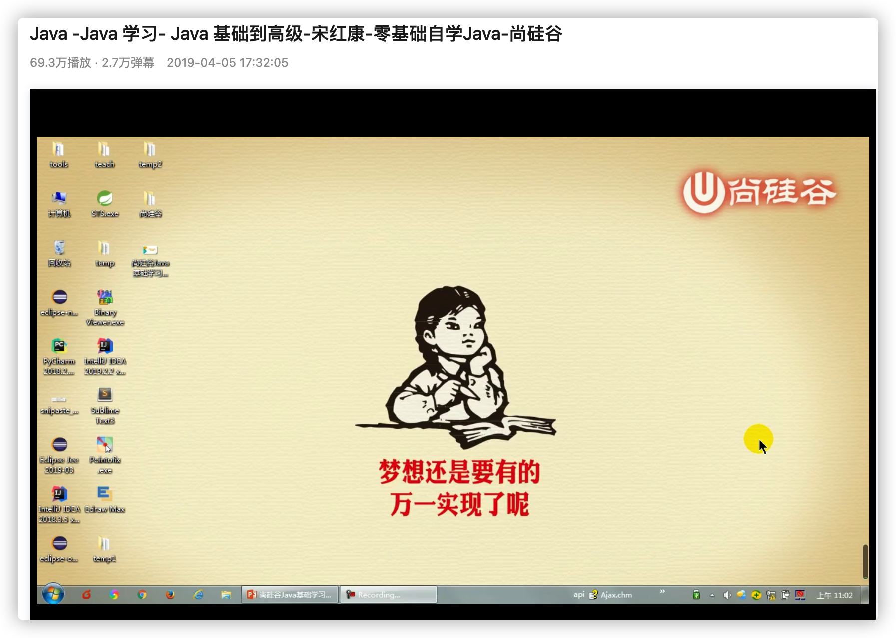

**Địa chỉ**: https://www.bilibili.com/video/BV1Qb411g7cz

**Đánh giá**: ⭐⭐⭐⭐⭐

### **2. Thượng Học Đường - Thầy Cao Kỳ: 300 tập video Java**

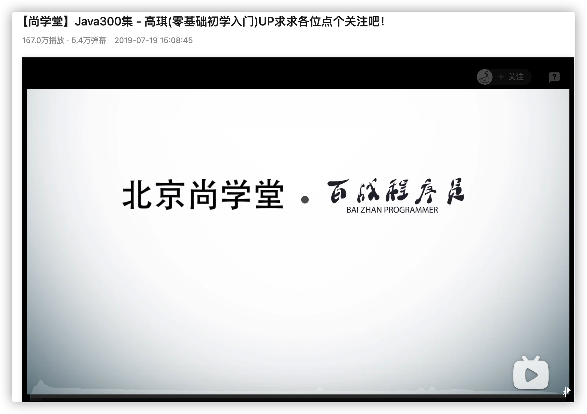

Thầy Cao Kỳ giảng dạy rất lôi cuốn, dễ hiểu và thực chiến cao. Bộ Java 300 tập mới ra mắt của thầy được cộng đồng đánh giá cực tốt!

**Địa chỉ**: https://www.bilibili.com/video/BV1ct411n7oG

**Đánh giá**: ⭐⭐⭐⭐⭐

### **3. Cầu Tri Khắc Đường: Video nhập môn Java**

Khóa học này không nói chuyện lan man, vào bài là giảng ngay kiến thức thực chiến, đó là lý do khóa học có danh tiếng rất cao.

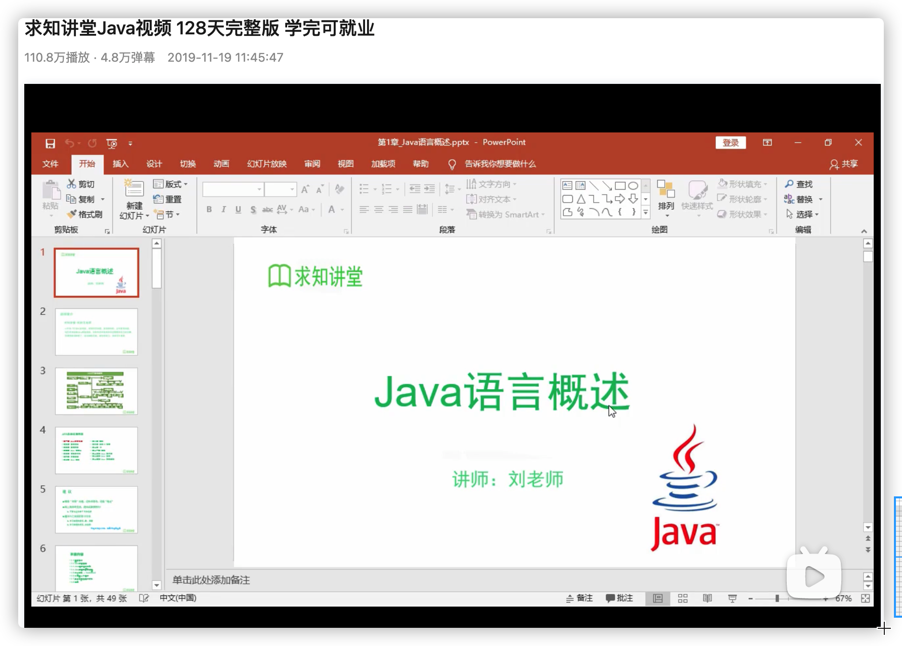

**Địa chỉ**: https://www.bilibili.com/video/BV1CJ411m7gg

**Đánh giá**: ⭐⭐⭐⭐⭐

### **4. Thượng Quy Cốc: Tính năng mới Java 8**

Java 8 đã ra mắt từ lâu và rất phổ biến. Bạn nên xem khóa này sau khi đã hoàn thành một trong các khóa Java cơ bản ở trên.

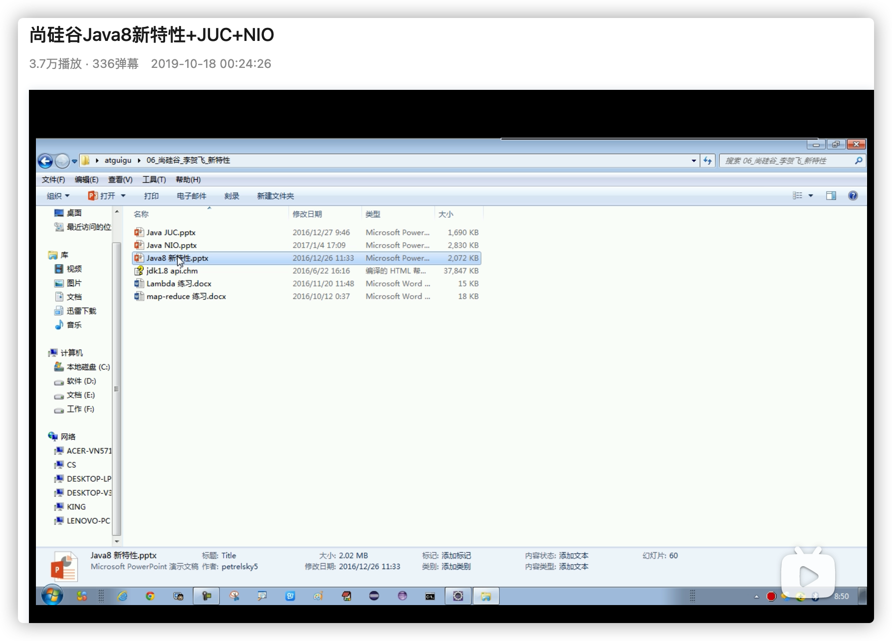

**Địa chỉ**: https://www.bilibili.com/video/BV1ME411y7Ce

**Đánh giá**: ⭐⭐⭐⭐

### **5. Dự án Java mạnh nhất Bilibili - Cốc Lệ Thương Thành (Gulimall)**

Java có rất nhiều kiến thức, khó có thể chỉ qua vài video lý thuyết mà đạt được trình độ đi làm ngay, do đó rất cần làm các dự án thực chiến.

Tôi đã hỏi 6 người bạn và đồng nghiệp thì có tới 4 người khuyên nên làm dự án Gulimall này!

Khóa học này bao hàm rất nhiều kiến thức chuyên sâu như Microservices (Kiến trúc vi dịch vụ), Hệ thống phân tán (Distributed Systems), MySQL, Redis... nên khuyên bạn để dành học ở giai đoạn sau.

**Địa chỉ**: https://www.bilibili.com/video/BV1np4y1C7Yf

**Đánh giá**: ⭐⭐⭐⭐⭐

## 3. Cấu trúc dữ liệu và Thuật toán (DSA)

### **1. Đại học Thanh Đảo - Cô Vương Trác (Wang Zhuo) - Đỉnh của chóp**

Mỗi khi có ai hỏi tôi nên học Cấu trúc dữ liệu và Thuật toán từ đâu, tôi đều khuyên xem khóa học của cô Vương Trác!

Tôi đã xem qua rất nhiều khóa DSA, nhưng người giảng rành mạch, dễ hiểu và trực quan thì không nhiều, và cô Vương Trác chắc chắn là một trong số ít đó!

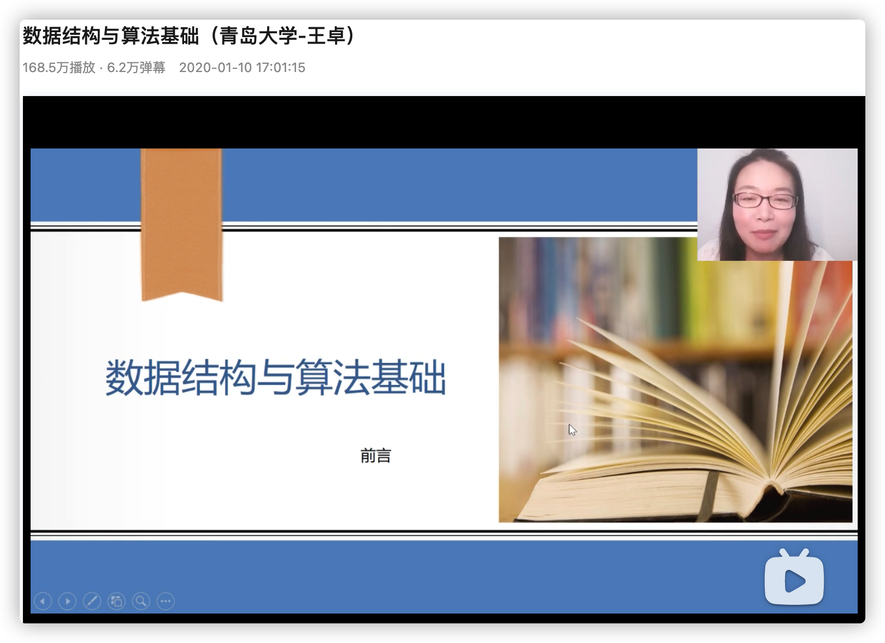

**Địa chỉ**: https://www.bilibili.com/video/BV1nJ411V7bd

**Đánh giá**: ⭐⭐⭐⭐⭐

### **2. Đại học Thanh Hoa - Thầy Đặng Tuấn Huy: Khóa học DSA**

Ngoài cô Vương Trác, khóa học Cấu trúc dữ liệu & Thuật toán của thầy Đặng Tuấn Huy cũng xuất sắc không kém!

Nghe nói khi thầy Đặng giảng khóa này trực tiếp tại giảng đường Thanh Hoa, phòng học luôn chật kín không còn một chỗ trống, rất nhiều sinh viên trái ngành cũng kéo sang nghe giảng.

**Địa chỉ**: https://www.bilibili.com/video/BV1jt4y117KR

**Đánh giá**: ⭐⭐⭐⭐⭐

### **3. Balo chín bài (9 bài toán cái túi - Knapsack Problem)**

Chuyên đề 9 bài toán Knapsack của Y Thần (Yxc - AcWing). Thuật toán cái túi là dạng bài rất phổ biến trong các kỳ thi ACM và là thước đo phân loại ứng viên rất tốt.

Các công ty lớn khi ra đề thi viết cũng rất hay hỏi dạng bài này. Y Thần giảng cực kỳ hay, khuyên các bạn nên xem.

**Địa chỉ**: https://www.bilibili.com/video/BV1qt411Z7nE

**Đánh giá**: ⭐⭐⭐⭐⭐

### **4. Cây đỏ đen (Red-Black Tree)**

Nếu hỏi trong các cấu trúc dữ liệu phổ biến, cái nào phức tạp và khó làm chủ nhất?

**Chắc chắn là Cây đỏ đen rồi!** Nếu chỉ tự đọc tài liệu thì nhiều người đọc đi đọc lại nhiều lần vẫn không hiểu nổi.

Đây là một video hiếm hoi trên Bilibili hướng dẫn bạn tự tay code cây đỏ đen từ đầu đến cuối, cực kỳ đỉnh cao! Hãy mau lưu lại nhé!

**Địa chỉ**: https://www.bilibili.com/video/BV1Ss411F76x

**Đánh giá**: ⭐⭐⭐⭐⭐

## 4. Hệ điều hành (Operating System)

### **1. Đại học Nam Kinh - Cô Viên Xuân Phong: Chuỗi bài giảng Cơ sở Hệ thống Máy tính**

Nếu bạn chưa biết nhiều về máy tính hoặc muốn có cái nhìn tổng quan về hệ thống và hệ điều hành thì không nên bỏ qua chuỗi video của cô Viên Xuân Phong.

**Địa chỉ**: Chuỗi video gồm 4 phần:
- Phần 1 (Biểu diễn, chuyển đổi & liên kết chương trình): https://www.bilibili.com/video/BV1gx411n7aG
- Phần 2 (Thực thi chương trình & truy cập bộ nhớ): https://www.bilibili.com/video/BV1Xx411E7qn
- Phần 3 (Ngoại lệ, ngắt & I/O): https://www.bilibili.com/video/BV1kW411M7Tc
- Phần 4 (Thực hành lập trình & gỡ lỗi Debug): https://www.bilibili.com/video/BV1GE411T7Qs

**Đánh giá**: ⭐⭐⭐⭐

### **2. Đại học Thanh Hoa - Thầy Trần Du: Nguyên lý Hệ điều hành**

Khóa học của thầy Trần Du tại Đại học Thanh Hoa giảng rất súc tích, ngắn gọn nhưng đầy đủ các trọng điểm:

Bao gồm 10 chương chính:
1. Tổng quan OS
2. Các thao tác cơ bản của OS
3. Cấp phát bộ nhớ liên tục
4. Cấp phát bộ nhớ không liên tục
5. Bộ nhớ ảo (Virtual Memory)
6. Thuật toán thay thế trang (Page Replacement Algorithms)
7. Tiến trình và Luồng (Process & Thread)
8. Lập lịch CPU (CPU Scheduling)
9. Đồng bộ hóa (Synchronization)
10. Semaphore và Monitor

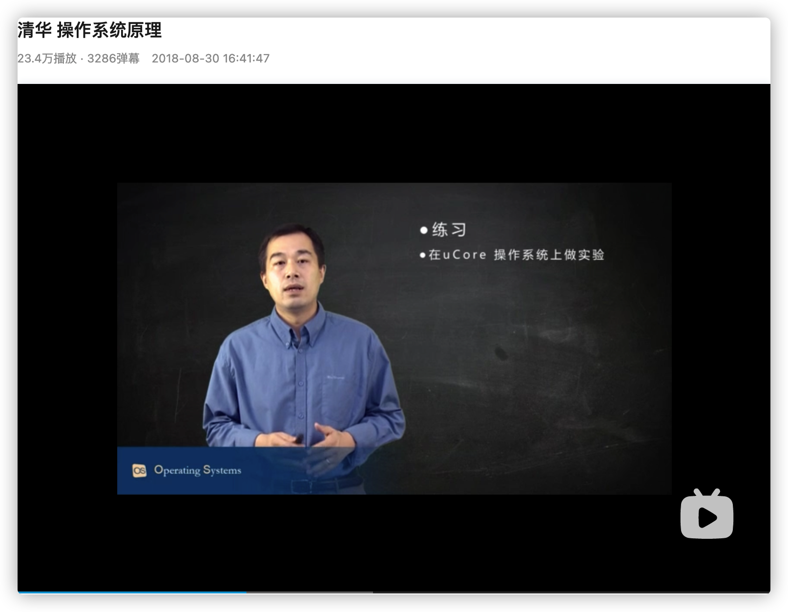

**Địa chỉ**: https://www.bilibili.com/video/BV1uW411f72n

**Đánh giá**: ⭐⭐⭐⭐

### **3. Đại học Công nghiệp Cáp Nhĩ Tân (HIT) - Thầy Lý Trị Quân**

Khóa học Hệ điều hành của thầy Lý Trị Quân tại HIT giảng cực kỳ chi tiết và sâu sắc.

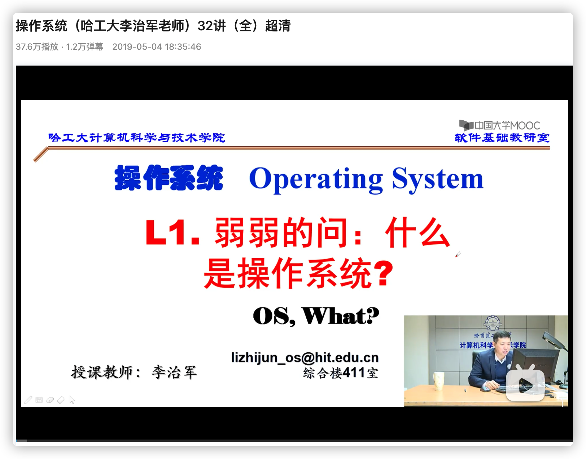

**Địa chỉ**: https://www.bilibili.com/video/BV1d4411v7u7

**Đánh giá**: ⭐⭐⭐⭐

### **4. Đại học Nam Kinh - Thầy Tưởng Viêm Nham: Thiết kế và Hiện thực hóa Hệ điều hành**

Khóa học này đi sâu vào thiết kế và hiện thực hóa cụ thể. Đòi hỏi bạn phải có nền tảng vững vàng trước khi xem.

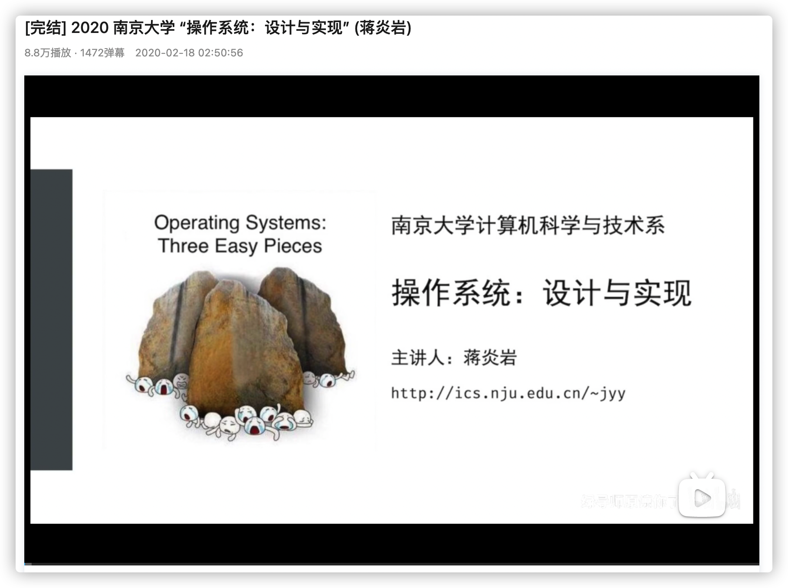

**Địa chỉ**: https://www.bilibili.com/video/BV1N741177F5

**Đánh giá**: ⭐⭐⭐⭐

## 5. Mạng máy tính (Computer Network)

### **1. Thầy Hàn Lập Cương: Mạng máy tính**

Nếu để tôi đề xuất một khóa học mạng máy tính, tôi nghĩ không ai xứng đáng hơn thầy Hàn Lập Cương. Thầy giảng bài hóm hỉnh, cuốn hút và rất gần gũi.

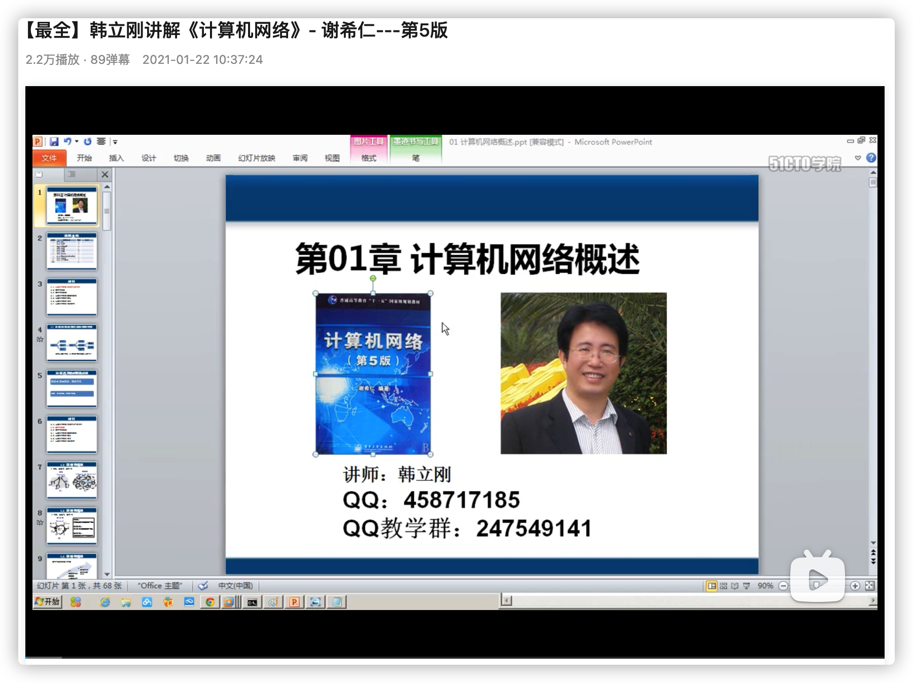

**Địa chỉ**: https://www.bilibili.com/video/BV1Qr4y1N7cH

**Đánh giá**: ⭐⭐⭐⭐⭐

### **2. Lớp học nhỏ Mạng máy tính (Hồ Đại Giáo Thư Tượng)**

Khóa học của thầy giáo trường ĐH Khoa học Công nghệ Hồ Nam với rất nhiều animation PPT trực quan sinh động.

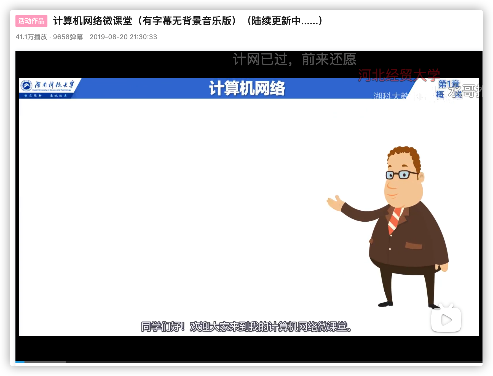

**Địa chỉ**: https://www.bilibili.com/video/BV1c4411d7jb

**Đánh giá**: ⭐⭐⭐⭐

### **3. Đại học Công nghệ Đại Liên: Khóa học Mạng máy tính**

Một khóa học lâu đời và bài bản dành cho những ai muốn đào sâu thêm kiến thức mạng.

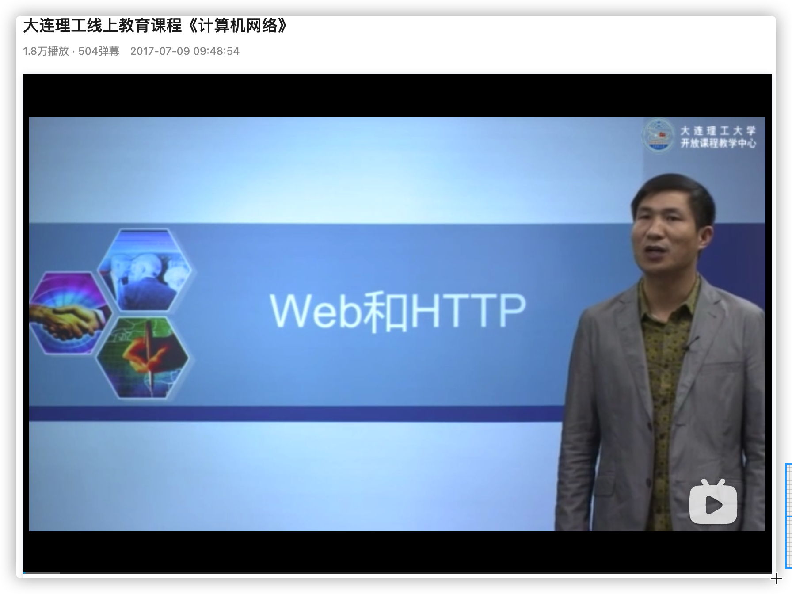

**Địa chỉ**: https://www.bilibili.com/video/BV19x411z7Pu

**Đánh giá**: ⭐⭐⭐⭐

## 6. Cơ sở dữ liệu (MySQL, Redis)

### **1. Thượng Quy Cốc - MySQL Nhập môn + Nâng cao**

Khóa học tôi từng học khi mới nhập môn, giảng rất hay và bài bản.

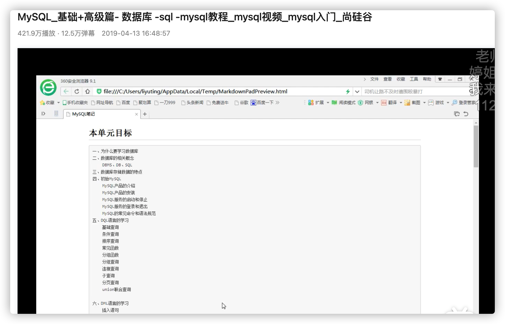

**Địa chỉ**: https://www.bilibili.com/video/BV12b411K7Zu

**Đánh giá**: ⭐⭐⭐⭐

### **2. Hắc Mã - Hướng dẫn thực chiến MySQL**

Sau khi học lý thuyết, khóa học thực chiến của Hắc Mã là tài liệu rất tốt để luyện tay nghề.

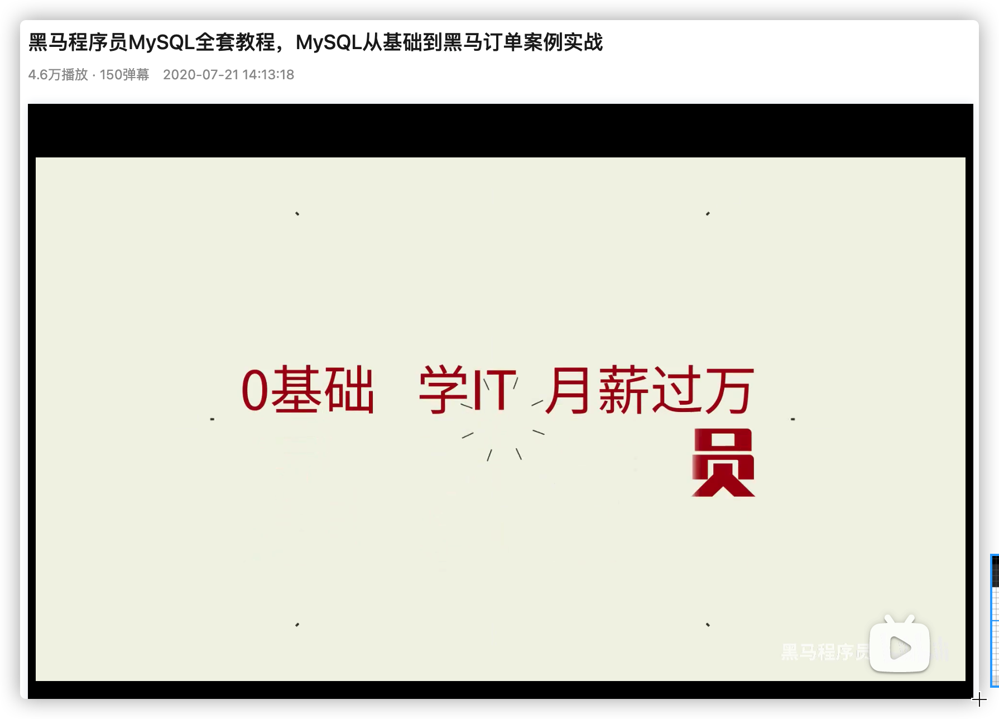

**Địa chỉ**: https://www.bilibili.com/video/BV1vi4y137PN

**Đánh giá**: ⭐⭐⭐⭐⭐

### **3. Thượng Quy Cốc - Tối ưu hóa MySQL nâng cao**

Đi sâu vào tối ưu hóa hiệu năng cơ sở dữ liệu, đánh chỉ mục Index, Transaction, Lock.

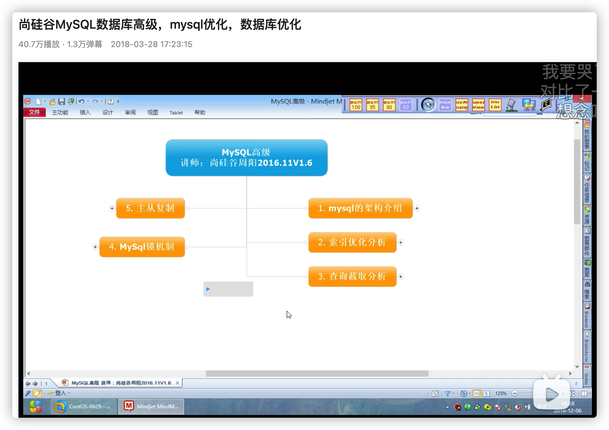

**Địa chỉ**: https://www.bilibili.com/video/BV1KW411u7vy

**Đánh giá**: ⭐⭐⭐⭐⭐

### **4. Thượng Quy Cốc - Khóa học Redis của thầy Chu Dương**

Khóa học Redis kinh điển nhất của Thượng Quy Cốc, giảng từ cơ bản đến thực chiến chuyên sâu.

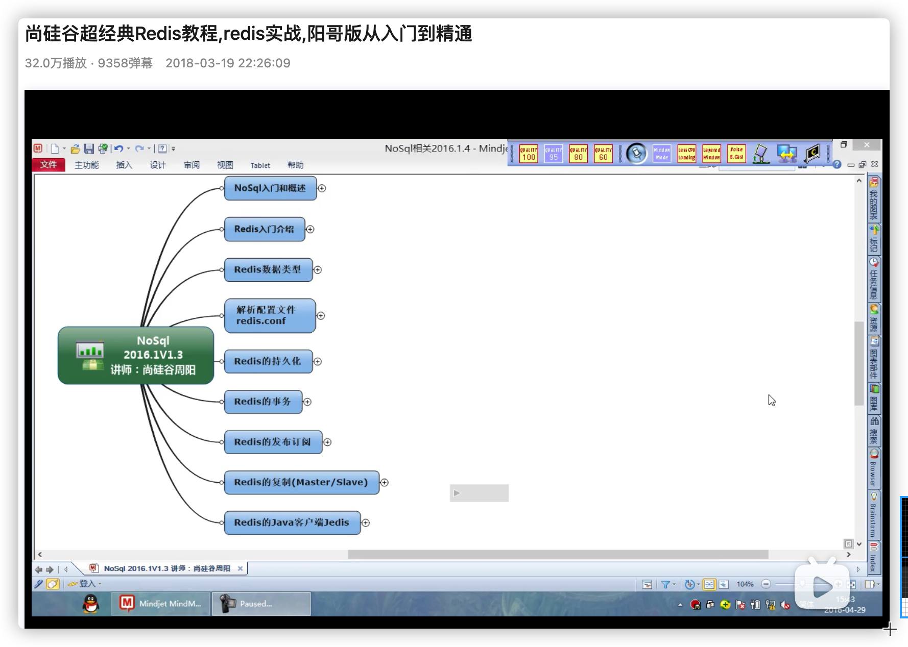

**Địa chỉ**: https://www.bilibili.com/video/BV1oW411u75R

**Đánh giá**: ⭐⭐⭐⭐⭐

(Ngoài ra khuyên đọc thêm 2 cuốn sách: 《Thiết kế và Hiện thực hóa Redis》 và 《Redis thực chiến》 trên [kho sách CS-Books](https://github.com/forthespada/CS-Books)).

## 7. Linux

### **1. Thầy Hàn Thuận Bình - 1 tuần làm chủ Linux**

Khóa học thiết kế riêng cho người mới bắt đầu (newbie), dễ hiểu và tiếp cận nhanh chóng.

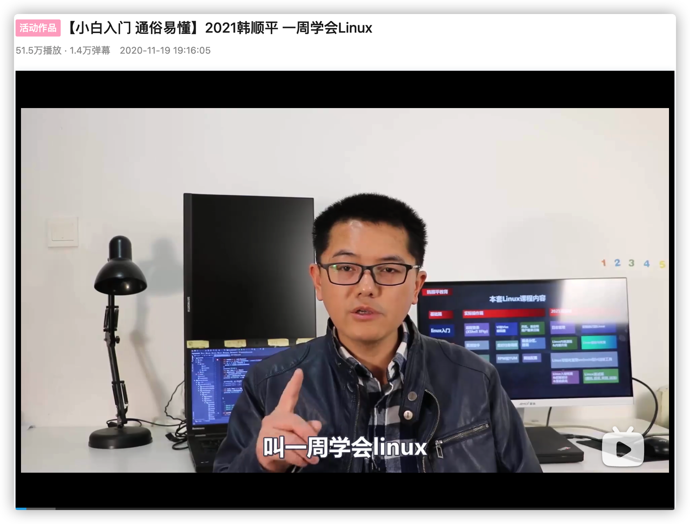

**Địa chỉ**: https://www.bilibili.com/video/BV1Sv411r7vd

**Đánh giá**: ⭐⭐⭐⭐

### **2. Thượng Quy Cốc - Giáo trình Linux nâng cấp mới nhất**

Khóa học rất toàn diện, đã có hàng chục triệu lượt học.

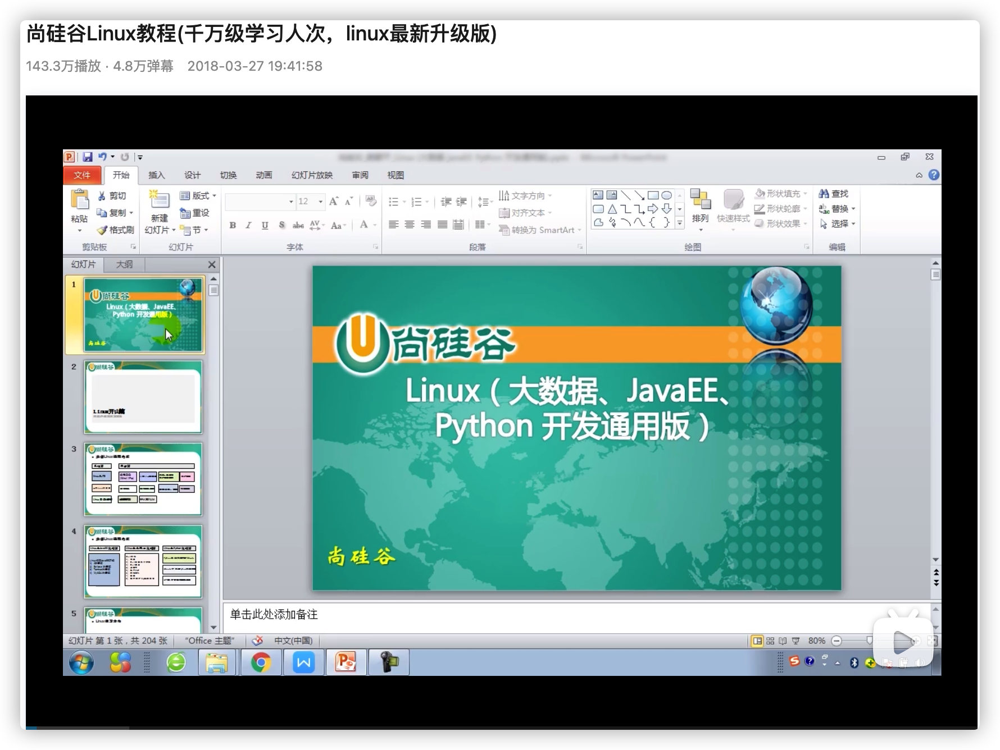

**Địa chỉ**: https://www.bilibili.com/video/BV1dW411M7xL

**Đánh giá**: ⭐⭐⭐⭐

---

Trên đây là toàn bộ nội dung tổng hợp các khóa học Bilibili trong nước của Kỳ 1. Kỳ 2 về các khóa học nước ngoài sẽ sớm được cập nhật, chúc các bạn học tập thật tốt!
