<h1 align="center">Tôi học lập trình hoàn toàn dựa vào Bilibili, quá hời luôn (Kỳ 2)</h1>

> Tác giả: A Tú (阿秀)
>
> Liên kết bài viết gốc: [https://mp.weixin.qq.com/s/GI1QnwTlkMFRY36Z4G2pMg](https://mp.weixin.qq.com/s/GI1QnwTlkMFRY36Z4G2pMg)

  
Đây là 6 thông tin có thể sẽ hữu ích cho bạn:

⭐️1. A Tú cùng bạn bè hợp tác phát triển một website tài nguyên lập trình, hiện đã tổng hợp rất nhiều tài liệu học tập chất lượng và công cụ hữu ích (kèm link tải). Nếu bạn đang tìm kiếm tài nguyên lập trình phù hợp, <a href="https://tools.interviewguide.cn/home" style="text-decoration: underline" target="_blank">hoan nghênh trải nghiệm</a> cũng như giới thiệu những tài nguyên bạn thấy hay. Góp gió thành bão, mình vì mọi người, mọi người vì mình🔥!
  
2. 👉 Tháng 5/2023, trong thời gian <a style="text-decoration: underline" href="https://mp.weixin.qq.com/s?__biz=Mzk0ODU4MzEzMw==&mid=2247512170&idx=1&sn=c4a04a383d2dfdece676b75f17224e78" target="_blank">rời ByteDance để chuyển sang một công ty đa quốc gia</a>, nhằm thuận tiện cho bản thân khi tìm việc và nâng cao tỷ lệ trúng tuyển, A Tú cùng bạn bè đã phát triển từ con số 0 một website giải đề phỏng vấn thực chiến của các Big Tech, bao gồm hai frontend và một backend. Trang web cho phép tra cứu có định hướng đề thi viết của các công ty Internet, ví dụ như muốn tra cứu đề thi viết của ByteDance trong 1 năm gần đây gồm những gì đều có thể làm được. Hoan nghênh trải nghiệm~

Địa chỉ website: <a style="text-decoration: underline" href="https://niumacode.com/home?ref=F6O2625K" target="_blank">Website đề thi thuật toán phỏng vấn Big Tech</a>.
    
3. 😊
    Chia sẻ một website công cụ tiện ích mà A Tú tâm đắc sưu tầm, <a style="text-decoration: underline" href="https://hkjtz.cn/" target="_blank">nhấn vào đây để truy cập</a>, chủ yếu là các ứng dụng, website ngách hữu ích, ngoài ra còn có tài nguyên phim ảnh HD, âm nhạc, phim truyền hình, AI, phim tài liệu, tài liệu thi tiếng Anh, thi công chức, cao học, nghề tay trái...
  

  
4. 😍 Chia sẻ miễn phí tài nguyên học tập mà A Tú đã tích lũy từ khi theo học máy tính, <a style="text-decoration: underline" href="/notes/07-resources/01-free/01-introduce.html" target="_blank">nhấn vào đây để nhận miễn phí</a>; đồng thời cũng lưu lại nhật ký đánh giá <a style="text-decoration: underline" href="/notes/07-resources/02-precious.html" target="_blank">những cuốn sách máy tính, chuyên mục online chất lượng cũng như những khóa học trả phí kém chất lượng</a> từng mua trước đây.
  

  
5. 🚀 Nếu bạn muốn thuận lợi giành được offer tốt hơn trong kỳ tuyển dụng trường học (Campus Recruitment), A Tú khuyên bạn nên xem thêm những <a style="text-decoration: underline" href="https://www.yuque.com/tuobaaxiu/httmmc/npg1k81zeq4wfpyz" target="_blank">cạm bẫy từng vấp phải</a> và <a style="text-decoration: underline"  target="_blank" href="https://www.yuque.com/tuobaaxiu/httmmc/gge9ppd0mbu2d3dp">kinh nghiệm đúc kết</a> của người đi trước. Thực tế, hầu hết các vấn đề bạn đang gặp phải thì các anh chị khóa trước đều đã từng trải qua.
  

  
6. 🔥 Hoan nghênh các bạn đang chuẩn bị cho kỳ tuyển dụng trường học ngành CNTT tham gia <a  style="text-decoration: underline" href="https://www.yuque.com/tuobaaxiu/httmmc/xg0otqvc17wfx4u9" target="_blank">Cộng đồng học tập</a> của tôi. Độc hành một mình chi bằng cùng nhau sưởi ấm, trong nhóm đã đọng lại rất nhiều <a  style="text-decoration: underline" href="https://www.yuque.com/tuobaaxiu/httmmc/gge9ppd0mbu2d3dp" target="_blank">kinh nghiệm và tổng kết</a> của các anh chị khóa 21/22/23/24/25. Kiên trì đi theo lộ trình, cuối cùng đa phần đều có thể nhận được offer ưng ý! Nếu bạn cần phiên bản PDF tổng hợp các điểm kiến thức 📚︎ Bát cổ văn phỏng vấn tuyển dụng trường học trên website 《Ghi chép học tập của A Tú》, có thể <a style="text-decoration: underline" href="https://www.yuque.com/tuobaaxiu/httmmc/qs0yn66apvkzw0ps" target="_blank">nhấn vào đây để tải về</a>.
   

Chào mọi người, bài viết trước tôi đã giới thiệu khá nhiều video bài giảng hay trên Bilibili.

Thấy có rất nhiều bạn là "cựu sinh viên Đại học Bilibili" vào điểm danh, vui ghê haha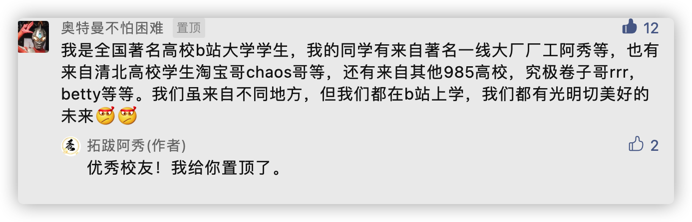

Đáng lẽ kỳ này tôi sẽ giới thiệu tiếp các video quốc tế, nhưng bài trước có nhiều bạn nhắn tin muốn xem thêm video về **Go (Golang)**, nên tôi quyết định ở Kỳ 2 này sẽ tổng hợp các khóa học về **Python (Crawler, Phân tích dữ liệu, Machine Learning), Golang, Frontend (JavaScript & Vue)** cùng một số tài liệu học tập hữu ích khác.

Kỳ 3 sẽ dành trọn vẹn cho các khóa học kinh điển của nước ngoài.

Các cuốn sách kinh điển được nhắc tới trong bài đều có bản sách giấy trên Dangdang, JD; bản PDF điện tử miễn phí có thể tìm thấy tại kho sách: [https://github.com/forthespada/CS-Books](https://github.com/forthespada/CS-Books)

Dưới đây là mục lục Kỳ 2:

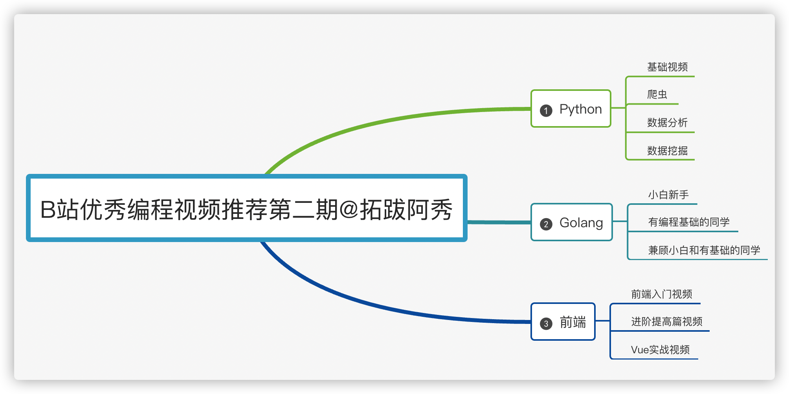

## 1. Python

Nghĩ lại thì tôi cũng đã xem khá nhiều video về Python: ban đầu là để học cú pháp, sau đó năm nhất thạc sĩ suýt nữa tôi đã chọn hướng nghiên cứu Machine Learning nên video của thầy Andrew Ng (Ngô Ân Đạt) tôi cũng đã cày hết. Sau đó lại chuyển sang hướng cơ sở dữ liệu và crawler.

### 1. Python cơ bản

**Có lẽ là video Python duy nhất trên Bilibili vượt mốc 10 triệu lượt xem**

Khóa học Python của Hắc Mã (Heima) với hơn 10 triệu lượt xem:

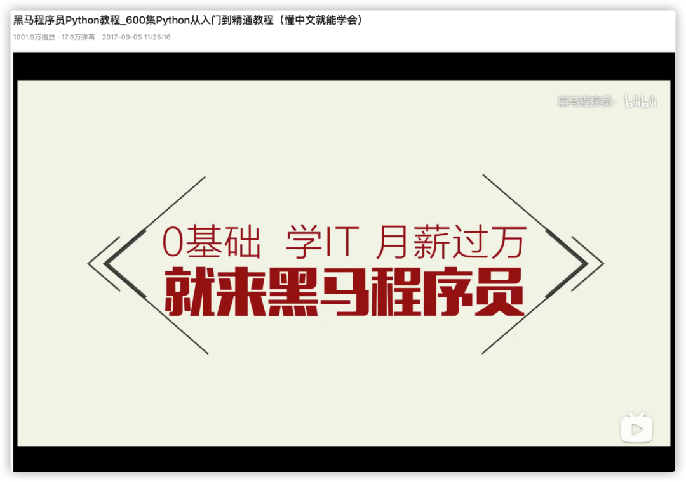

Khóa học được thiết kế rất bài bản, phần đầu có lồng ghép kiến thức Linux thực tế rất cần thiết cho công việc sau này. Giảng viên rất thấu hiểu tâm lý người học, những khúc mắc thường gặp đều được giải thích rõ ràng.

**Địa chỉ**: https://www.bilibili.com/video/BV1ex411x7Em

**Đánh giá**: ⭐⭐⭐⭐⭐

### 2. Web Scraping (Crawler)

**Khóa học Crawler của thầy Thôi Khánh Tài (Cui Qingcai)**

Đây là khóa học duy nhất tôi từng xem về Crawler, nhưng đã mang lại cho tôi nền tảng vô cùng vững chắc.

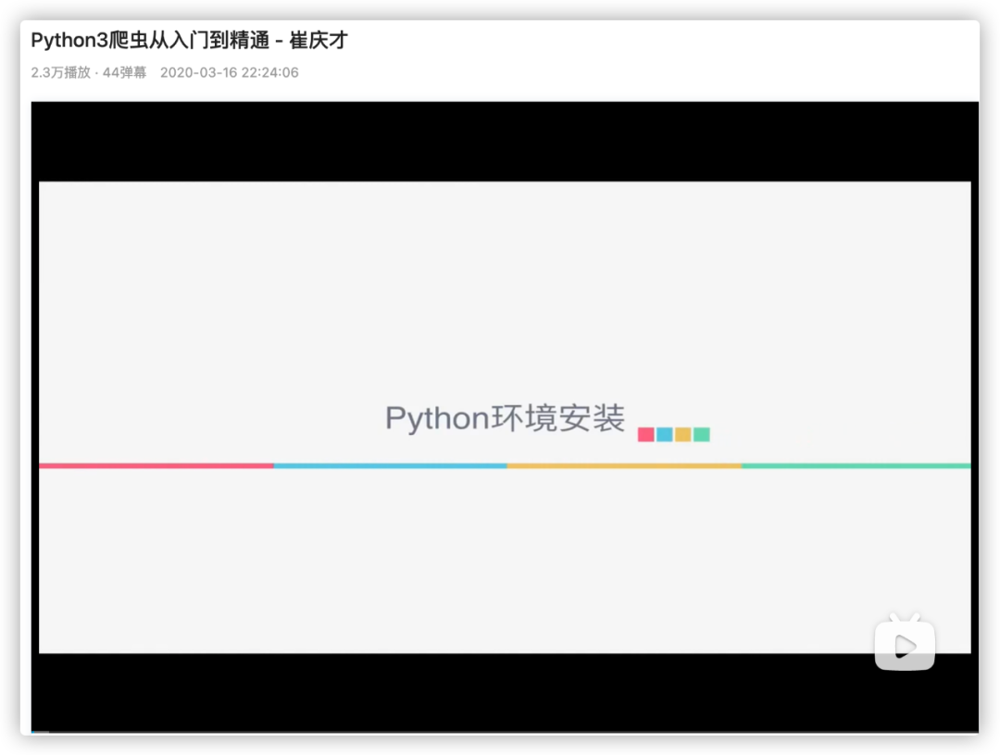

Thầy Thôi giảng bài rất có tâm, mạch lạc, lớp lang rõ ràng. Cực kỳ khuyến nghị!

**Địa chỉ**: https://www.bilibili.com/video/BV1a7411f76Z

**Đánh giá**: ⭐⭐⭐⭐⭐

### 3. Phân tích Dữ liệu (Data Analysis)

Gợi ý cuốn sách bắt buộc phải đọc: 《**Phân tích Dữ liệu với Python**(Python for Data Analysis)》 của Wes McKinney (tác giả thư viện Pandas).

**1. Khóa học thực chiến Phân tích Dữ liệu Python 3**

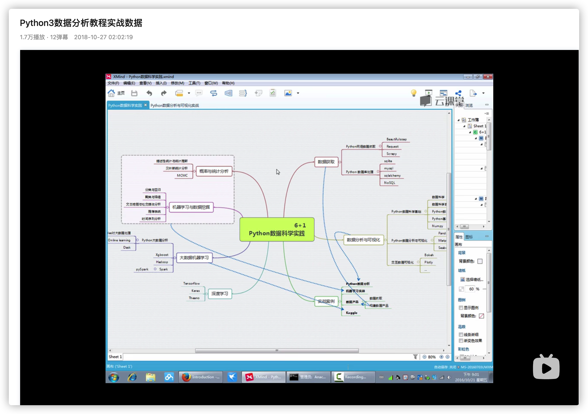

Khóa học thực chiến giúp bạn nắm bắt tư duy phân tích dữ liệu cơ bản.

**Địa chỉ**: https://www.bilibili.com/video/BV1Tb411N7Qg

**Đánh giá**: ⭐⭐⭐⭐

**2. Phân tích Dữ liệu lớn với Tableau**

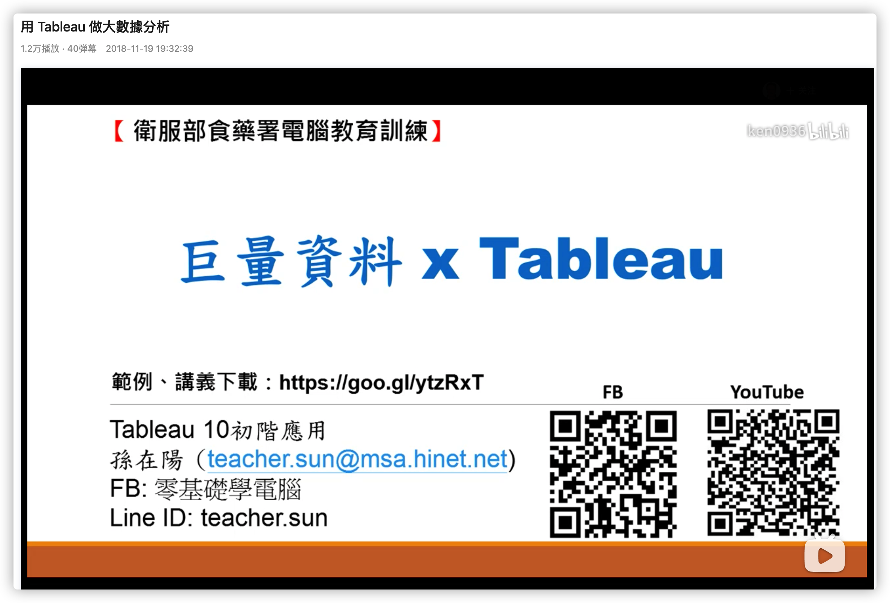

Tableau là công cụ trực quan hóa dữ liệu cực kỳ mạnh mẽ. Khóa học này có bộ tài liệu rất đầy đủ, hướng dẫn từ đầu đến cuối.

**Địa chỉ**: https://www.bilibili.com/video/BV16t41117mK

**Đánh giá**: ⭐⭐⭐⭐

**3. Thực chiến Business Intelligence & Trực quan hóa với Tableau**

Khóa học thực chiến 7 ngày ứng dụng Tableau trong doanh nghiệp.

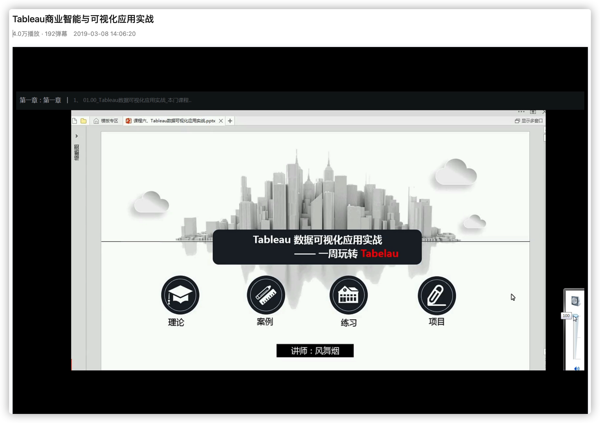

**Địa chỉ**: https://www.bilibili.com/video/BV1xb411v7YJ

**Đánh giá**: ⭐⭐⭐⭐

### 4. Machine Learning & Trí tuệ nhân tạo (AI)

**1. Khóa học Machine Learning kinh điển của thầy Andrew Ng (Ngô Ân Đạt)**

Bất kỳ ai theo học Machine Learning đều nên xem khóa học này ít nhất một lần.

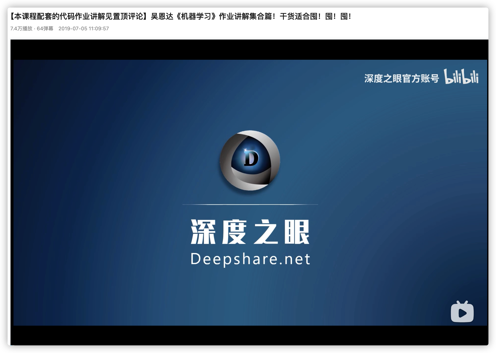

Khóa học này cùng với cuốn "Sách Quả Dưa Hấu" của thầy Châu Chí Hoa (Đại học Nam Kinh) và cuốn "Phương pháp Học thống kê" của thầy Lý Hàng là bộ tài liệu nhập môn tiêu chuẩn.

**Địa chỉ**: https://www.bilibili.com/video/BV124411A75S

**Đánh giá**: ⭐⭐⭐⭐⭐

**2. Mạc Phiền (Morvan): Tự xây dựng Mạng nơ-ron (Neural Network)**

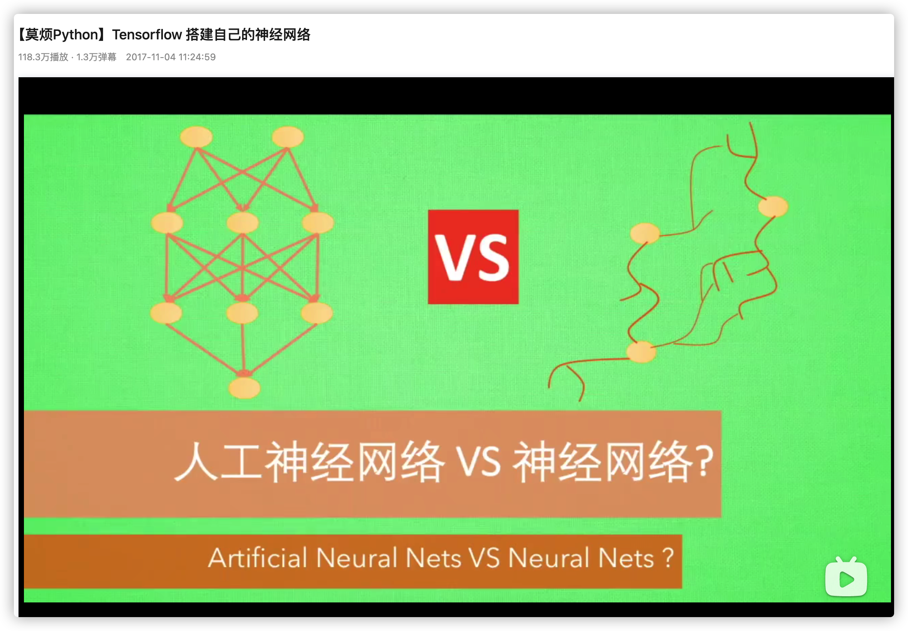

Khóa học hướng dẫn bạn tự tay code mạng nơ-ron từ đầu, giúp hiểu sâu các khái niệm như LSTM, Bi-LSTM.

**Địa chỉ**: https://www.bilibili.com/video/BV1Lx411j7ws

**Đánh giá**: ⭐⭐⭐⭐

**3. Khóa học thực chiến các Case Study trên Kaggle**

Kinh nghiệm thi đấu và đạt huy chương tại các cuộc thi danh tiếng như Kaggle, Alibaba Tianchi là điểm cộng cực lớn khi ứng tuyển vị trí Kỹ sư Thuật toán AI.

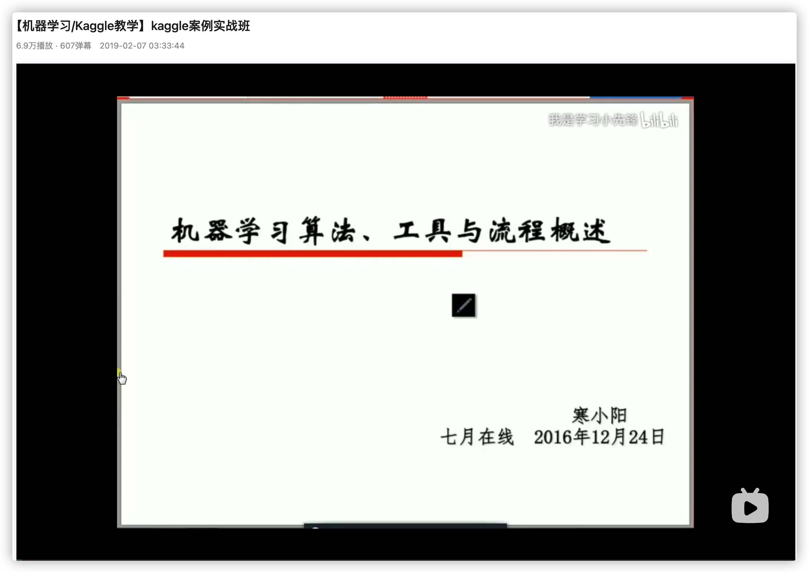

**Địa chỉ**: https://www.bilibili.com/video/BV19b411z73K

**Đánh giá**: ⭐⭐⭐⭐⭐

## 2. Ngôn ngữ Go (Golang)

Hiện nay, nhiều Big Tech lớn như ByteDance, Tencent... đều đã và đang ứng dụng mạnh mẽ Go vào hệ thống Backend.

Sách hay về Go: 《Go in Action》, 《Go Concurrent Programming in Practice》, 《Go Web Programming》, 《Advanced Go Programming》.

### 1. Dành cho người mới bắt đầu: Thượng Quy Cốc - Khóa học Golang từ cơ bản đến thực chiến

Khóa học giải thích rất chi tiết, phù hợp cho người chưa có nhiều nền tảng lập trình.

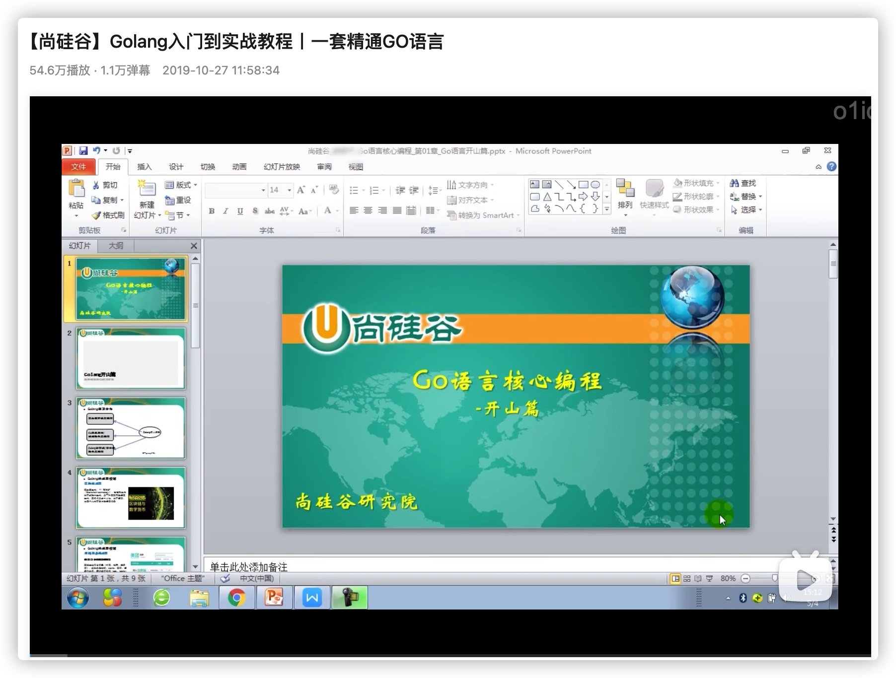

**Địa chỉ**: https://www.bilibili.com/video/BV1ME411Y71o

**Đánh giá**: ⭐⭐⭐⭐⭐

### 2. Dành cho người đã có nền tảng ngôn ngữ khác: Khóa học cấp tốc Golang (6 tiếng)

Đi thẳng vào trọng tâm cú pháp và cơ chế của Go cho người đã biết C++ hoặc Java.

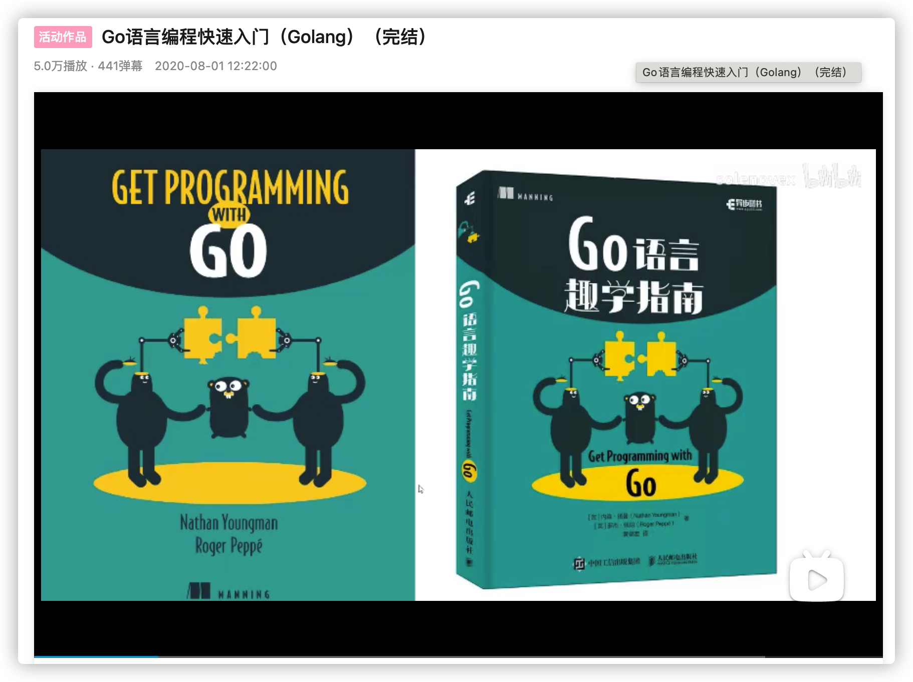

**Địa chỉ**: https://www.bilibili.com/video/BV1fD4y1m7TD

**Đánh giá**: ⭐⭐⭐⭐⭐

### 3. Hắc Mã: 20 giờ làm chủ nhanh ngôn ngữ Go

Kết hợp hoàn hảo giữa lý thuyết nền tảng và bài tập thực chiến, giúp bạn nhanh chóng bắt tay vào làm dự án.

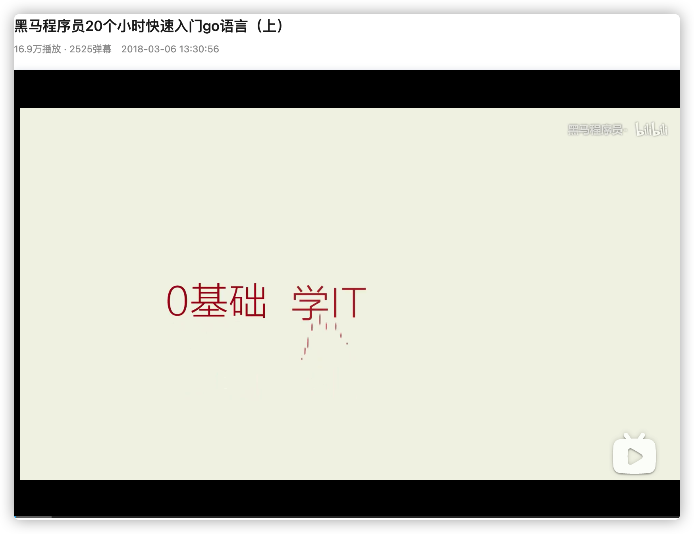

**Địa chỉ**: https://www.bilibili.com/video/BV1UW411x7v2

**Đánh giá**: ⭐⭐⭐⭐⭐

## 3. Frontend

### 1. Hắc Mã - Thầy Pink: HTML5 + CSS3 + Mobile Frontend

Thầy Pink là giảng viên vàng của mảng Frontend tại Hắc Mã, giảng dạy rất hóm hỉnh và dễ hiểu.

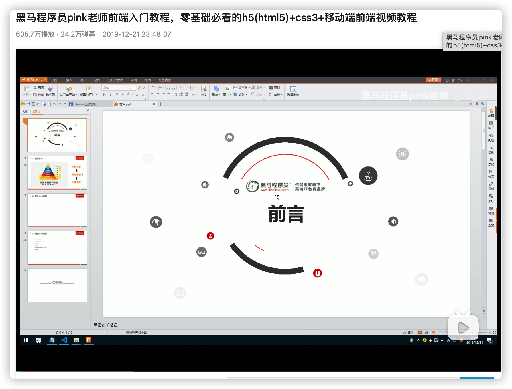

**Địa chỉ**: https://www.bilibili.com/video/BV14J4114768

**Đánh giá**: ⭐⭐⭐⭐⭐

### 2. Hắc Mã: Giáo trình chuyên sâu Cốt lõi JavaScript

Bổ trợ toàn diện các khái niệm chuyên sâu trong JS như Closure, Prototype, Event Loop, Async/Await.

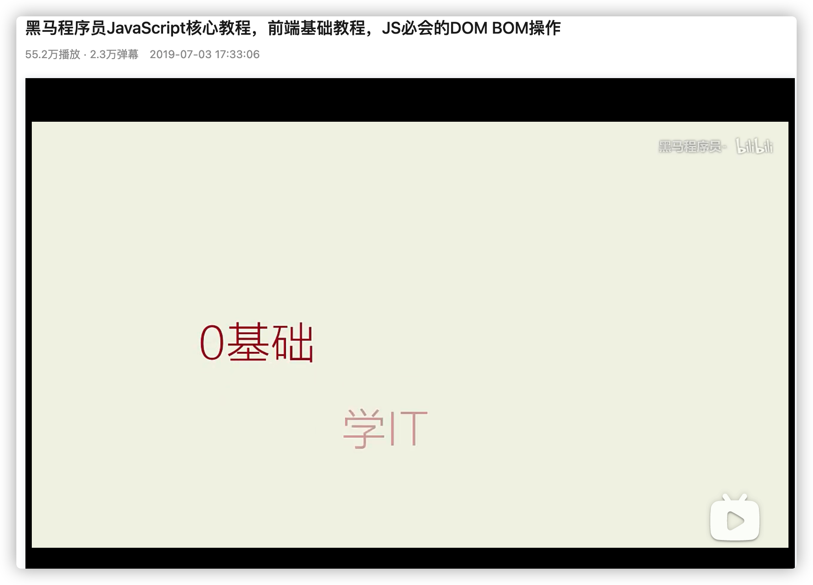

**Địa chỉ**: https://www.bilibili.com/video/BV1k4411w7sV

**Đánh giá**: ⭐⭐⭐⭐

### 3. Framework Vue

**1. Dự án Hệ thống Giám sát Realtime & Trực quan hóa ECharts + Vue**

Dự án thực chiến rất thích hợp để củng cố kỹ năng Vue và trực quan hóa dữ liệu.

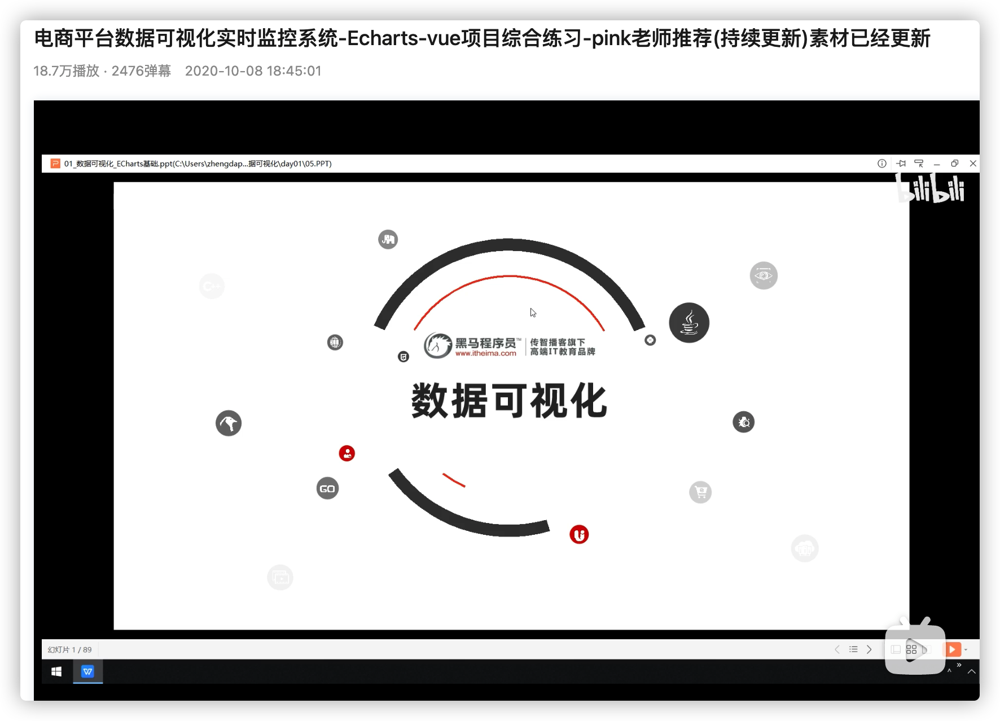

**Địa chỉ**: https://www.bilibili.com/video/BV1bh41197p8

**Đánh giá**: ⭐⭐⭐⭐⭐

**2. Phân tích mã nguồn Vue (Vue Source Code)**

Khóa học phân tích sâu về cơ chế phản ứng (Reactivity System), Virtual DOM của Vue do Thượng Quy Cốc sản xuất.

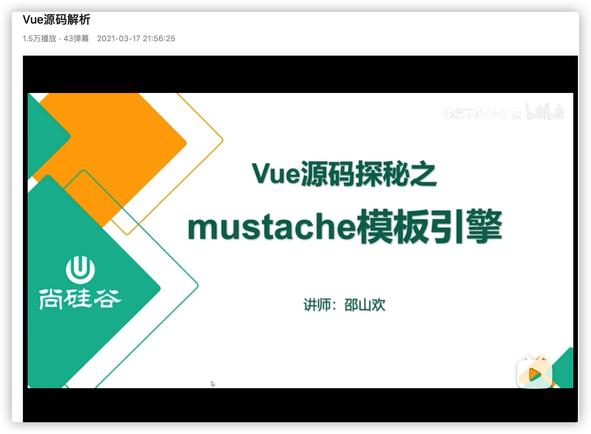

**Địa chỉ**: https://www.bilibili.com/video/BV1op4y1h7Fv

**Đánh giá**: ⭐⭐⭐⭐

---

Hẹn gặp lại các bạn ở Kỳ 3 với danh sách các khóa học quốc tế đỉnh cao!
