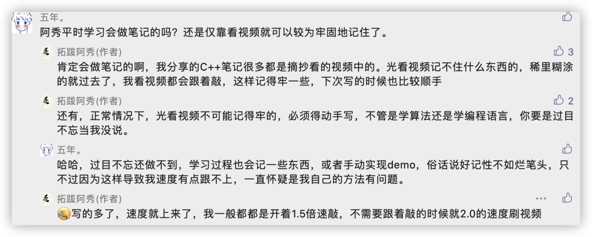
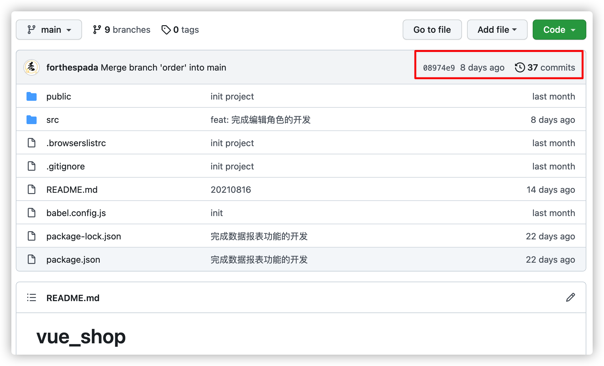
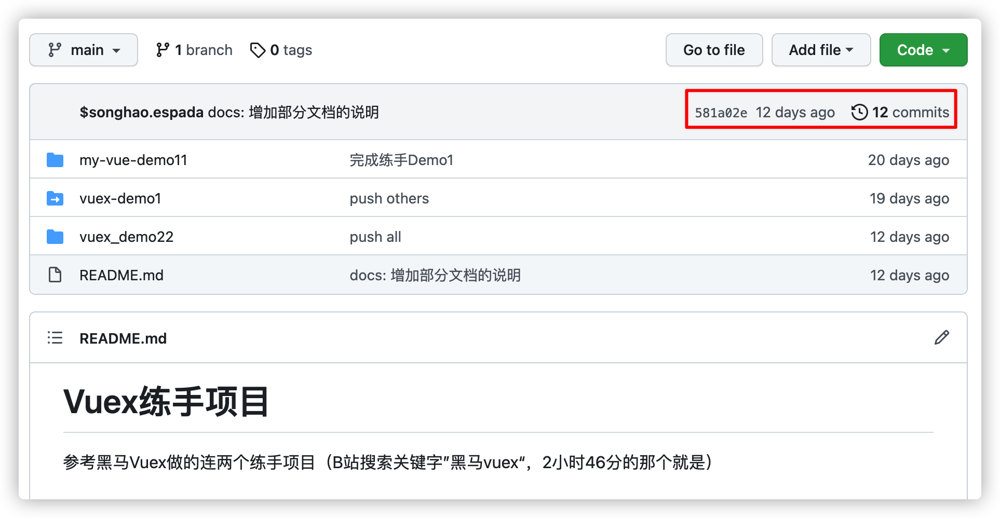

<h1 align="center">Một vài lời khuyên nhỏ khi xem video bài giảng</h1>

> Tác giả: A Tú (阿秀)
>
> Liên kết bài viết gốc: [https://mp.weixin.qq.com/s/rXprhIxwYGRJoRWyhS-lvQ](https://mp.weixin.qq.com/s/rXprhIxwYGRJoRWyhS-lvQ)

  
Đây là 6 thông tin có thể sẽ hữu ích cho bạn:

⭐️1. A Tú cùng bạn bè hợp tác phát triển một website tài nguyên lập trình, hiện đã tổng hợp rất nhiều tài liệu học tập chất lượng và công cụ hữu ích (kèm link tải). Nếu bạn đang tìm kiếm tài nguyên lập trình phù hợp, <a href="https://tools.interviewguide.cn/home" style="text-decoration: underline" target="_blank">hoan nghênh trải nghiệm</a> cũng như giới thiệu những tài nguyên bạn thấy hay. Góp gió thành bão, mình vì mọi người, mọi người vì mình🔥!
  
2. 👉 Tháng 5/2023, trong thời gian <a style="text-decoration: underline" href="https://mp.weixin.qq.com/s?__biz=Mzk0ODU4MzEzMw==&mid=2247512170&idx=1&sn=c4a04a383d2dfdece676b75f17224e78" target="_blank">rời ByteDance để chuyển sang một công ty đa quốc gia</a>, nhằm thuận tiện cho bản thân khi tìm việc và nâng cao tỷ lệ trúng tuyển, A Tú cùng bạn bè đã phát triển từ con số 0 một website giải đề phỏng vấn thực chiến của các Big Tech, bao gồm hai frontend và một backend. Trang web cho phép tra cứu có định hướng đề thi viết của các công ty Internet, ví dụ như muốn tra cứu đề thi viết của ByteDance trong 1 năm gần đây gồm những gì đều có thể làm được. Hoan nghênh trải nghiệm~

Địa chỉ website: <a style="text-decoration: underline" href="https://niumacode.com/home?ref=F6O2625K" target="_blank">Website đề thi thuật toán phỏng vấn Big Tech</a>.
    
3. 😊
    Chia sẻ một website công cụ tiện ích mà A Tú tâm đắc sưu tầm, <a style="text-decoration: underline" href="https://hkjtz.cn/" target="_blank">nhấn vào đây để truy cập</a>, chủ yếu là các ứng dụng, website ngách hữu ích, ngoài ra còn có tài nguyên phim ảnh HD, âm nhạc, phim truyền hình, AI, phim tài liệu, tài liệu thi tiếng Anh, thi công chức, cao học, nghề tay trái...
  

  
4. 😍 Chia sẻ miễn phí tài nguyên học tập mà A Tú đã tích lũy từ khi theo học máy tính, <a style="text-decoration: underline" href="/notes/07-resources/01-free/01-introduce.html" target="_blank">nhấn vào đây để nhận miễn phí</a>; đồng thời cũng lưu lại nhật ký đánh giá <a style="text-decoration: underline" href="/notes/07-resources/02-precious.html" target="_blank">những cuốn sách máy tính, chuyên mục online chất lượng cũng như những khóa học trả phí kém chất lượng</a> từng mua trước đây.
  

  
5. 🚀 Nếu bạn muốn thuận lợi giành được offer tốt hơn trong kỳ tuyển dụng trường học (Campus Recruitment), A Tú khuyên bạn nên xem thêm những <a style="text-decoration: underline" href="https://www.yuque.com/tuobaaxiu/httmmc/npg1k81zeq4wfpyz" target="_blank">cạm bẫy từng vấp phải</a> và <a style="text-decoration: underline"  target="_blank" href="https://www.yuque.com/tuobaaxiu/httmmc/gge9ppd0mbu2d3dp">kinh nghiệm đúc kết</a> của người đi trước. Thực tế, hầu hết các vấn đề bạn đang gặp phải thì các anh chị khóa trước đều đã từng trải qua.
  

  
6. 🔥 Hoan nghênh các bạn đang chuẩn bị cho kỳ tuyển dụng trường học ngành CNTT tham gia <a  style="text-decoration: underline" href="https://www.yuque.com/tuobaaxiu/httmmc/xg0otqvc17wfx4u9" target="_blank">Cộng đồng học tập</a> của tôi. Độc hành một mình chi bằng cùng nhau sưởi ấm, trong nhóm đã đọng lại rất nhiều <a  style="text-decoration: underline" href="https://www.yuque.com/tuobaaxiu/httmmc/gge9ppd0mbu2d3dp" target="_blank">kinh nghiệm và tổng kết</a> của các anh chị khóa 21/22/23/24/25. Kiên trì đi theo lộ trình, cuối cùng đa phần đều có thể nhận được offer ưng ý! Nếu bạn cần phiên bản PDF tổng hợp các điểm kiến thức 📚︎ Bát cổ văn phỏng vấn tuyển dụng trường học trên website 《Ghi chép học tập của A Tú》, có thể <a style="text-decoration: underline" href="https://www.yuque.com/tuobaaxiu/httmmc/qs0yn66apvkzw0ps" target="_blank">nhấn vào đây để tải về</a>.
   

Lần trước tôi đã chia sẻ với các bạn rất nhiều khóa học lập trình miễn phí chất lượng cao trên Bilibili:

- [Tôi học lập trình hoàn toàn dựa vào Bilibili, quá hời luôn (Kỳ 1)](/notes/04-experience/01-learn_experience/20210809%20-%20第一期-我学编程全靠B站了，真香.md)
- [Tôi học lập trình hoàn toàn dựa vào Bilibili, quá hời luôn (Kỳ 2)](/notes/04-experience/01-learn_experience/20210823%20-%20第二期-我学编程全靠B站了，真香.md)

Trong phần bình luận, có một số bạn chia sẻ phương pháp xem video bài giảng chưa thực sự hiệu quả. 

Trong các nhóm thảo luận, tôi cũng thường thấy các bạn sinh viên khóa dưới đi đường vòng tốn nhiều thời gian. Vì vậy tôi viết bài này để chia sẻ phương pháp xem video bài giảng lập trình sao cho đạt hiệu quả cao nhất.

Các video lập trình nhìn chung có thể chia làm 2 nhóm:

1. **Video mang tính thực hành cao**: Ngôn ngữ lập trình (C++, Java, Golang, Python), Cấu trúc dữ liệu & Thuật toán, các dự án thực chiến (như Gulimall của Java, dự án tương tác thương mại điện tử của Frontend).
2. **Video mang tính lý thuyết cao**: Hệ điều hành, Kiến trúc máy tính, Mạng máy tính.

Dưới đây là phương pháp và kinh nghiệm cụ thể cho từng nhóm:

## 1. Đối với video mang tính thực hành cao

**Bắt buộc phải gõ code theo!**  
**Bắt buộc phải gõ code theo!**  
**Bắt buộc phải gõ code theo!**  

Điều quan trọng phải nhắc lại 3 lần.

Có bạn xem video lập trình chỉ nhìn bằng mắt, không chạm tay vào bàn phím gõ thử, cũng không suy nghĩ theo luồng tư duy của giảng viên... Đây là điều tối kỵ.

Bất cứ chỗ nào **cần thiết** hoặc **có thể** tự tay gõ code, bạn nhất định phải bắt tay vào gõ!

Giai đoạn đầu khi học một ngôn ngữ hoặc framework mới (như Vue, React, Django), việc viết code thực chất chính là quá trình "sao chép code mẫu". **Chỉ khi sao chép và gõ lại đủ nhiều, bạn mới hiểu và có thể tự mình viết ra code**.

Học lập trình cũng như học làm văn: ban đầu phải học cách mô phỏng các câu từ hay của người khác, khi đã tích lũy đủ thì mới tự mình sáng tạo nên bài viết hoàn chỉnh. Đừng quá tự tin vào trí nhớ của mình, nếu chỉ xem lướt qua thì sau một lượt bạn sẽ chẳng đọng lại được bao nhiêu, thậm chí một vòng lặp `for` cơ bản cũng có thể viết sai cú pháp.

### Ví dụ khi học C++
Hồi học C++, thầy trong video viết thế nào là tôi gõ lại y hệt như thế, từ cách đặt tên file, tên biến cho đến cách xuống dòng, bởi vì giai đoạn đầu nếu làm khác đi rất dễ gặp lỗi ngớ ngẩn (thiếu dấu phẩy, thừa dấu ngoặc) rồi mất hàng giờ đồng hồ tìm lỗi.

### Ví dụ khi học Python & Crawler
Khi học crawler từ thầy Thôi Khánh Tài, thầy cấu hình môi trường ra sao, gửi request thế nào, cài đặt Scrapy framework ra sao... tôi đều làm theo từng bước một và hoàn thành trọn vẹn các bài tập được giao.

### Ví dụ khi học Frontend
Dự án Element-UI + Vue của Hắc Mã tôi chia nhánh Git rõ ràng, mỗi tính năng làm xong đều commit và push lên repository đầy đủ với gần 40 commit.

**Mẹo nhỏ về tốc độ xem video**:
- Nếu giảng viên nói chậm, tôi thường bật tốc độ 1.5x hoặc 2.0x.
- Tôi thường **mở video trên điện thoại và dùng máy tính để gõ code/ghi chép**, cách này giúp tiết kiệm thời gian chuyển đổi qua lại giữa các cửa sổ ứng dụng trên màn hình laptop.

## 2. Đối với video mang tính lý thuyết cao

Các môn như Hệ điều hành, Mạng máy tính, Cơ sở dữ liệu:

Lời khuyên của tôi là: **Xem trước một vài video bài giảng để nắm khung sườn, sau đó chuyển sang đọc các cuốn sách kinh điển**.

### Tại sao nên xem qua video trước?
Bilibili có rất nhiều bài giảng của các giáo sư từ các trường đại học hàng đầu (Thanh Hoa, Nam Kinh, HIT...). Xem video giúp bạn tiếp cận nhanh khái niệm ban đầu mà không bị choáng ngợp bởi những trang sách dày đặc chữ. Nếu xem một video mà thấy không hợp phong cách giảng dạy, hãy mạnh dạn đổi sang khóa học của giảng viên khác.

### Tại sao không nên chỉ dựa vào video mà phải chuyển sang đọc sách?
Kiến thức trong video là kiến thức đã qua "bộ lọc" và quá trình tiêu hóa của người dạy truyền đạt lại. Bạn cần đọc trực tiếp sách kinh điển để tự mình "nhai", nghiền ngẫm và nắm trọn vẹn bản chất gốc rễ của kiến thức.

Ví dụ: Bắt tay 3 bước (Three-way Handshake) và Ngắt kết nối 4 bước (Four-way Handshake) trong TCP, chỉ xem video bạn sẽ thấy rất mông lung. Sau khi xem video của thầy Hàn Lập Cương, tôi đọc kỹ chương Tầng giao vận trong cuốn 《Mạng máy tính: Cách tiếp cận từ trên xuống》 và tự tay dùng Wireshark bắt gói tin thực tế, khi đó kiến thức mới thực sự biến thành của mình.

---

**Tóm lại:**
Nguyên tắc cốt lõi là luôn nắm bắt mọi cơ hội để tự tay thực hành. Xem video kết hợp với đọc sách kinh điển và làm bài tập thực tế sẽ giúp bạn xây dựng nền tảng máy tính vững chắc nhất!
