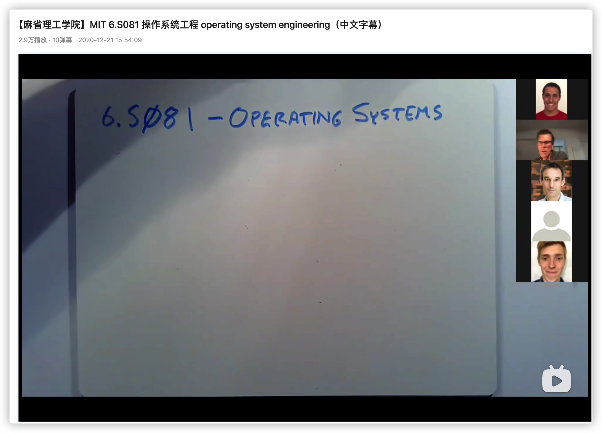
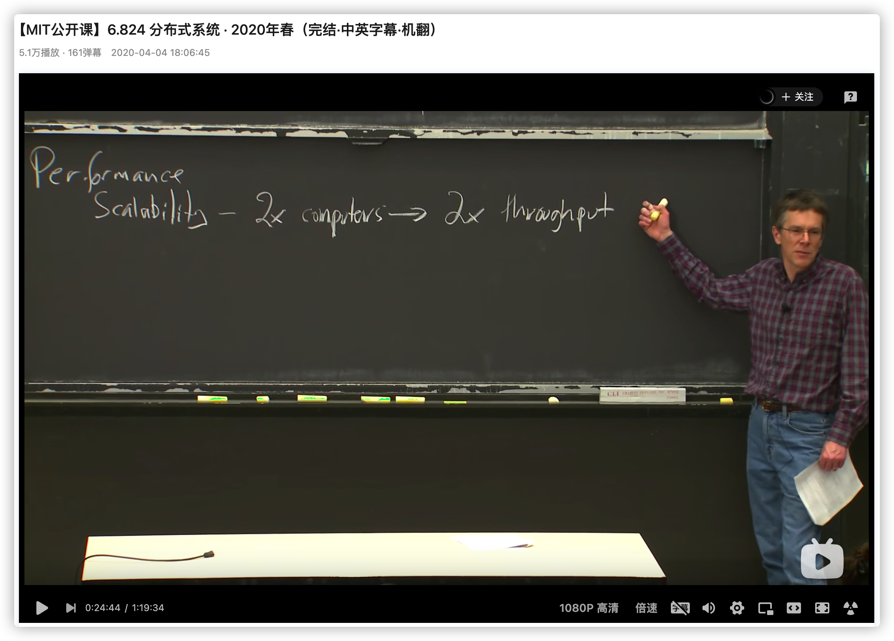
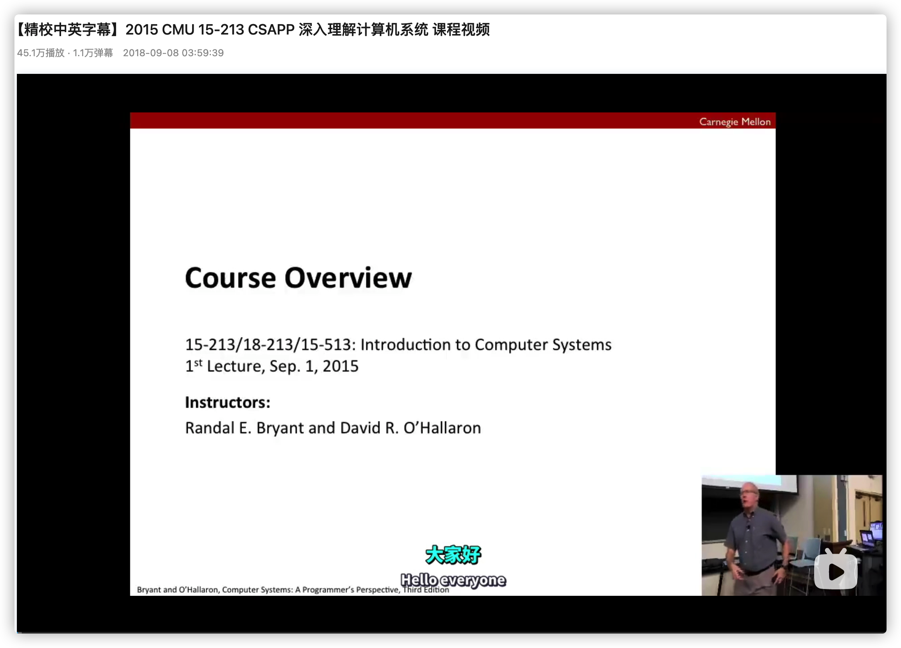
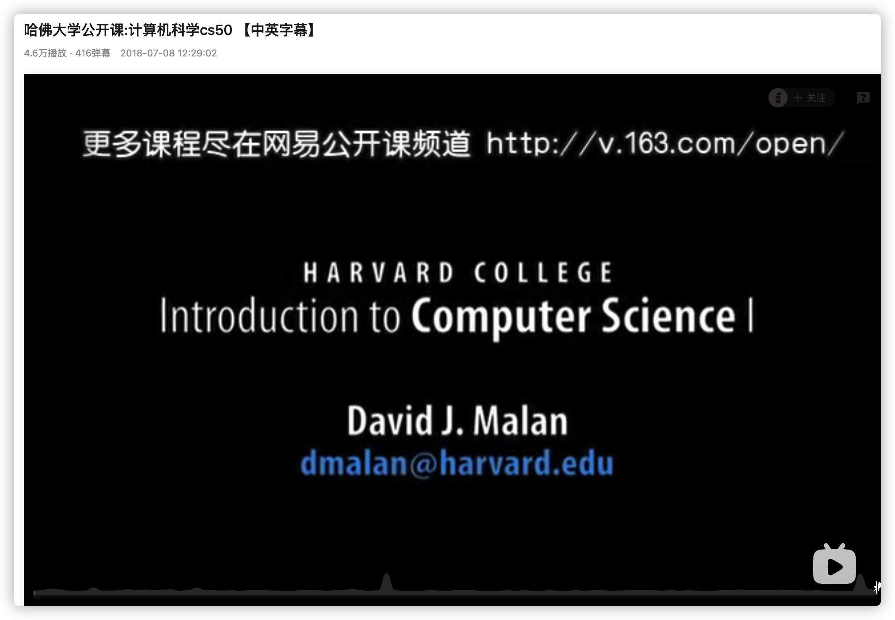
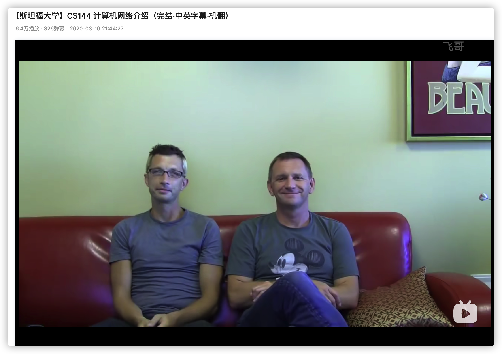

<h1 align="center">Tôi học lập trình hoàn toàn dựa vào Bilibili, quá hời luôn - Phần nguồn nước ngoài (Kỳ 3)</h1>

> Tác giả: A Tú (阿秀)
>
> Liên kết bài viết gốc: [https://mp.weixin.qq.com/s/NPskxGeMa1XoTWFRq32CwQ](https://mp.weixin.qq.com/s/NPskxGeMa1XoTWFRq32CwQ)

  
Đây là 6 thông tin có thể sẽ hữu ích cho bạn:

⭐️1. A Tú cùng bạn bè hợp tác phát triển một website tài nguyên lập trình, hiện đã tổng hợp rất nhiều tài liệu học tập chất lượng và công cụ hữu ích (kèm link tải). Nếu bạn đang tìm kiếm tài nguyên lập trình phù hợp, <a href="https://tools.interviewguide.cn/home" style="text-decoration: underline" target="_blank">hoan nghênh trải nghiệm</a> cũng như giới thiệu những tài nguyên bạn thấy hay. Góp gió thành bão, mình vì mọi người, mọi người vì mình🔥!
  
2. 👉 Tháng 5/2023, trong thời gian <a style="text-decoration: underline" href="https://mp.weixin.qq.com/s?__biz=Mzk0ODU4MzEzMw==&mid=2247512170&idx=1&sn=c4a04a383d2dfdece676b75f17224e78" target="_blank">rời ByteDance để chuyển sang một công ty đa quốc gia</a>, nhằm thuận tiện cho bản thân khi tìm việc và nâng cao tỷ lệ trúng tuyển, A Tú cùng bạn bè đã phát triển từ con số 0 một website giải đề phỏng vấn thực chiến của các Big Tech, bao gồm hai frontend và một backend. Trang web cho phép tra cứu có định hướng đề thi viết của các công ty Internet, ví dụ như muốn tra cứu đề thi viết của ByteDance trong 1 năm gần đây gồm những gì đều có thể làm được. Hoan nghênh trải nghiệm~

Địa chỉ website: <a style="text-decoration: underline" href="https://niumacode.com/home?ref=F6O2625K" target="_blank">Website đề thi thuật toán phỏng vấn Big Tech</a>.
    
3. 😊
    Chia sẻ một website công cụ tiện ích mà A Tú tâm đắc sưu tầm, <a style="text-decoration: underline" href="https://hkjtz.cn/" target="_blank">nhấn vào đây để truy cập</a>, chủ yếu là các ứng dụng, website ngách hữu ích, ngoài ra còn có tài nguyên phim ảnh HD, âm nhạc, phim truyền hình, AI, phim tài liệu, tài liệu thi tiếng Anh, thi công chức, cao học, nghề tay trái...
  

  
4. 😍 Chia sẻ miễn phí tài nguyên học tập mà A Tú đã tích lũy từ khi theo học máy tính, <a style="text-decoration: underline" href="/notes/07-resources/01-free/01-introduce.html" target="_blank">nhấn vào đây để nhận miễn phí</a>; đồng thời cũng lưu lại nhật ký đánh giá <a style="text-decoration: underline" href="/notes/07-resources/02-precious.html" target="_blank">những cuốn sách máy tính, chuyên mục online chất lượng cũng như những khóa học trả phí kém chất lượng</a> từng mua trước đây.
  

  
5. 🚀 Nếu bạn muốn thuận lợi giành được offer tốt hơn trong kỳ tuyển dụng trường học (Campus Recruitment), A Tú khuyên bạn nên xem thêm những <a style="text-decoration: underline" href="https://www.yuque.com/tuobaaxiu/httmmc/npg1k81zeq4wfpyz" target="_blank">cạm bẫy từng vấp phải</a> và <a style="text-decoration: underline"  target="_blank" href="https://www.yuque.com/tuobaaxiu/httmmc/gge9ppd0mbu2d3dp">kinh nghiệm đúc kết</a> của người đi trước. Thực tế, hầu hết các vấn đề bạn đang gặp phải thì các anh chị khóa trước đều đã từng trải qua.
  

  
6. 🔥 Hoan nghênh các bạn đang chuẩn bị cho kỳ tuyển dụng trường học ngành CNTT tham gia <a  style="text-decoration: underline" href="https://www.yuque.com/tuobaaxiu/httmmc/xg0otqvc17wfx4u9" target="_blank">Cộng đồng học tập</a> của tôi. Độc hành một mình chi bằng cùng nhau sưởi ấm, trong nhóm đã đọng lại rất nhiều <a  style="text-decoration: underline" href="https://www.yuque.com/tuobaaxiu/httmmc/gge9ppd0mbu2d3dp" target="_blank">kinh nghiệm và tổng kết</a> của các anh chị khóa 21/22/23/24/25. Kiên trì đi theo lộ trình, cuối cùng đa phần đều có thể nhận được offer ưng ý! Nếu bạn cần phiên bản PDF tổng hợp các điểm kiến thức 📚︎ Bát cổ văn phỏng vấn tuyển dụng trường học trên website 《Ghi chép học tập của A Tú》, có thể <a style="text-decoration: underline" href="https://www.yuque.com/tuobaaxiu/httmmc/qs0yn66apvkzw0ps" target="_blank">nhấn vào đây để tải về</a>.
   

Chào cả nhà, hôm nay tôi xin chia sẻ bộ sưu tập những khóa học mở đỉnh cao của các trường đại học hàng đầu thế giới (MIT, CMU, Harvard, Stanford).

Với tiêu chí "ít nhưng chất lượng", tôi chỉ tuyển chọn 5 khóa học xuất sắc nhất mà bản thân đã từng học, đặc biệt tất cả đều có phụ đề tiếng Trung/Anh giúp các bạn dễ dàng theo dõi.

Các cuốn sách kinh điển được giới thiệu trong bài có thể tìm bản PDF điện tử tại: https://github.com/forthespada/CS-Books

## 1. MIT 6.828 / 6.S081: Kỹ thuật Hệ điều hành (Operating System Engineering) - Đỉnh của chóp

Kiến trúc hệ thống máy tính là mảng kiến thức nền tảng quan trọng nhất để thấu hiểu cách thức hoạt động của phần mềm ở tầng đáy.

Cuốn sách kinh điển 《Thấu hiểu sâu sắc Hệ thống Máy tính》(CS:APP) chính là nền tảng của khóa học này. Khóa học đứng trên góc nhìn của lập trình viên phần mềm để giải thích toàn bộ hệ thống máy tính.

Đối với những ai muốn hiểu sâu về hệ thống để viết code nhanh hơn, tối ưu hơn và đáng tin cậy hơn thì khóa học MIT 6.828 (nay là 6.S081) là điểm xuất phát tuyệt vời nhất.

**Địa chỉ**: https://www.bilibili.com/video/BV1Dy4y1m7ZE

**Đánh giá**: ⭐⭐⭐⭐⭐

## 2. MIT 6.824: Hệ thống Phân tán (Distributed Systems)

Hệ thống phân tán ngày càng đóng vai trò cốt lõi trong kiến trúc phần mềm hiện đại.

Hồi làm luận văn thạc sĩ, sư huynh tiến sĩ của tôi liên tục khen ngợi và khuyên tôi phải xem khóa học này bằng được. Quả thực, khóa học này giảng về MapReduce, Raft Consensus Algorithm, Fault Tolerance cực kỳ xuất sắc!

Gợi ý đọc kèm cuốn sách kinh điển: 《**Thiết kế ứng dụng chuyên sâu về dữ liệu**(Designing Data-Intensive Applications - DDIA)》 của Martin Kleppmann - cuốn sách "gối đầu giường" bắt buộc của mọi Kỹ sư Backend và Kiến trúc sư Hệ thống (System Architect).

**Địa chỉ**: https://www.bilibili.com/video/BV1Dy4y1m7ZE

**Đánh giá**: ⭐⭐⭐⭐⭐

## 3. Đại học Carnegie Mellon (CMU) 15-213: Nhập môn Hệ thống Máy tính (CS:APP Fall)

Khóa học chính gốc của cuốn giáo trình CS:APP danh tiếng do chính các giáo sư tại CMU (nơi chắp bút cuốn sách) trực tiếp giảng dạy.

Khuyên bạn nên học sau khi đã nắm các khái niệm cơ bản hoặc học song song với MIT 6.828.

**Địa chỉ**: https://www.bilibili.com/video/BV1iW411d7hd

**Đánh giá**: ⭐⭐⭐⭐

## 4. Đại học Harvard: Khóa học mở Khoa học Máy tính CS50 (Phụ đề song ngữ)

Một khóa học nhập môn toàn diện và cực kỳ truyền cảm hứng về Khoa học Máy tính do Giáo sư David J. Malan giảng dạy tại Đại học Harvard. Giảng đường luôn tràn đầy năng lượng và các ví dụ trực quan sinh động.

**Địa chỉ**: https://www.bilibili.com/video/BV1ks411p7js

**Đánh giá**: ⭐⭐⭐⭐⭐

## 5. Đại học Stanford: CS144 Giới thiệu Mạng máy tính (Computer Networking)

Đây là khóa học về Mạng máy tính của nước ngoài hay nhất mà tôi từng xem.

Chất lượng bài giảng và các bài lab tự tay hiện thực hóa ngăn xếp TCP của Stanford là vô cùng xuất sắc. Rất nên kết hợp học cùng cuốn giáo trình 《Mạng máy tính: Cách tiếp cận từ trên xuống (Computer Networking: A Top-Down Approach)》.

**Địa chỉ**: https://www.bilibili.com/video/BV137411Z7LR

**Đánh giá**: ⭐⭐⭐⭐⭐

---

Chúc các bạn có những trải nghiệm học tập tuyệt vời với những khóa học đỉnh cao thế giới này!
