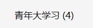
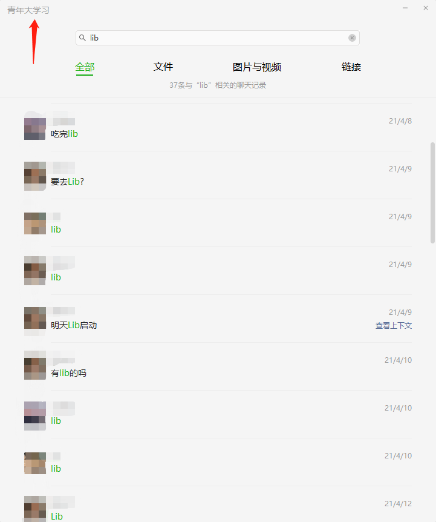

<h1 align="center">Kinh nghiệm học tập và phỏng vấn thực tế của một bạn sinh viên năm 3 đại học</h1>

  
Đây là 6 thông tin có thể sẽ hữu ích cho bạn:

⭐️1. A Tú cùng bạn bè hợp tác phát triển một website tài nguyên lập trình, hiện đã tổng hợp rất nhiều tài liệu học tập chất lượng và công cụ hữu ích (kèm link tải). Nếu bạn đang tìm kiếm tài nguyên lập trình phù hợp, <a href="https://tools.interviewguide.cn/home" style="text-decoration: underline" target="_blank">hoan nghênh trải nghiệm</a> cũng như giới thiệu những tài nguyên bạn thấy hay. Góp gió thành bão, mình vì mọi người, mọi người vì mình🔥!
  
2. 👉 Tháng 5/2023, trong thời gian <a style="text-decoration: underline" href="https://mp.weixin.qq.com/s?__biz=Mzk0ODU4MzEzMw==&mid=2247512170&idx=1&sn=c4a04a383d2dfdece676b75f17224e78" target="_blank">rời ByteDance để chuyển sang một công ty đa quốc gia</a>, nhằm thuận tiện cho bản thân khi tìm việc và nâng cao tỷ lệ trúng tuyển, A Tú cùng bạn bè đã phát triển từ con số 0 một website giải đề phỏng vấn thực chiến của các Big Tech, bao gồm hai frontend và một backend. Trang web cho phép tra cứu có định hướng đề thi viết của các công ty Internet, ví dụ như muốn tra cứu đề thi viết của ByteDance trong 1 năm gần đây gồm những gì đều có thể làm được. Hoan nghênh trải nghiệm~

Địa chỉ website: <a style="text-decoration: underline" href="https://niumacode.com/home?ref=F6O2625K" target="_blank">Website đề thi thuật toán phỏng vấn Big Tech</a>.
    
3. 😊
    Chia sẻ một website công cụ tiện ích mà A Tú tâm đắc sưu tầm, <a style="text-decoration: underline" href="https://hkjtz.cn/" target="_blank">nhấn vào đây để truy cập</a>, chủ yếu là các ứng dụng, website ngách hữu ích, ngoài ra còn có tài nguyên phim ảnh HD, âm nhạc, phim truyền hình, AI, phim tài liệu, tài liệu thi tiếng Anh, thi công chức, cao học, nghề tay trái...
  

  
4. 😍 Chia sẻ miễn phí tài nguyên học tập mà A Tú đã tích lũy từ khi theo học máy tính, <a style="text-decoration: underline" href="/notes/07-resources/01-free/01-introduce.html" target="_blank">nhấn vào đây để nhận miễn phí</a>; đồng thời cũng lưu lại nhật ký đánh giá <a style="text-decoration: underline" href="/notes/07-resources/02-precious.html" target="_blank">những cuốn sách máy tính, chuyên mục online chất lượng cũng như những khóa học trả phí kém chất lượng</a> từng mua trước đây.
  

  
5. 🚀 Nếu bạn muốn thuận lợi giành được offer tốt hơn trong kỳ tuyển dụng trường học (Campus Recruitment), A Tú khuyên bạn nên xem thêm những <a style="text-decoration: underline" href="https://www.yuque.com/tuobaaxiu/httmmc/npg1k81zeq4wfpyz" target="_blank">cạm bẫy từng vấp phải</a> và <a style="text-decoration: underline"  target="_blank" href="https://www.yuque.com/tuobaaxiu/httmmc/gge9ppd0mbu2d3dp">kinh nghiệm đúc kết</a> của người đi trước. Thực tế, hầu hết các vấn đề bạn đang gặp phải thì các anh chị khóa trước đều đã từng trải qua.
  

  
6. 🔥 Hoan nghênh các bạn đang chuẩn bị cho kỳ tuyển dụng trường học ngành CNTT tham gia <a  style="text-decoration: underline" href="https://www.yuque.com/tuobaaxiu/httmmc/xg0otqvc17wfx4u9" target="_blank">Cộng đồng học tập</a> của tôi. Độc hành một mình chi bằng cùng nhau sưởi ấm, trong nhóm đã đọng lại rất nhiều <a  style="text-decoration: underline" href="https://www.yuque.com/tuobaaxiu/httmmc/gge9ppd0mbu2d3dp" target="_blank">kinh nghiệm và tổng kết</a> của các anh chị khóa 21/22/23/24/25. Kiên trì đi theo lộ trình, cuối cùng đa phần đều có thể nhận được offer ưng ý! Nếu bạn cần phiên bản PDF tổng hợp các điểm kiến thức 📚︎ Bát cổ văn phỏng vấn tuyển dụng trường học trên website 《Ghi chép học tập của A Tú》, có thể <a style="text-decoration: underline" href="https://www.yuque.com/tuobaaxiu/httmmc/qs0yn66apvkzw0ps" target="_blank">nhấn vào đây để tải về</a>.
   

> Tác giả: A Tú (阿秀)
>
> Liên kết bài viết gốc: [https://mp.weixin.qq.com/s/QDID1F35OFmfHN6vFHnPyA](https://mp.weixin.qq.com/s/QDID1F35OFmfHN6vFHnPyA)

Dưới đây là chia sẻ của một bạn sinh viên năm 3 ngành Kỹ thuật phần mềm (không có giải ACM/ICPC, không có dự án khủng từ trước) đã xuất sắc giành được offer thực tập từ **Alibaba (UC Business Group)** và **Huawei (Consumer BG Software Dept)**.

### 1. Bối cảnh & Nhóm học tập 4 người
- Bắt đầu xác định hướng Backend C/C++ từ kỳ 1 năm 3.
- Cùng lập nhóm học tập 4 người, hàng ngày giám sát nhau lên thư viện học từ sáng đến tối.

### 2. Lộ trình ôn luyện
- **Tháng 2 - Tháng 3**: Củng cố kiến thức nền tảng CS (Hệ điều hành, Mạng, C++, Thuật toán LeetCode).
- **Tháng 3**: Học bộ kiến thức cốt lõi "Bát cổ văn" trên website của A Tú, làm dự án thực chiến WebServer và Skip List KV-Storage.
- **Cuối tháng 3**: Bắt đầu nộp hồ sơ thực tập mùa hè.

### 3. Trải nghiệm phỏng vấn tại các công ty lớn
- **37 Interactive Entertainment (37Games)**: Bài thi trắc nghiệm nhiều câu hỏi quy luật hình ảnh, bài test code dùng notepad thô sơ.
- **ByteDance (System Architecture)**: Phỏng vấn rất sâu về giao thức mạng tầng thấp (QUIC, SPDY, HTTP 1.0/1.1/2.0/3.0, Lock Mechanism). Mặc dù giải được thuật toán nhưng trượt do hổng kiến thức mạng nâng cao -> Bài học giúp bổ sung kiến thức kịp thời.
- **Alibaba**: 
  - Vòng 1: Đào sâu chi tiết kiến trúc dự án.
  - Vòng 2: Câu hỏi tình huống mở, tranh luận kỹ thuật.
  - Vòng 3 (Leader): Tối ưu hóa I/O đĩa từ tầng phần cứng lên phần mềm, Quản lý bộ nhớ trong OS -> Thể hiện thái độ cầu tiến và tư duy mạch lạc nên đã trúng tuyển.
- **Tencent (Photon Studio)**: Độ khó cao nhất, hỏi sâu về cấu trúc Linux Kernel, STL Source code, epoll LT vs ET, Debug GDB và tối ưu hiệu năng Server.
- **Meituan**: Lệch Tech Stack (team tuyển Go/Python trong khi bạn học C++) nhưng buổi phỏng vấn diễn ra rất cởi mở.
- **Huawei**: Tập trung vào kiến thức cơ bản C/C++ và giải thuật toán -> Nhận offer.

### 4. Ba bài học kinh nghiệm cốt lõi
1. **Giao tiếp chủ động khi gặp câu hỏi khó**: Trình bày hướng suy nghĩ để người phỏng vấn hiểu logic của mình.
2. **Dẫn dắt cuộc phỏng vấn về mảng thế mạnh**: Tự tin mở rộng các chủ đề mình am hiểu sâu.
3. **Tổng kết và phục bàn (Review) sau mỗi buổi phỏng vấn**: Ghi chép lại những điểm chưa nắm vững để tra cứu và học bổ sung ngay lập tức.
