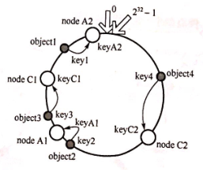
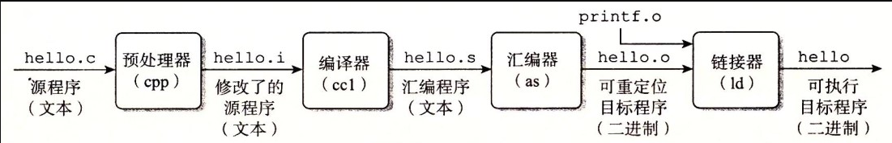
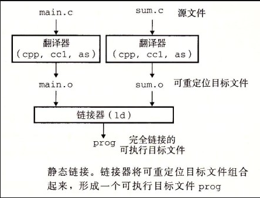
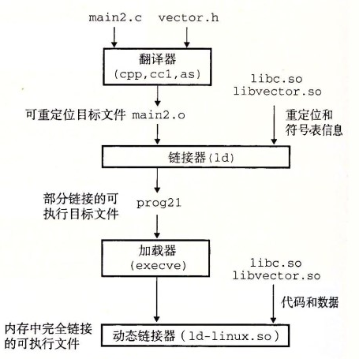

<h1 align="center">C++ - Cú pháp cơ bản (Câu 121 - 140)</h1>

  
Đây là 6 thông tin có thể sẽ hữu ích cho bạn:

⭐️1. A Tú cùng bạn bè hợp tác phát triển một website tài nguyên lập trình, hiện đã tổng hợp rất nhiều tài liệu học tập chất lượng và công cụ hữu ích (kèm link tải). Nếu bạn đang tìm kiếm tài nguyên lập trình phù hợp, <a href="https://tools.interviewguide.cn/home" style="text-decoration: underline" target="_blank">hoan nghênh trải nghiệm</a> cũng như giới thiệu những tài nguyên bạn thấy hay. Góp gió thành bão, mình vì mọi người, mọi người vì mình🔥!
  
2. 👉 Tháng 5/2023, trong thời gian <a style="text-decoration: underline" href="https://mp.weixin.qq.com/s?__biz=Mzk0ODU4MzEzMw==&mid=2247512170&idx=1&sn=c4a04a383d2dfdece676b75f17224e78" target="_blank">rời ByteDance để chuyển sang một công ty đa quốc gia</a>, nhằm thuận tiện cho bản thân khi tìm việc và nâng cao tỷ lệ trúng tuyển, A Tú cùng bạn bè đã phát triển từ con số 0 một website giải đề phỏng vấn thực chiến của các Big Tech, bao gồm hai frontend và một backend. Trang web cho phép tra cứu có định hướng đề thi viết của các công ty Internet, ví dụ như muốn tra cứu đề thi viết của ByteDance trong 1 năm gần đây gồm những gì đều có thể làm được. Hoan nghênh trải nghiệm~

Địa chỉ website: <a style="text-decoration: underline" href="https://niumacode.com/home?ref=F6O2625K" target="_blank">Website đề thi thuật toán phỏng vấn Big Tech</a>.
    
3. 😊
    Chia sẻ một website công cụ tiện ích mà A Tú tâm đắc sưu tầm, <a style="text-decoration: underline" href="https://hkjtz.cn/" target="_blank">nhấn vào đây để truy cập</a>, chủ yếu là các ứng dụng, website ngách hữu ích, ngoài ra còn có tài nguyên phim ảnh HD, âm nhạc, phim truyền hình, AI, phim tài liệu, tài liệu thi tiếng Anh, thi công chức, cao học, nghề tay trái...
  

  
4. 😍 Chia sẻ miễn phí tài nguyên học tập mà A Tú đã tích lũy từ khi theo học máy tính, <a style="text-decoration: underline" href="/notes/07-resources/01-free/01-introduce.html" target="_blank">nhấn vào đây để nhận miễn phí</a>; đồng thời cũng lưu lại nhật ký đánh giá <a style="text-decoration: underline" href="/notes/07-resources/02-precious.html" target="_blank">những cuốn sách máy tính, chuyên mục online chất lượng cũng như những khóa học trả phí kém chất lượng</a> từng mua trước đây.
  

  
5. 🚀 Nếu bạn muốn thuận lợi giành được offer tốt hơn trong kỳ tuyển dụng trường học (Campus Recruitment), A Tú khuyên bạn nên xem thêm những <a style="text-decoration: underline" href="https://www.yuque.com/tuobaaxiu/httmmc/npg1k81zeq4wfpyz" target="_blank">cạm bẫy từng vấp phải</a> và <a style="text-decoration: underline"  target="_blank" href="https://www.yuque.com/tuobaaxiu/httmmc/gge9ppd0mbu2d3dp">kinh nghiệm đúc kết</a> của người đi trước. Thực tế, hầu hết các vấn đề bạn đang gặp phải thì các anh chị khóa trước đều đã từng trải qua.
  

  
6. 🔥 Hoan nghênh các bạn đang chuẩn bị cho kỳ tuyển dụng trường học ngành CNTT tham gia <a  style="text-decoration: underline" href="https://www.yuque.com/tuobaaxiu/httmmc/xg0otqvc17wfx4u9" target="_blank">Cộng đồng học tập</a> của tôi. Độc hành một mình chi bằng cùng nhau sưởi ấm, trong nhóm đã đọng lại rất nhiều <a  style="text-decoration: underline" href="https://www.yuque.com/tuobaaxiu/httmmc/gge9ppd0mbu2d3dp" target="_blank">kinh nghiệm và tổng kết</a> của các anh chị khóa 21/22/23/24/25. Kiên trì đi theo lộ trình, cuối cùng đa phần đều có thể nhận được offer ưng ý! Nếu bạn cần phiên bản PDF tổng hợp các điểm kiến thức 📚︎ Bát cổ văn phỏng vấn tuyển dụng trường học trên website 《Ghi chép học tập của A Tú》, có thể <a style="text-decoration: underline" href="https://www.yuque.com/tuobaaxiu/httmmc/qs0yn66apvkzw0ps" target="_blank">nhấn vào đây để tải về</a>.
   

## 121. static_cast vượt trội hơn ép kiểu kiểu C (C-style Cast) ở điểm nào?

- **An toàn kiểu dữ liệu cao hơn**: Trình biên dịch kiểm tra các chuyển đổi không hợp lệ (ví dụ ép kiểu giữa 2 con trỏ struct không cùng phả hệ) và báo lỗi tại Compile-time, trong khi C-style Cast bỏ qua mọi cảnh báo.
- **Tính tường minh (Readability)**: Giúp người đọc mã nguồn và công cụ tìm kiếm dễ dàng nhận biết chính xác mục đích ép kiểu (`static_cast`, `dynamic_cast`, `const_cast`, `reinterpret_cast`).

## 122. Điều gì xảy ra khi gọi memset(this, 0, sizeof(*this)) trong hàm thành viên?

- **Cực kỳ nguy hiểm**:
  1. Nếu lớp có hàm ảo `virtual`, lệnh này sẽ **ghi đè con trỏ bảng hàm ảo (`vptr`) thành `0`**, khiến mọi lời gọi hàm ảo sau đó bị **Crash (Segmentation Fault)** ngay lập tức.
  2. Nếu lớp chứa các thành viên là đối tượng C++ phức tạp (như `std::string`, `std::vector`), `memset` sẽ xóa sạch các con trỏ quản lý nội bộ của chúng, gây rò rỉ bộ nhớ hoặc lỗi Crash bộ nhớ nghiêm trọng.
- *Quy tắc*: Chỉ dùng `memset` cho cấu trúc dữ liệu thuần C (POD / Trivial Types).

## 123. Hàm gọi lại (Callback Function) là gì và vai trò của nó?

- Là hàm được truyền dưới dạng đối số (thông qua Con trỏ hàm, `std::function` hoặc Lambda) vào một hàm khác để được kích hoạt tự động khi một sự kiện cụ thể xảy ra.
- **Vai trò**: Tách rời hoàn toàn Module gọi (Caller) và Module xử lý (Callee), hỗ trợ lập trình bất đồng bộ (Asynchronous Event-Driven Architecture).

## 124. Băm nhất quán (Consistent Hashing) là gì?

- **Bản chất**: Thuật toán băm phân tán ánh xạ cả Máy chủ (Nodes) và Dữ liệu (Keys) lên cùng một **Vòng tròn băm logic (Hash Ring: $0 \sim 2^{32}-1$)**. Dữ liệu được lưu trữ tại Server đầu tiên gặp phải theo chiều kim đồng hồ.
- **Ưu điểm**: Khi thêm hoặc bớt 1 Node Server, chỉ một tỷ lệ nhỏ keys ($1/N$) bị di chuyển vị trí, không làm xáo trộn toàn bộ hệ thống Cache.
- **Virtual Nodes (Nút ảo)**: Mỗi server vật lý được ánh xạ thành nhiều vị trí ảo trên vòng tròn để phân bổ tải đều đặn, tránh tình trạng lệch tải dữ liệu (Data Skew).
- 

## 125. Bốn giai đoạn chuyển đổi từ mã nguồn C++ sang tệp thực thi (.exe / Binary)

1. **Tiền xử lý (Preprocessing - `g++ -E`) $\rightarrow$ `.i`**: Xử lý các chỉ thị `#include`, mở rộng `#define`, xóa comment `//`, xử lý `#ifdef`.
2. **Biên dịch (Compilation - `g++ -S`) $\rightarrow$ `.s`**: Phân tích từ vựng (Lexical), cú pháp (Syntax), ngữ nghĩa (Semantic) và tối ưu hóa mã trung gian $\rightarrow$ Sinh mã Hợp ngữ (Assembly).
3. **Hợp dịch (Assembly - `as` / `g++ -c`) $\rightarrow$ `.o`/`.obj`**: Dịch mã hợp ngữ thành tệp mã máy khả tái định vị (Relocatable Object File).
4. **Liên kết (Linking - `ld` / `g++`) $\rightarrow$ File thực thi**: Kết nối các file `.o` và thư viện tĩnh/động, giải quyết phân giải biểu tượng (Symbol Resolution) và tái định vị địa chỉ (Relocation).
- 

## 126. Khai báo hàm bạn (Friend Function)

Từ khóa `friend` cho phép một hàm hoặc lớp ngoài có quyền truy cập trực tiếp vào các thành viên `private` và `protected` của Class.

## 127. Ba đặc tính cốt lõi của Quan hệ Bạn bè (Friendship) trong C++

1. **Không có tính kế thừa**: Bạn của lớp cha không mặc nhiên là bạn của lớp con.
2. **Là quan hệ một chiều**: Nếu Class A là bạn của Class B, Class B chưa chắc là bạn của Class A.
3. **Không có tính bắc cầu**: Nếu A là bạn của B, B là bạn của C $\rightarrow$ A không mặc nhiên là bạn của C.

## 128. Cách mô phỏng Kế thừa và Đa hình C++ bằng ngôn ngữ C thuần túy

- **Mô phỏng Kế thừa**: Đặt `struct Base` làm trường dữ liệu đầu tiên bên trong `struct Derived`.
- **Mô phỏng Đa hình**: Khai báo các Con trỏ hàm (`typedef void (*func_ptr)();`) bên trong struct để tạo Bảng con trỏ hàm ảo (vtable thủ công).

## 129. So sánh Biên dịch tĩnh (Static Linking) và Biên dịch động (Dynamic Linking)

- **Liên kết tĩnh (`.lib` / `.a`)**: Mã thư viện được sao chép trực tiếp vào file thực thi. File chạy độc lập không cần thư viện đi kèm, tốc độ chạy nhanh, nhưng kích thước file lớn và tốn RAM khi nhiều tiến trình cùng chạy.
- **Liên kết động (`.dll` / `.so`)**: File thực thi chỉ chứa bảng tham chiếu biểu tượng. Thư viện được nạp vào bộ nhớ dùng chung (Shared Memory) khi chương trình khởi chạy, tiết kiệm dung lượng đĩa và RAM, dễ dàng nâng cấp vá lỗi mà không cần biên dịch lại toàn bộ ứng dụng.

## 130. Quá trình biên dịch và phân giải biểu tượng của hello.c

Xem sơ đồ chi tiết liên kết tĩnh và liên kết động:
- 
- 

## 131. Các loại khóa đồng bộ luồng phổ biến (Locks & Synchronization)

1. **Mutex (Khóa tương hỗ)**: Khi tranh chấp khóa thất bại, luồng chủ động nhường CPU và chuyển sang trạng thái ngủ (Sleep/Blocked), kích hoạt Context Switch của OS (độ trễ $\sim 100\text{ns}$).
2. **Spinlock (Khóa tự quay)**: Luồng liên tục chạy vòng lặp bận (Busy-Wait Loop) kiểm tra cờ khóa mà không chuyển trạng thái ngủ. Phù hợp cho các tác vụ khóa cực ngắn (vài nano giây) trên CPU đa lõi.
3. **Read-Write Lock (Khóa đọc-ghi - `std::shared_mutex`)**: Cho phép nhiều luồng đọc đồng thời (Shared Lock), nhưng chỉ cho phép 1 luồng ghi độc quyền (Exclusive Lock). Thích hợp cho hệ thống "đọc nhiều ghi ít".
4. **Condition Variable (Biến điều kiện - `std::condition_variable`)**: Cơ chế thông báo/đánh thức (Signal/Wait) giữa các luồng khi điều kiện dữ liệu thay đổi, luôn kết hợp với Mutex để tránh Race Condition.

## 132. Sự khác biệt giữa delete và delete[]

- `delete ptr`: Gọi Destructor 1 lần cho đối tượng đơn lẻ và giải phóng ô nhớ.
- `delete[] ptr`: Đọc kích thước mảng lưu ở header, gọi Destructor lần lượt cho tất cả $N$ phần tử trong mảng rồi giải phóng toàn bộ khối nhớ.

## 133. Tại sao không thể biến tất cả hàm thành hàm nội tuyến (inline)?

- Hàm `inline` chèn toàn bộ thân hàm tại mỗi vị trí gọi $\rightarrow$ Làm **phình to kích thước file thực thi (Code Bloat)**, gây giảm hiệu suất bộ nhớ đệm lệnh CPU (Instruction Cache Miss).
- Các hàm chứa vòng lặp phức tạp, đệ quy, hoặc switch-case dài có thời gian thực thi lớn hơn nhiều so với chi phí gọi hàm, việc inline không mang lại lợi ích và thường bị Compiler từ chối inline.

## 134. Tại sao C++ không tích hợp sẵn cơ chế Thu gom rác tự động (Garbage Collection)?

1. **Triết lý Zero-overhead Principle**: C++ không bắt người dùng trả giá hiệu năng cho những tính năng họ không sử dụng. GC tạo ra độ trễ ngẫu nhiên (Stop-the-World Pause) và tốn thêm bộ nhớ theo dõi tham chiếu.
2. **Đã có giải pháp tối ưu hơn: RAII và Smart Pointers**: C++ giải phóng tài nguyên xác định tại thời điểm ra khỏi phạm vi (Deterministic Destruction), áp dụng nhất quán cho cả RAM, File Handles, Socket và Database Connections.
