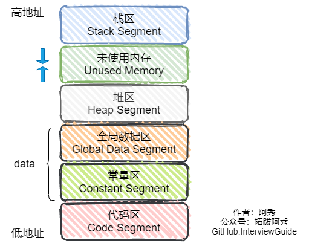

<h1 align="center">C++ - Quản lý bộ nhớ</h1>

<p id="类的对象存储空间"></p>

<div style="border-color: #24C6DC;
            background-color: #e9f9f3;         
            margin: 1rem 0;
        padding: .25rem 1rem;
        border-left-width: .3rem;
        border-left-style: solid;
        border-radius: .5rem;
        color: inherit;">
  <p>Đây là 6 thông tin có thể sẽ hữu ích cho bạn:</p>
<p>⭐️1. A Tú cùng bạn bè hợp tác phát triển một <span style="font-weight:bold;color:red">website tài nguyên lập trình</span>, hiện đã tổng hợp rất nhiều tài liệu học tập chất lượng và công cụ hữu ích (kèm link tải). Nếu bạn đang tìm kiếm tài nguyên lập trình phù hợp, <a href="https://tools.interviewguide.cn/home" style="text-decoration: underline" target="_blank">hoan nghênh trải nghiệm</a> cũng như giới thiệu những tài nguyên bạn thấy hay. Góp gió thành bão, mình vì mọi người, mọi người vì mình🔥!</p>  <p>2. 👉 Tháng 5/2023, trong thời gian <a style="text-decoration: underline" href="https://mp.weixin.qq.com/s?__biz=Mzk0ODU4MzEzMw==&mid=2247512170&idx=1&sn=c4a04a383d2dfdece676b75f17224e78" target="_blank">rời ByteDance để chuyển sang một công ty đa quốc gia</a>, nhằm <span style="font-weight:bold">thuận tiện cho bản thân khi tìm việc và nâng cao tỷ lệ trúng tuyển</span>, A Tú cùng bạn bè đã phát triển từ con số 0 một <span style="font-weight:bold;color:red">website giải đề phỏng vấn thực chiến của các Big Tech</span>, bao gồm hai frontend và một backend. Trang web cho phép tra cứu có định hướng đề thi viết của các công ty Internet, ví dụ như muốn tra cứu đề thi viết của ByteDance trong 1 năm gần đây gồm những gì đều có thể làm được. Hoan nghênh trải nghiệm~
<div align="center">
</div>Địa chỉ website: <a style="text-decoration: underline" href="https://niumacode.com/home?ref=F6O2625K" target="_blank">Website đề thi thuật toán phỏng vấn Big Tech</a>.
    </p>3. 😊
    Chia sẻ một <span style="font-weight:bold;color:red">website công cụ tiện ích</span> mà A Tú tâm đắc sưu tầm, <a style="text-decoration: underline" href="https://hkjtz.cn/" target="_blank">nhấn vào đây để truy cập</a>, chủ yếu là các ứng dụng, website ngách hữu ích, ngoài ra còn có tài nguyên phim ảnh HD, âm nhạc, phim truyền hình, AI, phim tài liệu, tài liệu thi tiếng Anh, thi công chức, cao học, nghề tay trái...
  </p>
  <p>4. 😍 Chia sẻ miễn phí tài nguyên học tập mà A Tú đã tích lũy từ khi theo học máy tính, <a style="text-decoration: underline" href="/notes/07-resources/01-free/01-introduce.html" target="_blank">nhấn vào đây để nhận miễn phí</a>; đồng thời cũng lưu lại nhật ký đánh giá <a style="text-decoration: underline" href="/notes/07-resources/02-precious.html" target="_blank">những cuốn sách máy tính, chuyên mục online chất lượng cũng như những khóa học trả phí kém chất lượng</a> từng mua trước đây.
  </p>
  <p>5. 🚀 Nếu bạn muốn thuận lợi giành được offer tốt hơn trong kỳ tuyển dụng trường học (Campus Recruitment), A Tú khuyên bạn nên xem thêm những <a style="text-decoration: underline" href="https://www.yuque.com/tuobaaxiu/httmmc/npg1k81zeq4wfpyz" target="_blank">cạm bẫy từng vấp phải</a> và <a style="text-decoration: underline"  target="_blank" href="https://www.yuque.com/tuobaaxiu/httmmc/gge9ppd0mbu2d3dp">kinh nghiệm đúc kết</a> của người đi trước. Thực tế, hầu hết các vấn đề bạn đang gặp phải thì các anh chị khóa trước đều đã từng trải qua.
  </p>
  <p>6. 🔥 Hoan nghênh các bạn đang chuẩn bị cho kỳ tuyển dụng trường học ngành CNTT tham gia <a  style="text-decoration: underline" href="https://www.yuque.com/tuobaaxiu/httmmc/xg0otqvc17wfx4u9" target="_blank">Cộng đồng học tập</a> của tôi. Độc hành một mình chi bằng cùng nhau sưởi ấm, trong nhóm đã đọng lại rất nhiều <a  style="text-decoration: underline" href="https://www.yuque.com/tuobaaxiu/httmmc/gge9ppd0mbu2d3dp" target="_blank">kinh nghiệm và tổng kết</a> của các anh chị khóa 21/22/23/24/25. Kiên trì đi theo lộ trình, cuối cùng đa phần đều có thể nhận được offer ưng ý! Nếu bạn cần phiên bản PDF tổng hợp các điểm kiến thức 📚︎ Bát cổ văn phỏng vấn tuyển dụng trường học trên website 《Ghi chép học tập của A Tú》, có thể <a style="text-decoration: underline" href="https://www.yuque.com/tuobaaxiu/httmmc/qs0yn66apvkzw0ps" target="_blank">nhấn vào đây để tải về</a>.</p>   </div>

## 1. Không gian bộ nhớ của một đối tượng Class (Object Memory Layout) bao gồm những gì?

- Tổng kích thước của tất cả các **biến thành viên phi tĩnh (Non-static Member Variables)**.
- Con trỏ bảng hàm ảo (`vptr` - Virtual Table Pointer) nếu lớp chứa ít nhất một hàm ảo `virtual` (4 bytes trên 32-bit, 8 bytes trên 64-bit).
- Con trỏ lớp cơ sở ảo (`vbptr`) nếu sử dụng Kế thừa ảo (Virtual Inheritance).
- Các byte đệm căn chỉnh bộ nhớ (Padding Bytes) do cơ chế Memory Alignment tạo ra.
- *Lưu ý*: Hàm thành viên thông thường, hàm thành viên tĩnh và biến tĩnh `static` **hoàn toàn không chiếm dung lượng bộ nhớ của đối tượng**. Một Class rỗng (Empty Class) có kích thước là **1 byte** để phân biệt địa chỉ.

<p id="简要说明内存分区"></p>

## 2. Các phân vùng bộ nhớ của tiến trình C++ trong RAM



1. **Stack (Ngăn xếp)**: Lưu biến cục bộ, tham số hàm, địa chỉ trả về. Được OS/CPU tự động quản lý, tốc độ cực nhanh, dung lượng nhỏ.
2. **Heap (Vùng nhớ đống)**: Cấp phát động qua `new` / `malloc`, lập trình viên tự giải phóng (`delete` / `free`), phát triển từ địa chỉ thấp lên cao.
3. **Phân đoạn tĩnh / Toàn cục (.data và .bss)**:
   - `.data`: Chứa biến toàn cục và static đã khởi tạo giá trị khác 0.
   - `.bss`: Chứa biến toàn cục và static chưa khởi tạo (tự động điền 0).
4. **Phân đoạn Hằng số (.rodata)**: Chứa hằng số chuỗi ký tự (String Literals), chỉ cho phép đọc.
5. **Phân đoạn Mã máy (.text / Code Segment)**: Chứa toàn bộ mã lệnh nhị phân thực thi của hàm và chương trình.

<p id="什么是内存池如何实现"></p>

## 3. Bể bộ nhớ (Memory Pool) là gì và nguyên lý cài đặt trong STL Allocator?

- **Mục đích**: Cấp phát trước một khối bộ nhớ lớn và chia thành các khối nhỏ kích thước cố định để cung cấp cho ứng dụng, nhằm loại bỏ hoàn toàn phân mảnh bộ nhớ ngoài (External Fragmentation) và giảm thiểu chi phí gọi System Calls ngắt hệ thống.
- **Cơ chế cấp phát Sub-allocator 2 tầng trong SGI STL (Default Allocator)**:
  - *Tầng 1 (First-level Allocator)*: Dùng `malloc()` và `free()` trực tiếp cho các khối nhớ $> 128\text{ bytes}$, xử lý lỗi hết RAM bằng handler kiểu `new-handler`.
  - *Tầng 2 (Second-level Allocator / Memory Pool)*: Quản lý các khối nhớ nhỏ $\le 128\text{ bytes}$ bằng một mảng 16 danh sách liên kết tự do (Free Lists) với kích thước là bội số của 8 bytes: 8, 16, 24, ..., 128 bytes. Khi ứng dụng yêu cầu cấp phát, hệ thống làm tròn lên bội số của 8 và lấy node đầu tiên trong Free List tương ứng.

<p id="可以说一下你了解的内存管理吗"></p>

## 4. Tổng quan về Quản lý bộ nhớ trong C++

Bao gồm phân vùng 5 vùng nhớ chuẩn (Stack, Heap, BSS/Data, Text/Code, Read-only Constant), quản lý vòng đời bộ nhớ thủ công và ứng dụng mô hình RAII kết hợp các con trỏ thông minh hiện đại (`unique_ptr`, `shared_ptr`, `weak_ptr`) để đảm bảo không xảy ra rò rỉ tài nguyên (Memory Leaks).

<p id="数据成员和成员函数内存分布情况"></p>

## 5. Phân bố bộ nhớ của Biến thành viên và Hàm thành viên trong Class

- Các biến thành viên được sắp xếp liên tiếp trong bộ nhớ theo thứ tự khai báo (kèm padding căn chỉnh).
- Toàn bộ hàm thành viên (cả bình thường lẫn tĩnh) đều nằm ở **Phân đoạn Code (.text)** và chỉ tồn tại duy nhất một bản sao mã máy trong suốt vòng đời tiến trình. Khi gọi hàm thành viên phi tĩnh, địa chỉ của Object được truyền ngầm định làm tham số đầu tiên qua con trỏ `this`.

<p id="关于指针你知道什么全说出来"></p>

## 6. Tổng hợp toàn diện về con trỏ this trong C++

- `this` là một con trỏ hằng (`ClassName* const this`) trỏ tới địa chỉ đối tượng hiện tại.
- Chỉ tồn tại bên trong các hàm thành viên phi tĩnh (Non-static Member Functions).
- Không làm tăng kích thước `sizeof(Object)`.
- Thường được truyền qua thanh ghi CPU `ECX` (trên Windows / x86 `__thiscall`) để tối đa hóa tốc độ gọi hàm.

<p id="几个this指针的易混问题"></p>

## 7. Các câu hỏi thường gặp về con trỏ this:

1. **this được tạo khi nào?** Được sinh ra ngầm định tại thời điểm bắt đầu gọi hàm thành viên và giải phóng khi hàm kết thúc.
2. **this lưu ở đâu?** Được truyền qua thanh ghi CPU (`ECX`) hoặc đẩy lên Stack Frame của hàm.
3. **Có thể gọi hàm thành viên qua con trỏ nullptr không?** Có thể, miễn là hàm thành viên đó không truy cập bất kỳ biến thành viên phi tĩnh hoặc hàm ảo nào bên trong (vì không giải mã dereference `this`).

<p id="内存泄漏的后果如何监测解决方法"></p>

## 8. Hậu quả, Cách phát hiện và Giải pháp triệt tiêu Memory Leak

- **Hậu quả**: Chiếm dụng cạn kiệt RAM hệ thống, làm chậm hệ điều hành do phải tráo trang liên tục sang Swap/Pagefile, dẫn đến OOM (Out Of Memory) Crash.
- **Cách phát hiện**: Sử dụng `Valgrind` (Linux) hoặc thư viện CRT `_CrtDumpMemoryLeaks()` (Windows Visual Studio).
- **Giải pháp**: Áp dụng triệt để nguyên lý **RAII** và Smart Pointers (`std::unique_ptr`).

<p id="在成员函数中调用deletethis会出现什么问题对象还可以使用吗"></p>

## 9. Điều gì xảy ra khi gọi delete this trong hàm thành viên?

- Đối tượng bị hủy và vùng nhớ Heap của đối tượng được trả về cho hệ thống.
- Sau lệnh `delete this;`, **tuyệt đối không được truy cập bất kỳ biến thành viên hay gọi hàm ảo nào**, nếu không sẽ dẫn đến Undefined Behavior và Crash.

<p id="为什么是不可预期的问题"></p>

## 10. Tại sao lại xảy ra Undefined Behavior sau delete this?

Vì vùng nhớ đã bị giải phóng có thể vẫn còn nằm trong bộ đệm RAM chưa bị OS thu hồi ngay, việc đọc ghi lúc này có thể lấy phải dữ liệu rác ngẫu nhiên hoặc làm hỏng dữ liệu của một tiến trình/luồng khác vừa được cấp phát vùng nhớ đó.

<p id="如果在类的析构函数中调用deletethis会发生什么"></p>

## 11. Điều gì xảy ra nếu gọi delete this bên trong Destructor?

**Gây lỗi Tràn ngăn xếp (Stack Overflow Crash)**. Vì toán tử `delete` sẽ kích hoạt gọi Destructor, và Destructor lại gọi tiếp `delete this`, dẫn đến vòng lặp đệ quy vô tận làm tràn Stack Frame.

<p id="你知道空类的大小是多少吗"></p>

## 12. Kích thước của một Class rỗng (Empty Class) là bao nhiêu?

Kích thước là **1 byte**. Nhằm đảm bảo hai đối tượng khác nhau của cùng một class rỗng luôn có hai địa chỉ ô nhớ riêng biệt (`&a != &b`). Nếu class rỗng làm lớp cha trong quan hệ kế thừa, trình biên dịch áp dụng cơ chế tối ưu hóa **Empty Base Optimization (EBO)** khiến kích thước đóng góp của lớp cha là **0 byte**.

<p id="请说一下以下几种情况下下面几个类的大小各是多少"></p>

## 13. Tính toán kích thước (sizeof) của các Class sau (Môi trường 64-bit):

```cpp
class A {};                                 // sizeof = 1 (Class rỗng)
class B { virtual void fun() {} };          // sizeof = 8 (Chứa 1 con trỏ vptr)
class C { static int a; };                  // sizeof = 1 (Biến static lưu ở .data/.bss)
class D { int a; };                         // sizeof = 4 (Chứa 1 int)
class E { static int a; int b; };           // sizeof = 4 (Chứa 1 int b)
class F { char a; int b; };                 // sizeof = 8 (Căn chỉnh bộ nhớ 4 bytes: 1 + 3 padding + 4)
```

<p id="this指针调用成员变量时堆栈会发生什么变化"></p>

## 14. Biến đổi của Stack khi con trỏ this gọi biến thành viên

Con trỏ `this` được chuyển vào thanh ghi `ECX` hoặc đẩy vào Stack Frame đầu tiên, tiếp theo là các tham số từ phải sang trái, cuối cùng là Return Address. Khi hàm truy cập biến thành viên, CPU lấy giá trị `this` làm mốc và cộng thêm Offset của biến đó trong bộ nhớ.

<p id="大小受哪些因素"></p>

## 15. Các yếu tố quyết định kích thước bộ nhớ của một Đối tượng Class

1. Kích thước các biến thành viên phi tĩnh.
2. Quy tắc căn chỉnh biên bộ nhớ (Memory Alignment Padding).
3. Sự hiện diện của hàm ảo (Thêm con trỏ `vptr`).
4. Kế thừa ảo (Thêm con trỏ `vbptr`).
5. Kế thừa từ các lớp cha phi rỗng.
