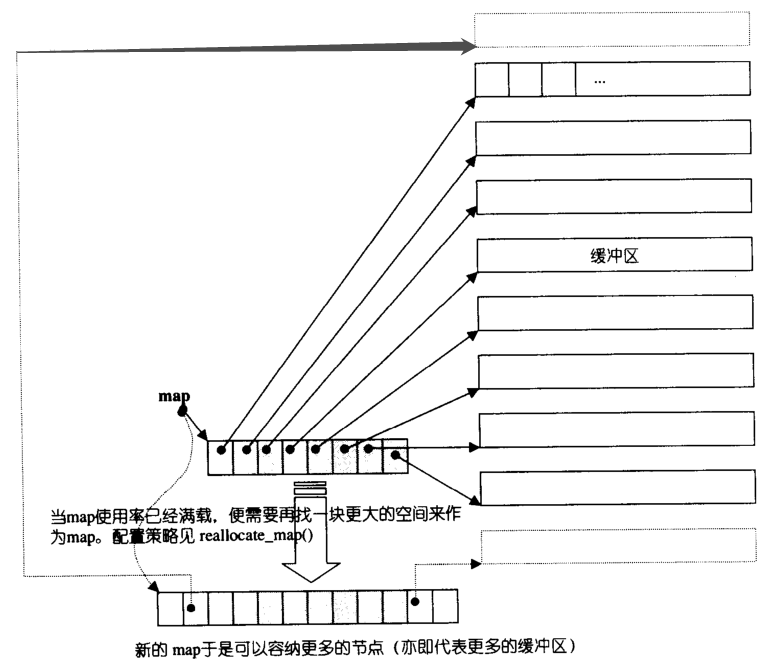
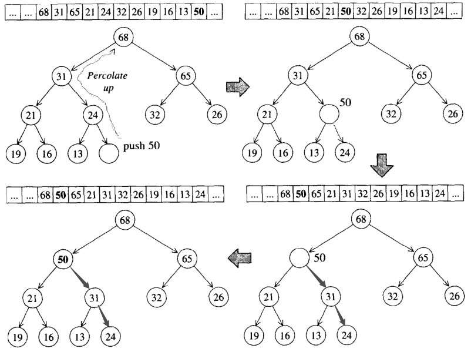
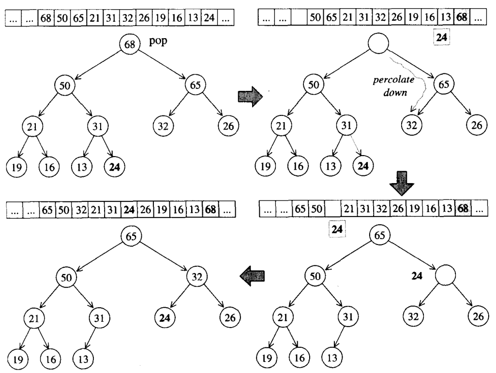

<h1 align="center">C++ - Thư viện mẫu chuẩn STL (Câu 21 - 38)</h1>

  
Đây là 6 thông tin có thể sẽ hữu ích cho bạn:

⭐️1. A Tú cùng bạn bè hợp tác phát triển một website tài nguyên lập trình, hiện đã tổng hợp rất nhiều tài liệu học tập chất lượng và công cụ hữu ích (kèm link tải). Nếu bạn đang tìm kiếm tài nguyên lập trình phù hợp, <a href="https://tools.interviewguide.cn/home" style="text-decoration: underline" target="_blank">hoan nghênh trải nghiệm</a> cũng như giới thiệu những tài nguyên bạn thấy hay. Góp gió thành bão, mình vì mọi người, mọi người vì mình🔥!
  
2. 👉 Tháng 5/2023, trong thời gian <a style="text-decoration: underline" href="https://mp.weixin.qq.com/s?__biz=Mzk0ODU4MzEzMw==&mid=2247512170&idx=1&sn=c4a04a383d2dfdece676b75f17224e78" target="_blank">rời ByteDance để chuyển sang một công ty đa quốc gia</a>, nhằm thuận tiện cho bản thân khi tìm việc và nâng cao tỷ lệ trúng tuyển, A Tú cùng bạn bè đã phát triển từ con số 0 một website giải đề phỏng vấn thực chiến của các Big Tech, bao gồm hai frontend và một backend. Trang web cho phép tra cứu có định hướng đề thi viết của các công ty Internet, ví dụ như muốn tra cứu đề thi viết của ByteDance trong 1 năm gần đây gồm những gì đều có thể làm được. Hoan nghênh trải nghiệm~

Địa chỉ website: <a style="text-decoration: underline" href="https://niumacode.com/home?ref=F6O2625K" target="_blank">Website đề thi thuật toán phỏng vấn Big Tech</a>.
    
3. 😊
    Chia sẻ một website công cụ tiện ích mà A Tú tâm đắc sưu tầm, <a style="text-decoration: underline" href="https://hkjtz.cn/" target="_blank">nhấn vào đây để truy cập</a>, chủ yếu là các ứng dụng, website ngách hữu ích, ngoài ra còn có tài nguyên phim ảnh HD, âm nhạc, phim truyền hình, AI, phim tài liệu, tài liệu thi tiếng Anh, thi công chức, cao học, nghề tay trái...
  

  
4. 😍 Chia sẻ miễn phí tài nguyên học tập mà A Tú đã tích lũy từ khi theo học máy tính, <a style="text-decoration: underline" href="/notes/07-resources/01-free/01-introduce.html" target="_blank">nhấn vào đây để nhận miễn phí</a>; đồng thời cũng lưu lại nhật ký đánh giá <a style="text-decoration: underline" href="/notes/07-resources/02-precious.html" target="_blank">những cuốn sách máy tính, chuyên mục online chất lượng cũng như những khóa học trả phí kém chất lượng</a> từng mua trước đây.
  

  
5. 🚀 Nếu bạn muốn thuận lợi giành được offer tốt hơn trong kỳ tuyển dụng trường học (Campus Recruitment), A Tú khuyên bạn nên xem thêm những <a style="text-decoration: underline" href="https://www.yuque.com/tuobaaxiu/httmmc/npg1k81zeq4wfpyz" target="_blank">cạm bẫy từng vấp phải</a> và <a style="text-decoration: underline"  target="_blank" href="https://www.yuque.com/tuobaaxiu/httmmc/gge9ppd0mbu2d3dp">kinh nghiệm đúc kết</a> của người đi trước. Thực tế, hầu hết các vấn đề bạn đang gặp phải thì các anh chị khóa trước đều đã từng trải qua.
  

  
6. 🔥 Hoan nghênh các bạn đang chuẩn bị cho kỳ tuyển dụng trường học ngành CNTT tham gia <a  style="text-decoration: underline" href="https://www.yuque.com/tuobaaxiu/httmmc/xg0otqvc17wfx4u9" target="_blank">Cộng đồng học tập</a> của tôi. Độc hành một mình chi bằng cùng nhau sưởi ấm, trong nhóm đã đọng lại rất nhiều <a  style="text-decoration: underline" href="https://www.yuque.com/tuobaaxiu/httmmc/gge9ppd0mbu2d3dp" target="_blank">kinh nghiệm và tổng kết</a> của các anh chị khóa 21/22/23/24/25. Kiên trì đi theo lộ trình, cuối cùng đa phần đều có thể nhận được offer ưng ý! Nếu bạn cần phiên bản PDF tổng hợp các điểm kiến thức 📚︎ Bát cổ văn phỏng vấn tuyển dụng trường học trên website 《Ghi chép học tập của A Tú》, có thể <a style="text-decoration: underline" href="https://www.yuque.com/tuobaaxiu/httmmc/qs0yn66apvkzw0ps" target="_blank">nhấn vào đây để tải về</a>.
   

## 21. Cơ chế cấp phát và giải phóng (allocate, deallocate) trong STL Allocator

- `allocate(n)`:
  - Nếu `n > 128 bytes`: Gọi trực tiếp `malloc()` của Tầng 1.
  - Nếu `n <= 128 bytes`: Căn chỉnh $n$ lên bội số của 8 và tìm trong Free List tương ứng của Tầng 2. Nếu Free List trống, gọi hàm `refill()` để xin cấp phát 20 khối nhớ mới từ Memory Pool.
- `deallocate(p, n)`:
  - Nếu `n > 128 bytes`: Gọi trực tiếp `free(p)` của Tầng 1.
  - Nếu `n <= 128 bytes`: Trả khối nhớ về đầu Free List tương ứng để tái sử dụng ngay cho lần sau mà không giải phóng về OS.

## 22. Quá trình Rehash mở rộng bảng khi Hashtable bị quá tải

Khi tỷ lệ tải (Load Factor) vượt ngưỡng cho phép, Hashtable cấp phát một mảng Buckets mới với kích thước là số nguyên tố tiếp theo trong danh sách bảng số nguyên tố chuẩn. Sau đó duyệt tuần tự qua từng Bucket cũ, tính lại Hash Code cho từng node và liên kết lại vào Buckets mới.

## 23. Bảng tổng hợp bản chất cấu trúc dữ liệu của các Container STL

| Container | Cấu trúc dữ liệu nền tảng | Đặc tính chính |
| :--- | :--- | :--- |
| `std::vector` | Mảng động liên tục | Truy cập ngẫu nhiên $O(1)$, chèn/xóa đuôi $O(1)$ |
| `std::list` | Danh sách liên kết đôi | Chèn/xóa bất kỳ $O(1)$, không hỗ trợ random access |
| `std::deque` | Bộ đệm phân đoạn liên tục (Map + Buffers) | Chèn/xóa 2 đầu $O(1)$, truy cập ngẫu nhiên $O(1)$ |
| `std::stack` | Container Adapter (bọc `deque`/`list`) | LIFO (Last-In-First-Out), chỉ thao tác ở đỉnh |
| `std::queue` | Container Adapter (bọc `deque`/`list`) | FIFO (First-In-First-Out), vào đuôi ra đầu |
| `std::priority_queue`| Container Adapter (bọc `vector` + Heap) | Luôn lấy phần tử có độ ưu tiên cao nhất ở đỉnh |
| `std::set` / `std::map` | Cây Đỏ-Đen (Red-Black Tree) | Luôn tự động sắp xếp theo Key, không trùng lặp |
| `std::multiset` / `std::multimap` | Cây Đỏ-Đen | Tự động sắp xếp, cho phép trùng lặp Key |
| `std::unordered_map` / `std::unordered_set` | Bảng băm (HashTable + Chaining) | Không sắp xếp, tra cứu trung bình $O(1)$ |

## 24. Lý do nhân hệ số 1.5 hoặc 2 khi mở rộng vector

- Nếu mở rộng theo kích thước cố định cộng dồn ($+K$), chi phí chèn $N$ phần tử sẽ là $O(N^2)$ (trung bình mỗi thao tác tốn $O(N)$).
- Nếu mở rộng theo cấp số nhân ($1.5\times$ hoặc $2\times$), chi phí trích khấu hao (Amortized Cost) cho mỗi thao tác chèn chỉ là **$O(1)$**.
- Hệ số **1.5 (MSVC)** được đánh giá là tối ưu hơn 2.0 (GCC) vì cho phép tái sử dụng các khối bộ nhớ đã được giải phóng trước đó trong Heap (Memory Locality), tránh hiện tượng các khối nhớ cũ bị bỏ hoang vĩnh viễn.

## 25. Phân loại Iterator cho từng loại Container

| Loại Iterator | Đặc tính | Containers hỗ trợ |
| :--- | :--- | :--- |
| **Random Access Iterator** | Nhảy cóc `it + n`, so sánh `<`, `>` | `vector`, `deque`, `array` |
| **Bidirectional Iterator** | Duyệt tiến `++` và lùi `--` | `list`, `set`, `map`, `multiset`, `multimap` |
| **Forward Iterator** | Chỉ duyệt tiến một chiều `++` | `forward_list`, `unordered_map`, `unordered_set` |
| **Không có Iterator** | Đóng kín cấu trúc (Adapter) | `stack`, `queue`, `priority_queue` |

## 26. Các trường hợp làm vô hiệu hóa Iterator (Iterator Invalidation)

1. **`std::vector` / `std::deque`**:
   - Chèn làm vượt quá capacity $\rightarrow$ Toàn bộ Iterator bị vô hiệu hóa (do dời vùng nhớ).
   - Chèn/Xóa ở giữa $\rightarrow$ Toàn bộ Iterator từ vị trí tác động trở về sau bị vô hiệu hóa.
2. **`std::list` / `std::forward_list`**:
   - Thao tác chèn/xóa chỉ làm vô hiệu hóa duy nhất Iterator của Node bị xóa, toàn bộ Iterator của các Node khác vẫn hoàn toàn hợp lệ.
3. **`std::map` / `std::set` (Red-Black Tree)**:
   - Chỉ vô hiệu hóa Iterator của Node bị xóa, các Node khác không bị ảnh hưởng.

## 27. Hiện thực chi tiết của std::vector trong STL

Vector quản lý tuyến tính bộ nhớ bằng 3 con trỏ:
- `start`: Trỏ tới phần tử đầu tiên đang dùng.
- `finish`: Trỏ tới vị trí ngay sau phần tử cuối cùng đang dùng (`size = finish - start`).
- `end_of_storage`: Trỏ tới giới hạn cuối cùng của khối bộ nhớ đã cấp phát (`capacity = end_of_storage - start`).

## 28. Hiện thực std::forward_list (slist - Single Linked List)

- Cấu trúc danh sách liên kết đơn, mỗi node chỉ tốn 1 con trỏ `next`.
- Tiết kiệm 50% dung lượng con trỏ so với `std::list`.
- Cung cấp các thao tác hướng tương lai: `insert_after()` và `erase_after()`.

## 29. Hiện thực std::list (Doubly-linked Ring List)

- Cài đặt dưới dạng Danh sách liên kết đôi vòng tròn khép kín (Circular Doubly-linked List) kèm một Node canh gác (Dummy Node).
- Giúp thao tác chèn/xóa tại đầu/đuôi/vị trí bất kỳ đạt $O(1)$ mà không cần kiểm tra điều kiện biên con trỏ null.

## 30. Hiện thực std::deque (Double-ended Queue)

- Cấu trúc 2 tầng: Một mảng điều khiển trung tâm (Map Table) chứa các con trỏ trỏ tới các Bộ đệm dữ liệu liên tục (Buffers) kích thước cố định (512 bytes).
- Iterator của deque lưu 4 con trỏ: `cur` (phần tử hiện tại), `first` (đầu buffer), `last` (cuối buffer), `node` (con trỏ trỏ tới slot trong bảng Map). Khi `cur` chạm tới biên `last` hoặc `first`, iterator tự động nhảy sang buffer kế tiếp.
- 

## 31. Hiện thực std::stack và std::queue

Cả hai đều là **Container Adapters**:
- Mặc định bọc lấy `std::deque`.
- `std::stack` đóng kín đầu `front`, chỉ mở đầu `back` để cung cấp `push()`, `pop()`, `top()`.
- `std::queue` mở cả hai đầu, cung cấp `push()` ở đuôi và `pop()`, `front()` ở đầu.

## 32. Hiện thực Heap (Đống) trong STL

- Cài đặt bằng Cây nhị phân hoàn chỉnh (Complete Binary Tree) ánh xạ ngầm định lên mảng tuần tự `std::vector`.
- Quan hệ chỉ số: Node $i$ có con trái tại $2i+1$, con phải tại $2i+2$, cha tại $\lfloor (i-1)/2 \rfloor$.
- **`push_heap` (Percolate Up / Vun đống lên)**: Đưa phần tử vào cuối vector rồi so sánh đổi chỗ ngược lên đỉnh cha.
- **`pop_heap` (Percolate Down / Vun đống xuống)**: Đổi chỗ phần tử gốc ở đỉnh về cuối mảng rồi đẩy phần tử thay thế chìm dần xuống dưới.
- 
- 

## 33. Hiện thực std::priority_queue (Hàng đợi ưu tiên)

Bọc lấy `std::vector` và điều khiển cấu trúc dữ liệu thông qua bộ 4 thuật toán `make_heap`, `push_heap`, `pop_heap`, `sort_heap`. Luôn duy trì phần tử có độ ưu tiên cao nhất tại đỉnh `top()`.

## 34. Hiện thực std::set

Được bọc hoàn toàn trên nền tảng Cây Đỏ-Đen (Red-Black Tree). Key và Value là cùng một giá trị, không cho phép trùng lặp phần tử (`insert_unique`), các phần tử được tự động sắp xếp tăng dần, Iterator của set là `const_iterator` ngăn người dùng sửa đổi trực tiếp dữ liệu (vì sửa đổi giá trị sẽ làm hỏng cấu trúc cây nhị phân tìm kiếm).

## 35. Hiện thực std::map

Lưu trữ cặp `std::pair<const Key, Value>` trên Cây Đỏ-Đen. Key là bất biến (`const`), Value có thể chỉnh sửa tự do. Toán tử `[]` được hiện thực bằng cơ chế: Thử gọi `insert({key, Value()})`, nếu key đã tồn tại sẽ trả về tham chiếu đến value cũ, nếu chưa tồn tại sẽ chèn mới node với value mặc định.

## 36. So sánh set, map, multiset và multimap

- `set` / `map`: Sử dụng phương thức `insert_unique()` của Cây Đỏ-Đen $\rightarrow$ Không cho phép chèn trùng Key.
- `multiset` / `multimap`: Sử dụng phương thức `insert_equal()` của Cây Đỏ-Đen $\rightarrow$ Cho phép chèn nhiều phần tử có cùng Key trùng nhau.

## 37. So sánh kịch bản ứng dụng giữa map và unordered_map

- Dùng **`std::map`**: Khi bài toán yêu cầu dữ liệu phải luôn được duyệt tuần tự theo thứ tự tăng dần/giảm dần, cần tìm kiếm phần tử lân cận (`lower_bound`, `upper_bound`), hoặc khi cần đảm bảo độ trễ ổn định $O(\log N)$ trong trường hợp xấu nhất.
- Dùng **`std::unordered_map`**: Khi bài toán chỉ tập trung tối đa vào tốc độ tra cứu/chèn/xóa điểm đơn lẻ với hiệu năng trung bình cực cao $O(1)$, không quan tâm đến thứ tự dữ liệu.

## 38. 5 Phương pháp giải quyết xung đột băm (Hash Collision)

1. **Kéo chuỗi (Chaining / Open Hashing)**: Mỗi ô trong bảng băm chứa 1 danh sách liên kết lưu tất cả các phần tử có cùng mã băm (STL sử dụng phương pháp này).
2. **Dò tuyến tính (Linear Probing)**: Khi đụng độ, duyệt tuần tự sang các ô liền kề kế tiếp $(+1, +2, \dots)$ cho đến khi tìm thấy ô trống.
3. **Dò bậc hai (Quadratic Probing)**: Thử tìm ô trống với bước nhảy bình phương $(+1^2, +2^2, +3^2, \dots)$.
4. **Băm kép (Double Hashing)**: Dùng hàm băm thứ hai để tính toán bước nhảy khi xảy ra xung đột.
5. **Vùng tràn công cộng (Public Overflow Area)**: Đưa toàn bộ các phần tử bị xung đột vào một mảng phụ riêng biệt.
