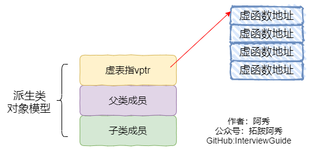
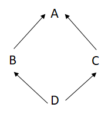
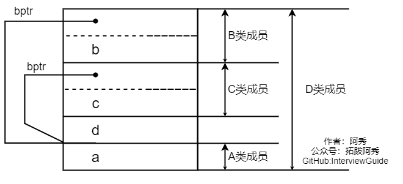

<h1 align="center">C++ - Các vấn đề nâng cao và tổng hợp (Câu 01 - 20)</h1>

<p id="如何实现"></p>

<div style="border-color: #24C6DC;
            background-color: #e9f9f3;         
            margin: 1rem 0;
        padding: .25rem 1rem;
        border-left-width: .3rem;
        border-left-style: solid;
        border-radius: .5rem;
        color: inherit;">
  <p>Đây là 6 thông tin có thể sẽ hữu ích cho bạn:</p>
<p>⭐️1. A Tú cùng bạn bè hợp tác phát triển một <span style="font-weight:bold;color:red">website tài nguyên lập trình</span>, hiện đã tổng hợp rất nhiều tài liệu học tập chất lượng và công cụ hữu ích (kèm link tải). Nếu bạn đang tìm kiếm tài nguyên lập trình phù hợp, <a href="https://tools.interviewguide.cn/home" style="text-decoration: underline" target="_blank">hoan nghênh trải nghiệm</a> cũng như giới thiệu những tài nguyên bạn thấy hay. Góp gió thành bão, mình vì mọi người, mọi người vì mình🔥!</p>  <p>2. 👉 Tháng 5/2023, trong thời gian <a style="text-decoration: underline" href="https://mp.weixin.qq.com/s?__biz=Mzk0ODU4MzEzMw==&mid=2247512170&idx=1&sn=c4a04a383d2dfdece676b75f17224e78" target="_blank">rời ByteDance để chuyển sang một công ty đa quốc gia</a>, nhằm <span style="font-weight:bold">thuận tiện cho bản thân khi tìm việc và nâng cao tỷ lệ trúng tuyển</span>, A Tú cùng bạn bè đã phát triển từ con số 0 một <span style="font-weight:bold;color:red">website giải đề phỏng vấn thực chiến của các Big Tech</span>, bao gồm hai frontend và một backend. Trang web cho phép tra cứu có định hướng đề thi viết của các công ty Internet, ví dụ như muốn tra cứu đề thi viết của ByteDance trong 1 năm gần đây gồm những gì đều có thể làm được. Hoan nghênh trải nghiệm~
<div align="center">
</div>Địa chỉ website: <a style="text-decoration: underline" href="https://niumacode.com/home?ref=F6O2625K" target="_blank">Website đề thi thuật toán phỏng vấn Big Tech</a>.
    </p>3. 😊
    Chia sẻ một <span style="font-weight:bold;color:red">website công cụ tiện ích</span> mà A Tú tâm đắc sưu tầm, <a style="text-decoration: underline" href="https://hkjtz.cn/" target="_blank">nhấn vào đây để truy cập</a>, chủ yếu là các ứng dụng, website ngách hữu ích, ngoài ra còn có tài nguyên phim ảnh HD, âm nhạc, phim truyền hình, AI, phim tài liệu, tài liệu thi tiếng Anh, thi công chức, cao học, nghề tay trái...
  </p>
  <p>4. 😍 Chia sẻ miễn phí tài nguyên học tập mà A Tú đã tích lũy từ khi theo học máy tính, <a style="text-decoration: underline" href="/notes/07-resources/01-free/01-introduce.html" target="_blank">nhấn vào đây để nhận miễn phí</a>; đồng thời cũng lưu lại nhật ký đánh giá <a style="text-decoration: underline" href="/notes/07-resources/02-precious.html" target="_blank">những cuốn sách máy tính, chuyên mục online chất lượng cũng như những khóa học trả phí kém chất lượng</a> từng mua trước đây.
  </p>
  <p>5. 🚀 Nếu bạn muốn thuận lợi giành được offer tốt hơn trong kỳ tuyển dụng trường học (Campus Recruitment), A Tú khuyên bạn nên xem thêm những <a style="text-decoration: underline" href="https://www.yuque.com/tuobaaxiu/httmmc/npg1k81zeq4wfpyz" target="_blank">cạm bẫy từng vấp phải</a> và <a style="text-decoration: underline"  target="_blank" href="https://www.yuque.com/tuobaaxiu/httmmc/gge9ppd0mbu2d3dp">kinh nghiệm đúc kết</a> của người đi trước. Thực tế, hầu hết các vấn đề bạn đang gặp phải thì các anh chị khóa trước đều đã từng trải qua.
  </p>
  <p>6. 🔥 Hoan nghênh các bạn đang chuẩn bị cho kỳ tuyển dụng trường học ngành CNTT tham gia <a  style="text-decoration: underline" href="https://www.yuque.com/tuobaaxiu/httmmc/xg0otqvc17wfx4u9" target="_blank">Cộng đồng học tập</a> của tôi. Độc hành một mình chi bằng cùng nhau sưởi ấm, trong nhóm đã đọng lại rất nhiều <a  style="text-decoration: underline" href="https://www.yuque.com/tuobaaxiu/httmmc/gge9ppd0mbu2d3dp" target="_blank">kinh nghiệm và tổng kết</a> của các anh chị khóa 21/22/23/24/25. Kiên trì đi theo lộ trình, cuối cùng đa phần đều có thể nhận được offer ưng ý! Nếu bạn cần phiên bản PDF tổng hợp các điểm kiến thức 📚︎ Bát cổ văn phỏng vấn tuyển dụng trường học trên website 《Ghi chép học tập của A Tú》, có thể <a style="text-decoration: underline" href="https://www.yuque.com/tuobaaxiu/httmmc/qs0yn66apvkzw0ps" target="_blank">nhấn vào đây để tải về</a>.</p>   </div>

## 1. Cơ chế hiện thực tính Đa hình (Polymorphism) trong C++

- Khi một Class chứa hàm ảo `virtual`, Trình biên dịch tạo ra một **Bảng hàm ảo (`vtable`)** tại phân đoạn chỉ đọc `.rodata`, lưu trữ địa chỉ các hàm ảo của Class đó.
- Mỗi đối tượng của Class được chèn thêm một **Con trỏ bảng hàm ảo (`vptr`)** ở đầu bộ nhớ (4 bytes trên 32-bit, 8 bytes trên 64-bit).
- Khi gọi hàm ảo qua con trỏ hoặc tham chiếu lớp cha (`base->func()`), chương trình thực hiện tra cứu gián tiếp tại Runtime: `*(base->vptr[index])()`, cho phép kích hoạt chính xác hàm ghi đè (Override) của lớp con.
- 

<p id="为什么析构函数一般写成虚函数"></p>

## 2. Tại sao Destructor của lớp cơ sở luôn phải khai báo là virtual?

Nếu lớp cơ sở không khai báo `virtual ~Base()`, khi hủy một đối tượng lớp con thông qua con trỏ lớp cha (`Base* ptr = new Derived(); delete ptr;`), trình biên dịch sẽ áp dụng **Liên kết tĩnh (Static Binding)** và **chỉ gọi Destructor của lớp cha**, bỏ qua hoàn toàn Destructor của lớp con $\rightarrow$ Dẫn đến việc các tài nguyên động được cấp phát trong lớp con không bao giờ được giải phóng, gây **rò rỉ bộ nhớ nghiêm trọng (Memory Leak)**.

<p id="构造函数能否声明为虚函数或者纯虚函数析构函数呢"></p>

## 3. Constructor và Destructor có thể là virtual hoặc pure virtual không?

- **Constructor**: **TUYỆT ĐỐI KHÔNG THỂ LÀ VIRTUAL**. Vì khi đối tượng đang trong quá trình khởi tạo (Constructor đang chạy), con trỏ `vptr` và `vtable` của đối tượng chưa được thiết lập hoàn chỉnh. Hơn nữa Constructor được gọi trực tiếp để định hình đối tượng, không thể có hành vi đa hình động.
- **Destructor**: Có thể là `virtual` (chuẩn mực thiết kế) và **hoàn toàn có thể là Pure Virtual (`virtual ~Base() = 0;`)**. Tuy nhiên, hàm hủy thuần ảo bắt buộc phải có thân hàm định nghĩa rỗng ở ngoài class (`Base::~Base() {}`), vì khi hủy lớp con, C++ luôn tự động gọi ngược lên Destructor của lớp cha.

<p id="基类的虚函数表存放在内存的什么区虚表指针vptr的初始化时间"></p>

## 4. Bảng vtable lưu ở đâu và con trỏ vptr được khởi tạo khi nào?

- **Vị trí lưu trữ**: Bảng hàm ảo `vtable` được tạo tại Compile-time và lưu ở **Phân đoạn chỉ đọc (.rodata)**.
- **Thời điểm khởi tạo `vptr`**: Được nạp ngầm định ở những dòng lệnh mã máy đầu tiên bên trong thân của mỗi **Constructor**. Khi khởi tạo lớp con, Constructor lớp cha gán `vptr` trỏ tới `vtable` lớp cha, sau đó Constructor lớp con gán đè `vptr` trỏ tới `vtable` lớp con.

<p id="模板函数和模板类的特例化"></p>

## 5. Chuyên biệt hóa Mẫu (Template Specialization)

- **Toàn phần (Full Specialization)**: Cung cấp cài đặt cụ thể cho toàn bộ tham số mẫu (`template<> void func(const char* a, const char* b) { ... }`).
- **Một phần (Partial Specialization)**: Chỉ áp dụng cho **Class Template** (không áp dụng cho Function Template), cố định một phần tham số hoặc chuyên biệt hóa cho kiểu con trỏ/tham chiếu (`template<typename T> class MyVector<T*> { ... };`).

<p id="构造函数析构函数虚函数可否声明为内联函数"></p>

## 6. Có thể khai báo inline cho Constructor, Destructor, Virtual Function không?

- Cú pháp hoàn toàn hợp lệ, nhưng trình biên dịch chỉ xem từ khóa `inline` như một lời gợi ý (Hint).
- Trình biên dịch thường **từ chối inline Constructor và Destructor** vì chúng chứa rất nhiều mã chèn ngầm định (khởi tạo vptr, gọi hàm hủy thành viên).
- Đối với hàm ảo `virtual`, chỉ có thể `inline` khi được gọi trực tiếp qua biến đối tượng cụ thể (Non-polymorphic direct call: `obj.virtualFunc()`).

<p id="你知道底层怎么实现的"></p>

## 7. Cơ chế hoạt động của C++ Templates ở tầng dưới

C++ Templates tuân theo cơ chế **Biên dịch hai giai đoạn (Two-phase Compilation)**:
1. *Giai đoạn 1 (Tại định nghĩa mẫu)*: Kiểm tra cú pháp cơ bản của mã template.
2. *Giai đoạn 2 (Tại điểm gọi khởi tạo Instantiation)*: Trình biên dịch thay thế các tham số kiểu cụ thể và sinh ra mã máy assembly thực tế cho từng kiểu dữ liệu. Nếu file `.h` thiếu định nghĩa mà chỉ có khai báo thì Linker sẽ báo lỗi `Unresolved External Symbol`.

<p id="构造函数为什么不能为虚函数析构函数为什么要虚函数"></p>

## 8. Phân tích sâu: Tại sao Constructor không thể là Virtual và Destructor bắt buộc phải là Virtual?

- **Constructor**: Cần biết chính xác kiểu tĩnh để cấp phát đúng kích thước bộ nhớ và khởi tạo bảng `vptr`.
- **Destructor**: Cần cơ chế Đa hình động để khi giải phóng qua con trỏ lớp cơ sở `Base*`, hệ thống sẽ kích hoạt Destructor của lớp con `Derived` trước rồi mới đến lớp cha, thu hồi trọn vẹn tài nguyên.

<p id="析构函数的作用如何起作用"></p>

## 9. Vòng đời và Cơ chế kích hoạt của Destructor

Destructor không nhận tham số, không có kiểu trả về, không thể nạp chồng. Được gọi tự động khi:
1. Biến trên Stack đi ra khỏi phạm vi Scope `{}`.
2. Toán tử `delete` được gọi trên con trỏ Heap.
3. Đối tượng chứa bị hủy (kích hoạt hủy tuần tự các biến thành viên).
4. Tiến trình kết thúc (đối với biến Static và Global).

<p id="构造函数和析构函数可以调用虚函数吗为什么"></p>

## 10. Tại sao KHÔNG NÊN gọi hàm ảo trong Constructor và Destructor?

- Trong thời gian Constructor lớp cha đang chạy, phần lớp con dẫn xuất **chưa được khởi tạo**. Do đó C++ vô hiệu hóa Đa hình động, lời gọi hàm ảo chỉ thực thi phiên bản của lớp cha hiện tại.
- Trong Destructor lớp cha, phần lớp con **đã bị hủy xong**. Nếu gọi hàm ảo của lớp con sẽ dẫn đến Undefined Behavior và Crash.
- *Nguyên tắc Effective C++*: **"Tuyệt đối không bao giờ gọi hàm ảo trong Constructor và Destructor"**.

<p id="构造函数析构函数的执行顺序构造函数和拷贝构造的内部都干了啥"></p>

## 11. Thứ tự thực thi Constructor và Destructor trong Phả hệ Kế thừa

- **Thứ tự gọi Constructor**:
  1. Lớp cơ sở ảo (Virtual Base Classes) theo thứ tự khai báo.
  2. Lớp cơ sở thông thường (Base Classes) từ trái qua phải.
  3. Các biến thành viên đối tượng (Member Objects) theo thứ tự khai báo trong Class.
  4. Thân hàm Constructor của chính lớp con dẫn xuất.
- **Thứ tự gọi Destructor**: Ngược lại hoàn toàn 100% so với thứ tự Constructor.

<p id="虚析构函数的作用父类的析构函数是否要设置为虚函数"></p>

## 12. Pure Virtual Destructor (Hàm hủy thuần ảo)

```cpp
class AbstractBase {
public:
    virtual ~AbstractBase() = 0; // Pure Virtual Destructor
};
AbstractBase::~AbstractBase() {} // Bắt buộc phải có định nghĩa thân hàm ngoài class
```

<p id="构造函数析构函数可否抛出异常"></p>

## 13. Có nên ném Ngoại lệ (Exceptions) trong Constructor và Destructor không?

- **Trong Constructor**: Có thể ném ngoại lệ (để báo hiệu việc khởi tạo thất bại). Nhưng lưu ý: Đối tượng chưa khởi tạo xong sẽ không kích hoạt Destructor, do đó mọi tài nguyên cấp phát trước điểm ném phải được quản lý bằng con trỏ thông minh (RAII).
- **Trong Destructor**: **TUYỆT ĐỐI KHÔNG NÉM NGOẠI LỆ RA NGOÀI**. Nếu ném ngoại lệ trong quá trình Call Stack Unwinding (khi đang xử lý một ngoại lệ khác), chương trình sẽ ngay lập tức bị ép dừng khẩn cấp bằng `std::terminate()`.

<p id="构造函数一般不定义为虚函数的原因"></p>

## 14. 4 Lý do Constructor không thể là Virtual

1. Kích thước và kiểu đối tượng cần được xác định tĩnh tại thời điểm cấp phát.
2. Con trỏ `vptr` chưa được thiết lập trước khi Constructor chạy.
3. Constructor không bao giờ được gọi gián tiếp qua con trỏ lớp cha.
4. Triết lý hướng đối tượng: Constructor là hành vi tạo mới thực thể, không phải hành vi gửi thông điệp đa hình.

<p id="类什么时候会析构"></p>

## 15. Các trường hợp kích hoạt Destructor của một Đối tượng

1. Biến cục bộ rời khỏi Scope.
2. Gọi `delete` trên con trỏ Heap.
3. Đối tượng chứa bị hủy.
4. Đối tượng nằm trong một Container STL bị xóa phần tử (`erase`, `clear`, `pop_back`).
5. Thoát chương trình đối với biến tĩnh `static` và biến toàn cục.

<p in="构造函数或者析构函数中可以调用"></p>

## 16. Bản chất việc gọi Virtual Function trong Constructor

C++ không hỗ trợ đa hình động bên trong Constructor. Mọi lời gọi hàm ảo lúc này đều là liên kết tĩnh (Static Binding) tới hàm của chính lớp đang được khởi tạo.

<p id="构造函数的几种关键字"></p>

## 17. Các từ khóa hiện đại dành cho Constructor trong C++11

- **`= default;`**: Yêu cầu trình biên dịch tự động sinh ra phiên bản mặc định chuẩn tối ưu.
- **`= delete;`**: Vô hiệu hóa và cấm hoàn toàn lời gọi đến hàm/constructor đó (báo lỗi compile-time rõ ràng).
- **`explicit`**: Ngăn chặn ép kiểu ngầm định khi truyền 1 tham số.

<p id="赋值操作符的区别"></p>

## 18. Phân biệt Constructor, Copy Constructor và Copy Assignment Operator

```cpp
A a1;        // Gọi Default Constructor (tạo mới)
A a2 = a1;   // Gọi Copy Constructor (tạo mới đối tượng a2 từ a1)
A a3;
a3 = a1;     // Gọi Copy Assignment Operator (gán đè dữ liệu lên đối tượng a3 đã tồn tại)
```

<p id="拷贝构造函数和赋值运算符重载的区别"></p>

## 19. So sánh Copy Constructor và Copy Assignment Operator

- Copy Constructor khởi tạo một vùng nhớ mới tinh chưa có dữ liệu $\rightarrow$ Không cần kiểm tra tự gán (`this == &other`) và không cần giải phóng vùng nhớ cũ.
- Copy Assignment Operator thực thi trên vùng nhớ đã có dữ liệu $\rightarrow$ Bắt buộc phải **kiểm tra tự gán** (`if (this == &rhs) return *this;`) và **giải phóng bộ nhớ cũ** trước khi cấp phát bộ nhớ mới.

<p id="什么是虚拟继承"></p>

## 20. Kế thừa ảo (Virtual Inheritance) giải quyết vấn đề Kế thừa Kim Cương (Diamond Problem)

- **Vấn đề**: Trong mô hình kế thừa hình thoi (B và C cùng kế thừa A, D kế thừa cả B và C), đối tượng D sẽ chứa **2 bản sao độc lập của lớp cơ sở A**, gây lãng phí bộ nhớ và lỗi xung đột tên hàm mơ hồ (Ambiguity Error).
- **Giải pháp**: Cho B và C kế thừa ảo từ A (`class B : virtual public A`).
- **Cơ chế**: Lớp con D chỉ chứa duy nhất **1 bản sao duy nhất của lớp A**, truy cập thông qua **Con trỏ lớp cơ sở ảo (`vbptr`)** trỏ vào bảng offset `vbtable`.
- 
- 
