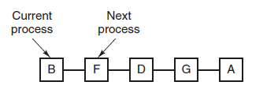
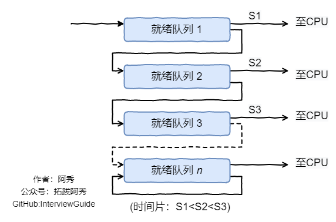
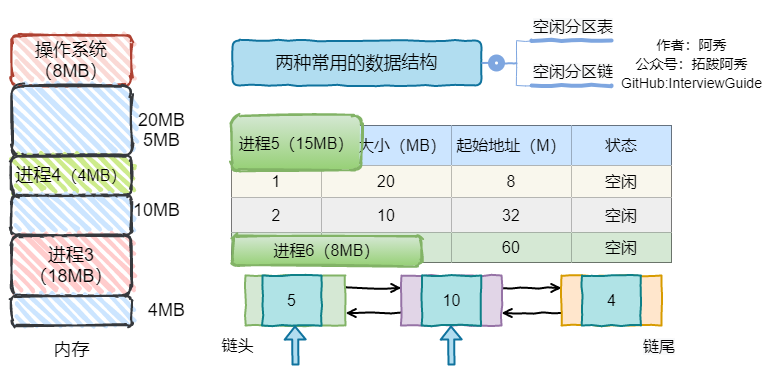
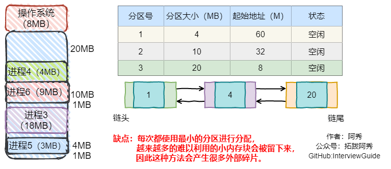
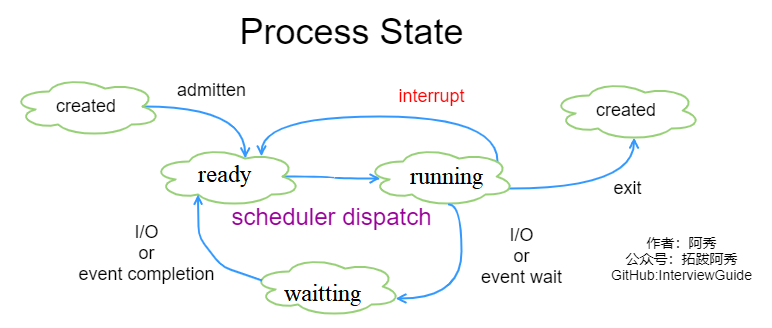
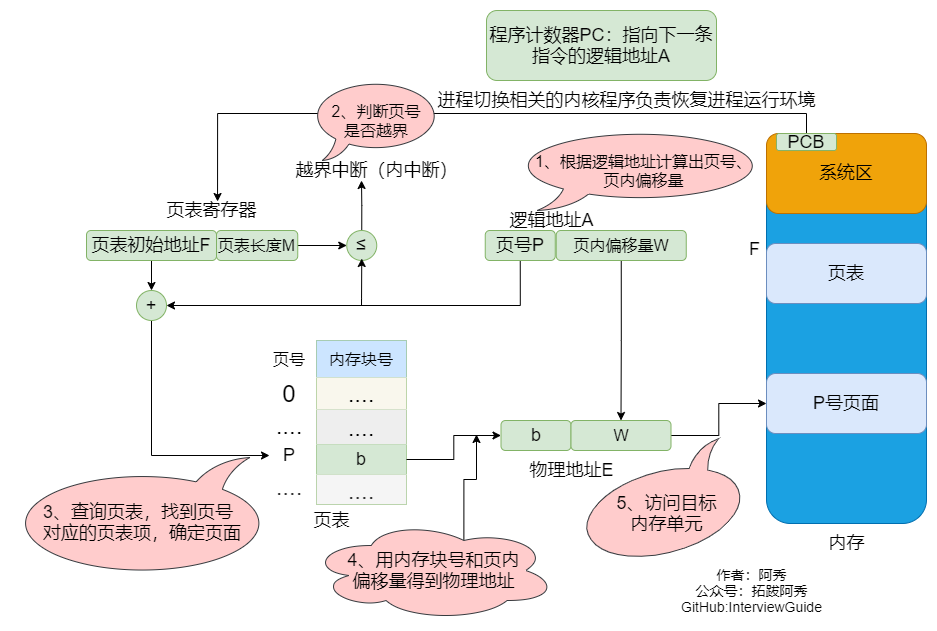
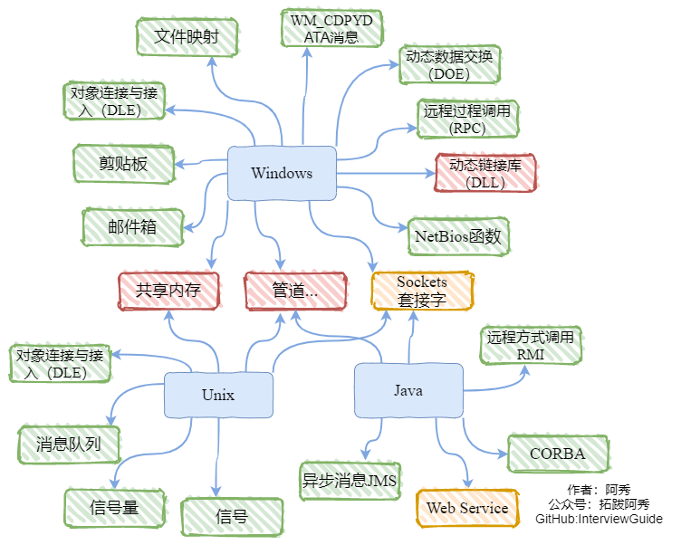
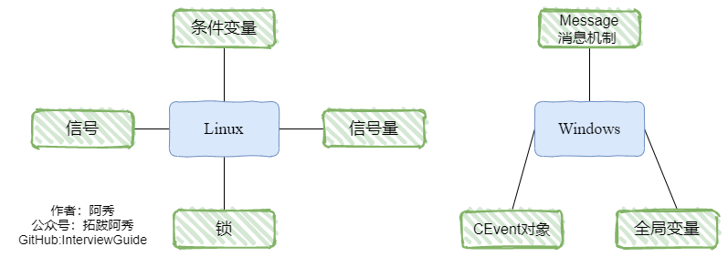
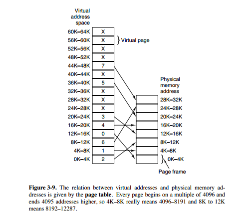

<h1 align="center">Hệ điều hành (Câu 01 - 20)</h1>

  
Đây là 6 thông tin có thể sẽ hữu ích cho bạn:

⭐️1. A Tú cùng bạn bè hợp tác phát triển một website tài nguyên lập trình, hiện đã tổng hợp rất nhiều tài liệu học tập chất lượng và công cụ hữu ích (kèm link tải). Nếu bạn đang tìm kiếm tài nguyên lập trình phù hợp, <a href="https://tools.interviewguide.cn/home" style="text-decoration: underline" target="_blank">hoan nghênh trải nghiệm</a> cũng như giới thiệu những tài nguyên bạn thấy hay. Góp gió thành bão, mình vì mọi người, mọi người vì mình🔥!
  
2. 👉 Tháng 5/2023, trong thời gian <a style="text-decoration: underline" href="https://mp.weixin.qq.com/s?__biz=Mzk0ODU4MzEzMw==&mid=2247512170&idx=1&sn=c4a04a383d2dfdece676b75f17224e78" target="_blank">rời ByteDance để chuyển sang một công ty đa quốc gia</a>, nhằm thuận tiện cho bản thân khi tìm việc và nâng cao tỷ lệ trúng tuyển, A Tú cùng bạn bè đã phát triển từ con số 0 một website giải đề phỏng vấn thực chiến của các Big Tech, bao gồm hai frontend và một backend. Trang web cho phép tra cứu có định hướng đề thi viết của các công ty Internet, ví dụ như muốn tra cứu đề thi viết của ByteDance trong 1 năm gần đây gồm những gì đều có thể làm được. Hoan nghênh trải nghiệm~

Địa chỉ website: <a style="text-decoration: underline" href="https://niumacode.com/home?ref=F6O2625K" target="_blank">Website đề thi thuật toán phỏng vấn Big Tech</a>.
    
3. 😊
    Chia sẻ một website công cụ tiện ích mà A Tú tâm đắc sưu tầm, <a style="text-decoration: underline" href="https://hkjtz.cn/" target="_blank">nhấn vào đây để truy cập</a>, chủ yếu là các ứng dụng, website ngách hữu ích, ngoài ra còn có tài nguyên phim ảnh HD, âm nhạc, phim truyền hình, AI, phim tài liệu, tài liệu thi tiếng Anh, thi công chức, cao học, nghề tay trái...
  

  
4. 😍 Chia sẻ miễn phí tài nguyên học tập mà A Tú đã tích lũy từ khi theo học máy tính, <a style="text-decoration: underline" href="/notes/07-resources/01-free/01-introduce.html" target="_blank">nhấn vào đây để nhận miễn phí</a>; đồng thời cũng lưu lại nhật ký đánh giá <a style="text-decoration: underline" href="/notes/07-resources/02-precious.html" target="_blank">những cuốn sách máy tính, chuyên mục online chất lượng cũng như những khóa học trả phí kém chất lượng</a> từng mua trước đây.
  

  
5. 🚀 Nếu bạn muốn thuận lợi giành được offer tốt hơn trong kỳ tuyển dụng trường học (Campus Recruitment), A Tú khuyên bạn nên xem thêm những <a style="text-decoration: underline" href="https://www.yuque.com/tuobaaxiu/httmmc/npg1k81zeq4wfpyz" target="_blank">cạm bẫy từng vấp phải</a> và <a style="text-decoration: underline"  target="_blank" href="https://www.yuque.com/tuobaaxiu/httmmc/gge9ppd0mbu2d3dp">kinh nghiệm đúc kết</a> của người đi trước. Thực tế, hầu hết các vấn đề bạn đang gặp phải thì các anh chị khóa trước đều đã từng trải qua.
  

  
6. 🔥 Hoan nghênh các bạn đang chuẩn bị cho kỳ tuyển dụng trường học ngành CNTT tham gia <a  style="text-decoration: underline" href="https://www.yuque.com/tuobaaxiu/httmmc/xg0otqvc17wfx4u9" target="_blank">Cộng đồng học tập</a> của tôi. Độc hành một mình chi bằng cùng nhau sưởi ấm, trong nhóm đã đọng lại rất nhiều <a  style="text-decoration: underline" href="https://www.yuque.com/tuobaaxiu/httmmc/gge9ppd0mbu2d3dp" target="_blank">kinh nghiệm và tổng kết</a> của các anh chị khóa 21/22/23/24/25. Kiên trì đi theo lộ trình, cuối cùng đa phần đều có thể nhận được offer ưng ý! Nếu bạn cần phiên bản PDF tổng hợp các điểm kiến thức 📚︎ Bát cổ văn phỏng vấn tuyển dụng trường học trên website 《Ghi chép học tập của A Tú》, có thể <a style="text-decoration: underline" href="https://www.yuque.com/tuobaaxiu/httmmc/qs0yn66apvkzw0ps" target="_blank">nhấn vào đây để tải về</a>.
   

## 1. So sánh chi tiết giữa Tiến trình (Process), Luồng (Thread) và Coroutine

| Tiêu chí | Tiến trình (Process) | Luồng (Thread) | Coroutine (Hàm đồng quy) |
| :--- | :--- | :--- | :--- |
| **Định nghĩa** | Đơn vị cơ bản của phân bổ và sở hữu tài nguyên | Đơn vị cơ bản của lập lịch và thực thi CPU | Luồng siêu nhẹ ở User Space, đơn vị lập lịch nội bộ luồng |
| **Thực thể điều khiển**| Hệ điều hành (Kernel Space) | Hệ điều hành (Kernel Space) | Ứng dụng người dùng (User Runtime) |
| **Quá trình chuyển đổi ngữ cảnh** | User Mode $\rightarrow$ Kernel Mode $\rightarrow$ User Mode | User Mode $\rightarrow$ Kernel Mode $\rightarrow$ User Mode | Hoàn toàn ở User Mode (không bẫy Trap vào Kernel) |
| **Không gian Call Stack** | Ngăn xếp nhân Kernel Stack | Ngăn xếp nhân Kernel Stack | Ngăn xếp người dùng User Stack |
| **Tài nguyên sở hữu** | Không gian địa chỉ ảo, File Descriptors, Socket, Heap | PC (Bộ đếm chương trình), SP (Đỉnh Stack), Registers, Stack Frame riêng | Thanh ghi CPU cục bộ và Stack riêng |
| **Chi phí chuyển cảnh (Context Switch)**| Rất lớn (Đổi Page Table, Flush TLB, mất CPU L1/L2 Cache) | Nhỏ (Chỉ lưu và nạp lại một số thanh ghi CPU) | **Cực kỳ nhỏ** (Chỉ đổi ngữ cảnh con trỏ hàm ở User-space, không lock) |
| **Cơ chế giao tiếp** | IPC qua Kernel (Pipe, Socket, Shared Memory) | Truy cập trực tiếp bộ nhớ chung của Process (Data/Heap) | Channel, Shared Memory |

## 2. Phân biệt sâu giữa Process và Thread

- **Tiến trình**: Đơn vị độc lập sở hữu tài nguyên (Địa chỉ ảo 4GB/128TB, Task Struct, File Table). Sự cố Crash ở một tiến trình không làm ảnh hưởng trực tiếp tới tiến trình khác.
- **Luồng**: Thực thi bên trong không gian của một tiến trình, chia sẻ chung Heap, Data, Code, File Descriptors nhưng sở hữu riêng biệt **Stack Frame, Thanh ghi và Bộ đếm chương trình PC**. Nếu một luồng gặp lỗi bộ nhớ (Segmentation Fault), toàn bộ tiến trình sẽ bị Crash theo.

## 3. Một Tiến trình có thể tạo tối đa bao nhiêu Luồng?

Phụ thuộc vào kích thước Không gian địa chỉ ảo (Virtual Memory) và Dung lượng Stack cấp phát cho mỗi Thread (`ulimit -s`):
- **Hệ điều hành 32-bit**: User Space chỉ có 3GB. Nếu mỗi Thread dùng 10MB Stack, số luồng tối đa lý thuyết là $\approx 300$ threads.
- **Hệ điều hành 64-bit**: User Space lên tới 128TB, số luồng không bị nghẽn bởi bộ nhớ ảo mà phụ thuộc vào giới hạn Kernel (`/proc/sys/kernel/threads-max`, `/proc/sys/vm/max_map_count`) và lượng RAM vật lý thực tế.

## 4. Phân biệt Ngắt ngoài (Hardware Interrupt) và Ngoại lệ nội bộ (Exception / Trap)

- **Ngắt ngoài (External / Asynchronous Interrupt)**: Do phần cứng bên ngoài CPU tạo ra bất đồng bộ với dòng lệnh (Ngắt bàn phím, Ngắt hoàn tất I/O đĩa, Ngắt Timer đồng hồ hệ thống).
- **Ngoại lệ (Exception / Synchronous Trap / Fault)**: Do chính CPU phát hiện đồng bộ khi đang thực thi lệnh sai trái (Lỗi chia cho 0, Lỗi địa chỉ không hợp lệ Page Fault, Lỗi phân đoạn Segmentation Fault, Lệnh ngắt phần mềm System Call `syscall` / `int 0x80`).

## 5. Mô hình Lập trình Đa tiến trình và Đa luồng trong Linux

- **Đa luồng (`pthread`)**:
  - `pthread_create()`: Tạo luồng mới.
  - `pthread_join()`: Luồng cha chờ luồng con kết thúc và thu hồi Stack.
  - `pthread_detach()`: Tách luồng con độc lập, tự động dọn dẹp khi kết thúc.
  - Chú ý: Phép toán `i++` không phải là Atomic $\rightarrow$ Cần dùng Mutex (`pthread_mutex_t`) hoặc `std::atomic` để tránh Race Condition.
- **Đa tiến trình**:
  - `fork()`: Nhân bản tiến trình cha thành tiến trình con bằng cơ chế **Copy-On-Write (COW)**.
  - `execve()`: Nạp tệp nhị phân mới đè lên không gian tiến trình hiện tại.
  - `exit()` vs `_exit()`: `exit()` thực hiện xả bộ đệm I/O Streams (`fflush`) và kích hoạt các hàm `atexit()` trước khi gọi System Call `_exit()`.

## 6. Các thuật toán lập lịch CPU kinh điển (CPU Scheduling Algorithms)

1. **FCFS (First-Come, First-Served)**: Đến trước phục vụ trước, không chiếm dụng (Non-preemptive), bất lợi cho tiến trình ngắn (Convoy Effect).
2. **SJF (Shortest Job First)**: Ưu tiên tiến trình có thời gian chạy ngắn nhất, có nguy cơ gây đói tài nguyên (Starvation) cho tiến trình dài.
3. **SRTN (Shortest Remaining Time Next)**: Phiên bản chiếm dụng (Preemptive) của SJF.
4. **RR (Round Robin - Luân chuyển thời gian)**: Cấp phát mỗi tiến trình một Time Slice (10-100ms). Hết giờ thì ngắt Timer đẩy về cuối hàng đợi Ready Queue.
5. **Priority Scheduling**: Lập lịch theo mức độ ưu tiên (tăng dần ưu tiên theo thời gian chờ - Aging để chống Starvation).
6. **Multi-Level Feedback Queue (Hàng đợi phản hồi nhiều mức - MLFQ)**: Kết hợp linh hoạt giữa RR và Priority. Tiến trình tiêu thụ nhiều CPU bị hạ dần xuống hàng đợi ưu tiên thấp với Time Slice dài hơn; tiến trình tương tác I/O được ưu tiên ở hàng đợi cao nhất.
- 
- 

## 7. 6 Cơ chế giao tiếp liên tiến trình (IPC) trong Linux

1. **Anonymous Pipe (Đường ống vô danh)**: Giao tiếp nửa song công (Half-duplex), dữ liệu byte stream, chỉ áp dụng cho tiến trình có quan hệ cha-con.
2. **Named Pipe (FIFO - Đường ống có tên)**: Tồn tại dưới dạng file đặc biệt trên File System, cho phép 2 tiến trình bất kỳ giao tiếp.
3. **Shared Memory (Bộ nhớ dùng chung - `shmget`/`mmap`)**: **Là cơ chế IPC nhanh nhất** vì dữ liệu được đọc ghi trực tiếp trong RAM không qua System Call trung gian (cần Semaphore đồng bộ).
4. **Message Queue (Hàng đợi thông điệp)**: Danh sách liên kết các message có cấu trúc trong Kernel.
5. **Signal (Tín hiệu - `kill`, `SIGINT`, `SIGTERM`)**: Thông báo sự kiện bất đồng bộ.
6. **Socket**: Hỗ trợ giao tiếp giữa các tiến trình trên các máy tính khác nhau qua mạng hoặc cục bộ (Unix Domain Socket).

## 8. Các cơ chế đồng bộ trong Linux (Synchronization Primitives)

- **POSIX Semaphore (`sem_t`)**: Dùng cho cả đồng bộ tiến trình và luồng.
- **POSIX Mutex (`pthread_mutex_t`) + Condition Variable (`pthread_cond_t`)**: Chuyên dùng cho đồng bộ giữa các luồng.

## 9. Quy trình dịch địa chỉ ảo sang vật lý với bảng TLB (Translation Lookaside Buffer)

1. CPU phát ra Địa chỉ ảo (Virtual Address), tách thành **Số hiệu trang (Virtual Page Number - VPN)** và **Độ dời trong trang (Offset)**.
2. Tra cứu phần cứng trong TLB (Bộ nhớ đệm siêu tốc):
   - **TLB Hit (Trúng)**: Lấy trực tiếp Số hiệu khung trang vật lý (Physical Frame Number - PFN), ghép với Offset thành Địa chỉ vật lý $\rightarrow$ Chỉ tốn **1 lần truy cập bộ nhớ**.
   - **TLB Miss (Trượt)**: Truy cập Page Table trong RAM (tốn thêm 1-4 chu kỳ truy cập RAM tùy phân cấp phân trang), lấy PFN nạp vào TLB và ghép với Offset $\rightarrow$ Tốn **2 lần truy cập bộ nhớ**.

## 10. Phân biệt Kỹ thuật tráo đổi (Swapping) và Phủ lấp (Overlay)

- **Swapping**: Đẩy toàn bộ không gian địa chỉ của một tiến trình không hoạt động từ RAM ra đĩa cứng (Swap Area) và nạp lại khi cần. Diễn ra giữa **nhiều tiến trình khác nhau** do OS quản lý.
- **Overlay**: Phân chia một chương trình lớn thành các module độc lập nạp chồng lên cùng một vùng nhớ khi thực thi. Diễn ra trong **nội bộ một chương trình duy nhất** do lập trình viên thiết kế.

## 11. 4 Thuật toán cấp phát phân vùng bộ nhớ động (Dynamic Partition Allocation)

1. **First Fit (Khớp đầu tiên)**: Quét danh sách ô trống từ đầu, chọn ô đầu tiên đủ lớn $\rightarrow$ *Tốc độ nhanh nhất, hiệu quả tổng thể tốt nhất*.
2. **Best Fit (Khớp tốt nhất)**: Sắp xếp danh sách theo dung lượng tăng dần, chọn ô trống nhỏ nhất vừa đủ kích thước $\rightarrow$ *Sinh ra vô số mảnh vụn bộ nhớ siêu nhỏ khó tái sử dụng*.
3. **Worst Fit (Khớp xấu nhất)**: Sắp xếp theo dung lượng giảm dần, luôn chọn ô trống lớn nhất $\rightarrow$ *Làm triệt tiêu nhanh chóng các vùng nhớ lớn cho tiến trình nặng*.
4. **Next Fit (Khớp kế tiếp)**: Bắt đầu tìm kiếm từ vị trí vừa cấp phát của lần trước.
- 
- 

## 12. Công nghệ ảo hóa tài nguyên trong Hệ điều hành

- **Time-division Multiplexing (Đa phần thời gian)**: Chia nhỏ thời gian CPU thành các Time Slice để nhiều tiến trình chạy song song luân phiên.
- **Space-division Multiplexing (Đa phần không gian)**: Trừu tượng hóa RAM vật lý thành Bộ nhớ ảo (Virtual Memory Space) riêng biệt cho từng tiến trình.

## 13. Sơ đồ chuyển đổi 3 trạng thái cơ bản của Tiến trình

- **Ready (Sẵn sàng)**: Đã có đủ mọi tài nguyên, chỉ chờ CPU cấp Time Slice để chạy.
- **Running (Đang chạy)**: Đang chiếm CPU thực thi mã lệnh.
- **Blocked / Waiting (Bị chặn/Chờ)**: Đang chờ sự kiện I/O, khóa Mutex hoặc tín hiệu mạng (không được CPU cấp phát thời gian).

## 14. 4 Bước biến đổi mã nguồn C/C++ thành Tệp thực thi

1. Preprocessing (`.c` $\rightarrow$ `.i`): Xử lý `#include`, `#define`, xóa comment.
2. Compilation (`.i` $\rightarrow$ `.s`): Phân tích cú pháp, tối ưu hóa $\rightarrow$ Mã hợp ngữ Assembly.
3. Assembly (`.s` $\rightarrow$ `.o`): Biên dịch thành mã máy nhị phân Relocatable Object.
4. Linking (`.o` $\rightarrow$ Binary): Ghép nối thư viện và phân giải địa chỉ con trỏ hàm.

## 15. Ví dụ chi tiết chuyển đổi Địa chỉ Logic sang Địa chỉ Vật lý

- Giả sử kích thước trang $L = 1\text{ KB} = 1024\text{ Bytes}$ ($10\text{ bits}$ Offset).
- Địa chỉ logic $A = 2500$:
  - Số hiệu trang: $P = 2500 / 1024 = 2$.
  - Offset trong trang: $W = 2500 \pmod{1024} = 452$.
- Tra bảng phân trang thấy Trang 2 nằm tại Khung nhớ vật lý $b = 8$.
- Địa chỉ vật lý: $E = b \times L + W = 8 \times 1024 + 452 = 8644$.
- 

## 16. 4 Phương pháp đồng bộ tiến trình và Bài toán Producer-Consumer

1. **Critical Section (Vùng tranh chấp)**: Đoạn mã truy cập tài nguyên dùng chung, bắt buộc phải bảo vệ bằng cơ chế loại trừ tương hỗ (Mutual Exclusion).
2. **Mutex & Semaphore**:
   - Thao tác $P$ (`down` / `wait`): Giảm semaphore đi 1; nếu giá trị $< 0$ thì luồng rơi vào trạng thái ngủ.
   - Thao tác $V$ (`up` / `signal`): Tăng semaphore lên 1; đánh thức luồng đang chờ.
3. **Monitor (Quản trị viên / Khối đồng bộ cao cấp)**: Đóng gói tài nguyên và các hàm thao tác bên trong cấu trúc an toàn luồng, sử dụng Condition Variable (`wait`, `signal`).

## 17. 4 Trách nhiệm chính của Hệ điều hành trong Quản lý Bộ nhớ

1. **Cấp phát và Thu hồi**: Quản lý Bitmap hoặc Free Lists phân bổ RAM cho các tiến trình.
2. **Mở rộng logic (Virtual Memory)**: Ứng dụng Paging và Swapping mở rộng dung lượng vượt mức RAM vật lý.
3. **Dịch địa chỉ (Address Translation)**: Chuyển đổi địa chỉ ảo sang vật lý qua MMU và Page Tables.
4. **Bảo vệ bộ nhớ (Memory Protection)**: Ngăn chặn tiến trình này ghi đè vào không gian bộ nhớ của tiến trình khác hoặc Kernel.

## 18. Bảng tổng hợp các cơ chế giao tiếp Tiến trình và Luồng trên Linux & Windows

- **Tiến trình (IPC)**: Pipe, Named Pipe (FIFO), Message Queue, Shared Memory, Semaphore, Signal, Memory-mapped Files (`mmap`), Socket.
- **Luồng**: Biến toàn cục (kèm `volatile` và Mutex), Condition Variables, CEvent / Event Objects, PostThreadMessage API.

## 19. Chi tiết các hàm API IPC trong Linux

- **Pipe**: `int pipe(int fd[2]);` (đọc `fd[0]`, ghi `fd[1]`).
- **FIFO**: `int mkfifo(const char *pathname, mode_t mode);`.
- **Shared Memory**: `shmget()` $\rightarrow$ `shmat()` $\rightarrow$ `shmdt()` $\rightarrow$ `shmctl()`.
- **System V Semaphore**: `semget()`, `semop()`, `semctl()`.
- **Lệnh chẩn đoán hệ thống**: `ipcs -a` (kiểm tra IPC), `ipcrm` (xóa tài nguyên IPC bị rò rỉ).

## 20. Mục đích và Ý nghĩa của Bộ nhớ ảo (Virtual Memory)

1. **Phá vỡ giới hạn RAM vật lý**: Cho phép tiến trình có dung lượng lớn hơn nhiều lần RAM thực tế có thể chạy trơn tru nhờ cơ chế nạp trang theo yêu cầu (Demand Paging).
2. **Cô lập và bảo vệ an toàn**: Mỗi tiến trình sở hữu một không gian địa chỉ độc lập từ $0 \sim 2^{64}-1$, không thể truy cập trái phép bộ nhớ của nhau.
3. **Đơn giản hóa mô hình bộ nhớ**: Trình biên dịch và Linker chỉ cần gán địa chỉ ảo cố định mà không cần bận tâm tiến trình sẽ được nạp vào ô nhớ vật lý nào trong RAM.
- 
