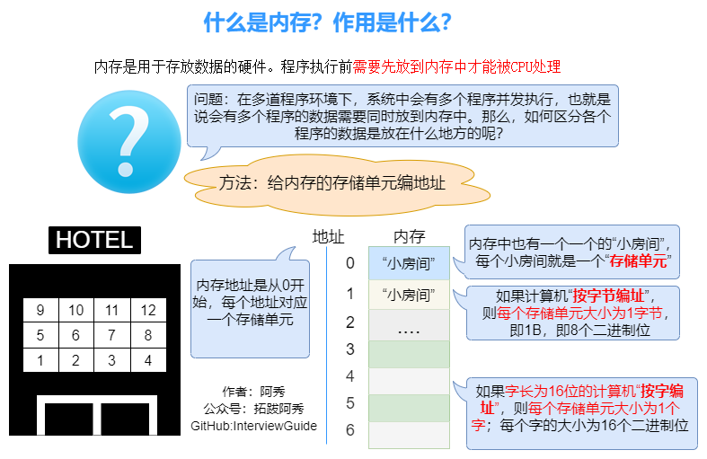
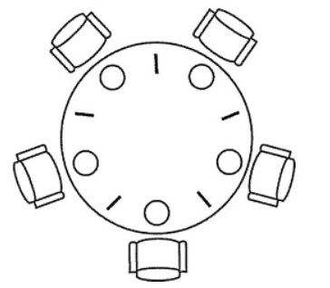
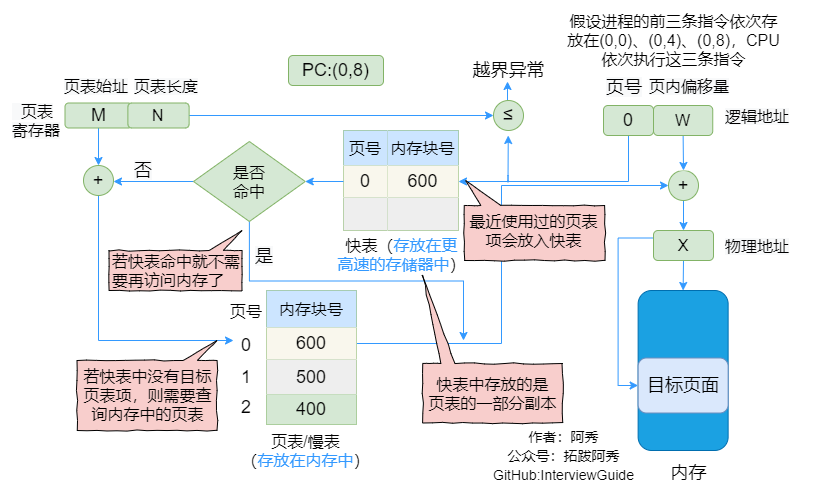
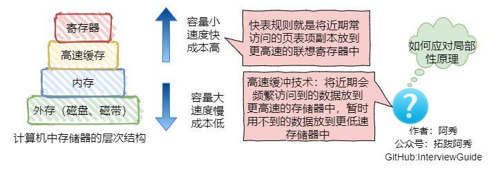
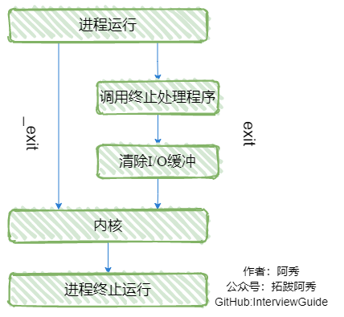
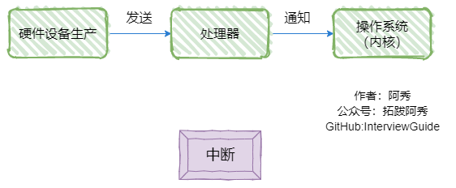
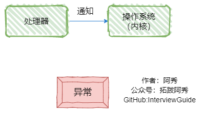

<h1 align="center">Hệ điều hành (Câu 21 - 40)</h1>

<p id="进程线程和协程的区别和联系"></p>

<div style="border-color: #24C6DC;
            background-color: #e9f9f3;         
            margin: 1rem 0;
        padding: .25rem 1rem;
        border-left-width: .3rem;
        border-left-style: solid;
        border-radius: .5rem;
        color: inherit;">
  <p>Đây là 6 thông tin có thể sẽ hữu ích cho bạn:</p>
<p>⭐️1. A Tú cùng bạn bè hợp tác phát triển một <span style="font-weight:bold;color:red">website tài nguyên lập trình</span>, hiện đã tổng hợp rất nhiều tài liệu học tập chất lượng và công cụ hữu ích (kèm link tải). Nếu bạn đang tìm kiếm tài nguyên lập trình phù hợp, <a href="https://tools.interviewguide.cn/home" style="text-decoration: underline" target="_blank">hoan nghênh trải nghiệm</a> cũng như giới thiệu những tài nguyên bạn thấy hay. Góp gió thành bão, mình vì mọi người, mọi người vì mình🔥!</p>  <p>2. 👉 Tháng 5/2023, trong thời gian <a style="text-decoration: underline" href="https://mp.weixin.qq.com/s?__biz=Mzk0ODU4MzEzMw==&mid=2247512170&idx=1&sn=c4a04a383d2dfdece676b75f17224e78" target="_blank">rời ByteDance để chuyển sang một công ty đa quốc gia</a>, nhằm <span style="font-weight:bold">thuận tiện cho bản thân khi tìm việc và nâng cao tỷ lệ trúng tuyển</span>, A Tú cùng bạn bè đã phát triển từ con số 0 một <span style="font-weight:bold;color:red">website giải đề phỏng vấn thực chiến của các Big Tech</span>, bao gồm hai frontend và một backend. Trang web cho phép tra cứu có định hướng đề thi viết của các công ty Internet, ví dụ như muốn tra cứu đề thi viết của ByteDance trong 1 năm gần đây gồm những gì đều có thể làm được. Hoan nghênh trải nghiệm~
<div align="center">
</div>Địa chỉ website: <a style="text-decoration: underline" href="https://niumacode.com/home?ref=F6O2625K" target="_blank">Website đề thi thuật toán phỏng vấn Big Tech</a>.
    </p>3. 😊
    Chia sẻ một <span style="font-weight:bold;color:red">website công cụ tiện ích</span> mà A Tú tâm đắc sưu tầm, <a style="text-decoration: underline" href="https://hkjtz.cn/" target="_blank">nhấn vào đây để truy cập</a>, chủ yếu là các ứng dụng, website ngách hữu ích, ngoài ra còn có tài nguyên phim ảnh HD, âm nhạc, phim truyền hình, AI, phim tài liệu, tài liệu thi tiếng Anh, thi công chức, cao học, nghề tay trái...
  </p>
  <p>4. 😍 Chia sẻ miễn phí tài nguyên học tập mà A Tú đã tích lũy từ khi theo học máy tính, <a style="text-decoration: underline" href="/notes/07-resources/01-free/01-introduce.html" target="_blank">nhấn vào đây để nhận miễn phí</a>; đồng thời cũng lưu lại nhật ký đánh giá <a style="text-decoration: underline" href="/notes/07-resources/02-precious.html" target="_blank">những cuốn sách máy tính, chuyên mục online chất lượng cũng như những khóa học trả phí kém chất lượng</a> từng mua trước đây.
  </p>
  <p>5. 🚀 Nếu bạn muốn thuận lợi giành được offer tốt hơn trong kỳ tuyển dụng trường học (Campus Recruitment), A Tú khuyên bạn nên xem thêm những <a style="text-decoration: underline" href="https://www.yuque.com/tuobaaxiu/httmmc/npg1k81zeq4wfpyz" target="_blank">cạm bẫy từng vấp phải</a> và <a style="text-decoration: underline"  target="_blank" href="https://www.yuque.com/tuobaaxiu/httmmc/gge9ppd0mbu2d3dp">kinh nghiệm đúc kết</a> của người đi trước. Thực tế, hầu hết các vấn đề bạn đang gặp phải thì các anh chị khóa trước đều đã từng trải qua.
  </p>
  <p>6. 🔥 Hoan nghênh các bạn đang chuẩn bị cho kỳ tuyển dụng trường học ngành CNTT tham gia <a  style="text-decoration: underline" href="https://www.yuque.com/tuobaaxiu/httmmc/xg0otqvc17wfx4u9" target="_blank">Cộng đồng học tập</a> của tôi. Độc hành một mình chi bằng cùng nhau sưởi ấm, trong nhóm đã đọng lại rất nhiều <a  style="text-decoration: underline" href="https://www.yuque.com/tuobaaxiu/httmmc/gge9ppd0mbu2d3dp" target="_blank">kinh nghiệm và tổng kết</a> của các anh chị khóa 21/22/23/24/25. Kiên trì đi theo lộ trình, cuối cùng đa phần đều có thể nhận được offer ưng ý! Nếu bạn cần phiên bản PDF tổng hợp các điểm kiến thức 📚︎ Bát cổ văn phỏng vấn tuyển dụng trường học trên website 《Ghi chép học tập của A Tú》, có thể <a style="text-decoration: underline" href="https://www.yuque.com/tuobaaxiu/httmmc/qs0yn66apvkzw0ps" target="_blank">nhấn vào đây để tải về</a>.</p>   </div>

## 21. Bản chất của Bộ nhớ RAM và vai trò đối với Hệ điều hành

Bộ nhớ RAM là cầu nối trung gian giữa CPU và Ổ đĩa lưu trữ. Do tốc độ truy xuất của CPU (nano giây) nhanh hơn ổ đĩa HDD/SSD từ hàng ngàn đến hàng triệu lần, hệ điều hành nạp các chỉ thị và dữ liệu cần xử lý tức thời vào RAM để CPU có thể truy xuất với độ trễ thấp nhất.


<p id="操作系统经典问题之哲学家进餐问题"></p>

## 22. Bài toán kinh điển: Bữa ăn của 5 nhà Triết học (Dining Philosophers Problem)

- **Vấn đề**: 5 nhà triết học ngồi quanh bàn tròn, ở giữa có bát mì và 5 chiếc đũa. Mỗi người cần 2 chiếc đũa (bên trái và bên phải) mới có thể ăn. Nếu cả 5 người cùng đồng thời cầm chiếc đũa bên trái lên $\rightarrow$ Xảy ra **Deadlock (Bế tắc vòng tròn)** vì ai cũng chờ chiếc đũa bên phải của người bên cạnh.
- **Giải pháp dùng Semaphore & State Array**:
  - Chỉ cho phép triết học gia ăn khi cả 2 người hàng xóm bên cạnh đều KHÔNG ở trạng thái `EATING`.
  - Cầm cả 2 chiếc đũa cùng lúc trong một Vùng tranh chấp (Critical Section) được bảo vệ bởi Mutex.
  - Sau khi ăn xong, chủ động kiểm tra và đánh thức hàng xóm bên trái/phải (`check(LEFT)`, `check(RIGHT)`).
- 

<p id="操作系统经典问题之读者写者问题"></p>

## 23. Bài toán kinh điển: Đọc - Ghi đồng thời (Readers-Writers Problem)

- **Quy tắc**: Cho phép nhiều Reader cùng đọc dữ liệu đồng thời, nhưng Writer bắt buộc phải truy cập độc quyền (Exclusive).
- **Cài đặt Semaphore (Ưu tiên Reader)**:
  ```c
  semaphore count_mutex = 1, data_mutex = 1;
  int count = 0; // Đếm số lượng reader

  void reader() {
      down(&count_mutex);
      count++;
      if (count == 1) down(&data_mutex); // Reader đầu tiên khóa data đối với writer
      up(&count_mutex);

      read_data();

      down(&count_mutex);
      count--;
      if (count == 0) up(&data_mutex);   // Reader cuối cùng mở khóa data cho writer
      up(&count_mutex);
  }
  ```

<p id="介绍一下几种典型的锁"></p>

## 24. 4 Loại khóa đồng bộ cơ bản: Mutex, Spinlock, Read-Write Lock, Condition Variable

1. **Mutex (Sleep-waiting)**: Luồng nhường CPU và ngủ khi tranh chấp thất bại, kích hoạt Context Switch.
2. **Spinlock (Busy-waiting)**: Luồng chạy vòng lặp quay cuồng trên CPU để kiểm tra cờ khóa liên tục. Không có chi phí Context Switch, cực kỳ tối ưu cho các thao tác khóa ngắn vài nano giây.
3. **Read-Write Lock (RWLock)**: Phân tách khóa đọc (Shared) và khóa ghi (Exclusive), tối đa hóa thông lượng cho hệ thống "đọc nhiều ghi ít".
4. **Condition Variable**: Cho phép luồng giải phóng Mutex và rơi vào trạng thái ngủ chờ tín hiệu thông báo (`signal`/`broadcast`) từ luồng khác.

<p id="你知道哪几种线程锁POSIX"></p>

## 24.1. Các loại Khóa luồng trong chuẩn POSIX Threads (pthreads)

- `pthread_mutex_t`: Khóa tương hỗ Mutex (`pthread_mutex_lock`, `pthread_mutex_unlock`).
- `pthread_spinlock_t`: Khóa tự quay Spinlock (`pthread_spin_lock`).
- `pthread_rwlock_t`: Khóa đọc-ghi (`pthread_rwlock_rdlock`, `pthread_rwlock_wrlock`).
- `pthread_cond_t`: Biến điều kiện (`pthread_cond_wait`, `pthread_cond_signal`).

<p id="逻辑地址为爱死物理地址"></p>

## 25. So sánh Địa chỉ Logic (Logical / Virtual Address) và Địa chỉ Vật lý (Physical Address)

- **Địa chỉ Logic**: Địa chỉ tương đối do Trình biên dịch tạo ra, tính từ mốc 0 của không gian tiến trình ảo.
- **Địa chỉ Vật lý**: Vị trí ô nhớ nhị phân thực tế trên thanh RAM.
- CPU sử dụng bộ chuyển đổi phần cứng **MMU (Memory Management Unit)** kết hợp với Bảng phân trang (Page Table) để chuyển đổi từ Địa chỉ Logic sang Vật lý trong thời gian thực.

<p id="怎么回收线程有哪几种方法"></p>

## 26. 3 Cách thu hồi tài nguyên Luồng trong Linux

1. **`pthread_join(tid, &retval)`**: Luồng gọi sẽ bị chặn (Block) cho đến khi luồng `tid` kết thúc, sau đó thu hồi Stack Frame và nhận giá trị trả về.
2. **`pthread_detach(tid)`**: Tách luồng thành chế độ độc lập (Detached). Khi luồng kết thúc, Kernel tự động thu hồi toàn bộ tài nguyên Stack ngay lập tức mà không cần cha gọi join.
3. **`pthread_exit(retval)`**: Luồng tự chủ động kết thúc chính mình và gửi mã trả về.

<p id="内存的覆盖是什么有什么特点"></p>

## 27. Kỹ thuật Phủ lấp bộ nhớ (Overlay)

Chia chương trình thành các phần không chạy đồng thời, cho phép chúng chia sẻ chung một phân vùng bộ nhớ (Overlay Area). Khi hàm A chạy xong, mã lệnh của hàm B được nạp từ đĩa đè lên vùng nhớ của A.

<p id="内存交换是什么有什么特点"></p>

## 28. Kỹ thuật Tráo đổi bộ nhớ (Swapping)

Hệ điều hành di chuyển toàn bộ không gian bộ nhớ của các tiến trình đang ở trạng thái ngủ/chờ từ RAM ra phân vùng **Swap** trên ổ đĩa để giải phóng RAM cho các tiến trình đang tích cực chạy, và nạp ngược lại khi tiến trình thức dậy.

<p id="什么时候会进行内存的交换"></p>

## 29. Khi nào Hệ điều hành kích hoạt Swapping?

Khi dung lượng RAM vật lý rơi xuống dưới ngưỡng an toàn (Low Memory Watermark) hoặc khi tỷ lệ lỗi thiếu trang (Page Fault Rate) tăng vọt (hiện tượng Thrashing - Rung giật bộ nhớ).

<p id="终端退出终端运行的进程会怎样"></p>

## 30. Điều gì xảy ra với các tiến trình con khi đóng Terminal?

Khi người dùng đóng Terminal / ngắt kết nối SSH, Kernel gửi tín hiệu **`SIGHUP`** (Hangup Signal) tới tiến trình Shell (Bash). Bash sẽ chuyển tiếp tín hiệu này tới tất cả các tiến trình con trong Session. Nếu tiến trình con không đăng ký hàm xử lý bỏ qua `SIGHUP`, nó sẽ **bị ép dừng và hủy ngay lập tức**.

<p id="如何让进程后台运行"></p>

## 31. 5 Cách duy trì tiến trình chạy ngầm khi ngắt kết nối Terminal

1. **`nohup command &`**: Bỏ qua tín hiệu `SIGHUP` và chuyển hướng toàn bộ output vào file `nohup.out`.
2. **`setsid command`**: Tạo một Session mới hoàn toàn độc lập với Terminal hiện tại.
3. **Chạy trong subshell `(command &)`**: Tách PID cha về init.
4. **Phím tắt `Ctrl + Z` $\rightarrow$ `bg %1` $\rightarrow$ `disown -h %1`**.
5. **Dùng Terminal Multiplexer (Khuyên dùng)**: `tmux` hoặc `screen`.

<p id="什么是快表你知道多少关于快表的知识"></p>

## 32. Bảng TLB (Translation Lookaside Buffer / 快表) là gì?

TLB là một bộ nhớ đệm phần cứng siêu tốc tích hợp trực tiếp bên trong vi xử lý CPU (thuộc khối MMU), lưu trữ ánh xạ của các mục Bảng phân trang (Page Table Entries) được truy cập gần nhất. TLB giúp giảm số lần truy cập RAM khi dịch địa chỉ từ 2-4 lần xuống chỉ còn 1 lần.


<p id="地址变换中有快表和没快表有什么区别"></p>

## 33. So sánh hiệu năng dịch địa chỉ có và không có TLB

- **Không có TLB**: Mỗi lần đọc/ghi ô nhớ logic cần tối thiểu **2 lần truy cập RAM** (1 lần đọc Page Table + 1 lần đọc ô nhớ thực).
- **Có TLB (Tỷ lệ Hit $\sim 98\%$ nhờ Locality)**: Chỉ cần **1 lần truy cập RAM** trực tiếp khi TLB Hit.

<p id="在执行malloc申请内存的时候操作系统是怎么做的"></p>

## 34. Cơ chế thực thi của malloc() ở tầng Hệ điều hành: brk() và mmap()

1. **`brk()` (Dành cho kích thước nhỏ $\le 128\text{ KB}$)**: Di chuyển con trỏ đỉnh Heap `brk` lên cao. Vùng nhớ này được quản lý trong Memory Pool của `ptmalloc` và không trả lại cho OS khi `free()`, nhằm phục vụ tái cấp phát nhanh.
2. **`mmap()` (Dành cho kích thước lớn $> 128\text{ KB}$)**: Cấp phát một phân vùng nhớ riêng biệt trong Memory Mapping Area (giữa Stack và Heap). Khi `free()`, bộ nhớ này được hủy và trả lại ngay lập tức cho OS bằng `munmap()`.
- *Lưu ý*: Cả hai lệnh chỉ mới cấp phát **Địa chỉ ảo (Virtual Memory)**. Chỉ khi tiến trình thực sự ghi dữ liệu vào ô nhớ đó, ngắt **Page Fault** mới kích hoạt Kernel cấp phát các khung trang RAM vật lý thực tế.

<p id="守护进程僵尸进程和孤儿进程"></p>

## 35. Phân biệt Daemon Process, Zombie Process và Orphan Process

1. **Daemon Process (Tiến trình Daemon)**: Tiến trình dịch vụ chạy ngầm suốt vòng đời hệ thống, không gắn với bất kỳ Terminal điều khiển nào (Session Leader mới qua `setsid()`, đóng file descriptors `0, 1, 2`, đổi thư mục gốc `/`).
2. **Orphan Process (Tiến trình mồ côi)**: Tiến trình cha kết thúc trước khi tiến trình con kết thúc. Tiến trình con sẽ được tiến trình gốc hệ thống **`init / systemd` (PID = 1)** nhận nuôi và thu hồi tài nguyên an toàn khi kết thúc $\rightarrow$ *Hoàn toàn vô hại*.
3. **Zombie Process (Tiến trình Ma / Xác sống)**: Tiến trình con đã kết thúc (`exit()`), nhưng tiến trình cha chưa gọi `wait()` / `waitpid()` để thu hồi thông tin kết thúc trong Task Table. Zombie Process chỉ còn giữ lại một mục PCB trong Kernel, nếu tích tụ quá nhiều sẽ làm cạn kiệt bảng Process ID của OS.

<p id="如何避免僵尸进程"></p>

## 36. 4 Cách triệt tiêu và xử lý Zombie Process trong Linux

1. **Đăng ký bỏ qua tín hiệu**: `signal(SIGCHLD, SIG_IGN);` $\rightarrow$ Kernel tự động dọn dẹp tiến trình con khi kết thúc mà không tạo Zombie.
2. **Bắt tín hiệu bất đồng bộ**: Đăng ký hàm Signal Handler cho `SIGCHLD` và gọi `waitpid(-1, NULL, WNOHANG)` lặp để dọn dẹp các con đã thoát.
3. **Kỹ thuật Double Fork**: Fork 2 lần liên tiếp để biến tiến trình thực thi thành **Orphan Process**, giao quyền quản lý và dọn dẹp trực tiếp cho `init` (PID 1).

<p id="局部性原理你知道吗主要有哪两大局部性原理各自是什么"></p>

## 37. Nguyên lý cục bộ (Principle of Locality) trong Kiến trúc Máy tính

1. **Cục bộ theo thời gian (Temporal Locality)**: Một mục dữ liệu hoặc lệnh vừa được truy cập sẽ có xác suất rất cao được truy cập lại trong tương lai gần (ví dụ biến đếm vòng lặp `for (int i=0; ...)`).
2. **Cục bộ theo không gian (Spatial Locality)**: Một ô nhớ được truy cập thì các ô nhớ nằm liền kề xung quanh nó cũng sẽ sớm được truy cập (ví dụ duyệt tuần tự mảng `arr[i]`).
- 

<p id="父进程子进程进程组作业和会话"></p>

## 38. Phân cấp quản lý Tiến trình: Process, Process Group, Job và Session

- **Process Group**: Tập hợp nhiều tiến trình có liên quan, có cùng `PGID` (bằng PID của Process Group Leader).
- **Job (Tác vụ)**: Tập hợp các tiến trình do Shell quản lý thông qua đường ống (ví dụ `cat file | grep "abc" | sort` là 1 Job).
- **Session (Phiên làm việc)**: Tập hợp của một hoặc nhiều Process Group, bắt đầu từ một Terminal đăng nhập duy nhất (Session Leader).

<p id="进程终止的几种方式"></p>

## 39. 5 Cách kết thúc một Tiến trình và Phân biệt exit() vs _exit()

1. Trả về tự nhiên từ hàm `main()`: `return 0;`.
2. Gọi hàm thư viện C: `exit(status);` $\rightarrow$ Tự động xả bộ đệm I/O Streams (`fflush`) và thực thi các hàm đăng ký `atexit()` trước khi thoát.
3. Gọi System Call Kernel: `_exit(status);` $\rightarrow$ Thoát ngay lập tức mà không xả bộ đệm I/O.
4. Gọi `abort()`: Ném tín hiệu `SIGABRT` làm chương trình kết thúc bất thường và tạo Coredump.
5. Bị dừng bởi tín hiệu ngoại vi: `SIGKILL` (kill -9), `SIGINT` (Ctrl + C), `SIGSEGV` (Crash bộ nhớ).
- 

<p id="里牛客死中异常和中断的区别"></p>

## 40. Phân biệt chi tiết giữa Ngắt (Interrupt) và Ngoại lệ (Exception) trong Linux

| Tiêu chí | Ngắt phần cứng (Hardware Interrupt) | Ngoại lệ (CPU Exception / Trap) |
| :--- | :--- | :--- |
| **Nguồn gốc** | Thiết bị ngoại vi phát tín hiệu điện qua Interrupt Controller (Bàn phím, Card mạng, Ổ đĩa) | Do CPU sinh ra đồng bộ khi thực thi lệnh (Page Fault, Chia 0, `int 0x80`) |
| **Tính đồng bộ** | Bất đồng bộ (Asynchronous) - có thể xảy ra ở bất kỳ chu kỳ xung nhịp nào | Đồng bộ (Synchronous) - gắn liền với dòng lệnh đang chạy |
| **Ngữ cảnh xử lý**| Chạy trong **Interrupt Context** (không được ngủ, không có tiến trình đại diện) | Chạy trong **Process Context** (có thể ngủ, có thể bị lập lịch) |
| **Cơ chế xử lý 2 nửa**| Chia thành Nửa đầu (Top Half - tắt ngắt, xử lý khẩn) và Nửa sau (Bottom Half - SoftIRQ/Tasklet xử lý nặng) | Xử lý trực tiếp trong nhân và trả kết quả về tiến trình |

- 
- 
