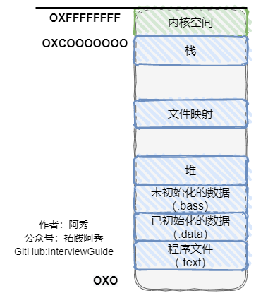
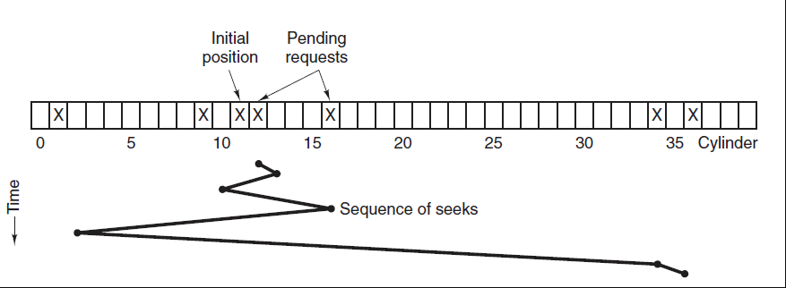
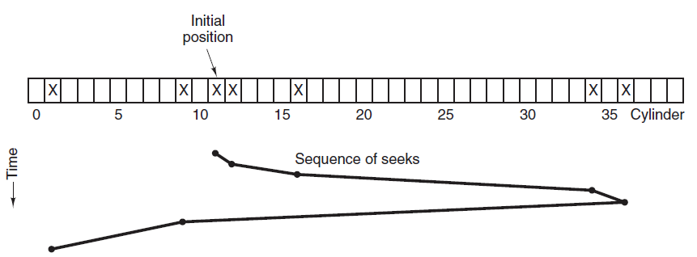
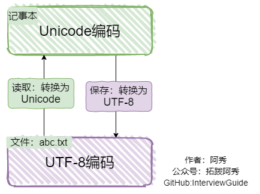
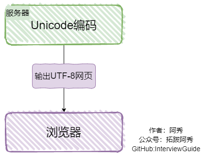
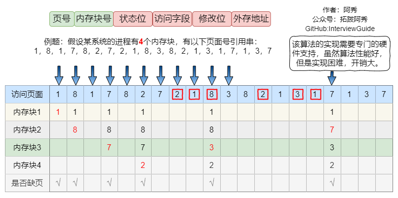
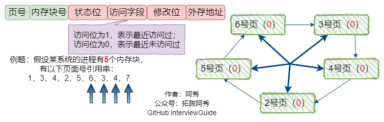
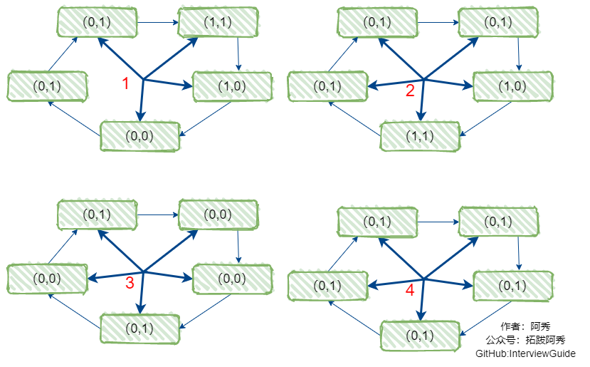
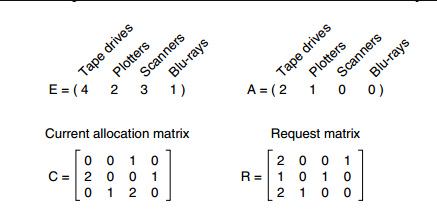
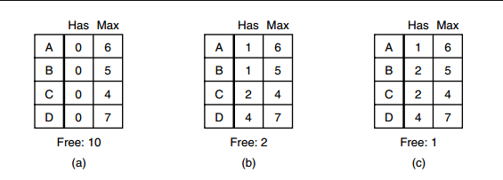

<h1 align="center">Hệ điều hành (Câu 41 - 60)</h1>

  
Đây là 6 thông tin có thể sẽ hữu ích cho bạn:

⭐️1. A Tú cùng bạn bè hợp tác phát triển một website tài nguyên lập trình, hiện đã tổng hợp rất nhiều tài liệu học tập chất lượng và công cụ hữu ích (kèm link tải). Nếu bạn đang tìm kiếm tài nguyên lập trình phù hợp, <a href="https://tools.interviewguide.cn/home" style="text-decoration: underline" target="_blank">hoan nghênh trải nghiệm</a> cũng như giới thiệu những tài nguyên bạn thấy hay. Góp gió thành bão, mình vì mọi người, mọi người vì mình🔥!
  
2. 👉 Tháng 5/2023, trong thời gian <a style="text-decoration: underline" href="https://mp.weixin.qq.com/s?__biz=Mzk0ODU4MzEzMw==&mid=2247512170&idx=1&sn=c4a04a383d2dfdece676b75f17224e78" target="_blank">rời ByteDance để chuyển sang một công ty đa quốc gia</a>, nhằm thuận tiện cho bản thân khi tìm việc và nâng cao tỷ lệ trúng tuyển, A Tú cùng bạn bè đã phát triển từ con số 0 một website giải đề phỏng vấn thực chiến của các Big Tech, bao gồm hai frontend và một backend. Trang web cho phép tra cứu có định hướng đề thi viết của các công ty Internet, ví dụ như muốn tra cứu đề thi viết của ByteDance trong 1 năm gần đây gồm những gì đều có thể làm được. Hoan nghênh trải nghiệm~

Địa chỉ website: <a style="text-decoration: underline" href="https://niumacode.com/home?ref=F6O2625K" target="_blank">Website đề thi thuật toán phỏng vấn Big Tech</a>.
    
3. 😊
    Chia sẻ một website công cụ tiện ích mà A Tú tâm đắc sưu tầm, <a style="text-decoration: underline" href="https://hkjtz.cn/" target="_blank">nhấn vào đây để truy cập</a>, chủ yếu là các ứng dụng, website ngách hữu ích, ngoài ra còn có tài nguyên phim ảnh HD, âm nhạc, phim truyền hình, AI, phim tài liệu, tài liệu thi tiếng Anh, thi công chức, cao học, nghề tay trái...
  

  
4. 😍 Chia sẻ miễn phí tài nguyên học tập mà A Tú đã tích lũy từ khi theo học máy tính, <a style="text-decoration: underline" href="/notes/07-resources/01-free/01-introduce.html" target="_blank">nhấn vào đây để nhận miễn phí</a>; đồng thời cũng lưu lại nhật ký đánh giá <a style="text-decoration: underline" href="/notes/07-resources/02-precious.html" target="_blank">những cuốn sách máy tính, chuyên mục online chất lượng cũng như những khóa học trả phí kém chất lượng</a> từng mua trước đây.
  

  
5. 🚀 Nếu bạn muốn thuận lợi giành được offer tốt hơn trong kỳ tuyển dụng trường học (Campus Recruitment), A Tú khuyên bạn nên xem thêm những <a style="text-decoration: underline" href="https://www.yuque.com/tuobaaxiu/httmmc/npg1k81zeq4wfpyz" target="_blank">cạm bẫy từng vấp phải</a> và <a style="text-decoration: underline"  target="_blank" href="https://www.yuque.com/tuobaaxiu/httmmc/gge9ppd0mbu2d3dp">kinh nghiệm đúc kết</a> của người đi trước. Thực tế, hầu hết các vấn đề bạn đang gặp phải thì các anh chị khóa trước đều đã từng trải qua.
  

  
6. 🔥 Hoan nghênh các bạn đang chuẩn bị cho kỳ tuyển dụng trường học ngành CNTT tham gia <a  style="text-decoration: underline" href="https://www.yuque.com/tuobaaxiu/httmmc/xg0otqvc17wfx4u9" target="_blank">Cộng đồng học tập</a> của tôi. Độc hành một mình chi bằng cùng nhau sưởi ấm, trong nhóm đã đọng lại rất nhiều <a  style="text-decoration: underline" href="https://www.yuque.com/tuobaaxiu/httmmc/gge9ppd0mbu2d3dp" target="_blank">kinh nghiệm và tổng kết</a> của các anh chị khóa 21/22/23/24/25. Kiên trì đi theo lộ trình, cuối cùng đa phần đều có thể nhận được offer ưng ý! Nếu bạn cần phiên bản PDF tổng hợp các điểm kiến thức 📚︎ Bát cổ văn phỏng vấn tuyển dụng trường học trên website 《Ghi chép học tập của A Tú》, có thể <a style="text-decoration: underline" href="https://www.yuque.com/tuobaaxiu/httmmc/qs0yn66apvkzw0ps" target="_blank">nhấn vào đây để tải về</a>.
   

## 41. Bố cục phân vùng bộ nhớ của Tiến trình (Memory Layout) trong Linux & Windows

Từ địa chỉ thấp đến cao:
1. **Code / Text Segment**: Chứa mã máy thực thi (Read-only).
2. **Data Segment (.data)**: Biến toàn cục / tĩnh đã khởi tạo giá trị khác 0.
3. **BSS Segment (.bss)**: Biến toàn cục / tĩnh chưa khởi tạo (khởi tạo về 0).
4. **Heap**: Phát triển từ địa chỉ thấp lên cao qua `brk` / `sbrk`.
5. **Memory Mapping Segment (mmap)**: Ánh xạ file, thư viện động `.so` / `.dll`, Shared Memory.
6. **Stack (Ngăn xếp)**: Phát triển từ địa chỉ cao xuống thấp (mặc định 8MB).
7. **Kernel Space**: 1GB trên cùng (hệ 32-bit) dành riêng cho Nhân OS.

## 42. 5 Phân vùng bộ nhớ của chương trình C/C++

1. Stack (Ngăn xếp).
2. Heap (Đống).
3. Static / Global Segment (.data & .bss).
4. Constant / Literal Segment (.rodata).
5. Code / Text Segment (.text).

## 43. Dung lượng Stack mặc định trên Linux và Windows

- **Linux**: Do OS cấu hình (mặc định là **8MB / 8192KB**), kiểm tra bằng `ulimit -s`.
- **Windows**: Do Compiler ghi vào Header file thực thi PE (mặc định trên MSVC là **1MB**).

## 44. Quá trình cấp phát Heap trong Bộ nhớ ảo (Virtual Memory)

Khi gọi `malloc()` / `new`, OS tạo một mục VMA (Virtual Memory Area) trong danh sách quản lý bộ nhớ của tiến trình và nạp một mục Bảng phân trang PTE (Page Table Entry) ở trạng thái "chưa ánh xạ vật lý". Khi chương trình thực sự đọc/ghi ô nhớ đó, CPU kích hoạt ngắt **Page Fault**, Kernel cấp phát khung trang RAM vật lý và ghi địa chỉ vào PTE.

## 45. 3 Thuật toán lập lịch truy xuất ổ đĩa (Disk Scheduling Algorithms)

1. **FCFS (First-Come, First-Served)**: Xử lý theo thứ tự yêu cầu đến, đơn giản nhưng thời gian dịch chuyển đầu đọc (Seek Time) dài.
2. **SSTF (Shortest Seek Time First)**: Ưu tiên rãnh ghi gần đầu đọc nhất $\rightarrow$ Dễ gây đói tài nguyên (Starvation) cho các rãnh ở rìa đĩa.
3. **SCAN (Elevator Algorithm - Thuật toán thang máy)**: Đầu đọc di chuyển liên tục theo 1 hướng phục vụ mọi yêu cầu trên đường đi cho đến khi chạm biên, sau đó quay ngược lại. Triệt tiêu hoàn toàn hiện tượng Starvation của SSTF.
- 
- 

## 46. Mối quan hệ giữa Phân vùng hoán đổi (Swap Space) và Bộ nhớ ảo

Swap là một phân vùng riêng trên ổ đĩa cứng được Hệ điều hành dùng làm "phần mở rộng" cho RAM vật lý. Khi RAM bị đầy, các trang nhớ ít hoạt động (Inactive Pages) được đẩy sang Swap để nhường RAM trống cho các ứng dụng ưu tiên.

## 47. Hiện tượng Rung giật bộ nhớ (Thrashing / 颠簸) là gì?

- Xảy ra khi số khung trang RAM vật lý cấp cho tiến trình ít hơn **Tập làm việc (Working Set)** của nó.
- Hậu quả: Hệ điều hành liên tục tráo trang ra đĩa rồi lại nạp trang vào RAM trong vòng lặp vô tận, khiến thời gian xử lý I/O đĩa chiếm gần như 100% thời gian CPU, làm máy tính bị "đơ" hoàn toàn.

## 48. Cấp phát đối tượng trên Stack nhanh hơn trên Heap gấp nhiều lần vì sao?

1. **Tốc độ cấp phát**: Stack chỉ tốn 1 lệnh CPU (`sub esp, N`) để dời con trỏ đỉnh ngăn xếp, trong khi Heap phải gọi hàm `malloc` duyệt tìm khối trống trong Free List và xử lý phân mảnh.
2. **Tốc độ truy xuất**: Dữ liệu Stack luôn nằm nóng trong CPU L1/L2 Cache, trong khi con trỏ Heap đòi hỏi phải dereference 2 lần ô nhớ.

## 49. 3 Phương thức cấp phát bộ nhớ trong C++

1. Cấp phát tĩnh (Static Allocation) tại Compile-time.
2. Cấp phát tự động trên Stack (Automatic Allocation).
3. Cấp phát động trên Heap (Dynamic Allocation qua `new`/`malloc`).

## 50. 5 Lỗi bộ nhớ kinh điển trong C/C++ và Cách phòng ngừa

1. **Sử dụng con trỏ NULL chưa cấp phát**: Khắc phục bằng kiểm tra `if (!ptr)` hoặc `assert(ptr)`.
2. **Chưa khởi tạo biến đã đọc giá trị**: Luôn gán giá trị mặc định khi khai báo.
3. **Truy cập tràn biên mảng (Buffer Overflow / Off-by-one Error)**: Dùng `std::vector::at()` hoặc kiểm tra cận vòng lặp.
4. **Quên giải phóng bộ nhớ (Memory Leak)**: Dùng Con trỏ thông minh (`std::unique_ptr`).
5. **Dangling Pointer (Con trỏ lơ lửng / Use-After-Free)**: Gán ngay `ptr = nullptr` sau khi `free/delete`.

## 51. Vị trí lưu trữ dữ liệu khi bị Swap ra đĩa

Dữ liệu được lưu trong **Phân vùng hoán đổi (Swap Partition / Swap Area)** trên ổ đĩa. Phân vùng này được định dạng thô không qua File System thông thường để tối đa hóa tốc độ đọc ghi tuần tự (Raw Block I/O).

## 52. Tiêu chí ưu tiên chọn tiến trình để Swap ra đĩa

1. Tiến trình đang ở trạng thái Blocked / Sleep dài hạn.
2. Tiến trình có mức ưu tiên (Nice value) thấp.
3. Tiến trình có thời gian cư ngụ trong RAM đã lâu mà không có hoạt động CPU.
4. *Lưu ý*: Khối điều khiển tiến trình **PCB luôn thường trực trong RAM**, không bao giờ bị Swap ra đĩa.

## 53. Phân biệt ASCII, Unicode và UTF-8

- **ASCII**: Bảng mã 7-bit (128 ký tự) dành riêng cho tiếng Anh và ký tự điều khiển cơ bản.
- **Unicode**: Bộ ký tự toàn cầu gán cho mỗi chữ cái/biểu tượng của mọi ngôn ngữ trên thế giới một mã số duy nhất (Code Point: `U+0000` $\dots$ `U+10FFFF`).
- **UTF-8**: Cách mã hóa độ dài biến đổi (Variable-length: 1 đến 4 bytes) cho Unicode. Ký tự ASCII chỉ tốn 1 byte (hoàn toàn tương thích ngược với ASCII), ký tự tiếng Việt/Hán tốn 2-3 bytes.
- 
- 

## 54. Cơ chế thực hiện Thao tác nguyên tử (Atomic Operations) ở cấp độ Phần cứng CPU

1. **Khóa Bus (Bus Locking - Tín hiệu LOCK#)**: CPU phát tín hiệu khóa toàn bộ Bus hệ thống, ngăn mọi CPU khác truy cập vào RAM trong suốt chu kỳ đọc-ghi-sửa (Read-Modify-Write). Cơ chế này đảm bảo an toàn nhưng chi phí hiệu năng rất lớn.
2. **Khóa Cache (Cache Locking - Dựa trên MESI Cache Coherence)**: Thay vì khóa Bus, CPU chỉ khóa đường dẫn của một Khung dòng nhớ đệm (Cache Line) cụ thể trong L1/L2 Cache. Giao thức duy trì tính nhất quán Cache (MESI Protocol) tự động đánh dấu vô hiệu hóa (`Invalid`) Cache Line của các CPU khác khi có 1 CPU ghi dữ liệu $\rightarrow$ *Hiệu năng cực cao, là nền tảng của `std::atomic` hiện đại*.

## 55. Các điểm mấu chốt của cơ chế Swapping

Cần không gian đĩa Swap chuyên dụng tốc độ cao; chi phí hoán đổi tỉ lệ thuận với dung lượng bộ nhớ chuyển giao; chỉ kích hoạt khi RAM thực sự thiếu hụt.

## 56. Phân biệt Đồng quy (Concurrency) và Song song (Parallelism)

- **Đồng quy (Concurrency)**: Xử lý nhiều tác vụ cùng một lúc bằng cách chia sẻ thời gian (Time-sharing) luân phiên trên 1 lõi CPU đơn lẻ.
- **Song song (Parallelism)**: Thực sự thực thi nhiều tác vụ cùng một thời điểm vật lý chính xác nhờ vào phần cứng đa lõi (Multi-core CPU).

## 57. Tổng hợp 5 Thuật toán thay thế trang (Page Replacement Algorithms)

1. **OPT (Optimal - Tối ưu lý thuyết)**: Loại bỏ trang có thời gian sử dụng tiếp theo xa nhất trong tương lai $\rightarrow$ *Đạt tỷ lệ thiếu trang thấp nhất, nhưng không thể hiện thực trong thực tế vì không dự đoán trước được tương lai*.
2. **FIFO (First-In, First-Out)**: Loại bỏ trang được nạp vào RAM sớm nhất $\rightarrow$ *Mắc phải dị thường Belady (Tăng thêm RAM nhưng tỷ lệ Page Fault lại tăng theo)*.
3. **LRU (Least Recently Used)**: Loại bỏ trang có khoảng thời gian không được truy cập lâu nhất tính đến hiện tại $\rightarrow$ *Hiệu năng tốt nhất tiệm cận OPT, không bị Belady, nhưng tốn chi phí phần cứng cập nhật thời gian*.
4. **CLOCK (NRU - Not Recently Used)**: Thuật toán đồng hồ, dùng 1 bit truy cập $A$. Duyệt vòng tròn: nếu $A=1$ đổi thành $0$; nếu $A=0$ thì chọn trang đó để thay thế.
5. **Improved CLOCK (CLOCK cải tiến)**: Kết hợp cả Bit truy cập $A$ và Bit sửa đổi $M$ theo 4 mức ưu tiên: $(0,0) \rightarrow (0,1) \rightarrow (1,0) \rightarrow (1,1)$, ưu tiên giữ lại các trang đã sửa đổi để tránh phải ghi đĩa I/O.
- 
- 
- 

## 58. Tài nguyên dùng chung trong Hệ điều hành

Bao gồm Tài nguyên dùng chung đồng thời (Concurrent Sharing - như file chỉ đọc) và Tài nguyên tranh chấp loại trừ lẫn nhau (Mutual Exclusive Sharing - như biến ghi, máy in, ổ đĩa).

## 59. Tổng kết toàn diện về Deadlock (Bế tắc hệ thống)

### 4 Điều kiện cần để xảy ra Deadlock (Coffman Conditions)
1. **Loại trừ tương hỗ (Mutual Exclusion)**: Tài nguyên chỉ phục vụ 1 tiến trình tại 1 thời điểm.
2. **Giữ và chờ (Hold and Wait)**: Tiến trình đang giữ tài nguyên A lại xin cấp phát thêm tài nguyên B.
3. **Không chiếm dụng (No Preemption)**: Tài nguyên không thể bị tước đoạt cưỡng bức khi chưa được tự nguyện giải phóng.
4. **Chờ đợi vòng tròn (Circular Wait)**: Tồn tại chu trình khép kín: $P_1 \rightarrow P_2 \rightarrow \dots \rightarrow P_n \rightarrow P_1$.

### 4 Chiến lược xử lý Deadlock
1. **Chiến lược Đà điểu (Ostrich Algorithm)**: Bỏ qua hoàn toàn vấn đề (Windows và Linux mặc định áp dụng vì chi phí phòng ngừa quá lớn so với tần suất xảy ra).
2. **Phát hiện và Phục hồi (Detection & Recovery)**: Dùng Đồ thị cấp phát tài nguyên (RAG) tìm chu trình khép kín $\rightarrow$ Hủy tiến trình hoặc cưỡng chế thu hồi tài nguyên (Rollback).
3. **Ngăn chặn (Prevention)**: Phá vỡ 1 trong 4 điều kiện Coffman (ví dụ: Quy định thứ tự đánh số tài nguyên tăng dần).
4. **Tránh né (Avoidance - Banker's Algorithm)**: Thuật toán Nhà ngân hàng kiểm tra Trạng thái an toàn (Safe State) trước khi chấp thuận cấp phát tài nguyên.
- 
- 

## 60. Phân biệt Phân mảnh ngoài (External Fragmentation) và Phân mảnh trong (Internal Fragmentation)

- **Phân đoạn (Segmentation) có Phân mảnh ngoài, không có Phân mảnh trong**: Vì kích thước các đoạn được cấp phát động vừa khít theo nhu cầu thực tế của module, nhưng giữa các đoạn giải phóng nằm rải rác những khoảng trống nhỏ không thể ghép lại cho tiến trình mới.
- **Phân vùng cố định (Fixed Partitioning) / Phân trang (Paging) có Phân mảnh trong**: Vì các khối nhớ có kích thước cố định (ví dụ 4KB). Nếu tiến trình chỉ cần 1KB, 3KB còn lại bên trong khối bị bỏ phí mà tiến trình khác không thể dùng.
