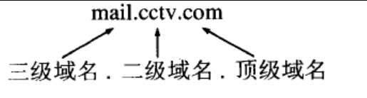
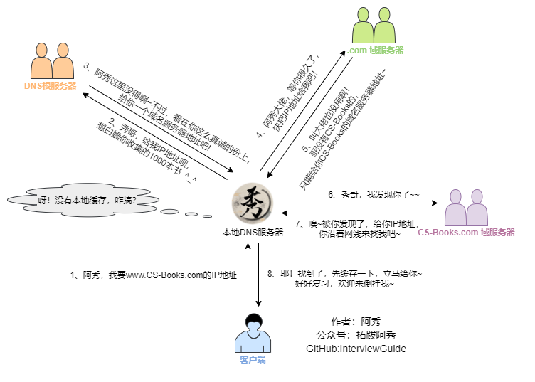

<h1 align="center">Mạng máy tính (Câu 01 - 20)</h1>

  
Đây là 6 thông tin có thể sẽ hữu ích cho bạn:

⭐️1. A Tú cùng bạn bè hợp tác phát triển một website tài nguyên lập trình, hiện đã tổng hợp rất nhiều tài liệu học tập chất lượng và công cụ hữu ích (kèm link tải). Nếu bạn đang tìm kiếm tài nguyên lập trình phù hợp, <a href="https://tools.interviewguide.cn/home" style="text-decoration: underline" target="_blank">hoan nghênh trải nghiệm</a> cũng như giới thiệu những tài nguyên bạn thấy hay. Góp gió thành bão, mình vì mọi người, mọi người vì mình🔥!
  
2. 👉 Tháng 5/2023, trong thời gian <a style="text-decoration: underline" href="https://mp.weixin.qq.com/s?__biz=Mzk0ODU4MzEzMw==&mid=2247512170&idx=1&sn=c4a04a383d2dfdece676b75f17224e78" target="_blank">rời ByteDance để chuyển sang một công ty đa quốc gia</a>, nhằm thuận tiện cho bản thân khi tìm việc và nâng cao tỷ lệ trúng tuyển, A Tú cùng bạn bè đã phát triển từ con số 0 một website giải đề phỏng vấn thực chiến của các Big Tech, bao gồm hai frontend và một backend. Trang web cho phép tra cứu có định hướng đề thi viết của các công ty Internet, ví dụ như muốn tra cứu đề thi viết của ByteDance trong 1 năm gần đây gồm những gì đều có thể làm được. Hoan nghênh trải nghiệm~

Địa chỉ website: <a style="text-decoration: underline" href="https://niumacode.com/home?ref=F6O2625K" target="_blank">Website đề thi thuật toán phỏng vấn Big Tech</a>.
    
3. 😊
    Chia sẻ một website công cụ tiện ích mà A Tú tâm đắc sưu tầm, <a style="text-decoration: underline" href="https://hkjtz.cn/" target="_blank">nhấn vào đây để truy cập</a>, chủ yếu là các ứng dụng, website ngách hữu ích, ngoài ra còn có tài nguyên phim ảnh HD, âm nhạc, phim truyền hình, AI, phim tài liệu, tài liệu thi tiếng Anh, thi công chức, cao học, nghề tay trái...
  

  
4. 😍 Chia sẻ miễn phí tài nguyên học tập mà A Tú đã tích lũy từ khi theo học máy tính, <a style="text-decoration: underline" href="/notes/07-resources/01-free/01-introduce.html" target="_blank">nhấn vào đây để nhận miễn phí</a>; đồng thời cũng lưu lại nhật ký đánh giá <a style="text-decoration: underline" href="/notes/07-resources/02-precious.html" target="_blank">những cuốn sách máy tính, chuyên mục online chất lượng cũng như những khóa học trả phí kém chất lượng</a> từng mua trước đây.
  

  
5. 🚀 Nếu bạn muốn thuận lợi giành được offer tốt hơn trong kỳ tuyển dụng trường học (Campus Recruitment), A Tú khuyên bạn nên xem thêm những <a style="text-decoration: underline" href="https://www.yuque.com/tuobaaxiu/httmmc/npg1k81zeq4wfpyz" target="_blank">cạm bẫy từng vấp phải</a> và <a style="text-decoration: underline"  target="_blank" href="https://www.yuque.com/tuobaaxiu/httmmc/gge9ppd0mbu2d3dp">kinh nghiệm đúc kết</a> của người đi trước. Thực tế, hầu hết các vấn đề bạn đang gặp phải thì các anh chị khóa trước đều đã từng trải qua.
  

  
6. 🔥 Hoan nghênh các bạn đang chuẩn bị cho kỳ tuyển dụng trường học ngành CNTT tham gia <a  style="text-decoration: underline" href="https://www.yuque.com/tuobaaxiu/httmmc/xg0otqvc17wfx4u9" target="_blank">Cộng đồng học tập</a> của tôi. Độc hành một mình chi bằng cùng nhau sưởi ấm, trong nhóm đã đọng lại rất nhiều <a  style="text-decoration: underline" href="https://www.yuque.com/tuobaaxiu/httmmc/gge9ppd0mbu2d3dp" target="_blank">kinh nghiệm và tổng kết</a> của các anh chị khóa 21/22/23/24/25. Kiên trì đi theo lộ trình, cuối cùng đa phần đều có thể nhận được offer ưng ý! Nếu bạn cần phiên bản PDF tổng hợp các điểm kiến thức 📚︎ Bát cổ văn phỏng vấn tuyển dụng trường học trên website 《Ghi chép học tập của A Tú》, có thể <a style="text-decoration: underline" href="https://www.yuque.com/tuobaaxiu/httmmc/qs0yn66apvkzw0ps" target="_blank">nhấn vào đây để tải về</a>.
   

## 1. Mô hình 7 tầng OSI và 4 tầng TCP/IP

- **Tầng 7 - Application (Ứng dụng)**: Giao diện trực tiếp với người dùng và phần mềm (HTTP, HTTPS, FTP, DNS, SMTP).
- **Tầng 6 - Presentation (Trình diễn)**: Mã hóa/Giải mã, Nén dữ liệu, Chuyển đổi định dạng ký tự (SSL/TLS, ASCII, JPEG).
- **Tầng 5 - Session (Phiên)**: Thiết lập, duy trì và đồng bộ hóa phiên kết nối giữa các ứng dụng.
- **Tầng 4 - Transport (Giao vận)**: Truyền dữ liệu đầu-cuối (End-to-End), điều khiển luồng và tắc nghẽn (TCP Segment, UDP Datagram).
- **Tầng 3 - Network (Mạng)**: Định tuyến đường đi và gán địa chỉ logic IP (IP Packet, ICMP, OSPF, BGP).
- **Tầng 2 - Data Link (Liên kết dữ liệu)**: Đóng gói khung (Frame), kiểm soát lỗi CRC, địa chỉ vật lý MAC (Ethernet Frame, ARP, Switch).
- **Tầng 1 - Physical (Vật lý)**: Truyền tín hiệu điện/quang nhị phân dạng Bit thô (Dây cáp RJ45, Cáp quang, Hub).

## 2. Toàn bộ quy trình của một Yêu cầu HTTP (HTTP Request Flow)

1. Phân giải tên miền qua hệ thống DNS lấy địa chỉ IP.
2. Bắt tay 3 bước TCP (Three-way Handshake: `SYN` $\rightarrow$ `SYN+ACK` $\rightarrow$ `ACK`) để thiết lập kết nối tin cậy (kèm bắt tay TLS nếu là HTTPS).
3. Client gửi HTTP Request Header và Body tới Web Server.
4. Server xử lý logic nghiệp vụ và trả về HTTP Response (Status Code, Response Headers, HTML/JSON).
5. Trình duyệt nhận dữ liệu, giải mã DOM Tree, CSSOM Tree, tải các tài nguyên phụ (CSS, JS, Hình ảnh) và render giao diện.
6. Bắt tay 4 bước TCP (Four-way Wave) để đóng kết nối (nếu không dùng `Keep-Alive`).

## 3. Hệ thống phân giải tên miền DNS (Domain Name System) là gì?

Là một cơ sở dữ liệu phân tán toàn cầu (Distributed Database) chịu trách nhiệm ánh xạ qua lại giữa **Tên miền dễ nhớ (Domain Name: `www.google.com`)** và **Địa chỉ IP máy móc (IP Address: `142.250.190.46`)**.

## 4. Nguyên lý hoạt động và Phân cấp truy vấn DNS

- **Các tầng Cache DNS**: Cache Trình duyệt $\rightarrow$ Cache Hệ điều hành (`hosts` file) $\rightarrow$ Cache Router $\rightarrow$ Cache Máy chủ DNS Nhà mạng (LDNS).
- **Đệ quy (Recursive Query) & Lặp (Iterative Query)**:
  1. Client gửi truy vấn Đệ quy tới Local DNS Server (LDNS).
  2. LDNS thực hiện truy vấn Lặp tuần tự qua các tầng máy chủ:
     - Hỏi **Root DNS Server (Máy chủ gốc '.')** $\rightarrow$ Trả về địa chỉ của Top-Level Domain DNS (`.com`).
     - Hỏi **TLD DNS Server (`.com`)** $\rightarrow$ Trả về địa chỉ của Authoritative DNS Server quản lý tên miền (`baidu.com`).
     - Hỏi **Authoritative DNS Server** $\rightarrow$ Lấy địa chỉ IP chính xác trả về cho LDNS.
  3. LDNS lưu cache theo thời gian sống (TTL) và gửi IP về cho Client.
- 

## 5. Tại sao truy vấn DNS của Client lại sử dụng giao thức UDP (Port 53)?

- **Tối ưu hóa độ trễ**: Giao thức UDP không cần tốn 3 bước bắt tay TCP (RTT handshake) và 4 bước đóng kết nối. Client chỉ cần gửi 1 gói tin Request và nhận về 1 gói tin Response ngay lập tức.
- **Kích thước gói nhỏ**: Hầu hết các phản hồi truy vấn DNS chuẩn đều nhỏ hơn **512 bytes**, nằm trọn trong 1 gói tin UDP mà không bị phân mảnh IP.

## 6. Tại sao quá trình Truyền vùng DNS (Zone Transfer) lại bắt buộc dùng TCP?

Zone Transfer diễn ra giữa DNS Master và DNS Slave để đồng bộ toàn bộ bảng ghi dữ liệu tên miền. Dung lượng bảng ghi thường rất lớn ($> 512\text{ bytes}$) và đòi hỏi độ tin cậy tuyệt đối không được phép mất mát hay sai lệch dữ liệu $\rightarrow$ Bắt buộc phải sử dụng kết nối tin cậy của **TCP (Port 53)**.

## 7. So sánh Kết nối ngắn (Short Connection) và Kết nối dài (Persistent / Keep-Alive Connection)

- **HTTP/1.0 (Mặc định Short Connection)**: Mỗi yêu cầu HTTP phải tạo mới 1 kết nối TCP và đóng ngay sau khi nhận phản hồi $\rightarrow$ Lãng phí tài nguyên CPU và tăng độ trễ do bắt tay TCP liên tục.
- **HTTP/1.1 (Mặc định Long Connection - `Connection: keep-alive`)**: Duy trì kết nối TCP mở để tái sử dụng cho hàng loạt yêu cầu HTTP tiếp theo giữa cùng 1 Client và Server.

## 8. Hiện tượng Dính gói (Packet Sticky / 粘包) và Xé gói (Packet Splitting / 拆包) trong TCP

- **Bản chất**: TCP là giao thức hướng luồng byte liên tục (Byte Stream Protocol), hoàn toàn không có khái niệm ranh giới tin nhắn (Message Boundary).
- **Nguyên nhân**:
  1. Kích thước dữ liệu ứng dụng lớn hơn bộ đệm gửi (Send Buffer) hoặc lớn hơn chỉ số **MSS / MTU** $\rightarrow$ Bị xé thành nhiều gói TCP.
  2. Thuật toán **Nagle** gộp nhiều gói dữ liệu nhỏ vào 1 gói TCP lớn trước khi gửi để tối ưu băng thông $\rightarrow$ Gây dính gói ở phía nhận.
- **4 Giải pháp xử lý ở tầng Ứng dụng**:
  1. Quy định độ dài tin nhắn cố định (Fixed-length Framing).
  2. Thêm ký tự phân tách đặc biệt (Delimiter: `\r\n` hoặc `\0`).
  3. Định dạng Gói tin chuẩn gồm **Header (chứa trường độ dài `Length`)** và **Body (dữ liệu payload)**.
  4. Sử dụng các giao thức ứng dụng chuẩn (Protobuf, HTTP Chunked).

## 9. Vai trò và Cơ chế hoạt động của Web Cache

- Giảm thiểu lưu lượng mạng, cắt giảm độ trễ phản hồi (Response Latency), giảm tải tính toán cho Server gốc.
- **Cơ chế**: Cache phía Client (Browser Cache qua Headers `Cache-Control`, `ETag`, `Last-Modified`), Cache trung gian (CDN, Nginx Reverse Proxy), Cache phía Backend (Redis).

## 10. Các phương thức HTTP Request Methods chuẩn

| Method | Mô tả tính năng | Tính An toàn (Safe) | Tính Bất biến (Idempotent) |
| :--- | :--- | :--- | :--- |
| **GET** | Lấy tài nguyên từ server | **Có** | **Có** |
| **HEAD** | Lấy Header của tài nguyên (không tải Body) | **Có** | **Có** |
| **POST** | Gửi dữ liệu tạo mới tài nguyên hoặc xử lý form | Không | Không |
| **PUT** | Ghi đè/thay thế toàn bộ tài nguyên | Không | **Có** |
| **PATCH** | Cập nhật một phần (Partial update) tài nguyên | Không | Không |
| **DELETE** | Xóa tài nguyên trên server | Không | **Có** |
| **OPTIONS** | Truy vấn các phương thức HTTP mà server hỗ trợ (dùng trong CORS Preflight) | **Có** | **Có** |

## 11. 6 Điểm khác biệt cốt lõi giữa GET và POST

1. **Ý nghĩa nghiệp vụ**: GET dùng để truy vấn đọc dữ liệu; POST dùng để tạo mới/chỉnh sửa dữ liệu.
2. **Vị trí truyền tham số**: GET đính kèm tham số vào Query String trên thanh URL (`?id=1&name=a`); POST truyền dữ liệu trong Request Body.
3. **Độ an toàn bảo mật**: GET hiển thị dữ liệu thô trên URL, lịch sử duyệt web và log server $\rightarrow$ Kém an toàn cho mật khẩu; POST ẩn trong Body.
4. **Giới hạn dung lượng**: GET bị giới hạn độ dài URL bởi Trình duyệt/Web Server (thường $\sim 2\text{KB} - 8\text{KB}$); POST cho phép gửi dữ liệu dung lượng lớn (Upload File).
5. **Khả năng Cache**: GET được trình duyệt chủ động lưu Cache mặc định; POST không được Cache.
6. **Tính Bất biến (Idempotency)**: GET là Idempotent (gửi 100 lần cùng URL trả về cùng kết quả không làm thay đổi trạng thái server); POST là Non-idempotent (mỗi lần gửi sinh ra một bản ghi mới).

## 12. Một kết nối TCP có thể xử lý bao nhiêu HTTP Request?

Với cơ chế `Connection: keep-alive` trong HTTP/1.1 và HTTP/2, một kết nối TCP duy nhất có thể xử lý **hàng ngàn yêu cầu HTTP liên tiếp** cho đến khi đạt ngưỡng thời gian chờ `KeepAliveTimeout` hoặc số lượng `MaxKeepAliveRequests`.

## 13. Cơ chế gửi đồng thời nhiều HTTP Request trên cùng một kết nối TCP

- **HTTP/1.1 (Pipelining)**: Hỗ trợ gửi nhiều request liên tiếp mà không cần đợi response. Tuy nhiên server vẫn **bắt buộc phải trả response theo đúng thứ tự gửi ban đầu** $\rightarrow$ Dẫn đến vấn đề **Nghẽn đầu dòng (Head-of-Line Blocking - HoL Blocking)** ở tầng ứng dụng (nếu request 1 xử lý chậm, các request sau bị chặn theo). Vì vậy hầu hết trình duyệt đều tắt tính năng này.
- **HTTP/2 (Multiplexing - Đa ghép kênh)**: Chia nhỏ tin nhắn thành các Frame nhị phân có gán Stream ID riêng biệt. Cho phép gửi nhận xen kẽ hàng trăm request/response đồng thời trên **1 kết nối TCP duy nhất**, triệt tiêu hoàn toàn HoL Blocking ở tầng ứng dụng.

## 14. Giới hạn số lượng kết nối TCP đồng thời của Trình duyệt tới cùng một Domain Host

- Để tránh gây cạn kiệt tài nguyên mạng và phòng chống tấn công DoS, các trình duyệt hiện đại (Chrome, Firefox, Safari) giới hạn tối đa **6 kết nối TCP đồng thời tới cùng một Host Domain**.
- Kỹ thuật tối ưu thời HTTP/1.1: **Domain Sharding** (chia tài nguyên tĩnh sang nhiều subdomain `img1.site.com`, `img2.site.com` để mở thêm kết nối song song). Trong thời đại HTTP/2, Domain Sharding không còn cần thiết nhờ Multiplexing.

## 15. Tóm tắt các bước hiển thị trang web khi nhập URL

DNS Lookup $\rightarrow$ TCP 3-way Handshake $\rightarrow$ TLS Handshake (nếu HTTPS) $\rightarrow$ Gửi HTTP Request $\rightarrow$ Nhận HTTP Response $\rightarrow$ Trình duyệt phân tích HTML/CSS/JS $\rightarrow$ Xây dựng DOM + CSSOM $\rightarrow$ Render Tree $\rightarrow$ Layout $\rightarrow$ Paint lên màn hình.

## 16. Phân tích chuyên sâu các bước mạng khi nhấn Enter trên thanh địa chỉ URL

1. Trình duyệt kiểm tra HSTS List (chuyển `http://` sang `https://`).
2. Tra cứu DNS qua API hệ điều hành (`getaddrinfo` / `gethostbyname`).
3. Truy vấn ARP lấy địa chỉ MAC của Default Gateway Router.
4. Mở Socket kết nối TCP Port 443 tới IP đích.
5. Thực hiện bắt tay TLS 1.3: Thỏa thuận Cipher Suites, trao đổi khóa ECDH, xác minh chứng chỉ số X.509 CA.
6. Gửi Encrypted HTTP GET Request.
7. Web Server (Nginx) cân bằng tải vào Backend Application Server.
8. Trình duyệt nhận Stream dữ liệu và Render giao diện tương tác.

## 17. Sơ đồ chi tiết các bước phân giải tên miền DNS

1. Client $\rightarrow$ Local DNS Server (Đệ quy).
2. Local DNS $\rightarrow$ Root Name Server (Lặp).
3. Local DNS $\rightarrow$ TLD Name Server (.com/.vn).
4. Local DNS $\rightarrow$ Authoritative Name Server (lấy bản ghi A/AAAA).
5. Trả kết quả IP về Client và nạp Cache.

## 18. Kỹ thuật Cân bằng tải DNS (DNS Load Balancing)

Cấu hình cho cùng một tên miền Hostname trỏ tới một danh sách nhiều địa chỉ IP máy chủ khác nhau (A Records). Máy chủ DNS sẽ trả về danh sách IP theo thuật toán **Xoay vòng (Round-Robin)** hoặc dựa trên vị trí địa lý **GeoDNS / Anycast DNS**, giúp phân bổ người dùng tự động về Server gần nhất và giảm tải cho hệ thống.

## 19. So sánh toàn diện giữa HTTP và HTTPS

| Tiêu chí | HTTP | HTTPS |
| :--- | :--- | :--- |
| **Bảo mật** | Truyền dữ liệu văn bản thô (Plaintext), dễ bị nghe lén (Sniffing) và giả mạo (MITM) | Mã hóa toàn bộ dữ liệu truyền tải bằng SSL/TLS |
| **Cổng mặc định** | Cổng **80** | Cổng **443** |
| **Chứng chỉ số** | Không yêu cầu | Bắt buộc phải có Chứng chỉ số CA (X.509 Certificate) |
| **Chi phí tính toán**| Rất thấp | Tốn thêm chu kỳ CPU cho mã hóa/giải mã và bắt tay TLS |

## 20. Bản chất của Giao thức SSL/TLS và Cơ chế Mã hóa lai (Hybrid Encryption)

SSL (Secure Sockets Layer) và phiên bản hiện đại TLS (Transport Layer Security) bảo vệ an toàn dữ liệu mạng dựa trên **Mô hình mã hóa lai**:
1. **Mã hóa bất đối xứng (Asymmetric Encryption - RSA/ECDH)**: Được dùng trong giai đoạn bắt tay (TLS Handshake) để xác minh danh tính Server qua Chứng chỉ số CA và đàm phán an toàn một **Khóa phiên dùng chung (Session Key / Pre-Master Secret)**.
2. **Mã hóa đối xứng (Symmetric Encryption - AES-GCM / ChaCha20)**: Sử dụng Khóa phiên vừa tạo để mã hóa toàn bộ dữ liệu truyền tải thực tế, mang lại tốc độ xử lý phần cứng siêu nhanh.
3. **Mã băm toàn vẹn (Hashing & MAC - SHA-256 / HMAC)**: Đảm bảo dữ liệu truyền đi không bị kẻ gian can thiệp hay sửa đổi trên đường truyền.
