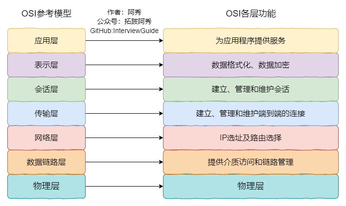
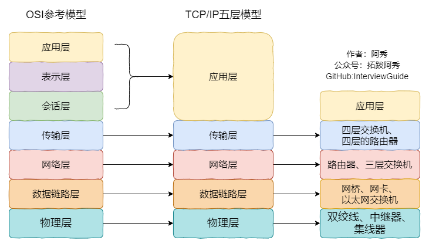

<h1 align="center">Mạng máy tính (Câu 21 - 40)</h1>

  
Đây là 6 thông tin có thể sẽ hữu ích cho bạn:

⭐️1. A Tú cùng bạn bè hợp tác phát triển một website tài nguyên lập trình, hiện đã tổng hợp rất nhiều tài liệu học tập chất lượng và công cụ hữu ích (kèm link tải). Nếu bạn đang tìm kiếm tài nguyên lập trình phù hợp, <a href="https://tools.interviewguide.cn/home" style="text-decoration: underline" target="_blank">hoan nghênh trải nghiệm</a> cũng như giới thiệu những tài nguyên bạn thấy hay. Góp gió thành bão, mình vì mọi người, mọi người vì mình🔥!
  
2. 👉 Tháng 5/2023, trong thời gian <a style="text-decoration: underline" href="https://mp.weixin.qq.com/s?__biz=Mzk0ODU4MzEzMw==&mid=2247512170&idx=1&sn=c4a04a383d2dfdece676b75f17224e78" target="_blank">rời ByteDance để chuyển sang một công ty đa quốc gia</a>, nhằm thuận tiện cho bản thân khi tìm việc và nâng cao tỷ lệ trúng tuyển, A Tú cùng bạn bè đã phát triển từ con số 0 một website giải đề phỏng vấn thực chiến của các Big Tech, bao gồm hai frontend và một backend. Trang web cho phép tra cứu có định hướng đề thi viết của các công ty Internet, ví dụ như muốn tra cứu đề thi viết của ByteDance trong 1 năm gần đây gồm những gì đều có thể làm được. Hoan nghênh trải nghiệm~

Địa chỉ website: <a style="text-decoration: underline" href="https://niumacode.com/home?ref=F6O2625K" target="_blank">Website đề thi thuật toán phỏng vấn Big Tech</a>.
    
3. 😊
    Chia sẻ một website công cụ tiện ích mà A Tú tâm đắc sưu tầm, <a style="text-decoration: underline" href="https://hkjtz.cn/" target="_blank">nhấn vào đây để truy cập</a>, chủ yếu là các ứng dụng, website ngách hữu ích, ngoài ra còn có tài nguyên phim ảnh HD, âm nhạc, phim truyền hình, AI, phim tài liệu, tài liệu thi tiếng Anh, thi công chức, cao học, nghề tay trái...
  

  
4. 😍 Chia sẻ miễn phí tài nguyên học tập mà A Tú đã tích lũy từ khi theo học máy tính, <a style="text-decoration: underline" href="/notes/07-resources/01-free/01-introduce.html" target="_blank">nhấn vào đây để nhận miễn phí</a>; đồng thời cũng lưu lại nhật ký đánh giá <a style="text-decoration: underline" href="/notes/07-resources/02-precious.html" target="_blank">những cuốn sách máy tính, chuyên mục online chất lượng cũng như những khóa học trả phí kém chất lượng</a> từng mua trước đây.
  

  
5. 🚀 Nếu bạn muốn thuận lợi giành được offer tốt hơn trong kỳ tuyển dụng trường học (Campus Recruitment), A Tú khuyên bạn nên xem thêm những <a style="text-decoration: underline" href="https://www.yuque.com/tuobaaxiu/httmmc/npg1k81zeq4wfpyz" target="_blank">cạm bẫy từng vấp phải</a> và <a style="text-decoration: underline"  target="_blank" href="https://www.yuque.com/tuobaaxiu/httmmc/gge9ppd0mbu2d3dp">kinh nghiệm đúc kết</a> của người đi trước. Thực tế, hầu hết các vấn đề bạn đang gặp phải thì các anh chị khóa trước đều đã từng trải qua.
  

  
6. 🔥 Hoan nghênh các bạn đang chuẩn bị cho kỳ tuyển dụng trường học ngành CNTT tham gia <a  style="text-decoration: underline" href="https://www.yuque.com/tuobaaxiu/httmmc/xg0otqvc17wfx4u9" target="_blank">Cộng đồng học tập</a> của tôi. Độc hành một mình chi bằng cùng nhau sưởi ấm, trong nhóm đã đọng lại rất nhiều <a  style="text-decoration: underline" href="https://www.yuque.com/tuobaaxiu/httmmc/gge9ppd0mbu2d3dp" target="_blank">kinh nghiệm và tổng kết</a> của các anh chị khóa 21/22/23/24/25. Kiên trì đi theo lộ trình, cuối cùng đa phần đều có thể nhận được offer ưng ý! Nếu bạn cần phiên bản PDF tổng hợp các điểm kiến thức 📚︎ Bát cổ văn phỏng vấn tuyển dụng trường học trên website 《Ghi chép học tập của A Tú》, có thể <a style="text-decoration: underline" href="https://www.yuque.com/tuobaaxiu/httmmc/qs0yn66apvkzw0ps" target="_blank">nhấn vào đây để tải về</a>.
   

## 21. Quy trình chi tiết HTTPS đảm bảo an toàn truyền tải dữ liệu (TLS Handshake Flow)

1. **ClientHello**: Trình duyệt gửi phiên bản TLS hỗ trợ, chuỗi ngẫu nhiên $R_1$ (Client Random) và danh sách Cipher Suites.
2. **ServerHello & Certificate**: Máy chủ chọn Cipher Suite phù hợp, gửi chuỗi ngẫu nhiên $R_2$ (Server Random), Chứng chỉ số SSL X.509 (chứa Public Key của Server và Chữ ký số từ CA) cùng tham số trao đổi khóa ECDHE.
3. **Xác minh chứng chỉ (Certificate Validation)**: Trình duyệt dùng Khóa công khai của CA tích hợp sẵn trong OS để giải mã chữ ký số, kiểm tra tính hợp lệ và toàn vẹn của chứng chỉ.
4. **Tạo Master Secret**: Trình duyệt gửi tham số khóa công khai của mình ($R_3$), cả hai phía tính toán ra cùng một **Khóa phiên đối xứng (Symmetric Master Key)** từ $R_1, R_2, R_3$.
5. **Mã hóa dữ liệu**: Mọi gói tin HTTP tiếp theo được mã hóa đối xứng bằng AES-GCM với Khóa phiên đối xứng siêu tốc.

## 22. Làm thế nào để đảm bảo Public Key của Server không bị kẻ trung gian (MITM) đánh tráo?

Thông qua **Chứng chỉ số X.509 từ Tổ chức phát hành chứng chỉ uy tín (CA - Certificate Authority)**.
- Khi tạo chứng chỉ, CA dùng Private Key bí mật của CA để ký lên bản Hash của Public Key và Tên miền của Server.
- Trình duyệt và Hệ điều hành lưu sẵn danh sách CA Root Public Keys. Bất kỳ kẻ gian nào cố tình đánh tráo Public Key trong gói tin thì Chữ ký số giải mã ra sẽ không khớp với mã Hash, trình duyệt sẽ lập tức hiện cảnh báo đỏ **"Kết nối không an toàn"**.

## 23. Cấu trúc và Các trường Header quan trọng trong HTTP Request & Response

- **HTTP Request**:
  - *Request Line*: `Method` (GET/POST), `URI`, `HTTP Version`.
  - *Request Headers*: `Host`, `User-Agent`, `Accept`, `Authorization`, `Cookie`, `Content-Type`, `Content-Length`.
  - *Request Body*: Dữ liệu JSON, FormData, file upload.
- **HTTP Response**:
  - *Status Line*: `HTTP Version`, `Status Code` (200, 404, 500), `Status Text`.
  - *Response Headers*: `Content-Type`, `Content-Length`, `Set-Cookie`, `Cache-Control`, `Location`, `Access-Control-Allow-Origin`.
  - *Response Body*: Mã nguồn HTML, CSS, ảnh, JSON data.

## 24. Cookie là gì và tại sao Cookie lại ra đời?

Giao thức HTTP là giao thức phi trạng thái (**Stateless**), máy chủ không lưu giữ bất kỳ ngữ cảnh nào giữa các request. Cookie là một chuỗi dữ liệu nhỏ (tối đa 4KB) do Web Server gửi xuống trình duyệt thông qua header `Set-Cookie`. Trình duyệt sẽ tự động đính kèm Cookie này trong mọi request tiếp theo gửi tới cùng server đó, giúp máy chủ nhận diện trạng thái phiên làm việc của người dùng (User Session / Authentication).

## 25. 3 Ứng dụng chính của Cookie

1. **Quản lý trạng thái phiên (Session Management)**: Lưu Session ID đăng nhập, giỏ hàng thương mại điện tử.
2. **Cá nhân hóa (Personalization)**: Lưu thiết lập giao diện (Dark Mode), ngôn ngữ hiển thị.
3. **Theo dõi hành vi người dùng (User Tracking)**: Google Analytics, Facebook Pixel theo dõi lịch sử duyệt web để gợi ý quảng cáo.

## 26. Tổng quan kiến thức về Session trên Máy chủ

- Session lưu trữ dữ liệu trạng thái của người dùng **trực tiếp trên bộ nhớ Server** (RAM, Redis Cluster, Database).
- Phía Client chỉ cần lưu duy nhất một chuỗi mã ngẫu nhiên **`Session ID`** trong Cookie.
- Khi nhận request, Server trích xuất `Session ID` từ Cookie và truy vấn Redis để lấy toàn bộ Profile người dùng $\rightarrow$ *An toàn hơn nhiều so với việc lưu trữ trực tiếp dữ liệu nhạy cảm ở Client Cookie*.

## 27. Nguyên lý hoạt động của Session

Đăng nhập thành công $\rightarrow$ Server sinh Session ID duy nhất $\rightarrow$ Lưu thông tin vào Redis `{SessionID: UserData}` $\rightarrow$ Gửi `Set-Cookie: JSESSIONID=xyz; HttpOnly` về Client $\rightarrow$ Các request sau tự động gửi `Cookie: JSESSIONID=xyz` $\rightarrow$ Server kiểm tra và xác thực phiên.

## 28. So sánh chi tiết Cookie và Session

| Tiêu chí | Cookie | Session |
| :--- | :--- | :--- |
| **Vị trí lưu trữ** | Phía Client (Trình duyệt) | Phía Server (RAM / Redis) |
| **Độ an toàn** | Kém an toàn (dễ bị tấn công XSS/CSRF đọc trộm nếu thiếu `HttpOnly` / `SameSite`) | An toàn cao (dữ liệu nằm hoàn toàn trên Server) |
| **Giới hạn dung lượng**| Tối đa **4KB** cho mỗi Cookie | Không giới hạn (phụ thuộc vào RAM của Server) |
| **Chi phí máy chủ** | Không tốn RAM server | Chiếm dụng RAM server khi có hàng triệu người dùng online đồng thời |

## 29. Tấn công SQL Injection và Các biện pháp phòng chống triệt để

- **Bản chất**: Kẻ tấn công chèn các đoạn mã SQL độc hại vào ô nhập liệu hoặc tham số HTTP (ví dụ `' OR '1'='1`), khiến câu lệnh SQL động của Backend bị thay đổi ngữ nghĩa và trả về toàn bộ dữ liệu bí mật hoặc vượt qua bước xác thực mật khẩu.
- **Biện pháp phòng ngừa (Chuẩn 100%)**:
  1. **Tuyệt đối không dùng phép cộng chuỗi để ghép SQL**: Bắt buộc sử dụng **PreparedStatement / Parameterized Queries** (dữ liệu đầu vào chỉ được xem là tham số thuần túy, không thể bị biên dịch thành lệnh SQL).
  2. Sử dụng các framework ORM an toàn (MyBatis `#{}`, Hibernate, Entity Framework, GORM).
  3. Validate và làm sạch dữ liệu đầu vào (Input Validation & Whitelist filtering).

## 30. Sơ đồ trực quan Mô hình 7 tầng mạng OSI

## 31. Giao thức RARP (Reverse ARP) là gì và hoạt động như thế nào?

- **Khái niệm**: Giao thức phân giải địa chỉ ngược, dùng để tra cứu **Địa chỉ IP** khi chỉ biết trước **Địa chỉ phần cứng MAC**.
- **Ứng dụng**: Thường dùng cho các thiết bị không có ổ đĩa (Diskless Workstations) khi khởi động qua mạng (Network Booting). Thiết bị phát gói tin RARP Broadcast chứa địa chỉ MAC của mình, RARP Server trong mạng nhận được sẽ tra bảng cấu hình và gửi phản hồi địa chỉ IP tương ứng. Ngày nay RARP đã được thay thế hoàn toàn bởi **DHCP / BOOTP**.

## 32. Phạm vi dải Cổng (Port Range) trong mạng máy tính

Trường Port trong Header TCP/UDP có kích thước **16 bits**, do đó dải cổng hợp lệ từ **0 đến 65535**:
- **0 - 1023 (Well-known Ports - Cổng nổi tiếng)**: Dành riêng cho các dịch vụ hệ thống chuẩn (HTTP: 80, HTTPS: 443, SSH: 22, FTP: 21, DNS: 53).
- **1024 - 49151 (Registered Ports - Cổng đăng ký)**: Dành cho các ứng dụng tùy chọn (MySQL: 3306, Redis: 6379, Tomcat: 8080).
- **49152 - 65535 (Dynamic / Ephemeral Ports - Cổng động)**: Được Hệ điều hành tự động cấp phát cho Client khi mở kết nối Socket ra ngoài.

## 33. Tại sao kiến trúc Mạng máy tính bắt buộc phải chia tầng (Layering Architecture)?

1. **Tính độc lập và module hóa**: Mỗi tầng chỉ tập trung vào một nhiệm vụ duy nhất, không phụ thuộc vào chi tiết cài đặt của các tầng khác.
2. **Tính linh hoạt và dễ nâng cấp**: Thay đổi công nghệ ở một tầng (ví dụ nâng cấp cáp đồng lên Cáp quang hoặc thay IPv4 bằng IPv6) không làm ảnh hưởng đến tầng Ứng dụng phía trên.
3. **Thúc đẩy chuẩn hóa quốc tế**: Cho phép các thiết bị của nhiều hãng sản xuất khác nhau (Cisco, Huawei, Apple, Linux) giao tiếp tương thích hoàn hảo.

## 34. Phân biệt Truy vấn DNS Đệ quy (Recursive) và Truy vấn Lặp (Iterative)

- **Truy vấn Đệ quy (Recursive Query)**: Phía nhận yêu cầu (Local DNS Server) chịu trách nhiệm đi hỏi đến cùng mọi server khác và chỉ trả về kết quả cuối cùng duy nhất (IP hoặc Lỗi) cho Client.
- **Truy vấn Lặp (Iterative Query)**: Phía nhận yêu cầu (Root DNS Server) nếu không có dữ liệu sẽ trả về địa chỉ của máy chủ cấp tiếp theo để người gửi tự đi mà hỏi ("Tôi không biết IP của google.com, nhưng bạn hãy sang hỏi máy chủ `.com` tại địa chỉ X").

## 35. Phân biệt chỉ thị Cache: `private` vs `public` trong Header Cache-Control

- `Cache-Control: private`: Tài nguyên chỉ được lưu trong Cache cá nhân của người dùng (Browser Cache), cấm các Proxy / CDN trung gian lưu trữ (dành cho trang thông tin cá nhân).
- `Cache-Control: public`: Cho phép mọi Proxy, CDN trung gian và Browser tự do lưu Cache và chia sẻ cho nhiều người dùng khác nhau (dành cho file ảnh, CSS, JS tĩnh).

## 36. Quy cách truyền tham số trong phương thức GET

Quy ước chuẩn là nối Query String sau dấu `?` và phân cách các cặp `key=value` bằng ký tự `&`. Tuy nhiên về bản chất ở tầng TCP, mọi thông tin đều là luồng byte, lập trình viên có thể tùy biến chuẩn Restful Path Variable (`/users/123/profile`) hoặc mã hóa Header Token để truyền tham số tùy ý.

## 37. Nguồn gốc giới hạn độ dài của HTTP GET Request

Bản thân chuẩn RFC của giao thức HTTP **hoàn toàn không giới hạn độ dài URL**. Giới hạn này xuất phát từ:
- Giới hạn thanh địa chỉ của từng Trình duyệt (ví dụ IE cũ giới hạn 2083 ký tự, Chrome $\sim 32\text{KB}$).
- Giới hạn an toàn của Web Server (Apache / Nginx thường mặc định giới hạn Buffer Header từ 4KB - 8KB để chống tấn công tràn bộ nhớ đệm Buffer Overflow).

## 38. POST có thực sự an toàn hơn GET không?

- **Về khả năng bảo mật truyền tải mạng**: Cả GET và POST đều là **Plaintext không an toàn** nếu chạy trên HTTP thường (đều bị Hacker bắt trọn gói tin bằng Wireshark). Cả hai chỉ thực sự an toàn khi chạy trên **HTTPS**.
- **Về tính riêng tư người dùng**: POST an toàn hơn GET trong trải nghiệm vì mật khẩu không bị hiện lên thanh URL, không bị lưu vào lịch sử duyệt web và không bị ghi vào Access Log của Web Server.

## 39. Thực hư việc POST sinh ra 2 gói tin TCP (100-continue)?

Một số tài liệu cho rằng POST gửi Header trước rồi chờ `100 Continue` mới gửi Body. Trong thực tế với các trình duyệt hiện đại (Chrome, Firefox), nếu Request Body nhỏ (JSON, Form), Header và Body được đóng gói và **gửi chung trong cùng 1 TCP Segment duy nhất** để tối ưu hóa hiệu năng mạng.

## 40. Tổng kết về Session

Session là cơ chế lưu trữ phiên làm việc an toàn phía máy chủ (Server-side State Management), thường được kết hợp với Redis Cluster để hỗ trợ kiến trúc phân tán đa máy chủ (Distributed Session).
