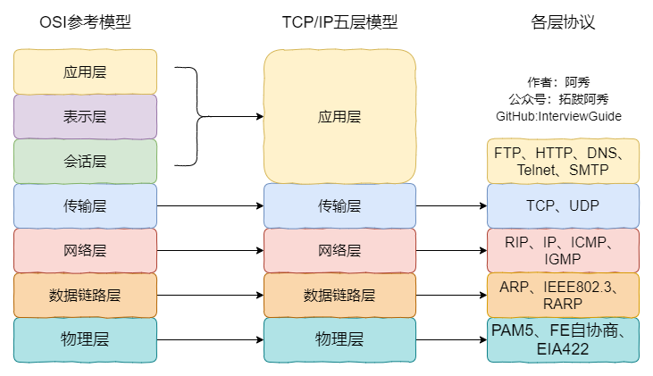
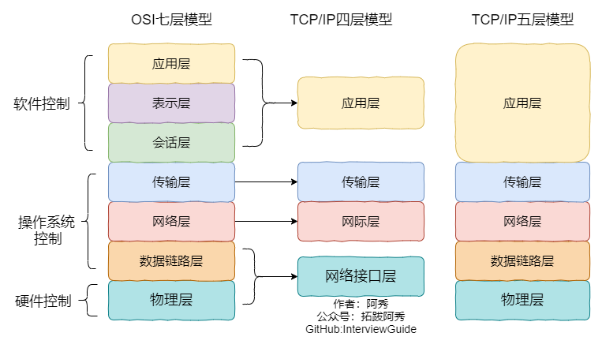
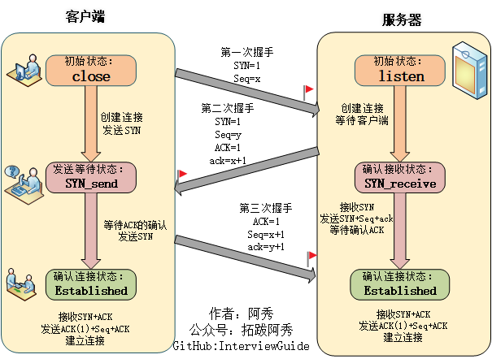

<h1 align="center">Mạng máy tính (Câu 41 - 60)</h1>

  
Đây là 6 thông tin có thể sẽ hữu ích cho bạn:

⭐️1. A Tú cùng bạn bè hợp tác phát triển một website tài nguyên lập trình, hiện đã tổng hợp rất nhiều tài liệu học tập chất lượng và công cụ hữu ích (kèm link tải). Nếu bạn đang tìm kiếm tài nguyên lập trình phù hợp, <a href="https://tools.interviewguide.cn/home" style="text-decoration: underline" target="_blank">hoan nghênh trải nghiệm</a> cũng như giới thiệu những tài nguyên bạn thấy hay. Góp gió thành bão, mình vì mọi người, mọi người vì mình🔥!
  
2. 👉 Tháng 5/2023, trong thời gian <a style="text-decoration: underline" href="https://mp.weixin.qq.com/s?__biz=Mzk0ODU4MzEzMw==&mid=2247512170&idx=1&sn=c4a04a383d2dfdece676b75f17224e78" target="_blank">rời ByteDance để chuyển sang một công ty đa quốc gia</a>, nhằm thuận tiện cho bản thân khi tìm việc và nâng cao tỷ lệ trúng tuyển, A Tú cùng bạn bè đã phát triển từ con số 0 một website giải đề phỏng vấn thực chiến của các Big Tech, bao gồm hai frontend và một backend. Trang web cho phép tra cứu có định hướng đề thi viết của các công ty Internet, ví dụ như muốn tra cứu đề thi viết của ByteDance trong 1 năm gần đây gồm những gì đều có thể làm được. Hoan nghênh trải nghiệm~

Địa chỉ website: <a style="text-decoration: underline" href="https://niumacode.com/home?ref=F6O2625K" target="_blank">Website đề thi thuật toán phỏng vấn Big Tech</a>.
    
3. 😊
    Chia sẻ một website công cụ tiện ích mà A Tú tâm đắc sưu tầm, <a style="text-decoration: underline" href="https://hkjtz.cn/" target="_blank">nhấn vào đây để truy cập</a>, chủ yếu là các ứng dụng, website ngách hữu ích, ngoài ra còn có tài nguyên phim ảnh HD, âm nhạc, phim truyền hình, AI, phim tài liệu, tài liệu thi tiếng Anh, thi công chức, cao học, nghề tay trái...
  

  
4. 😍 Chia sẻ miễn phí tài nguyên học tập mà A Tú đã tích lũy từ khi theo học máy tính, <a style="text-decoration: underline" href="/notes/07-resources/01-free/01-introduce.html" target="_blank">nhấn vào đây để nhận miễn phí</a>; đồng thời cũng lưu lại nhật ký đánh giá <a style="text-decoration: underline" href="/notes/07-resources/02-precious.html" target="_blank">những cuốn sách máy tính, chuyên mục online chất lượng cũng như những khóa học trả phí kém chất lượng</a> từng mua trước đây.
  

  
5. 🚀 Nếu bạn muốn thuận lợi giành được offer tốt hơn trong kỳ tuyển dụng trường học (Campus Recruitment), A Tú khuyên bạn nên xem thêm những <a style="text-decoration: underline" href="https://www.yuque.com/tuobaaxiu/httmmc/npg1k81zeq4wfpyz" target="_blank">cạm bẫy từng vấp phải</a> và <a style="text-decoration: underline"  target="_blank" href="https://www.yuque.com/tuobaaxiu/httmmc/gge9ppd0mbu2d3dp">kinh nghiệm đúc kết</a> của người đi trước. Thực tế, hầu hết các vấn đề bạn đang gặp phải thì các anh chị khóa trước đều đã từng trải qua.
  

  
6. 🔥 Hoan nghênh các bạn đang chuẩn bị cho kỳ tuyển dụng trường học ngành CNTT tham gia <a  style="text-decoration: underline" href="https://www.yuque.com/tuobaaxiu/httmmc/xg0otqvc17wfx4u9" target="_blank">Cộng đồng học tập</a> của tôi. Độc hành một mình chi bằng cùng nhau sưởi ấm, trong nhóm đã đọng lại rất nhiều <a  style="text-decoration: underline" href="https://www.yuque.com/tuobaaxiu/httmmc/gge9ppd0mbu2d3dp" target="_blank">kinh nghiệm và tổng kết</a> của các anh chị khóa 21/22/23/24/25. Kiên trì đi theo lộ trình, cuối cùng đa phần đều có thể nhận được offer ưng ý! Nếu bạn cần phiên bản PDF tổng hợp các điểm kiến thức 📚︎ Bát cổ văn phỏng vấn tuyển dụng trường học trên website 《Ghi chép học tập của A Tú》, có thể <a style="text-decoration: underline" href="https://www.yuque.com/tuobaaxiu/httmmc/qs0yn66apvkzw0ps" target="_blank">nhấn vào đây để tải về</a>.
   

## 41. Quy trình chi tiết xác thực và duy trì trạng thái bằng Session

1. Người dùng gửi Form đăng nhập (Username / Password) lên Server.
2. Server xác thực thông tin thành công $\rightarrow$ Lưu thông tin định danh vào **Redis Cache** với Key là một chuỗi ngẫu nhiên bí mật `Session ID`.
3. Server trả về HTTP Response đính kèm Header: `Set-Cookie: SESSIONID=ab123cd; HttpOnly; Secure; SameSite=Strict`.
4. Trình duyệt lưu Cookie này và tự động đính kèm `Cookie: SESSIONID=ab123cd` trong mọi Request tiếp theo.
5. Server trích xuất `SESSIONID`, tra cứu nhanh trong Redis và cho phép thực thi các logic nghiệp vụ mà không cần đăng nhập lại.

## 42. Tiêu chí lựa chọn kiến trúc giữa Cookie và Session

- **Ưu tiên Cookie**: Lưu dữ liệu tĩnh không nhạy cảm (Theme Dark/Light, Ngôn ngữ hiển thị, ID phân luồng A/B Testing).
- **Ưu tiên Session (Backend Cache / Redis)**: Lưu thông tin quyền hạn, Token tài khoản, Giỏ hàng, Dữ liệu tài chính nhạy cảm.

## 43. 4 Điểm khác biệt mấu chốt giữa Cookie và Session

1. **Vị trí lưu trữ**: Cookie nằm ở Client; Session nằm ở Server.
2. **Kiểu dữ liệu**: Cookie chỉ lưu chuỗi String ASCII thuần túy; Session lưu Object phức tạp.
3. **Dung lượng**: Cookie bị giới hạn 4KB; Session phụ thuộc vào dung lượng RAM máy chủ / Redis.
4. **Cơ chế hết hạn**: Cookie hết hạn theo thời gian tuyệt đối (`Expires/Max-Age`); Session hết hạn theo thời gian nhàn rỗi (Sliding Expiration / Idle Timeout, ví dụ không hoạt động trong 30 phút).

## 44. Tấn công từ chối dịch vụ phân tán DDoS (SYN Flood) và 3 Cách phòng ngừa

- **Bản chất**: Kẻ tấn công huy động mạng Botnet gửi hàng triệu gói tin `SYN` với địa chỉ IP nguồn giả mạo tới Server. Server phản hồi `SYN+ACK` và mở trạng thái chờ `SYN_RECV`, nhưng không bao giờ nhận được `ACK` thứ 3 $\rightarrow$ Làm cạn kiệt Bảng hàng đợi bán kết nối (Half-Open Connection Table / SYN Queue) của Kernel khiến người dùng bình thường không thể kết nối.
- **3 Biện pháp phòng chống**:
  1. Kích hoạt kỹ thuật **SYN Cookies** (`net.ipv4.tcp_syncookies = 1`).
  2. Tăng dung lượng hàng đợi `tcp_max_syn_backlog` và rút ngắn `tcp_synack_retries`.
  3. Sử dụng dịch vụ tường lửa chuyên dụng chống DDoS (Cloudflare, AWS Shield, Anti-DDoS Appliance).

## 45. Phân biệt MTU và MSS trong truyền dẫn gói tin

- **MTU (Maximum Transmission Unit - Đơn vị truyền cực đại)**: Giới hạn kích thước khung dữ liệu lớn nhất mà tầng Liên kết dữ liệu có thể truyền tải. Chuẩn Ethernet có $\text{MTU} = \mathbf{1500\text{ bytes}}$.
- **MSS (Maximum Segment Size - Kích thước đoạn cực đại)**: Lượng dữ liệu hữu ích (Payload) tối đa trong 1 TCP Segment.
  $$\text{MSS} = \text{MTU} - \text{IP Header (20B)} - \text{TCP Header (20B)} = \mathbf{1460\text{ bytes}}$$

## 46. Cơ chế kiểm soát hạn dùng và độ mới của HTTP Cache (Cache Invalidation)

1. **Kiểm tra Cache mạnh (Strong Cache)**:
   - `Cache-Control: max-age=31536000`: Quy định số giây tài nguyên được xem là mới và đọc trực tiếp từ Disk/Memory Cache mà không cần gửi request lên mạng.
   - `Expires`: Xác định mốc thời gian tuyệt đối (bị ảnh hưởng nếu giờ máy client bị sai, HTTP/1.1 ưu tiên `max-age` hơn).
2. **Kiểm tra Cache thỏa thuận (Conditional Cache / Revalidation)**:
   - Khi Cache hết hạn, Client gửi request kèm header `If-None-Match: "etag_hash"` hoặc `If-Modified-Since: "date"`.
   - Nếu tài nguyên trên Server không đổi, Server trả về mã **`304 Not Modified`** (không gửi lại Body), giúp tiết kiệm băng thông tối đa.

## 47. Cấu trúc chi tiết các trường trong TCP Header (20 - 60 Bytes)

- **Source Port & Destination Port (16 bits mỗi trường)**: Cổng nguồn và Cổng đích.
- **Sequence Number (32 bits - seq)**: Số thứ tự byte dữ liệu đầu tiên của gói tin, dùng để ghép dữ liệu tuần tự và chống trùng lặp.
- **Acknowledgment Number (32 bits - ack)**: Số thứ tự byte tiếp theo mà bên nhận đang kỳ vọng.
- **Header Length / Data Offset (4 bits)**: Độ dài tiêu đề TCP (tính theo đơn vị 4 bytes, tối đa $15 \times 4 = 60\text{ bytes}$).
- **6 Cờ điều khiển (Flags - 6 bits)**:
  - `URG`: Urgent Pointer có hiệu lực.
  - `ACK`: Acknowledgment Number có hiệu lực (bắt buộc luôn bật sau bắt tay lần 1).
  - `PSH`: Đẩy dữ liệu lên tầng Ứng dụng ngay lập tức mà không chờ đầy Buffer.
  - `RST`: Reset kết nối đột ngột do gặp lỗi nghiêm trọng.
  - `SYN`: Đồng bộ Sequence Number để bắt đầu thiết lập kết nối.
  - `FIN`: Báo hiệu đã gửi xong dữ liệu, yêu cầu đóng kết nối.
- **Window Size (16 bits)**: Kích thước cửa sổ nhận (Receive Window - `rwnd`), phục vụ Điều khiển luồng (Flow Control).
- **Checksum (16 bits)**: Mã kiểm tra lỗi CRC cho toàn bộ Header và Body TCP.
- **Urgent Pointer (16 bits)**: Con trỏ dữ liệu khẩn cấp.

## 48. Bảng trạng thái máy hữu hạn TCP (TCP State Machine)

- `CLOSED`: Trạng thái đóng ban đầu.
- `LISTEN`: Server đang lắng nghe Socket sẵn sàng nhận kết nối.
- `SYN_SENT`: Client đã gửi gói `SYN`, đang đợi `SYN+ACK`.
- `SYN_RCVD`: Server đã nhận `SYN` và gửi lại `SYN+ACK`, nằm trong Bán kết nối.
- `ESTABLISHED`: Kết nối đã thông suốt, hai bên tự do truyền nhận dữ liệu.
- `FIN_WAIT_1`: Bên chủ động đóng vừa gửi `FIN`.
- `CLOSE_WAIT`: Bên bị động nhận `FIN`, vừa gửi `ACK` và chờ giải phóng tài nguyên nội bộ.
- `FIN_WAIT_2`: Bên chủ động nhận `ACK`, tiếp tục chờ `FIN` từ bên bị động.
- `LAST_ACK`: Bên bị động gửi `FIN` cuối cùng và chờ `ACK`.
- `TIME_WAIT`: Bên chủ động gửi `ACK` cuối cùng và đếm ngược **2MSL** trước khi đóng hoàn toàn.

## 49. Bảng phân tầng các giao thức mạng phổ biến

## 50. Giao thức TCP là gì?

TCP (Transmission Control Protocol) là giao thức truyền thông ở Tầng Giao vận (Transport Layer) có các đặc tính cốt lõi: **Hướng kết nối (Connection-oriented), Đáng tin cậy tuyệt đối (Reliable Delivery), và Hướng luồng byte liên tục (Byte-stream)**.

## 51. Ý nghĩa chuyên sâu của seq, ack và các Cờ trong TCP

- **`seq` (Sequence Number)**: Định danh vị trí của từng byte dữ liệu trong dòng stream, giải quyết bài toán gói tin bị đảo lộn thứ tự khi truyền qua mạng.
- **`ack` (Acknowledgment Number)**: Xác nhận đã nhận an toàn toàn bộ dữ liệu trước đó, giải quyết bài toán mất gói (Packet Loss) qua cơ chế Retransmission.
- **`SYN`**: Cờ mở cổng kết nối.
- **`FIN`**: Cờ hoàn tất truyền dữ liệu để đóng kết nối.

## 52. Tóm tắt vai trò 7 tầng OSI

## 53. Danh mục các giao thức Tầng Ứng dụng và Cổng mặc định

| Giao thức | Tên đầy đủ | Cổng mặc định | Giao thức Tầng Giao vận |
| :--- | :--- | :--- | :--- |
| **HTTP** | HyperText Transfer Protocol | 80 | TCP |
| **HTTPS** | HTTP Secure | 443 | TCP |
| **FTP** | File Transfer Protocol | 20 (Data), 21 (Control) | TCP |
| **SSH** | Secure Shell | 22 | TCP |
| **Telnet** | Telecommunication Network | 23 | TCP |
| **SMTP** | Simple Mail Transfer Protocol | 25 | TCP |
| **POP3** | Post Office Protocol v3 | 110 | TCP |
| **DNS** | Domain Name System | 53 | UDP (Query), TCP (Zone Transfer) |
| **TFTP** | Trivial FTP | 69 | UDP |

## 54. Quản lý vòng đời kết nối TCP giữa Trình duyệt và Máy chủ

- Trong HTTP/1.1 và HTTP/2, kết nối TCP **không bị ngắt sau mỗi request** mà được giữ mở liên tục nhờ cơ chế Persistent Connection (`Keep-Alive`).
- Kết nối chỉ thực sự bị đóng khi: Phía Client hoặc Server gửi Header `Connection: close`, hoặc kết nối không có hoạt động vượt quá ngưỡng `KeepAliveTimeout`.

## 55. Toàn cảnh quá trình Bắt tay 3 bước TCP (Three-way Handshake)

1. **Bước 1 (Client $\rightarrow$ Server)**: Client gửi gói tin `SYN = 1`, chọn số thứ tự ban đầu ngẫu nhiên `seq = x`. Client chuyển sang trạng thái `SYN_SENT`.
2. **Bước 2 (Server $\rightarrow$ Client)**: Server nhận được, gửi lại gói tin `SYN = 1, ACK = 1`, gán `seq = y` và xác nhận `ack = x + 1`. Server chuyển sang trạng thái `SYN_RCVD`.
3. **Bước 3 (Client $\rightarrow$ Server)**: Client gửi gói tin `ACK = 1`, `seq = x + 1` và `ack = y + 1`. Cả hai bên cùng chuyển sang trạng thái `ESTABLISHED`.

## 56. Tại sao bắt buộc phải Bắt tay 3 bước mà không thể là 2 bước?

1. **Xác nhận đầy đủ năng lực gửi và nhận của cả hai phía**: 2 bước chỉ giúp Client biết Server nhận và gửi tốt, nhưng Server chưa thể biết được Client có nhận được phản hồi của mình hay không.
2. **Ngăn chặn việc tạo kết nối "ma" từ các gói tin trễ**: Giả sử gói `SYN` đầu tiên của Client bị nghẽn mạng đi rất chậm. Client đã hủy và gửi `SYN` khác tạo kết nối mới xong xuôi. Một lúc sau, gói `SYN` cũ trễ nải kia mới tới Server. Nếu chỉ có 2 bước, Server lập tức mở kết nối và chờ dữ liệu mãi mãi $\rightarrow$ Gây rò rỉ tài nguyên nghiêm trọng. Bắt tay 3 bước cho phép Client gửi `RST` từ chối kết nối cũ này.

## 57. Hàng đợi Bán kết nối (SYN Queue) và Hàng đợi Toàn kết nối (Accept Queue)

- **SYN Queue (Bán kết nối)**: Lưu trữ các kết nối mới hoàn tất Bước 1 (đang ở trạng thái `SYN_RCVD`).
- **Accept Queue (Toàn kết nối)**: Lưu trữ các kết nối đã hoàn tất Bước 3 (ở trạng thái `ESTABLISHED`), sẵn sàng chờ hàm `accept()` của ứng dụng lấy ra xử lý.
- Nếu Server không nhận được ACK ở bước 3, Server sẽ gửi lại `SYN+ACK` theo cấp số nhân (1s, 2s, 4s, 8s, 16s) trước khi xóa bỏ khỏi SYN Queue.

## 58. Giá trị ISN (Initial Sequence Number) có cố định không?

**Tuyệt đối không cố định!** ISN được sinh ra động dựa trên xung nhịp đồng hồ và hàm băm mật mã: $\text{ISN} = M + F(\text{SrcIP}, \text{SrcPort}, \text{DstIP}, \text{DstPort}, \text{SecretKey})$.
Điều này nhằm ngăn chặn kẻ tấn công dự đoán được chuỗi `seq` để thực hiện tấn công chèn gói tin giả mạo (TCP Sequence Prediction Attack).

## 59. Bắt tay 3 bước có được phép mang theo dữ liệu (Payload) không?

- **Lần 1 và Lần 2: KHÔNG ĐƯỢC PHÉP**. Nếu cho phép mang dữ liệu ở lần 1, kẻ tấn công có thể dễ dàng gửi hàng loạt dữ liệu rác làm tràn bộ nhớ RAM của Server mà không cần thiết lập kết nối (DDoS).
- **Lần 3: HOÀN TOÀN ĐƯỢC PHÉP**. Vì ở bước 3, Client đã xác thực được Server hoạt động và bản thân Client đã chuyển sang trạng thái `ESTABLISHED`.

## 60. Cơ chế của Tấn công SYN Flood và Kỹ thuật SYN Cookies

- Kẻ tấn công gửi ồ ạt `SYN` với IP giả mạo làm tràn ngập SYN Queue của Server.
- **Giải pháp SYN Cookies**: Khi SYN Queue bị đầy, Server không lưu trạng thái vào RAM nữa mà mã hóa thông tin kết nối thành một giá trị `ISN` đặc biệt (Cookie) gửi về trong `SYN+ACK`. Khi Client gửi lại `ACK` bước 3, Server giải mã `ack - 1` để khôi phục lại kết nối ngay lập tức mà không tốn một ô nhớ nào trong lúc chờ.
