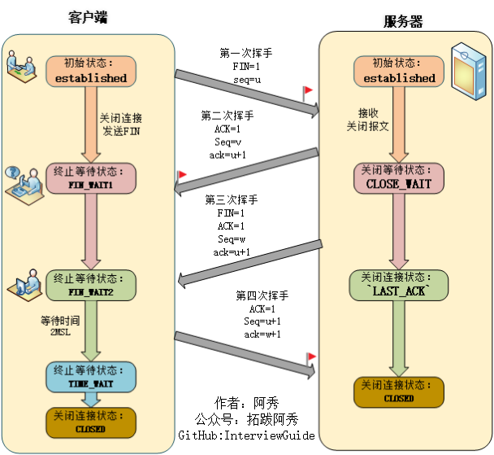
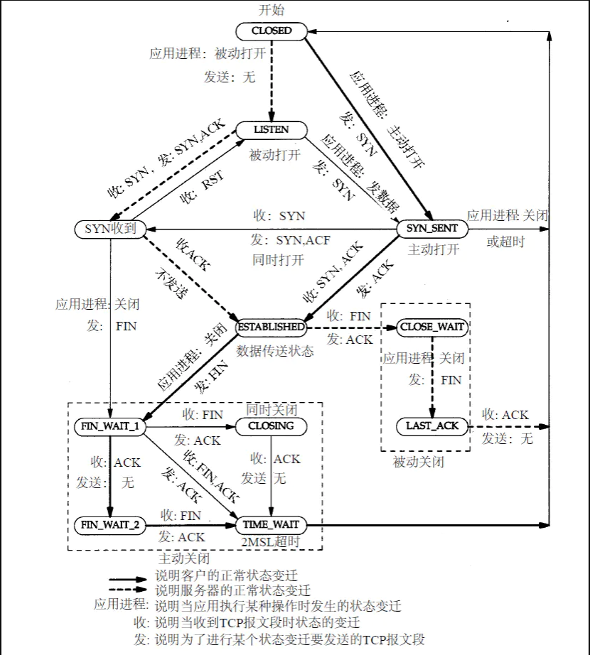
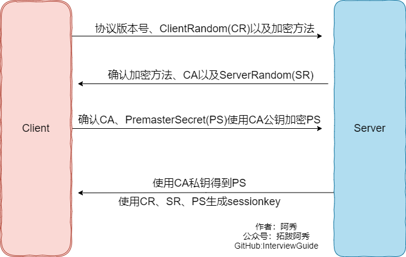
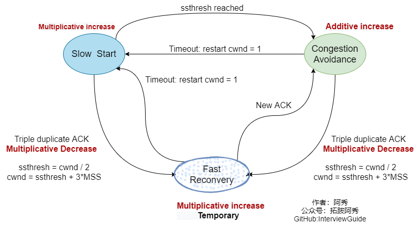
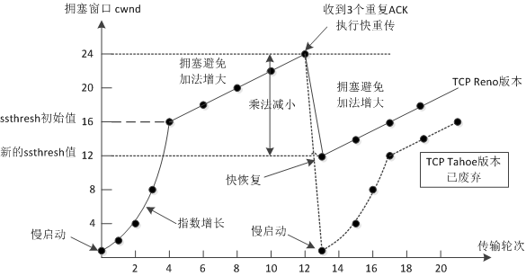
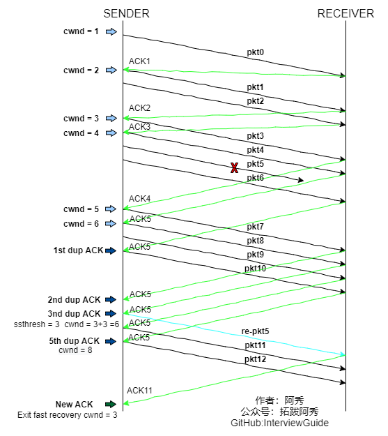

<h1 align="center">Mạng máy tính (Câu 61 - 80)</h1>

  
Đây là 6 thông tin có thể sẽ hữu ích cho bạn:

⭐️1. A Tú cùng bạn bè hợp tác phát triển một website tài nguyên lập trình, hiện đã tổng hợp rất nhiều tài liệu học tập chất lượng và công cụ hữu ích (kèm link tải). Nếu bạn đang tìm kiếm tài nguyên lập trình phù hợp, <a href="https://tools.interviewguide.cn/home" style="text-decoration: underline" target="_blank">hoan nghênh trải nghiệm</a> cũng như giới thiệu những tài nguyên bạn thấy hay. Góp gió thành bão, mình vì mọi người, mọi người vì mình🔥!
  
2. 👉 Tháng 5/2023, trong thời gian <a style="text-decoration: underline" href="https://mp.weixin.qq.com/s?__biz=Mzk0ODU4MzEzMw==&mid=2247512170&idx=1&sn=c4a04a383d2dfdece676b75f17224e78" target="_blank">rời ByteDance để chuyển sang một công ty đa quốc gia</a>, nhằm thuận tiện cho bản thân khi tìm việc và nâng cao tỷ lệ trúng tuyển, A Tú cùng bạn bè đã phát triển từ con số 0 một website giải đề phỏng vấn thực chiến của các Big Tech, bao gồm hai frontend và một backend. Trang web cho phép tra cứu có định hướng đề thi viết của các công ty Internet, ví dụ như muốn tra cứu đề thi viết của ByteDance trong 1 năm gần đây gồm những gì đều có thể làm được. Hoan nghênh trải nghiệm~

Địa chỉ website: <a style="text-decoration: underline" href="https://niumacode.com/home?ref=F6O2625K" target="_blank">Website đề thi thuật toán phỏng vấn Big Tech</a>.
    
3. 😊
    Chia sẻ một website công cụ tiện ích mà A Tú tâm đắc sưu tầm, <a style="text-decoration: underline" href="https://hkjtz.cn/" target="_blank">nhấn vào đây để truy cập</a>, chủ yếu là các ứng dụng, website ngách hữu ích, ngoài ra còn có tài nguyên phim ảnh HD, âm nhạc, phim truyền hình, AI, phim tài liệu, tài liệu thi tiếng Anh, thi công chức, cao học, nghề tay trái...
  

  
4. 😍 Chia sẻ miễn phí tài nguyên học tập mà A Tú đã tích lũy từ khi theo học máy tính, <a style="text-decoration: underline" href="/notes/07-resources/01-free/01-introduce.html" target="_blank">nhấn vào đây để nhận miễn phí</a>; đồng thời cũng lưu lại nhật ký đánh giá <a style="text-decoration: underline" href="/notes/07-resources/02-precious.html" target="_blank">những cuốn sách máy tính, chuyên mục online chất lượng cũng như những khóa học trả phí kém chất lượng</a> từng mua trước đây.
  

  
5. 🚀 Nếu bạn muốn thuận lợi giành được offer tốt hơn trong kỳ tuyển dụng trường học (Campus Recruitment), A Tú khuyên bạn nên xem thêm những <a style="text-decoration: underline" href="https://www.yuque.com/tuobaaxiu/httmmc/npg1k81zeq4wfpyz" target="_blank">cạm bẫy từng vấp phải</a> và <a style="text-decoration: underline"  target="_blank" href="https://www.yuque.com/tuobaaxiu/httmmc/gge9ppd0mbu2d3dp">kinh nghiệm đúc kết</a> của người đi trước. Thực tế, hầu hết các vấn đề bạn đang gặp phải thì các anh chị khóa trước đều đã từng trải qua.
  

  
6. 🔥 Hoan nghênh các bạn đang chuẩn bị cho kỳ tuyển dụng trường học ngành CNTT tham gia <a  style="text-decoration: underline" href="https://www.yuque.com/tuobaaxiu/httmmc/xg0otqvc17wfx4u9" target="_blank">Cộng đồng học tập</a> của tôi. Độc hành một mình chi bằng cùng nhau sưởi ấm, trong nhóm đã đọng lại rất nhiều <a  style="text-decoration: underline" href="https://www.yuque.com/tuobaaxiu/httmmc/gge9ppd0mbu2d3dp" target="_blank">kinh nghiệm và tổng kết</a> của các anh chị khóa 21/22/23/24/25. Kiên trì đi theo lộ trình, cuối cùng đa phần đều có thể nhận được offer ưng ý! Nếu bạn cần phiên bản PDF tổng hợp các điểm kiến thức 📚︎ Bát cổ văn phỏng vấn tuyển dụng trường học trên website 《Ghi chép học tập của A Tú》, có thể <a style="text-decoration: underline" href="https://www.yuque.com/tuobaaxiu/httmmc/qs0yn66apvkzw0ps" target="_blank">nhấn vào đây để tải về</a>.
   

## 61. Chi tiết quá trình Bắt tay 4 bước đóng kết nối TCP (Four-way Wave)

1. **Lần 1 (Client $\rightarrow$ Server)**: Client gửi gói tin `FIN = 1, seq = u`. Client chuyển sang trạng thái `FIN_WAIT_1` (báo hiệu: "Tôi đã gửi xong hết dữ liệu, yêu cầu đóng chiều gửi").
2. **Lần 2 (Server $\rightarrow$ Client)**: Server nhận được `FIN`, gửi lại `ACK = 1, ack = u + 1, seq = v`. Server chuyển sang trạng thái `CLOSE_WAIT`. Client nhận được `ACK` chuyển sang `FIN_WAIT_2` (kết nối ở trạng thái Bán đóng - Half-Closed: Client không gửi nữa nhưng vẫn có thể nhận dữ liệu từ Server).
3. **Lần 3 (Server $\rightarrow$ Client)**: Khi Server đã truyền xong hết mọi dữ liệu còn tồn đọng, Server gửi `FIN = 1, ACK = 1, seq = w, ack = u + 1`. Server chuyển sang `LAST_ACK`.
4. **Lần 4 (Client $\rightarrow$ Server)**: Client gửi `ACK = 1, seq = u + 1, ack = w + 1`. Client chuyển sang trạng thái `TIME_WAIT` và đếm ngược **2MSL** trước khi chuyển sang `CLOSED`. Server nhận được `ACK` lập tức chuyển sang `CLOSED`.

## 62. Tại sao đóng kết nối TCP cần tới 4 bước (Bắt tay 4 lần)?

Bởi vì kết nối TCP là **Toàn song công (Full-duplex)**:
- Khi Client gửi `FIN`, nó chỉ đóng chiều gửi của Client. Phía Server nhận được `FIN` chỉ có thể phản hồi ngay một gói `ACK` để xác nhận, nhưng Server có thể vẫn còn dữ liệu chưa gửi xong cho Client.
- Chỉ khi Server thực sự gửi hết toàn bộ dữ liệu của mình, Server mới chủ động gửi gói `FIN` thứ hai. Vì `ACK` và `FIN` của Server không thể gộp chung lại được trong trường hợp này, nên bắt buộc phải chia thành 4 bước độc lập.

## 63. Trạng thái TIME_WAIT và Khái niệm 2MSL

- **MSL (Maximum Segment Lifetime)**: Thời gian tồn tại tối đa của một gói tin trong không gian mạng trước khi bị router hủy bỏ (theo chuẩn RFC là 2 phút, thực tế trên Linux thường là 30s hoặc 60s).
- **2MSL = 2 $\times$ MSL**: Khoảng thời gian để một gói tin đi hết 1 vòng khứ hồi (Round-Trip) từ Client sang Server và ngược lại.
- Khi ở trạng thái `TIME_WAIT`, cặp Socket (Client IP:Port, Server IP:Port) bị khóa tạm thời trong 2MSL để đảm bảo an toàn tuyệt đối.

## 64. 2 Ý nghĩa sống còn của việc đợi 2MSL ở trạng thái TIME_WAIT

1. **Đảm bảo gói tin ACK cuối cùng đến được Server an toàn**: Nếu gói `ACK` bước 4 bị rơi trên đường truyền, Server ở trạng thái `LAST_ACK` sẽ gửi lại gói `FIN`. Nhờ đang giữ `TIME_WAIT`, Client có thể nhận được `FIN` gửi lại và phát lại `ACK` lần nữa. Nếu Client đóng ngay (`CLOSED`), Server sẽ bị kẹt ở `LAST_ACK` hoặc nhận lỗi Reset `RST`.
2. **Quét sạch mọi gói tin cũ (Ghost Packets) còn lang thang trên mạng**: Thời gian 2MSL đủ để tất cả các gói tin cũ của phiên kết nối vừa rồi biến mất hoàn toàn, tránh việc kết nối mới tạo sau đó với cùng IP/Port bị nhầm lẫn dữ liệu của kết nối cũ.

## 65. Tại sao Client phải qua TIME_WAIT mới được về CLOSED?

Để dự phòng trường hợp gói tin xác nhận `ACK` cuối cùng bị mất trên mạng, Server gửi lại `FIN` (tốn 1 MSL) và Client gửi lại `ACK` (tốn thêm 1 MSL) $\rightarrow$ Tổng cộng đúng **2MSL** để chu kỳ khôi phục lỗi hoàn tất trơn tru.

## 66. Xử lý triệt để bài toán Dính gói (Sticky Packet) trong TCP

- Tắt Nagle (`TCP_NODELAY`) khi cần truyền dữ liệu thời gian thực cực ngắn.
- Thêm độ dài cố định trong Packet Header (ví dụ 4 bytes `Length` đầu).
- Dùng ký tự phân tách đặc biệt (`\r\n`) cho dữ liệu văn bản.

## 67. Chức năng của Tầng Trình diễn (Presentation) và Tầng Phiên (Session)

- **Presentation Layer**: Mã hóa/Giải mã dữ liệu (TLS/SSL), Nén dữ liệu (Gzip), Chuyển đổi bảng mã ký tự.
- **Session Layer**: Thiết lập, duy trì, kiểm soát quyền đồng bộ và khôi phục điểm gián đoạn (Checkpointing) của các phiên làm việc giữa 2 ứng dụng.

## 68. Sơ đồ biến chuyển máy trạng thái TCP (TCP State Transition Diagram)

## 69. Ưu và nhược điểm của Mã hóa đối xứng (Symmetric Encryption)

- **Ưu điểm**: Tốc độ tính toán mã hóa và giải mã cực nhanh, tốn rất ít CPU, phù hợp truyền tải khối lượng dữ liệu khổng lồ (AES, ChaCha20, DES).
- **Nhược điểm**: Khó khăn trong việc phân phối khóa bí mật (Secret Key) an toàn qua môi trường mạng công cộng không an toàn.

## 70. Ưu và nhược điểm của Mã hóa bất đối xứng (Asymmetric Encryption)

- **Ưu điểm**: Phân phối khóa công khai (Public Key) cực kỳ an toàn mà không sợ bị lộ Private Key bí mật; hỗ trợ Chữ ký số (Digital Signature) xác minh danh tính và tính toàn vẹn (RSA, ECC, ECDSA).
- **Nhược điểm**: Tốc độ tính toán số học rất chậm (chậm hơn mã hóa đối xứng từ vài trăm đến hàng ngàn lần), không phù hợp để mã hóa dữ liệu lớn.

## 71. HTTPS là gì?

HTTPS là giao thức HTTP chạy trên nền đường hầm bảo mật **SSL/TLS** (`HTTP` $\rightarrow$ `SSL/TLS` $\rightarrow$ `TCP` $\rightarrow$ `IP`), cung cấp 3 tính năng bảo vệ an ninh trọng yếu: **Bảo mật (Encryption), Xác thực danh tính (Authentication) và Toàn vẹn dữ liệu (Data Integrity)**.

## 72. 3 Nhược điểm của HTTP truyền thống

1. Truyền văn bản thô Plaintext $\rightarrow$ Dễ bị bắt gói tin nghe lén (Sniffing).
2. Không xác minh danh tính bên giao tiếp $\rightarrow$ Dễ bị tấn công giả mạo Server/Client (Spoofing).
3. Không kiểm tra toàn vẹn $\rightarrow$ Dễ bị sửa đổi dữ liệu giữa đường (Tampering / Man-in-the-middle).

## 73. Mô hình Mã hóa lai trong HTTPS (Hybrid Encryption Flow)

HTTPS kết hợp ưu điểm của cả hai:
1. Dùng **Mã hóa bất đối xứng (RSA / ECDHE)** trong pha bắt tay để trao đổi **Khóa phiên (Session Key)** an toàn.
2. Dùng **Mã hóa đối xứng (AES / ChaCha20)** với Khóa phiên đó để mã hóa toàn bộ dữ liệu ứng dụng truyền đi.

## 74. Tại sao Refresh F5 trang web không cần bắt tay lại SSL?

Vì Trình duyệt và Server duy trì kết nối TCP mở (`Keep-Alive`) và tái sử dụng **Session Resumption / TLS Session Tickets** (gửi Session ID hoặc Encrypted Ticket trong ClientHello), giúp bỏ qua pha tính toán bắt tay TLS nặng nề (0-RTT / 1-RTT).

## 75. Chứng chỉ số CA (Digital Certificate) là gì?

Là tệp chứng thực số do Tổ chức CA uy tín (Let's Encrypt, DigiCert) cấp, chứa Public Key của Server, Tên miền đã đăng ký, Thời hạn hiệu lực và Chữ ký số của CA. Client dùng Public Key của CA trong hệ điều hành để xác thực chứng chỉ không bị làm giả.

## 76. Cách vô hiệu hóa và kiểm tra Cache trong HTTP

- **Cấm hoàn toàn việc lưu Cache**: `Cache-Control: no-store`.
- **Bắt buộc xác thực lại với Server trước khi dùng Cache**: `Cache-Control: no-cache`.

## 77. Giới hạn dung lượng truyền tải dữ liệu của GET và POST

- **GET**: Bị giới hạn bởi chiều dài URL của Trình duyệt / Server (thường từ **2KB đến 8KB**).
- **POST**: Chuẩn HTTP không giới hạn dung lượng, nhưng bị khống chế bởi cấu hình của Web Server / Application (ví dụ Nginx: `client_max_body_size 20M`, PHP: `upload_max_filesize 2M`).

## 78. Các giao thức cốt lõi ở Tầng Mạng (Network Layer)

- **IP (Internet Protocol)**: Định địa chỉ logic IPv4/IPv6 và định tuyến gói tin.
- **ICMP (Internet Control Message Protocol)**: Báo cáo lỗi mạng và chẩn đoán đường truyền (giao thức nền tảng của lệnh `ping` và `traceroute`).
- **IGMP (Internet Group Management Protocol)**: Quản lý thành viên mạng đa hướng (Multicast).
- **RIP / OSPF / BGP**: Các giao thức định tuyến động nội miền và liên miền.

## 79. 4 Thuật toán điều khiển tắc nghẽn TCP (Congestion Control - Cực kỳ quan trọng)

1. **Slow Start (Khởi động chậm)**:
   - Khởi tạo cửa sổ tắc nghẽn `cwnd = 1 MSS`.
   - Mỗi lần nhận được một ACK, `cwnd` tăng 1. Sau mỗi vòng RTT, `cwnd` **tăng gấp đôi theo hàm mũ ($2^n$)**.
   - Khi `cwnd >= ssthresh` (Ngưỡng khởi động chậm), chuyển sang thuật toán Né tắc nghẽn.
2. **Congestion Avoidance (Né tắc nghẽn)**:
   - Sau mỗi vòng RTT, `cwnd` chỉ **tăng tuyến tính $+1\text{ MSS}$** ($cwnd = cwnd + 1/cwnd$), giúp cửa sổ tăng từ từ thăm dò băng thông tối đa.
3. **Congestion Detection (Xử lý khi xảy ra tắc nghẽn / Rớt gói)**:
   - **Trường hợp RTO Timeout (Nghiêm trọng)**: `ssthresh = cwnd / 2`, đưa `cwnd` về ngay $1\text{ MSS}$, quay lại Khởi động chậm từ đầu (TCP Tahoe).
   - **Trường hợp nhận 3 Dup-ACK liên tiếp (Nhẹ hơn)**: Kích hoạt **Fast Retransmit** (truyền lại gói mất ngay mà không đợi RTO) và chuyển sang **Fast Recovery** (TCP Reno).
4. **Fast Recovery (Khôi phục nhanh)**:
   - `ssthresh = cwnd / 2`, đặt `cwnd = ssthresh + 3 MSS`.
   - Mỗi khi nhận thêm Dup-ACK, tăng `cwnd` lên 1.
   - Khi nhận được ACK mới (xác nhận gói truyền lại thành công), đặt `cwnd = ssthresh` và quay lại trạng thái Né tắc nghẽn.
- 
- 

## 80. Tại sao Fast Retransmit lại chọn mốc 3 lần Duplicate ACK?

- **1 hoặc 2 Dup-ACK**: Rất có thể do hiện tượng **Gói tin bị đảo lộn thứ tự (Packet Reordering)** trên các đường truyền mạng khác nhau, không nhất thiết là bị rớt gói.
- **3 Dup-ACK liên tiếp**: Xác suất toán học cực cao khẳng định gói tin đó đã thực sự **bị rơi mất (Packet Lost)** trên mạng, đồng thời khẳng định mạng vẫn đang thông suốt (vì các gói tin sau vẫn tới nơi an toàn để bên nhận phát liên tiếp 3 ACK xác nhận). Việc truyền lại ngay lập tức tại mốc này giúp hệ thống tối ưu hóa thông lượng mà không phải chờ đợi lãng phí đồng hồ Timeout RTO.
