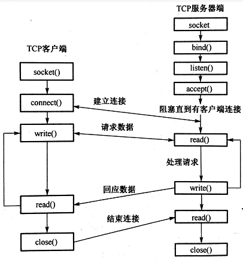
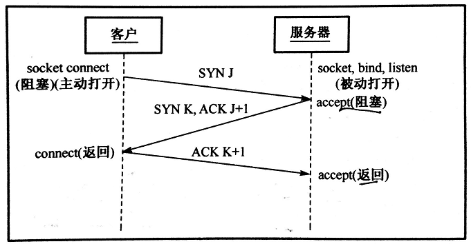

<h1 align="center">Mạng máy tính (Câu 81 - 100)</h1>

  
Đây là 6 thông tin có thể sẽ hữu ích cho bạn:

⭐️1. A Tú cùng bạn bè hợp tác phát triển một website tài nguyên lập trình, hiện đã tổng hợp rất nhiều tài liệu học tập chất lượng và công cụ hữu ích (kèm link tải). Nếu bạn đang tìm kiếm tài nguyên lập trình phù hợp, <a href="https://tools.interviewguide.cn/home" style="text-decoration: underline" target="_blank">hoan nghênh trải nghiệm</a> cũng như giới thiệu những tài nguyên bạn thấy hay. Góp gió thành bão, mình vì mọi người, mọi người vì mình🔥!
  
2. 👉 Tháng 5/2023, trong thời gian <a style="text-decoration: underline" href="https://mp.weixin.qq.com/s?__biz=Mzk0ODU4MzEzMw==&mid=2247512170&idx=1&sn=c4a04a383d2dfdece676b75f17224e78" target="_blank">rời ByteDance để chuyển sang một công ty đa quốc gia</a>, nhằm thuận tiện cho bản thân khi tìm việc và nâng cao tỷ lệ trúng tuyển, A Tú cùng bạn bè đã phát triển từ con số 0 một website giải đề phỏng vấn thực chiến của các Big Tech, bao gồm hai frontend và một backend. Trang web cho phép tra cứu có định hướng đề thi viết của các công ty Internet, ví dụ như muốn tra cứu đề thi viết của ByteDance trong 1 năm gần đây gồm những gì đều có thể làm được. Hoan nghênh trải nghiệm~

Địa chỉ website: <a style="text-decoration: underline" href="https://niumacode.com/home?ref=F6O2625K" target="_blank">Website đề thi thuật toán phỏng vấn Big Tech</a>.
    
3. 😊
    Chia sẻ một website công cụ tiện ích mà A Tú tâm đắc sưu tầm, <a style="text-decoration: underline" href="https://hkjtz.cn/" target="_blank">nhấn vào đây để truy cập</a>, chủ yếu là các ứng dụng, website ngách hữu ích, ngoài ra còn có tài nguyên phim ảnh HD, âm nhạc, phim truyền hình, AI, phim tài liệu, tài liệu thi tiếng Anh, thi công chức, cao học, nghề tay trái...
  

  
4. 😍 Chia sẻ miễn phí tài nguyên học tập mà A Tú đã tích lũy từ khi theo học máy tính, <a style="text-decoration: underline" href="/notes/07-resources/01-free/01-introduce.html" target="_blank">nhấn vào đây để nhận miễn phí</a>; đồng thời cũng lưu lại nhật ký đánh giá <a style="text-decoration: underline" href="/notes/07-resources/02-precious.html" target="_blank">những cuốn sách máy tính, chuyên mục online chất lượng cũng như những khóa học trả phí kém chất lượng</a> từng mua trước đây.
  

  
5. 🚀 Nếu bạn muốn thuận lợi giành được offer tốt hơn trong kỳ tuyển dụng trường học (Campus Recruitment), A Tú khuyên bạn nên xem thêm những <a style="text-decoration: underline" href="https://www.yuque.com/tuobaaxiu/httmmc/npg1k81zeq4wfpyz" target="_blank">cạm bẫy từng vấp phải</a> và <a style="text-decoration: underline"  target="_blank" href="https://www.yuque.com/tuobaaxiu/httmmc/gge9ppd0mbu2d3dp">kinh nghiệm đúc kết</a> của người đi trước. Thực tế, hầu hết các vấn đề bạn đang gặp phải thì các anh chị khóa trước đều đã từng trải qua.
  

  
6. 🔥 Hoan nghênh các bạn đang chuẩn bị cho kỳ tuyển dụng trường học ngành CNTT tham gia <a  style="text-decoration: underline" href="https://www.yuque.com/tuobaaxiu/httmmc/xg0otqvc17wfx4u9" target="_blank">Cộng đồng học tập</a> của tôi. Độc hành một mình chi bằng cùng nhau sưởi ấm, trong nhóm đã đọng lại rất nhiều <a  style="text-decoration: underline" href="https://www.yuque.com/tuobaaxiu/httmmc/gge9ppd0mbu2d3dp" target="_blank">kinh nghiệm và tổng kết</a> của các anh chị khóa 21/22/23/24/25. Kiên trì đi theo lộ trình, cuối cùng đa phần đều có thể nhận được offer ưng ý! Nếu bạn cần phiên bản PDF tổng hợp các điểm kiến thức 📚︎ Bát cổ văn phỏng vấn tuyển dụng trường học trên website 《Ghi chép học tập của A Tú》, có thể <a style="text-decoration: underline" href="https://www.yuque.com/tuobaaxiu/httmmc/qs0yn66apvkzw0ps" target="_blank">nhấn vào đây để tải về</a>.
   

## 80. Lý do chọn ngưỡng 3 Dup-ACK trong Thuật toán Fast Retransmit

Nhằm phân biệt rạch ròi giữa hiện tượng **Gói tin bị đổi thứ tự (Reordering - chỉ sinh ra 1-2 Dup-ACK)** và **Rơi mất gói thực sự (Packet Loss - sinh ra từ 3 Dup-ACK trở lên)**. Giúp TCP không bị giảm tốc độ gửi oan uổng khi mạng chỉ bị đảo thứ tự nhẹ.

## 81. Bản chất các trạng thái FIN_WAIT_2, CLOSE_WAIT và TIME_WAIT

- **`FIN_WAIT_2`**: Trạng thái Bán đóng (Half-Closed) phía chủ động đóng. Bên chủ động đã gửi xong dữ liệu và nhận được ACK, đang chờ bên bị động gửi nốt FIN.
- **`CLOSE_WAIT`**: Phía bị động nhận FIN và gửi lại ACK. Lúc này ứng dụng cần tranh thủ gửi nốt dữ liệu còn tồn trong bộ đệm trước khi gọi `close()`.
- **`TIME_WAIT`**: Phía chủ động gửi ACK cuối cùng và duy trì đồng hồ 2MSL để xử lý rớt gói tin cuối và dọn sạch các gói trôi nổi trên mạng.

## 82. Nguyên lý Điều khiển luồng (Flow Control) bằng Cửa sổ trượt (Sliding Window)

- **Mục đích**: Đồng bộ tốc độ giữa Bên gửi (nhanh) và Bên nhận (chậm) để ngăn ngừa tràn bộ nhớ đệm nhận (Receive Buffer).
- **Cơ chế**: Bên nhận trả về trường **Receive Window (`rwnd`)** trong TCP Header báo cho bên gửi biết dung lượng bộ đệm còn trống. Bên gửi duy trì **Send Window $\le \text{rwnd}$**, chỉ được phép gửi tối đa lượng byte cho phép. Khi $\text{rwnd} = 0$, bên gửi dừng phát và định kỳ gửi gói tin thăm dò 1 byte (Zero Window Probe).

## 83. Trình tự các System Call thiết lập TCP Socket Server và Client trong Linux C/C++

- **Phía Server**:
  1. `int socket(AF_INET, SOCK_STREAM, 0)`: Tạo Socket lắng nghe (`listenfd`).
  2. `int bind(sockfd, &addr, sizeof(addr))`: Ràng buộc IP và Port vào Socket.
  3. `int listen(sockfd, backlog)`: Chuyển Socket sang chế độ lắng nghe và thiết lập dung lượng Hàng đợi kết nối.
  4. `int accept(sockfd, &cli_addr, &len)`: Lấy 1 kết nối đã hoàn tất 3 bước bắt tay từ Accept Queue ra, trả về một **File Descriptor kết nối mới (`connfd`)**.
  5. `read()` / `write()` qua `connfd`.
  6. `close(connfd)` khi xong việc và `close(sockfd)` khi tắt server.
- **Phía Client**:
  1. `int socket(AF_INET, SOCK_STREAM, 0)`: Tạo Socket Client.
  2. `int connect(sockfd, &serv_addr, sizeof(serv_addr))`: Kích hoạt bắt tay 3 bước TCP tới Server.
  3. `write()` / `read()`.
  4. `close(sockfd)`.

## 84. 5 Cơ chế đảm bảo tính tin cậy tuyệt đối của TCP (Reliable Transmission)

1. **Đánh số thứ tự (Sequence Number)**: Đảm bảo dữ liệu đến nơi theo đúng thứ tự ban đầu, loại bỏ các gói tin bị trùng lặp.
2. **Xác nhận và Truyền lại (ACK & Retransmission)**: Dùng Timer RTO và Fast Retransmit để gửi lại các gói bị mất.
3. **Mã kiểm tra toàn vẹn (Checksum)**: Phát hiện gói tin bị sai lệch Bit trên đường truyền vật lý.
4. **Điều khiển luồng (Flow Control)**: Dùng Sliding Window để bên gửi không làm tràn bộ đệm bên nhận.
5. **Điều khiển tắc nghẽn (Congestion Control)**: Điều tiết lượng gói tin đưa vào hạ tầng mạng (Slow Start, Congestion Avoidance, Fast Recovery).

## 85. Giao thức UDP (User Datagram Protocol) là gì?

Là giao thức Tầng Giao vận **Phi kết nối (Connectionless)**, cung cấp dịch vụ truyền dữ liệu **Cố gắng tối đa (Best-effort Delivery - không đảm bảo tin cậy, không kiểm soát tắc nghẽn, không sắp xếp thứ tự)**, nhưng có tốc độ siêu nhanh và độ trễ cực thấp.

## 86. So sánh toàn diện giữa TCP và UDP

| Tiêu chí | TCP | UDP |
| :--- | :--- | :--- |
| **Tính kết nối** | Hướng kết nối (Bắt tay 3 bước) | Phi kết nối (Gửi ngay lập tức) |
| **Độ tin cậy** | Đáng tin cậy 100% (Không mất, không trùng, đúng thứ tự) | Không tin cậy (Có thể mất gói, đảo thứ tự) |
| **Cấu trúc dữ liệu** | Hướng dòng Byte liên tục (Byte Stream) | Hướng Gói tin rời rạc (Datagram) |
| **Điều khiển tắc nghẽn**| Có kiểm soát tắc nghẽn và điều khiển luồng | Không có, phát dữ liệu với tốc độ cố định |
| **Mô hình truyền** | Điểm - Điểm (Chỉ Unicast 1-1) | Unicast, Broadcast (1-All), Multicast (1-N) |
| **Kích thước Header** | 20 - 60 Bytes | Cố định **8 Bytes** |
| **Ứng dụng tiêu biểu**| Web (HTTP/HTTPS), Tệp (FTP), Email (SMTP) | Game Online, Live Streaming, Video Call, DNS |

## 87. Tổng hợp các đặc tính của UDP và TCP

- **UDP**: Phi kết nối, Header gọn nhẹ 8 byte, Hướng thông điệp (không chia nhỏ/ghép chuỗi), Hỗ trợ Multicast/Broadcast, Phù hợp thời gian thực.
- **TCP**: Toàn song công (Full-duplex), Điểm-điểm, Đảm bảo thứ tự, Kiểm soát luồng và nghẽn.

## 88. Các giao thức Ứng dụng chạy trên nền TCP

- **HTTP (80) / HTTPS (443)**: Web.
- **FTP (20, 21)**: Truyền file.
- **SSH (22) / Telnet (23)**: Điều khiển từ xa.
- **SMTP (25) / POP3 (110) / IMAP (143)**: Gửi/nhận Email.

## 89. Các giao thức Ứng dụng chạy trên nền UDP

- **DNS (53)**: Truy vấn tên miền Client $\rightarrow$ Server.
- **DHCP / BOOTP (67, 68)**: Cấp phát IP tự động.
- **TFTP (69)**: Truyền file đơn giản.
- **SNMP (161)**: Giám sát thiết bị mạng.
- **RTP / RTCP**: Truyền âm thanh/video thời gian thực.

## 90. Các giao thức ở Tầng Liên kết dữ liệu (Data Link Layer)

- **ARP (Address Resolution Protocol)**: Dịch IP sang MAC.
- **RARP (Reverse ARP)**: Dịch MAC sang IP.
- **PPP (Point-to-Point Protocol)**: Kết nối điểm-điểm qua đường truyền quay số/cáp quang trực tiếp.

## 91. Nguyên lý hoạt động của lệnh ping và Giao thức ICMP

Lệnh `ping` chạy trực tiếp trên nền **Tầng Mạng (Network Layer)** thông qua giao thức **ICMP (Internet Control Message Protocol)**:
1. Máy nguồn gửi gói tin **`ICMP Echo Request` (Type 8, Code 0)** tới IP đích.
2. Nếu máy đích tồn tại và reachable, nó sẽ phản hồi lại gói tin **`ICMP Echo Reply` (Type 0, Code 0)**.
3. Bên gửi tính toán độ trễ RTT dựa trên chênh lệch thời gian gửi và nhận.

## 92. Kích thước Payload tối ưu khi lập trình UDP Socket

- Trong mạng cục bộ LAN ($\text{MTU} = 1500\text{B}$): Nên gửi gói có dữ liệu $\le \mathbf{1472\text{ bytes}}$ ($1500 - 20\text{B IP} - 8\text{B UDP}$) để tránh phân mảnh IP (IP Fragmentation).
- Trên môi trường Internet công cộng: Để đảm bảo an toàn tuyệt đối qua mọi loại Router cổ điển ($\text{MTU} = 576\text{B}$), khuyến nghị kích thước Payload $\le \mathbf{548\text{ bytes}}$ ($576 - 20 - 8$).

## 93. Chi tiết cơ chế Cửa sổ trượt (Sliding Window)

- Bên nhận dùng `rwnd` để giới hạn số byte tối đa mà bên gửi được phép truyền khi chưa nhận ACK.
- Khi buffer bên nhận đầy $\rightarrow$ `rwnd = 0` $\rightarrow$ Bên gửi dừng phát và khởi động Timer thăm dò (Probe Timer) để tránh bế tắc (Deadlock).

## 94. Phân biệt RTT, RTO và Timeout Retransmission

- **RTT (Round-Trip Time)**: Thời gian thực tế để một gói tin đi từ bên gửi tới bên nhận và nhận lại ACK.
- **RTO (Retransmission Timeout)**: Ngưỡng thời gian chờ tối đa do TCP tự động tính toán ($RTO \approx \text{SRTT} + 4 \times \text{RTTVAR}$). Nếu quá thời gian RTO mà chưa có ACK, TCP sẽ coi là mất gói và kích hoạt Timeout Retransmission.

## 95. Tấn công XSS (Cross-Site Scripting) và Cách phòng chống

- **Bản chất**: Kẻ tấn công chèn mã JavaScript độc hại vào trang web (qua form bình luận, URL query). Khi nạn nhân mở trang web, script tự động chạy trên trình duyệt nạn nhân để đánh cắp Cookie, Session Token hoặc giả mạo thao tác.
- **Biện pháp phòng ngừa**:
  1. **HTML Entity Encoding**: Escape toàn bộ các ký tự nguy hiểm (`<`, `>`, `&`, `"`, `'`).
  2. Thiết lập cờ **`HttpOnly`** cho Cookie nhạy cảm (ngăn JavaScript truy cập `document.cookie`).
  3. Cấu hình **CSP (Content Security Policy)** chặt chẽ.

## 96. Tấn công CSRF (Cross-Site Request Forgery) là gì?

- **Bản chất**: Kẻ tấn công lừa nạn nhân (đang đăng nhập trên Ngân hàng A) truy cập vào một trang web độc hại B. Trang B chứa mã ngầm gửi Request giả mạo sang Ngân hàng A (ví dụ: `POST /transfer?amount=10000`). Trình duyệt sẽ tự động đính kèm Cookie đăng nhập của Ngân hàng A $\rightarrow$ Ngân hàng tưởng đây là hành động hợp lệ của nạn nhân và thực hiện chuyển tiền.

## 97. 4 Biện pháp phòng chống CSRF toàn diện

1. **CSRF Token (Anti-CSRF Token)**: Backend sinh một Token ngẫu nhiên bí mật gắn vào Form/Header. Kẻ tấn công trên trang web lạ không thể đọc được Token này để giả mạo.
2. **Cấu hình Cookie `SameSite`**: Đặt `SameSite=Strict` hoặc `SameSite=Lax` để trình duyệt cấm gửi Cookie trong các yêu cầu Cross-site.
3. **Mã xác thực CAPTCHA / OTP**: Bắt buộc nhập OTP xác nhận đối với các giao dịch tài chính trọng yếu.
4. **Kiểm tra Header `Origin` và `Referer`**: Từ chối các request xuất phát từ domain bên ngoài.

## 98. Lỗ hổng Tải tệp lên (File Upload Vulnerability)

Xảy ra khi hệ thống cho phép người dùng tải file mà không kiểm tra chặt chẽ định dạng, cho phép Hacker tải lên các file mã thực thi WebShell (ví dụ `shell.php`, `shell.jsp`, `malicious.exe`) vào thư mục có quyền thực thi của Web Server, từ đó chiếm toàn quyền điều khiển máy chủ từ xa.

## 99. 5 Nguyên tắc phòng thủ Lỗ hổng File Upload

1. **Chỉ dùng Whitelist định dạng file**: Kiểm tra Magic Bytes / MIME Type thực tế, cấm hoàn toàn Blacklist.
2. **Đổi tên file ngẫu nhiên (UUID)** và lưu vào thư mục riêng biệt.
3. **Cấu hình thư mục chứa File Upload là Read-only / Non-executable** (cấm Web Server thực thi script trong thư mục này).
4. Lưu trữ file trên máy chủ Object Storage riêng biệt (**AWS S3 / OSS**) và dùng domain tĩnh độc lập.
5. Giới hạn dung lượng tối đa của tệp tải lên.

## 100. Tổng kết bản chất của Điều khiển tắc nghẽn TCP

Điều khiển tắc nghẽn là cơ chế toàn cục (Global Control) nhằm ngăn chặn hiện tượng quá nhiều nguồn dữ liệu cùng lúc đổ tải vượt quá khả năng chịu đựng của các Router và Switch trung gian trên mạng Internet, thông qua 4 thuật toán phối hợp nhịp nhàng: **Slow Start, Congestion Avoidance, Fast Retransmit và Fast Recovery**.
