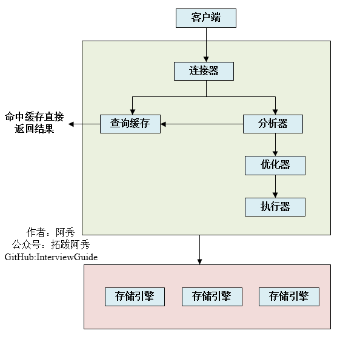
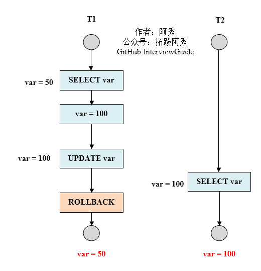
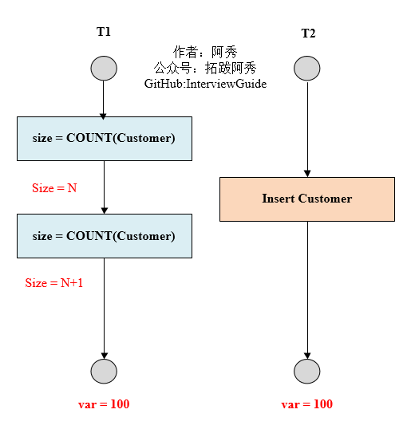
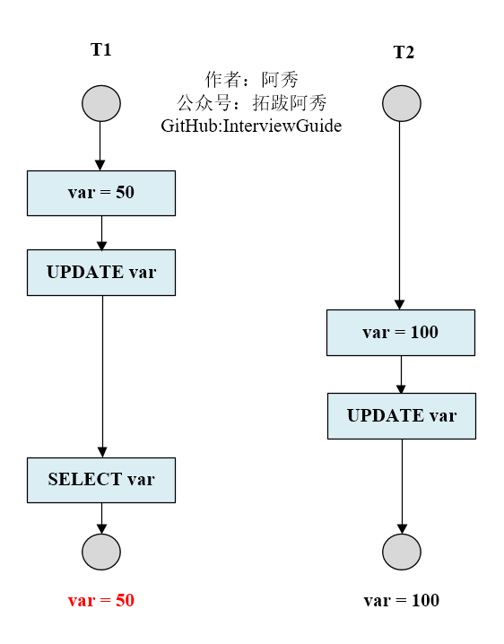
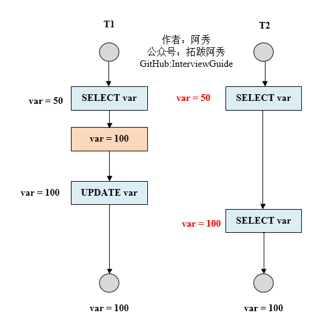

<h1 align="center">MySQL (Câu 01 - 20)</h1>

  
Đây là 6 thông tin có thể sẽ hữu ích cho bạn:

⭐️1. A Tú cùng bạn bè hợp tác phát triển một website tài nguyên lập trình, hiện đã tổng hợp rất nhiều tài liệu học tập chất lượng và công cụ hữu ích (kèm link tải). Nếu bạn đang tìm kiếm tài nguyên lập trình phù hợp, <a href="https://tools.interviewguide.cn/home" style="text-decoration: underline" target="_blank">hoan nghênh trải nghiệm</a> cũng như giới thiệu những tài nguyên bạn thấy hay. Góp gió thành bão, mình vì mọi người, mọi người vì mình🔥!
  
2. 👉 Tháng 5/2023, trong thời gian <a style="text-decoration: underline" href="https://mp.weixin.qq.com/s?__biz=Mzk0ODU4MzEzMw==&mid=2247512170&idx=1&sn=c4a04a383d2dfdece676b75f17224e78" target="_blank">rời ByteDance để chuyển sang một công ty đa quốc gia</a>, nhằm thuận tiện cho bản thân khi tìm việc và nâng cao tỷ lệ trúng tuyển, A Tú cùng bạn bè đã phát triển từ con số 0 một website giải đề phỏng vấn thực chiến của các Big Tech, bao gồm hai frontend và một backend. Trang web cho phép tra cứu có định hướng đề thi viết của các công ty Internet, ví dụ như muốn tra cứu đề thi viết của ByteDance trong 1 năm gần đây gồm những gì đều có thể làm được. Hoan nghênh trải nghiệm~

Địa chỉ website: <a style="text-decoration: underline" href="https://niumacode.com/home?ref=F6O2625K" target="_blank">Website đề thi thuật toán phỏng vấn Big Tech</a>.
    
3. 😊
    Chia sẻ một website công cụ tiện ích mà A Tú tâm đắc sưu tầm, <a style="text-decoration: underline" href="https://hkjtz.cn/" target="_blank">nhấn vào đây để truy cập</a>, chủ yếu là các ứng dụng, website ngách hữu ích, ngoài ra còn có tài nguyên phim ảnh HD, âm nhạc, phim truyền hình, AI, phim tài liệu, tài liệu thi tiếng Anh, thi công chức, cao học, nghề tay trái...
  

  
4. 😍 Chia sẻ miễn phí tài nguyên học tập mà A Tú đã tích lũy từ khi theo học máy tính, <a style="text-decoration: underline" href="/notes/07-resources/01-free/01-introduce.html" target="_blank">nhấn vào đây để nhận miễn phí</a>; đồng thời cũng lưu lại nhật ký đánh giá <a style="text-decoration: underline" href="/notes/07-resources/02-precious.html" target="_blank">những cuốn sách máy tính, chuyên mục online chất lượng cũng như những khóa học trả phí kém chất lượng</a> từng mua trước đây.
  

  
5. 🚀 Nếu bạn muốn thuận lợi giành được offer tốt hơn trong kỳ tuyển dụng trường học (Campus Recruitment), A Tú khuyên bạn nên xem thêm những <a style="text-decoration: underline" href="https://www.yuque.com/tuobaaxiu/httmmc/npg1k81zeq4wfpyz" target="_blank">cạm bẫy từng vấp phải</a> và <a style="text-decoration: underline"  target="_blank" href="https://www.yuque.com/tuobaaxiu/httmmc/gge9ppd0mbu2d3dp">kinh nghiệm đúc kết</a> của người đi trước. Thực tế, hầu hết các vấn đề bạn đang gặp phải thì các anh chị khóa trước đều đã từng trải qua.
  

  
6. 🔥 Hoan nghênh các bạn đang chuẩn bị cho kỳ tuyển dụng trường học ngành CNTT tham gia <a  style="text-decoration: underline" href="https://www.yuque.com/tuobaaxiu/httmmc/xg0otqvc17wfx4u9" target="_blank">Cộng đồng học tập</a> của tôi. Độc hành một mình chi bằng cùng nhau sưởi ấm, trong nhóm đã đọng lại rất nhiều <a  style="text-decoration: underline" href="https://www.yuque.com/tuobaaxiu/httmmc/gge9ppd0mbu2d3dp" target="_blank">kinh nghiệm và tổng kết</a> của các anh chị khóa 21/22/23/24/25. Kiên trì đi theo lộ trình, cuối cùng đa phần đều có thể nhận được offer ưng ý! Nếu bạn cần phiên bản PDF tổng hợp các điểm kiến thức 📚︎ Bát cổ văn phỏng vấn tuyển dụng trường học trên website 《Ghi chép học tập của A Tú》, có thể <a style="text-decoration: underline" href="https://www.yuque.com/tuobaaxiu/httmmc/qs0yn66apvkzw0ps" target="_blank">nhấn vào đây để tải về</a>.
   

## 1. Phân biệt Cơ sở dữ liệu quan hệ (RDBMS) và Phi quan hệ (NoSQL)

- **RDBMS (MySQL, PostgreSQL, Oracle)**:
  - *Ưu điểm*: Tuân thủ chuẩn mô hình quan hệ bảng-hàng-cột dễ hiểu; hỗ trợ giao dịch **ACID** đảm bảo tính nhất quán dữ liệu nghiêm ngặt; hỗ trợ câu truy vấn SQL phức tạp (`JOIN`, `GROUP BY`, `WHERE`).
  - *Nhược điểm*: Khó mở rộng quy mô theo chiều ngang (Horizontal Scaling / Sharding), hiệu năng bị giới hạn khi dữ liệu vượt ngưỡng hàng chục triệu bản ghi trên 1 node.
- **NoSQL (Redis, MongoDB, HBase, Cassandra)**:
  - *Ưu điểm*: Không cần qua tầng phân tích SQL phức tạp, tốc độ đọc/ghi siêu nhanh; cấu trúc linh hoạt (Key-Value, Document JSON, Wide-Column, Graph); dễ dàng mở rộng cụm phân tán (Scale-out).
  - *Nhược điểm*: Không hỗ trợ giao dịch phức tạp đa bảng, tiềm ẩn rủi ro mâu thuẫn dữ liệu (Eventual Consistency).

## 2. NoSQL là gì và Các kịch bản ứng dụng phù hợp

NoSQL (Not Only SQL) lưu trữ dữ liệu dạng Key-Value hoặc Document phi cấu trúc.
- **Kịch bản phù hợp**: Hệ thống Cache tốc độ cao (Redis), Hệ thống thu thập Log/Metrics khổng lồ (Elasticsearch/HBase), Dữ liệu định vị GPS / LBS, Dữ liệu mạng xã hội (Neo4j).

## 3. 5 Lý do sống còn phải sử dụng Chỉ mục (Index) trong Database

1. Tăng tốc độ truy vấn `SELECT` từ tìm kiếm quét toàn bảng (Full Table Scan $O(N)$) thành tìm kiếm cây B+Tree ($O(\log N)$).
2. Đảm bảo tính duy nhất của dữ liệu trên từng hàng (Unique Index).
3. Hỗ trợ mệnh đề `ORDER BY` và `GROUP BY` thực thi trực tiếp trên cây chỉ mục mà không tốn tài nguyên sắp xếp bộ nhớ tạm (FileSort).
4. Biến thao tác I/O ngẫu nhiên (Random Disk I/O) thành I/O tuần tự (Sequential I/O).
5. Tối ưu hóa tốc độ kết hợp giữa các bảng (`JOIN`).

## 4. Tại sao bảng InnoDB bắt buộc nên dùng Auto-Increment ID làm Khóa chính?

- Trong InnoDB, cấu trúc lưu trữ dữ liệu chính là cây **B+Tree của Clustered Index (Chỉ mục tụ tập)**.
- Khi dùng ID tự tăng đơn điệu (`AUTO_INCREMENT`), các bản ghi mới được chèn liên tục vào vị trí cuối cùng của Trang dữ liệu (Page 16KB). Khi một trang đầy, InnoDB chỉ việc mở một trang mới nối tiếp $\rightarrow$ *Tối đa hóa hiệu năng I/O*.
- Nếu dùng Khóa chính ngẫu nhiên (UUID, Mã CCCD): Mỗi lần chèn bản ghi mới có ID ngẫu nhiên, InnoDB buộc phải chèn vào giữa các trang nhớ cũ, gây ra hiện tượng **Tách trang (Page Split)**, dịch chuyển hàng loạt dữ liệu và tạo ra vô số phân mảnh đĩa.

## 5. So sánh cấu trúc B+Tree giữa InnoDB và MyISAM

- **InnoDB (Clustered Index - Chỉ mục tụ tập)**: Tệp dữ liệu và tệp chỉ mục là MỘT (`.ibd`). Nút lá của cây Khóa chính lưu trữ **Toàn bộ dữ liệu thực tế của hàng**. Các Chỉ mục phụ (Secondary Index) lưu giá trị Khóa chính (`Primary Key`) tại nút lá. Khi tìm kiếm theo chỉ mục phụ, MySQL phải thực hiện thao tác **Tra cứu lại bảng (Bookmark Lookup / 回表)** qua cây Khóa chính để lấy đủ cột.
- **MyISAM (Non-Clustered Index - Chỉ mục không tụ tập)**: Tệp dữ liệu (`.MYD`) và tệp chỉ mục (`.MYI`) tách rời. Nút lá của mọi cây chỉ mục (cả Khóa chính và Phụ) đều chỉ lưu trữ **Địa chỉ con trỏ vật lý trỏ tới hàng dữ liệu trong file `.MYD`**.

## 6. Trình tự thực thi một câu lệnh SQL trong MySQL Server

1. **Connector (Bộ kết nối)**: Quản lý kết nối TCP, xác thực tài khoản và quyền hạn người dùng.
2. **Query Cache (Bộ đệm truy vấn)**: Kiểm tra xem câu SQL có trong Cache không (từ MySQL 8.0 đã bị loại bỏ hoàn toàn).
3. **Parser (Bộ phân tích cú pháp)**: Phân tích từ vựng (Lexer) và ngữ pháp (Grammar), xây dựng Parse Tree.
4. **Optimizer (Bộ tối ưu hóa)**: Đánh giá chi phí I/O (Cost-based Optimizer), lựa chọn Chỉ mục tối ưu và thứ tự `JOIN`.
5. **Executor (Bộ thực thi)**: Kiểm tra quyền hạn và gọi các hàm API của Storage Engine (InnoDB) để lấy dữ liệu.
6. **Storage Engine (Động cơ lưu trữ)**: Đọc ghi dữ liệu thực tế từ Buffer Pool / Đĩa.

## 7. Kiến trúc 2 tầng của MySQL: Server Layer và Storage Engine Layer

- **Server Layer**: Bao gồm Connector, Parser, Optimizer, Executor, các hàm tích hợp sẵn (Date, String, Crypto), View, Stored Procedures, Triggers.
- **Storage Engine Layer**: Kiến trúc Pluggable hỗ trợ cắm rút nhiều Engine khác nhau (InnoDB, MyISAM, Memory). Mặc định là **InnoDB** (từ MySQL 5.5).

## 8. So sánh chi tiết Drop, Delete và Truncate

| Tiêu chí | DELETE | TRUNCATE | DROP |
| :--- | :--- | :--- | :--- |
| **Phân loại** | Lệnh thao tác dữ liệu **DML** | Lệnh định nghĩa **DDL** | Lệnh định nghĩa **DDL** |
| **Phạm vi** | Xóa toàn bộ hoặc một số dòng (`WHERE`) | Xóa sạch toàn bộ dữ liệu bảng | Xóa sạch cả bảng và cấu trúc bảng |
| **Giao dịch & Rollback**| Ghi Undo Log, **Có thể Rollback** | Không ghi Undo Log, **Không thể Rollback** | Không ghi Undo Log, **Không thể Rollback** |
| **Trigger** | Kích hoạt `DELETE` Trigger | Không kích hoạt Trigger | Không kích hoạt Trigger |
| **Tốc độ** | Chậm nhất (xóa từng dòng một) | **Rất nhanh** (giải phóng Page) | **Rất nhanh** (hủy file `.ibd`) |
| **Auto-Increment** | Giữ nguyên chỉ số tự tăng hiện tại | Reset giá trị Auto-Increment về 1 | Hủy bảng hoàn toàn |

## 9. 4 Hướng tối ưu hóa hiệu năng MySQL

1. Thiết kế Chỉ mục thông minh (Covering Index, Leftmost Prefix Rule).
2. Tối ưu câu lệnh SQL: Tránh `SELECT *`, tránh hàm trên cột chỉ mục, thay `subquery` bằng `JOIN`.
3. Phân tách bảng: Phân vùng dọc (Vertical Split) đưa cột text lớn ra bảng riêng; Phân vùng ngang (Horizontal Sharding).
4. Tối ưu cấu hình Phần cứng & Bộ đệm: Tăng `innodb_buffer_pool_size` lên $70\%-80\%$ dung lượng RAM.

## 10. 4 Mức độ cô lập giao dịch (Transaction Isolation Levels) trong SQL

| Mức cô lập | Lỗi Đọc rác (Dirty Read) | Đọc không lặp lại (Non-repeatable Read) | Đọc bóng ma (Phantom Read) |
| :--- | :---: | :---: | :---: |
| **Read Uncommitted (Đọc chưa commit)** | Có thể bị | Có thể bị | Có thể bị |
| **Read Committed (Đọc đã commit - RC)** | **Đã ngăn chặn** | Có thể bị | Có thể bị |
| **Repeatable Read (Đọc lặp lại - RR)** | **Đã ngăn chặn** | **Đã ngăn chặn** | **Đã ngăn chặn** (Nhờ Next-Key Lock của InnoDB) |
| **Serializable (Tuần tự hóa)** | **Đã ngăn chặn** | **Đã ngăn chặn** | **Đã ngăn chặn** |

*Lưu ý cốt lõi*: Mặc định của MySQL InnoDB là **`REPEATABLE READ`**. Nhờ cơ chế **MVCC (Multi-Version Concurrency Control)** kết hợp với **Next-Key Locks (Record Lock + Gap Lock)**, InnoDB loại bỏ được cả Phantom Read ở mức RR mà không làm suy giảm hiệu năng như Serializable.

## 11. Lý do mấu chốt MySQL dùng B+Tree thay vì B-Tree

Trong B-Tree, mỗi nút nhánh đều lưu cả Khóa (Key) lẫn Dữ liệu (Data), khiến dung lượng mỗi nút rất lớn, một Page 16KB chứa được rất ít khóa $\rightarrow$ Cây trở nên rất cao, tốn nhiều lần I/O đĩa.
Trong **B+Tree**, tất cả dữ liệu thực tế chỉ nằm ở **Nút lá (Leaf Nodes)**, các nút nhánh chỉ lưu Khóa điều hướng. Một Page 16KB có thể chứa tới $\approx 1000$ khóa $\rightarrow$ Cây B+Tree 3 tầng có thể chứa tới **20 triệu bản ghi** mà chỉ tốn đúng **3 lần đọc đĩa I/O**. Ngoài ra, các nút lá của B+Tree được liên kết đôi với nhau thành danh sách vòng (Doubly Linked List), giúp truy vấn quét dải khoảng (`BETWEEN`, `>`, `<`) có tốc độ vượt trội.

## 12. Chi tiết ưu thế của B+Tree đối với hệ thống File và Database

1. Tối ưu hóa I/O đĩa dựa trên Nguyên lý cục bộ (Locality) và kích thước khối đĩa (Page 16KB).
2. Chi phí I/O cực thấp và đồng đều cho mọi truy vấn (độ sâu cây cố định 3-4 tầng).
3. Hỗ trợ quét phạm vi (Range Query) và sắp xếp toàn diện mà không cần duyệt cây đệ quy.

## 13. Khái niệm View (Khung nhìn) và Cursor (Con trỏ)

- **View**: Bảng ảo được định nghĩa từ một câu truy vấn `SELECT`, giúp che giấu cấu trúc bảng nhạy cảm và đơn giản hóa các truy vấn lặp lại.
- **Cursor**: Đối tượng duyệt tuần tự từng dòng kết quả truy vấn trong Stored Procedure.

## 14. Cơ chế Rollback và Vai trò của Undo Log trong InnoDB

Mọi thao tác thay đổi dữ liệu (`INSERT`, `UPDATE`, `DELETE`) đều được ghi lại phiên bản đảo ngược vào **Undo Log** trước khi ghi vào Buffer Pool:
- Nếu thực hiện `INSERT`, Undo Log ghi lệnh `DELETE` tương ứng.
- Nếu thực hiện `UPDATE`, Undo Log lưu giá trị cũ của các cột.
Khi giao dịch bị lỗi hoặc gọi `ROLLBACK`, InnoDB sử dụng Undo Log để phục hồi dữ liệu về trạng thái trước giao dịch. Undo Log cũng là nền tảng xây dựng Read View trong cơ chế MVCC.

## 15. So sánh toàn diện giữa InnoDB và MyISAM

- **InnoDB**: Hỗ trợ Giao dịch ACID, Khóa cấp hàng (Row-level Lock), Khóa ngoại (Foreign Key), Phục hồi sau sự cố tự động (Crash Recovery qua Redo Log), Hỗ trợ MVCC.
- **MyISAM**: Không hỗ trợ Giao dịch, Chỉ hỗ trợ Khóa cấp bảng (Table Lock), Không hỗ trợ Foreign Key, Phục hồi sau crash rất chậm và dễ hỏng dữ liệu.

## 16. 4 Vấn đề xảy ra khi các Giao dịch chạy đồng thời

1. **Dirty Read (Đọc rác)**: Đọc phải dữ liệu chưa được commit của một transaction khác sau đó bị Rollback.
2. **Non-repeatable Read (Đọc không lặp lại)**: Cùng một transaction đọc 1 dòng dữ liệu 2 lần nhưng giá trị bị thay đổi do transaction khác vừa `UPDATE` và `COMMIT`.
3. **Phantom Read (Đọc bóng ma)**: Cùng một câu truy vấn phạm vi chạy 2 lần trả về số lượng dòng khác nhau do transaction khác vừa `INSERT` / `DELETE`.
4. **Lost Update (Mất cập nhật)**: Hai transaction cùng ghi đè lên 1 bản ghi khiến thay đổi của một bên bị biến mất hoàn toàn.

## 17. Khóa bi quan (Pessimistic Lock) và Khóa lạc quan (Optimistic Lock)

- **Pessimistic Lock (`SELECT ... FOR UPDATE`)**: Luôn giả định tranh chấp sẽ xảy ra nên chủ động khóa chặt hàng dữ liệu trong suốt thời gian giao dịch. Phù hợp cho môi trường **Ghi nhiều, tranh chấp cao** (ví dụ trừ tiền tài khoản ngân hàng).
- **Optimistic Lock (Dùng cột `version` hoặc `updated_at`)**: Giả định ít tranh chấp, không khóa hàng khi đọc. Khi cập nhật chạy lệnh: `UPDATE table SET stock=stock-1, version=version+1 WHERE id=1 AND version=curr_version;`. Nếu số dòng ảnh hưởng = 0 nghĩa là đã bị ghi đè, ứng dụng sẽ thử lại (Retry). Phù hợp cho môi trường **Đọc nhiều ghi ít**.

## 18. 2 Cấu trúc dữ liệu Chỉ mục chính trong MySQL

1. **B+Tree Index**: Đa năng, hỗ trợ tìm kiếm chính xác, tìm kiếm phạm vi, sắp xếp, lọc tiền tố.
2. **Hash Index (Memory Engine)**: Chỉ hỗ trợ tìm kiếm bằng tuyệt đối (`=`), tốc độ truy cập cực nhanh $O(1)$, nhưng không hỗ trợ tìm kiếm phạm vi hay sắp xếp.

## 19. Chiến lược Phân vùng Cơ sở dữ liệu (Sharding & Partitioning)

Khi dữ liệu đơn bảng vượt quá ngưỡng khuyến nghị ($\sim 10-20\text{ triệu dòng}$ hoặc file `.ibd` $> 30\text{GB}$), hiệu năng cây B+Tree và bộ đệm Buffer Pool bắt đầu suy giảm nghiêm trọng.
- **Phân tách dọc (Vertical Partitioning)**: Tách các cột ít dùng hoặc cột Text lớn sang bảng riêng; Tách các domain nghiệp vụ sang các Database độc lập.
- **Phân tách ngang (Horizontal Sharding)**: Chia đều các dòng dữ liệu sang nhiều bảng/database vật lý dựa trên **Sharding Key** (theo thuật toán Hash Modulo `user_id % 16` hoặc theo Dải thời gian `Range`).

## 20. Phân biệt sâu sắc giữa Non-repeatable Read và Phantom Read

- **Non-repeatable Read (Trọng tâm là `UPDATE`)**: Bản ghi cũ bị sửa đổi giá trị. Giải quyết bằng **Record Lock (Khóa hàng)**.
- **Phantom Read (Trọng tâm là `INSERT` hoặc `DELETE`)**: Số lượng bản ghi trong một khoảng dải bị thay đổi. Giải quyết bằng **Gap Lock (Khóa khoảng trống) & Next-Key Lock**.
