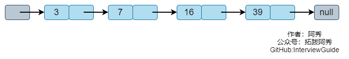
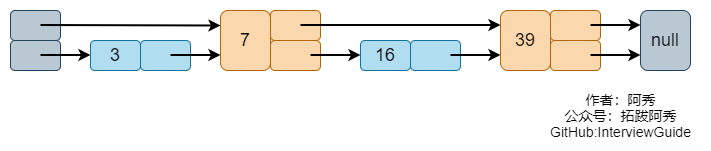
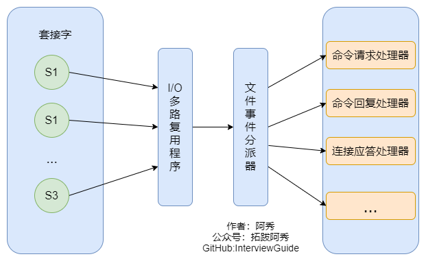

<h1 align="center">Redis (Câu 01 - 20)</h1>

<p id="数据库第二部分"></p>

<div style="border-color: #24C6DC;
            background-color: #e9f9f3;         
            margin: 1rem 0;
        padding: .25rem 1rem;
        border-left-width: .3rem;
        border-left-style: solid;
        border-radius: .5rem;
        color: inherit;">
  <p>Đây là 6 thông tin có thể sẽ hữu ích cho bạn:</p>
<p>⭐️1. A Tú cùng bạn bè hợp tác phát triển một <span style="font-weight:bold;color:red">website tài nguyên lập trình</span>, hiện đã tổng hợp rất nhiều tài liệu học tập chất lượng và công cụ hữu ích (kèm link tải). Nếu bạn đang tìm kiếm tài nguyên lập trình phù hợp, <a href="https://tools.interviewguide.cn/home" style="text-decoration: underline" target="_blank">hoan nghênh trải nghiệm</a> cũng như giới thiệu những tài nguyên bạn thấy hay. Góp gió thành bão, mình vì mọi người, mọi người vì mình🔥!</p>  <p>2. 👉 Tháng 5/2023, trong thời gian <a style="text-decoration: underline" href="https://mp.weixin.qq.com/s?__biz=Mzk0ODU4MzEzMw==&mid=2247512170&idx=1&sn=c4a04a383d2dfdece676b75f17224e78" target="_blank">rời ByteDance để chuyển sang một công ty đa quốc gia</a>, nhằm <span style="font-weight:bold">thuận tiện cho bản thân khi tìm việc và nâng cao tỷ lệ trúng tuyển</span>, A Tú cùng bạn bè đã phát triển từ con số 0 một <span style="font-weight:bold;color:red">website giải đề phỏng vấn thực chiến của các Big Tech</span>, bao gồm hai frontend và một backend. Trang web cho phép tra cứu có định hướng đề thi viết của các công ty Internet, ví dụ như muốn tra cứu đề thi viết của ByteDance trong 1 năm gần đây gồm những gì đều có thể làm được. Hoan nghênh trải nghiệm~
<div align="center">
</div>Địa chỉ website: <a style="text-decoration: underline" href="https://niumacode.com/home?ref=F6O2625K" target="_blank">Website đề thi thuật toán phỏng vấn Big Tech</a>.
    </p>3. 😊
    Chia sẻ một <span style="font-weight:bold;color:red">website công cụ tiện ích</span> mà A Tú tâm đắc sưu tầm, <a style="text-decoration: underline" href="https://hkjtz.cn/" target="_blank">nhấn vào đây để truy cập</a>, chủ yếu là các ứng dụng, website ngách hữu ích, ngoài ra còn có tài nguyên phim ảnh HD, âm nhạc, phim truyền hình, AI, phim tài liệu, tài liệu thi tiếng Anh, thi công chức, cao học, nghề tay trái...
  </p>
  <p>4. 😍 Chia sẻ miễn phí tài nguyên học tập mà A Tú đã tích lũy từ khi theo học máy tính, <a style="text-decoration: underline" href="/notes/07-resources/01-free/01-introduce.html" target="_blank">nhấn vào đây để nhận miễn phí</a>; đồng thời cũng lưu lại nhật ký đánh giá <a style="text-decoration: underline" href="/notes/07-resources/02-precious.html" target="_blank">những cuốn sách máy tính, chuyên mục online chất lượng cũng như những khóa học trả phí kém chất lượng</a> từng mua trước đây.
  </p>
  <p>5. 🚀 Nếu bạn muốn thuận lợi giành được offer tốt hơn trong kỳ tuyển dụng trường học (Campus Recruitment), A Tú khuyên bạn nên xem thêm những <a style="text-decoration: underline" href="https://www.yuque.com/tuobaaxiu/httmmc/npg1k81zeq4wfpyz" target="_blank">cạm bẫy từng vấp phải</a> và <a style="text-decoration: underline"  target="_blank" href="https://www.yuque.com/tuobaaxiu/httmmc/gge9ppd0mbu2d3dp">kinh nghiệm đúc kết</a> của người đi trước. Thực tế, hầu hết các vấn đề bạn đang gặp phải thì các anh chị khóa trước đều đã từng trải qua.
  </p>
  <p>6. 🔥 Hoan nghênh các bạn đang chuẩn bị cho kỳ tuyển dụng trường học ngành CNTT tham gia <a  style="text-decoration: underline" href="https://www.yuque.com/tuobaaxiu/httmmc/xg0otqvc17wfx4u9" target="_blank">Cộng đồng học tập</a> của tôi. Độc hành một mình chi bằng cùng nhau sưởi ấm, trong nhóm đã đọng lại rất nhiều <a  style="text-decoration: underline" href="https://www.yuque.com/tuobaaxiu/httmmc/gge9ppd0mbu2d3dp" target="_blank">kinh nghiệm và tổng kết</a> của các anh chị khóa 21/22/23/24/25. Kiên trì đi theo lộ trình, cuối cùng đa phần đều có thể nhận được offer ưng ý! Nếu bạn cần phiên bản PDF tổng hợp các điểm kiến thức 📚︎ Bát cổ văn phỏng vấn tuyển dụng trường học trên website 《Ghi chép học tập của A Tú》, có thể <a style="text-decoration: underline" href="https://www.yuque.com/tuobaaxiu/httmmc/qs0yn66apvkzw0ps" target="_blank">nhấn vào đây để tải về</a>.</p>   </div>

<p id="听说过吗它是什么"></p>

## 1. Redis là gì và Vai trò cốt lõi trong Hệ thống?

Redis (Remote Dictionary Server) là một hệ thống cơ sở dữ liệu **Lưu trữ trên bộ nhớ RAM (In-Memory Data Structure Store)** dạng NoSQL Key-Value siêu tốc.
- Tốc độ đọc ghi có thể đạt từ **100.000 đến 150.000 QPS** trên một nhân đơn lẻ.
- Được sử dụng rộng rãi làm: **Distributed Cache (Bộ đệm phân tán)**, **Distributed Lock (Khóa phân tán qua Redlock / Lua script)**, **Message Broker (Pub/Sub & Streams)**, **Bảng xếp hạng Leaderboard (Sorted Set)**, **Quản lý Session**.

<p id="五种数据结构整理"></p>

## 2. 5 Cấu trúc Dữ liệu Cốt lõi của Redis và Kiến trúc Cài đặt Tầng dưới (Underlying Implementation)

### 1. Simple Dynamic String (SDS - Chuỗi động đơn giản)
Thay vì dùng chuỗi C-style `char*` (kết thúc bằng `\0`), Redis tự thiết kế cấu trúc SDS:
```c
struct sdshdr {
    int len;        // Chiều dài chuỗi thực tế -> Lấy strlen(sds) với O(1)
    int free;       // Số byte bộ đệm còn trống chưa dùng
    char buf[];     // Mảng byte nhị phân an toàn (Binary-Safe)
};
```
- **Ưu điểm**: Lấy độ dài tốn $O(1)$; Tránh tràn bộ đệm Buffer Overflow; Giảm số lần cấp phát lại bộ nhớ nhờ cơ chế cấp phát trước (Pre-allocation) và thu hồi trễ (Lazy Deallocation); An toàn nhị phân (chứa được cả ảnh, video nhị phân).

### 2. Doubly Linked List (Danh sách liên kết đôi - `adlist`)
Mỗi nút `listNode` có con trỏ `prev` và `next`, cùng cấu trúc `list` quản lý con trỏ `head`, `tail` và trường `len` $\rightarrow$ Thao tác ở đầu và cuối đều tốn $O(1)$.

### 3. Dict / Hash Table (Từ điển băm)
- Sử dụng thuật toán băm **MurmurHash2** phân bổ cực kỳ đồng đều.
- Giải quyết đụng độ bằng **Chaining (Nối chuỗi đơn hướng)**.
- **Rehash tiệm tiến (Incremental / Progressive Rehash)**: Mỗi Dict chứa 2 bảng băm `ht[0]` và `ht[1]`. Khi mở rộng hoặc co cụm, Redis không di chuyển toàn bộ hàng triệu phần tử trong 1 lần làm đứng server, mà phân tán việc di chuyển từng bucket vào các thao tác đọc/ghi thông thường của người dùng cho đến khi hoàn tất.

### 4. SkipList (Bảng nhảy - `zskiplist`)


- Là danh sách liên kết nhiều tầng với các con trỏ nhảy cóc ngẫu nhiên (Chiều cao tầng từ 1 đến 32).
- Độ phức tạp tìm kiếm/chèn/xóa trung bình là **$O(\log N)$**, ngang ngửa Cây Cân bằng (AVL / Red-Black Tree) nhưng cài đặt đơn giản hơn rất nhiều và hỗ trợ duyệt phạm vi (`ZRANGEBYSCORE`) vượt trội.

### 5. ZipList (Danh sách nén)
Đóng gói các phần tử nhỏ và chuỗi ngắn thành một mảng byte liên tục không có con trỏ nhằm **tiết kiệm tối đa bộ nhớ RAM**.

<p id="常见数据结构以及使用场景分别是什么"></p>

## 3. Các kịch bản ứng dụng kinh điển của 5 Kiểu dữ liệu Redis

1. **String**: Bộ đệm Key-Value, Bộ đếm số lượt xem bài viết (`INCR`), Khóa phân tán (`SETNX`).
2. **Hash**: Lưu thông tin Đối tượng Object (User Profile: `{id: 1, name: "Tú", age: 25}`).
3. **List**: Hàng đợi tin nhắn (Message Queue qua `LPUSH` & `RPOP`), Phân trang danh sách bài đăng gần đây (`LRANGE 0 10`).
4. **Set**: Tập hợp không trùng lặp, Tính toán quan hệ bạn chung (Giao tập `SINTER`), Fan chung, Nhóm chung.
5. **Sorted Set (ZSet)**: Bảng xếp hạng điểm Game thời gian thực (`ZADD`, `ZREVRANGE`), Tin nhắn sắp xếp theo dòng thời gian Timeline.

<p id="有不就够用了吗为什么要用这种新的数据库"></p>

## 4. Tại sao cần Redis bên cạnh MySQL?

1. **Hiệu năng vượt trội**: RAM nhanh hơn ổ đĩa SSD hàng ngàn lần (Độ trễ Redis $< 1\text{ms}$ so với MySQL $5-50\text{ms}$).
2. **Chịu tải cao (High Throughput)**: Redis chịu được hàng trăm ngàn lượt truy cập đồng thời, bảo vệ MySQL không bị sập nguồn khi có chiến dịch Flash Sale hoặc tin tức sốt dẻo.

<p id="也是一种缓存型数据结构为什么不用而选择做缓存"></p>

## 5. Tại sao không dùng `std::map` / `HashMap` trong code mà lại dùng Redis?

- `std::map` chỉ là **Local Cache (Bộ đệm cục bộ)** trong bộ nhớ của 1 tiến trình đơn lẻ: Mất sạch khi restart app, không thể chia sẻ giữa nhiều Server trong mô hình Microservices, khó kiểm soát dung lượng tối đa.
- **Redis là Distributed Cache (Bộ đệm phân tán)**: Chia sẻ dữ liệu đồng nhất cho toàn bộ Cụm máy chủ, hỗ trợ lưu trữ bền vững (Persistence), tích hợp cơ chế giải phóng bộ nhớ (LRU Eviction) và chịu lỗi cụm (High Availability).

<p id="使用的好处有哪些"></p>

## 6. 4 Lợi ích lớn của Redis

1. Tốc độ đọc ghi $O(1)$ trên RAM.
2. Hỗ trợ phong phú cấu trúc dữ liệu đa dạng.
3. Hỗ trợ thực thi lệnh Atomic và Lua Scripts.
4. Hỗ trợ TTL (Time To Live) tự động hết hạn và xóa dữ liệu.

<p id="与的区别都有哪些"></p>

## 7. So sánh toàn diện giữa Redis và Memcached

| Tiêu chí | Redis | Memcached |
| :--- | :--- | :--- |
| **Kiểu dữ liệu** | Đa dạng (String, Hash, List, Set, ZSet, Stream, Bitmap) | Chỉ hỗ trợ String thuần túy |
| **Lưu trữ đĩa (Persistence)**| Hỗ trợ đầy đủ qua **RDB Snapshot & AOF Log** | Không có (Mất điện là mất sạch dữ liệu) |
| **Giới hạn Value** | Tối đa **512MB** | Tối đa **1MB** |
| **Mô hình I/O** | Single-threaded + I/O Multiplexing (Bản 6.0 có Multi-thread I/O) | Multi-threaded I/O + Mutex Locking |
| **Kiến trúc Cụm** | Tích hợp sẵn **Redis Cluster & Sentinel** | Dựa vào Client-side Sharding |

<p id="比的优势在哪里"></p>

## 8. Ưu thế vượt bậc của Redis so với Memcached

Hỗ trợ lưu trữ bền vững, kiểu dữ liệu mạnh mẽ, tích hợp sẵn Replication và Cluster mà không phụ thuộc vào thư viện Client.

<p id="缓存中常说的热点数据和冷数据是什么"></p>

## 9. Khái niệm Dữ liệu Nóng (Hot Data) và Dữ liệu Nguội (Cold Data)

- **Hot Data**: Dữ liệu có tần suất đọc cực cao (Sản phẩm hot, tin tức nổi bật, Token đăng nhập). Đây là đối tượng duy nhất xứng đáng được đưa vào Redis Cache.
- **Cold Data**: Dữ liệu ít hoặc hầu như không bao giờ được đọc lại (Hóa đơn cũ 3 năm trước). Chỉ nên lưu trữ trong MySQL/HDD.

<p id="为什么是单线程的而不采用多线程方案"></p>

## 10. Tại sao Redis lại chọn Thiết kế Đơn luồng (Single-threaded)?

1. **Hiệu năng không bị nghẽn bởi CPU**: Thao tác bộ nhớ RAM cực nhanh, điểm nghẽn thực tế của Redis là **Dung lượng RAM** và **Băng thông Mạng**.
2. **Loại bỏ chi phí Context Switch**: Không tốn chu kỳ CPU cho chuyển đổi luồng.
3. **Loại bỏ hoàn toàn vấn đề Tranh chấp Khóa (Lock Contention)**: Không cần dùng Mutex hay Spinlock phức tạp, loại bỏ nguy cơ Deadlock, giữ cho mã nguồn trong sáng và đạt hiệu năng tối đa.

<p id="单线程的为什么这么快"></p>

## 11. 3 Lý do giúp Redis Đơn luồng đạt tốc độ hàng trăm ngàn QPS

1. Toàn bộ dữ liệu nằm 100% trong **Bộ nhớ RAM**.
2. Sử dụng Mô hình **Non-blocking I/O Multiplexing (`epoll` trên Linux)** để quản lý hàng vạn kết nối Socket đồng thời.
3. Cấu trúc dữ liệu được tối ưu hóa đặc biệt ở mức độ mã C (SDS, ZipList, SkipList).

<p id="了解的线程模型吗可以大致说说吗"></p>

## 12. Mô hình Xử lý Sự kiện Tệp (File Event Handler) của Redis



Redis bao bọc một **Reactor Pattern** đơn luồng:
1. Đa ghép kênh I/O (`epoll`) lắng nghe hàng ngàn Socket.
2. Khi có sự kiện mạng (`AE_READABLE` / `AE_WRITABLE`), bộ đa ghép đẩy các Socket vào một Hàng đợi sự kiện tuần tự.
3. **File Event Dispatcher (Bộ điều phối sự kiện)** lấy từng socket ra và chuyển cho các Handler xử lý:
   - *Connection Accept Handler*: Tiếp nhận kết nối mới.
   - *Command Request Handler*: Đọc lệnh từ socket, thực thi lệnh trong RAM.
   - *Command Reply Handler*: Ghi dữ liệu kết quả trả về cho Client.

<p id="设置过期时间的两种方案是什么"></p>

## 13. 2 Chiến lược Xóa khóa hết hạn (Key Expiration Strategies) trong Redis

1. **Xóa định kỳ (Periodic Deletion)**: Cứ mỗi 100ms, Redis kích hoạt một hàm ngầm lấy ngẫu nhiên 20 khóa có cài đặt TTL. Nếu có khóa hết hạn thì xóa. Nếu tỷ lệ khóa hết hạn vượt quá 25%, Redis tiếp tục lặp lại quá trình này ngay lập tức.
2. **Xóa lười (Lazy Deletion)**: Khi người dùng thực hiện truy vấn một khóa (`GET key`), Redis kiểm tra xem khóa đã hết hạn chưa. Nếu đã quá hạn, Redis lập tức xóa khóa và trả về `nil`.

<p id="定期和惰性一定能保证删除数据吗如果不能会有什么应对措施"></p>

## 14. 6 Chính sách Giải phóng Bộ nhớ (Memory Eviction Policies) khi RAM bị đầy

Nếu cả 2 cơ chế Xóa định kỳ và Xóa lười vẫn để sót các khóa hết hạn không được truy cập, làm RAM chạm ngưỡng `maxmemory`, Redis sẽ kích hoạt cơ chế Eviction:
1. **`volatile-lru`**: Loại bỏ khóa ít được truy cập nhất (LRU) trong số các khóa **có thiết lập TTL**.
2. **`allkeys-lru` (Khuyên dùng)**: Loại bỏ khóa ít được truy cập nhất (LRU) trong **toàn bộ dữ liệu**.
3. **`volatile-lfu`**: Loại bỏ khóa có tần suất sử dụng thấp nhất (LFU) trong các khóa có TTL (Redis 4.0+).
4. **`allkeys-lfu`**: Loại bỏ khóa có tần suất sử dụng thấp nhất (LFU) trong toàn bộ dữ liệu.
5. **`volatile-ttl`**: Ưu tiên loại bỏ các khóa có thời gian sống TTL còn lại ngắn nhất.
6. **`volatile-random` / `allkeys-random`**: Loại bỏ khóa ngẫu nhiên.
7. **`noeviction`**: Không xóa dữ liệu nào, từ chối mọi lệnh ghi mới và báo lỗi `OOM command not allowed`.

<p id="对于大量的请求是怎样处理的"></p>

## 15. Cách Redis xử lý hàng vạn kết nối đồng thời

Dựa trên cơ chế **I/O Multiplexing (`epoll`)** của Linux Kernel, đưa các gói tin vào hàng đợi và xử lý tuần tự phi chặn trên Event Loop đơn luồng.

<p id="缓存雪崩缓存穿透缓存预热缓存更新缓存击穿缓存降级全搞定"></p>

## 16. Tổng hợp toàn diện 6 Vấn đề Kinh điển của Hệ thống Cache

### 1. Cache Avalanche (Tuyết lở bộ đệm)
- *Hiện tượng*: Hàng loạt key trong cache cùng **hết hạn tại một thời điểm chính xác** (hoặc Redis sập), khiến toàn bộ lưu lượng khổng lồ đổ dồn trực tiếp vào MySQL làm sập database.
- *Giải pháp*:
  - Thêm **Thời gian ngẫu nhiên (Jitter / Random TTL: 1-5 phút)** vào thời gian hết hạn của từng key để phân tán thời điểm expire.
  - Xây dựng Cụm Redis Cluster / Sentinel có tính sẵn sàng cao.
  - Kết hợp Local Cache (Caffeine/Ehcache) và giới hạn lưu lượng (Rate Limiting).

### 2. Cache Penetration (Xuyên thủng bộ đệm)
- *Hiện tượng*: Người dùng hoặc Hacker cố tình liên tục truy vấn **dữ liệu hoàn toàn KHÔNG tồn tại** (cả trong Redis lẫn MySQL, ví dụ `id = -9999`). Do cache không có, mọi request đều xuyên thẳng vào MySQL.
- *Giải pháp*:
  - **Bộ lọc Bloom (Bloom Filter)**: Đặt Bloom Filter phía trước để kiểm tra nhanh nếu key chắc chắn không tồn tại thì từ chối ngay.
  - **Cache giá trị rỗng (Cache Null Object)**: Lưu giá trị `null` vào Redis với TTL ngắn (1-3 phút).

### 3. Cache Breakdown (Đục thủng / Đột phá điểm nóng)
- *Hiện tượng*: Một key là **Điểm nóng cực đại (Super Hot Key)** bị hết hạn đột ngột đúng lúc có hàng vạn request đồng thời ùa vào, đục thủng cache đánh thẳng vào MySQL.
- *Giải pháp*:
  - Đặt Hot Key ở trạng thái **Không bao giờ hết hạn (No Expiration)**.
  - Sử dụng **Khóa phân tán (Mutex Lock qua `SETNX`)**: Chỉ cho phép 1 luồng duy nhất được truy vấn MySQL và cập nhật lại cache, các luồng khác chờ đợi.

### 4. Cache Pre-warming (Làm nóng trước bộ đệm)
Chủ động nạp sẵn các dữ liệu hot vào Redis trước giờ mở bán Flash Sale hoặc khi vừa khởi động hệ thống.

### 5. Cache Invalidation / Update
Lựa chọn chiến lược đồng bộ dữ liệu giữa Cache và DB (Cache-Aside Pattern: Xóa cache khi cập nhật DB).

### 6. Cache Downgrade (Giáng cấp dịch vụ)
Khi Redis gặp sự cố hoặc MySQL quá tải, hệ thống tự động ngắt truy vấn DB và trả về dữ liệu mặc định hoặc thông báo bận để bảo vệ an toàn cho hệ thống cốt lõi.

<p id="假如有万数据采用作为中间缓存取其中的万如何保证中的数据都是热点数据"></p>

## 17. Giải pháp đảm bảo 100.000 bản ghi trong Redis luôn là Dữ liệu Nóng nhất

Cấu hình dung lượng RAM giới hạn (`maxmemory`) vừa đủ chứa 100.000 bản ghi và thiết lập chính sách giải phóng bộ nhớ:
$$\mathbf{maxmemory-policy\ allkeys-lru\ \text{hoặc}\ allkeys-lfu}$$
Redis sẽ tự động theo dõi và đào thải các bản ghi ít được truy cập nhất để nhường chỗ cho các bản ghi mới có độ hot cao.

<p id="持久化机制可以说一说吗"></p>

## 18. 2 Cơ chế Lưu trữ bền vững (Persistence) của Redis: RDB và AOF

### 1. RDB (Redis Database Snapshot - Chụp ảnh định kỳ)
- *Bản chất*: Tạo bản snapshot nhị phân nén toàn bộ dữ liệu RAM ra tệp `dump.rdb` tại các mốc thời gian quy định (`save 900 1`, `save 300 10`).
- *Cơ chế*: Gọi `bgsave` $\rightarrow$ Kernel `fork()` ra tiến trình con, tận dụng cơ chế **Copy-On-Write (COW)** để ghi đĩa mà không chặn tiến trình cha.
- *Ưu điểm*: Tệp nhị phân nén nhỏ gọn, tốc độ phục hồi dữ liệu khi restart cực nhanh.
- *Nhược điểm*: Có nguy cơ mất dữ liệu trong vài phút gần nhất nếu máy chủ sập đột ngột giữa 2 lần chụp snapshot.

### 2. AOF (Append-Only File - Ghi nhật ký lệnh)
- *Bản chất*: Ghi tuần tự mọi lệnh ghi (`SET`, `DEL`) vào tệp văn bản `appendonly.aof`.
- *3 Chế độ Fsync*:
  - `appendfsync always`: Ghi đĩa ngay mỗi lệnh (an toàn tuyệt đối, rất chậm).
  - `appendfsync everysec` (**Mặc định, Tối ưu nhất**): Đồng bộ đĩa mỗi 1 giây (chỉ mất tối đa 1s dữ liệu khi sập).
  - `appendfsync no`: Để OS tự xả bộ đệm.

### 3. Mixed Persistence (Lưu trữ hỗn hợp từ Redis 4.0+)
Kết hợp Header là định dạng RDB nén siêu tốc và Phần đuôi là các lệnh AOF mới nhất $\rightarrow$ *Tối ưu hóa cả tốc độ khởi động lẫn độ an toàn dữ liệu*.

<p id="重写了解吗可以简单说说吗"></p>

## 19. Cơ chế Tối ưu hóa AOF Rewrite (`BGREWRITEAOF`)

Khi tệp AOF phình to do chứa hàng ngàn lệnh ghi đè lặp lại trên cùng 1 key (ví dụ gọi `INCR count` 1000 lần), Redis kích hoạt `BGREWRITEAOF`:
1. Fork tiến trình con đọc trạng thái bộ nhớ hiện tại và tạo tệp AOF mới chỉ chứa đúng 1 lệnh duy nhất biểu diễn trạng thái cuối (`SET count 1000`).
2. Trong lúc tiến trình con chạy, tiến trình cha ghi các lệnh mới phát sinh vào **AOF Rewrite Buffer**.
3. Khi con hoàn tất, cha nối phần Buffer vào đuôi tệp mới và đổi tên đè lên tệp AOF cũ $\rightarrow$ *Giúp thu nhỏ dung lượng file AOF xuống hàng chục lần*.

<p id="是否使用集群集群的原理是什么"></p>

## 20. Phân biệt Redis Sentinel (Khả dụng cao) và Redis Cluster (Mở rộng quy mô)

- **Redis Sentinel (Mô hình Master-Slave + Giám sát Sentinel)**: Tập trung vào **Tính sẵn sàng cao (High Availability)**. Khi Master sập, hệ thống Sentinel tự động bình bầu bỏ phiếu (Quorum) bầu một Slave lên làm Master mới. Toàn bộ dữ liệu vẫn nằm trên 1 node Master đơn lẻ.
- **Redis Cluster (Mô hình Phân mảnh Sharding)**: Tập trung vào **Khả năng mở rộng quy mô dữ liệu (Scalability)**. Chia toàn bộ dữ liệu thành **16384 Hash Slots**, phân bổ đều cho các cụm Master khác nhau qua công thức $\text{CRC16}(\text{key}) \pmod{16384}$.
