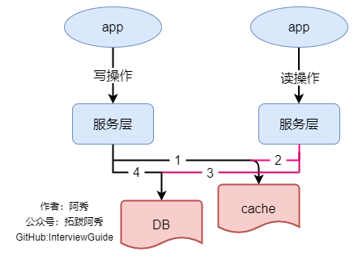
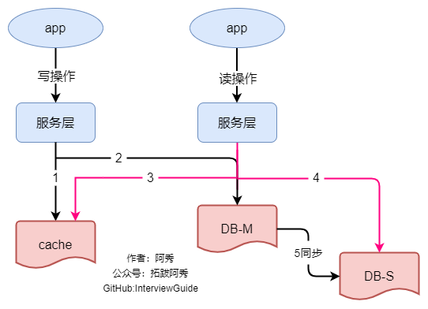
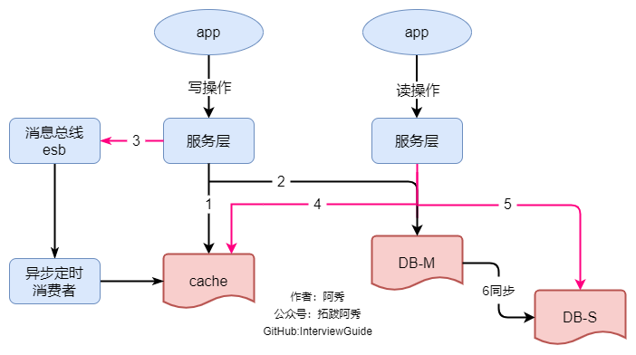
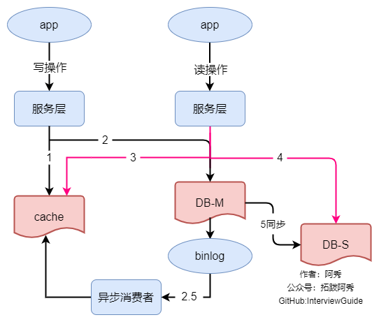
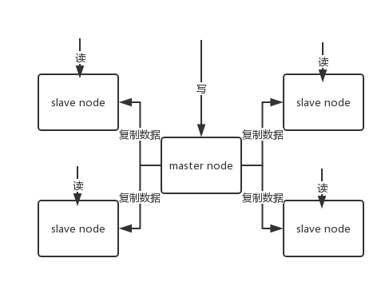
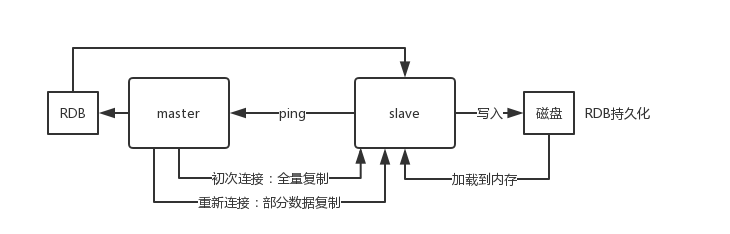
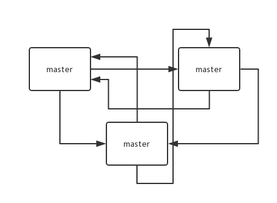
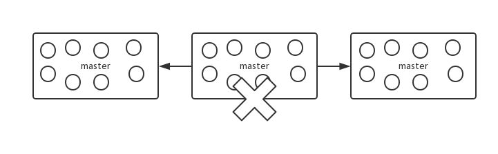

<h1 align="center">Redis (Câu 21 - 30)</h1>

<p id="数据库第二部分"></p>

<div style="border-color: #24C6DC;
            background-color: #e9f9f3;         
            margin: 1rem 0;
        padding: .25rem 1rem;
        border-left-width: .3rem;
        border-left-style: solid;
        border-radius: .5rem;
        color: inherit;">
  <p>Đây là 6 thông tin có thể sẽ hữu ích cho bạn:</p>
<p>⭐️1. A Tú cùng bạn bè hợp tác phát triển một <span style="font-weight:bold;color:red">website tài nguyên lập trình</span>, hiện đã tổng hợp rất nhiều tài liệu học tập chất lượng và công cụ hữu ích (kèm link tải). Nếu bạn đang tìm kiếm tài nguyên lập trình phù hợp, <a href="https://tools.interviewguide.cn/home" style="text-decoration: underline" target="_blank">hoan nghênh trải nghiệm</a> cũng như giới thiệu những tài nguyên bạn thấy hay. Góp gió thành bão, mình vì mọi người, mọi người vì mình🔥!</p>  <p>2. 👉 Tháng 5/2023, trong thời gian <a style="text-decoration: underline" href="https://mp.weixin.qq.com/s?__biz=Mzk0ODU4MzEzMw==&mid=2247512170&idx=1&sn=c4a04a383d2dfdece676b75f17224e78" target="_blank">rời ByteDance để chuyển sang một công ty đa quốc gia</a>, nhằm <span style="font-weight:bold">thuận tiện cho bản thân khi tìm việc và nâng cao tỷ lệ trúng tuyển</span>, A Tú cùng bạn bè đã phát triển từ con số 0 một <span style="font-weight:bold;color:red">website giải đề phỏng vấn thực chiến của các Big Tech</span>, bao gồm hai frontend và một backend. Trang web cho phép tra cứu có định hướng đề thi viết của các công ty Internet, ví dụ như muốn tra cứu đề thi viết của ByteDance trong 1 năm gần đây gồm những gì đều có thể làm được. Hoan nghênh trải nghiệm~
<div align="center">
</div>Địa chỉ website: <a style="text-decoration: underline" href="https://niumacode.com/home?ref=F6O2625K" target="_blank">Website đề thi thuật toán phỏng vấn Big Tech</a>.
    </p>3. 😊
    Chia sẻ một <span style="font-weight:bold;color:red">website công cụ tiện ích</span> mà A Tú tâm đắc sưu tầm, <a style="text-decoration: underline" href="https://hkjtz.cn/" target="_blank">nhấn vào đây để truy cập</a>, chủ yếu là các ứng dụng, website ngách hữu ích, ngoài ra còn có tài nguyên phim ảnh HD, âm nhạc, phim truyền hình, AI, phim tài liệu, tài liệu thi tiếng Anh, thi công chức, cao học, nghề tay trái...
  </p>
  <p>4. 😍 Chia sẻ miễn phí tài nguyên học tập mà A Tú đã tích lũy từ khi theo học máy tính, <a style="text-decoration: underline" href="/notes/07-resources/01-free/01-introduce.html" target="_blank">nhấn vào đây để nhận miễn phí</a>; đồng thời cũng lưu lại nhật ký đánh giá <a style="text-decoration: underline" href="/notes/07-resources/02-precious.html" target="_blank">những cuốn sách máy tính, chuyên mục online chất lượng cũng như những khóa học trả phí kém chất lượng</a> từng mua trước đây.
  </p>
  <p>5. 🚀 Nếu bạn muốn thuận lợi giành được offer tốt hơn trong kỳ tuyển dụng trường học (Campus Recruitment), A Tú khuyên bạn nên xem thêm những <a style="text-decoration: underline" href="https://www.yuque.com/tuobaaxiu/httmmc/npg1k81zeq4wfpyz" target="_blank">cạm bẫy từng vấp phải</a> và <a style="text-decoration: underline"  target="_blank" href="https://www.yuque.com/tuobaaxiu/httmmc/gge9ppd0mbu2d3dp">kinh nghiệm đúc kết</a> của người đi trước. Thực tế, hầu hết các vấn đề bạn đang gặp phải thì các anh chị khóa trước đều đã từng trải qua.
  </p>
  <p>6. 🔥 Hoan nghênh các bạn đang chuẩn bị cho kỳ tuyển dụng trường học ngành CNTT tham gia <a  style="text-decoration: underline" href="https://www.yuque.com/tuobaaxiu/httmmc/xg0otqvc17wfx4u9" target="_blank">Cộng đồng học tập</a> của tôi. Độc hành một mình chi bằng cùng nhau sưởi ấm, trong nhóm đã đọng lại rất nhiều <a  style="text-decoration: underline" href="https://www.yuque.com/tuobaaxiu/httmmc/gge9ppd0mbu2d3dp" target="_blank">kinh nghiệm và tổng kết</a> của các anh chị khóa 21/22/23/24/25. Kiên trì đi theo lộ trình, cuối cùng đa phần đều có thể nhận được offer ưng ý! Nếu bạn cần phiên bản PDF tổng hợp các điểm kiến thức 📚︎ Bát cổ văn phỏng vấn tuyển dụng trường học trên website 《Ghi chép học tập của A Tú》, có thể <a style="text-decoration: underline" href="https://www.yuque.com/tuobaaxiu/httmmc/qs0yn66apvkzw0ps" target="_blank">nhấn vào đây để tải về</a>.</p>   </div>

<p id="如何解决的并发竞争问题"></p>

## 21. Xử lý Tranh chấp Khóa đồng thời (Concurrent Key Contention) trong Redis

Xảy ra khi nhiều Client cùng đọc và ghi đè lên cùng một Key, dẫn đến kết quả sau cùng bị sai lệch thứ tự.
- **Giải pháp 1: Khóa phân tán (Distributed Lock - Redisson / Zookeeper)**: Đảm bảo tại một thời điểm chỉ có 1 tiến trình được phép thao tác trên Key.
- **Giải pháp 2: CAS (Check-And-Set với `WATCH` / Version Timestamp)**: Kèm số phiên bản hoặc timestamp khi ghi, từ chối ghi đè nếu phiên bản gửi lên cũ hơn dữ liệu hiện tại trong Redis.

<p id="如何保证缓存与数据库双写时的数据一致性"></p>

## 22. Đảm bảo Tính nhất quán dữ liệu giữa Cache (Redis) và Database (MySQL)

Mô hình chuẩn nhất là **Cache Aside Pattern (Mô hình Bộ đệm dự phòng)**:
- **Thao tác ĐỌC**: Đọc Redis trước $\rightarrow$ Nếu Miss thì đọc MySQL $\rightarrow$ Nạp dữ liệu vào Redis $\rightarrow$ Trả về kết quả.
- **Thao tác CẬP NHẬT**: **Cập nhật MySQL trước, sau đó XÓA Key tương ứng trong Redis (Update DB then Delete Cache)**.
- *Tại sao XÓA Cache thay vì CẬP NHẬT Cache?*:
  1. Tránh tính toán lãng phí cho các dữ liệu nguội ít đọc nhưng ghi nhiều (Lazy Evaluation).
  2. Ngăn ngừa Race Condition giữa 2 thao tác ghi đồng thời làm ghi đè sai dữ liệu cũ vào cache.

<p id="数据为什么会出现不一致的情况"></p>

## 23. Các nguyên nhân dẫn đến Mâu thuẫn dữ liệu (Inconsistency) giữa Cache và DB




1. **Xóa Cache trước rồi mới ghi DB**: Luồng A vừa xóa Cache xong thì Luồng B đọc thấy Cache rỗng, liền đọc dữ liệu CŨ từ DB nạp ngược vào Cache. Sau đó Luồng A mới ghi dữ liệu MỚI vào DB $\rightarrow$ *Cache bị kẹt vĩnh viễn ở dữ liệu cũ*.
2. **Độ trễ Nhân bản Master-Slave (Replication Lag)**: Luồng A ghi Master DB và xóa Cache. Luồng B đọc DB từ Slave DB (vốn chưa kịp sync xong dữ liệu mới từ Master) rồi nạp dữ liệu cũ này vào Cache.

<p id="常见的数据优化方案你了解吗"></p>

## 24. 2 Giải pháp triệt để đảm bảo Nhất quán Dữ liệu (Consistency Solutions)




### 1. Thuật toán Xóa kép trễ (Delayed Double Deletion)
1. Xóa Cache lần 1.
2. Cập nhật dữ liệu vào MySQL.
3. Ngủ một khoảng thời gian ngắn (ví dụ $500\text{ms} - 1\text{s}$ - vừa đủ để Master kịp nhân bản sang Slave).
4. Xóa Cache lần 2 (có thể gửi qua Message Queue xử lý bất đồng bộ để không chặn luồng chính).

### 2. Đăng ký nhận luồng MySQL Binlog bất đồng bộ qua Canal + Message Queue (Khuyên dùng trong Big Tech)
- Ứng dụng chỉ thao tác ghi vào MySQL.
- Công cụ **Canal** giả lập làm một Slave đọc trực tiếp **MySQL Binlog**, trích xuất các sự kiện thay đổi dữ liệu và đẩy vào Kafka / RocketMQ.
- Consumer đọc MQ và tự động xóa / cập nhật Redis Cache tương ứng. Tách rời hoàn toàn logic Cache khỏi nghiệp vụ chính và đảm bảo độ tin cậy tuyệt đối với cơ chế Retry của MQ.

## 25. Cơ chế Nhân bản Dữ liệu Master-Slave (Replication) trong Redis




- **Nguyên lý**: 1 Master (xử lý ghi) nhân bản dữ liệu sang nhiều Slave (phục vụ đọc).
- **Full Resynchronization (Đồng bộ toàn lượng lần đầu)**:
  1. Slave gửi lệnh `PSYNC ? -1`.
  2. Master chạy ngầm `BGSAVE` sinh file snapshot RDB và lưu các lệnh ghi mới vào Bộ đệm nhân bản (Replication Buffer).
  3. Master gửi RDB sang Slave $\rightarrow$ Slave xóa dữ liệu cũ, nạp RDB vào RAM $\rightarrow$ Master gửi nốt các lệnh trong Replication Buffer.
- **Partial Resynchronization (Đồng bộ gia tăng khi mất mạng tạm thời)**:
  - Dựa trên **Replication Backlog Buffer** (Hàng đợi vòng tròn mặc định 1MB) và **`offset`**. Slave kết nối lại chỉ cần kéo phần chênh lệch từ `offset` của mình mà không cần nạp lại toàn bộ file RDB khổng lồ.

## 26. Kiến trúc Sẵn sàng cao và Chuyển giao sự cố (Failover)

Hệ thống duy trì khả năng phục vụ $99.99\%$ thời gian thông qua cơ chế tự động phát hiện Master chết và nâng cấp Slave lên làm Master mới mà không làm gián đoạn người dùng.

## 27. Chi tiết Cơ chế Hoạt động của Cụm Giám sát Redis Sentinel

- **Giám sát (Monitoring)**: Gửi lệnh `PING` kiểm tra nhịp tim (Heartbeat) của Master và Slave.
- **Đánh giá Trạng thái Sập (Subjective vs Objective Down)**:
  - **`sdown` (Chủ quan)**: Một Sentinel đơn lẻ không nhận được phản hồi PING vượt quá thời gian `down-after-milliseconds`.
  - **`odown` (Khách quan)**: Khi số lượng Sentinel đồng thuận đánh giá `sdown` đạt ngưỡng **`Quorum`** (ví dụ $\ge 2/3$).
- **Bình bầu Sentinel Leader (Raft Algorithm)**: Các Sentinel bỏ phiếu bầu 1 Sentinel đại diện đứng ra thực thi Failover.
- **Quy tắc chọn Slave lên làm Master mới**:
  1. Loại bỏ các Slave bị ngắt kết nối quá lâu.
  2. Ưu tiên Slave có thuộc tính `slave-priority` nhỏ nhất.
  3. Ưu tiên Slave có `replication offset` lớn nhất (chứa dữ liệu mới nhất).
  4. Ưu tiên Slave có `runid` nhỏ nhất theo thứ tự từ điển.

## 28. Hiện tượng Mất mát Dữ liệu trong Chuyển giao Sự cố và Cách phòng ngừa

- **Hiện tượng Phân tách não (Split-Brain)**: Master cũ bị cô lập mạng nhưng vẫn nhận lệnh ghi từ một số Client. Sentinel bầu Master mới ở phân vùng mạng khác $\rightarrow$ Xuất hiện 2 Master cùng lúc. Khi mạng thông lại, Master cũ bị hạ xuống làm Slave và xóa sạch dữ liệu ghi gần nhất.
- **Cấu hình phòng thủ cốt lõi**:
  ```bash
  min-slaves-to-write 1
  min-slaves-max-lag 10
  ```
  *(Yêu cầu Master phải có ít nhất 1 Slave phản hồi xác nhận trong vòng 10 giây; nếu không Master sẽ từ chối nhận lệnh ghi từ Client, giới hạn tối đa lượng dữ liệu bị mất)*.

## 29. Kiến trúc Cụm phân mảnh Redis Cluster (Sharding & Gossip Protocol)




- **16384 Hash Slots**: Dữ liệu được gán vào Slot qua công thức $\text{Slot} = \text{CRC16}(\text{key}) \pmod{16384}$. Mỗi Master nắm giữ một khoảng Slot. Cho phép mở rộng hoặc thu hẹp node Master dễ dàng bằng cách di chuyển Slot mà không làm gián đoạn cụm.
- **Giao thức Gossip (Cổng 10000 + Port)**: Các node trao đổi thông tin nhịp tim (`ping/pong/meet/fail`) trực tiếp ngang hàng (P2P) phân tán mà không cần máy chủ tập trung như Zookeeper.

## 30. Thực tế Triển khai Cụm Redis trong Môi trường Doanh nghiệp (Production Setup)

- **Mô hình**: Cụm **Redis Cluster 10 Máy chủ** (5 Master + 5 Slave tương ứng phân bổ chéo rack/zone).
- **Phần cứng**: Máy chủ 32GB RAM, 8 Cores CPU, SSD NVMe. Cấp phát **10GB RAM** cho mỗi tiến trình Redis (tránh cấp phát quá lớn khiến việc `fork()` chụp RDB bị nghẽn và thời gian phục hồi quá chậm).
- **Thông lượng**: Cụm 5 Master xử lý đỉnh tải lên tới **200.000 - 250.000 QPS**.
- **Chính sách**: Bật Mixed Persistence (RDB + AOF `everysec`), giới hạn `maxmemory-policy allkeys-lru`, tích hợp Prometheus + Grafana giám sát tỉ lệ trúng cache (Hit Rate) và bộ nhớ phân mảnh.
