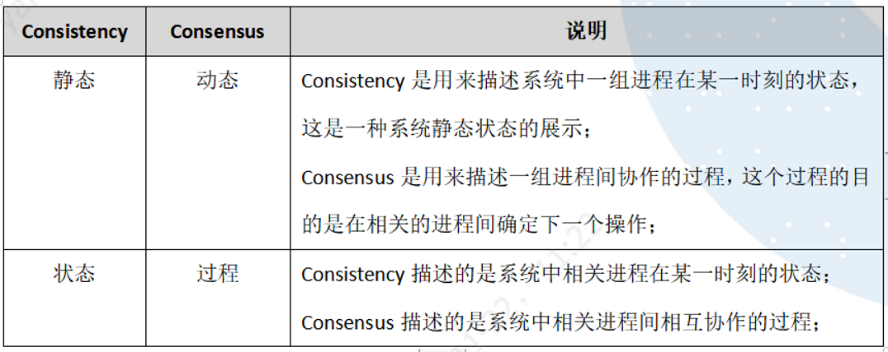
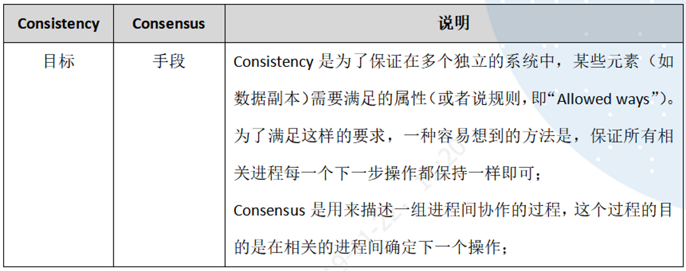

<h1 align="center">Hệ thống Phân tán, Tính nhất quán và Xử lý Tải cao (High Concurrency)</h1>

  
Đây là 6 thông tin có thể sẽ hữu ích cho bạn:

⭐️1. A Tú cùng bạn bè hợp tác phát triển một website tài nguyên lập trình, hiện đã tổng hợp rất nhiều tài liệu học tập chất lượng và công cụ hữu ích (kèm link tải). Nếu bạn đang tìm kiếm tài nguyên lập trình phù hợp, <a href="https://tools.interviewguide.cn/home" style="text-decoration: underline" target="_blank">hoan nghênh trải nghiệm</a> cũng như giới thiệu những tài nguyên bạn thấy hay. Góp gió thành bão, mình vì mọi người, mọi người vì mình🔥!
  
2. 👉 Tháng 5/2023, trong thời gian <a style="text-decoration: underline" href="https://mp.weixin.qq.com/s?__biz=Mzk0ODU4MzEzMw==&mid=2247512170&idx=1&sn=c4a04a383d2dfdece676b75f17224e78" target="_blank">rời ByteDance để chuyển sang một công ty đa quốc gia</a>, nhằm thuận tiện cho bản thân khi tìm việc và nâng cao tỷ lệ trúng tuyển, A Tú cùng bạn bè đã phát triển từ con số 0 một website giải đề phỏng vấn thực chiến của các Big Tech, bao gồm hai frontend và một backend. Trang web cho phép tra cứu có định hướng đề thi viết của các công ty Internet, ví dụ như muốn tra cứu đề thi viết của ByteDance trong 1 năm gần đây gồm những gì đều có thể làm được. Hoan nghênh trải nghiệm~

Địa chỉ website: <a style="text-decoration: underline" href="https://niumacode.com/home?ref=F6O2625K" target="_blank">Website đề thi thuật toán phỏng vấn Big Tech</a>.
    
3. 😊
    Chia sẻ một website công cụ tiện ích mà A Tú tâm đắc sưu tầm, <a style="text-decoration: underline" href="https://hkjtz.cn/" target="_blank">nhấn vào đây để truy cập</a>, chủ yếu là các ứng dụng, website ngách hữu ích, ngoài ra còn có tài nguyên phim ảnh HD, âm nhạc, phim truyền hình, AI, phim tài liệu, tài liệu thi tiếng Anh, thi công chức, cao học, nghề tay trái...
  

  
4. 😍 Chia sẻ miễn phí tài nguyên học tập mà A Tú đã tích lũy từ khi theo học máy tính, <a style="text-decoration: underline" href="/notes/07-resources/01-free/01-introduce.html" target="_blank">nhấn vào đây để nhận miễn phí</a>; đồng thời cũng lưu lại nhật ký đánh giá <a style="text-decoration: underline" href="/notes/07-resources/02-precious.html" target="_blank">những cuốn sách máy tính, chuyên mục online chất lượng cũng như những khóa học trả phí kém chất lượng</a> từng mua trước đây.
  

  
5. 🚀 Nếu bạn muốn thuận lợi giành được offer tốt hơn trong kỳ tuyển dụng trường học (Campus Recruitment), A Tú khuyên bạn nên xem thêm những <a style="text-decoration: underline" href="https://www.yuque.com/tuobaaxiu/httmmc/npg1k81zeq4wfpyz" target="_blank">cạm bẫy từng vấp phải</a> và <a style="text-decoration: underline"  target="_blank" href="https://www.yuque.com/tuobaaxiu/httmmc/gge9ppd0mbu2d3dp">kinh nghiệm đúc kết</a> của người đi trước. Thực tế, hầu hết các vấn đề bạn đang gặp phải thì các anh chị khóa trước đều đã từng trải qua.
  

  
6. 🔥 Hoan nghênh các bạn đang chuẩn bị cho kỳ tuyển dụng trường học ngành CNTT tham gia <a  style="text-decoration: underline" href="https://www.yuque.com/tuobaaxiu/httmmc/xg0otqvc17wfx4u9" target="_blank">Cộng đồng học tập</a> của tôi. Độc hành một mình chi bằng cùng nhau sưởi ấm, trong nhóm đã đọng lại rất nhiều <a  style="text-decoration: underline" href="https://www.yuque.com/tuobaaxiu/httmmc/gge9ppd0mbu2d3dp" target="_blank">kinh nghiệm và tổng kết</a> của các anh chị khóa 21/22/23/24/25. Kiên trì đi theo lộ trình, cuối cùng đa phần đều có thể nhận được offer ưng ý! Nếu bạn cần phiên bản PDF tổng hợp các điểm kiến thức 📚︎ Bát cổ văn phỏng vấn tuyển dụng trường học trên website 《Ghi chép học tập của A Tú》, có thể <a style="text-decoration: underline" href="https://www.yuque.com/tuobaaxiu/httmmc/qs0yn66apvkzw0ps" target="_blank">nhấn vào đây để tải về</a>.
   

## 1. Khái niệm Nền tảng về Hệ thống Phân tán (Distributed Systems)

### 1. Định lý CAP (CAP Theorem)
Được đề xuất bởi Eric Brewer năm 1998, chỉ ra rằng một hệ thống phân tán chỉ có thể chọn tối đa **2 trong 3** thuộc tính:
- **C - Consistency (Tính nhất quán)**: Mọi node đều nhìn thấy cùng một dữ liệu mới nhất tại cùng một thời điểm logic.
- **A - Availability (Tính sẵn sàng)**: Mọi yêu cầu gửi đến đều nhận được phản hồi thành công (không bị lỗi hoặc timeout vô hạn), dù dữ liệu có thể chưa phải mới nhất.
- **P - Partition Tolerance (Khả năng chịu lỗi phân vùng mạng)**: Hệ thống vẫn tiếp tục vận hành bình thường ngay cả khi đường truyền mạng giữa các node bị đứt đoạn hoặc trễ nghiêm trọng.

*Lưu ý cốt lõi*: Trong thực tế mạng Internet, lỗi phân vùng mạng ($P$) là **bắt buộc phải chấp nhận**. Do đó kiến trúc sư chỉ được phép đánh đổi giữa **CP (Ưu tiên nhất quán - chấp nhận từ chối phục vụ khi lỗi, ví dụ HBase, Zookeeper)** hoặc **AP (Ưu tiên sẵn sàng - chấp nhận dữ liệu tạm thời sai lệch, ví dụ Cassandra, DynamoDB, Eureka)**.

### 2. Các mức độ Nhất quán Dữ liệu (Consistency Levels)
- **Strong Consistency (Nhất quán mạnh / Tuyến tính)**: Ngay sau khi lệnh ghi hoàn tất, mọi thao tác đọc trên bất kỳ node nào đều lập tức thấy dữ liệu mới nhất.
- **Weak Consistency (Nhất quán yếu)**: Hệ thống không đảm bảo thời điểm người dùng đọc được dữ liệu mới.
- **Eventual Consistency (Nhất quán cuối cùng - Phổ biến nhất trong Web/Microservices)**: Sau một khoảng thời gian trễ nhất định (Inconsistency Window), toàn bộ các bản sao (Replicas) sẽ hội tụ về cùng một trạng thái dữ liệu đồng nhất.

#### Các giải pháp đảm bảo Tính nhất quán
1. Giao dịch phân tán: Giao thức Two-Phase Commit (2PC), TCC, Saga Pattern.
2. Khóa phân tán (Distributed Lock qua Redis Redlock / Zookeeper).
3. Hàng đợi tin nhắn (Message Queue) + Bền vững hóa + Thử lại (Retry) + Xử lý lũy thừa (Idempotency).
4. Thuật toán Đồng thuận (Consensus Algorithms): Raft, Paxos.

### 3. Giải pháp Đảm bảo Tính Sẵn sàng cao (High Availability)
- **Load Balancing (Cân bằng tải - Nginx/HAProxy/LVS)**: Phân bổ đều lưu lượng truy cập.
- **Service Downgrade (Giáng cấp dịch vụ)**: Tắt các tính năng phụ để dồn tài nguyên bảo vệ luồng thanh toán cốt lõi.
- **Circuit Breaker (Ngắt mạch dịch vụ - Hystrix/Sentinel)**: Khi downstream service bị lỗi quá nhiều, tự động ngắt gọi và trả về fallback ngay để chống sập dây chuyền (Cascading Failure).
- **Rate Limiting & Throttling (Giới hạn lưu lượng)**: Thuật toán Token Bucket hoặc Leaky Bucket bảo vệ hệ thống không bị quá tải.
- **Multi-Region Active-Active (Đa trung tâm dữ liệu cùng hoạt động)**: Vận hành nhiều Data Center độc lập tại các khu vực địa lý khác nhau.

## 2. Bản chất của Tính nhất quán Hệ thống (System Consistency)

### 1. 3 Yêu cầu cơ bản của Hệ thống Phân tán lý tưởng
1. **Termination (Tính kết thúc)**: Mọi thao tác đạt được kết quả trong thời gian hữu hạn.
2. **Consensus (Tính đồng thuận)**: Mọi node đưa ra cùng một quyết định giống nhau.
3. **Validity (Tính hợp lệ)**: Giá trị được quyết định phải xuất phát từ một đề xuất có thật của một node trong hệ thống.

### 2. Phân loại Tính nhất quán Mạnh
- **Linearizability (Nhất quán tuyến tính / Nguyên tử)**: Mọi thao tác tuân thủ tuyệt đối theo trục thời gian vật lý thực tế toàn cầu.
- **Sequential Consistency (Nhất quán tuần tự)**: Giữ nguyên thứ tự thao tác trên từng tiến trình đơn lẻ, nhưng thứ tự giữa các tiến trình khác nhau có thể không hoàn toàn trùng khớp với đồng hồ vật lý, miễn là toàn bộ các node đều quan sát thấy cùng một chuỗi sự kiện.
- **Causal Consistency (Nhất quán nhân quả)**: Chỉ bắt buộc đảm bảo thứ tự đối với các sự kiện có mối quan hệ Nhân - Quả (Cause and Effect).

### 3. Consistency vs. Consensus (Nhất quán và Đồng thuận)
- **Consistency (Nhất quán)**: Mô tả trạng thái dữ liệu giữa các bản sao dữ liệu (Replication).
- **Consensus (Đồng thuận)**: Là tiến trình thuật toán giúp nhiều máy chủ độc lập cùng thống nhất đi đến MỘT quyết định chung (như bầu Leader trong Raft).

## 3. 5 Trụ cột Thiết kế Hệ thống Chịu Tải Siêu Cao (High Concurrency System)

1. **Phân tách Hệ thống (Microservices Architecture)**: Tách Monolith thành các dịch vụ nhỏ kết nối qua RPC (gRPC / Dubbo), mỗi service quản lý Database riêng biệt.
2. **Tầng Bộ đệm Đa cấp (Multi-level Caching)**: Phối hợp Local Cache (Caffeine) + Distributed Cache (Redis Cluster) để gánh 90% truy vấn đọc.
3. **Hàng đợi Tin nhắn Bất đồng bộ (Message Queues - Kafka / RocketMQ)**: Cắt đỉnh tải (Peak Shaving) cho các tác vụ ghi nặng và tách rời luồng xử lý (Decoupling).
4. **Phân vùng & Phân mảnh CSDL (Database Sharding & Partitioning)**: Chia nhỏ bảng và database theo Sharding Key để phân tán I/O đĩa.
5. **Phân tách Đọc/Ghi (Read-Write Splitting)**: 1 Master ghi, nhiều Slave phục vụ đọc.
