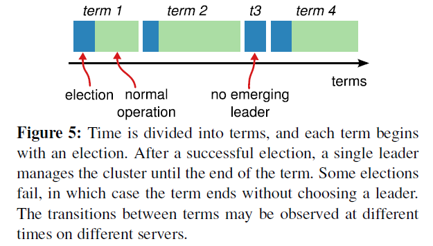
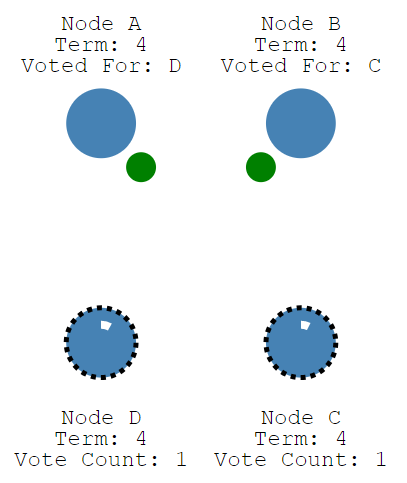
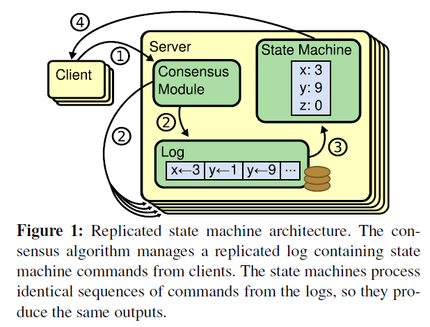
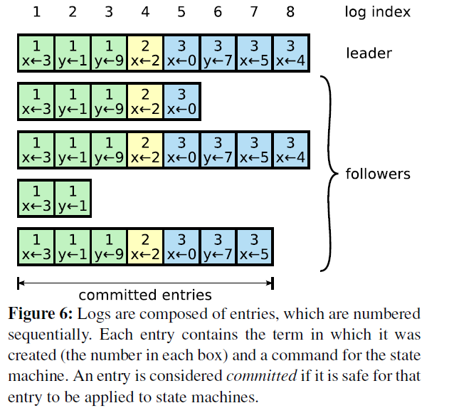
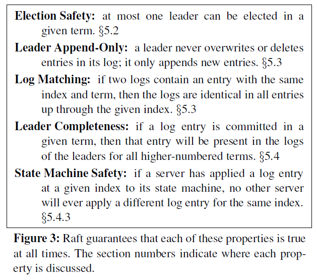
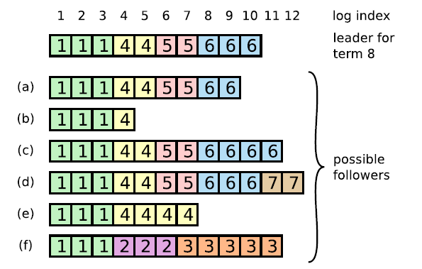
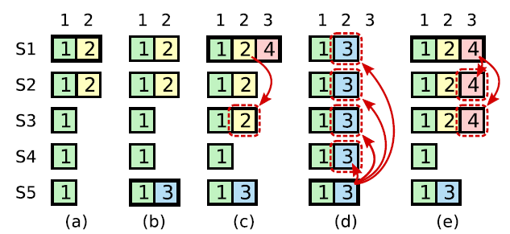
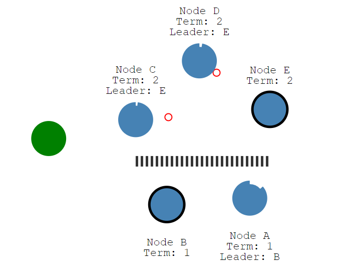
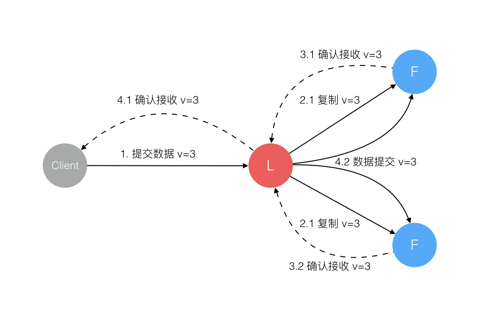

<h1 align="center">Thuật toán Đồng thuận Phân tán Raft (Consensus Algorithm)</h1>

  
Đây là 6 thông tin có thể sẽ hữu ích cho bạn:

⭐️1. A Tú cùng bạn bè hợp tác phát triển một website tài nguyên lập trình, hiện đã tổng hợp rất nhiều tài liệu học tập chất lượng và công cụ hữu ích (kèm link tải). Nếu bạn đang tìm kiếm tài nguyên lập trình phù hợp, <a href="https://tools.interviewguide.cn/home" style="text-decoration: underline" target="_blank">hoan nghênh trải nghiệm</a> cũng như giới thiệu những tài nguyên bạn thấy hay. Góp gió thành bão, mình vì mọi người, mọi người vì mình🔥!
  
2. 👉 Tháng 5/2023, trong thời gian <a style="text-decoration: underline" href="https://mp.weixin.qq.com/s?__biz=Mzk0ODU4MzEzMw==&mid=2247512170&idx=1&sn=c4a04a383d2dfdece676b75f17224e78" target="_blank">rời ByteDance để chuyển sang một công ty đa quốc gia</a>, nhằm thuận tiện cho bản thân khi tìm việc và nâng cao tỷ lệ trúng tuyển, A Tú cùng bạn bè đã phát triển từ con số 0 một website giải đề phỏng vấn thực chiến của các Big Tech, bao gồm hai frontend và một backend. Trang web cho phép tra cứu có định hướng đề thi viết của các công ty Internet, ví dụ như muốn tra cứu đề thi viết của ByteDance trong 1 năm gần đây gồm những gì đều có thể làm được. Hoan nghênh trải nghiệm~

Địa chỉ website: <a style="text-decoration: underline" href="https://niumacode.com/home?ref=F6O2625K" target="_blank">Website đề thi thuật toán phỏng vấn Big Tech</a>.
    
3. 😊
    Chia sẻ một website công cụ tiện ích mà A Tú tâm đắc sưu tầm, <a style="text-decoration: underline" href="https://hkjtz.cn/" target="_blank">nhấn vào đây để truy cập</a>, chủ yếu là các ứng dụng, website ngách hữu ích, ngoài ra còn có tài nguyên phim ảnh HD, âm nhạc, phim truyền hình, AI, phim tài liệu, tài liệu thi tiếng Anh, thi công chức, cao học, nghề tay trái...
  

  
4. 😍 Chia sẻ miễn phí tài nguyên học tập mà A Tú đã tích lũy từ khi theo học máy tính, <a style="text-decoration: underline" href="/notes/07-resources/01-free/01-introduce.html" target="_blank">nhấn vào đây để nhận miễn phí</a>; đồng thời cũng lưu lại nhật ký đánh giá <a style="text-decoration: underline" href="/notes/07-resources/02-precious.html" target="_blank">những cuốn sách máy tính, chuyên mục online chất lượng cũng như những khóa học trả phí kém chất lượng</a> từng mua trước đây.
  

  
5. 🚀 Nếu bạn muốn thuận lợi giành được offer tốt hơn trong kỳ tuyển dụng trường học (Campus Recruitment), A Tú khuyên bạn nên xem thêm những <a style="text-decoration: underline" href="https://www.yuque.com/tuobaaxiu/httmmc/npg1k81zeq4wfpyz" target="_blank">cạm bẫy từng vấp phải</a> và <a style="text-decoration: underline"  target="_blank" href="https://www.yuque.com/tuobaaxiu/httmmc/gge9ppd0mbu2d3dp">kinh nghiệm đúc kết</a> của người đi trước. Thực tế, hầu hết các vấn đề bạn đang gặp phải thì các anh chị khóa trước đều đã từng trải qua.
  

  
6. 🔥 Hoan nghênh các bạn đang chuẩn bị cho kỳ tuyển dụng trường học ngành CNTT tham gia <a  style="text-decoration: underline" href="https://www.yuque.com/tuobaaxiu/httmmc/xg0otqvc17wfx4u9" target="_blank">Cộng đồng học tập</a> của tôi. Độc hành một mình chi bằng cùng nhau sưởi ấm, trong nhóm đã đọng lại rất nhiều <a  style="text-decoration: underline" href="https://www.yuque.com/tuobaaxiu/httmmc/gge9ppd0mbu2d3dp" target="_blank">kinh nghiệm và tổng kết</a> của các anh chị khóa 21/22/23/24/25. Kiên trì đi theo lộ trình, cuối cùng đa phần đều có thể nhận được offer ưng ý! Nếu bạn cần phiên bản PDF tổng hợp các điểm kiến thức 📚︎ Bát cổ văn phỏng vấn tuyển dụng trường học trên website 《Ghi chép học tập của A Tú》, có thể <a style="text-decoration: underline" href="https://www.yuque.com/tuobaaxiu/httmmc/qs0yn66apvkzw0ps" target="_blank">nhấn vào đây để tải về</a>.
   

## 1. Tổng quan về Thuật toán Raft (Raft Overview)

Raft là một thuật toán đồng thuận (Consensus Algorithm) phân tán mạnh mẽ, dễ hiểu và được ứng dụng rộng rãi bậc nhất trong kỹ thuật công nghiệp hiện đại (như trong **etcd, TiKV, Kubernetes, Consul, CockroachDB**), thay thế cho Paxos vốn quá trừu tượng và khó cài đặt.

Mục tiêu số 1 của Raft là **Dễ hiểu (Understandability)** thông qua 2 kỹ thuật:
1. **Phân rã vấn đề (Problem Decomposition)**: Tách bài toán đồng thuận thành 3 module độc lập: **Bầu cử Leader (Leader Election)**, **Nhân bản Nhật ký (Log Replication)** và **An toàn (Safety)**.
2. **Đơn giản hóa trạng thái (State Space Reduction)**: Giới hạn số trạng thái không xác định trong hệ thống.

---

## 2. Bầu cử Thủ lĩnh (Leader Election)

Tại một thời điểm, mỗi Node trong cụm Raft luôn ở 1 trong **3 trạng thái**:
- **Follower (Người theo dõi)**: Trạng thái ban đầu, chỉ phản hồi RPC từ Leader và Candidate.
- **Candidate (Ứng viên)**: Chuyển sang khi hết thời gian chờ (Election Timeout) mà không nhận được Heartbeat từ Leader.
- **Leader (Thủ lĩnh)**: Tiếp nhận toàn bộ yêu cầu từ Client và điều phối nhật ký sang các Follower.

### Khái niệm Nhiệm kỳ (Term)
- Giữ vai trò như **Đồng hồ logic (Logical Clock)** trong hệ thống phân tán, là số nguyên đơn điệu tăng dần.
- Mỗi nhiệm kỳ bắt đầu bằng một cuộc bầu cử. Nếu có node thắng cử $\rightarrow$ Trở thành Leader của Term đó. Nếu xảy ra chia phiếu (Split Vote) $\rightarrow$ Hết timeout sẽ tăng Term và bầu lại.

### Quy trình Bầu cử & Chống Chia phiếu (Randomized Election Timeout)
1. Follower hết `election timeout` (ngẫu nhiên trong khoảng $150\text{ms} - 300\text{ms}$), tăng `currentTerm`, chuyển sang **Candidate**, tự bỏ cho mình 1 phiếu.
2. Gửi RPC `RequestVote` song song đến tất cả các node khác.
3. Node nào nhận được **Đa số phiếu bầu (Majority: $\ge \lfloor N/2 \rfloor + 1$)** sẽ thắng cử và trở thành Leader mới, lập tức gửi Heartbeat rỗng để duy trì quyền lực.
4. *Cơ chế Randomized Election Timeout*: Giúp các node không bao giờ hết hạn cùng một tích tắc, triệt tiêu nguy cơ chia phiếu (Split Vote).

---

## 3. Nhân bản Nhật ký (Log Replication)

### Cỗ máy Trạng thái Sao chép (Replicated State Machine)
$$\mathbf{Deterministic\ Logic + Identical\ Log\ Sequence = Identical\ State}$$
- Mọi node nạp cùng một chuỗi câu lệnh (Command) theo đúng thứ tự logic sẽ sinh ra trạng thái dữ liệu y hệt nhau.

### Quy trình Ghi dữ liệu:
1. Client gửi lệnh ghi đến Leader.
2. Leader ghi lệnh vào Log cục bộ của mình (chưa commit).
3. Leader gửi RPC `AppendEntries` song song sang toàn bộ Followers.
4. Khi nhận được phản hồi thành công từ **Đa số (Majority) node**, Leader chính thức **Commit** lệnh này và áp dụng vào State Machine của mình.
5. Leader trả về kết quả thành công cho Client.
6. Leader gửi thông báo Commit đến các Followers ở lượt Heartbeat tiếp theo để Followers áp dụng vào State Machine cục bộ.

---

## 4. Tính An toàn Cốt lõi (Safety Guarantees)

1. **Election Safety**: Mỗi Term chỉ có duy nhất tối đa 1 Leader được bầu.
2. **Leader Append-Only**: Leader không bao giờ ghi đè hoặc xóa bớt nhật ký của mình, chỉ nối thêm (Append-Only).
3. **Log Matching Property**: Nếu 2 node có cùng 1 Log Entry (cùng `index` và cùng `term`), thì toàn bộ chuỗi Log phía trước điểm đó ở cả 2 node đảm bảo **hoàn toàn trùng khớp 100%**.
4. **Leader Completeness (Điều kiện Bầu cử khắt khe)**: Node A chỉ bỏ phiếu cho Candidate B nếu Log của B **mới hơn hoặc bằng** Log của A (so sánh `term` của entry cuối cùng, nếu bằng nhau thì so sánh chiều dài `index`). Do đó, Leader mới trúng cử **chắc chắn chứa 100% tất cả các Committed Log Entries** từ các Term trước.
5. **State Machine Safety**: Không bao giờ có chuyện 2 State Machine ở 2 node khác nhau áp dụng 2 câu lệnh khác nhau tại cùng 1 vị trí `index`.

---

## 5. Xử lý các Tình huống Ngoại lệ (Edge Cases)

- **Phân tách mạng sinh ra Leader cũ (Stale Leader / Network Partition)**: Cụm thiểu số vẫn tưởng Leader cũ còn sống, nhưng Leader cũ không thể gom đủ Majority phiếu khi ghi nên không thể commit dữ liệu $\rightarrow$ Không gây sai lệch dữ liệu.
- **Raft không bao giờ Commit Log của Term cũ bằng cách đếm số Replicas**: Leader chỉ commit Log của chính Term hiện tại của mình bằng Majority, và thông qua Log Matching Property, tất cả các Log của Term trước đó sẽ tự động được gián tiếp commit an toàn.

