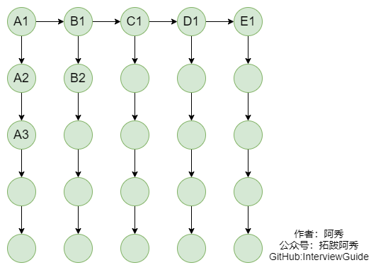
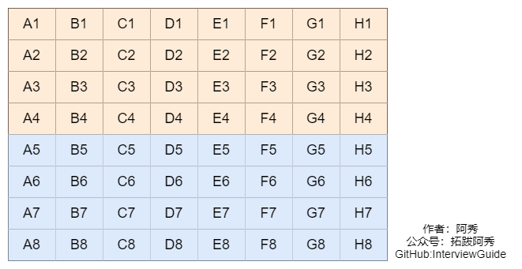
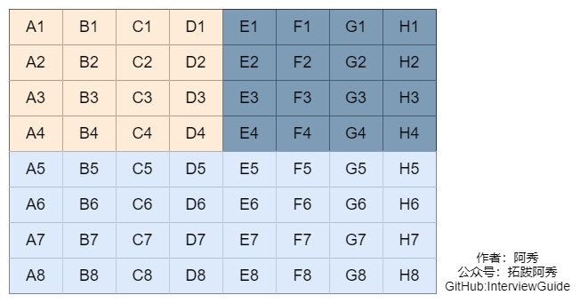
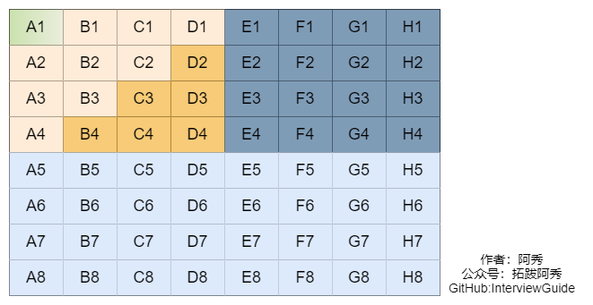
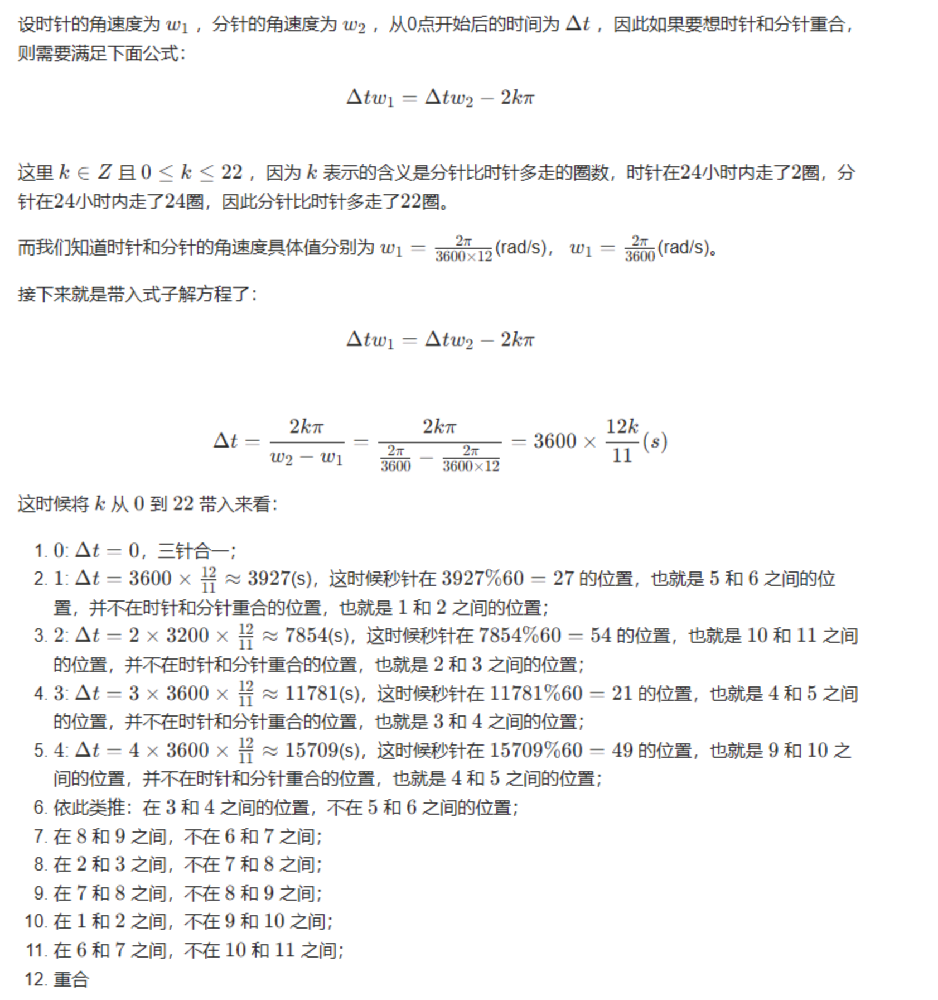

<h1 align="center">Tổng hợp Câu hỏi Trí tuệ và Xử lý Tình huống (Brain Teasers & Scenario Questions)</h1>

<p id="智力题情景题"></p>

<div style="border-color: #24C6DC;
            background-color: #e9f9f3;         
            margin: 1rem 0;
        padding: .25rem 1rem;
        border-left-width: .3rem;
        border-left-style: solid;
        border-radius: .5rem;
        color: inherit;">
  <p>Đây là 6 thông tin có thể sẽ hữu ích cho bạn:</p>
<p>⭐️1. A Tú cùng bạn bè hợp tác phát triển một <span style="font-weight:bold;color:red">website tài nguyên lập trình</span>, hiện đã tổng hợp rất nhiều tài liệu học tập chất lượng và công cụ hữu ích (kèm link tải). Nếu bạn đang tìm kiếm tài nguyên lập trình phù hợp, <a href="https://tools.interviewguide.cn/home" style="text-decoration: underline" target="_blank">hoan nghênh trải nghiệm</a> cũng như giới thiệu những tài nguyên bạn thấy hay. Góp gió thành bão, mình vì mọi người, mọi người vì mình🔥!</p>  <p>2. 👉 Tháng 5/2023, trong thời gian <a style="text-decoration: underline" href="https://mp.weixin.qq.com/s?__biz=Mzk0ODU4MzEzMw==&mid=2247512170&idx=1&sn=c4a04a383d2dfdece676b75f17224e78" target="_blank">rời ByteDance để chuyển sang một công ty đa quốc gia</a>, nhằm <span style="font-weight:bold">thuận tiện cho bản thân khi tìm việc và nâng cao tỷ lệ trúng tuyển</span>, A Tú cùng bạn bè đã phát triển từ con số 0 một <span style="font-weight:bold;color:red">website giải đề phỏng vấn thực chiến của các Big Tech</span>, bao gồm hai frontend và một backend. Trang web cho phép tra cứu có định hướng đề thi viết của các công ty Internet, ví dụ như muốn tra cứu đề thi viết của ByteDance trong 1 năm gần đây gồm những gì đều có thể làm được. Hoan nghênh trải nghiệm~
<div align="center">
</div>Địa chỉ website: <a style="text-decoration: underline" href="https://niumacode.com/home?ref=F6O2625K" target="_blank">Website đề thi thuật toán phỏng vấn Big Tech</a>.
    </p>3. 😊
    Chia sẻ một <span style="font-weight:bold;color:red">website công cụ tiện ích</span> mà A Tú tâm đắc sưu tầm, <a style="text-decoration: underline" href="https://hkjtz.cn/" target="_blank">nhấn vào đây để truy cập</a>, chủ yếu là các ứng dụng, website ngách hữu ích, ngoài ra còn có tài nguyên phim ảnh HD, âm nhạc, phim truyền hình, AI, phim tài liệu, tài liệu thi tiếng Anh, thi công chức, cao học, nghề tay trái...
  </p>
  <p>4. 😍 Chia sẻ miễn phí tài nguyên học tập mà A Tú đã tích lũy từ khi theo học máy tính, <a style="text-decoration: underline" href="/notes/07-resources/01-free/01-introduce.html" target="_blank">nhấn vào đây để nhận miễn phí</a>; đồng thời cũng lưu lại nhật ký đánh giá <a style="text-decoration: underline" href="/notes/07-resources/02-precious.html" target="_blank">những cuốn sách máy tính, chuyên mục online chất lượng cũng như những khóa học trả phí kém chất lượng</a> từng mua trước đây.
  </p>
  <p>5. 🚀 Nếu bạn muốn thuận lợi giành được offer tốt hơn trong kỳ tuyển dụng trường học (Campus Recruitment), A Tú khuyên bạn nên xem thêm những <a style="text-decoration: underline" href="https://www.yuque.com/tuobaaxiu/httmmc/npg1k81zeq4wfpyz" target="_blank">cạm bẫy từng vấp phải</a> và <a style="text-decoration: underline"  target="_blank" href="https://www.yuque.com/tuobaaxiu/httmmc/gge9ppd0mbu2d3dp">kinh nghiệm đúc kết</a> của người đi trước. Thực tế, hầu hết các vấn đề bạn đang gặp phải thì các anh chị khóa trước đều đã từng trải qua.
  </p>
  <p>6. 🔥 Hoan nghênh các bạn đang chuẩn bị cho kỳ tuyển dụng trường học ngành CNTT tham gia <a  style="text-decoration: underline" href="https://www.yuque.com/tuobaaxiu/httmmc/xg0otqvc17wfx4u9" target="_blank">Cộng đồng học tập</a> của tôi. Độc hành một mình chi bằng cùng nhau sưởi ấm, trong nhóm đã đọng lại rất nhiều <a  style="text-decoration: underline" href="https://www.yuque.com/tuobaaxiu/httmmc/gge9ppd0mbu2d3dp" target="_blank">kinh nghiệm và tổng kết</a> của các anh chị khóa 21/22/23/24/25. Kiên trì đi theo lộ trình, cuối cùng đa phần đều có thể nhận được offer ưng ý! Nếu bạn cần phiên bản PDF tổng hợp các điểm kiến thức 📚︎ Bát cổ văn phỏng vấn tuyển dụng trường học trên website 《Ghi chép học tập của A Tú》, có thể <a style="text-decoration: underline" href="https://www.yuque.com/tuobaaxiu/httmmc/qs0yn66apvkzw0ps" target="_blank">nhấn vào đây để tải về</a>.</p>   </div>

## 1. Bài toán Ba người và Ba con quỷ qua sông

- **Đề bài**: Có 3 người và 3 quỷ cần qua sông bằng một chiếc thuyền chở tối đa 2 đối tượng (2 người, 2 quỷ, hoặc 1 người 1 quỷ). Thuyền cần ít nhất 1 người/quỷ chèo. Ở bất kỳ bờ sông nào, nếu số quỷ nhiều hơn số người thì người sẽ bị ăn thịt. Làm sao để cả 6 cùng sang bờ an toàn?
- **Lời giải**:
  1. 2 quỷ sang $\rightarrow$ 1 quỷ chèo về (Bờ đối diện: 1 quỷ | Bờ gốc: 3 người, 2 quỷ).
  2. 2 quỷ sang $\rightarrow$ 1 quỷ chèo về (Bờ đối diện: 2 quỷ | Bờ gốc: 3 người, 1 quỷ).
  3. 2 người sang $\rightarrow$ 1 người và 1 quỷ chèo về (Bờ đối diện: 1 người, 1 quỷ | Bờ gốc: 2 người, 2 quỷ).
  4. 2 người sang $\rightarrow$ 1 quỷ chèo về (Bờ đối diện: 3 người | Bờ gốc: 3 quỷ).
  5. 2 quỷ sang $\rightarrow$ 1 quỷ chèo về $\rightarrow$ 2 quỷ cuối cùng sang $\rightarrow$ **Hoàn thành**.

## 2. Bài toán Đua ngựa tìm các con nhanh nhất (Đặc sản Phỏng vấn Big Tech - Tencent/ByteDance)

### Dạng 1: 25 con ngựa, 5 đường đua, tìm Top 3 con nhanh nhất

- **Lời giải**: Cần tối thiểu **7 lượt đua**.
  - *5 lượt đầu*: Chia thành 5 bảng A, B, C, D, E đua riêng $\rightarrow$ Xếp hạng nội bộ $A_1 > A_2 > A_3 > A_4 > A_5$, tương tự cho B, C, D, E.
  - *Lượt 6*: Cho 5 con đầu bảng ($A_1, B_1, C_1, D_1, E_1$) đua với nhau. Giả sử $A_1 > B_1 > C_1 > D_1 > E_1$.
    - $\implies A_1$ chắc chắn là **Top 1 toàn giải**.
    - Loại bỏ toàn bộ nhóm D và E, loại bỏ $C_2, C_3$, loại bỏ $B_3$.
  - *Lượt 7*: Đua giữa 5 ứng viên còn lại: $A_2, A_3, B_1, B_2, C_1$ để lấy Top 2 và Top 3.

### Dạng 2: 64 con ngựa, 8 đường đua, tìm Top 4 con nhanh nhất



- **Lời giải**: Cần **11 lượt đua** ($8 + 1 + 1 + 1$).

### Dạng 3: 25 con ngựa, 5 đường đua, tìm Top 5 con nhanh nhất
- **Lời giải**: Cần **ít nhất 8 lượt và nhiều nhất 9 lượt đua**.

<p id="给定随机函数生成别的随机数"></p>

## 3. Chuyển đổi Hàm sinh số ngẫu nhiên `Rand5()` $\rightarrow$ `Rand7()`

- **Công thức cốt lõi**:
  $$\text{Rand}_{N^2} = N \times (\text{Rand}_N() - 1) + \text{Rand}_N()$$
- Với $N=5$, $\text{Rand}_{25} = 5 \times (\text{Rand}_5() - 1) + \text{Rand}_5()$ sinh số ngẫu nhiên phân bổ đều từ $1$ đến $25$.
- Chỉ giữ lại các giá trị từ $1$ đến $21$ (bội số của 7), bỏ qua các giá trị $> 21$ để tránh lệch xác suất:
```cpp
int rand7() {
    int x = 25;
    while (x > 21) {
        x = 5 * (rand5() - 1) + rand5();
    }
    return (x % 7) + 1;
}
```

<p id="砝码称轻重找出最轻的"></p>

## 4. Bài toán Cân quả cân tìm quả nhẹ nhất

1. **9 quả cân có 1 quả nhẹ hơn, dùng cân đĩa 2 bên**: Tối thiểu **2 lần cân** (Chia thành 3-3-3 $\rightarrow$ Lần 1 lấy nhóm 3 quả nhẹ nhất $\rightarrow$ Lần 2 cân 1-1 để chỉ đích danh quả nhẹ).
2. **10 nhóm quả cân (mỗi nhóm 10 quả 10g), có 1 nhóm bị lỗi mỗi quả 9g, có cân điện tử hiện số gram**: Tối thiểu **1 lần cân** (Lấy từ nhóm $i$ đúng $i$ quả cân $\implies$ Tổng số quả là $\sum_{i=1}^{10} i = 55$ quả. Trọng lượng chuẩn $550\text{g}$. Nhóm nhẹ là nhóm số $y = 550 - \text{khối lượng đo được}$).

<p id="利用空瓶换饮料最多喝几瓶"></p>

## 5. Bài toán Đổi vỏ chai nước ngọt

- **Đề bài**: Có 1000 chai nước, cứ 3 vỏ chai đổi được 1 chai mới. Hỏi uống được tối đa bao nhiêu chai?
- **Lời giải**:
  - Mỗi lần đổi: mất 3 vỏ nhận lại 1 chai (tương đương tiêu tốn $3 - 1 = 2$ vỏ chai để uống thêm 1 chai).
  - Giữ lại 2 vỏ cuối cùng không đổi được: $\frac{1000 - 2}{2} = 499$ chai đổi thêm.
  - Tổng số chai uống được: $1000 + 499 = \mathbf{1499\text{ chai}}$.

<p id="毒药毒白鼠找出哪个瓶子中是毒药"></p>

## 6. Bài toán 1000 Chai nước có 1 Chai Độc - 10 Con chuột (Tư duy Nhị phân)

- **Đề bài**: 1000 chai nước có đúng 1 chai chứa thuốc độc phát tác sau 1 tuần. Có 10 con chuột và đúng 1 tuần để tìm chai độc.
- **Lời giải**:
  - $2^{10} = 1024 > 1000 \implies$ Đánh mã số nhị phân 10 bit cho từng chai nước từ 1 đến 1000 ($0000000001_2$ đến $1111101000_2$).
  - Gán 10 con chuột tương ứng với 10 vị trí bit từ 0 đến 9. Chuột thứ $k$ sẽ uống nước từ tất cả các chai có bit thứ $k$ bằng 1.
  - Sau 1 tuần, quan sát chuột chết: Ví dụ chuột ở các vị trí bit 0, 2, 5, 6, 9 chết $\implies$ Chai độc có mã nhị phân $1001100101_2 = \mathbf{613}$.

<p id="利用烧绳子计算时间"></p>

## 7. Bài toán Đốt dây không đồng chất tính thời gian

- Mỗi sợi dây cháy hết trong đúng 60 phút nhưng tốc độ cháy không đều:
  - **Tính 30 phút**: Đốt đồng thời cả 2 đầu của 1 sợi dây.
  - **Tính 45 phút**: Lấy 2 sợi dây A và B. Đốt 2 đầu sợi A và 1 đầu sợi B. Khi sợi A cháy hết (vừa tròn 30 phút), lập tức châm lửa đầu còn lại của sợi B. Sợi B sẽ cháy hết phần còn lại trong đúng 15 phút nữa $\implies 30 + 15 = \mathbf{45\text{ phút}}$.
  - **Tính 15 phút**: Đốt 2 đầu sợi dây đã qua 30 phút (như nửa sau của bài 45 phút).

<p id="在小时里面时针分针秒针可以重合几次"></p>

## 8. Trong 24 giờ, Kim Giờ, Kim Phút và Kim Giây trùng nhau bao nhiêu lần?


- **Lời giải chuẩn xác toán học**: Kim Giờ và Kim Phút gặp nhau 22 lần, nhưng Kim Giây chỉ trùng khớp vị trí đúng tại thời điểm **0h00 (hoặc 24h00)** và **12h00 trưa**. Do đó trong 24 giờ cả 3 kim chỉ trùng nhau đúng **2 lần**.

<p id="个奴隶猜帽子颜色"></p>

## 9. Bài toán 100 Tù nhân đoán màu Mũ Trắng/Đen

- Người thứ 100 (đứng cuối nhìn thấy 99 người trước): Đếm tổng số mũ ĐEN phía trước. Nếu là số LẺ thì hô "ĐEN", nếu là CHẴN thì hô "TRẮNG" (chấp nhận 50% sống chết để làm tín hiệu Parity Check).
- Người thứ 99 đến người 1: Dựa vào tính chẵn lẻ ban đầu và các câu trả lời của người đứng sau để suy ra chính xác 100% màu mũ của mình.
- **Kết quả**: **99 người sống 100%, 1 người sống 50%**.

<p id="小猴子搬香蕉"></p>

## 10. Bài toán Khỉ vận chuyển Chuối

- 100 quả chuối, quãng đường 50m, khỉ mang tối đa 50 quả, đi 1m ăn 1 quả:
  - *Giai đoạn 1*: Vận chuyển đi-về tiêu tốn 3 quả/m đến mốc 17m (tiêu thụ $17 \times 3 = 51$ quả, còn 49 quả).
  - *Giai đoạn 2*: Mang thẳng 49 quả đi nốt $50 - 17 = 33\text{m}$, ăn hết 33 quả $\implies$ Mang về nhà được **16 quả**.

<p id="高楼扔鸡蛋经典问题"></p>

## 11. Bài toán Ném 2 Quả trứng từ Tòa nhà 100 Tầng

- Phương trình tối ưu cân bằng số lần thử ở trường hợp xấu nhất:
  $$x + (x - 1) + (x - 2) + \dots + 1 \ge 100 \iff \frac{x(x + 1)}{2} \ge 100 \implies x = \mathbf{14}$$
- **Chiến lược**: Ném quả 1 ở các tầng: **14, 27, 39, 50, 60, 69, 77, 84, 90, 95, 99, 100**. Khi quả 1 vỡ ở tầng nào thì dùng quả 2 thử tuyến tính từ tầng kế tiếp của mốc trước đó. Số lần thử tối đa không bao giờ vượt quá **14 lần**.

<p id="N只蚂蚁走树枝，问总距离或者总时间"></p>

## 12. Bài toán N con Kiến bò trên cành cây

- Khi 2 con kiến đâm vào nhau đổi hướng, ta có thể coi như **2 con kiến đi xuyên qua nhau mà không có chuyện gì xảy ra**. Mỗi con kiến vẫn tiếp tục hành trình độc lập với tốc độ không đổi.

<p id="N个强盗分配M个金币求方案使得自己分配最多"></p>

## 13. Bài toán 5 Tên Hải tặc chia 100 Đồng tiền vàng (Game Theory)

- Áp dụng phương pháp Quy nạp ngược (Backward Induction):
- Để chiếm được đa số phiếu ủng hộ ($> 50\%$, tức cần 3 phiếu gồm chính mình + 2 người khác), Tên số 1 chỉ cần mua chuộc 2 người có nguy cơ trắng tay ở vòng sau với mức giá tối thiểu:
  - Phương án tối ưu: **(97, 0, 1, 2, 0)** hoặc **(97, 0, 1, 0, 2)** $\implies$ Tên số 1 ôm trọn **97 đồng vàng**.

<p id="火枪手决斗谁活下来的概率大"></p>

## 14. Bài toán 3 Tay súng Quyết đấu (Xác suất & Chiến lược)

- Giáp (bắn trúng 80%), Ất (trúng 60%), Bính (trúng 40%).
- *Chiến lược tối ưu*: Cả Giáp và Ất đều xem đối phương là mối đe dọa lớn nhất nên nhắm bắn nhau trước. Bính là người ít bị đe dọa nhất nên **Bính có tỷ lệ sống sót cao nhất (75.52%)**, trong khi Giáp chỉ có 12.67% và Ất chỉ có 10.08%.

<p id="先手必胜的问题"></p>

## 15. Trò chơi Bốc sách: Ai bốc cuốn cuối cùng sẽ thắng

- 100 cuốn sách, mỗi lượt bốc 1-5 cuốn:
  - Đưa tổng số bốc mỗi vòng về $1 + 5 = 6$.
  - Người đi trước bốc trước $100 \pmod 6 = \mathbf{4\text{ cuốn}}$. Sau đó cứ đối phương bốc $k$ cuốn thì mình bốc $6 - k$ cuốn $\implies$ **Người đi trước chắc chắn thắng 100%**.

<p id="掰巧克力问题或者参加辩论赛"></p>

## 16. Bài toán Bẻ thanh Socola & Đấu loại trực tiếp

1. **Bẻ Socola $N \times M$ thành các ô $1 \times 1$**: Mỗi nhát bẻ tăng thêm đúng 1 mảnh socola $\implies$ Luôn cần đúng **$N \times M - 1$ lần bẻ**.
2. **1000 người thi đấu loại trực tiếp 1v1**: Mỗi trận đấu loại chính xác 1 người $\implies$ Cần đúng $1000 - 1 = \mathbf{999\text{ trận đấu}}$.
