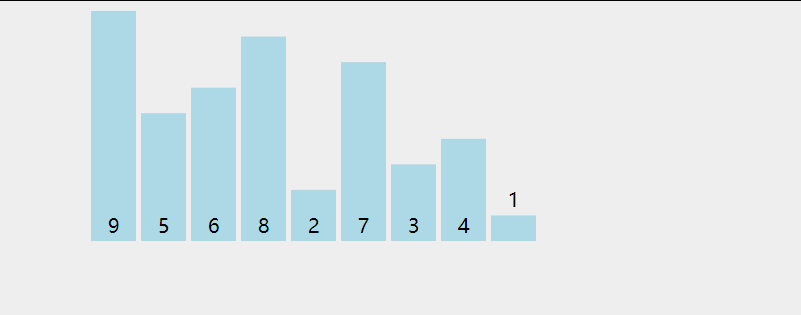
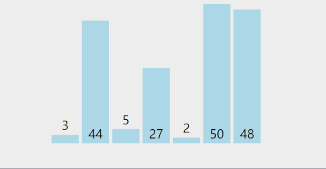
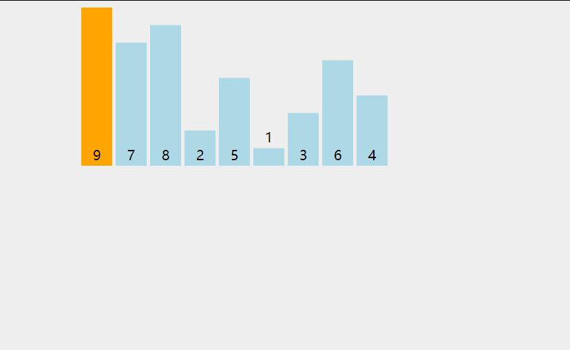
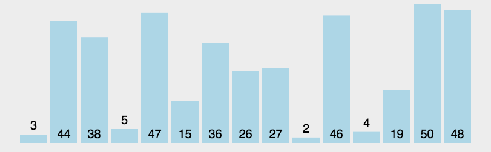
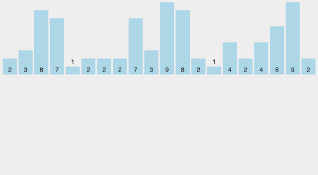
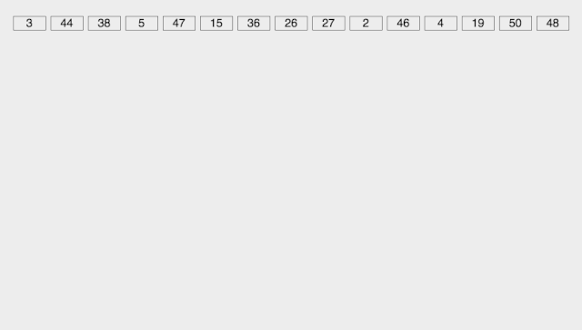

<h1 align="center">Kiến thức Nền tảng Thuật toán và 10 Thuật toán Sắp xếp Kinh điển</h1>

<p id="算法基础"></p>

> Phần thuật toán được A Tú đúc kết và phân loại theo nhiều cấp độ từ cơ bản đến nâng cao. Nếu bạn chưa biết bắt đầu từ đâu, hãy xem [Hướng dẫn tại đây](/notes/03-hunting_job/03-algorithm/01-basic-algorithm/01-introduce.md).

Trong các buổi phỏng vấn kỹ thuật, **10 Thuật toán Sắp xếp Kinh điển** có tần suất xuất hiện cực kỳ cao, đặc biệt là Bubble Sort, Quick Sort, Merge Sort, Heap Sort... Chi tiết danh mục xem tại [Đề thi Thuật toán Tần suất cao](/notes/03-hunting_job/03-algorithm/04-high_frquency_algorithm/01-high_frquency_algorithm.md).

---

<p id="冒泡排序"></p>

### 1. Sắp xếp Nổi bọt (Bubble Sort)

- **Nguyên lý**: So sánh hai phần tử liền kề nhau và hoán đổi nếu chúng sai thứ tự. Sau mỗi lượt lặp, phần tử lớn nhất sẽ "nổi" dần về cuối mảng.
- **Tính ổn định**: **Ổn định (Stable)** (do hai phần tử bằng nhau sẽ không bị hoán đổi vị trí).
- **Độ phức tạp**: Thời gian $O(n^2)$, Không gian $O(1)$ (Thuật toán tại chỗ - In-place).



#### Các bước thực hiện:
1. So sánh từng cặp phần tử liền kề. Nếu phần tử trước lớn hơn phần tử sau thì hoán đổi.
2. Lặp lại cho toàn bộ mảng. Sau lượt đầu tiên, phần tử lớn nhất nằm ở vị trí cuối cùng.
3. Lặp lại với $n-1$ phần tử còn lại cho đến khi không còn cặp nào cần hoán đổi.

```cpp
// Bản cơ bản
void bubbleSort(vector<int>& nums) {
    int n = nums.size();
    for (int i = 0; i < n - 1; ++i) {
        for (int j = 0; j < n - 1 - i; ++j) {
            if (nums[j] > nums[j + 1]) {
                swap(nums[j], nums[j + 1]);
            }
        }
    }
}

// Bản tối ưu với cờ hiệu (Flag)
void bubbleSortOptimized(vector<int>& nums) {
    int n = nums.size();
    bool swapped = false;
    for (int i = 0; i < n - 1; ++i) {
        swapped = false;
        for (int j = 0; j < n - 1 - i; ++j) {
            if (nums[j] > nums[j + 1]) {
                swap(nums[j], nums[j + 1]);
                swapped = true;
            }
        }
        // Nếu trong một lượt quét không xảy ra bất kỳ hoán đổi nào -> Mảng đã có thứ tự hoàn hảo
        if (!swapped) break;
    }
}
```

---

<p id="选择排序"></p>

### 2. Sắp xếp Chọn (Selection Sort)

- **Nguyên lý**: Tìm phần tử nhỏ nhất trong đoạn chưa sắp xếp rồi hoán đổi về đầu đoạn.
- **Tính ổn định**: **Không ổn định (Unstable)** (Ví dụ dãy `5, 8, 5, 2, 9` $\rightarrow$ số 5 đầu tiên sẽ bị đổi với số 2, làm thay đổi vị trí tương đối giữa 2 số 5).
- **Độ phức tạp**: Thời gian $O(n^2)$, Không gian $O(1)$.




```cpp
void selectionSort(vector<int>& nums) {
    int n = nums.size();
    for (int i = 0; i < n - 1; ++i) {
        int minIndex = i;
        for (int j = i + 1; j < n; ++j) {
            if (nums[j] < nums[minIndex]) {
                minIndex = j;
            }
        }
        swap(nums[i], nums[minIndex]);
    }
}
```

---

<p id="插入排序"></p>

### 3. Sắp xếp Chèn (Insertion Sort)

- **Nguyên lý**: Xây dựng mảng con đã sắp xếp ở đầu, duyệt từng phần tử tiếp theo và chèn vào vị trí thích hợp bằng cách dịch chuyển các phần tử lớn hơn nó sang phải.
- **Tính ổn định**: **Ổn định (Stable)**.
- **Độ phức tạp**: Thời gian tốt nhất $O(n)$ (mảng đã có thứ tự sẵn), trung bình và xấu nhất $O(n^2)$, Không gian $O(1)$.



```cpp
void insertionSort(vector<int>& a, int n) {
    for (int i = 1; i < n; ++i) {
        if (a[i] < a[i - 1]) {
            int key = a[i];
            int j = i - 1;
            while (j >= 0 && a[j] > key) {
                a[j + 1] = a[j];
                j--;
            }
            a[j + 1] = key;
        }
    }
}
```

---

<p id="快速排序"></p>

### 4. Sắp xếp Nhanh (Quick Sort - Trọng tâm phỏng vấn)

- **Nguyên lý (Chia để trị)**:
  1. Chọn một phần tử làm chốt (Pivot / Key).
  2. Phân vùng (Partition): Đưa các phần tử nhỏ hơn chốt sang bên trái, các phần tử lớn hơn hoặc bằng chốt sang bên phải.
  3. Đệ quy sắp xếp hai nửa trái và phải.
- **Tính ổn định**: **Không ổn định (Unstable)**.
- **Độ phức tạp**: Thời gian trung bình $O(n \log n)$, xấu nhất $O(n^2)$ (khi mảng đã có thứ tự và luôn chọn chốt ở đầu), Không gian $O(\log n)$ cho Stack đệ quy.



```cpp
void quickSort(vector<int>& nums, int low, int high) {
    if (low >= high) return;
    int first = low, last = high;
    int key = nums[first]; // Chọn phần tử đầu làm chốt

    while (first < last) {
        // Quét từ phải qua trái tìm phần tử nhỏ hơn chốt
        while (first < last && nums[last] >= key) {
            last--;
        }
        if (first < last) nums[first++] = nums[last];

        // Quét từ trái qua phải tìm phần tử lớn hơn chốt
        while (first < last && nums[first] <= key) {
            first++;
        }
        if (first < last) nums[last--] = nums[first];
    }
    nums[first] = key;

    quickSort(nums, low, first - 1);
    quickSort(nums, first + 1, high);
}
```

---

<p id="希尔排序"></p>

### 5. Sắp xếp Shell (Shell Sort)

- **Nguyên lý**: Là biến thể cải tiến của Insertion Sort, so sánh và hoán đổi các phần tử cách nhau một khoảng bước nhảy $gap$ ($gap = n/2, n/4, \dots, 1$).
- **Tính ổn định**: **Không ổn định (Unstable)**.
- **Độ phức tạp**: Thời gian $O(n \log^2 n)$ đến $O(n^{1.3})$, Không gian $O(1)$.


```cpp
void shellSort(vector<int>& nums) {
    int n = nums.size();
    for (int gap = n / 2; gap > 0; gap /= 2) {
        for (int i = gap; i < n; ++i) {
            int temp = nums[i];
            int j;
            for (j = i - gap; j >= 0 && nums[j] > temp; j -= gap) {
                nums[j + gap] = nums[j];
            }
            nums[j + gap] = temp;
        }
    }
}
```

---

<p id="归并排序"></p>

### 6. Sắp xếp Trộn (Merge Sort - Trọng tâm phỏng vấn)

- **Nguyên lý (Chia để trị)**:
  1. Chia mảng thành 2 nửa đều nhau.
  2. Đệ quy sắp xếp từng nửa mảng.
  3. Trộn (Merge) 2 mảng con đã có thứ tự thành 1 mảng hoàn chỉnh.
- **Tính ổn định**: **Ổn định (Stable)**.
- **Độ phức tạp**: Thời gian luôn là $O(n \log n)$ trong mọi trường hợp, Không gian phụ trợ $O(n)$.


```cpp
// Bản đệ quy chuẩn
void mergeSortCore(vector<int>& nums, vector<int>& temp, int low, int high) {
    if (low >= high) return;
    int mid = low + (high - low) / 2;
    int start1 = low, end1 = mid;
    int start2 = mid + 1, end2 = high;

    mergeSortCore(nums, temp, start1, end1);
    mergeSortCore(nums, temp, start2, end2);

    int k = low;
    while (start1 <= end1 && start2 <= end2) {
        temp[k++] = nums[start1] <= nums[start2] ? nums[start1++] : nums[start2++];
    }
    while (start1 <= end1) temp[k++] = nums[start1++];
    while (start2 <= end2) temp[k++] = nums[start2++];

    for (int i = low; i <= high; ++i) {
        nums[i] = temp[i];
    }
}

void mergeSort(vector<int>& nums) {
    vector<int> temp(nums.size());
    mergeSortCore(nums, temp, 0, nums.size() - 1);
}
```

---

<p id="堆排序"></p>

### 7. Sắp xếp Vun đống (Heap Sort)

- **Nguyên lý**:
  1. Xây dựng Max-Heap từ mảng ban đầu (gốc đống là phần tử lớn nhất).
  2. Hoán đổi gốc đống với phần tử cuối cùng của mảng, thu nhỏ kích thước đống đi 1 và thực hiện `heapify` tại gốc.
  3. Lặp lại cho đến khi đống chỉ còn 1 phần tử.
- **Tính ổn định**: **Không ổn định (Unstable)**.
- **Độ phức tạp**: Thời gian luôn là $O(n \log n)$, Không gian $O(1)$.

```cpp
void heapify(vector<int>& nums, int n, int i) {
    int largest = i;
    int left = 2 * i + 1;
    int right = 2 * i + 2;

    if (left < n && nums[left] > nums[largest]) largest = left;
    if (right < n && nums[right] > nums[largest]) largest = right;

    if (largest != i) {
        swap(nums[i], nums[largest]);
        heapify(nums, n, largest);
    }
}

void heapSort(vector<int>& nums) {
    int n = nums.size();
    // Xây dựng Max-Heap từ nút lá không phải cuối cùng
    for (int i = n / 2 - 1; i >= 0; i--) {
        heapify(nums, n, i);
    }
    // Trích xuất từng phần tử lớn nhất về cuối mảng
    for (int i = n - 1; i > 0; i--) {
        swap(nums[0], nums[i]);
        heapify(nums, i, 0);
    }
}
```

---

<p id="计数排序"></p>

### 8. Sắp xếp Đếm (Counting Sort)

- **Nguyên lý**: Không sử dụng phép so sánh. Đếm số lần xuất hiện của từng giá trị trong mảng rồi tính mảng cộng dồn tần suất để đặt phần tử vào đúng vị trí đích.
- **Tính ổn định**: **Ổn định (Stable)** khi duyệt ngược.
- **Độ phức tạp**: Thời gian $O(n + k)$, Không gian $O(k)$ ($k$ là phạm vi giá trị lớn nhất).



```cpp
void countingSort(vector<int>& nums) {
    if (nums.empty()) return;
    int maxVal = *max_element(nums.begin(), nums.end());
    int minVal = *min_element(nums.begin(), nums.end());
    int range = maxVal - minVal + 1;

    vector<int> count(range, 0);
    for (int x : nums) count[x - minVal]++;
    for (int i = 1; i < range; ++i) count[i] += count[i - 1];

    vector<int> output(nums.size());
    for (int i = nums.size() - 1; i >= 0; --i) {
        output[--count[nums[i] - minVal]] = nums[i];
    }
    nums = output;
}
```

---

<p id="桶排序"></p>

### 9. Sắp xếp Thùng (Bucket Sort)

- **Nguyên lý**: Chia miền giá trị thành các thùng (Buckets) đều nhau, phân phối các phần tử vào từng thùng, sắp xếp độc lập từng thùng (thường dùng Insertion Sort), sau đó nối các thùng lại theo thứ tự.
- **Độ phức tạp**: Thời gian trung bình $O(n + k)$, xấu nhất $O(n^2)$, Không gian $O(n + k)$.


---

<p id="基数排序"></p>

### 10. Sắp xếp Cơ số (Radix Sort)

- **Nguyên lý**: Sắp xếp các chữ số từ hàng thấp đến hàng cao (LSD - Least Significant Digit) bằng thuật toán sắp xếp đếm ổn định.
- **Tính ổn định**: **Ổn định (Stable)**.
- **Độ phức tạp**: Thời gian $O(d \times (n + k))$ ($d$ là số chữ số lớn nhất), Không gian $O(n + k)$.



```cpp
int getMaxDigits(const vector<int>& nums) {
    int maxVal = *max_element(nums.begin(), nums.end());
    int d = 0;
    while (maxVal > 0) {
        maxVal /= 10;
        d++;
    }
    return d == 0 ? 1 : d;
}

void radixSort(vector<int>& nums) {
    int d = getMaxDigits(nums);
    int n = nums.size();
    vector<int> temp(n);
    int radix = 1;

    for (int step = 0; step < d; ++step) {
        vector<int> count(10, 0);
        for (int x : nums) {
            int k = (x / radix) % 10;
            count[k]++;
        }
        for (int i = 1; i < 10; ++i) count[i] += count[i - 1];
        for (int i = n - 1; i >= 0; --i) {
            int k = (nums[i] / radix) % 10;
            temp[--count[k]] = nums[i];
        }
        nums = temp;
        radix *= 10;
    }
}
```
