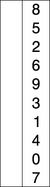

<h1 align="center">Sắp xếp Chọn (Selection Sort)</h1>

<p id="算法基础"></p>

> Phần thuật toán được A Tú đúc kết và phân loại theo nhiều cấp độ từ cơ bản đến nâng cao. Nếu bạn chưa biết bắt đầu từ đâu, hãy xem [Hướng dẫn tại đây](/notes/03-hunting_job/03-algorithm/01-basic-algorithm/01-introduce.md).

Trong các buổi phỏng vấn kỹ thuật, 10 Thuật toán Sắp xếp Kinh điển có tần suất xuất hiện cực kỳ cao, [**chi tiết có thể xem tại đây**](/notes/03-hunting_job/03-algorithm/04-high_frquency_algorithm/01-high_frquency_algorithm.md).

<p id="选择排序"></p>

## Sắp xếp Chọn (Selection Sort)

Sắp xếp chọn là việc tìm kiếm phần tử nhỏ nhất trong đoạn chưa được sắp xếp và đưa về vị trí đầu tiên của đoạn đó. Lần lượt tiếp tục tìm phần tử nhỏ thứ 2 đặt vào vị trí thứ 2, cứ thế cho đến phần tử thứ $n-1$.

Nếu trong một lượt chọn, phần tử hiện tại nhỏ hơn một phần tử khác, nhưng phần tử nhỏ này lại nằm sau một phần tử có giá trị bằng với phần tử hiện tại, thì sau khi hoán đổi thứ tự tương đối ban đầu sẽ bị phá vỡ.
Ví dụ: Dãy `5, 8, 5, 2, 9` $\rightarrow$ Lượt đầu tiên số 5 đầu tiên sẽ đổi chỗ cho số 2 $\implies$ Thứ tự tương đối của hai số 5 bị thay đổi. Vì vậy Sắp xếp Chọn là **Thuật toán sắp xếp KHÔNG ỔN ĐỊNH (Unstable)**.



### Các bước thực hiện:
1. Tìm phần tử nhỏ nhất (hoặc lớn nhất) trong dãy chưa sắp xếp, đặt vào vị trí khởi đầu.
2. Tìm tiếp phần tử nhỏ nhất trong phần còn lại, đưa vào cuối dãy đã sắp xếp.
3. Lặp lại quá trình trên cho đến khi toàn bộ mảng được sắp xếp xong.
4. **Độ phức tạp**: Thời gian $O(n^2)$, Không gian $O(1)$, Không ổn định, Sắp xếp tại chỗ (In-place).


### Mã nguồn C++

```cpp
void selectionSort(vector<int>& a, int n) {
    int minIndex;
    for (int i = 0; i < n; ++i) {
        minIndex = i;
        for (int j = i + 1; j < n; ++j) {
            if (a[j] < a[minIndex]) minIndex = j;
        }
        swap(a[i], a[minIndex]);    
    }
}
```

```cpp
void selectSort(vector<int>& nums) {
    int len = nums.size();
    int minIndex = 0;
    for (int i = 0; i < len; ++i) {
        minIndex = i;
        for (int j = i + 1; j < len; ++j) {
            if (nums[j] < nums[minIndex]) minIndex = j;
        }
        swap(nums[i], nums[minIndex]);
    }
}
```
