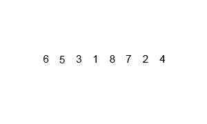
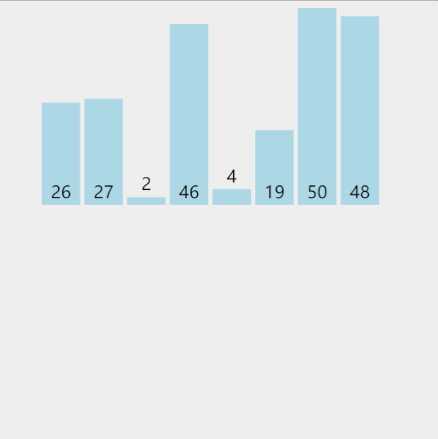

<h1 align="center">Sắp xếp Trộn (Merge Sort)</h1>

<p id="算法基础"></p>

> Phần thuật toán được A Tú đúc kết và phân loại theo nhiều cấp độ từ cơ bản đến nâng cao. Nếu bạn chưa biết bắt đầu từ đâu, hãy xem [Hướng dẫn tại đây](/notes/03-hunting_job/03-algorithm/01-basic-algorithm/01-introduce.md).

<p id="归并排序"></p>

## Sắp xếp Trộn (Merge Sort)

Để sắp xếp một mảng lớn chưa có thứ tự, ta chia mảng thành 2 nửa bằng nhau, đệ quy sắp xếp từng nửa rồi trộn (merge) 2 mảng con đã có thứ tự lại với nhau thành một mảng hoàn chỉnh.

Quá trình chia đôi lặp lại cho đến khi mảng con chỉ còn đúng 1 phần tử (mặc nhiên đã có thứ tự), sau đó gộp 2 mảng kích thước 1 thành mảng kích thước 2, gộp 2 mảng kích thước 2 thành mảng kích thước 4... cho đến khi hợp nhất toàn bộ.




### Tư tưởng Thuật toán (Chia để trị - Divide and Conquer):
1. Chia dãy độ dài $n$ thành 2 dãy con độ dài $n/2$.
2. Đệ quy thực hiện Merge Sort trên từng dãy con.
3. Trộn 2 dãy con đã sắp xếp thành dãy kết quả hoàn chỉnh (2-way Merge).

---

### 1. Bản Đệ quy C++ chuẩn (Dùng `vector<int>`)

```cpp
#include <iostream>
#include <vector>

using namespace std;

void mergeSortCore(vector<int>& data, vector<int>& dataTemp, int low, int high) {
    if (low >= high) return;
    int mid = low + (high - low) / 2;
    int start1 = low, end1 = mid, start2 = mid + 1, end2 = high;

    mergeSortCore(data, dataTemp, start1, end1);
    mergeSortCore(data, dataTemp, start2, end2);

    int index = low;
    while (start1 <= end1 && start2 <= end2) {
        dataTemp[index++] = data[start1] <= data[start2] ? data[start1++] : data[start2++];
    }
    while (start1 <= end1) dataTemp[index++] = data[start1++];
    while (start2 <= end2) dataTemp[index++] = data[start2++];

    for (index = low; index <= high; ++index) {
        data[index] = dataTemp[index];
    }
}

void mergeSort(vector<int>& data) {
    int len = data.size();
    vector<int> dataTemp(len, 0);
    mergeSortCore(data, dataTemp, 0, len - 1);
}
```

---

### 2. Bản Lặp Không Đệ quy (Iterative Merge Sort)

```cpp
void mergeSortIterative(vector<int>& data) {
    int len = data.size();
    vector<int> dataTemp(len, 0);
    for (int seg = 1; seg < len; seg += seg) {
        for (int start = 0; start < len; start += seg + seg) {
            int low = start, mid = min(start + seg, len), high = min(start + seg + seg, len);
            int index = low, start1 = low, end1 = mid, start2 = mid, end2 = high;
            
            while (start1 < end1 && start2 < end2) {
                dataTemp[index++] = data[start1] <= data[start2] ? data[start1++] : data[start2++];
            }
            while (start1 < end1) dataTemp[index++] = data[start1++];
            while (start2 < end2) dataTemp[index++] = data[start2++];
        }
        swap(data, dataTemp);
    }
}
```

<p id="堆排序"></p>
