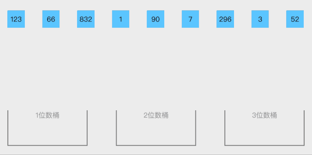

<h1 align="center">Sắp xếp Thùng (Bucket Sort)</h1>

<p id="算法基础"></p>

> Phần thuật toán được A Tú đúc kết và phân loại theo nhiều cấp độ từ cơ bản đến nâng cao. Nếu bạn chưa biết bắt đầu từ đâu, hãy xem [Hướng dẫn tại đây](/notes/03-hunting_job/03-algorithm/01-basic-algorithm/01-introduce.md).

<p id="桶排序"></p>

## Sắp xếp Thùng (Bucket Sort)

Thuật toán hoạt động bằng cách phân tán các phần tử của mảng vào các thùng (Buckets) khác nhau, sau đó sắp xếp độc lập từng thùng và nối kết quả lại.

### Tư tưởng Thuật toán:
1. Thiết lập một số lượng thùng rỗng nhất định.
2. Duyệt qua mảng ban đầu và phân phối từng phần tử vào thùng thích hợp theo hàm ánh xạ.
3. Sắp xếp các phần tử trong từng thùng (thường dùng Sắp xếp Chèn hoặc Đệ quy Bucket Sort).
4. Lần lượt lấy các phần tử từ các thùng đã sắp xếp và ghép lại thành mảng hoàn chỉnh.



### Mã nguồn minh họa (JavaScript / Pseudo-code)

```javascript
function bucketSort(arr, bucketSize) {
    if (arr.length === 0) return arr;

    var i;
    var minValue = arr[0];
    var maxValue = arr[0];
    for (i = 1; i < arr.length; i++) {
        if (arr[i] < minValue) minValue = arr[i];
        else if (arr[i] > maxValue) maxValue = arr[i];
    }

    // Khởi tạo các thùng
    var DEFAULT_BUCKET_SIZE = 5;
    bucketSize = bucketSize || DEFAULT_BUCKET_SIZE;
    var bucketCount = Math.floor((maxValue - minValue) / bucketSize) + 1;
    var buckets = new Array(bucketCount);
    for (i = 0; i < buckets.length; i++) {
        buckets[i] = [];
    }

    // Phân phối dữ liệu vào từng thùng
    for (i = 0; i < arr.length; i++) {
        buckets[Math.floor((arr[i] - minValue) / bucketSize)].push(arr[i]);
    }

    // Sắp xếp từng thùng và đổ dữ liệu về mảng kết quả
    arr.length = 0;
    for (i = 0; i < buckets.length; i++) {
        insertionSort(buckets[i]); // Sắp xếp chèn từng thùng
        for (var j = 0; j < buckets[i].length; j++) {
            arr.push(buckets[i][j]);
        }
    }

    return arr;
}
```

<p id="基数排序"></p>
