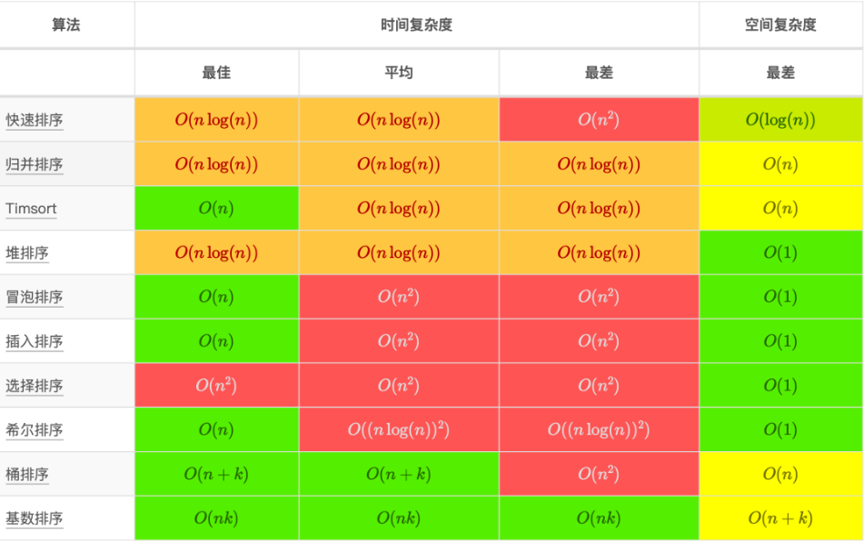

<h1 align="center">Kiến thức Nền tảng Thuật toán Cốt lõi</h1>

> Phần thuật toán được A Tú đúc kết và phân loại theo nhiều cấp độ từ cơ bản đến nâng cao. Nếu bạn chưa biết bắt đầu từ đâu, hãy xem [Hướng dẫn tại đây](/notes/03-hunting_job/03-algorithm/01-basic-algorithm/01-introduce.md).

Trong các buổi phỏng vấn kỹ thuật, 10 Thuật toán Sắp xếp Kinh điển có tần suất xuất hiện cực kỳ cao, đặc biệt là Bubble Sort, Quick Sort, Merge Sort... [**Chi tiết có thể xem tại đây**](/notes/03-hunting_job/03-algorithm/04-high_frquency_algorithm/01-high_frquency_algorithm.md).

### 1. Các Khái niệm Cơ bản về Thuật toán

1. **Sắp xếp Ổn định (Stable Sort)**: Nếu phần tử $a$ đứng trước $b$ trong mảng ban đầu và $a == b$, sau khi sắp xếp $a$ vẫn chắc chắn đứng trước $b$.
2. **Sắp xếp Không ổn định (Unstable Sort)**: Nếu $a == b$, sau khi sắp xếp thứ tự trước sau giữa $a$ và $b$ có thể bị đảo lộn.
3. **Sắp xếp Tại chỗ (In-place Sort)**: Thuật toán không yêu cầu cấp phát thêm mảng phụ trợ tỷ lệ thuận với $n$, chỉ sử dụng bộ nhớ bổ sung $O(1)$ để hoán đổi dữ liệu.
4. **Sắp xếp Không tại chỗ (Out-of-place Sort)**: Cần mảng phụ trợ dung lượng $O(n)$ để thực hiện thuật toán (ví dụ Merge Sort).
5. **Độ phức tạp Thời gian (Time Complexity)**: Thời gian thuật toán thực thi tính theo hàm số lượng phần tử $n$.
6. **Độ phức tạp Không gian (Space Complexity)**: Dung lượng bộ nhớ phụ trợ thuật toán tiêu thụ trong suốt quá trình chạy.

---

### 2. Bảng Tổng quan Toàn diện 10 Thuật toán Sắp xếp

#### Các Thuật toán Sắp xếp ỔN ĐỊNH (Stable)
- **Bubble Sort (Sắp xếp Nổi bọt)** — $O(n^2)$
- **Insertion Sort (Sắp xếp Chèn)** — $O(n^2)$
- **Merge Sort (Sắp xếp Trộn)** — $O(n \log n)$
- **Counting Sort (Sắp xếp Đếm)** — $O(n + k)$
- **Bucket Sort (Sắp xếp Thùng)** — $O(n + k)$
- **Radix Sort (Sắp xếp Cơ số)** — $O(d \cdot (n + k))$

#### Các Thuật toán Sắp xếp KHÔNG ỔN ĐỊNH (Unstable)
> Trong phỏng vấn, nhà tuyển dụng hay hỏi phân biệt tính ổn định của 4 thuật toán này:
- **Selection Sort (Sắp xếp Chọn)** — $O(n^2)$
- **Shell Sort (Sắp xếp Shell)** — $O(n \log n)$
- **Heap Sort (Sắp xếp Vun đống)** — $O(n \log n)$
- **Quick Sort (Sắp xếp Nhanh)** — $O(n \log n)$
