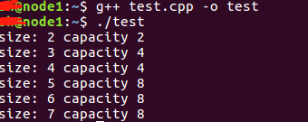
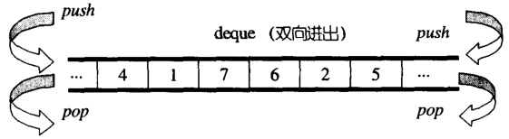
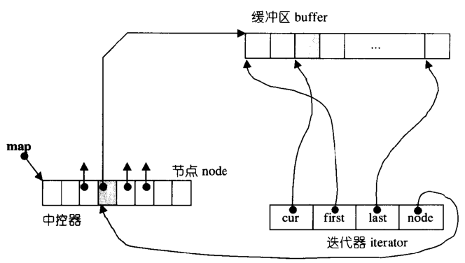
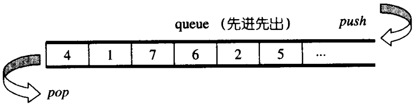

<h1 align="center">Sau 2 lần đọc trọn vẹn 《STL Nguyên mã phẫu tích》, tôi đã khám phá ra những bí mật thú vị</h1>

> Tác giả: A Tú
>
> Liên kết bài gốc: [https://mp.weixin.qq.com/s/vk3dpHrwQQJTfSLGf_xt9g](https://mp.weixin.qq.com/s/vk3dpHrwQQJTfSLGf_xt9g)

  
Đây là 6 thông tin có thể sẽ hữu ích cho bạn:

⭐️1. A Tú cùng bạn bè hợp tác phát triển một website tài nguyên lập trình, hiện đã tổng hợp rất nhiều tài liệu học tập chất lượng và công cụ hữu ích (kèm link tải). Nếu bạn đang tìm kiếm tài nguyên lập trình phù hợp, <a href="https://tools.interviewguide.cn/home" style="text-decoration: underline" target="_blank">hoan nghênh trải nghiệm</a> cũng như giới thiệu những tài nguyên bạn thấy hay. Góp gió thành bão, mình vì mọi người, mọi người vì mình🔥!
  
2. 👉 Tháng 5/2023, trong thời gian <a style="text-decoration: underline" href="https://mp.weixin.qq.com/s?__biz=Mzk0ODU4MzEzMw==&mid=2247512170&idx=1&sn=c4a04a383d2dfdece676b75f17224e78" target="_blank">rời ByteDance để chuyển sang một công ty đa quốc gia</a>, nhằm thuận tiện cho bản thân khi tìm việc và nâng cao tỷ lệ trúng tuyển, A Tú cùng bạn bè đã phát triển từ con số 0 một website giải đề phỏng vấn thực chiến của các Big Tech, bao gồm hai frontend và một backend. Trang web cho phép tra cứu có định hướng đề thi viết của các công ty Internet, ví dụ như muốn tra cứu đề thi viết của ByteDance trong 1 năm gần đây gồm những gì đều có thể làm được. Hoan nghênh trải nghiệm~

Địa chỉ website: <a style="text-decoration: underline" href="https://niumacode.com/home?ref=F6O2625K" target="_blank">Website đề thi thuật toán phỏng vấn Big Tech</a>.
    
3. 😊
    Chia sẻ một website công cụ tiện ích mà A Tú tâm đắc sưu tầm, <a style="text-decoration: underline" href="https://hkjtz.cn/" target="_blank">nhấn vào đây để truy cập</a>, chủ yếu là các ứng dụng, website ngách hữu ích, ngoài ra còn có tài nguyên phim ảnh HD, âm nhạc, phim truyền hình, AI, phim tài liệu, tài liệu thi tiếng Anh, thi công chức, cao học, nghề tay trái...
  

  
4. 😍 Chia sẻ miễn phí tài nguyên học tập mà A Tú đã tích lũy từ khi theo học máy tính, <a style="text-decoration: underline" href="/notes/07-resources/01-free/01-introduce.html" target="_blank">nhấn vào đây để nhận miễn phí</a>; đồng thời cũng lưu lại nhật ký đánh giá <a style="text-decoration: underline" href="/notes/07-resources/02-precious.html" target="_blank">những cuốn sách máy tính, chuyên mục online chất lượng cũng như những khóa học trả phí kém chất lượng</a> từng mua trước đây.
  

  
5. 🚀 Nếu bạn muốn thuận lợi giành được offer tốt hơn trong kỳ tuyển dụng trường học (Campus Recruitment), A Tú khuyên bạn nên xem thêm những <a style="text-decoration: underline" href="https://www.yuque.com/tuobaaxiu/httmmc/npg1k81zeq4wfpyz" target="_blank">cạm bẫy từng vấp phải</a> và <a style="text-decoration: underline"  target="_blank" href="https://www.yuque.com/tuobaaxiu/httmmc/gge9ppd0mbu2d3dp">kinh nghiệm đúc kết</a> của người đi trước. Thực tế, hầu hết các vấn đề bạn đang gặp phải thì các anh chị khóa trước đều đã từng trải qua.
  

  
6. 🔥 Hoan nghênh các bạn đang chuẩn bị cho kỳ tuyển dụng trường học ngành CNTT tham gia <a  style="text-decoration: underline" href="https://www.yuque.com/tuobaaxiu/httmmc/xg0otqvc17wfx4u9" target="_blank">Cộng đồng học tập</a> của tôi. Độc hành một mình chi bằng cùng nhau sưởi ấm, trong nhóm đã đọng lại rất nhiều <a  style="text-decoration: underline" href="https://www.yuque.com/tuobaaxiu/httmmc/gge9ppd0mbu2d3dp" target="_blank">kinh nghiệm và tổng kết</a> của các anh chị khóa 21/22/23/24/25. Kiên trì đi theo lộ trình, cuối cùng đa phần đều có thể nhận được offer ưng ý! Nếu bạn cần phiên bản PDF tổng hợp các điểm kiến thức 📚︎ Bát cổ văn phỏng vấn tuyển dụng trường học trên website 《Ghi chép học tập của A Tú》, có thể <a style="text-decoration: underline" href="https://www.yuque.com/tuobaaxiu/httmmc/qs0yn66apvkzw0ps" target="_blank">nhấn vào đây để tải về</a>.
   

> *"Trước mã nguồn, không còn điều gì là bí mật."* — Thầy Hầu Tiệp (Hou Jie)

---

## I. Nhóm Sequence Containers (Tuần tự)

### 1. Vector
- **Bộ nhớ liên tục (Continuous Linear Memory)**: Tự động mở rộng khi đầy bộ nhớ.
- **Tỉ lệ tăng trưởng (Growth Factor)**:
  - Trên **Windows Visual Studio (MSVC)**: Tăng trưởng theo hệ số **1.5 lần**.
  - Trên **Linux (GCC / G++)**: Tăng trưởng theo hệ số **2 lần**.
- 
- 
- 

### 2. Deque (Hàng đợi hai đầu)
- Quản lý bộ nhớ theo từng phân đoạn (Chunk-based Memory).
- Bộ lặp (Iterator) gồm 4 con trỏ then chốt: `cur`, `first`, `last` và `node` trỏ về Map Control Block.
- 
- 
- 

### 3. Stack & Queue (Container Adapters)
- Bản chất là **Bộ điều hợp (Adapter)** bọc ngoài `std::deque` (hoặc có thể tùy biến sang `std::list`).
- Không cung cấp Iterator duyệt phần tử để đảm bảo tính đóng băng cấu trúc LIFO/FIFO.
- 
- 

---

## II. Nhóm Associative Containers (Liên kết)

### 1. Map & Set (Dựa trên Red-Black Tree)
- Tự động sắp xếp theo thứ tự tăng dần của Key.
- `map` sử dụng hàm `rb_tree::insert_unique()` (Key là duy nhất).
- `set` có Key và Value đồng nhất, sử dụng `identity()` function và iterator là hằng số (`const_iterator`) không thể chỉnh sửa giá trị phần tử.
- 
- 
- 

### 2. Multimap & Multiset
- Cho phép trùng lặp Key nhờ sử dụng phương thức `rb_tree::insert_equal()`.

### 3. HashTable, Unordered_Map & Unordered_Set
- Giải quyết xung đột băm (Hash Collision) bằng phương pháp **Chaining (Khai liên pháp / Mở chuỗi)**.
- Thiết kế sẵn 28 số nguyên tố $[53, 97, 193, \dots, 429496729]$ làm kích thước thùng chứa (Bucket Vector Capacity). Tự động Rehash khi số lượng phần tử vượt quá dung lượng thùng chứa.
- 

---

### Bảng đối chiếu bản chất STL Containers:

| Container | Cấu trúc dữ liệu nền tảng | Phương thức chèn | Cho phép trùng Key? | Tự động sắp xếp? |
| :--- | :--- | :--- | :--- | :--- |
| `std::vector` | Mảng động liên tục | `push_back` | Có | Không |
| `std::deque` | Bộ đệm phân đoạn + Map | `push_back`/`push_front` | Có | Không |
| `std::map` | Red-Black Tree (Cây Đỏ Đen) | `insert_unique()` | Không | Có (Tăng dần) |
| `std::set` | Red-Black Tree (Cây Đỏ Đen) | `insert_unique()` | Không | Có (Tăng dần) |
| `std::multimap` | Red-Black Tree (Cây Đỏ Đen) | `insert_equal()` | Có | Có (Tăng dần) |
| `std::unordered_map` | HashTable (Khai liên pháp) | `insert_unique()` | Không | Không |
| `std::unordered_multimap`| HashTable (Khai liên pháp) | `insert_equal()` | Có | Không |

