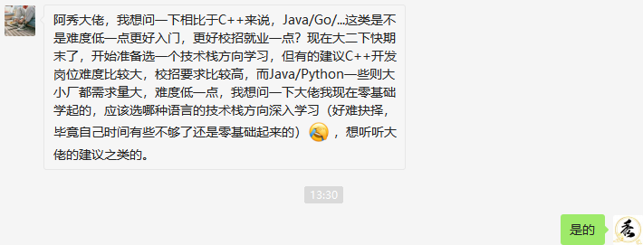

<h1 align="center">Rốt cuộc nên học ngôn ngữ nào? Đứng dưới góc độ tìm việc để bàn về C++, Java hay Python?</h1>

> Tác giả: A Tú
>
> Liên kết bài gốc: [https://mp.weixin.qq.com/s/k7K2rMGT4prR9dB5rlEMmw](https://mp.weixin.qq.com/s/k7K2rMGT4prR9dB5rlEMmw)

  
Đây là 6 thông tin có thể sẽ hữu ích cho bạn:

⭐️1. A Tú cùng bạn bè hợp tác phát triển một website tài nguyên lập trình, hiện đã tổng hợp rất nhiều tài liệu học tập chất lượng và công cụ hữu ích (kèm link tải). Nếu bạn đang tìm kiếm tài nguyên lập trình phù hợp, <a href="https://tools.interviewguide.cn/home" style="text-decoration: underline" target="_blank">hoan nghênh trải nghiệm</a> cũng như giới thiệu những tài nguyên bạn thấy hay. Góp gió thành bão, mình vì mọi người, mọi người vì mình🔥!
  
2. 👉 Tháng 5/2023, trong thời gian <a style="text-decoration: underline" href="https://mp.weixin.qq.com/s?__biz=Mzk0ODU4MzEzMw==&mid=2247512170&idx=1&sn=c4a04a383d2dfdece676b75f17224e78" target="_blank">rời ByteDance để chuyển sang một công ty đa quốc gia</a>, nhằm thuận tiện cho bản thân khi tìm việc và nâng cao tỷ lệ trúng tuyển, A Tú cùng bạn bè đã phát triển từ con số 0 một website giải đề phỏng vấn thực chiến của các Big Tech, bao gồm hai frontend và một backend. Trang web cho phép tra cứu có định hướng đề thi viết của các công ty Internet, ví dụ như muốn tra cứu đề thi viết của ByteDance trong 1 năm gần đây gồm những gì đều có thể làm được. Hoan nghênh trải nghiệm~

Địa chỉ website: <a style="text-decoration: underline" href="https://niumacode.com/home?ref=F6O2625K" target="_blank">Website đề thi thuật toán phỏng vấn Big Tech</a>.
    
3. 😊
    Chia sẻ một website công cụ tiện ích mà A Tú tâm đắc sưu tầm, <a style="text-decoration: underline" href="https://hkjtz.cn/" target="_blank">nhấn vào đây để truy cập</a>, chủ yếu là các ứng dụng, website ngách hữu ích, ngoài ra còn có tài nguyên phim ảnh HD, âm nhạc, phim truyền hình, AI, phim tài liệu, tài liệu thi tiếng Anh, thi công chức, cao học, nghề tay trái...
  

  
4. 😍 Chia sẻ miễn phí tài nguyên học tập mà A Tú đã tích lũy từ khi theo học máy tính, <a style="text-decoration: underline" href="/notes/07-resources/01-free/01-introduce.html" target="_blank">nhấn vào đây để nhận miễn phí</a>; đồng thời cũng lưu lại nhật ký đánh giá <a style="text-decoration: underline" href="/notes/07-resources/02-precious.html" target="_blank">những cuốn sách máy tính, chuyên mục online chất lượng cũng như những khóa học trả phí kém chất lượng</a> từng mua trước đây.
  

  
5. 🚀 Nếu bạn muốn thuận lợi giành được offer tốt hơn trong kỳ tuyển dụng trường học (Campus Recruitment), A Tú khuyên bạn nên xem thêm những <a style="text-decoration: underline" href="https://www.yuque.com/tuobaaxiu/httmmc/npg1k81zeq4wfpyz" target="_blank">cạm bẫy từng vấp phải</a> và <a style="text-decoration: underline"  target="_blank" href="https://www.yuque.com/tuobaaxiu/httmmc/gge9ppd0mbu2d3dp">kinh nghiệm đúc kết</a> của người đi trước. Thực tế, hầu hết các vấn đề bạn đang gặp phải thì các anh chị khóa trước đều đã từng trải qua.
  

  
6. 🔥 Hoan nghênh các bạn đang chuẩn bị cho kỳ tuyển dụng trường học ngành CNTT tham gia <a  style="text-decoration: underline" href="https://www.yuque.com/tuobaaxiu/httmmc/xg0otqvc17wfx4u9" target="_blank">Cộng đồng học tập</a> của tôi. Độc hành một mình chi bằng cùng nhau sưởi ấm, trong nhóm đã đọng lại rất nhiều <a  style="text-decoration: underline" href="https://www.yuque.com/tuobaaxiu/httmmc/gge9ppd0mbu2d3dp" target="_blank">kinh nghiệm và tổng kết</a> của các anh chị khóa 21/22/23/24/25. Kiên trì đi theo lộ trình, cuối cùng đa phần đều có thể nhận được offer ưng ý! Nếu bạn cần phiên bản PDF tổng hợp các điểm kiến thức 📚︎ Bát cổ văn phỏng vấn tuyển dụng trường học trên website 《Ghi chép học tập của A Tú》, có thể <a style="text-decoration: underline" href="https://www.yuque.com/tuobaaxiu/httmmc/qs0yn66apvkzw0ps" target="_blank">nhấn vào đây để tải về</a>.
   

Phân tích định hướng lựa chọn ngôn ngữ lập trình chủ lực phục vụ mục tiêu tìm việc làm:

---

### 1. Phân tích đặc điểm ứng dụng & Cơ hội việc làm:

- **C++**: Phục vụ tầng hạ tầng hệ thống (Linux Backend, Embedded Systems, Game Engine, Audio/Video Core, Compiler, High-Frequency Trading).
  - *Ưu điểm*: Nền tảng tư duy vững chắc, tỷ lệ cạnh tranh hồ sơ thấp hơn so với Java.
  - *Thách thức*: Độ khó học tập cao, quản lý bộ nhớ thủ công phức tạp.
- **Java**: Ngôn ngữ thống trị mảng phát triển ứng dụng Internet và dịch vụ doanh nghiệp (Enterprise Backend, Web Services, Android, Big Data Ecosystem).
  - *Ưu điểm*: Dễ tiếp cận, hệ sinh thái Framework phong phú (Spring Cloud, MyBatis, Dubbo), số lượng việc làm áp đảo.
  - *Thách thức*: Số lượng ứng viên cạnh tranh cực kỳ lớn (chiếm $>26\%$ tổng lượng hồ sơ tuyển dụng).
- **Python**: Xuất sắc cho xử lý dữ liệu, Data Crawling, Scripting và nghiên cứu AI.
  - *Cảnh báo*: Các vị trí tuyển dụng Python Backend rất hạn chế. Vị trí Kỹ sư Thuật toán AI đòi hỏi bằng cấp và giải thưởng học thuật rất khắt khe.

---

### 2. Gợi ý chọn lựa theo từng nhóm đối tượng:
1. **Sinh viên năm 1, năm 2 hoặc năm 1 cao học**: Chọn chuyên sâu một trong hai ngôn ngữ C++ hoặc Java.
2. **Sinh viên chuẩn bị tốt nghiệp / Trái ngành chuyển nghề**: Ưu tiên **Java** để tiếp cận nhanh với thị trường tuyển dụng doanh nghiệp.
3. **Mục tiêu gia nhập các tập đoàn lớn**: Nhà tuyển dụng Big Tech đánh giá cao năng lực tư duy CS cốt lõi (Cấu trúc dữ liệu & Giải thuật, Hệ điều hành, Mạng máy tính). Nắm vững một ngôn ngữ chủ lực sẽ giúp bạn dễ dàng chuyển đổi sang ngôn ngữ khác khi vào dự án thực tế.
