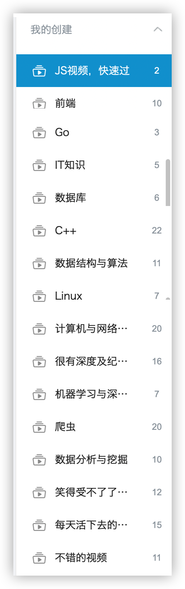
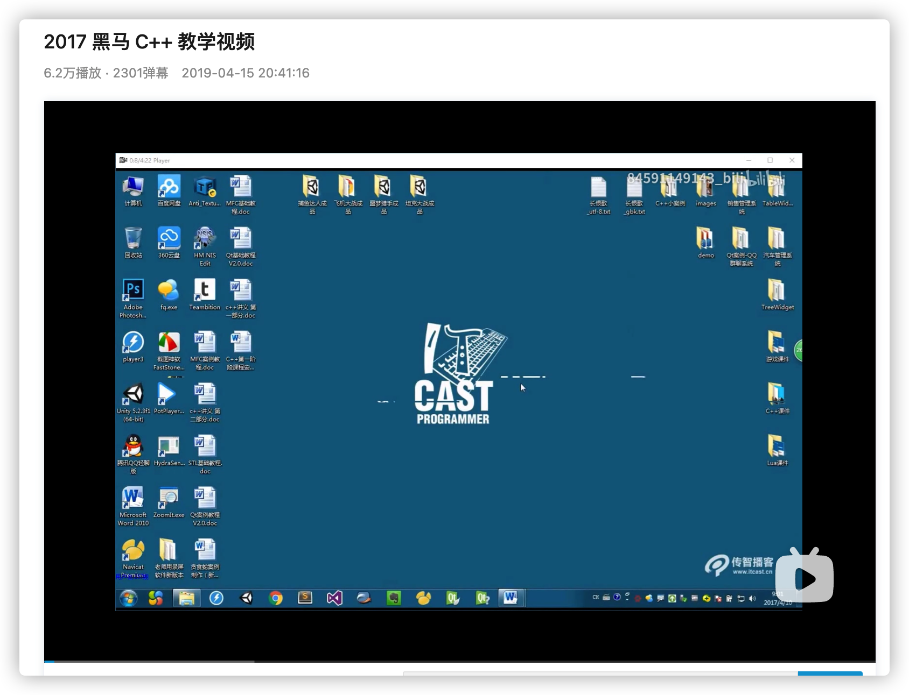
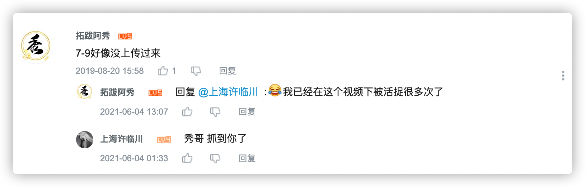
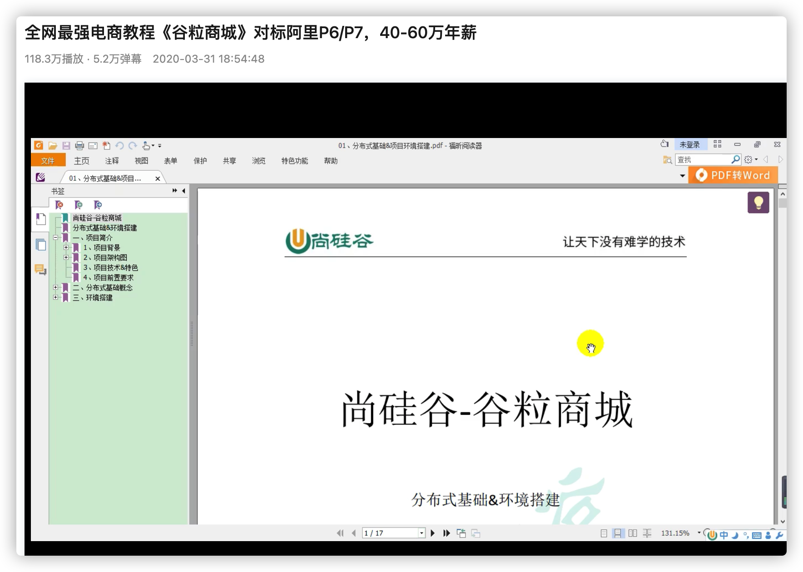
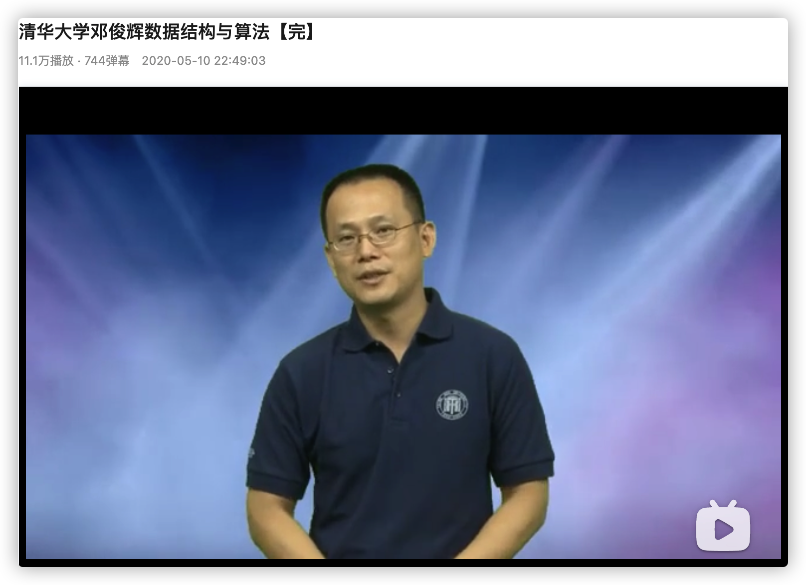
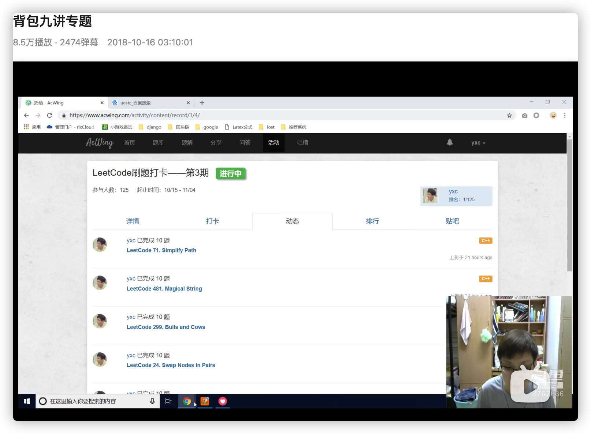
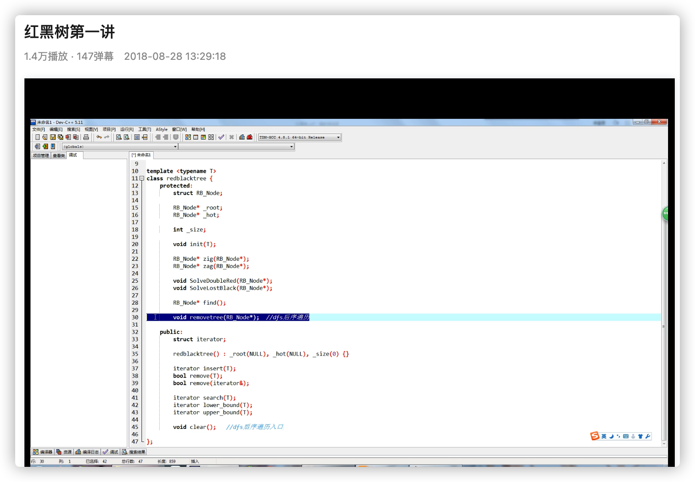
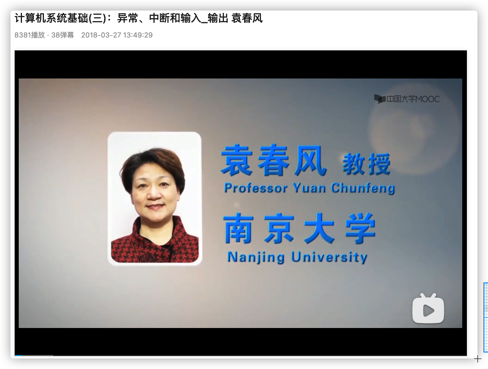

<h1 align="center">Tôi học lập trình hoàn toàn nhờ Bilibili, quá đỉnh (Kỳ 1)</h1>

> Tác giả: A Tú
>
> Liên kết bài gốc: [https://mp.weixin.qq.com/s/ct6yind_rqjl3sOZk_33sQ](https://mp.weixin.qq.com/s/ct6yind_rqjl3sOZk_33sQ)

  
Đây là 6 thông tin có thể sẽ hữu ích cho bạn:

⭐️1. A Tú cùng bạn bè hợp tác phát triển một website tài nguyên lập trình, hiện đã tổng hợp rất nhiều tài liệu học tập chất lượng và công cụ hữu ích (kèm link tải). Nếu bạn đang tìm kiếm tài nguyên lập trình phù hợp, <a href="https://tools.interviewguide.cn/home" style="text-decoration: underline" target="_blank">hoan nghênh trải nghiệm</a> cũng như giới thiệu những tài nguyên bạn thấy hay. Góp gió thành bão, mình vì mọi người, mọi người vì mình🔥!
  
2. 👉 Tháng 5/2023, trong thời gian <a style="text-decoration: underline" href="https://mp.weixin.qq.com/s?__biz=Mzk0ODU4MzEzMw==&mid=2247512170&idx=1&sn=c4a04a383d2dfdece676b75f17224e78" target="_blank">rời ByteDance để chuyển sang một công ty đa quốc gia</a>, nhằm thuận tiện cho bản thân khi tìm việc và nâng cao tỷ lệ trúng tuyển, A Tú cùng bạn bè đã phát triển từ con số 0 một website giải đề phỏng vấn thực chiến của các Big Tech, bao gồm hai frontend và một backend. Trang web cho phép tra cứu có định hướng đề thi viết của các công ty Internet, ví dụ như muốn tra cứu đề thi viết của ByteDance trong 1 năm gần đây gồm những gì đều có thể làm được. Hoan nghênh trải nghiệm~

Địa chỉ website: <a style="text-decoration: underline" href="https://niumacode.com/home?ref=F6O2625K" target="_blank">Website đề thi thuật toán phỏng vấn Big Tech</a>.
    
3. 😊
    Chia sẻ một website công cụ tiện ích mà A Tú tâm đắc sưu tầm, <a style="text-decoration: underline" href="https://hkjtz.cn/" target="_blank">nhấn vào đây để truy cập</a>, chủ yếu là các ứng dụng, website ngách hữu ích, ngoài ra còn có tài nguyên phim ảnh HD, âm nhạc, phim truyền hình, AI, phim tài liệu, tài liệu thi tiếng Anh, thi công chức, cao học, nghề tay trái...
  

  
4. 😍 Chia sẻ miễn phí tài nguyên học tập mà A Tú đã tích lũy từ khi theo học máy tính, <a style="text-decoration: underline" href="/notes/07-resources/01-free/01-introduce.html" target="_blank">nhấn vào đây để nhận miễn phí</a>; đồng thời cũng lưu lại nhật ký đánh giá <a style="text-decoration: underline" href="/notes/07-resources/02-precious.html" target="_blank">những cuốn sách máy tính, chuyên mục online chất lượng cũng như những khóa học trả phí kém chất lượng</a> từng mua trước đây.
  

  
5. 🚀 Nếu bạn muốn thuận lợi giành được offer tốt hơn trong kỳ tuyển dụng trường học (Campus Recruitment), A Tú khuyên bạn nên xem thêm những <a style="text-decoration: underline" href="https://www.yuque.com/tuobaaxiu/httmmc/npg1k81zeq4wfpyz" target="_blank">cạm bẫy từng vấp phải</a> và <a style="text-decoration: underline"  target="_blank" href="https://www.yuque.com/tuobaaxiu/httmmc/gge9ppd0mbu2d3dp">kinh nghiệm đúc kết</a> của người đi trước. Thực tế, hầu hết các vấn đề bạn đang gặp phải thì các anh chị khóa trước đều đã từng trải qua.
  

  
6. 🔥 Hoan nghênh các bạn đang chuẩn bị cho kỳ tuyển dụng trường học ngành CNTT tham gia <a  style="text-decoration: underline" href="https://www.yuque.com/tuobaaxiu/httmmc/xg0otqvc17wfx4u9" target="_blank">Cộng đồng học tập</a> của tôi. Độc hành một mình chi bằng cùng nhau sưởi ấm, trong nhóm đã đọng lại rất nhiều <a  style="text-decoration: underline" href="https://www.yuque.com/tuobaaxiu/httmmc/gge9ppd0mbu2d3dp" target="_blank">kinh nghiệm và tổng kết</a> của các anh chị khóa 21/22/23/24/25. Kiên trì đi theo lộ trình, cuối cùng đa phần đều có thể nhận được offer ưng ý! Nếu bạn cần phiên bản PDF tổng hợp các điểm kiến thức 📚︎ Bát cổ văn phỏng vấn tuyển dụng trường học trên website 《Ghi chép học tập của A Tú》, có thể <a style="text-decoration: underline" href="https://www.yuque.com/tuobaaxiu/httmmc/qs0yn66apvkzw0ps" target="_blank">nhấn vào đây để tải về</a>.
   

Tổng hợp các khóa học video chất lượng cao nhất trên Bilibili do chính A Tú và bạn bè trải nghiệm đánh giá:

---

## I. C/C++
1. **Khóa học C cơ bản của thầy Hách Bân (Hao Bin)** (⭐⭐⭐⭐⭐):
   - Giáo trình C kinh điển, giải thích con trỏ và bộ nhớ trực quan, dễ hiểu nhất.
   - 
2. **Khóa học C++ của Hắc Mã (Heima C++)** (⭐⭐⭐⭐⭐):
   - Giáo trình C++ bài bản từ biến, hàm, OOP đến STL.
   - 
   - 
3. **Thầy Hầu Tiệp (Hou Jie) - Phân tích mã nguồn STL & Quản lý bộ nhớ C++** (⭐⭐⭐⭐⭐):
   - Khóa học đỉnh cao về OOP, Generic Programming, Allocator và Memory Management trong C++.
   - 
   - 

---

## II. Java
1. **Thầy Tống Hồng Khang (Thượng Khuy Cốc - ShangGuiGu)** (⭐⭐⭐⭐⭐): Khóa học nhập môn Java toàn diện nhất.
   - 
2. **Dự án thực chiến Microservices - Cốc Lệ Thương Thành (Gulimall)** (⭐⭐⭐⭐⭐): Dự án thương mại điện tử phân tán kinh điển cho lập trình viên Java.
   - 

---

## III. Cấu trúc dữ liệu & Giải thuật
1. **Cô Vương Trác (Đại học Thanh Đảo)** (⭐⭐⭐⭐⭐): Nhập môn Cấu trúc dữ liệu số 1.
   - 
2. **Thầy Đặng Tuấn Huy (Đại học Thanh Hoa)** (⭐⭐⭐⭐⭐): Bài giảng học thuật chuyên sâu.
   - 
3. **Chuyên đề 9 bài toán Ba lô (Knapsack Problem) của Y Tổng** (⭐⭐⭐⭐⭐):
   - 
4. **Tự tay cài đặt Cây Đỏ Đen (Red-Black Tree)** (⭐⭐⭐⭐⭐):
   - 

---

## IV. Hệ điều hành & Mạng máy tính
1. **Cô Viên Xuân Phong (Đại học Nam Kinh - Cơ sở Hệ thống máy tính CSAPP)**:
   - 
2. **Thầy Hàn Lập Cương (Mạng máy tính)** (⭐⭐⭐⭐⭐):
   - 

---

## V. Cơ sở dữ liệu & Linux
1. **Thầy Chu Dương (Dương Ca) - Khóa học Redis thực chiến đỉnh cao**:
   - 
2. **Thầy Hàn Thuận Bình - 1 Tuần làm chủ Linux cho người mới bắt đầu**:
   - 
