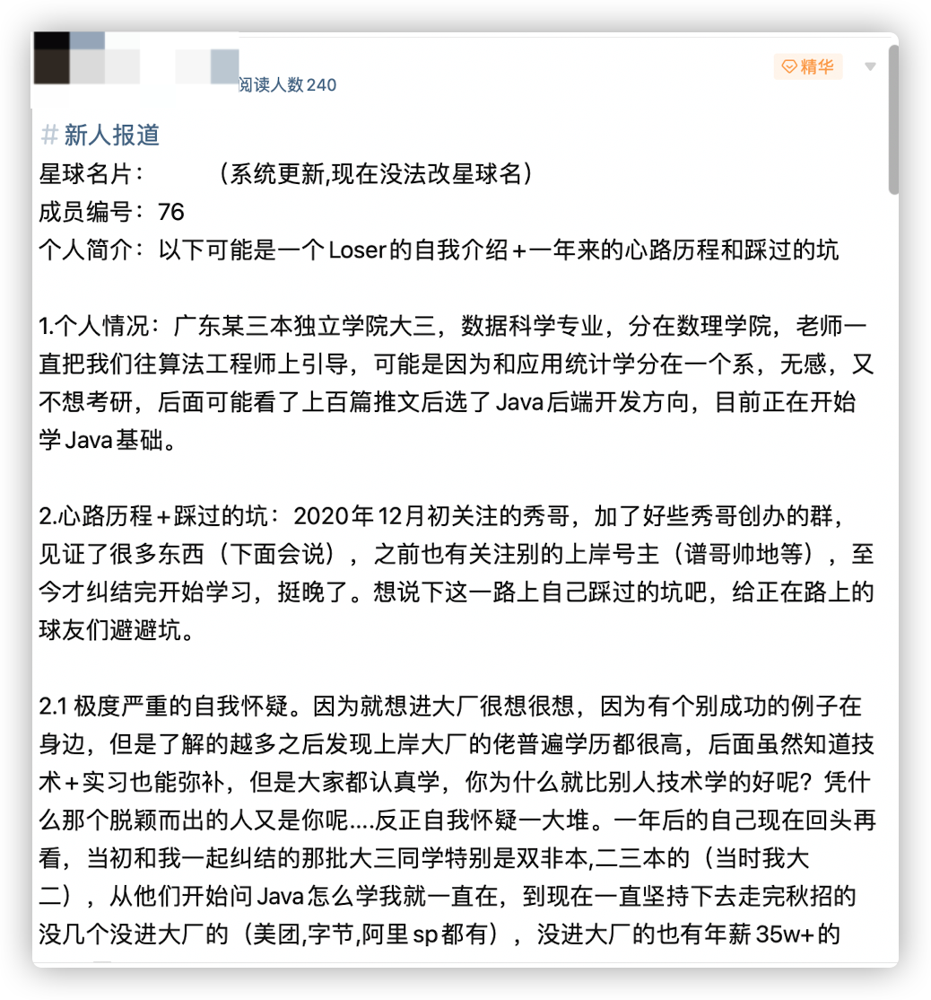
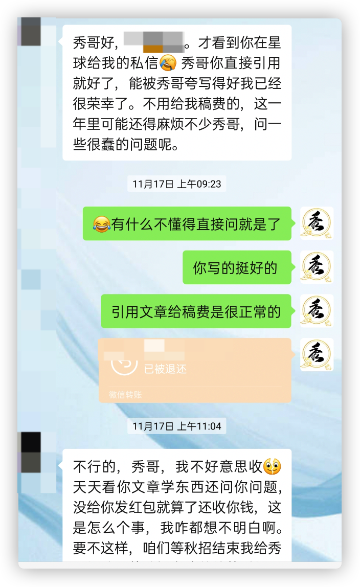
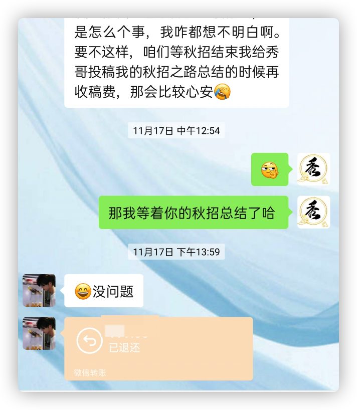

<h1 align="center">Chia sẻ từ thành viên: Lúc nào cũng không muộn, nhưng tốt nhất là nắm bắt hiện tại.</h1>

  
Dưới đây là 6 mẩu thông tin có thể sẽ hữu ích cho bạn:

⭐️ 1. A Tú cùng bạn bè đã hợp tác phát triển một website tài nguyên lập trình, hiện đã tổng hợp rất nhiều tài liệu học tập chất lượng và công cụ công nghệ tiện ích (kèm link tải). Nếu bạn đang tìm kiếm tài nguyên lập trình phù hợp, <a href="https://tools.interviewguide.cn/home" style="text-decoration: underline" target="_blank">hoan nghênh trải nghiệm</a> cũng như giới thiệu những tài nguyên hữu ích mà bạn biết, mọi người cùng chung tay góp sức, mình vì mọi người, mọi người vì mình🔥!
  
2. 👉 Tháng 5/2023, trong khoảng thời gian A Tú <a style="text-decoration: underline" href="https://mp.weixin.qq.com/s?__biz=Mzk0ODU4MzEzMw==&mid=2247512170&idx=1&sn=c4a04a383d2dfdece676b75f17224e78" target="_blank">rời ByteDance để chuyển việc sang một công ty đa quốc gia</a>, để thuận tiện cho bản thân tìm việc và tăng tỉ lệ đỗ (hạ cánh an toàn), mình và bạn bè đã tự phát triển từ con số 0 một website phân tích đề thi phỏng vấn Big Tech thực chiến, gồm 2 frontend và 1 backend. Trang web hỗ trợ tra cứu đề thi viết (online test/coding assessment) của từng công ty Internet cụ thể, ví dụ như tra cứu xem ByteDance có những đề thi viết nào trong 1 năm gần nhất. Hoan nghênh trải nghiệm~

Địa chỉ website: <a style="text-decoration: underline" href="https://niumacode.com/home?ref=F6O2625K" target="_blank">Website đề thi thuật toán phỏng vấn Big Tech</a>.
    
3. 😊
    Chia sẻ một website tiện ích công nghệ do A Tú sưu tầm riêng, <a style="text-decoration: underline" href="https://hkjtz.cn/" target="_blank">bấm vào đây để truy cập</a>, chủ yếu là các ứng dụng và website hữu ích ít người biết, ngoài ra còn có tài nguyên phim ảnh HD, âm nhạc, phim truyền hình, AI, phim tài liệu, tài liệu thi chứng chỉ, thi công chức/cao học, việc làm tay trái...
  

  
4. 😍 Chia sẻ miễn phí các tài nguyên học tập mà A Tú đã tích lũy từ khi bắt đầu học khoa học máy tính, <a style="text-decoration: underline" href="/notes/07-resources/01-free/01-introduce.html" target="_blank">bấm vào đây để nhận miễn phí</a>; đồng thời cũng lưu lại nhật ký đánh giá <a style="text-decoration: underline" href="/notes/07-resources/02-precious.html" target="_blank">những cuốn sách máy tính, chuyên mục trả phí chất lượng cũng như các chuyên mục rác</a> mà bản thân từng mua trước đây.
  

  
5. 🚀 Nếu bạn muốn thuận lợi nhận được offer tốt hơn trong mùa tuyển dụng trường học, A Tú khuyên bạn nên xem thêm những <a style="text-decoration: underline" href="https://www.yuque.com/tuobaaxiu/httmmc/npg1k81zeq4wfpyz" target="_blank">cái bẫy (hố sâu) mà người đi trước từng dẫm phải</a> và <a style="text-decoration: underline"  target="_blank" href="https://www.yuque.com/tuobaaxiu/httmmc/gge9ppd0mbu2d3dp">những kinh nghiệm quý báu để lại</a>. Trên thực tế, hầu hết những vấn đề bạn gặp phải hiện tại thì các anh chị khóa trước đều đã từng trải qua.
  

  
6. 🔥 Hoan nghênh các bạn đang chuẩn bị cho mùa tuyển dụng IT gia nhập <a  style="text-decoration: underline" href="https://www.yuque.com/tuobaaxiu/httmmc/xg0otqvc17wfx4u9" target="_blank">vòng tròn học tập (nhóm kín) của mình</a>, đi một mình đơn độc không bằng đi cùng đồng đội sưởi ấm cho nhau. Trong nhóm lưu giữ rất nhiều <a  style="text-decoration: underline" href="https://www.yuque.com/tuobaaxiu/httmmc/gge9ppd0mbu2d3dp" target="_blank">kinh nghiệm và tổng kết</a> của các anh chị khóa 21/22/23/24/25. Những ai kiên trì theo sát lộ trình, cuối cùng cơ bản đều nhận được offer rất tốt!</a> Nếu bạn cần bản PDF tổng hợp các kiến thức "Bát cổ văn" tuyển dụng trên website "Sổ tay học tập của A Tú", có thể <a style="text-decoration: underline" href="https://www.yuque.com/tuobaaxiu/httmmc/qs0yn66apvkzw0ps" target="_blank">bấm vào đây để tải về</a>.
   

> Tác giả: A Tú & Thu Hòa
>
> Link bài gốc: [https://mp.weixin.qq.com/s/8lrHzNRPEuphz4kJG5jX8g](https://mp.weixin.qq.com/s/8lrHzNRPEuphz4kJG5jX8g)

Chào bạn, mình là A Tú, hôm nay muốn chia sẻ với mọi người một điều hơi khác biệt một chút.

Có một bạn đàn em quen biết mình hơn một năm rồi, theo dõi mình từ cuối năm ngoái, có thể nói là một trong những độc giả đầu tiên của mình.

Cách đây không lâu, sau khi nhắn tin riêng với mình, bạn ấy đã tham gia vào cộng đồng học tập nhỏ này. Dưới đây là bài viết tự giới thiệu khi mới vào nhóm của bạn ấy. Mình thấy bạn ấy viết rất chân thành và sâu sắc, sau khi được sự đồng ý của bạn ấy, mình muốn chia sẻ bài viết này cho mọi người cùng đọc, nguyên văn không hề chỉnh sửa hay thêm thắt bất cứ điều gì:

  

Phần giới thiệu bản thân khi báo danh thành viên mới

Ban đầu mình còn muốn gửi bạn ấy một khoản nhuận bút, vì trích dẫn bài viết trả nhuận bút là chuyện rất bình thường, nhưng bạn ấy nhất quyết không chịu nhận...

Cuối cùng hẹn nhau chờ bài viết tổng kết mùa tuyển dụng mùa thu năm tới của bạn ấy.

Được rồi, dưới đây là phần chia sẻ của bạn ấy, từ "tôi" trong bài viết đại diện cho bạn đàn em này.

Chủ đề chia sẻ: **Dưới đây có thể là phần tự giới thiệu của một kẻ thất bại (Loser) + Hành trình tâm lý và những bài học tránh bẫy trong suốt một năm qua.**

## 1. Tình hình cá nhân

Sinh viên năm 3 một trường đại học độc lập / dân lập hạng 3 ở Quảng Đông, chuyên ngành Khoa học dữ liệu, thuộc khoa Toán - Lý.

Giảng viên luôn hướng chúng tôi theo con đường Kỹ sư thuật toán (Algorithm Engineer), có lẽ vì xếp chung khoa với ngành Thống kê ứng dụng. Bản thân không có hứng thú, cũng không muốn thi cao học, sau khi đọc hàng trăm bài viết chia sẻ định hướng, tôi đã chọn hướng Lập trình Java Backend, hiện tại đang bắt đầu học kiến thức cơ bản về Java.

## 2. Hành trình tâm lý + Những cái bẫy đã dẫm phải

Đầu tháng 12/2020, tôi bắt đầu theo dõi anh Tú, tham gia nhiều nhóm do anh Tú lập ra, chứng kiến rất nhiều điều (sẽ nói ở bên dưới). Trước đó tôi cũng theo dõi một số chủ kênh chia sẻ kinh nghiệm tìm việc khác, mãi đến tận bây giờ mới dứt điểm được sự do dự để bắt đầu học, thực sự là khá muộn.

Tôi muốn chia sẻ lại những bài học đắt giá mà bản thân đã trải qua trên con đường này, để giúp các bạn trong nhóm tránh được những vết xe đổ.

### 2.1 Tự hoài nghi bản thân cực kỳ nghiêm trọng

Bởi vì rất muốn, cực kỳ muốn vào các tập đoàn công nghệ lớn (Big Tech), do xung quanh tôi có một vài trường hợp cá biệt thành công. Nhưng càng tìm hiểu sâu, tôi càng nhận ra những người đỗ vào Big Tech đa phần đều có bằng cấp rất cao. Sau này dù biết kỹ thuật tốt + kinh nghiệm thực tập có thể bù đắp, nhưng ai cũng nỗ lực học tập, cớ sao kỹ thuật của bạn lại giỏi hơn người khác?

Dựa vào đâu mà người nổi bật bước lên đài vinh quang lại là bạn cơ chứ?... Tóm lại là vô vàn sự hoài nghi bản thân.

Một năm sau nhìn lại, nhóm bạn năm 3 cùng do dự với tôi lúc đó - đặc biệt là các bạn trường bình thường, trường hạng 2, hạng 3 (lúc đó tôi học năm 2) - từ khi họ bắt đầu hỏi Java học như thế nào tôi đã ở đó chứng kiến. Đến nay, những ai kiên trì đi hết mùa tuyển dụng mùa thu, hầu như không có ai là không vào được Big Tech (Meituan, ByteDance, Alibaba SP đều có), những ai không vào Big Tech thì cũng có offer lương năm 350.000+ NDT (khoảng 1,2 tỷ VNĐ).

### 2.2 Không có thời điểm nào là hoàn hảo nhất để bắt đầu

Lần nào tôi cũng tự nhủ với bản thân: Đợi làm xong đống bài tập bận rộn tuần này rồi bắt đầu học, đợi thi xong môn này rồi bắt đầu, đợi thi xong chứng chỉ tiếng Anh CET-4 rồi sẽ bắt đầu, đợi thi cuối kỳ xong nghỉ đông nhất định sẽ bắt đầu.

**Ừ, không ngoại lệ lần nào, luôn có đủ mọi lý do để không hành động.**

Hoặc là đắn đo vì kế hoạch học tập cả năm chưa lập xong, hoặc đắn đo vì sách đặt mua chưa về, hoặc đắn đo chưa biết nên học ở đâu, chưa ấn định được thời gian học mỗi ngày bao nhiêu tiếng, hoặc chỉ đơn giản là vẫn muốn chơi bời - tóm lại lý do thì không bao giờ thiếu.

Sau này tham gia nhóm tuyển dụng trường học và nhóm chuyển ngành của anh Tú, tôi mới phát hiện ra: **Các anh chị học viên cao học, đặc biệt là các ngành Hóa - Sinh - Môi trường - Vật liệu còn chẳng có chút thời gian nào, vừa bị giáo viên hướng dẫn push liên tục, vừa phải làm những thí nghiệm không bao giờ dứt và đọc những bài báo khoa học khó hiểu**.

Họ mới thực sự là không có thời gian, có những người thậm chí phải đến **nửa đêm rạng sáng** mới bắt đầu ngồi vào bàn tự học IT.

Lúc đó mới thấy sinh viên đại học chúng tôi - đặc biệt là trường chúng tôi - mà kêu không có thời gian thì đúng là lời nói dối trắng trợn nhất.

### 2.3 Do dự, đắn đo mãi về lộ trình học tập

Suốt một năm qua, mỗi lần thấy một lộ trình học tập trên mạng xã hội hay diễn đàn Nowcoder là tôi lại băn khoăn cái nào tốt hơn, video nào hay hơn, cuốn sách nào chuẩn hơn, lộ trình học của bản thân cứ mãi phân vân không chốt được.

Thực ra, dùng khoảng thời gian ngồi đắn đo đó thì đã đọc xong cả hai cuốn sách đang phân vân từ lâu rồi.

Video bài giảng cũng vậy, chẳng có video nào là tuyệt đối hoàn hảo cả, nếu không thì ai cũng đi xem cái đó rồi. Thấy học không vào thì đổi, học chưa vững thì đọc thêm sách.

Tóm lại chỉ cần có một định hướng học tập khái quát là được, sau này trong quá trình học vẫn sẽ vừa học vừa điều chỉnh tài liệu và lộ trình mà, đâu phải lập ra lúc đầu là bất di bất dịch đâu.

### 2.4 Vẫn muốn học thật tốt các môn trên lớp

Kế thừa thói quen từ năm nhất, ngày nào tôi cũng chăm chỉ nghe giảng, cặm cụi làm bài tập, thời gian còn lại trong ngày thực sự chẳng còn bao nhiêu. Đặc biệt là trường tôi lên năm 3 vẫn còn rất nhiều môn học, tìm tài liệu một loáng là hết ngày.

Thực ra sau khi đã xác định rõ hướng đi mà mình muốn theo đuổi, những môn học dàn trải, rộng mà nông trên trường không còn quan trọng nữa.

Chương trình đại học là để giúp bạn tìm thấy niềm yêu thích rồi tự mình đi sâu nghiên cứu. Dù bạn ngồi trong giờ học của thầy cô để tự học kiến thức khác, thực ra thầy cô trong lòng cũng ngầm hiểu và thông cảm, chỉ là bản thân mình hay cắn rứt, cảm thấy không tôn trọng giảng viên.

So với việc nghe giảng thụ động, tôn trọng tương lai của chính mình quan trọng hơn nhiều. Trường học không chịu trách nhiệm cho tương lai của bạn, nhưng bạn thì có. Các môn học trên trường nếu qua môn được thì cứ qua môn, trong giờ tự học kiến thức của mình, trước kỳ thi dồn sức ôn cấp tốc - đó mới là lựa chọn tối ưu nhất (đối với những ai dự định tốt nghiệp đại học là đi làm ngay).

Có một câu nói rất hay: "Cứ bình tâm, bài bản mà học việc của mình, đọc sách của mình, làm việc của mình" - by Anh Tú.

> Haha, câu này đúng thật là do A Tú nói.

### 2.5 Liên tục tự đào hố cho chính mình

Mỗi ngày đầu óc lại nảy sinh một câu hỏi mới:

- Dành nhiều thời gian tự học như vậy, lỡ thi trượt môn trên lớp thì sao?
- Lúc nộp CV bị trượt ngay từ đầu thì tính sao?
- Phỏng vấn đỗ rồi nhưng trường không cho đi thực tập thì làm thế nào?
- Kỳ thực tập bị trùng với mùa tuyển dụng mùa thu thì sắp xếp thời gian ra sao?
- Đi thi viết đợt tuyển dụng mùa thu không giải được thuật toán thì sao?
- Mùa tuyển dụng mùa thu không có offer Big Tech thì có tiếp tục kiên trì không?

Hàng loạt câu hỏi kiểu như vậy, đó mới chỉ là hạt cát trong sa mạc.

Thực ra bây giờ nhìn lại, gặp vấn đề nào thì giải quyết vấn đề đó mới là việc cần làm. Vấn đề thì không bao giờ hết, cũng giống như kiến thức mãi mãi chẳng thể học hết được.

Những vấn đề này quả thực cần phải tính đến, nhưng không phải ở giai đoạn này, mà là khi sắp đến giai đoạn đó thì chuẩn bị trước một chút. Bây giờ mới ở giai đoạn đầu tiên mà đã lo nghĩ đến những vấn đề ở giai đoạn sau cùng thì hoàn toàn vô nghĩa, vả lại rất nhiều vấn đề trong số đó chưa chắc chúng ta đã gặp phải, chỉ là do bản thân tự tưởng tượng ra để hù dọa mình mà thôi.

Ngày nào cũng chìm trong sự hao tổn tâm lực sâu sắc (tổn hao tinh thần), chưa kịp học mà người đã mệt nhoài, một nỗi mệt mỏi tâm trí còn khủng khiếp hơn cả học tập.

**Khổng lồ trong tư tưởng, nhưng là kẻ tí hon trong hành động.**

Cứ như vậy, vướng mắc một điểm là mất một hai tháng, dần dà một năm trôi qua cái vèo...

## 3. Một năm qua tôi theo dõi anh Tú

Cuối cùng, tôi muốn chia sẻ với mọi người về những con người và câu chuyện tuyệt vời mà tôi đã chứng kiến suốt hơn một năm qua bên anh Tú.

Các lớp học kỳ nghỉ đông và nhóm tuyển dụng trường học đợt 1, đợt 2 của anh Tú, vừa mở ra là tôi đã vào ngay.

Lúc đó là khoảng cuối năm 2020 - đầu năm 2021, trong kỳ nghỉ đông.

Lúc đó mới tháng 12, thấy đa phần các anh chị đi trước mới bắt đầu học hoặc mới học được một thời gian ngắn, ngày nào cũng thảo luận về tài liệu học, phương pháp học và các bài toán kỹ thuật hóc búa.

Anh Tú cũng rất hay vào nhóm trò chuyện, hễ thấy bạn nào hoang mang lo lắng là anh lại động viên: "Còn sớm mà, bây giờ các em cứ học thật tốt, sau này bét nhất cũng vào được công ty XXX", lúc đó người nghe chắc vẫn còn đầy hoài nghi về bản thân.

Bây giờ một năm trôi qua, những bạn từng tích cực thảo luận trong nhóm và hiện vẫn đang hoạt động đều đã nắm trong tay từ 3 offer Big Tech trở lên. Những người trước đây bảo mức lương 200.000 - 300.000 NDT là đi ngay, giờ cho 350.000 NDT vẫn còn chê ít.

Tối qua trong nhóm còn có một "cao thủ" nhận được offer 700.000 NDT (khoảng 2,4 tỷ VNĐ) từ Pinduoduo, cả nhóm như nổ tung. Thực sự là vỡ òa luôn, đó là 700.000 NDT đấy!

Người anh đó nằm trong nhóm chém gió tìm việc số 2 của anh Tú, tôi biết anh ấy từ rất lâu rồi. Anh ấy cũng giống như tôi, từng là một thành viên trong lớp học kỳ nghỉ đông của anh Tú một năm về trước.

Một năm trước họ cũng chẳng dám tin chắc rằng một năm sau bản thân lại xuất sắc đến nhường này. Điều đó chứng minh câu nói mà anh Tú hay nhắc trong các bài viết: "Bạn chỉ việc nỗ lực hết mình, phần còn lại hãy để thời gian trả lời".

Đã lâu rồi không viết lách, nếu có chỗ nào diễn đạt chưa chuẩn mong mọi người thông cảm. Bất giác tôi đã viết hơn hai nghìn chữ rồi. Viết xong bài chia sẻ này cũng đồng nghĩa với việc con đường học tập của tôi chính thức bắt đầu, không quá muộn cũng chẳng còn sớm nữa, **thời điểm tốt nhất để bắt đầu vẫn luôn là ngay bây giờ**.

Kể từ hôm nay, tôi cũng sẽ điểm danh tiến độ học tập hàng ngày trong Tinh cầu tri thức, cho đến ngày con đường chinh phục Big Tech mùa thu 2022 của tôi kết thúc, hoặc chiến đấu đến tận ngày đợt tuyển dụng bổ sung mùa xuân 2023 khép lại.

Tôi tin tưởng sâu sắc rằng chỉ cần kiên trì, cuối cùng tất cả chúng ta đều sẽ nhận được offer ưng ý cho riêng mình. Chúc tất cả các bạn trong nhóm cùng nhau cố gắng!

---

Trên đây là toàn bộ bài chia sẻ của người em này.

**Có những chuyện, thực sự lúc nào bắt đầu cũng không muộn, nhưng thời điểm đẹp nhất chắc chắn là hiện tại.**
