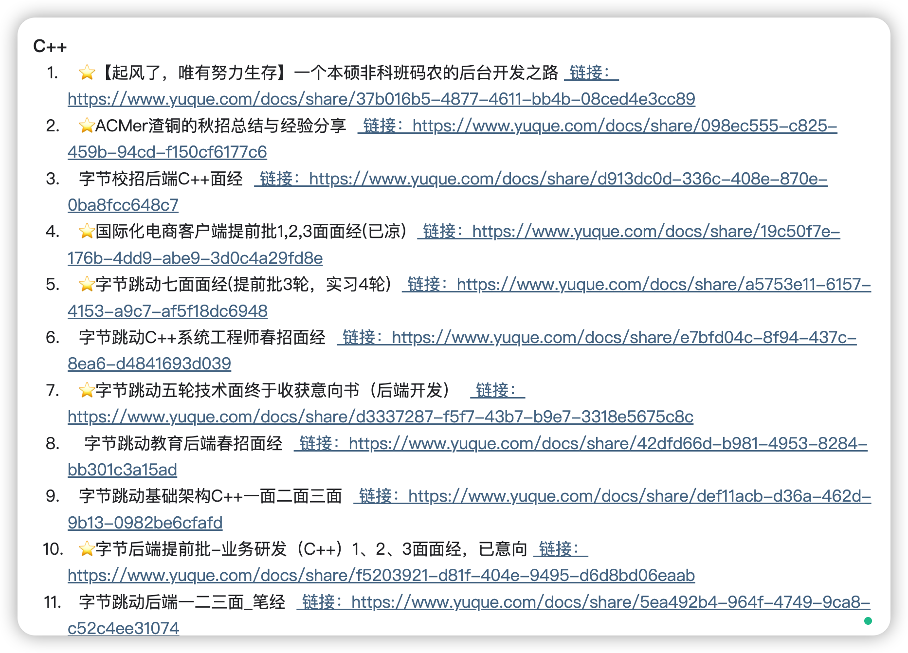
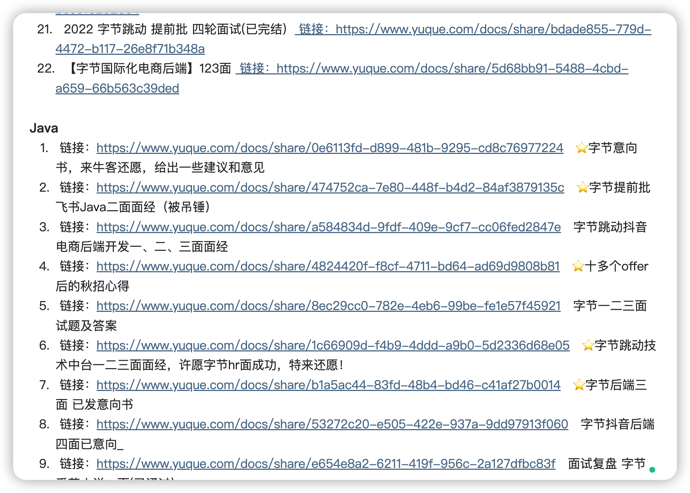
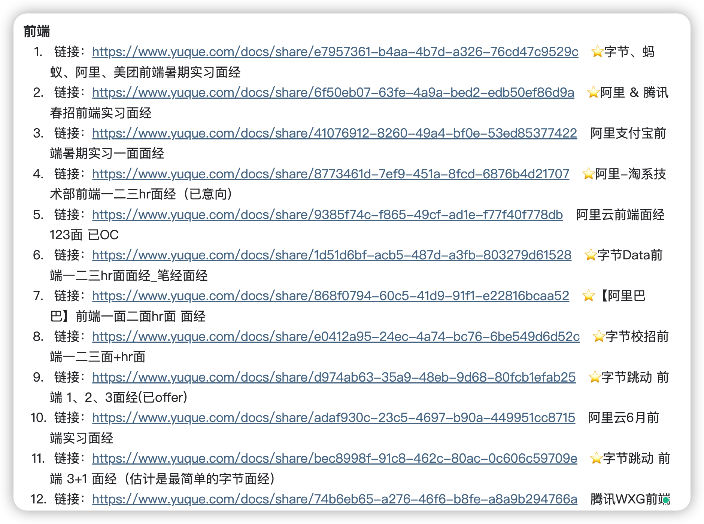
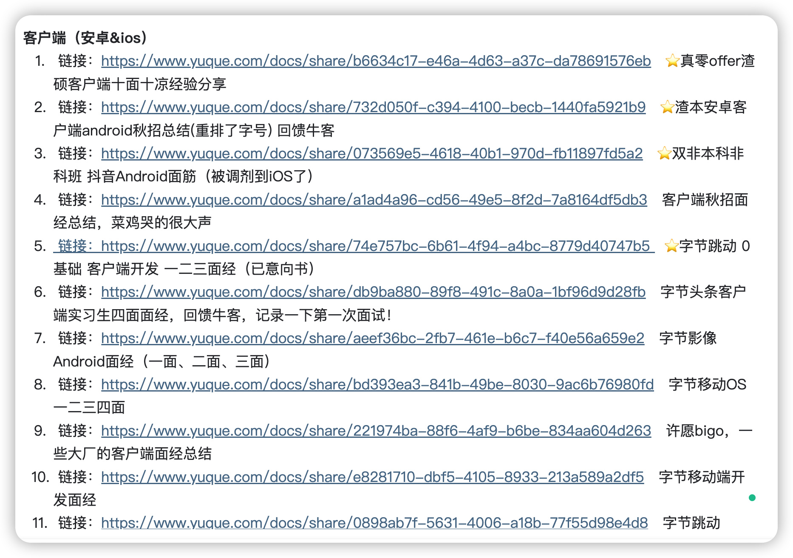

<h1 align="center">
Kinh nghiệm phỏng vấn thực tế tại các công ty Big Tech hàng đầu như Alibaba, ByteDance, Tencent, Meituan
</h1>

  
Dưới đây là 6 mẩu thông tin có thể sẽ hữu ích cho bạn:

⭐️ 1. A Tú cùng bạn bè đã hợp tác phát triển một website tài nguyên lập trình, hiện đã tổng hợp rất nhiều tài liệu học tập chất lượng và công cụ công nghệ tiện ích (kèm link tải). Nếu bạn đang tìm kiếm tài nguyên lập trình phù hợp, <a href="https://tools.interviewguide.cn/home" style="text-decoration: underline" target="_blank">hoan nghênh trải nghiệm</a> cũng như giới thiệu những tài nguyên hữu ích mà bạn biết, mọi người cùng chung tay góp sức, mình vì mọi người, mọi người vì mình🔥!
  
2. 👉 Tháng 5/2023, trong khoảng thời gian A Tú <a style="text-decoration: underline" href="https://mp.weixin.qq.com/s?__biz=Mzk0ODU4MzEzMw==&mid=2247512170&idx=1&sn=c4a04a383d2dfdece676b75f17224e78" target="_blank">rời ByteDance để chuyển việc sang một công ty đa quốc gia</a>, để thuận tiện cho bản thân tìm việc và tăng tỉ lệ đỗ (hạ cánh an toàn), mình và bạn bè đã tự phát triển từ con số 0 một website phân tích đề thi phỏng vấn Big Tech thực chiến, gồm 2 frontend và 1 backend. Trang web hỗ trợ tra cứu đề thi viết (online test/coding assessment) của từng công ty Internet cụ thể, ví dụ như tra cứu xem ByteDance có những đề thi viết nào trong 1 năm gần nhất. Hoan nghênh trải nghiệm~

Địa chỉ website: <a style="text-decoration: underline" href="https://niumacode.com/home?ref=F6O2625K" target="_blank">Website đề thi thuật toán phỏng vấn Big Tech</a>.
  
3. 😊
    Chia sẻ một tổng hợp tài nguyên đám mây 20TB do một bạn đàn em gửi cho mình, <a style="text-decoration: underline" href="https://docs.qq.com/sheet/DY3VPVklVaFFMcUZ4?tab=9h5afr" target="_blank">bấm vào đây để nhận miễn phí</a>, chủ yếu là phim ảnh HD, phim truyền hình, âm nhạc, nghề tay trái, phim tài liệu, tài liệu thi chứng chỉ tiếng Anh, thi cao học, thi công chức, v.v.
  

  
4. 😍 Chia sẻ miễn phí các tài nguyên học tập mà A Tú đã tích lũy từ khi bắt đầu học khoa học máy tính, <a style="text-decoration: underline" href="/notes/07-resources/01-free/01-introduce.html" target="_blank">bấm vào đây để nhận miễn phí</a>; đồng thời cũng lưu lại nhật ký đánh giá <a style="text-decoration: underline" href="/notes/07-resources/02-precious.html" target="_blank">những cuốn sách máy tính, chuyên mục trả phí chất lượng cũng như các chuyên mục rác</a> mà bản thân từng mua trước đây.
  

  
5. 🚀 Nếu bạn muốn thuận lợi nhận được offer tốt hơn trong mùa tuyển dụng trường học, A Tú khuyên bạn nên xem thêm những <a style="text-decoration: underline" href="https://www.yuque.com/tuobaaxiu/httmmc/npg1k81zeq4wfpyz" target="_blank">cái bẫy (hố sâu) mà người đi trước từng dẫm phải</a> và <a style="text-decoration: underline"  target="_blank" href="https://www.yuque.com/tuobaaxiu/httmmc/gge9ppd0mbu2d3dp">những kinh nghiệm quý báu để lại</a>. Trên thực tế, hầu hết những vấn đề bạn gặp phải hiện tại thì các anh chị khóa trước đều đã từng trải qua.
  

  
6. 🔥 Hoan nghênh các bạn đang chuẩn bị cho mùa tuyển dụng IT gia nhập <a  style="text-decoration: underline" href="https://www.yuque.com/tuobaaxiu/httmmc/xg0otqvc17wfx4u9" target="_blank">vòng tròn học tập (nhóm kín) của mình</a>, đi một mình đơn độc không bằng đi cùng đồng đội sưởi ấm cho nhau. Trong nhóm lưu giữ rất nhiều <a  style="text-decoration: underline" href="https://www.yuque.com/tuobaaxiu/httmmc/gge9ppd0mbu2d3dp" target="_blank">kinh nghiệm và tổng kết</a> của các anh chị khóa 21/22/23/24/25. Những ai kiên trì theo sát lộ trình, cuối cùng cơ bản đều nhận được offer rất tốt!</a> Nếu bạn cần bản PDF tổng hợp các kiến thức "Bát cổ văn" tuyển dụng trên website "Sổ tay học tập của A Tú", có thể <a style="text-decoration: underline" href="https://www.yuque.com/tuobaaxiu/httmmc/qs0yn66apvkzw0ps" target="_blank">bấm vào đây để tải về</a>.
   

Thứ Sáu tuần trước tôi có viết tool cào dữ liệu, à không, là dày công tự tay thu thập được rất nhiều bài chia sẻ kinh nghiệm phỏng vấn thực tế, chủ yếu lấy từ diễn đàn Nowcoder (牛客) và trang Shixiseng (实习僧).

Tôi đã thu thập được khoảng hơn 1.400 bài. Trong hai ngày qua, tôi đã dành thời gian để lọc trùng và loại bỏ những nội dung quá sơ sài hoặc quá ngắn (dưới 30 chữ). Cuối cùng đã giữ lại được một lượng lớn các bài phỏng vấn chất lượng cao, chủ yếu chia thành các danh mục sau:

- C++
- Java
- Frontend
- Client (Android & iOS)
- Product Manager (Sản phẩm)

Đối với các câu hỏi lý thuyết "Bát cổ văn" trong các bài phỏng vấn này, khuyên bạn nên kết hợp tham khảo với nội dung trên website Sổ tay học tập của tôi: [https://interviewguide.cn/notes/03-hunting_job/02-interview/02-01-%E6%93%8D%E4%BD%9C%E7%B3%BB%E7%BB%9F.html](https://interviewguide.cn/notes/03-hunting_job/02-interview/02-01-操作系统.html)

Tôi đã xem qua nội dung bên dưới, rất nhiều câu hỏi trong số đó đều đã có câu trả lời tương ứng trên website của tôi. Nội dung trên website hoàn toàn là những ghi chép mà bản thân tôi tự tổng hợp lại trong quá trình tự học trước đây.

Thực lòng mà nói, thời điểm tôi làm ghi chép thì thuật ngữ "Bát cổ văn" còn chưa phổ biến như bây giờ, nên lúc đó tôi ghi chép với tâm thế học tập để hiểu bản chất, chứ không phải học vẹt học thuộc lòng như nhiều người hiện nay.

Dưới đây là một số bài phỏng vấn đã thu thập, chủ yếu chia theo các vị trí: Quản lý sản phẩm (Product), Lập trình Client (iOS và Android), Frontend, C++, Java. Trong đó các vị trí Frontend, Java và C++ chiếm số lượng rất lớn.

## Ví dụ **C++**

## Ví dụ **Java**

## Ví dụ **Frontend**

## Ví dụ **Client (iOS và Android)**

## Địa chỉ truy cập kho kinh nghiệm phỏng vấn

Tương tự như các tài liệu khác, tôi đều đã đưa toàn bộ vào trong cộng đồng học tập của mình và sau này sẽ tiếp tục cập nhật. Chào mừng bạn tìm hiểu [Cộng đồng học tập của A Tú](/notes/05-xiustar/01-xiustar_reading_guide/01-introduce_VN.md#a-tú-đã-thành-lập-một-cộng-đồng-học-tập-chuẩn-bị-cho-tuyển-dụng-trường-học-campus-recruitment), **Địa chỉ toàn bộ tuyển tập kinh nghiệm phỏng vấn**: [https://t.zsxq.com/05YbMF6M3](https://t.zsxq.com/05YbMF6M3)
