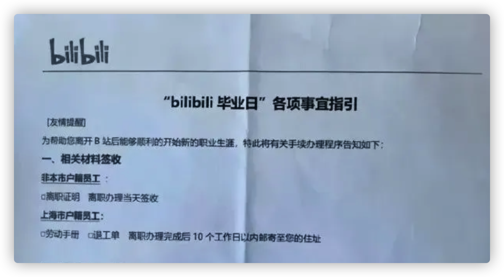
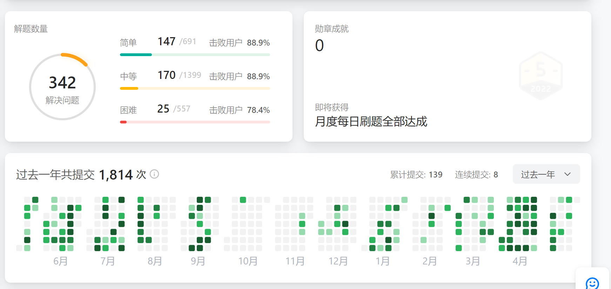
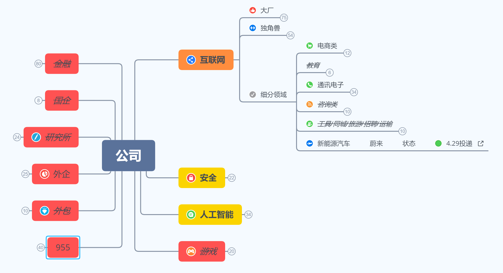

<h1 align="center">
  Sau một năm thực tập online tại NetEase, tôi lại đến ByteDance để tôi luyện mạ vàng
</h1>

  
Đây là 6 thông tin có thể sẽ hữu ích cho bạn:

⭐️1. A Tú cùng bạn bè hợp tác phát triển một website tài nguyên lập trình, hiện đã tổng hợp rất nhiều tài liệu học tập chất lượng và công cụ hữu ích (kèm link tải). Nếu bạn đang tìm kiếm tài nguyên lập trình phù hợp, <a href="https://tools.interviewguide.cn/home" style="text-decoration: underline" target="_blank">hoan nghênh trải nghiệm</a> cũng như giới thiệu những tài nguyên bạn thấy hay. Góp gió thành bão, mình vì mọi người, mọi người vì mình🔥!
  
2. 👉 Tháng 5/2023, trong thời gian <a style="text-decoration: underline" href="https://mp.weixin.qq.com/s?__biz=Mzk0ODU4MzEzMw==&mid=2247512170&idx=1&sn=c4a04a383d2dfdece676b75f17224e78" target="_blank">rời ByteDance để chuyển sang một công ty đa quốc gia</a>, nhằm thuận tiện cho bản thân khi tìm việc và nâng cao tỷ lệ trúng tuyển, A Tú cùng bạn bè đã phát triển từ con số 0 một website giải đề phỏng vấn thực chiến của các Big Tech, bao gồm hai frontend và một backend. Trang web cho phép tra cứu có định hướng đề thi viết của các công ty Internet, ví dụ như muốn tra cứu đề thi viết của ByteDance trong 1 năm gần đây gồm những gì đều có thể làm được. Hoan nghênh trải nghiệm~

Địa chỉ website: <a style="text-decoration: underline" href="https://niumacode.com/home?ref=F6O2625K" target="_blank">Website đề thi thuật toán phỏng vấn Big Tech</a>.
    
3. 😊
    Chia sẻ một website công cụ tiện ích mà A Tú tâm đắc sưu tầm, <a style="text-decoration: underline" href="https://hkjtz.cn/" target="_blank">nhấn vào đây để truy cập</a>, chủ yếu là các ứng dụng, website ngách hữu ích, ngoài ra còn có tài nguyên phim ảnh HD, âm nhạc, phim truyền hình, AI, phim tài liệu, tài liệu thi tiếng Anh, thi công chức, cao học, nghề tay trái...
  

  
4. 😍 Chia sẻ miễn phí tài nguyên học tập mà A Tú đã tích lũy từ khi theo học máy tính, <a style="text-decoration: underline" href="/notes/07-resources/01-free/01-introduce.html" target="_blank">nhấn vào đây để nhận miễn phí</a>; đồng thời cũng lưu lại nhật ký đánh giá <a style="text-decoration: underline" href="/notes/07-resources/02-precious.html" target="_blank">những cuốn sách máy tính, chuyên mục online chất lượng cũng như những khóa học trả phí kém chất lượng</a> từng mua trước đây.
  

  
5. 🚀 Nếu bạn muốn thuận lợi giành được offer tốt hơn trong kỳ tuyển dụng trường học (Campus Recruitment), A Tú khuyên bạn nên xem thêm những <a style="text-decoration: underline" href="https://www.yuque.com/tuobaaxiu/httmmc/npg1k81zeq4wfpyz" target="_blank">cạm bẫy từng vấp phải</a> và <a style="text-decoration: underline"  target="_blank" href="https://www.yuque.com/tuobaaxiu/httmmc/gge9ppd0mbu2d3dp">kinh nghiệm đúc kết</a> của người đi trước. Thực tế, hầu hết các vấn đề bạn đang gặp phải thì các anh chị khóa trước đều đã từng trải qua.
  

  
6. 🔥 Hoan nghênh các bạn đang chuẩn bị cho kỳ tuyển dụng trường học ngành CNTT tham gia <a  style="text-decoration: underline" href="https://www.yuque.com/tuobaaxiu/httmmc/xg0otqvc17wfx4u9" target="_blank">Cộng đồng học tập</a> của tôi. Độc hành một mình chi bằng cùng nhau sưởi ấm, trong nhóm đã đọng lại rất nhiều <a  style="text-decoration: underline" href="https://www.yuque.com/tuobaaxiu/httmmc/gge9ppd0mbu2d3dp" target="_blank">kinh nghiệm và tổng kết</a> của các anh chị khóa 21/22/23/24/25. Kiên trì đi theo lộ trình, cuối cùng đa phần đều có thể nhận được offer ưng ý! Nếu bạn cần phiên bản PDF tổng hợp các điểm kiến thức 📚︎ Bát cổ văn phỏng vấn tuyển dụng trường học trên website 《Ghi chép học tập của A Tú》, có thể <a style="text-decoration: underline" href="https://www.yuque.com/tuobaaxiu/httmmc/qs0yn66apvkzw0ps" target="_blank">nhấn vào đây để tải về</a>.
   

> Tác giả: A Tú
>
> Liên kết bài viết gốc: [https://mp.weixin.qq.com/s/CIiZ61fh7sx-mmNlqUaJ8g](https://mp.weixin.qq.com/s/CIiZ61fh7sx-mmNlqUaJ8g)

Xin chào, mình là A Tú.

Không biết các bạn có nhận thấy tình hình tìm kiếm việc làm thực tập năm nay tương đối khó khăn và các công ty tuyển ít người hơn không?

Nguyên nhân lớn có thể do ảnh hưởng chung của thị trường và dịch bệnh, các công ty lớn liên tục cắt giảm nhân sự (hay nói vui theo cách của các Big Tech là cho nhân viên "tốt nghiệp" 🐶).

Ví dụ như JD, Bilibili đều đang làm lễ "tốt nghiệp" cho nhân viên...

Có thể dự đoán rằng đợt tuyển dụng sớm (Early Bird) và tuyển dụng mùa thu (Autumn Recruitment) năm nay cũng sẽ không mấy dễ thở!

Khuyên các bạn khóa dưới nên chuẩn bị từ sớm: học Bát cổ văn ngay, cày thuật toán LeetCode ngay!

Tuần trước, một người sư đệ vừa báo tin vui cho mình: cậu ấy đã đỗ vào ByteDance. Năm ngoái cậu ấy đã trúng tuyển thực tập tại NetEase và ký hợp đồng thực tập online 1 năm. Hồi đó mình cũng từng chia sẻ bài viết của cậu ấy: [Sư đệ đi NetEase rồi](http://mp.weixin.qq.com/s?__biz=Mzg2MDU0ODM3MA==&mid=2247493890&idx=1&sn=0516b979c9d49de186bd5c776ec4d011&chksm=ce26157ff9519c6994dcf70ca8823602ce1c308a65e8e54fcc878b4d8e298f2e059e90a8437a#rd).

Sau một năm, cậu ấy lại tiếp tục sang ByteDance để "tôi luyện mạ vàng" và tích lũy thêm kinh nghiệm.

Hôm nay mình xin chia sẻ bài viết của sư đệ! Cần lưu ý trước là cậu bạn này tính tình khá hài hước, bài viết chia sẻ kinh nghiệm này được viết dưới dạng **Bài báo khoa học / Tiểu luận nghiên cứu của học viên cao học**. Mình nghĩ các bạn học viên cao học khi nhìn thấy format này chắc chắn sẽ cảm thấy vừa quen thuộc vừa bật cười hahah.

*(Giải thích ngắn gọn cho các bạn đại học: Sinh viên cao học thường phải hoàn thành luận văn tốt nghiệp lớn và các bài báo khoa học nhỏ đăng trên các tạp chí chuyên ngành (khoảng 2.000 - 3.000 từ) để đủ điều kiện tốt nghiệp thạc sĩ).*

Dưới đây là toàn văn bài chia sẻ kinh nghiệm của sư đệ (đại từ "tôi/mình" là lời của tác giả):

---

Dạo này viết tiểu luận nhiều quá hơi bị "nghiện", phát hiện ra cái gì trong cuộc sống cũng có thể chuyển thành văn phong bài báo khoa học được, bắt đầu nào~

**Tiêu đề bài báo**: Tiền xử lý và thực nghiệm xác thực đề tài: "Hạ cánh an toàn suất Thực tập Mùa hè trong bối cảnh làn sóng cắt giảm nhân sự ngành Internet tăng theo cấp số nhân".

## Tóm tắt (Abstract)

Nhằm ứng phó với sự gia tăng áp lực cạnh tranh khốc liệt (nội quyển) từ môi trường bên ngoài và quá trình chuyển đổi nhảy vọt từ sinh viên lướt web giải trí sang người lao động chuyên nghiệp, ngày càng có nhiều sinh viên tham gia vào canh bạc tìm kiếm suất Thực tập Mùa hè (Summer Internship).

Phần lớn các nghiên cứu hiện nay chỉ tập trung chia sẻ kinh nghiệm phỏng vấn (mặt kinh) mà ~~bỏ quên khả năng viết thành một bài báo khoa học để đủ điều kiện tốt nghiệp thạc sĩ~~. Bài báo này tiến hành phân tích toàn diện về vấn đề "Hạ cánh an toàn suất thực tập mùa hè trong bối cảnh làn sóng sa thải nhân sự tăng theo cấp số nhân", áp dụng phương pháp nghiên cứu kết hợp lý luận với thực tiễn, phân tích cụ thể từng tình huống, đúc kết trên nền tảng các công trình nghiên cứu trước đây, thảo luận về khâu tiền xử lý và thực nghiệm kiểm chứng. Cuối cùng, qua hàng loạt thực nghiệm lặp lại với độ chính xác cao, đã thu được kết quả: **Hạ cánh thành công vị trí Thực tập sinh Phát triển Phần mềm Mùa hè tại ByteDance, làm việc tại Bắc Kinh**.

**Từ khóa: Thực tập Mùa hè; Internet; Cạnh tranh khốc liệt; Giải trí; Đi làm**

## Chương 1: Giới thiệu (Introduction)

Đề tài này xuất phát từ **cuộc sống đầy gian nan của học viên cao học và hành trình tìm kiếm thực tập mùa hè**, các nghiên cứu trong lĩnh vực này còn tương đối hạn chế, mở ra tiềm năng khai thác bài viết rất lớn.

### 1.1 Hiện trạng cắt giảm nhân sự trong và ngoài nước

Như đã biết, "mùa đông băng giá" của ngành Internet năm nào cũng được nhắc tới, nhưng năm nay có vẻ là năm khắc nghiệt nhất.

Tỷ lệ giữa nhu cầu tuyển dụng của doanh nghiệp và quy mô sinh viên tốt nghiệp ra trường không tăng mà lại giảm, khiến tình hình tìm kiếm thực tập mùa hè của sinh viên ngày càng cam go.

Theo Đài truyền hình Trung ương Trung Quốc (CCTV), **quy mô sinh viên tốt nghiệp năm 2022 ước tính đạt 10,76 triệu người, tăng 1,67 triệu người so với cùng kỳ năm trước.**

Đây là lần đầu tiên số lượng cử nhân tốt nghiệp **vượt mốc 10 triệu người**, đồng thời cũng là **năm có mức tăng số lượng đông nhất trong những năm gần đây.**

Tình hình nước ngoài thế nào thì tạm thời chưa rõ và cũng không dám bàn luận.

### 1.2 Cơ sở lý thuyết về Thực tập Mùa hè (Summer Internship)

Về mặt lý thuyết, Thực tập Mùa hè và Thực tập Thường kỳ (Daily Internship) về bản chất đều là thực tập, sự khác biệt được thể hiện trong bảng dưới đây:

| Tiêu chí | Thực tập Mùa hè (Summer Internship) | Thực tập Thường kỳ (Daily Internship) |
| :---: | :---: | :---: |
| **Yêu cầu tuyển dụng** | Tương đối cao (về mặt lý thuyết) | Tương đối linh hoạt (về mặt lý thuyết) |
| **Thời gian tuyển dụng** | Tháng 3 ~ Tháng 5 (một số công ty mở từ sớm) | Quanh năm |
| **Thời gian thực tập** | Tháng 6 ~ Tháng 8 | Quanh năm |
| **Cơ hội lên chính thức (Return Offer)** | Rất lớn | Khá thấp (thường không có suất chính thức) |
| **Đối tượng tuyển dụng** | Sinh viên năm cuối chuẩn bị tốt nghiệp (năm sau ra trường) | Tất cả sinh viên đang theo học |

### 1.3 Phân tích hiện trạng cá nhân

Bản thân đang là học viên cao học năm thứ hai thạc sĩ máy tính tại trường song phi (non-985/211), bậc đại học học trái ngành, năm ngoái đã có 1 năm kinh nghiệm thực tập Backend.

Giáo sư hướng dẫn thường xuyên giao việc và hối thúc liên tục, khiến mãi đến cuối tháng 4 mình mới có thể bắt đầu tìm kiếm thực tập hè.

## Chương 2: Tiền xử lý cho bài toán Thực tập Mùa hè

### 2.1 Bản CV (Hồ sơ ứng tuyển)

Phần này không cần bàn cãi nhiều: tham khảo template mẫu CV tuyển dụng CNTT do anh Tú biên soạn là hoàn toàn yên tâm.

Liên kết bài viết: [Làm thế nào để một bản CV tuyển dụng trường học bách phát bách trúng trải qua đúng 26 lần lặp?](https://mp.weixin.qq.com/s/uSICl9N2_4XRBNegkS6PKQ)

### 2.2 Thuật toán (Algorithm)

Luyện đề quý ở sự kiên trì. Điểm này mình làm chưa thực sự xuất sắc, xin trích xuất kết quả luyện LeetCode như hình dưới:

Chiến lược luyện đề hiện tại của mình là: phân loại theo dạng bài, tổng kết nhiều lần để tránh vừa học vừa quên.

Mỗi ngày giải 1-2 bài Dễ (Easy) để khởi động và lấy lại cảm giác, sau đó bám sát từng dạng bài để cày các câu kinh điển, câu hỏi xuất hiện tần suất cao. Bởi vì các câu hỏi trong bài thi viết và phỏng vấn phần lớn là bài gốc hoặc biến thể nhẹ từ bài toán kinh điển.

Làm thế nào để biết bài nào hay được hỏi? Có các kênh sau:
- Mua gói LeetCode Premium để xem tần suất xuất hiện theo từng công ty.
- Sử dụng website CodeTop để tra cứu tần suất và thời gian xuất hiện gần nhất của từng bài toán trong các buổi phỏng vấn thực tế.

### 2.3 Bát cổ văn (Lý thuyết phỏng vấn)

Học thuộc và nắm chắc bản chất, tham khảo ghi chép của anh Tú tại website: https://interviewguide.cn.

Nếu muốn tìm hiểu sâu về MySQL Database, khuyên các bạn nên đọc chuyên mục "45 bài giảng thực chiến MySQL" của GeekTime.

### 2.4 Dự án thực tế (Projects)

Dù là dự án mã nguồn mở tự học hay dự án làm trong thời gian thực tập, trước đây mình từng gặp khó khăn: dự án rất lớn nhưng không biết tóm tắt vào CV như thế nào.

Giải pháp hiện tại của mình là: **tổng kết theo từng điểm công nghệ cụ thể trong dự án**. Một mặt giúp bạn trình bày dự án ấn tượng hơn trong CV, mặt khác giúp bạn lường trước được những câu hỏi công nghệ mà interviewer có thể xoáy sâu vào. Sau đó ôn lại lý thuyết Bát cổ văn gắn liền với các điểm công nghệ đó để có thể đối đáp tự tin với người phỏng vấn.

Trong phỏng vấn rất hay gặp câu hỏi: *Trong dự án em gặp khó khăn gì? Đã giải quyết như thế nào?* Để trả lời tốt câu này, chỉ có con đường duy nhất là trong quá trình làm việc phải liên tục ghi chép và tổng kết lại.

## Chương 3: Thực hành ứng tuyển Thực tập Mùa hè

Nửa đầu năm nay do không chú ý giai đoạn cao điểm tuyển dụng và chuẩn bị chưa chu đáo nên mình nộp đơn khá muộn. Thêm vào đó tỷ lệ cạnh tranh rất gay gắt, lợi thế cá nhân không quá nổi bật nên cả quá trình diễn ra khá cam go. Rút kinh nghiệm sâu sắc từ lần này, đợt tuyển dụng mùa thu sắp tới nhất định phải chuẩn bị từ rất sớm.

Dưới đây là một số chiến lược cần lưu ý:

### 3.1 Thời gian thực tập mùa hè
- **Thời gian tuyển dụng**: Đỉnh điểm từ tháng 3 đến tháng 4, có kết quả offer từ tháng 5 đến tháng 6 (một số công ty có thể tuyển sớm hơn).
- **Thời gian nhận việc**: Thông thường vào mùa hè từ tháng 7 đến tháng 9 (hoặc có thể vào làm sớm từ tháng 5 - tháng 6). Thường cần thực tập đủ 2-3 tháng mới đủ điều kiện xét duyệt chuyển lên chính thức (Return Offer).

### 3.2 Kênh tiếp cận thông tin tuyển dụng
- Website tuyển dụng chính thức và Official WeChat Account của doanh nghiệp.
- Diễn đàn Nowcoder (tìm mã Referral / Giới thiệu nội bộ).
- Diễn đàn trường đại học.
- Đàn anh, đàn chị, bạn bè đã vào làm tại các công ty.
- Các group/cộng đồng chia sẻ thông tin tuyển dụng.

### 3.3 Lập bảng theo dõi và quản lý hồ sơ ứng tuyển

Đa số mọi người đều rải hồ sơ vào nhiều công ty, vậy làm sao để không bị bỏ sót? Làm sao quản lý các phiên bản CV khác nhau cho từng công ty? Làm sao lưu trữ thông tin phỏng vấn hiệu quả?

Giải pháp của mình: Tạo một bảng sơ đồ tư duy (Mindmap) hoặc bảng tính Excel tổng hợp toàn bộ các doanh nghiệp mục tiêu, lưu lại lịch sử nộp đơn, thời gian phỏng vấn, link referral, đề thi viết, ghi chép phỏng vấn... như hình dưới:

Nhờ bảng theo dõi này, bạn có thể kiểm soát toàn diện các cơ hội, sắp xếp thời gian hợp lý và đưa ra chiến lược tối ưu nhất.

## Chương 4: Kết luận và Định hướng tương lai

Tìm việc quả thực không hề dễ dàng.

Làm việc cho giáo sư hướng dẫn cũng chẳng dễ dàng gì.

Vừa làm việc cho lab vừa tranh thủ tìm việc lại càng muôn phần gian nan!

Tìm việc đôi khi cũng có một chút yếu tố may mắn, nhưng quan trọng nhất vẫn là nỗ lực hết mình. Khi số lượng hồ sơ nộp đủ lớn, cơ hội chắc chắn sẽ mỉm cười với bạn.

Chúc mọi người có một kỳ Tuyển dụng Mùa thu (Autumn Recruitment) thật thuận lợi và gặt hái nhiều offer như ý!

## Tài liệu tham khảo

[1] A Tú: [Xin chào, mình là A Tú](https://mp.weixin.qq.com/s?__biz=Mzg2MDU0ODM3MA==&mid=100000332&idx=1&sn=9dd24307b7e963174ee8429827542318&chksm=4e25fe3179527727ac563214c69fe6ac354ab4383c652d9b3e9e03d70dc48df4ad929e076ce3&scene=18#wechat_redirect)

[2] Tất Đạo: Hướng dẫn viết bài báo khoa học xuất sắc - Bilibili

[3] Tiến sĩ Y khoa: Hướng dẫn hoàn thành luận văn tốt nghiệp - Bilibili

[4] Nghệ thuật trả lời phản biện luận văn - Bilibili
