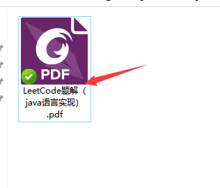
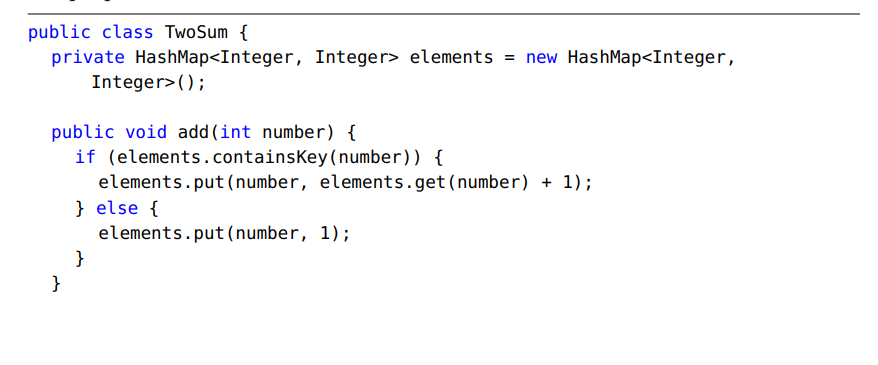
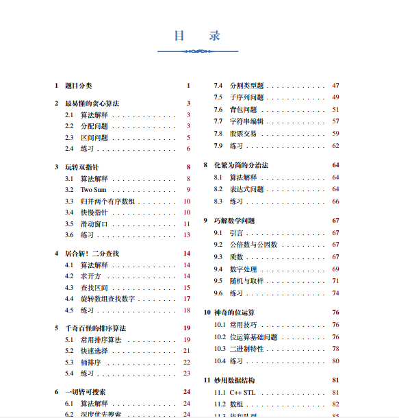
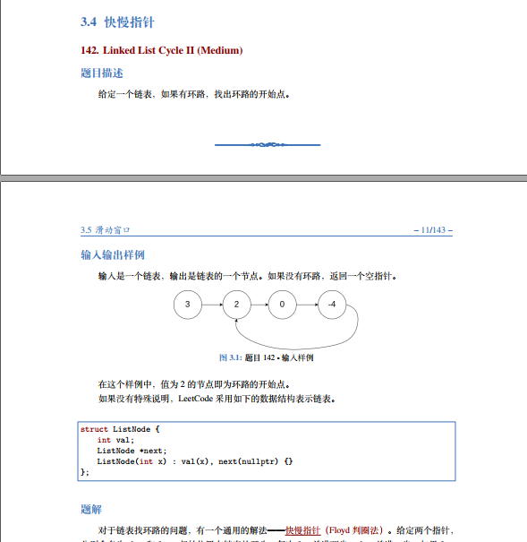
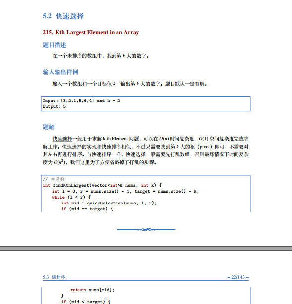
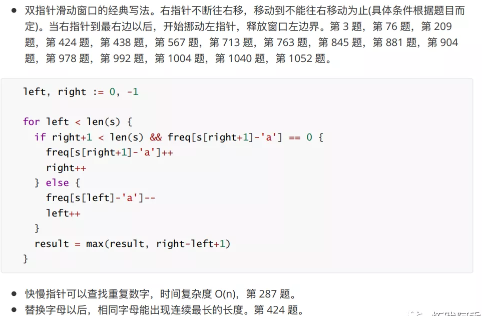
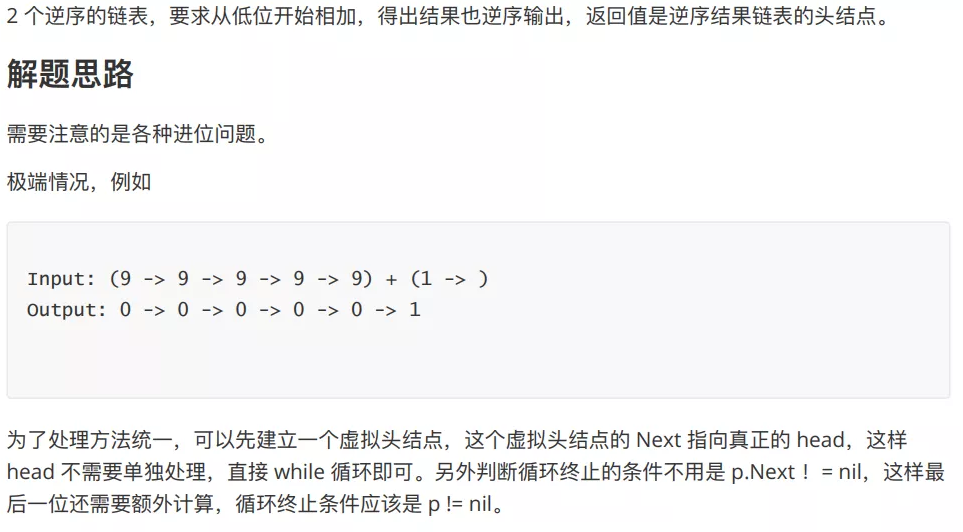

<h1 align="center">能白嫖，速来！三份Github高星LeetCode刷题PDF笔记！！支持Java、C++、Go三种语言！</h1>

  
Đây là 6 thông tin có thể sẽ hữu ích cho bạn:

⭐️1. A Tú cùng bạn bè hợp tác phát triển một website tài nguyên lập trình, hiện đã tổng hợp rất nhiều tài liệu học tập chất lượng và công cụ hữu ích (kèm link tải). Nếu bạn đang tìm kiếm tài nguyên lập trình phù hợp, <a href="https://tools.interviewguide.cn/home" style="text-decoration: underline" target="_blank">hoan nghênh trải nghiệm</a> cũng như giới thiệu những tài nguyên bạn thấy hay. Góp gió thành bão, mình vì mọi người, mọi người vì mình🔥!
  
2. 👉 Tháng 5/2023, trong thời gian <a style="text-decoration: underline" href="https://mp.weixin.qq.com/s?__biz=Mzk0ODU4MzEzMw==&mid=2247512170&idx=1&sn=c4a04a383d2dfdece676b75f17224e78" target="_blank">rời ByteDance để chuyển sang một công ty đa quốc gia</a>, nhằm thuận tiện cho bản thân khi tìm việc và nâng cao tỷ lệ trúng tuyển, A Tú cùng bạn bè đã phát triển từ con số 0 một website giải đề phỏng vấn thực chiến của các Big Tech, bao gồm hai frontend và một backend. Trang web cho phép tra cứu có định hướng đề thi viết của các công ty Internet, ví dụ như muốn tra cứu đề thi viết của ByteDance trong 1 năm gần đây gồm những gì đều có thể làm được. Hoan nghênh trải nghiệm~

Địa chỉ website: <a style="text-decoration: underline" href="https://niumacode.com/home?ref=F6O2625K" target="_blank">Website đề thi thuật toán phỏng vấn Big Tech</a>.
    
3. 😊
    Chia sẻ một website công cụ tiện ích mà A Tú tâm đắc sưu tầm, <a style="text-decoration: underline" href="https://hkjtz.cn/" target="_blank">nhấn vào đây để truy cập</a>, chủ yếu là các ứng dụng, website ngách hữu ích, ngoài ra còn có tài nguyên phim ảnh HD, âm nhạc, phim truyền hình, AI, phim tài liệu, tài liệu thi tiếng Anh, thi công chức, cao học, nghề tay trái...
  

  
4. 😍 Chia sẻ miễn phí tài nguyên học tập mà A Tú đã tích lũy từ khi theo học máy tính, <a style="text-decoration: underline" href="/notes/07-resources/01-free/01-introduce.html" target="_blank">nhấn vào đây để nhận miễn phí</a>; đồng thời cũng lưu lại nhật ký đánh giá <a style="text-decoration: underline" href="/notes/07-resources/02-precious.html" target="_blank">những cuốn sách máy tính, chuyên mục online chất lượng cũng như những khóa học trả phí kém chất lượng</a> từng mua trước đây.
  

  
5. 🚀 Nếu bạn muốn thuận lợi giành được offer tốt hơn trong kỳ tuyển dụng trường học (Campus Recruitment), A Tú khuyên bạn nên xem thêm những <a style="text-decoration: underline" href="https://www.yuque.com/tuobaaxiu/httmmc/npg1k81zeq4wfpyz" target="_blank">cạm bẫy từng vấp phải</a> và <a style="text-decoration: underline"  target="_blank" href="https://www.yuque.com/tuobaaxiu/httmmc/gge9ppd0mbu2d3dp">kinh nghiệm đúc kết</a> của người đi trước. Thực tế, hầu hết các vấn đề bạn đang gặp phải thì các anh chị khóa trước đều đã từng trải qua.
  

  
6. 🔥 Hoan nghênh các bạn đang chuẩn bị cho kỳ tuyển dụng trường học ngành CNTT tham gia <a  style="text-decoration: underline" href="https://www.yuque.com/tuobaaxiu/httmmc/xg0otqvc17wfx4u9" target="_blank">Cộng đồng học tập</a> của tôi. Độc hành một mình chi bằng cùng nhau sưởi ấm, trong nhóm đã đọng lại rất nhiều <a  style="text-decoration: underline" href="https://www.yuque.com/tuobaaxiu/httmmc/gge9ppd0mbu2d3dp" target="_blank">kinh nghiệm và tổng kết</a> của các anh chị khóa 21/22/23/24/25. Kiên trì đi theo lộ trình, cuối cùng đa phần đều có thể nhận được offer ưng ý! Nếu bạn cần phiên bản PDF tổng hợp các điểm kiến thức 📚︎ Bát cổ văn phỏng vấn tuyển dụng trường học trên website 《Ghi chép học tập của A Tú》, có thể <a style="text-decoration: underline" href="https://www.yuque.com/tuobaaxiu/httmmc/qs0yn66apvkzw0ps" target="_blank">nhấn vào đây để tải về</a>.
   
网站地址：<a style="text-decoration: underline" href="https://niumacode.com/home?ref=F6O2625K" target="_blank">大厂面试算法真题网站</a>。
    
3、😊
    分享一个阿秀自己私藏的黑科技网站，<a style="text-decoration: underline" href="https://hkjtz.cn/" target="_blank">点此直达</a>，主要是各类小众实用APP、网站等，除此外也包括高清影视、音乐、电视剧、AI、纪录片、英语四六级考试、考研考公、副业等资源。
  

  
4、😍免费分享阿秀个人学习计算机以来收集到的免费学习资源，<a style="text-decoration: underline" href="/notes/07-resources/01-free/01-introduce.html" target="_blank">点此白嫖</a>；也记录一下自己以前买过的<a style="text-decoration: underline" href="/notes/07-resources/02-precious.html" target="_blank">不错的计算机书籍、网络专栏和垃圾付费专栏</a>；也记录一下自己以前买过的<a style="text-decoration: underline" href="/notes/07-resources/02-precious.html" target="_blank">不错的计算机书籍、网络专栏和垃圾付费专栏</a>
  

  
5、🚀如果你想在校招中顺利拿到更好的offer，阿秀建议你多看看前人<a style="text-decoration: underline" href="https://www.yuque.com/tuobaaxiu/httmmc/npg1k81zeq4wfpyz" target="_blank">踩过的坑</a>和<a style="text-decoration: underline"  target="_blank" href="https://www.yuque.com/tuobaaxiu/httmmc/gge9ppd0mbu2d3dp">留下的经验</a>，事实上你现在遇到的大多数问题你的学长学姐师兄师姐基本都已经遇到过了。
  

  
6、🔥 欢迎准备计算机校招的小伙伴加入我的<a  style="text-decoration: underline" href="https://www.yuque.com/tuobaaxiu/httmmc/xg0otqvc17wfx4u9" target="_blank">学习圈子</a>，一个人踽踽独行不如一群人报团取暖，圈子里沉淀了很多过去21/22/23/24/25届学长学姐的<a  style="text-decoration: underline" href="https://www.yuque.com/tuobaaxiu/httmmc/gge9ppd0mbu2d3dp" target="_blank">经验和总结</a>，好好跟着走下去的，最后基本都可以拿到不错的offer！</a>如果你需要《阿秀的学习笔记》网站中📚︎校招八股文相关知识点的PDF版本的话，可以<a style="text-decoration: underline" href="https://www.yuque.com/tuobaaxiu/httmmc/qs0yn66apvkzw0ps" target="_blank">点此下载</a> 。
   

**现在计算机找工作没有不需要手撕代码的，特别是一些一线大厂，比如BAT、TMD或者字节跳动、快手这些，每面必考察算法题！**

但算法的练成**非一日之功**，阿秀学长以前在刷题的时候也没什么头绪，像无头苍蝇一样到处乱撞，走了不少弯路。后来发现了几本不错的资料，其中有**Java、C++、Go语言三种语言实现的刷题笔记**，现在分享给大家！**下载方式在文末**。

## 第一份Java版本

这个是一个LeetCode题解答案，里面包含了Java语言实现的版本。这本书从Leetcode题库中选出了面试经常被问到的一些算法题，给出了详细代码实现，大家可以优先刷完这部分题目，笔试面试有一定保障，最起码不慌了。

## Hướng dẫn tải về

A Tú đã tải sẵn trọn bộ tài liệu này cho các bạn，需要的小伙伴可以扫描下方阿秀学长的**WeChat Official Account cá nhân**「**拓跋阿秀**」回复「**02**」即可获取，另外两本书也在其中都打包在一起了。

小伙伴们可以放心**无套路，密码直接告诉你就是a123654，các bạn cần có thể tự do tải về**。

## 第二份C++版本

这是一本由谷歌大佬高畅所撰的《LeetCode算法题解+代码》，里面包含了详细的题目分析+详细代码答案且已开源，可作为刷题的辅助和参考,这是一本用心的数据结构算法类书籍，全书总共 143 页篇幅，详细讲解算法的内容有十五个章节。

对于每一位要求职的程序员来说，在LeetCode上熟练刷数据结构和算法题的重要性不言而喻，甚至某一程度上直接决定了笔面试的成败，相信这本PDF题解定有帮助。

下面带大家来看一下它的排版和内容吧。

**github地址**：https://github.com/soulmachine/leetcode

## Hướng dẫn tải về

A Tú đã tải sẵn trọn bộ tài liệu này cho các bạn，需要的小伙伴可以扫描下方阿秀学长的**WeChat Official Account cá nhân**「**拓跋阿秀**」回复「**02**」即可获取，另外两本书也在其中都打包在一起了。

小伙伴们可以放心**无套路，密码直接告诉你就是a123654，các bạn cần có thể tự do tải về**。

## 第三份Go语言版本

这是另一位谷歌大佬霜神(halfrost@github)写的 LeetCode 刷题笔记，值得一提的是这本书题目的代码都已经 beats 100% 了，没有 beats 100% 题解就没有放到本书中了。

霜神认为优化到 beats 100% 才算是把这题做出感觉了，才算真正学会这道题了，懂得其中的原理了。真的是大佬级别的强悍！

阿秀学长已经研读完这本书了，感觉在 Leetcode 上遇到中等难度的题基本不会卡顿了。

值得一提的是这是一本非常用心的刷题类书籍，采用博士论文排版格式要求的 Latex 编辑而成，分编程技巧、线性表、字符串、栈队列、树、排序、查找、BFS、DFS、贪心、动态规划等。

带你们来看一下它的的排版风格和目录吧，真的非常精美和用心了。

github地址：https://github.com/halfrost/LeetCode-Go

## Hướng dẫn tải về

A Tú đã tải sẵn trọn bộ tài liệu này cho các bạn，需要的小伙伴可以扫描下方阿秀学长的**WeChat Official Account cá nhân**「**拓跋阿秀**」回复「**02**」即可获取，另外两本书也在其中都打包在一起了。

小伙伴们可以放心**无套路，密码直接告诉你就是a123654，các bạn cần có thể tự do tải về**。

