<h2 align="center">阿秀自己使用过的一些学习资源</h2>

Tôi học máy tính chủ yếu là tự học. Trong quá trình tự học, tôi đã sử dụng rất nhiều tài liệu, có cái thấy hay, nhưng cũng có cái không.

Trong đó **tài liệu miễn phí** đã được giới thiệu trong mục [CS学习心得](/notes/04-experience/01-learn_experience/01-introduce.md), ví dụ:

- [我学编程全靠B站了，真香-第一期](/notes/04-experience/01-learn_experience/20210809%20-%20第一期-我学编程全靠B站了，真香.md)
- [我学编程全靠B站了，真香-第二期](/notes/04-experience/01-learn_experience/20210823%20-%20第二期-我学编程全靠B站了，真香.md)
- [我学编程全靠B站了，真香-第三期](/notes/04-experience/01-learn_experience/20210907%20-%20第三期-我学编程全靠B站了，真香-国外篇（第三期）.md)
- [一篇文章带你看完阿秀学习计算机以来看过的全部好书](/notes/04-experience/01-learn_experience/20211021%20-%20这可能是我学习计算机以来的全部收获和总结.md)

Đây là phương pháp học của tôi:

- [看书的一点小建议](notes/04-experience/01-learn_experience/20211110%20-%20看书的一点小建议.md)
- [看视频的一点小建议](/notes/04-experience/01-learn_experience/20210901%20-%20看视频的一点小建议.md)

Không thể phủ nhận, **nhiều sách kinh điển và专栏 trả phí cũng rất tốt**, ở đây tôi chỉ推荐 & tổng kết những **专栏 trả phí** mà cá nhân thấy khá hay trong quá trình học. Vì tech stack của tôi gồm C/C++, Golang, Frontend, Python nên tôi có viết đôi chút.

Hiện tại tech stack chính của tôi là C/C++, Golang, Frontend Vue, còn Python thỉnh thoảng cũng viết, vì vậy các专栏 tôi đã xem khá đa dạng. Số lượng专栏 tốt có trả phí không ít, nhưng专栏 rác cũng nhiều. Ở đây tôi cũng **ghi lại những khoản "thuế IQ" đã đóng**, những专栏 mua về không đáng giá.

**Dù sao cũng không phải quyết định nào cũng đúng, tôi cũng từng vấp ngã không ít lần, tiêu không ít tiền oan.**

Đáng nói là trong số những专栏 hay tôi đã xem, nhiều cái là **xem đi xem lại 2-3 lần** của某课时间, như专栏 kinh điển《MySQL45讲》, tôi nhớ mình đã xem trọn vẹn 3 lần, chưa kể những lần xem lẻ tẻ một vài chương. Với những专栏 này,阿秀 **đưa ra trải nghiệm cá nhân**, chỉ để người mới tham khảo.

**Những专栏 trả phí chưa mua hoặc chưa dùng,阿秀 không biết chất lượng thế nào, không có trải nghiệm thì tôi không nói**, ở đây không nói bừa cũng không乱推荐. Còn với những专栏 mình từng "vấp ngã", tôi cũng sẽ nói sơ qua, tại sao tôi không推荐, lý do ở đâu.

**Trước tiên nói về những专栏 hay tôi từng mua, như một số专栏 của Geek Time, tiếp theo là một số sách tôi khá推荐, và cuối cùng là kể về những khoản tiền oan tôi đã tiêu, những专栏 rác tôi đã mua...**

## 一、专栏 đáng mua

### 1、数据结构与算法之美 (Vẻ đẹp của Cấu trúc Dữ liệu & Giải thuật)

Tác giả: 王争

**Lời推荐 & Cảm nhận**: Data Structures and Algorithms của anh Vương là专栏 bán chạy nhất trên某课时间. Nhiều bạn hỏi tôi về học thuật toán có cần mua tài liệu gì không, tôi **chỉ推荐专栏 này + LeetCode**.

Xem kỹ专栏 này, rồi lên LeetCode luyện tập nhiều là đủ, không cần gì thêm.专栏 này xứng đáng được gọi là "Khóa học riêng về cấu trúc dữ liệu và giải thuật dành riêng cho kỹ sư". Nói thật lòng, đây là专栏 duy nhất trên thị trường thực sự phù hợp cho kỹ sư, tác giả là cựu kỹ sư Google Vương Tranh, tin rằng sẽ mở ra hành trình học thuật toán thú vị cho bạn.

Đối tượng phù hợp: Người mới học thuật toán, người yếu về thuật toán, bao gồm không giới hạn sinh viên mới tốt nghiệp và người đi làm chuyển việc trong vòng 3 năm. Phỏng vấn Internet bây giờ không nơi nào không kiểm tra cấu trúc dữ liệu và giải thuật, code tay là chuyện cơm bữa.

Đánh giá: ⭐️⭐️⭐️⭐️⭐️

Link: [http://gk.link/a/11osy](http://gk.link/a/11osy)

### 2、MySQL45讲

Tác giả: 丁奇

**Lời推荐 & Cảm nhận**:专栏 này do chuyên gia database, cựu chuyên gia kỹ thuật cấp cao của Alibaba là Đinh Kỳ viết. Với 10 chương đầu,阿秀 đã đọc đi đọc lại nhiều lần. Tổng thể thu được giải thích chi tiết về core technology MySQL và nguyên lý. Cụ thể như: cấu trúc dữ liệu, index, transaction, lock và mối quan hệ giữa chúng. Từ tổng quan đến chi tiết, kết hợp cấu trúc dữ liệu để hiểu về index, các quy tắc tối ưu index thông dụng, kết hợp với hệ thống log (binlog undolog redolog) để phân tích transaction, kết hợp lock để hiểu transaction và MVCC.

**Đối tượng phù hợp**: Phù hợp với người muốn hiểu tường tận MySQL.专栏 này có thể nói là必备 cho mọi backend developer. Tương tự như cái thứ 8 trong danh sách推荐《Redis核心技术与实战》, hai专栏 này cơ bản là必看 cho người làm backend.阿秀 cá nhân đã xem 2 lần hồi còn đi học, sau khi đi làm lại xem lần thứ ba, bây giờ thỉnh thoảng vẫn lấy ra xem.

Đánh giá: ⭐️⭐️⭐️⭐️⭐️

Link: [http://gk.link/a/11nhx](http://gk.link/a/11nhx)

Ở đây顺便 nói về sách nhỏ của掘金 **《MySQL是怎样运行的》**, chất lượng cũng được. Sự khác biệt là《MySQL是怎样运行的》có ngôn ngữ hài hước hơn, bạn sẽ không thấy nhàm chán, còn《**MySQL45讲**》của Geek Time thì trang trọng hơn, giảng giải bài bản. Nhưng về tính toàn diện thì《**MySQL45讲**》của Geek Time vẫn全面 hơn nhiều.

Lúc đầu tôi xem MySQL45讲 trước, chưa xem hết lần đầu, chỉ xem đến bài 20 là không xem nổi, thấy quá hệ thống và có tính体系 hóa. Sau đó师兄推荐 tôi cuốn《**MySQL是怎样运行的**》, thấy chỉ 30 tệ, tôi mua luôn...

Chỉ có thể nói **quá đáng giá**, xem xong cuốn này tôi mới quay lại xem tiếp《MySQL45讲》. Nếu bạn cũng như tôi muốn bắt đầu từ con số 0 để xây nền tảng database, có thể tham khảo lộ trình học database của tôi: [校招基础学科学习路线（适用于大多数人）](/notes/02-learning_route/01-basic-project/quick.html).

Sách nhỏ của掘金《MySQL是怎样运行的》đánh giá: ⭐️⭐️⭐️⭐️⭐️, link: [https://juejin.cn/book/6844733769996304392](https://juejin.cn/book/6844733769996304392?suid=1442199805108055&source=ios)

### 3、左耳听风

Tác giả: 陈皓

**Lời推荐 & Cảm nhận**: Đây là tác phẩm của đại lão "Trái tai nghe gió" Trần Hạo, một chuyên gia kỹ thuật kỳ cựu, cũng là lập trình viên hạng nặng. 《左耳听风》là một专栏 giảng dạy theo phong cách tổng quát, tập trung vào các ngôn ngữ chính thống, giảng giải về programming paradigm từ góc nhìn tổng thể. Đồng thời sách cũng có phân tích về các công nghệ chủ chốt trong distributed system & lộ trình luyện cấp của lập trình viên cùng phương pháp học hiệu quả và kinh nghiệm phỏng vấn. Đây là thứ có thể xuyên suốt toàn bộ sự nghiệp của bạn, đọc ở các giai đoạn khác nhau sẽ thu được trải nghiệm khác nhau.阿秀 lúc đi học xem thì ấn tượng sâu với programming paradigm, đi làm rồi xem lại thì thấy phần luyện cấp programmer phù hợp hơn.

Đối tượng phù hợp: Các bạn muốn gắn bó lâu dài với ngành IT.

Đánh giá: ⭐️⭐️⭐️⭐️⭐️

Link: [http://gk.link/a/11osB](http://gk.link/a/11osB)

### 4、操作系统实战45讲

Tác giả: 彭东

**Lời推荐 & Cảm nhận**: Nhìn tên cuốn này có thể bị hiểu nhầm, nó không phải dạng专栏 như MySQL45讲 mà là một khóa thực hành về OS nhỏ, sẽ hướng dẫn bạn hệ thống hóa để xây dựng một OS nhỏ. Đúng vậy, từ 0 đến 1, tự xây dựng OS của riêng bạn. Nếu bạn đã xem qua cuốn sách khác《操作系统真相还原》thì sẽ hiểu cuốn này.

Đối tượng phù hợp: Người thiếu project, theo hết专栏 này có thể làm project cá nhân; người muốn tìm hiểu kỹ về OS.

Đánh giá: ⭐️⭐️⭐️⭐️⭐️

Link: [http://gk.link/a/11QAC](http://gk.link/a/11QAC)

### 5、设计模式之美 (Vẻ đẹp của Design Pattern)

Tác giả: 王争

**Lời推荐 & Cảm nhận**: Đây là cuốn mà leader của tôi giới thiệu khi tôi mới đi làm. Lúc đó tôi mới vào làm chưa đầy một tháng, leader xem code tôi viết, bảo code tôi viết quá "sinh viên", tôi biết anh ấy nói tốt,.. thực ra là bảo code tôi viết quá tệ...

Chức năng thì đã implement, nhưng code logic rất tệ, anh ấy liền推荐 cho tôi专栏设计模式之美 này. Tôi rất cảm ơn anh ấy đã推荐, 98 tệ này không uổng!!!专栏 này chủ yếu về 23 design patterns, dạy bạn viết high-quality code.

Đối tượng phù hợp: **Các bạn đã nhận offer từ trường, chắc chắn sẽ đi làm** hoặc **các bạn chuẩn bị bước vào môi trường làm việc** hoặc **dân văn phòng đã làm một thời gian nhưng thấy code mình vẫn quá "sinh viên"**

Đánh giá: ⭐️⭐️⭐️⭐️⭐️

Link: [http://gk.link/a/11pau](http://gk.link/a/11pau)

### 6、算法面试通关40讲 (40 bài vượt ải phỏng vấn thuật toán)

Tác giả: 覃超

**Lời推荐 & Cảm nhận**: Không phù hợp với người đã luyện 500+ bài trên LeetCode! Không phù hợp với người đã luyện 500+ bài trên LeetCode! Không phù hợp với người đã luyện 500+ bài trên LeetCode! Trong đó nhiều bài là đề thi thật từ các大厂 trong nước. Tác giả thực sự có trình độ, nhiều quan điểm chia sẻ rất hữu ích, ví dụ dynamic programming thực ra là dynamic recursion; optimal substructure cho thấy trong quá trình giải bài toán tối ưu chúng ta cũng đang giải bài toán con tối ưu; khi giải chỉ tập trung vào giai đoạn hiện tại và giai đoạn tiếp theo, đừng sa vào chi tiết; khi suy ra công thức recursion thì hãy tin vào công thức đó.

Đối tượng phù hợp: Sinh viên mới tốt nghiệp chuẩn bị phỏng vấn kỹ thuật và người đi làm chuyển việc trong vòng 3 năm. Product và các vị trí phi kỹ thuật không phù hợp, người đã luyện 500+ bài LeetCode không phù hợp!

Đánh giá: ⭐️⭐️⭐️⭐️⭐️

Link: [http://gk.link/a/11pay](http://gk.link/a/11pay)

### 7、玩转Git三剑客

Tác giả: 苏玲

**Lời推荐 & Cảm nhận**:专栏 này là khóa video, điểm này khá tốt... có thể làm theo được.

Hai "rào cản" khi nhân viên mới vào làm: Linux và Git. Nhiều người kể cả tôi trước khi đi làm chính thức đều là phát triển độc lập, dù dùng GitHub cũng chỉ một mình commit code, không bao giờ gặp conflict.

Trước đây阿秀 có một intern đã gây ra sự cố code: [崩溃！实习生把小组的代码仓库搞得一团糟。。。](/notes/05-xiustar/08-it_career/20211130-崩溃！实习生把小组的代码仓库搞得一团糟。。。.md), nhưng khi đi làm chính thức thì hầu hết là多人合作, không còn cảnh tự mình hoàn thành project nữa. Đặc biệt là người mới gặp đủ thứ lỗi lệnh kỳ lạ, các tình huống branch management phức tạp và code conflict, cơ bản là không biết xử lý thế nào...专栏 này

Đối tượng phù hợp: Sinh viên mới tốt nghiệp làm kỹ thuật, vị trí phi kỹ thuật không cần掌握 kỹ năng này, đừng tiêu tiền oan.

Đánh giá: ⭐️⭐️⭐️⭐️

Link: [http://gk.link/a/11osE](http://gk.link/a/11osE)

### 8、趣谈Linux操作系统

Tác giả: 刘超

**Lời推荐 & Cảm nhận**: Trước source code, không có bí mật. Đây là khóa nhập môn Linux OS như một câu chuyện. Cần lưu ý kiến thức kernel khá hardcore, mỗi lần đọc đều có thu hoạch mới, suy nghĩ nhiều, tổng kết nhiều, mới có thể có chiều sâu hơn. Có vài chương阿秀 đã đọc đi đọc lại 4-5 lần, quá trình đọc khá trôi chảy, kết nối những hiểu biết rời rạc trước đây lại với nhau.

Đối tượng phù hợp: Người làm việc liên quan đến Linux, như developer Linux C++.

Đánh giá: ⭐️⭐️⭐️⭐️

Link: [http://gk.link/a/10Bxw](http://gk.link/a/10Bxw)

### 9、现代C++编程实战 (Modern C++ Programming Practice)

Tác giả: 吴咏炜

**Lời推荐 & Cảm nhận**: Học xong C++ hãy xem, đặc biệt là sau C++11! Học xong C++ hãy xem, đặc biệt là sau C++11! Học xong C++ hãy xem, đặc biệt là sau C++11! Khá khó, có涉及 template, container, không phù hợp cho người mới. Nếu bạn có chí theo đuổi Linux C/C++ development lâu dài, có thể mua! Hoặc công việc của bạn là C++ backend development, cũng có thể xem!

Đối tượng phù hợp: Người có chí theo đuổi Linux C/C++ development lâu dài hoặc hiện đang làm C++ backend.

Đánh giá: ⭐️⭐️⭐️⭐️

Link: [http://gk.link/a/11WHx](http://gk.link/a/11WHx)

### 10、快速上手C++数据结构与算法

Tác giả: 王健伟

**Lời推荐 & Cảm nhận**: Đã học hệ thống về data structures thì đừng mua! Đã học hệ thống về data structures thì đừng mua! Đã học hệ thống về data structures thì đừng mua!

Cái này không phải tôi tự mua mà là do mua nhiều trên Geek Time được tặng. Tôi xem qua thấy khá hướng đến người mới, phù hợp với các bạn mới bắt đầu học C++, đặc biệt là những bạn mới học chuẩn bị lên LeetCode luyện tập. Những người khác thì không cần mua.

Đối tượng phù hợp: Các bạn mới bắt đầu học C++.

Đánh giá: ⭐️⭐️⭐️

Link: [http://gk.link/a/11WHm](http://gk.link/a/11WHm)

### 11、Go语言从入门到实战

Tác giả: 蔡超

**Lời推荐 & Cảm nhận**: Đây là hướng dẫn thực chiến Go ngắn gọn và hiệu quả. Nếu bạn có nền tảng ngôn ngữ khác, định học Go, thì tutorial này phù hợp nhất. Vì阿秀 cũng vậy, tôi từ C++ chuyển sang Go, ban đầu xem thẳng专栏 này, tiết kiệm được rất nhiều thời gian.

Đối tượng phù hợp: Các bạn cần掌握 Go trong thời gian ngắn.

Đánh giá: ⭐️⭐️⭐️⭐️

Link: [http://gk.link/a/11osG](http://gk.link/a/11osG)

### 12、Go 语言项目开发实战

Tác giả: 孔令飞

**Lời推荐 & Cảm nhận**:专栏 này khá tốt, tác giả là chuyên gia cloud của Tencent, viết Go đã lâu. Anh ấy sẽ hướng dẫn bạn làm một project thực tế, nội dung phong phú, bao gồm các quy chuẩn như directory convention, log convention, error code convention, cũng như cách viết unit test. Cuối cùng sẽ hướng dẫn bạn deploy project thực tế qua cả hai cách: traditional deployment và containerized deployment. Rất có giá trị.

Ở đây nói riêng về vấn đề quy chuẩn, điều quan trọng nhất trong công việc là giữ sự nhất quán với đồng nghiệp, đảm bảo không mắc lỗi, dùng đúng quy chuẩn vào đúng thời điểm là rất quan trọng... Đa số lập trình viên tự嘲 mình là CRUD engineer không phải không có lý do, quy chuẩn quan trọng hơn bạn nghĩ nhiều.

Trước đây ở trường tôi cũng nghĩ kỹ thuật quan trọng, sau vài năm đi làm mới phát hiện quy chuẩn quan trọng hơn nhiều so với tôi tưởng...

Đối tượng phù hợp: Các bạn làm Golang backend development, cần học enterprise development convention.

Đánh giá: ⭐️⭐️⭐️⭐️

Link: [http://gk.link/a/11WH8](http://gk.link/a/11WH8)

### 13、Go语言核心36讲

Tác giả: 郝林

**Lời推荐 & Cảm nhận**: Có thể nói là một chuyên san必看 để tinh thông Go. Nếu bạn không muốn mãi ở trình độ "hello world" thì专栏 này khá phù hợp.

Tôi từ C++ chuyển sang Go, học cái này khá nhẹ nhàng. Nếu bạn học Go trực tiếp thì专栏 này cần xem kỹ, có nhiều chương cần đọc đi đọc lại.

Đối tượng phù hợp: Mọi同学 làm Golang backend development.

Đánh giá: ⭐️⭐️⭐️⭐️

Link: [http://gk.link/a/11osA](http://gk.link/a/11osA)

### 14、Redis核心技术与实战

Tác giả: 蒋德钧

**Lời推荐 & Cảm nhận**: Khá tốt, cảm giác là专栏 hay nhất về Redis trên Geek Time. Học hệ thống xong chỉ có thể nói专栏 này từ nguyên lý đến thực chiến đều có giảng giải, thực sự có thể giúp bạn hiểu thấu Redis, không chỉ đơn thuần biết cách dùng Redis.

Đối tượng phù hợp: Backend developer cần dùng Redis (tuy nhiên, bây giờ hầu như không có backend nào không dùng Redis...)

Đánh giá: ⭐️⭐️⭐️⭐️

Link: [http://gk.link/a/11osC](http://gk.link/a/11osC)

## 二、Sách đáng mua

Tôi đã推荐 khá nhiều sách trong bài viết này: <a target="_blank"  href="/notes/04-experience/01-learn_experience/20211021%20-%20这可能是我学习计算机以来的全部收获和总结.html">一篇文章带你看完阿秀学习计算机以来看过的全部好书</a>, nhiều loại bao gồm C/C++, Java, Python, Go, Frontend, Data Structures & Algorithms. Ở đây tôi推荐 một số sách mà cá nhân thấy khá hay!

Trong đó nhiều cuốn tôi đã dùng qua, vì trước đây tôi mua sách trên Dangdang mỗi năm tốn không ít tiền, đặc biệt là năm thạc sĩ 1 đến thạc sĩ 2 mua kha khá sách... Bây giờ nghĩ lại có vài cuốn đúng là "thuế IQ", nhưng cũng có cuốn mua rất đáng giá.

  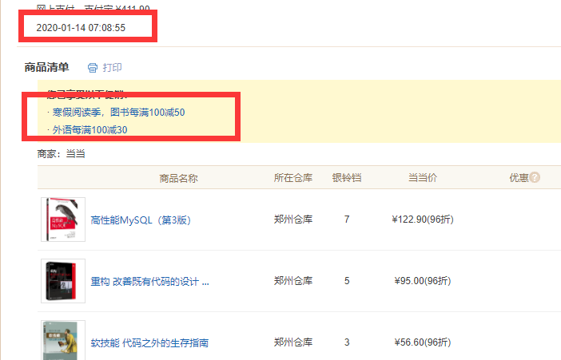

Hồi học thạc sĩ, bàn tôi chất đầy sách...

  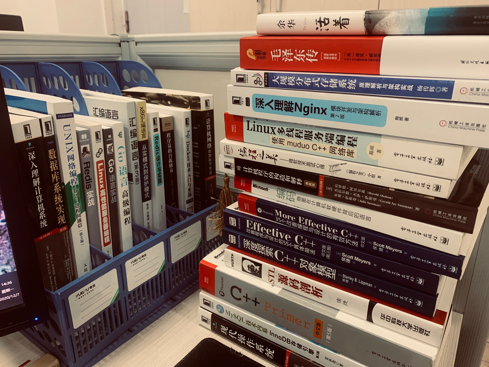

Dưới đây dùng **link sách tự doanh của京东 làm ví dụ**

### Nhập môn

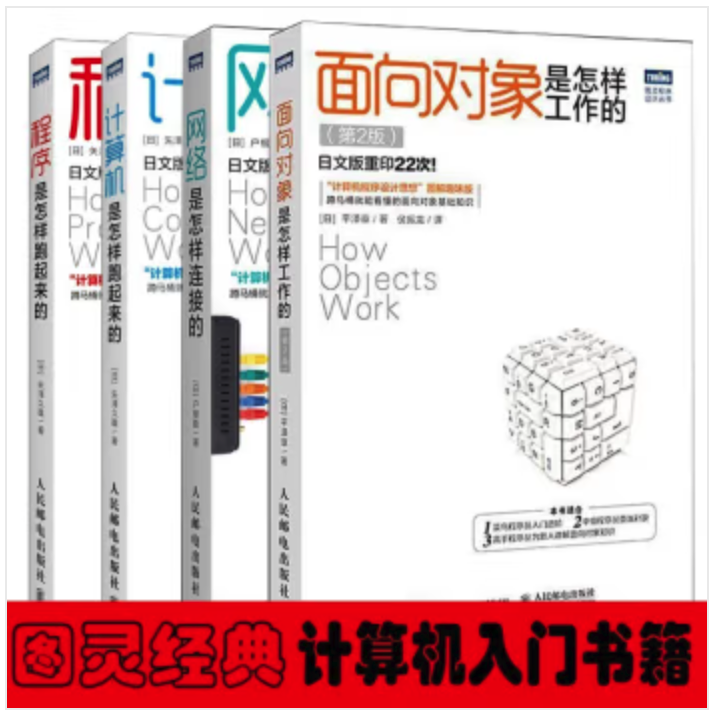

<a href="https://union-click.jd.com/jdc?e=618%7Cpc%7C&p=JF8BANcJK1olXwUFU1xdCE4TBl8IGVwSWwAGU24ZVxNJXF9RXh5UHw0cSgYYXBcIWDoXSQVJQwYAU1lbDk8QHDZNRwYlJhx4IQBYQSp3fDtzEwRAD1wFHQgFXkcbM244GFoVXQ8HU19aD3snA2g4STXN67Da8e9B3OGY1uefK1olXQEEXFddDkMSBGcLE2sSXQ8yXFtUC0wSBGgNdQclbTYBZFldAV8RcS5aD11nbTYCZF1tCEoXC2wIG1oTVQ8eVFxZD0weH28PHVMcXQAKVl5ZAUInAW4JH1IlbQ" target="blank">京东链接</a>

### C++

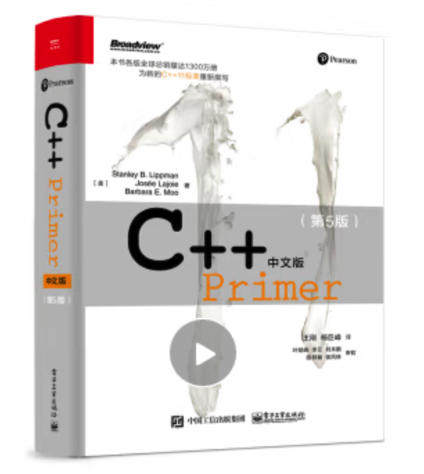

<a href="https://union-click.jd.com/jdc?e=618%7Cpc%7C&p=JF8BANcJK1olXwUFU1xdCE4TBl8IG1kUWgYAXW4ZVxNJXF9RXh5UHw0cSgYYXBcIWDoXSQVJQwYCVl9aCEkeHDZNRwYlDQZ4BhknVUJyVD8NGQAcBGcEJiw0eEcbM244GFoVXQ8HU19aD3snA2g4STXN67Da8e9B3OGY1uefK1olXQEEXFddDk4TBm8AGWsSXQ8yXFtUC0wSBGgNdQclbTYBZFldAV8RcS5aD11nbTYCZF1tCEoXCmYJH1oUWQIeVFtfCUsVH28PHVMcXQAHV1xUCU0nAW4JH1IlbQ" target="blank">京东链接</a>

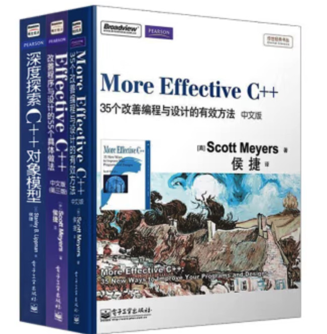

<a href="https://union-click.jd.com/jdc?e=618%7Cpc%7C&p=JF8BANcJK1olXwUFU1xdCE4TBl8IGVwRXwQFV24ZVxNJXF9RXh5UHw0cSgYYXBcIWDoXSQVJQwYAU1pfCkwUHDZNRwYlB21KDzYlcjNyVC9IeFJTC2dfSj41XkcbM244GFoVXQ8HU19aD3snA2g4STXN67Da8e9B3OGY1uefK1olXQEEXFddDk0WAG8MGWsSXQ8yXFtUC0wSBGgNdQclbTYBZFldAV8RcS5aD11nbTYCZF1tCEoXC2wNHF8WWQ8eVFxYAUgXH28PHVMcXQAFUlZYDUgnAW4JH1IlbQ" target="blank">京东链接</a>

<a href="https://union-click.jd.com/jdc?e=618%7Cpc%7C&p=JF8BANcJK1olXwUFU1xdCE4TBl8IG1IWXQECVG4ZVxNJXF9RXh5UHw0cSgYYXBcIWDoXSQVJQwYCXV1dD0sXHDZNRwYlJ3MENBZdYDt3SglgZhpuXX0AND4ITkcbM244GFoVXQ8HU19aD3snA2g4STXN67Da8e9B3OGY1uefK1olXQEEXFddDkIUAWcOGWsSXQ8yXFtUC0wSBGgNdQclbTYBZFldAV8RcS5aD11nbTYCZF1tCEoXCmkLHVkdVAQeVFxdDU4SH28PHVMcXQALVV9bAEonAW4JH1IlbQ" target="blank">京东链接</a>

### Java

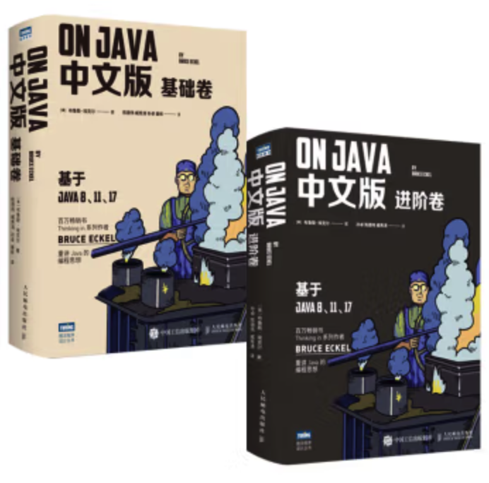

<a href="https://union-click.jd.com/jdc?e=618%7Cpc%7C&p=JF8BANcJK1olXwUFU1xdCE4TBl8IGV4UWwcEUm4ZVxNJXF9RXh5UHw0cSgYYXBcIWDoXSQVJQwYAUV9bCU0RHDZNRwYlC1ZJV1ovfk93Vh17GC1rB3hXHBYEaEcbM244GFoVXQ8HU19aD3snA2g4STXN67Da8e9B3OGY1uefK1olXQEEXFddAUgRC28IGGsSXQ8yXFtUC0wSBGgNdQclbTYBZFldAV8RcS5aD11nbTYCZF1tCEoXC2wIGF4VXwAeVF5cC00SH28PHVMcXQ8BUl9aAE8nAW4JH1IlbQ" target="blank">京东链接</a>

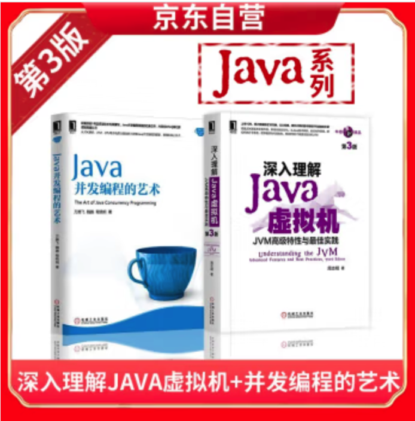

<a href="https://union-click.jd.com/jdc?e=618%7Cpc%7C&p=JF8BANcJK1olXwUFU1xdCE4TBl8IGVsWXgMHXW4ZVxNJXF9RXh5UHw0cSgYYXBcIWDoXSQVJQwYAVF1eDU4eHDZNRwYlJHBEDyU0flF3fmhVSD1wLnNYEAwtXkcbM244GFoVXQ8HU19aD3snA2g4STXN67Da8e9B3OGY1uefK1olXQEEXFddAUsRA2oJEmsSXQ8yXFtUC0wSBGgNdQclbTYBZFldAV8RcS5aD11nbTYCZF1tCEoXCmcMHl0TXgUeVFlZDEgUH28PHVMcXQ8CVl9bCUsnAW4JH1IlbQ" target="blank">京东链接</a>

### Golang

<a href="https://union-click.jd.com/jdc?e=618%7Cpc%7C&p=JF8BANsJK1olXwYEU1dZDE0WBl8IGloXXA4DVVddC08SAF9MRANLAjZbERscSkAJHTdNTwcKBlMdBgABFksWAm0JE1oUVAYBUFteFxJSXzI4QSJiNFNGECc4bA9rCxZ7GgcSPmZrElJROEonAG4IG1IQWgcFU25tCEwnQgEBGFoWWjYDZF5aDkMeA2YPGV4UVAUyU15UOEMSCmwPHlwSWGheZG5tC3sQA2YcHSlUDxIEJm5tCHsUM28JG1ITXwUEVF9eFEsXA2oOGkcVWgAKXV5UD0sfBW4PK1kUXAILZG4" target="blank">京东链接</a>

<a href="https://union-click.jd.com/jdc?e=618%7Cpc%7C&p=JF8BANsJK1olXQUCXVtUD0sSCl8IGloRWQQHXF5dAU0QAl9MRANLAjZbERscSkAJHTdNTwcKBlMdBgABFksWAmsMGV4dXQYLUllcFxJSXzI4QAsXW3AYFRU-Tx9cYRBTTxN1R2BpJFJROEonAG4IG1IQWgcFU25tCEwnQgEAElsRXzYDZF5aDkMeA2YMHF0cWwEyU15UOEMSCmwPHlwSWGheZG5tC3sQA2YcHSlUDxIEJm5tCHsUM28JG1MWWAQDXFhfFEsTBG8JEkcVWgAKXV5UDE8RA2oBK1kUXAILZG4" target="blank">京东链接</a>

### OS & Linux

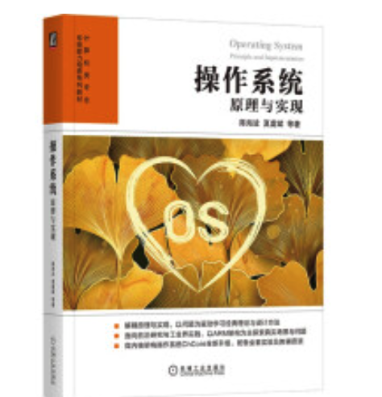

<a href="https://union-click.jd.com/jdc?e=618%7Cpc%7C&p=JF8BANcJK1olXwUFU1xdCE4TBl8IGVwWWQUCUm4ZVxNJXF9RXh5UHw0cSgYYXBcIWDoXSQVJQwYAU11ZC0sRHDZNRwYlFGF0KjtbfR11Q2hUZR1wL39AVD4fTkcbM244GFoVXQ8HU19aD3snA2g4STXN67Da8e9B3OGY1uefK1olXQEEXFdfCUweB24IGGsSXQ8yXFtUC0wSBGgNdQclbTYBZFldAV8RcS5aD11nbTYCZF1tCEoXCmgBH10QXwYeVF9VDUgXH28PHVMcXgQKUVpeCEwnAW4JH1IlbQ" target="blank">京东链接</a>

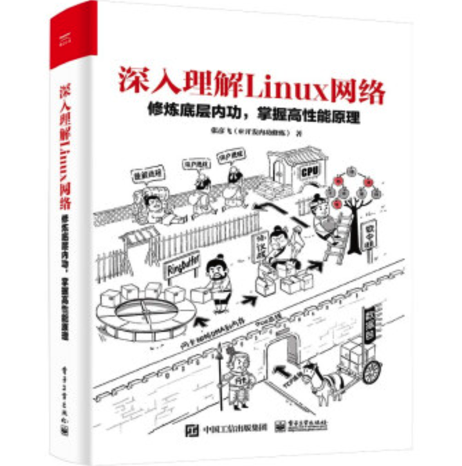

<a href="https://union-click.jd.com/jdc?e=618%7Cpc%7C&p=JF8BANcJK1olXwUFU1xdCE4TBl8IGVwQWQcHUG4ZVxNJXF9RXh5UHw0cSgYYXBcIWDoXSQVJQwYAU1tZCU4THDZNRwYlVXBJDDlcXDZyfwlKE1oQIFZfDjxHeEcbM244GFoVXQ8HU19aD3snA2g4STXN67Da8e9B3OGY1uefK1olXQEEXFdfCUIWBWoLHGsSXQ8yXFtUC0wSBGgNdQclbTYBZFldAV8RcS5aD11nbTYCZF1tCEoXCmYBGVgRWQ4eVF5ZCE0TH28PHVMcXwcEUVldDEwnAW4JH1IlbQ" target="blank">京东链接</a>

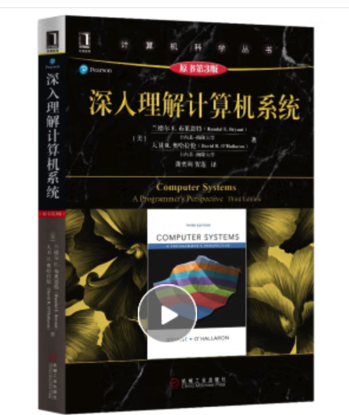

<a href="https://union-click.jd.com/jdc?e=618%7Cpc%7C&p=JF8BANcJK1olXwUFU1xdCE4TBl8IGVwQWQcHUG4ZVxNJXF9RXh5UHw0cSgYYXBcIWDoXSQVJQwYAU1tZCU4THDZNRwYlVXBJDDlcXDZyfwlKE1oQIFZfDjxHeEcbM244GFoVXQ8HU19aD3snA2g4STXN67Da8e9B3OGY1uefK1olXQEEXFdfCUIWBWoLHGsSXQ8yXFtUC0wSBGgNdQclbTYBZFldAV8RcS5aD11nbTYCZF1tCEoXCmYBGVgRWQ4eVF5ZCE0TH28PHVMcXwcEUVldDEwnAW4JH1IlbQ" target="blank">京东链接</a>

### Frontend

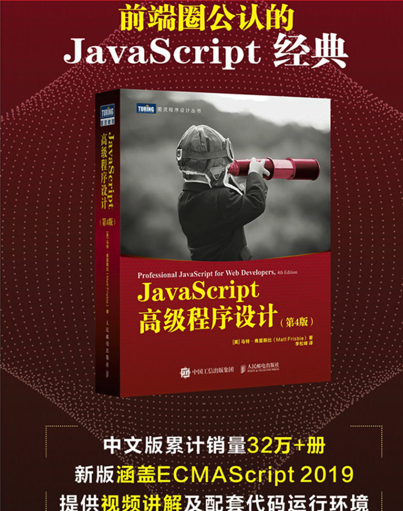

<a href="https://union-click.jd.com/jdc?e=618%7Cpc%7C&p=JF8BANcJK1olXwUFU1xdCE4TBl8IGFMRVAILVW4ZVxNJXF9RXh5UHw0cSgYYXBcIWDoXSQVJQwYBXFpUDEIWHDZNRwYlLQdVMAUFVhByUHVNXgdOAXoEIgU1eEcbM244GFoVXQ8HU19aD3snA2g4STXN67Da8e9B3OGY1uefK1olXQEEXFdfCEsfCmoAE2sSXQ8yXFtUC0wSBGgNdQclbTYBZFldAV8RcS5aD11nbTYCZF1tCEoXC20JGVgVXwQeVF9UAEkUH28PHVMcXwYCXF5VCkMnAW4JH1IlbQ" target="blank">京东链接</a>

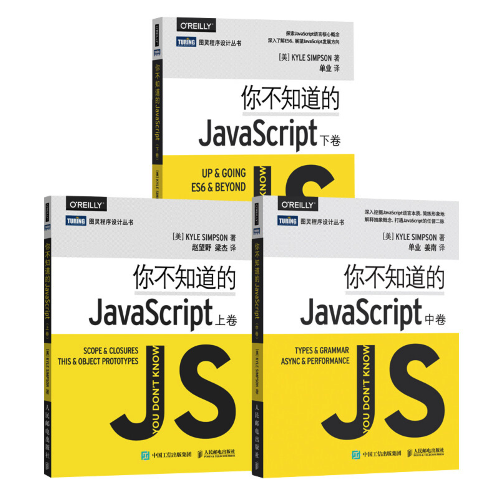

<a href="https://union-click.jd.com/jdc?e=618%7Cpc%7C&p=JF8BANcJK1olXwUFU1xdCE4TBl8IGVwdXAMCVW4ZVxNJXF9RXh5UHw0cSgYYXBcIWDoXSQVJQwYAU1ZcDUsWHDZNRwYlG3ocJyAZYD91BjMSSUUPKW59FgoFXkcbM244GFoVXQ8HU19aD3snA2g4STXN67Da8e9B3OGY1uefK1olXQEEXFdfCEkTAm0MGGsSXQ8yXFtUC0wSBGgNdQclbTYBZFldAV8RcS5aD11nbTYCZF1tCEoXC20JGVgVXwQeVF9UAEkUH28PHVMcXwYCXF5VCkMnAW4JH1IlbQ" target="blank">京东链接</a>

### Algorithm

<a href="https://union-click.jd.com/jdc?e=618%7Cpc%7C&p=JF8BANwJK1olXQYFVF1fD00eC18IGloQWwILUFZcAEIfBV9MRANLAjZbERscSkAJHTdNTwcKBlMdBgABFksWAmoOH1IRVQcKXVZbFxJSXzI4ZAVINVR2Eh4-Sh8RBHVQWCdFWEBJNFJROEonAG4IG1IQWgcFU25tCEwnQgEOHl8cVAAyVW5dD00fCm0IHl0WXQUBZFldAXsfBmYLHF4SWgNsCG5tOEgnBG8BD11nHFQWUixtOEsnAF8IGlsdXwcAV15YDFcXBmcBEloJXQEEXFdfCEkRAWoLH2sXXAcGXW5t" target="blank">京东链接</a>

<a href="https://union-click.jd.com/jdc?e=618%7Cpc%7C&p=JF8BAN4JK1olXgACUVpeDk8RBl8IGloXXA8FXV1ZCUgRAF9MRANLAjZbERscSkAJHTdNTwcKBlMdBgABFksWAm0JElwcXgIDV1heFxJSXzI4RB5zIVxQKVo-DRtlc25NXlNcAW1VAlJROEonAG4IG1IQWgcFU25tCEwnQgEIG1oRXgIBVG5cOEsQBWcBGVsRWgQBU1ptD0seM2cNElgSWAEFUTABOHsnAF8PG1IBW3RDBkpbensnA18LK1sUXQ4BVF9UAUwfH28JH18cVBoCU1hVAUkXB24LGFocbQQDVVpUOHs" target="blank">京东链接</a>

### Database

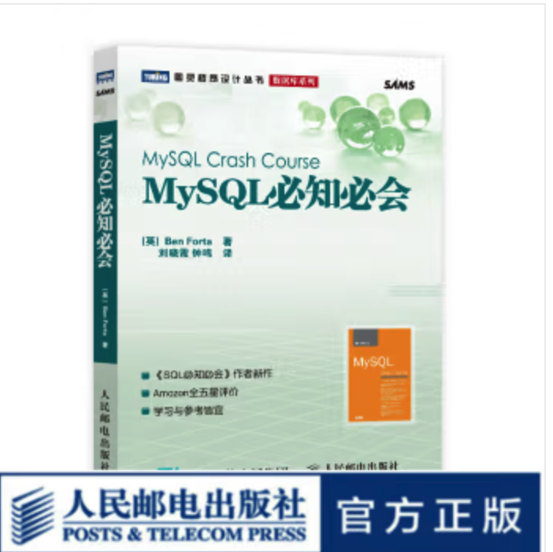

<a href="https://union-click.jd.com/jdc?e=618%7Cpc%7C&p=JF8BANUJK1olXwYEU1dZDE0WBl8PHF4dXgAKUV5UAHtTXDdWRGtMGENDFlVDFhNSVzMXQA4KD1heSllaDUMUBWcNG1IdQl9HCANtVC9LVjZSYSZ2AlpxIigkU1UfBTNpTVcZbQcyV19dCEISBG4PHGslXQEyFTBUC0oUBF8JK1sSWw4LVl5UCEIVBGg4HFscbQ4HXV1aDUwQBgFUK2slXjYFVFdJDjlWUXsOaWslXTYBZF5cCEITC2kPE1kRQQYBUFpYC1cXBGkAElkVWwMKXFtVOEkWAmsBK2s" target="blank">京东链接</a>

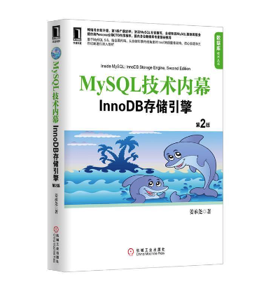

<a href="https://union-click.jd.com/jdc?e=618%7Cpc%7C&p=JF8BANwJK1olXgcAU11cAEsWA18IGloQVAUBUFhbCUseB19MRANLAjZbERscSkAJHTdNTwcKBlMdBgABFksWAmoBGFgRWwADVFdZFxJSXzI4RwBJAA51Kgw_CillSA8BUl1IDQJJElJROEonAG4IG1IQWgcFU25tCEwnQgEIGVgTVAcyVW5dD00fCm0IHVsXWg4AZFldAXsfBmYLHF4SWgNsCG5tOEgnBG8BD11nHFQWUixtOEsnAF8IGlsdXgYCVVddDVcXB2gMHF0JXQEEXFdfCEwTB2YKGWsXXAcGXW5t" target="blank">京东链接</a>

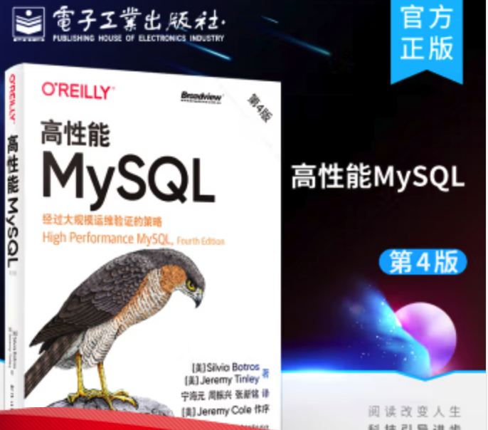

<a href="https://union-click.jd.com/jdc?e=618%7Cpc%7C&p=JF8BANwJK1olXgIDXV9VCEsTBV8IGloSXwMGXF5fCk0WC19MRANLAjZbERscSkAJHTdNTwcKBlMdBgABFksWAmgKHl8dXQQAUl9VFxJSXzI4eysVXnhKJik9aDVxBxZ4fVheHEYHAlJROEonAG4IG1IQWgcFU25tCEwnQgEBG1gUWA8yVW5dD00fCm0IE1sWXQEKZFldAXsfBmYLHF4SWgNsCG5tOEgnBG8BD11nHFQWUixtOEsnAF8IGlscWQ4EU1ZfDFcXAGsMHlgJXQEEXFdfCE0SC2cNE2sXXAcGXW5t" target="blank">京东链接</a>

### Phát triển bản thân

Tôi rất thích cuốn "Sống" (活着) của Dư Hoa, mỗi khi cảm thấy mệt mỏi tôi lại chọn đọc lại cuốn này.

<a href="https://union-click.jd.com/jdc?e=618%7Cpc%7C&p=JF8BAN4JK1olXwULUFlbCEgVAl8IGloRWQMEV1ZfDUIWA19MRANLAjZbERscSkAJHTdNTwcKBlMdBgABFksWAmsMHl0WVQQHXV9dFxJSXzI4Hl9xCERbJhU_Vj1sCmtzeFphAgBmAlJROEonAG4IG1IQWgcFU25tCEwnQgEIG1IQXQcLUG5cOEsQBWcBGVsdWg8LUV1tD0seM2cNElgSWAEFUTABOHsnAF8PG1IBW3RDBkpbensnA18LK1sUXQ4CVVpZCE4RH28IHVscVRoCU1hVAUkXC20JHFkXbQQDVVpUOHs" target="blank">京东链接</a>

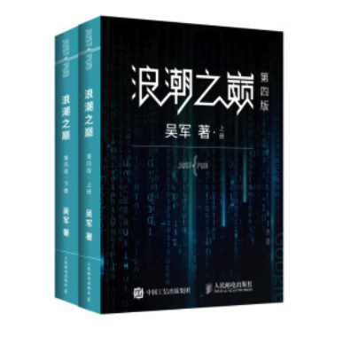

<a href="https://union-click.jd.com/jdc?e=618%7Cpc%7C&p=JF8BANcJK1olXwUFU1xdCE4TBl8IGV4UWwYBUG4ZVxNJXF9RXh5UHw0cSgYYXBcIWDoXSQVJQwYAUV9bCEgTHDZNRwYlWxxUCg4KTRt0f2xXfwNxBk4AKV8feEcbM244GFoVXQ8HU19aD3snA2g4STXN67Da8e9B3OGY1uefK1olXQEEXFdfDEwQBWoAH2sSXQ8yXFtUC0wSBGgNdQclbTYBZFldAV8RcS5aD11nbTYCZF1tCEoXC2wNHl0VWQ4eVF5bAUwWH28PHVMcXwIFVl9bCk0nAW4JH1IlbQ" target="blank">京东链接</a>

<a href="https://union-click.jd.com/jdc?e=618%7Cpc%7C&p=JF8BANoJK1olVQAHXF5fCkMXM28JGl8dXwQAUlZVAUwQMytXQwVKbV9HER8fA1UJWypcR0ROCBlQCgJDCEoWB2cKGVkTVQ4LU1lCUQ5LXl94bCVBI2FBFTwcbjx2RRcBQF9rJHxiWFJtCXsUAm8IEl4SXAEFZG5dD3tWbWsNGlIcbQcyVFlbAEIVB2kPGlgVVDYFVFdtAE4eAGgNHFwQM1oyZG5eOEwXCnsOaRpHSQBwZG5dOEgnA24IElIUVAcBVV5BCEgUAmwPB1sSWw4LVlpbDEoTBGs4GVoUWQ8yZA" target="blank">京东链接</a>

## 三、专栏 không đáng mua

### 1、重学前端 (Học lại Frontend)

Tác giả: 程劭非

**Lý do không推荐**: Quá tạp, quá lộn xộn, đây là cảm nhận trực quan nhất của阿秀 sau khi xem!

Đừng mua专栏 này khi mới bắt đầu làm frontend.专栏 này phù hợp hơn với những người đã có 2-3 năm kinh nghiệm, không phải cho người mới học frontend, đừng tiêu tiền oan ngay từ đầu.

### 2、Vue 开发实战

Tác giả: 唐金州

**Lý do không推荐**: Trước hết nói chất lượng khóa học này ổn, nhưng không đáng tiền! Vì nhiều video miễn phí còn giảng hay hơn专栏 này, như video [giải thích Vuex frontend](/notes/04-experience/01-learn_experience/20210823%20-%20第二期-我学编程全靠B站了，真香.html#_3、前端) tôi xem trên B站 đã tốt hơn cái này. Tôi đã bỏ hơn 100 tệ mua cái này, đúng là tiền oan...

### 3、C++系统实战

**Lý do không推荐**: Thực hành cái gì... Toàn lý thuyết suông, bị lừa rồi. Tiêu đề thì hay, nhưng nội dung chẳng ăn nhập gì, có thể nói là专栏 tệ nhất trong số những专栏 tôi từng mua 🤮..