<h1 align="center">Trại huấn luyện C++</h1>

Chào mọi người, mình là A Tú.

**Mình thường thấy nhiều bạn sinh viên khi chuẩn bị cho kỳ tuyển dụng trường học cảm thấy vô cùng mông lung, không biết phải bắt đầu từ đâu. Khi trò chuyện chi tiết, mình nhận thấy những khó khăn các bạn gặp phải y hệt như những gì mình từng trải qua:**

- Mông lung, không biết phải ôn tập những gì, không biết bắt đầu từ đâu, dẫn đến 2 tháng đầu tiên hiệu suất ôn tập cực kỳ thấp. Mãi về sau mình mới dần mò mẫm ra một lộ trình và phương pháp học tập đúng đắn, quá trình này thực sự đã phải đi đường vòng rất nhiều.
- Thiếu các dự án C++ giá trị cao để đưa vào CV, trong khi các dự án C++ mã nguồn mở chất lượng trên mạng lại khá hiếm, không biết làm sao để gia tăng kinh nghiệm dự án thực chiến.
- Không biết cách viết một bản CV ấn tượng làm nổi bật thế mạnh của bản thân để giúp hồ sơ nổi bật giữa hàng ngàn ứng viên.
- Không tự đánh giá được mức độ thành thạo của bản thân xem đã đạt yêu cầu phỏng vấn hay chưa, không thể tự kiểm chứng trình độ.

Đây thực sự là những vướng mắc kinh điển mà sinh viên sắp ra trường thường xuyên gặp phải!

Không chỉ sinh viên, mà ngay cả những bạn đã đi làm 1-2 năm (Social Recruitment) muốn nhảy việc sang Big Tech cũng gặp những trăn trở tương tự:

- Chưa có trải nghiệm sâu sắc về dự án thực tế: Do vào công ty qua diện tuyển dụng trường học, 2 năm qua chủ yếu làm các công việc bên lề, cảm thấy kỹ thuật không được nâng cao mà chỉ đơn thuần phục vụ nghiệp vụ lặp đi lặp lại.
- Chưa từng có kinh nghiệm phát triển dự án từ 0 đến 1: Sau khi vào công ty chủ yếu là chắp vá code trên dự án có sẵn, thêm biến, thêm vài logic đơn giản, thậm chí chưa từng tự tay thiết kế và triển khai một class hoàn chỉnh từ đầu.
- Mức lương chưa hài lòng, bị mức đãi ngộ của sinh viên mới tốt nghiệp đuổi kịp và vượt qua (hiện tượng đảo ngược lương), cảm thấy bị bạn bè đồng trang lứa bỏ lại phía sau và khao khát tìm kiếm sự bứt phá.

Mình nghĩ: Tại sao không kết hợp cùng các chuyên gia hàng đầu để chia sẻ kinh nghiệm chuẩn bị phỏng vấn Campus và Social Recruitment cho mọi người, đồng thời cùng nhau hoàn thành vài dự án C++ thực chiến từ con số 0 để làm dày dặn kinh nghiệm dự án?

Nghĩ là làm, **chúng mình đã xây dựng Trại huấn luyện nâng cao kỹ thuật**!

Trại huấn luyện đã được chuẩn bị kỹ lưỡng trong gần nửa năm và đến nay đã vận hành được gần 1 năm! Chúng mình đã liên tục đồng hành và giúp đỡ nhiều học viên giành được những offer chất lượng!

Chúng mình đã mài giũa chương trình rất nhiều lần, theo sát quá trình học của các học viên giai đoạn thử nghiệm và nhận được phản hồi vô cùng tích cực, lúc này mới tự tin giới thiệu rộng rãi tới các bạn!

Vâng, chúng mình đã hoàn toàn sẵn sàng!

  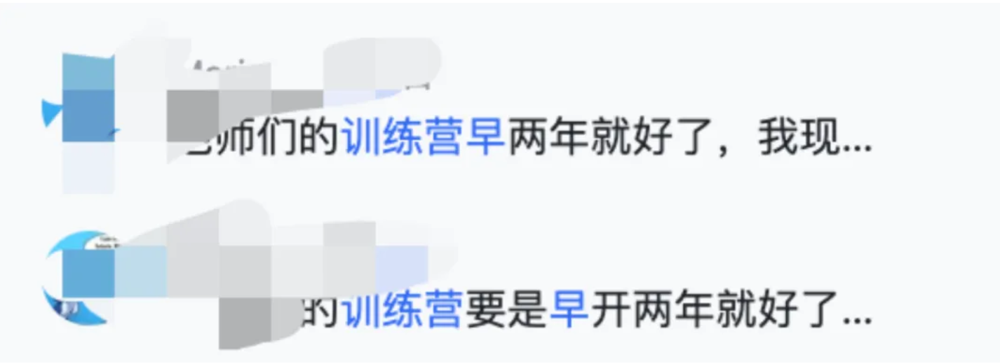
  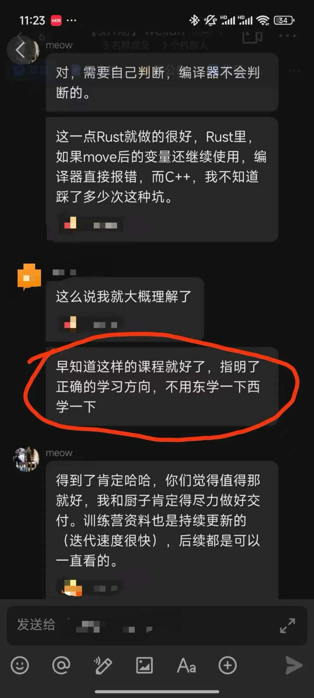

Có thể bạn sẽ thắc mắc: Nhiều công việc như vậy, một mình A Tú có kham nổi không?

Một mình mình chắc chắn không thể đảm đương hết. Vì vậy Trại huấn luyện có sự tham gia của nhiều cộng sự tài năng, **toàn bộ Mentor (Người hướng dẫn) đều đến từ các Big Tech hàng đầu như Tencent, Baidu, ByteDance, RED (Xiaohongshu)...**

Khác với một số trung tâm dùng danh nghĩa Big Tech ảo, A Tú đảm bảo đội ngũ Mentor đều là những người bạn có profile Big Tech thực thụ, dày dạn kinh nghiệm phỏng vấn và phát triển dự án thực tế. Những ai năng lực chuyên môn chưa đạt chuẩn chúng mình đều không hợp tác.

Dưới đây là phần giới thiệu ngắn gọn về một số Mentor:

- **Trình Tự Miêu (程序喵)**: Chuyên gia kỹ thuật C++ cao cấp tại Big Tech, dịch giả các đầu sách chuyên sâu 《Lập trình C++20 nâng cao》, 《Lập trình C++23 nâng cao》.
- **Trình Tự Trù (程序厨)**: Cao thủ gặt hái offer mùa tuyển dụng, cựu Kỹ sư R&D Backend cao cấp tại Tencent, hiện đang khởi nghiệp, tác giả mã nguồn mở sở hữu 10.000+ Stars trên GitHub.
- **Thác Bạt A Tú (拓跋阿秀)**: Cựu Kỹ sư Full-stack tại ByteDance, hiện là Tech Lead tại công ty đa quốc gia (MNC), có kinh nghiệm phát triển đa ngôn ngữ C++, Golang, Node.js...
- **Yellow**: Chuyên gia kỹ thuật Audio/Video tại Big Tech, tinh thông OpenGL, FFmpeg.
- **A Đỗ**: 10 năm kinh nghiệm phát triển C++, từng đảm nhiệm Kỹ sư Backend C++ cao cấp tại các công ty niêm yết và quỹ đầu tư, giảng viên CSDN.
- **Hạo Thiên**: Kỹ sư phát triển C++ cao cấp tại công ty hàng đầu về Audio/Video, nhiều năm kinh nghiệm Qt, FFmpeg, OpenGL.

**Với sự đồng hành của đội ngũ Mentor chất lượng, chất lượng của Trại huấn luyện luôn được bảo chứng tuyệt đối**.

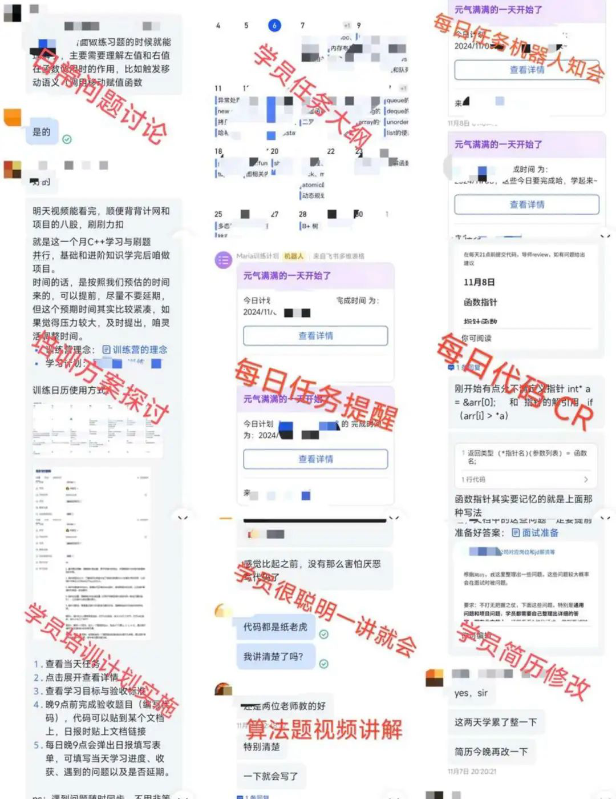

Trại huấn luyện bao gồm các module chính dưới đây, mời các bạn xem kỹ hình ảnh để hiểu rõ và đánh giá xem chương trình có phù hợp với bản thân hay không.

## Danh mục dịch vụ trong Trại huấn luyện

### **1. Kế hoạch học tập cá nhân hóa 1-1**

Mỗi học viên khi tham gia đều được chẩn đoán năng lực phỏng vấn và xây dựng lộ trình học tập "đo ni đóng giày" theo xuất phát điểm và quỹ thời gian, giúp việc học có trọng tâm và đạt hiệu suất cao nhất.

Dưới đây là **Chương trình rèn luyện nâng cao năng lực nền tảng**, cùng lịch trình làm dự án thực chiến và huấn luyện phỏng vấn:

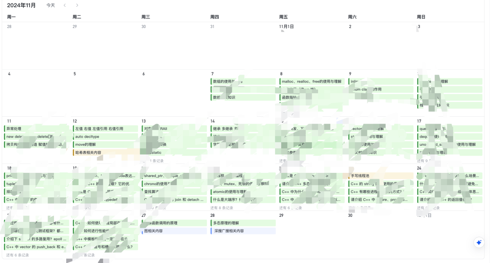

Mục tiêu học tập và tiêu chuẩn nghiệm thu một số nội dung:

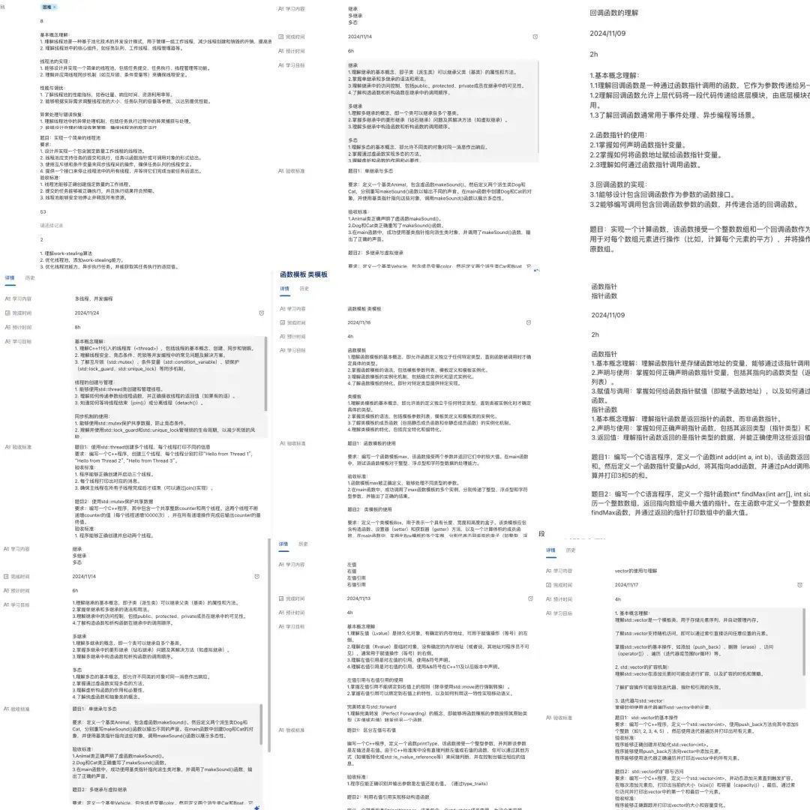

Mục tiêu của giai đoạn này là giúp học viên nắm thật chắc các điểm kiến thức C++, tạo nền móng vững chắc cho phần thực chiến dự án sau đó.

### **2. Code Review hàng ngày**

Nhiều bạn gặp nỗi khổ: **không biết mình đã hiểu đúng bản chất kiến thức chưa, không rõ phong cách viết code (Coding Style) của mình đã chuẩn chưa**, cảm thấy mình hiểu bài nhưng không có cách nào kiểm chứng, trong lòng luôn thiếu tự tin.

Đừng lo, Mentor của Trại huấn luyện sẽ trực tiếp chấm và nhận xét code của bạn mỗi ngày, **dưới góc nhìn của Kỹ sư C++ Big Tech để chỉ ra lỗi sai, đưa ra gợi ý tối ưu, giúp bạn hiểu sâu kiến thức và rèn luyện Coding Convention chuyên nghiệp**.

Khi gặp điểm kiến thức khó hiểu, trao đổi trực tiếp trong nhóm 1-1, Mentor sẽ viết code mẫu minh họa giúp học viên nắm bắt:

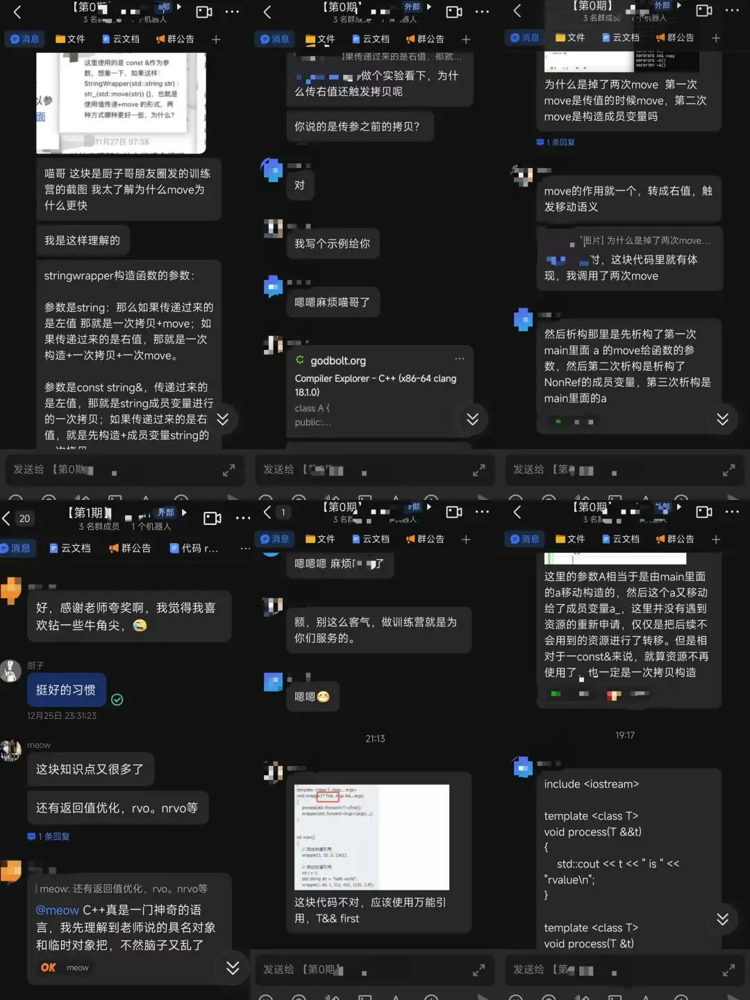

### **3. Nâng cao năng lực kỹ thuật**

Danh mục nội dung đào tạo bao gồm: **Nền tảng máy tính, C++, Linux, Mạng máy tính, Hệ điều hành, Cơ sở dữ liệu, Cấu trúc dữ liệu & Thuật toán**, đi kèm kho tài liệu bài viết và video hướng dẫn chuyên sâu.

Khi gặp vấn đề khó, Mentor sẽ mở cuộc họp giải thích trực tiếp (buổi học được ghi hình lại để học viên xem lại bất cứ lúc nào):

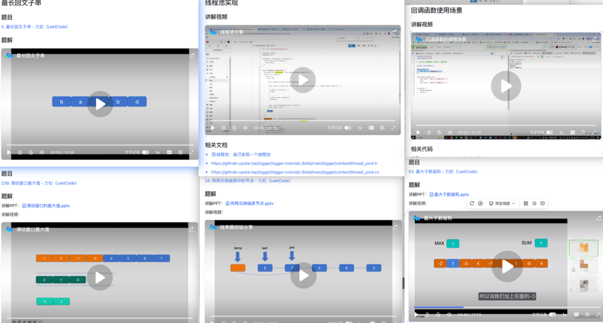

### **4. Thực chiến dự án từ 0 đến 1**

**Mục tiêu ban đầu của Trại huấn luyện là giúp học viên nâng cao năng lực viết code và giải quyết vấn đề thực tế.**

**Nếu các bài tập rèn luyện kỹ năng viết code, thì module này tập trung phát triển từ 0 đến 1, bồi dưỡng toàn diện năng lực làm dự án.**

Sau khi hoàn thành lộ trình cơ bản, Mentor dự án sẽ cầm tay chỉ việc giúp bạn hoàn thành 3 dự án (chọn **2 dự án** từ kho dự án + 1 dự án tặng kèm).

**Qua đó giúp bạn nâng cao năng lực làm dự án, nắm vững toàn bộ quy trình chuyên nghiệp: môi trường phát triển, build script/Makefile/CMake, thiết kế kiến trúc, dựng framework, triển khai code, gỡ lỗi (debug), kiểm thử đơn vị (Unit Test)...**

Quá trình làm dự án ắt sẽ phát sinh nhiều vấn đề, giúp bạn rèn luyện kỹ năng phân tích lỗi, sử dụng thành thạo các công cụ debug nâng cao.

**Mỗi khi gặp vấn đề hóc búa, luôn có Mentor chuyên trách giải đáp thắc mắc và đưa ra giải pháp cụ thể.**

Các dự án trong kho dự án đều do đội ngũ Mentor dày công xây dựng: có source code hoàn chỉnh, chú thích rõ ràng, tài liệu hướng dẫn và video chi tiết, kèm giải đáp 1-1 nên bạn hoàn toàn không lo không theo kịp.

| Tên dự án | Giới thiệu | Đối tượng | Điểm kiến thức chính |
| :--- | :--- | :--- | :--- |
| **High-Performance Logging Library (Thư viện ghi log hiệu năng cao)** | Thư viện log độ trễ thấp, tiêu tốn ít tài nguyên, an toàn, tin cậy và dễ mở rộng, đáp ứng môi trường production | Học viên Campus & Social | `mmap`, cơ chế defer, Concurrent Programming, nén dữ liệu, mã hóa dữ liệu, tuần tự hóa protobuf, effective formatter, effective sink |
| **Custom RPC Framework (Tự xây dựng RPC từ 0 đến 1)** | Framework giao tiếp RPC hiệu quả, tin cậy và dễ sử dụng | Học viên Campus | Concurrent Programming, zstd, zlib, mã hóa dữ liệu, tuần tự hóa protobuf/json, định nghĩa giao thức truyền thông, Network Programming, Load Balancing, Service Registration |
| **AI Audio/Video Effects Player (Trình phát Audio/Video hiệu ứng AI)** | Dự án xử lý âm thanh & hình ảnh | Học viên Campus & Social | Giải mã Audio/Video, OpenGL, phát media, render hình ảnh lên màn hình, nhận diện khuôn mặt & hiệu ứng sticker, mã hóa video, tối ưu hiệu năng |
| **Custom STL (Tự cài đặt thư viện STL từ 0 đến 1)** | Tự tay hiện thực hóa STL | Học viên Campus | allocator, SFINAE, `type_traits`, iterator, `vector`, `string`, `deque`, `queue`, `stack`, `array`, `pair`, `tuple`, `optional`, `list`, `hash_table`, `unordered_multimap`, `unordered_multiset`, `priority_queue`, tree, `map`, `set`, `unique_ptr`, `shared_ptr`, chrono, mutex, RAII lock, thread |
| **Feishu/Lark Bot (Bot thông minh Feishu)** | Bot thông minh nhắc nhở và giám sát học tập | Học viên Campus | MySQL, Redis, HttpServer, HttpClient, Broadcast, spdlog |
| **Embedded Audio/Video Streaming (Đẩy luồng Audio/Video nhúng)** | Dự án đẩy luồng Audio/Video trên thiết bị nhúng | Học viên Campus & Social | H.264, H.265, SRT, FFmpeg, đẩy luồng RV1126, giải mã RV1126, đa luồng bitstream RV1126, chụp ảnh |

Tài liệu hướng dẫn mẫu của 3 dự án:

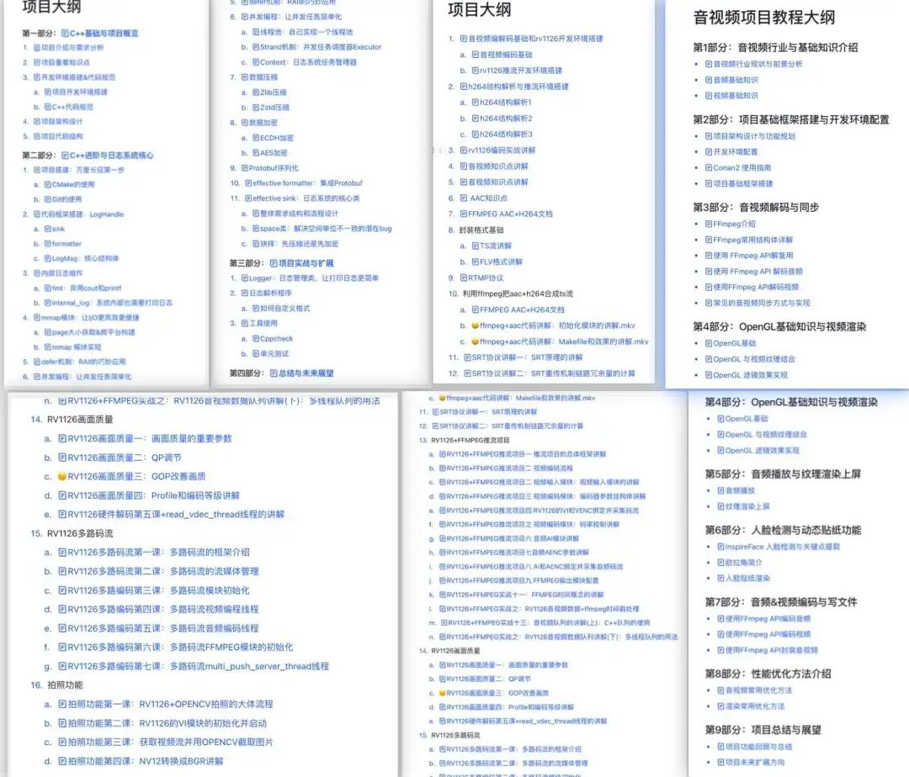

Ngoài ra, đội ngũ Mentor đang phát triển thêm một dự án mới gồm 4 module độc lập do 3 Mentor cùng phát triển. Mỗi module riêng lẻ đều đủ giá trị để đưa vào CV!

### **5. Chỉnh sửa và tối ưu hóa CV**

Trại huấn luyện cung cấp dịch vụ hướng dẫn viết CV, tối ưu hóa câu chữ và kênh nộp hồ sơ, giúp CV của bạn không còn sơ sài, sáo rỗng.

Mentor đứng từ góc nhìn của Interviewer Big Tech để đưa ra những đề xuất cải thiện chuyên nghiệp nhất.

### **6. Giải mã chi tiết câu hỏi phỏng vấn thực tế**

Bao gồm kỹ năng phỏng vấn, hàng ngàn câu hỏi phỏng vấn thực chiến có lời giải chi tiết, nhật ký phân tích sau phỏng vấn:

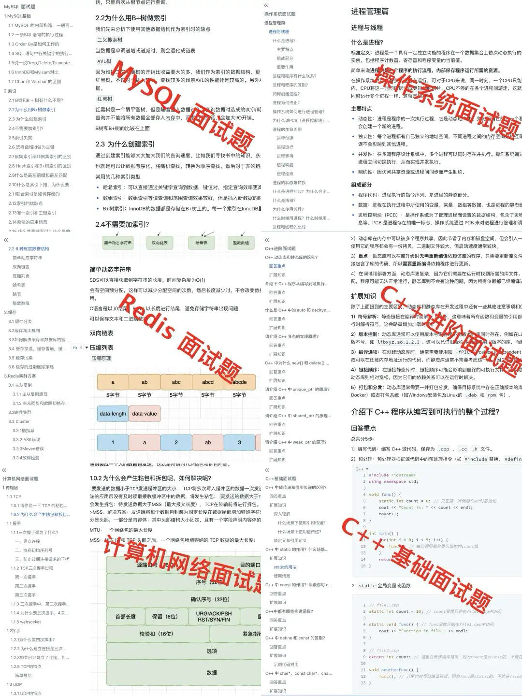

Toàn bộ câu hỏi đều được thu thập từ các buổi phỏng vấn thực tế tại các Big Tech Internet, kèm đáp án chuẩn xác giúp học viên hình dung rõ nét độ khó thực tế.

### **7. Review tiến độ hàng tuần (Bắt buộc)**

Mỗi tuần đều có một buổi tổng kết tiến độ học tập.

**Đây là quy định bắt buộc!**

**Trại huấn luyện kiểm soát tiến độ rất chặt chẽ, luôn có người đốc thúc bạn học tập, không phù hợp cho những ai học theo kiểu "bữa đực bữa cái", mong các bạn thông cảm!**

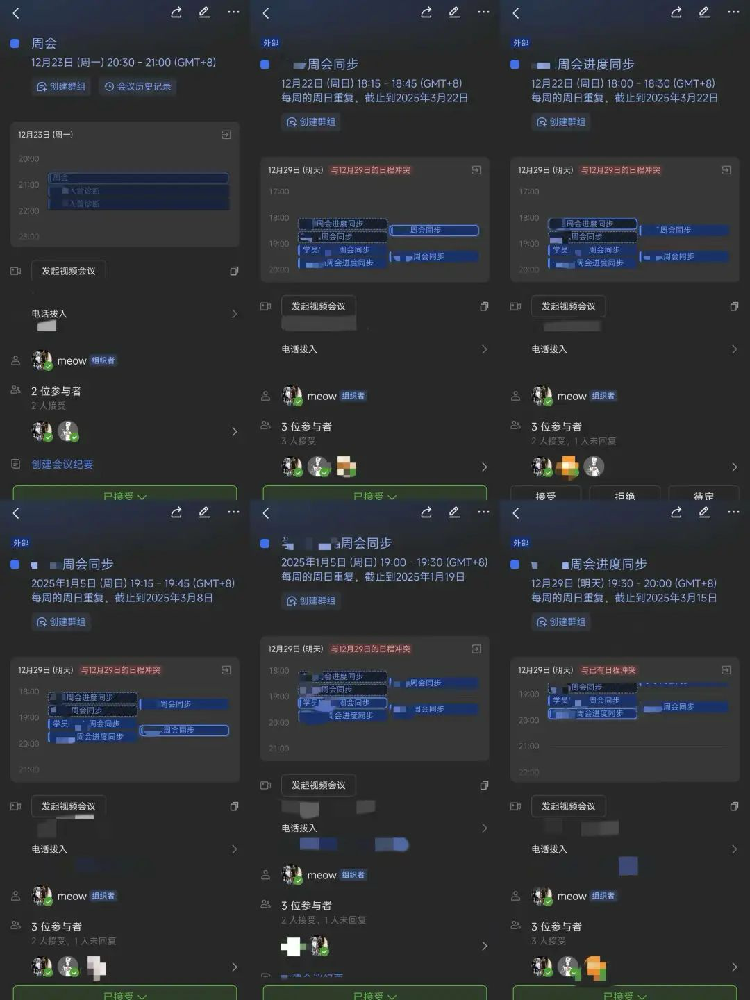

### **8. Đối tượng phù hợp**

**Đối tượng mục tiêu:**
- Sinh viên chuẩn bị cho kỳ tuyển dụng Mùa xuân & Mùa thu (cả đúng chuyên ngành lẫn trái ngành).
- Lập trình viên C++ dưới 3 năm kinh nghiệm muốn nhảy việc sang Big Tech.
- Nhân sự trong ngành CNTT (như Test Development, DevOps/SRE...) muốn chuyển hướng sang làm Kỹ sư Phát triển (R&D).

**Các vấn đề giải quyết:**
- Mông lung chưa biết nên ôn tập những gì, bắt đầu từ đâu.
- Chưa nắm rõ trọng tâm phỏng vấn, hiệu suất ôn tập thấp.
- Thiếu kinh nghiệm dự án thực chiến giá trị cao.
- Muốn nâng cao năng lực code và kỹ năng xử lý bài toán thực tế.
- Gặp khó khăn khi giải thuật toán, thiếu tư duy giải đề và template mẫu.
- Thiếu tính tự giác, khó tập trung tự học một mình.
- Cần cơ hội giới thiệu nội bộ (Referral) vào các Big Tech.
- Cần bạn đồng hành và người dẫn đường giàu kinh nghiệm.

**Không phù hợp với:**
- Người thiếu kiên nhẫn, muốn đốt cháy giai đoạn, "học cấp tốc thành tài".
- Người có tư duy logic quá yếu nhưng lại lười suy nghĩ, không chịu nỗ lực.
- Người học theo kiểu đối phó "bữa đực bữa cái".

Chúng mình đã từ chối khá nhiều hồ sơ không phù hợp sau khi Mentor đánh giá xuất phát điểm:

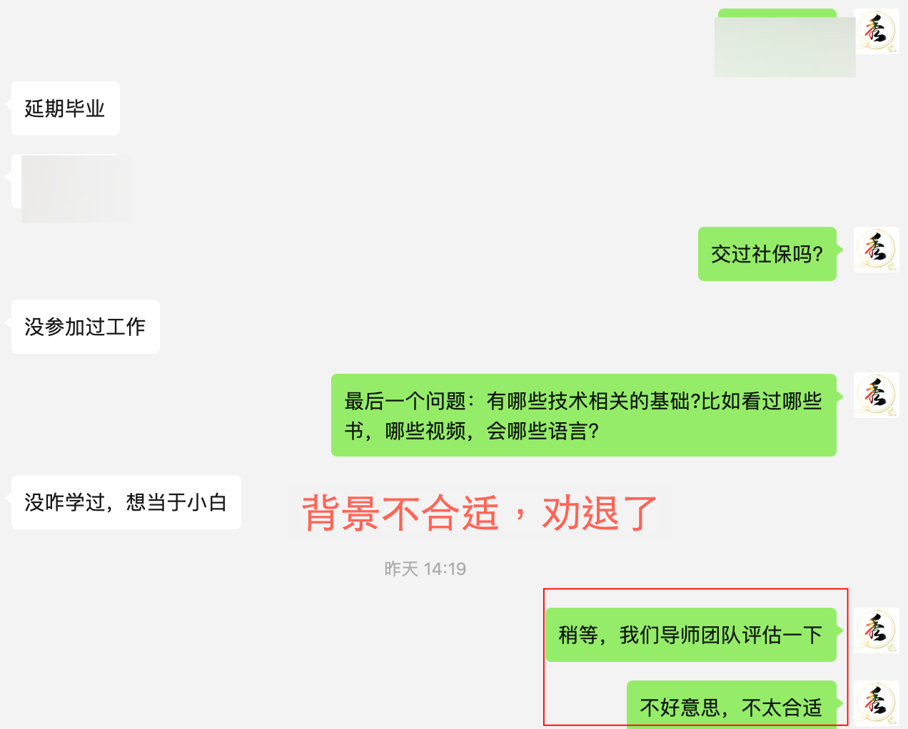

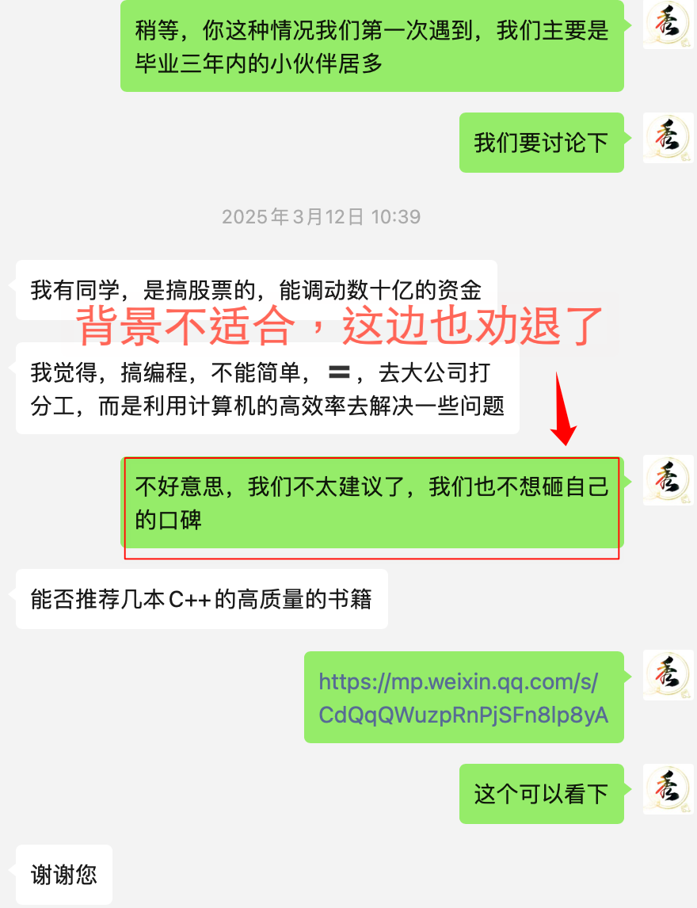

---

### Hành trình của một học viên tiêu biểu

**Xuất phát điểm:**
Thạc sĩ trường 211, đã đi làm 2 năm, học trái ngành, công việc chủ yếu là xử lý sự cố hỗ trợ, kinh nghiệm phát triển thực tế rất ít, chưa từng học sâu C++. Kỳ thi tuyển dụng trước đây chủ yếu học thuộc lòng Bát cổ văn để đỗ việc, thiếu kinh nghiệm dự án, nhưng có năng lực học hỏi tốt (thủ khoa khóa học).

**Đánh giá đầu vào:**
Chẩn đoán năng lực khi mới vào trại:

  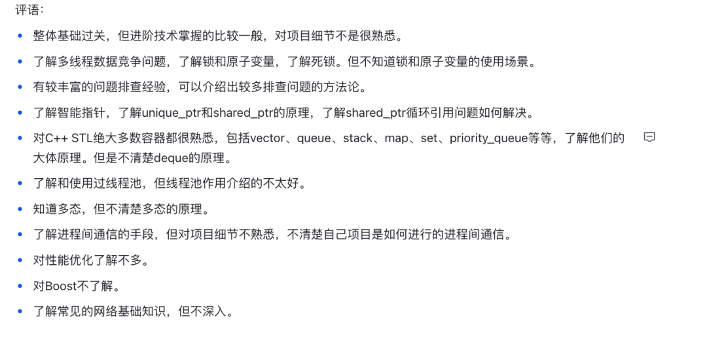

Sau khi nắm rõ tình hình, Mentor đã thiết kế lộ trình riêng phù hợp với quỹ thời gian biểu của bạn:

  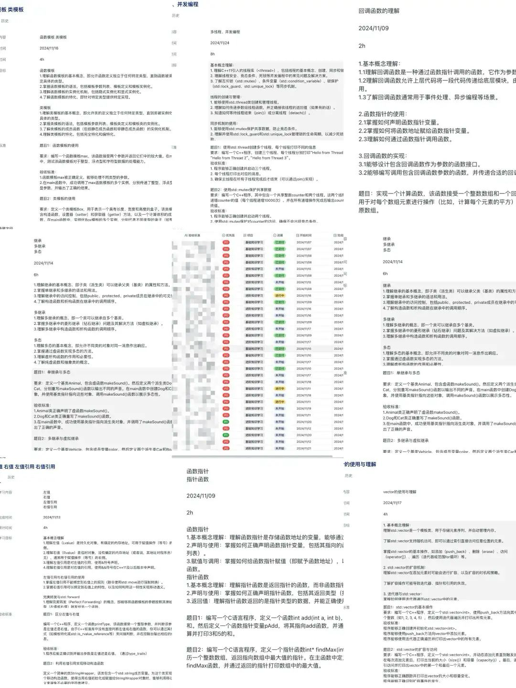

**Quá trình Code Review:**
Hàng ngày hoàn thành bài tập, nộp lên hệ thống và được Mentor chấm chữa tỉ mỉ:

  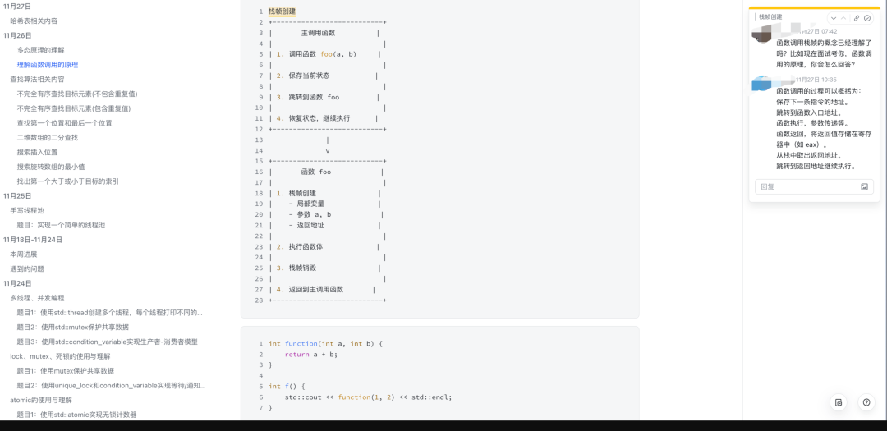
  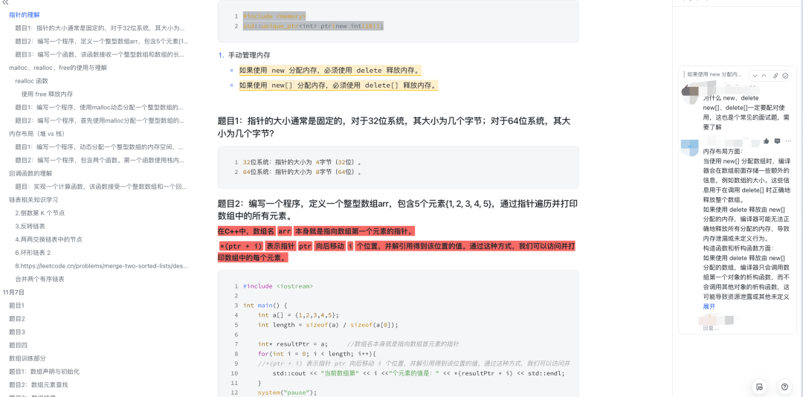

**Kết quả tốt nghiệp:**
Học viên đã xuất sắc nhận được nhiều offer với mức đãi ngộ hấp dẫn. Nhờ nỗ lực không ngừng và sự đồng hành sát sao của Mentor, bạn ấy đã bù đắp được khoảng trống trái ngành và chạm tay tới mục tiêu!

  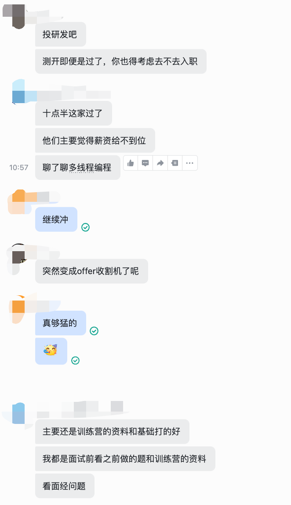

Trại huấn luyện được xây dựng bằng tất cả tâm huyết và sự chỉn chu. Để biết thêm thông tin chi tiết, bạn có thể liên hệ trực tiếp với A Tú.

  
   

     Vui lòng ghi chú "<strong>Trại huấn luyện C++</strong>" khi kết bạn.
  

**Lời nhắc cuối cùng: Nếu bạn học theo kiểu "bữa đực bữa cái", xin vui lòng đừng làm lãng phí thời gian của đôi bên!**
