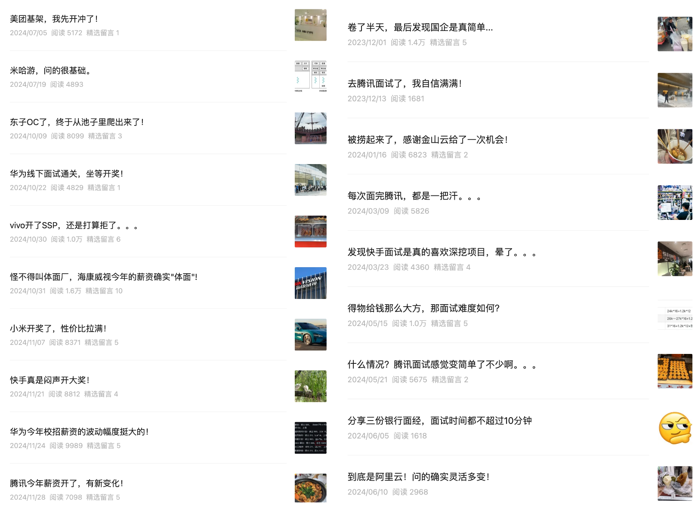
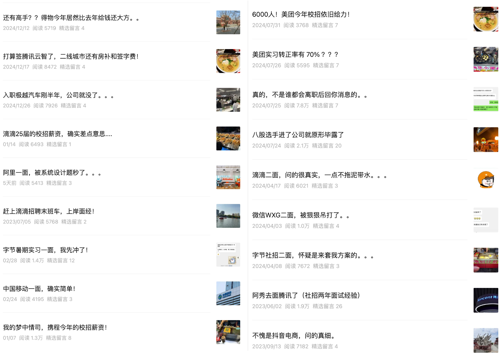

Chào mọi người, mình là A Tú.

Từ năm 2021 đến nay, A Tú đã liên tục tổng hợp và chia sẻ không dưới 100 bài viết về kinh nghiệm phỏng vấn và tìm việc. Nay mình chọn lọc những bài viết tiêu biểu và chất lượng nhất để hệ thống hóa thành hai chuỗi chuyên đề: **「Kinh nghiệm phỏng vấn Big Tech thực chiến」** và **「Góc nhìn người phỏng vấn」**. Trong đó, chuỗi kinh nghiệm phỏng vấn chủ yếu do các bạn học viên và độc giả gửi về đóng góp, còn chuỗi góc nhìn người phỏng vấn tập trung chia sẻ những vấn đề kinh điển thường xuất hiện trong phòng phỏng vấn.

Cần lưu ý thêm: Dù mang tên "Mặt kinh Big Tech", nhưng nội dung không chỉ giới hạn ở các tập đoàn Big Tech mà còn bao quát cả các doanh nghiệp vừa và nhỏ, ngân hàng, doanh nghiệp nhà nước (SOE), hãng điện thoại, phần cứng, xe năng lượng mới (EV)...

*(Lưu ý: Thuật ngữ "Thông phần / Phần mềm chung" (通软) trong bài viết đại diện cho vị trí Phát triển phần mềm nói chung (General Software Development), không yêu cầu cố định một ngôn ngữ lập trình cụ thể).*

  
  
  

## Chuỗi kinh nghiệm phỏng vấn Big Tech thực chiến

### Big Tech (Đại xưởng)

- [Tencent Golang (Social) + 2 năm sau A Tú đi phỏng vấn Tencent (Kinh nghiệm phỏng vấn 2 năm kinh nghiệm)](https://mp.weixin.qq.com/s/UyiaWuQzmL6es-s6Ob_tCQ)
- [ByteDance E-commerce (Social) + Phỏng vấn vòng 2 ByteDance, nghi ngờ vào lấy giải pháp kiến trúc...](https://mp.weixin.qq.com/s?__biz=Mzk0ODU4MzEzMw==&mid=2247515955&idx=1&sn=05324b9d690317f80b0b2b117c07386b&chksm=c3679081f4101997a0d302fe678db9a96fffc7e40bcf3ec37419348a8b242aa176f69246c90b&scene=178&cur_album_id=3240469374491459584#rd)
- [ByteDance Thực tập hè C++ + Phỏng vấn vòng 1 thực tập hè ByteDance, xông lên trước!](https://mp.weixin.qq.com/s?__biz=Mzk0ODU4MzEzMw==&mid=2247521575&idx=1&sn=1ba534fadba3cf1c294312a1d2aa54e8&chksm=c367ba95f410338331e5eb1411747d0ba3e804901c969349691383ee095a60be8c264e684214&scene=178&cur_album_id=3240469374491459584#rd)
- [Didi C++/Golang Developer + Kịp chuyến tàu muộn tuyển dụng Didi, kinh nghiệm hạ cánh an toàn!](https://mp.weixin.qq.com/s?__biz=Mzk0ODU4MzEzMw==&mid=2247512149&idx=1&sn=7258af18551626f4f0e0680313bbf9f3&chksm=c3679fe7f41016f146a52d42e87656222cf63ba224709daa8753529002015aead5e7a96c5e99&scene=178&cur_album_id=3240469374491459584#rd)
- [ByteDance Douyin E-commerce C++/Golang + Douyin E-commerce, offer đợt sớm (Early Bird)!](https://mp.weixin.qq.com/s?__biz=Mzk0ODU4MzEzMw==&mid=2247512189&idx=1&sn=8e128be61b1c7e4cc27beecf8771181f&source=41#wechat_redirect)
- [ByteDance Douyin E-commerce + Đúng là Douyin E-commerce, hỏi thực sự rất chi tiết.](https://mp.weixin.qq.com/s?__biz=Mzk0ODU4MzEzMw==&mid=2247512202&idx=1&sn=2de3af09c9497515c01e49e2eac9f68e&chksm=c3679f38f410162e0f45c0e9775b0b0cee15fde64a18fd4ac64f6cdb959cdfdb531ed4f9440d&scene=178&cur_album_id=3240469374491459584#rd)
- [Alibaba Thực tập hè + Phỏng vấn vòng 1 Alibaba, bị câu hỏi System Design hạ gục...](https://mp.weixin.qq.com/s?__biz=Mzk0ODU4MzEzMw==&mid=2247521707&idx=1&sn=da92c5da8029d218126fb18049755420&chksm=c367ba19f410330fcf7cf0a10d0281ed53dd5fe93ca4f04140f59160e3e1e2a186cc131b990c&scene=178&cur_album_id=3240469374491459584#rd)
- [WeChat WXG C++/Golang + Phỏng vấn vòng 2 WeChat WXG, bị xoáy tơi bời...](https://mp.weixin.qq.com/s?__biz=Mzk0ODU4MzEzMw==&mid=2247515840&idx=1&sn=b20988be9eba0b742f645e91a6824a09&chksm=c3679172f4101864811c7201549fcb6f0ed0589e2f722ca73b3ae323349f587c146911fca1ce&scene=178&cur_album_id=3240469374491459584#rd)
- [Baidu Đợt sớm Vòng 1 + Dân chuyên học tủ Bát cổ văn vào công ty là lộ nguyên hình](https://mp.weixin.qq.com/s?__biz=Mzk0ODU4MzEzMw==&mid=2247518058&idx=1&sn=836e5a817c91b1e7e4fe9fda4849fe88&chksm=c367a8d8f41021cee12f4c97649b76848e1f4d8ae7209aa4ca9c0eb27ac2b76c091af65dd88c&scene=178&cur_album_id=3240469374491459584#rd)
- [Meituan C++ Developer + 6.000 người! Tuyển dụng trường học Meituan năm nay vẫn rất mạnh tay!](https://mp.weixin.qq.com/s?__biz=Mzk0ODU4MzEzMw==&mid=2247518231&idx=1&sn=c9db84222305dc99602eeaaf0243fe55&chksm=c367a7a5f4102eb31e9401d65898a92de0f79a220894d99780b539be1ab54024474f564c9ac0&scene=178&cur_album_id=3240469374491459584#rd)
- [ByteDance Golang + ByteDance cuối cùng cũng công bố offer, tiếc là đãi ngộ hơi thấp một chút...](https://mp.weixin.qq.com/s?__biz=Mzk0ODU4MzEzMw==&mid=2247520279&idx=1&sn=aff0774eb1dc80d31caf08228be3b5a2&chksm=c367bfa5f41036b305d980afd162f672d815fd0beae4dfc521aaf7ccf58aa056ac1b6a66c465&scene=178&cur_album_id=3240469374491459584#rd)
- [Didi Phần mềm chung + Phỏng vấn vòng 2 Didi, câu hỏi rất thực tế và đi thẳng vào vấn đề...](https://mp.weixin.qq.com/s?__biz=Mzk0ODU4MzEzMw==&mid=2247516211&idx=1&sn=817f1453e12e917110e708a768466394&chksm=c367af81f4102697ab2cf18ae2e9b1ba5c595c0c3f98f0521a8fde79f0fca49af701ad0d8545&scene=178&cur_album_id=3240469374491459584#rd)
- [Meituan C++ + Đã liên tiếp 4 năm, năm nay Meituan lại là Big Tech đầu tiên công bố kết quả offer!](https://mp.weixin.qq.com/s?__biz=Mzk0ODU4MzEzMw==&mid=2247520102&idx=1&sn=19983ae223e5eb7933e3c882cd8ef392&chksm=c367a0d4f41029c24860d61059b5d11a3cf0c4b03d109f91e10caaba03976f85e58912181553&scene=178&cur_album_id=3240469374491459584&poc_token=HJrJ3mejl8ldAzOlKvyvSfLELDnAGQhnlj_8Q33p)
- [Baidu Đợt sớm Vòng 2 + Thực sự không phải ai sau khi nghỉ việc cũng trả lời tin nhắn của bạn...](https://mp.weixin.qq.com/s?__biz=Mzk0ODU4MzEzMw==&mid=2247518133&idx=1&sn=77de546715823690e9952213c6a1c51b&chksm=c367a807f4102111ca484b78720020d99d2f2e80a33f2caefbb9f5fa0b9cd177aeb7bc6076f4&scene=178&cur_album_id=3240469374491459584#rd)
- [Didi Vòng 1 & 2 + Mức đãi ngộ tuyển dụng khóa 25 của Didi thực sự hơi thiếu hấp dẫn...](https://mp.weixin.qq.com/s?__biz=Mzk0ODU4MzEzMw==&mid=2247521192&idx=1&sn=d759e602a48a797708f35d722379da15&chksm=c367bc1af410350cd8e1ac1ae61bbffc245dd8d502d69000ed6fc6555dcbc02619d3152acaf1&scene=178&cur_album_id=3240469374491459584#rd)
- [Tencent Java Backend + Đi phỏng vấn Tencent, tràn đầy tự tin!](https://mp.weixin.qq.com/s/NZ8tQN-MaBOY7waRiMLyBg)
- [JD Vòng 1 + JD gọi offer (OC), cuối cùng cũng ngoi lên khỏi bể ứng viên!](https://mp.weixin.qq.com/s/H7i9xnW3LG05rpqvQEL7Aw)
- [Alibaba Cloud C++ + Đúng là Alibaba Cloud! Câu hỏi thực sự linh hoạt và biến hóa!](https://mp.weixin.qq.com/s/T_gwKZb48c6TpSb6wgoIRA)
- [Meituan C++ + Bộ phận Kiến trúc Hạ tầng Meituan, sẵn sàng xông pha!](https://mp.weixin.qq.com/s/f3o85XeoreEIfcA2X-cyTg)
- [Tencent Java Developer + Tencent năm nay công bố mức lương, có nhiều điểm mới!](https://mp.weixin.qq.com/s?__biz=Mzk0ODU4MzEzMw==&mid=2247520550&idx=1&sn=b368bc11f3987c12c93e6a580e36f9f3&chksm=c367be94f410378260e9abffc80198f5867d9293cf7b8079e80f78087e7b4cceee1f1b294644&scene=178&cur_album_id=3240469374491459584#rd)
- [Kuaishou Java Developer + Kuaishou âm thầm tung đãi ngộ cực khủng!](https://mp.weixin.qq.com/s?__biz=Mzk0ODU4MzEzMw==&mid=2247520424&idx=1&sn=29283ecc7f5c1e8a9bfa7985306563a4&chksm=c367bf1af410360c84be31da736a72b98be2d5be37fb4609d48229083d3a132e06d1eef5eab6&scene=178&cur_album_id=3240469374491459584#rd)
- [Tencent Java Backend + Mỗi lần phỏng vấn Tencent xong đều toát mồ hôi hột...](https://mp.weixin.qq.com/s/fuz5DZUfnzZMPRTTW55d5Q)
- [Kuaishou Java Backend + Nhận ra Kuaishou cực kỳ thích xoáy sâu vào dự án, choáng váng...](https://mp.weixin.qq.com/s/tlo2kB-M914NqXsG7OS8aA)
- [Tencent Java Developer + Chuyện gì thế này? Phỏng vấn Tencent có vẻ dễ thở hơn nhiều...](https://mp.weixin.qq.com/s/VB5YpC0ZWewQR8edtpOSsQ)
- [Tencent Cloud & Smart Industries (CSIG) + Định ký Tencent CSIG, thành phố tuyến 2 lại có phụ cấp nhà ở và Signing Bonus!](https://mp.weixin.qq.com/s?__biz=Mzk0ODU4MzEzMw==&mid=2247520816&idx=1&sn=6f0fbd5a0c6034112a9cb4a8e003f278&chksm=c367bd82f4103494c4aa765590e534233ea3ff450937214f99b6f841e142d142bbfac7c35a81&scene=178&cur_album_id=3240469374491459584#rd)
- [Meituan Software Developer + Tỷ lệ thực tập chuyển chính thức tại Meituan lên tới 70%???](https://mp.weixin.qq.com/s?__biz=Mzk0ODU4MzEzMw==&mid=2247518151&idx=1&sn=267f72f0f0eb30b14d5e6133d4cf1085&chksm=c367a875f41021638076342a0da9ce94f763d5b3adb0ee6818d98fd50a4ed54c8df098b2f178&scene=178&cur_album_id=3240469374491459584#rd)
- [Thật bất ngờ, vốn hóa của Baidu hiện tại thậm chí còn thấp hơn Tencent Music...](https://mp.weixin.qq.com/s?__biz=Mzk0ODU4MzEzMw==&mid=2247522371&idx=1&sn=4616f0dcbf49f2244154a421b0bff402&chksm=c367b7f1f4103ee78f7f349c65ca37d456bfb433ba06150f1f11b16b526784ee0f9007048f50&scene=178&cur_album_id=3240469374491459584&search_click_id=#rd)
- [JD Java Developer + Lần này phải gọi anh Đông rồi, tăng lương toàn diện 30%](https://mp.weixin.qq.com/s?__biz=Mzk0ODU4MzEzMw==&mid=2247521994&idx=1&sn=81bb9356e20e03dc9c8f67b753eb6392&chksm=c367b978f410306edcbd46664fb1525b91c67daaa81070425658c0fe623e7dc83b3f8b9f647e&scene=178&cur_album_id=3240469374491459584&search_click_id=#rd)
- [Momenta C++ Developer + Cảm nhận thực tế mùa tuyển dụng Kim Tam Ngân Tứ...](https://mp.weixin.qq.com/s?__biz=Mzk0ODU4MzEzMw==&mid=2247521816&idx=1&sn=20a3f14c905b6c5ec94eee172dc1a822&chksm=c367b9aaf41030bcd7ab6c3c1f2620efd02d9db2c1ccc4f9da680e9c0b8984b98cff273438cd&scene=178&cur_album_id=3240469374491459584&search_click_id=#rd)
- [JD Java Developer + Phỏng vấn vòng 1 JD Food Delivery, đã trượt...](https://mp.weixin.qq.com/s?__biz=Mzk0ODU4MzEzMw==&mid=2247522068&idx=1&sn=209f107c087baeb14818e5af624686c2&chksm=c367b8a6f41031b0b8e07f351c161d423eda56603ec55d628e272ab25fd5a8ba8af6c28130e6&scene=178&cur_album_id=3240469374491459584&search_click_id=#rd)
- [JD Phỏng vấn vòng 2 (Social) + Phỏng vấn vòng 2 JD Food Delivery, tổng thu nhập tăng tối thiểu 30%!?](https://mp.weixin.qq.com/s?__biz=Mzk0ODU4MzEzMw==&mid=2247522146&idx=1&sn=d13a2467058d77bf05eaee9b2cadb268&chksm=c367b8d0f41031c6755a81813f1ca80cf1a65d59f491636ac167ac58cc9d0dceea9144e45923&scene=178&cur_album_id=3240469374491459584&search_click_id=#rd)
- [Tencent Infrastructure C++ + Tencent khởi động kế hoạch tuyển dụng lớn nhất lịch sử!?](https://mp.weixin.qq.com/s?__biz=Mzk0ODU4MzEzMw==&mid=2247522012&idx=1&sn=61a387f48b8d28a25f628b081bab46df&chksm=c367b96ef41030789c60e2044a12fbe282991e67a025017700ddd203a21178736a69eaaa6019&scene=178&cur_album_id=3240469374491459584&search_click_id=#rd)

### Doanh nghiệp vừa và nhỏ

- [Momenta C++ Developer + Cảm nhận thực tế mùa Kim Tam Ngân Tứ (Vòng 1 Momenta)...](https://mp.weixin.qq.com/s/FYM0o34hAR5mkuFYIg8nOA)
- [Ctrip Phần mềm chung + Công ty mơ ước, mức lương tuyển dụng trường học năm nay của Ctrip!](https://mp.weixin.qq.com/s?__biz=Mzk0ODU4MzEzMw==&mid=2247521053&idx=1&sn=949f136f628fc36f3a3484fb2a8fe3ff&chksm=c367bcaff41035b931753d795dd6fbe0c5695ffa2112850f8527337474fce4ebda9e205efb08&scene=178&cur_album_id=3240469374491459584#rd)
- [Xiaomi Phần mềm chung + Giật mình khi thấy Xiaomi mở đợt tuyển bổ sung cho khóa 24?](https://mp.weixin.qq.com/s?__biz=Mzk0ODU4MzEzMw==&mid=2247519241&idx=1&sn=cab4ee668b1e31efdba78be93b9adee0&chksm=c367a3bbf4102aada6650cb0fa8097792c0bcce8692db3ef89c490219ae2deef0974dd9ec7a3&scene=178&cur_album_id=3240469374491459584#rd)
- [Kingsoft Cloud Golang + Được vớt lên phỏng vấn, cảm ơn Kingsoft Cloud đã trao cơ hội!](https://mp.weixin.qq.com/s/Zv-SuTvrNDd-FqWrzWpyuw)
- [Poizon (Dewu) trả đãi ngộ rất cao, vậy độ khó phỏng vấn ra sao?](https://mp.weixin.qq.com/s/DpiREUYchdML0WAiW0d7eA) 
- [miHoYo: Câu hỏi rất cơ bản.](https://mp.weixin.qq.com/s/6VXbafbHb5_Gxi4nVE1deg)
- [Xiaomi + Xiaomi công bố kết quả offer, tỷ lệ hiệu năng/giá cực hời!](https://mp.weixin.qq.com/s?__biz=Mzk0ODU4MzEzMw==&mid=2247520207&idx=1&sn=81f150f9fe3ef7267a719db1c1044dba&chksm=c367a07df410296b953fab97e1fc79227f28e1d88ed9140f24d6114ee9b7d62961db9b8690bf&scene=178&cur_album_id=3240469374491459584#rd)
- [Poizon Java Developer + Vẫn còn cao thủ sao? Poizon năm nay chi trả hào phóng hơn cả năm ngoái...](https://mp.weixin.qq.com/s?__biz=Mzk0ODU4MzEzMw==&mid=2247520743&idx=1&sn=64e592c230ba2d8c6000b9870a748d77&chksm=c367be55f41037437af2ab916337d3c70331e5b51877a71a132ae83bd6b0830a937de9403bb7&scene=178&cur_album_id=3240469374491459584#rd)
- [Sohu Changyou Java Developer + Quả nhiên đích đến cuối cùng của tuyển dụng trường học là các doanh nghiệp vừa và nhỏ...](https://mp.weixin.qq.com/s?__biz=Mzk0ODU4MzEzMw==&mid=2247521932&idx=1&sn=84a4a4c188d39681ff1ad3b731c93734&chksm=c367b93ef41030286011a11cd60a5a8c2e8c1406b6acd8e2c485385a85877346c341a9270981&scene=178&cur_album_id=3240469374491459584&search_click_id=#rd)
- [RED (Xiaohongshu) Java Developer + Xiaohongshu bỏ chế độ làm việc tuần nghỉ 1 ngày tuần nghỉ 2 ngày, có người lại không vui...](https://mp.weixin.qq.com/s?__biz=Mzk0ODU4MzEzMw==&mid=2247522070&idx=1&sn=b14e90525f6e5a0e980018cc482f5033&chksm=c367b8a4f41031b2d7935d57da06d42b6c7d05f1141a9ff5be207b1a1eac1430e5e7be688afd&scene=178&cur_album_id=3240469374491459584&search_click_id=#rd)

### Doanh nghiệp Nhà nước / Nhà mạng Viễn thông

- [Java Developer + Cạnh tranh khốc liệt một hồi, cuối cùng phát hiện doanh nghiệp nhà nước phỏng vấn thực sự đơn giản...](https://mp.weixin.qq.com/s/eN468sGVuY59x7LrFfQ3-A)
- [China Mobile Java + Phỏng vấn vòng 1 China Mobile, quả thực nhẹ nhàng!](https://mp.weixin.qq.com/s?__biz=Mzk0ODU4MzEzMw==&mid=2247521529&idx=1&sn=36b4bb276d7ccb95bb14e61aac78b9cd&chksm=c367bb4bf410325dcdf558ea0f2236cf32e95866b564ece9aa7f8c9df162d825b450dc292066&scene=178&cur_album_id=3240469374491459584#rd)
- [Java Developer + Vòng 1 và 2 China Telecom, giải quyết trong nháy mắt](https://mp.weixin.qq.com/s/a4o31awu_Rn5r7utm79iYQ)

### Ngân hàng

- [China Merchants Bank Fintech (CMB) Vòng 2 + Vòng HR, vượt ải trong nửa tiếng.](https://mp.weixin.qq.com/s?__biz=Mzk0ODU4MzEzMw==&mid=2247519180&idx=1&sn=a3c1d594202ffff1ba6006c2f563ae03&chksm=c367a47ef4102d68942789f2da1aa1826ff6bb25c446719a2768812432609a589d9065090c7f&scene=178&cur_album_id=3240469374491459584#rd)
- [Bank of Shanghai, Bank of Nanjing, Bank of Hangzhou + Chia sẻ 3 bản kinh nghiệm phỏng vấn ngân hàng, thời gian đều không quá 10 phút](https://mp.weixin.qq.com/s/S1mQtCrTmLha0v8GDk630Q)

### Hãng điện thoại di động

- [Vivo Java Backend + Vivo đưa offer SSP, nhưng mình vẫn quyết định từ chối...](https://mp.weixin.qq.com/s?__biz=Mzk0ODU4MzEzMw==&mid=2247520059&idx=1&sn=823d02c4b543a59a73bcde42f13385c5&chksm=c367a089f410299f2cdcc60e50ade6aa3b2933ed5781ef5fc8dc55089cdcb379a2c230cca590&scene=178&cur_album_id=3240469374491459584#rd)

### Thiết bị phần cứng & Truyền thông

- [Sangfor C++ + Sangfor đưa mức lương mang tính khuyên lùi...](https://mp.weixin.qq.com/s?__biz=Mzk0ODU4MzEzMw==&mid=2247519994&idx=1&sn=6962082dd6416f4bf59e169242f67134&chksm=c367a148f410285e609b76159fa8ddfecb5a117ee091f9e3ff37792718e97dbc43c8c4e09a7b&scene=178&cur_album_id=3240469374491459584#rd)
- [Huawei Phỏng vấn Offline Vòng 1 & 2 + Vượt qua phỏng vấn trực tiếp tại Huawei, ngồi đợi kết quả!](https://mp.weixin.qq.com/s?__biz=Mzk0ODU4MzEzMw==&mid=2247519913&idx=1&sn=c46c65c387c05cb5435139d8d18eb318&chksm=c367a11bf410280dc1579e273303da877f4317c3ec52b7c2eefcce8fdd1367169567d94a65fc&scene=178&cur_album_id=3240469374491459584#rd)
- [Hikvision Java Developer + Thảo nào được gọi là công ty thể diện, đãi ngộ năm nay của Hikvision thực sự rất "thể diện"!](https://mp.weixin.qq.com/s?__biz=Mzk0ODU4MzEzMw==&mid=2247520085&idx=1&sn=84e872562197880c6b2e86b4a523a546&chksm=c367a0e7f41029f181b80c1f638f39d71a5de036c506380d9413dacabb592a45aaba663b8d64&scene=178&cur_album_id=3240469374491459584#rd)
- [Huawei Java Developer + Mức lương tuyển dụng của Huawei năm nay dao động với biên độ rất lớn!](https://mp.weixin.qq.com/s?__biz=Mzk0ODU4MzEzMw==&mid=2247520461&idx=1&sn=90c27d4ea92774ad0f6bf2a045b1bb40&chksm=c367bf7ff41036698eacd4cc44936bc23825bf56c0a714be2c5af3050510fff851f8d72bb3cd&scene=178&cur_album_id=3240469374491459584#rd)
- [Huawei Developer + Thật không dễ dàng, cuối cùng cũng đợi được kết quả từ Huawei!](https://mp.weixin.qq.com/s?__biz=Mzk0ODU4MzEzMw==&mid=2247520609&idx=1&sn=0dcdd51da95b3adb60f66d800a891131&chksm=c367bed3f41037c52cecdd758c59f0960c837c4dde58f569b0b6da1085ceafc2c657050ded1b&scene=178&cur_album_id=3240469374491459584#rd)

### Doanh nghiệp Xe điện / Xe năng lượng mới

- [Jiyue Java Developer + Vừa gia nhập Jiyue Auto được nửa năm thì công ty giải thể...](https://mp.weixin.qq.com/s?__biz=Mzk0ODU4MzEzMw==&mid=2247520952&idx=1&sn=486a1c5fd66d6d880733796e6fb04016&chksm=c367bd0af410341c5475fb4261e6b57d051fb73bcc0d06fcdde7872572a9bc20a0a34c9af018&scene=178&cur_album_id=3240469374491459584#rd)
- [BYD Java Developer + Thật bất ngờ! BYD năm nay đã công bố kết quả sớm như vậy?](https://mp.weixin.qq.com/s?__biz=Mzk0ODU4MzEzMw==&mid=2247519687&idx=1&sn=d11c753da8b981b269fa3202ca73c43b&chksm=c367a275f4102b63577c086afcd95d0664971bfa2e9b239e70354a760d46553c081fc8b493a5&scene=178&cur_album_id=3240469374491459584#rd)

## Chuỗi góc nhìn người phỏng vấn

### Kỹ năng mềm & Tác phong

- [A Tú muốn đề xuất cho một bạn thực tập sinh trong nhóm chuyển chính thức sớm](https://mp.weixin.qq.com/s?__biz=Mzk0ODU4MzEzMw==&mid=2247521763&idx=1&sn=aa74c156b7b4d975300690fecdecdec6&chksm=c367ba51f41033477ba5da5c5bb4463f9979268721310dca0938874ea8c354f2796ed0bbd73a&token=1546638836&lang=zh_CN#rd)
- [Các câu hỏi ở phần hỏi ngược lại interviewer ngày càng tinh tế và khéo léo...](https://mp.weixin.qq.com/s?__biz=Mzk0ODU4MzEzMw==&mid=2247521960&idx=1&sn=7f3cbc3e424037389f80387161fe360f&chksm=c367b91af410300c921413f9c23e69f2f692f0a8b9ca492ea3bb00a6db9477244f7e547df0ef&scene=178&cur_album_id=3895309653063909380&search_click_id=#rd)

### Cơ sở dữ liệu

- [Nghe nhóm khác chia sẻ về sự cố BUG trên Production, tìm hiểu sâu về thứ tự thực thi thực tế của câu lệnh SQL](https://mp.weixin.qq.com/s?__biz=Mzk0ODU4MzEzMw==&mid=2247519488&idx=2&sn=96842b00a22c6777a83816933b97ab3b&chksm=c367a2b2f4102ba41e0fc0e0b58d761d370423c3b557ef2f8fd0e1fd3be01e049bc5cec6d893&token=1546638836&lang=zh_CN#rd)
- [Ngoài Caching, Redis còn có 14 kịch bản ứng dụng kinh điển khác](https://mp.weixin.qq.com/s?__biz=Mzk0ODU4MzEzMw==&mid=2247521512&idx=2&sn=23fd331c5f86678744555539ae47b237&chksm=c367bb5af410324c99dc9fe864a979fea387e2357e6e7bbe3b17f01bdeb334f5e69fa72ea49b&token=1546638836&lang=zh_CN#rd)

### Tầng sâu Hệ điều hành

- [Tại sao bộ nhớ Stack lại có tốc độ truy xuất nhanh hơn bộ nhớ Heap?](https://mp.weixin.qq.com/s?__biz=Mzk0ODU4MzEzMw==&mid=2247521250&idx=2&sn=11fe7c7bfdcaffc8d6c8fc3c44033d56&chksm=c367bc50f410354657499ad0109509c8e7bce8b41dcb2466b58638967b8254c79ab107f41765&token=1546638836&lang=zh_CN#rd)

### Kiến trúc hệ thống

- [Chia sẻ một số điểm kiến thức nâng cao giúp ghi điểm trong phỏng vấn Backend](https://mp.weixin.qq.com/s?__biz=Mzk0ODU4MzEzMw==&mid=2247521203&idx=2&sn=e91e4d5df0bf9ba21527f1f723e4b7b7&chksm=c367bc01f41035178d04cbbbf293d977cb2c19c10b6715d5deb2a49457a231eb1d0ff4a8973f&token=1546638836&lang=zh_CN#rd)
- [Người phỏng vấn: Làm thế nào để tránh sập hệ thống trong điều kiện tải cao (High Concurrency)?](https://mp.weixin.qq.com/s?__biz=Mzk0ODU4MzEzMw==&mid=2247521692&idx=2&sn=71969f702c3615b0355f5666036cf6cf&chksm=c367ba2ef410333867e632b85d8ee675101aec8d8db77f79ba2f40f0fdf077031a8f6fdfd716&token=1546638836&lang=zh_CN#rd)
- [Redis là gì? Kiến trúc tổng quan như thế nào?](https://mp.weixin.qq.com/s?__biz=Mzk0ODU4MzEzMw==&mid=2247520881&idx=2&sn=f4d0b44ab1455ac6823bec5ec5336d3d&chksm=c367bdc3f41034d5bea19c2ece392d95f593e64367d05444cb9c2ee07a6dafa3020878160047&token=1546638836&lang=zh_CN#rd)
- [Làm thế nào để lợi dụng Cache Miss tấn công làm sập hệ thống?](https://mp.weixin.qq.com/s/KjbD5H_11gN0SQbtQRN5lQ?token=374220436&lang=zh_CN)

### Thiết kế hệ thống (System Design)

- [Câu hỏi tình huống phỏng vấn vòng 3 ByteDance: Làm thế nào để tối ưu hóa việc Upload tệp tin dung lượng lớn?](https://mp.weixin.qq.com/s?__biz=Mzk0ODU4MzEzMw==&mid=2247521672&idx=2&sn=62a5424779f0b58794b94cef6944fcdc&chksm=c367ba3af410332c929e9fd85a8e75c16db40235195b45f69ef3bc0a91c082abea0a3eb5f31f&token=1546638836&lang=zh_CN#rd)
- [8 bài toán kinh điển thường gặp trong phỏng vấn Thiết kế hệ thống](https://mp.weixin.qq.com/s/Gj09p214Ua4q0g8BbDtQhw?token=374220436&lang=zh_CN)

### Chủ đề tổng hợp

- [Thuật toán `std::sort` trong C++ bản chất bên dưới có thực sự là Quick Sort thuần túy không?](https://mp.weixin.qq.com/s?__biz=Mzk0ODU4MzEzMw==&mid=2247520693&idx=2&sn=8fe8bba68e8d870c7e61c75e1505a647&chksm=c367be07f410371115a453be66449842e596fba9316be4bf3ddf418937bb49b483b4990e028a&token=1546638836&lang=zh_CN#rd)
- [Cơ chế dọn rác (Garbage Collection - GC) của các ngôn ngữ lập trình phổ biến hoạt động ra sao?](https://mp.weixin.qq.com/s/1BTuJUkvWYsSHfIIMHRYNg?token=374220436&lang=zh_CN)
